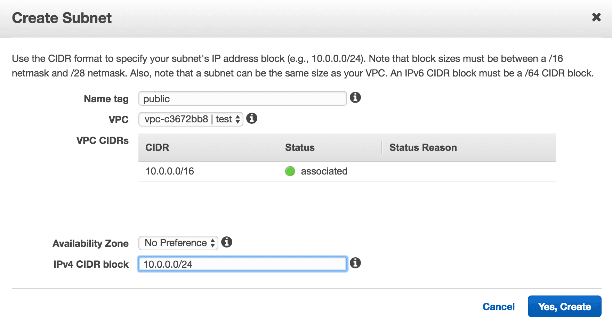
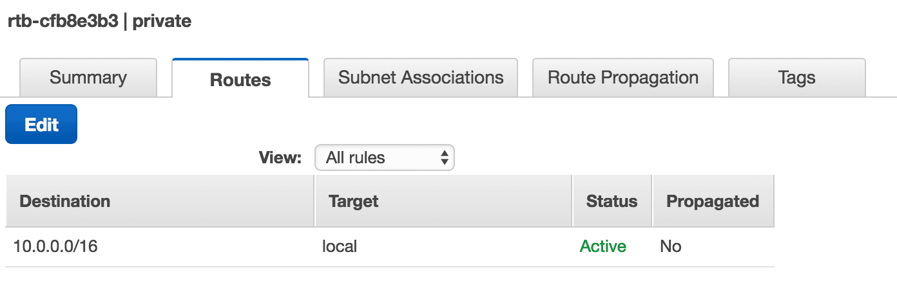

  

## Subnet
서브넷이란 Sub Network, 네트워크의 서브, 메인 네트워크를 쪼갰다고 보면 된다.  
AWS 관점에서 봤을 때 메인 네트워크는 [VPC](/2018/04/25/aws-vpc)라고 보면 된다.    

### Private Subnet
Private Subnet이란 **외부에서 직접적으로 접근이 불가능한 네트워크** 정도로 이해하면 될 것 같다.  

Private Subnet을 만드려면 AWS 콘솔에서 VPC 서비스로 이동해서 좌측 탭 중에 Subnets를 클릭하고, Create Subnet를 클릭한다.

  
Name tag를 정하고 어떤 VPC에 Subnet을 생성할 것인지 선택하면 된다.  
VPC가 Region에 생성되는 것에 반해 Subnet은 어떤 [AZ(Availability Zone)](https://docs.aws.amazon.com/ko_kr/AWSEC2/latest/UserGuide/using-regions-availability-zones.html#concepts-regions-availability-zones)에 생성될 것인지도 정해야한다.  
따라서 AZ가 다운돼서 장애가 발생하는 것을 방지하려면 Multi AZ로 Subnet을 생성해야하지만, 포스트에서는 단일 AZ로 진행하도록 하겠다.  
그리고 Subnet의 <a href="https://ko.wikipedia.org/wiki/%EC%82%AC%EC%9D%B4%EB%8D%94_(%EB%84%A4%ED%8A%B8%EC%9B%8C%ED%82%B9)" target="_blank">CIDR Block</a>을 지정해야하는데,
Subnet은 VPC의 Subset이기 때문에 VPC의 cidr block을 초과해서 정할 수 없다.  
또한 미리 생성한 Subnet의 cidr block과 겹쳐서도 안 된다.  
[ip class](https://ko.wikipedia.org/wiki/%EB%84%A4%ED%8A%B8%EC%9B%8C%ED%81%AC_%ED%81%B4%EB%9E%98%EC%8A%A4)를 참고해서 네트워크 규모에 따라서 cidr block을 설정하면 된다.

### Route Table
Route Table이란 어떤 IP 주소로 가야할 때 어디로 가야하는지를 나타낸 경로를 뜻한다.  
기본적으로 VPC를 생성하면 Main Route Table이 생성되고, 라우트 테이블을 설정하지 않은 서브넷들은 암묵적으로 메인 라우트 테이블이 설정된다.  

[Public Subnet](/2018/04/25/aws-public-subnet)에서 Main Route Table에 인터넷 게이트웨이를 붙였으므로 메인 라우트 테이블이 설정된 서브넷들은 외부에서 접근이 가능한 Public Subnet이 된다.  
private subnet이 되기 위해서는 인터넷 게이트웨이가 물려있지 않은 별도의 라우트 테이블을 만들고 서브넷을 설정해야한다.  

Route Table을 생성하려면 AWS 콘솔에서 Route Tables 서비스로 이동해서 Create Route Table 버튼을 클릭한다.  
Name tag와 생성할 vpc를 설정하자.  

  
