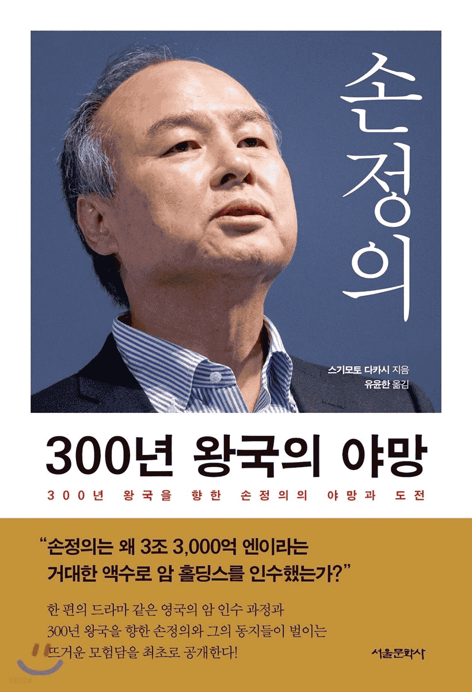

# [손정의 300년 왕국의 야망](http://www.yes24.com/Product/Goods/58196842)

평상시 책을 읽어야지... 읽어야지... 생각만하고 한 달에 한 권 읽기도 빠듯하게 살던 와중에 강제로라도 독서를 하게 만들기 위하여 독서모임에 신청하게 됐다.  
일과 집을 반복하던 일상이다보니 일이 인생에 있어 차지하는 비율이 많다보니 행복하게 일하고 싶다는 생각이 있었는데 어떻게 함께 일할 것인지를 주제로 해당 책을 읽기로 했다.  

아직은 책을 읽는 와중이라 어떻게 함께 일하는 것과 이 책이 무슨 관계가 있는지 크게 와닿지는 않지만, 창업을 생각하고 있다면 읽어볼만한 책이 아닌가 싶다.  

## 1장 다시 일어서다
해당 파트에서는 손정의가 ARM을 왜 인수했는지, 그리고 손정의가 후계자로 임명한 사람을 직접 내치게 된 히스토리가 주된 내용인 것 같다.

### 왜 ARM을 인수하였는가?
- 손정의가 구상하는 `비즈니스 모델에는 항상 독점체제를 만드는 발상`이 들어 있었다.
- 어떤 회사가 `플랫폼` 역할을 한다는 것은 `게임의 룰을 지배`하고 있다는 의미다. 
- `어떤 시점과 시장점유율을 기점으로 산출량이 기하급수적으로 증가하는 수확체증형 성장모델`을 따른다. 
- 더욱 중요한 것은 `어떤 시점이 되기 전`에 `플랫폼을 손에 넣어야한다`는 사실이다.
- 손정의가 `본업을 바꿀 때마다 습관적으로 하는 말`이 있다. 바로 `패러다임 시프트`다.

손정의가 중요하게 생각하는 건 플랫폼, 그리고 독점인 것 같다.  
누구에게나 제공하는 플랫폼을 만들게 되면 사용하는 사람이 많다보니 그 안에서 할 수 있는 사업은 매우 무궁무진해지는 것 같다.
하지만 그 플랫폼을 개나소나 만들 수 있는 게 아니라 엄청난 기술력을 바탕으로 만들다보면 아무나 쉽게 접근하지 못하기 때문에 독점할 수 있게 되는 것 같다.  
결국 누구나가 쓰지만 아무도 따라할 수 없기 때문에 해당 분야에 있어서는 엄청난 위치에 다다를 수 있고 손정의는 그 점을 굉장히 중요하게 보는 것 같았다. 
그리고 이미 독점 플랫폼이 된 거대한 기업에 투자하기 보다는 그럴만한 싹이 보이는 기업을 먼저 선점해서 가는 게 투자 수익을 더 극대화할 수 있다.  

이러한 관점에서 봤을 때 손정의는 ARM을 새싹 시절인 06년(스마트폰이 나오기 전)부터 바라보고 미리 기업 조사도 싹 다 끝마쳐놓고 10년 간 짝사랑을 하다 결국 인수를 하게 되었다.  
그 히스토리를 보면
1. 손정의는 모바일 인터넷 시대(플랫폼)가 열릴 것이라고 바라보았다. (그 근거에서는 스티브 잡스와의 만남에서 잡스가 아이폰을 암시하는 듯한 머신을 만들 것 같은 뉘앙스를 풍겼기 때문도 있다.)
2. 하지만 모바일은 매우 작은 장비에서도 인터넷이 돼야 플랫폼을 구축할 수 있기 때문에 저전력이 중요하다.
3. 저전력에서 성능을 낼 수 있는 반도체를 설계하는 건 당시 PC CPU의 최강자인 인텔이 아닌 작지만 모바일에 필수적인 부품을 설계하는 ARM이다.
4. 이런 측면에서 보면 손정의가 ARM을 일찍이 눈여겨본 점이 이해가 됐다.

ARM도 모바일 시장에서 독점 구조를 가져가게 된 배경이 애초에 거대 시장(PC)은 인텔이 꽉 잡고 있다보니 거들떠보지도 않고, 틈새시장인 모바일을 집중 공략하였다.  
현재 PC에서 모바일로 패러다임 시프트를 내다보고 한 결정이 아닐까?  
물론 어느정도 아다리가 맞은 것도 있었겠지만 지금 당장보다 먼 미래를 바라봤기 때문에 이런 격차(독점 구조)를 만들 수 있게 된 게 아닐까 싶다.

### 이 장의 제목이 왜 '다시 일어서다'일까?
이 장의 후반부에는 손정의가 거의 후계자로 생각했던 인물에 대한 스토리가 나온다.  
외부에서 해당 인물을 스카웃 해오고, 한번에 서열정리까지 끝내버려서 화끈한 손정의 식 인사채용에 대한 내용도 나온다.  
하지만 내부 인사들은 손정의 방식이 아닌 후계자의 방식을 마음에 들어하지 않은 사람이 많았고 다른 사람들로부터 신임을 얻지 못한다.  
원래대로라면 후계자가 손정의의 뒤를 이어받게 될 예정이었지만, 손정의가 ARM을 인수하면서 본인이 좀 더 기업을 경영하고 싶다는 의견을 내비치자
야망이 컸던 후계자도 더 이상은 기다리지 못한다며 회사를 나가게 되었다.  

아마 그대로 후계자가 회사를 경영했다면 내부 반발에 의해 많은 임직원들이 퇴사를 하고 소프트뱅크가 기존과 많이 달라지거나 흔들리지 않았을까? 하는 생각이 든다.  
저자도 그걸 위기로 생각했었는지 다시 손정의 방식으로 운영을 하게 돼서 소프트뱅크가 다시 일어서게 된 계기가 됐기 때문에 제목을 그렇게 지은 게 아닐까? 싶었다.

## 2장 300년 왕국의 야망
해당 파트에서는 손정의가 왜 300년이라는 기준을 세웠는지, 그리고 손정의가 어떤 기준으로 기업에 투자하는지가 나온다.

### 왜 300년일까?
* 에도 막부는 270년 간 존속했다. 손정의는 일본 역사상 가장 오래 존속했던 에도 막부를 넘어 '300년 왕국'을 세우고 싶은 야망이 있었다.
* 마쓰시타 전기산업(현 파나소닉)은 '대량으로 물건을 만들어 사람들이 가치를 느낄 수 없을 정도로 싸게 제공하면 풍요로운 사회'를 만들 수 있다는 사명을 이야기했다.  
이 중요한 사명을 달성하기 위한 시기를 25년(건설시대 10년, 활동시대 10년, 사회에 대한 공헌시대 5년)으로 구분지었다.  
25년을 한 단위로 하여 열 번 반복하여 250년 동안 회사가 성취해갈 비전을 사원들 앞에서 연설했다.

손정의는 과거 역사로부터 뭔가를 배우는 것을 좋아하는 듯 보인다.  
과거 에도 막부 시절 270년 동안 존속했던 문화?가 존재했기 때문에 그 주기를 토대로 300년을 선정한 것으로 보인다.
그리고 실제로 동로마 제국 등 실제로 300년 이상 존속한 조직이 존재했기 때문에 본인도 가능할 것으로 보았고, 
기업의 수명이 경영인의 수명보다 길 수도 있다는 생각에 이런 생각을 품게 되었다고 한다. 

### 어떤 기준으로 기업에 투자할까?
- 다양성: 서로 다른 DNA가 섞여야만 회사도 강해진다.
- 군전략: `서로 다른 브랜드와 비즈니스 모델을 지닌 기업군`이 `자본 관계와 손정의식 동지적 결합`을 통해 `서로 다른 독립된 상태에서 결속을 다지는 상태`
- 얼핏 서로 아무런 관계도 없어 보이는 기업들을 모아 무리짓고 다음 세대 승리자를 만들고 싶은 것이다.
- 30년은 몰라도 300년을 내다보면 단독 브랜드나 단독 비즈니스로는 안 됩니다.
- 300년 동안 존속할 기술은 없다. 한가지 기술에 의존하는 조직은 영속할 수 없다.
- 하나의 투자는 군전략을 실행하기 위한 수단이다.

손정의는 300년을 존속할 기업에 필요한 것은 다양성이라고 보았다.  
한 가지에만 집중하다보면 해당 사업은 사장이 될 수 있어서 주기적인 패러다임 시프트를 해야한다.  
또한 전혀 다른 비즈니스 모델끼리 모였을 때 색다른 시너지를 내기도 하기 때문이다.  

이 역시도 과거 역사를 통해서 배웠는데
1. 과거 300년을 알아야 미래 300년을 설계할 수 있다.
2. 과거 300년을 보면 농경사회에서 산업혁명으로 인해 기계에 의한 큰 패러다임 시프트가 발생했다.
3. 손정의는 미래에는 여러 번의 패러다임 시프트가 있을 것을 예상했다. (컴퓨터(정보)에 의한 패러다임 시프트)
4. 명마는 우수한 품종에서 교배를 통해 우수한 종을 낳는다.
5. 하지만 순수혈통의 기준을 점점 더 까다롭게 하자 점점 경마 성적이 줄어들었다.
6. 즉, 서로 다른 DNA가 섞여야 좀 더 나은 결과물을 낼 수 있다.

다양한 DNA들이 섞여야 좀 더 나은 성적을 낼 수 있다는 점에서 손정의는 다양성이야말로 300년 동안 기업을 존속할 수 있게 만든다고 생각하였다.

### 손정의 식 인재 채용
인재를 바로 알아보는 것도 중요하지만 사람의 마음을 움직이게 하는 것도 중요하다.
손정의가 인재를 채용할 때 이직할 마음이 없던 사람을 `자네를 이제야 겨우 찾아냈어`라는 말 한 마디로 사람 마음을 움직이게 하였다.  
물론 이런 입에 발린 말은 누구나 할 수 있겠지만 평상시 그 사람의 인품이 쌓여있어야 그런 말에도 진정성 있게 느껴지는 것 같다.

### 비전의 힘
- 노부나가는 `영락통보`를 가문의 문장으로 택함으로써 `기술과 금융을 모두 중시`한다는 것을 보여주었습니다.
- 손정의가 또 주목한 것은 `자신이 추구하는 바를 도장이나 문장으로 알아보기 쉽게 표현해 세상에 알리는 기술`이었다.  
노부나가는 전투에 이기기 위해 전투에 참여하지 않는 관료들에게 철포를 모아들여 대규모 철포부대를 만들고, 무기를 거래하는 무역상으로부터 화약을 확보하여 `화약 무역의 플랫폼`을 확보하였다.
또한 철포를 바라보는 눈도 젊은 시절부터 화승총을 가지고 놀았기 때문에 얻게 되었다고 생각했다.

비전이 중요하다 뭐다~ 하는데 손정의는 비전이 가지는 힘을 과거 역사로부터 또 배운 것 같다.
비전을 뭘로 정했냐~에 따라서 풀고자하는 문제가 결정되기 때문에 비전이 중요하다고 생각하는 게 아닐까 싶다.  
또한 젊었을 때부터 화승총을 가지고 놀아서 철포를 선점한 노부나가처럼 일찍이 최신 기술을 라이벌보다 빨리 알아차리기 위해 일찍이 아이폰을 손에 넣고 간부에게 아이폰을 가지고 놀라고 하는 등  
과거의 역사를 통해 현대에서는 그 역할을 하는 것이 무엇일까 학습해내는 능력이 대단해보였다.

## 3장 깃발을 올리며
해당 파트에서는 손정의가 사업을 시작하는 부분부터 얘기가 전개된다.  
정말 우여곡적이 있었지만 수많은 은인을 통해 그 역경을 헤쳐나가는 걸 보고 진짜 인맥(네트워크)가 중요하다는 걸 깨달았고, 언제든 그런 사람들 앞에서 본인의 비전을 설명할 수 있어야 기회를 잡을 수 있다는 얘기를 하고 있다.

### 귤 상자 위에서 한 꿈같은 이야기
남들이 생각할 때는 허풍일지도 모르겠지만 그정도로 큰 꿈을 입에 달고 살면 그에 걸맞는 목표도 생기고 그것보다 더한 목표도 달성할 수 있는 것 같다.
손정의가 두부 세듯이 1조, 2조를 벌고 싶다는 말장난이 담긴 농담을 여러 사람들에게 입버릇처럼 했는데 이처럼 무의식 속에 이런 목표들이 자리잡고 있어야하는 것은 아닐까?

### 깃발을 올리며
손정의는 `양이 질로 변한다는 믿음`이 있다고 하는데 처음에 사업을 시작할 때도 무수한 아이템을 일단 펼쳐놓고 생각을 했다고 한다.
그리고 그 중에 미래에 유망한 `PC`에 집중했고, PC에 있어서 소프트웨어는 매우 중요하지만 그걸 유통하는 건 잡지사에 카세트 테이프를 납품하는 수준이었다고 한다.  
이렇게 손정의는 정말 중요하지만 지금은 그 산업이 빛나지 않아 아무도 하고 있지 않은 `소프트웨어 유통망`을 공략하기로 한다.  
미래에 유망한 걸 보는 것도 중요한데 그 중에서도 아무도 하지 않고 있는 걸 빠르게 눈여겨 보는 게 중요한 거 같다.  
마치 피터틸의 제로 투 원에서 `당신이 정말 중요하다고 생각하는데 아무도 그렇게 생각하지 않는 것은 무엇입니까?`의 전형적인 예가 아닐까 싶다.

그리고 `새로운 산업에 도전하려면 그에 걸맞게 사람과 정보가 모여야`만 사업을 제대로 키울 수 있다고 한다.  
그런 걸 보면 실리콘밸리나 판교/강남에 왜 스타트업들이 그렇게 몰리는지 이해가 된다.

### 기습작전
손정의가 소형 기업 치고 컨퍼런스에서 대규모 기업급의 돈을 쏟아부으며 화려한 부스를 만들어서 회사를 널리 알리는 데에는 성공을 했다고 한다.  
하지만 소프트웨어 유통 회사이다보니 실질적으로 고객을 응대할 수 있는 건 소프트뱅크가 아닌 각 소프트웨어 제작 회사(소프트하우스라고 불리우던)들이 응대를 해야만 했다.  
해당 소프트웨어에 대해 가장 잘 아는 건 유통 회사가 아닌 실질적인 제작사이기 때문이다.  
따라서 소프트뱅크는 많은 돈을 쏟아부었지만 결국 큰 실패를 거두게 된다.

### 조신전기와 허드슨, 그리고 록펠러
손정의는 하드웨어인 PC 판매업체인 조신전기, 그리고 대형 소프트웨어 제작사인 허드슨 두 회사를 상대로 독점계약을 따내게 된다.  
아직 판매실적도 없는 회사에게 큰 회사들이 이렇게까지 계약을 할 수 있었던 건 그의 눈빛, 열정, 그리고 명확한 목표가 아니었을까 싶다.  
어디서든 본인의 사업에 대한 비전을 설명할 수 있고 목숨을 건 각오로 임하다보니 그 진정성에 설득이 돼서 저런 계약을 따낸 게 아닐까 싶다.  
그러면서 강의 상류(하드웨어)부터 하류(소프트웨어)까지 독점하여 록펠러가 석유 시장에 있어서 플랫폼을 만들었듯이 손정의는 소프트웨어 유통에 있어서 플랫폼을 만들게 되었다.

### 각오는 단단히 했는가
소프트뱅크가 융자를 위해 은행을 찾아갔고 은행에서는 내부 관리자들의 토론이 이어지게 된다.  
하지만 PC에 대해 잘 모르는 은행 관리자들이 토론해봤자 생산적인 토론은 이어지지 않았고 그 때 한 젊은 사원이 `PC가 미래 유망업종이 될 거라는 사실을 모르는 건 일본의 뒤처진 은행원(자신들) 밖에 없다`는 패기있는 대답을 하게 된다.  
이 얘기를 보고 `나도 미래에 뒤처지지 않게 열심히 노력해야겠다`라는 생각과 `자기 자신에 대한 객관화, 즉 내가 뭘 알고 모르는 지를 명확히 인지`하는 게 즁요한 것 같았다.

그리고 손정의의 은인인 샤프의 사사키가 본인의 퇴직금과 자택을 담보로 할테니 손정의에게 융자를 내달라는 부탁을 할정도로 손정의는 정말 주변에 은인들의 덕을 많이 봤다.  
그 은인들을 만날 기회를 만들기 위해 끊임없는 노력을 해야하고 기회를 잡기 위해 평상시 본인이 어떤 사람이 되어야하고 어떤 목표를 가지고 일을 해야하는지를 끊임없이 생각해야하는 것 같다.

## 4장 위기
해당 파트에서는 손정의와 소프트뱅크의 위기에 대해 다룬다.

손정의가 시한부 판정을 받고 입원하게 되어 후계자를 임명하게 되는데 이 때 잘못된 판단으로 인해 오모리란 사람을 후계자로 임명하게 된다.  
그는 전문 경영인으로써 손정의와 매우 다른 스타일로 인해 주변인들과 마찰을 겪게 되고 주변인들로 자리를 점차 채워나가게 된다.  
그 과정에서 기존 구성원들이 이탈하게 되지만 그 와중에 미야우치라는 든든한 동료도 얻어서 꼭 단점만 있었던 건 아니었다.  

시간이 지나 의학이 발전하여 불치병을 치료하고 다시 원래의 자리로 돌아온 손정의 앞에 또 다른 위기가 닥치게 된다.  
소프트웨어 유통 기술을 그대로 들고 기존 구성원들이 빠져나간 것이다.  
손정의는 이 때 '왜 그들은 자신을 떠나는 것일까' 고민하였지만 결국 '리더의 자질이 부족'했기 때문이라는 것을 깨닫게 된다.  
그들에게 비전을 제시하지 못했기 때문에 그들이 그정도에 만족하고 그대로 기술을 들고 날랐을 것이기 때문이다.  
동지적 결합, 즉 뜻을 같이 하는 것인데 그것을 하지 못했기 때문이다.
그리고 소프트윙 사태를 통해 내실을 다지는 계기가 되어 오히려 나중에 맞을 매를 미리 대비했다는 얘기도 있다.

그리고 올바른 방향으로 나아가는 데는 지도와 나침반이 중요하다.
손정의도 PC/소프트웨어에서 지도와 나침반을 얻기 위해 빌게이츠를 만나 빌게이츠가 주로 보는/구독하는 잡지에 대한 정보를 얻게 되었다.  
이렇듯 한 분야의 대가가 하는 행위를 따라하다보면 어느 정도 올바른 방향을 갈 수 있는 것 같다.

## 5장 스트리트 파이터
해당 파트에서는 손정의의 든든한 동료, 스트리트 파이터에 대한 얘기를 다룬다.

손정의가 아무리 천재라고 해도 혼자서 모든 걸 다 할 수는 없다.  
각 분야의 전문가의 도움이 절실하다.  

그리고 이런 동료들은 그냥 앉아만 있는다고 해서 툭 내려오는 게 아닌 거 같다.  
본인의 인맥(네트워크)가 정말 중요한 거 같다.  
뜻 밖의 장소/인물에게서 좋은 동료를 소개 받기도 하기 때문에 평소 인간관계를 소홀히 하면 안되는 것 같다.

누군가는 그 일이 아니면 자신이 죽어버리고 말 것 같은 일을 하기 위해 소프트뱅크로 이동했다고 한다.  
나도 나중에는 돈이 아닌 정말로 하고 싶어 미치겠는 그런 일을 해보고 싶다.  

그리고 악마의 대변자(devil's advocate)라고 해서 '모두가 찬성하는 아이디어에 반론을 던져서 토론을 활성화시켜 다른 방안을 모색하는 발상'도 인상 깊었다.  
여기서 핵심은 '그냥 무조건 반대의견을 내는 게 아니라 좀 더 나은 아이디어를 끌어내기 위한 반론을 던지는 것'이다.

## 6장 대전투
해당 파트에서는 브로드밴드(인터넷 통신사) 사업에 뛰어든 소프트뱅크의 이야기가 나온다.  
후발주자에서 어떻게 거대기업(정부의 빽을 갖고 있는)을 상대로 덤비게 되었는지, 얼마나 고군분투 했는지 나오게 된다.

물론 엄청나게 어려운 미션이라 손정의가 직원들에게 엄청 강압적으로 찍어 누르듯이 명령하여 일을 시키는 것도 있다.  
몇몇은 근처 숙소에서 거의 합숙하듯이 일을 한다.  
나보고 그렇게 하라고 하면 할 수 있을까? 싶다.  
공감되는 일이면 할 수 있겠지만 공감이 되지 않는 일인데 단순 회사의 사활이 걸렸다고 명령조로 시키는 일을 할 수 있을까 싶다.  
나중에는 인력이 부족하자 다른 사업부에 있는 인원들도 뽑아서 원래 하던 업무와 쌩판 다른 업무(본인 직군에 맞지도 않는)를 시키는 걸 보면 나는 퇴사했을 거 같다.  
개발하려고 들어왔는데 영업하라고 시키면 안 할 거 같다. (거기에 더해 강압적으로 시킨다면...)
나는 일을 할 때 공감대를 형성해야 동기부여가 되어 일의 효율이 나온다고 생각하고 있다.  
하지만 그 당시 소프트뱅크의 상황은 공감대를 사면서 일을 할 정도로 여유가 없었는지 내가 보기에는 좀 강압적으로 진행된 경향이 없잖아 있어보인다.

물론 리더의 선견지명이 있어야 그런 명령도 할 수 있는 것 같다.  
손정의는 7할 이상 성공 가능성이 보일 때 승부수를 던진다고 하는데 지금 상황이 7할인지 아닌지 객관적으로 판단하기 힘들기 때문에 그건 리더가 '머리 터질 때까지' 생각해야한다는 걸 보면 손정의는 직접 머리 터질 때까지 생각하고 명령들을 내린 게 아닐까 싶다.

그리고 손정의가 '안 되는 이유따윈 듣고 싶지 않아'라고 얘기한 부분도 인상적이었다.
회사에서도 '왜 되는 이유가 아니라 안 되는 이유만 자꾸 말하느냐'라는 피드백을 받았던 팀원이 있었다.  
그걸 보고 우리는 어떻게든 되게 만들어서 성장을 만들어내야하는데 계속 방어적인 태도로 임했던 건 아닐까 싶다.
된다고 믿어도 될까 말까인데 처음부터 안 된다고 마음을 먹고 상대방의 말을 받아들이기 보다는 일단 어떻게 하면 가능하게 만들지부터 고민을 해보는 습관을 만들어야겠다.

그리고 손정의가 돈이 엄청 많아지자 '인생에서 가치 있는 게 무엇일까'에 대해 고민하게 되었다고 한다.
나도 어느정도 동의한다.
지금 당장은 돈을 크게 쓰지 않다보니 사실 돈이 막 부족하다는 생각을 하지는 않는다.  
다 미래에 대한 걱정 때문에 계속 돈을 더 벌고 싶다는 생각을 하는 것이다.  
하지만 평생 쓰고도 남을 돈이 있다면? 그때부터 난 뭘 위해 사는 걸까?에 대한 고민을 해봐야한다.
아직은 돈 때문에 미래에 대한 불안이 남아있는 상태라 돈을 위해 사는 것 같은 느낌이 든다.  

손정의는 오히려 위기를 맞자 살아있다는 감각이 돌아왔다고 한다.  
나는 그정도까지는 아닐 거 같고, 돈은 어느정도 쌓아놓고 정말 돈을 위한 게 아닌 인생에 가치가 있을 만한 일을 해보고 싶다.  
지금 당장은 크게 떠오르지 않지만 아마 세상을 바꾸거나 사람들의 행동 습관을 바꿀만한 서비스나 플랫폼을 만드는 일을 하며 가슴이 설레지 않을까 싶다.

## 7장 마지막 기회
해당 파트에서는 모바일 산업에 뛰어든 소프트뱅크 이야기를 한다.  
일본의 모바일 통신사 시장은 3강 체제로 가고 있는데 이 때 일본 보더폰 법인을 인수하지 않으면 3강의 자리로 갈 수 없는 타이밍이었다.  
이미 브로드밴드(야후 bb) 사업으로 출혈이 큰 소프트뱅크였지만 그건 모바일 인터넷으로 패러다임 시프트를 위한 초석에 불과했다.  
그를 위해 모바일 통신사 시장으로 들어가는 건 불가피 했고 3강 안에 들기 위해서는 보더폰 인수라는 마지막 기회를 통해 어떻게 소프트뱅크가 모바일 시장에도 안착했는지 얘기를 하고 있다.

이 장에서 인상 깊었던 건 '지는 습관을 청산'한다는 것이다.  
우리는 만년 업계 3위니까 뭐 1위한테 지는 건 당연하지 라고 생각하는 것부터가 습관이라는 것이다.  
어떻게든 이기고 어떤 방법으로라도 1위를 탈환하면 된다. (1위 기업을 산다던지 해서)  
그런 패배의식이 깔려있기 때문에 뭘 해도 안 되는 것도 있는 것 같다.

그리고 보더폰 얘기도 흥미로웠다.
그들 개개인은 매우 훌륭한 엘리트이지만 '잘해보겠다고 연구하며 달려드는 자세'는 전혀 없었다고 한다.  
'나는 엘리트니까 그런 허드렛 일(마음가짐)은 안 해~'라는 식이었던 것 같다.
자존심을 내려놓고 본격적으로 임해도 될까 말까인데 그런 일에는 신경도 쓰지 않고 있다보니 매출이 매우 부진했던 것 같다.
그래서 이런 사원들의 의식 개혁을 시도했다고 한다.

## 8장 야후족
해당 파트에서는 어떻게 해서 야후 제팬을 설립하게 되었는지가 나오게 된다.  
그리고 야후 본사와 달리 야후제팬은 어떻개 살아남았는지도 나오게 된다.

여기서 인상 깊었던 것은 야후제팬의 경영체계(모바일을 등한시 하는)에 불만을 느끼고 퇴사하는 무라카미의 스토리이다.  
이 때 손정의는 '자신의 눈에 보이는 곳에 있어라'라는 조건을 달고 퇴사를 허락한다.  
아마 그 속 뜻은 '언제든 다시 돌아오라'는 내용이지 않았을까 싶다.
실제로 소프트웨어의 후게자를 양성하는 프로그램에서 외부인으로써 야후제팬에 대한 비전인가 뭐시기를 발표하는 프레젠테이션에서 야후제팬의 경영체계를 아주 신랄하게 깐다.  
그걸 토대로 야후제팬은 경영체계를 개편하고 무라카미는 복귀에 성공한다.

이 복귀하는 것에도 흥미진진한 스토리가 있다.  
원래 야후제팬을 퇴사하고 창업을 계획하고 있다가 복귀를 하게 된 거다.  
파트너가 '자신과의 동업은 언제든 할 수 있지만 야후제팬을 일으켜세우는 건 지금이 아니면 힘들다'고 흔쾌히 허락했다.  
그리고 본인도 추후 야후제팬에 합류했다.  

근데 나는 본인이 하고자 하는 사업의 의지가 강하지 않았기 때문에 뜻을 굽힌 게 아닐까 싶다.  
나는 정말 하고 싶은 사업이 있는데 동업자가 떠난다고 하면 바짓가랑이를 붙잡을 거 같다.
초기에 사람 한명한명이 소중한데 그 사람이 떠난다는 건 그냥 처음부터 본격적으로 임할 생각이 크지 않았기 때문이 아닐까 싶다.

## 9장 국난
4장의 위기에서는 소프트뱅크 내부로 인해 맞게 된 위기를 얘기한다면 국난에서는 그것보다 스케일이 큰, 외부에 의해 발생한 위기들을 다룬다.

우선 08년도 세계 금융 위기 때문에 소프트뱅크도 그 여파를 피해갈 수 없게 된다.  
외부에서는 소프트뱅크의 경영상황에 태클을 걸고 주가는 계속해서 떨어지게 된다.  
이 때 소프트뱅크는 정면돌파를 감행한다, 그것도 아주 혹독하게
원래 하기로 했던 결산보고 보다 1주일 먼저 발표함으로써 주위의 불안을 잠식하기로 하고
그 보고의 내용도 아주 투명하고 솔직하게 공유한다.
본인들이 가지고 있는 리스크까지 공개하는 수준으로 말이다.
또 여기서 해당 리스크를 만든 장본인이 책임감을 느끼고 사퇴를 하겠다고 하자 그의 상사는 '그런 소리 할 시간에 위기를 타개할 생각부터 해라'라고 한다.
이런 상사/동료와 함께 일하면 정말 일할 맛이 날 거 같다.  
그냥 퇴사하는 건 책임감 없이 도망치는 꼴이 된다. 똥은 싸는 게 문제가 아니라 치우면 되고 앞으로 똥을 싸지 않기 위한 대비책을 마련하는 게 오히려 더 책임감 있는 태도가 아닐까 싶다.

그리고 11년도에 동일본 대지진을 통해서 손정의는 에너지(전기)에 대한 큰 깨달음을 얻는다.
제 아무리 강한 통신망을 가지고 있다 하더라도 인프라(전기)가 무너지게 되면 아무것도 할 수 없게 된다.
그로 인해 여러 우회로(한 쪽이 박살나도 다른 쪽을 쓸 수 있도록)를 만들어두기 위해 한국/중국/러시아와 협력해 전기망을 까는 사업을 하게 된다.

또 동일본대지진을 통해 인생이 참 덧없다고 느낄 수도 있는데 그렇기 때문에 한 번 사는 인생 후회없이 살아야겠다고 생각한 직원의 마인드도 참 인상 깊었다.
똑같은 일을 겪고도 사람마다 느끼는 게 다르고 더 긍정적인 방향으로 사고하도록 나도 노력해야겠다.

## 10장 콜럼버스
해당 파트에서는 일본이 미국에 모바일 사업을 진출하기 위해 스프린트를 매수하고 운영한 이야기가 나오게 된다.

스프린트는 AT&T, 버라이즌 뒤에서 만년 3위를 차지하고 있는 약세의 업체였다.  
막상 인수하고 보니 상황은 더욱 심각했다.  
심지어 직원들은 적자를 보는 것에 익숙해져 열심히 할 생각은 하지 않고 퇴근시간만 바라보는 좀비 같았다.
익숙함이란 게 얼마나 무서운 것인지 보여주는 것 같았다. 끝없이 comfort zone을 벗어나는 노력을 해야하는 것 같았다.

그와중에 미야카와는 스프린트를 위해 미국으로 파견을 가게 된다.  
그리고 점점 스프린트를 살릴 방법이 나오고 있는 와중에 일본 소프트뱅크에서는 스프린트를 다시 매각할 계획을 추진 중이란 소리가 들린다.  
미야카와는 곧장 일본으로 날아가 사건의 진위를 파악하고 손정의는 '본인이 잘못생각해서 스프린트를 인수했다고 매각을 해야겠다'라고 말하게 된다.  
이에 대고 미야카와는 '본인이 손정의를 잘못 본 것 같다', '예전의 손정의였다면 남들이 안 된다고 해도 혼자 열정을 불사르며 어떻게든 되게 만들었다'며 크게 실망을 하게 된다.  
손정의는 본인의 실수를 인정하고 스프린트를 되살리는데 동참하게 된다.

위 사례를 통해 주변에 얼마나 좋은 사람이 있는 게 중요한 건지 다시 한 번 중요한 거 같다.
저 때 손정의가 잘못된 판단을 내렸으면 다시 미국시장으로 진출하는 건 더더욱 힘들었을지 모른다.  
하지만 저런 쓴소리를 해주는 동료들이 있기 때문에 올바른 결정들을 내릴 수 있었던 거 같다.

## 11장 타로
해당 파트에서는 소프트뱅크가 로봇, AI 시장에 뛰어든 얘기를 하게 된다.

이 파트에서는 손정의가 도미자와를 6시간이나 털었던 것이 인상이 깊었다.  
그리고 정작 털릴 것 같이 자료를 빠른 시간 내에 준비할 때는 오히려 털리지 않았다.  
6시간 털렸던 이유는 도미자와가 최선을 다하지 않았기 때문이라고 보여진다고 했다.  
오히려 데이터가 허술할지 몰라도 자료 준비를 위해 최선을 다한 모습을 보여줬을 땐 오히려 칭찬을 해줬다고 한다.
그리고 6시간동안 턴 것도 기대하는 바가 있기 때문에 화를 내지, 기대하는 바가 없으면 화도 안 낸다는 것이다.  
아마 미운놈 떡하나 더준다고 안 미운놈한테는 가차없이 채찍질을 해서 성장으로 이끄는 인물로 보였다.

그리고 여기서 나오는 혼다 소이치로 얘기도 무지 흥미로웠다.
혼자의 지칠 줄 모르는 '흥미, 탐구성, 그리고 감동할 줄 아는 마음'이 혼다를 계속 성장시키는 힘이라고 정의했다.
나도 이 말에 매우 동의한다.
개발자를 한다고 해도 호기심이 강하면 강할 수록 더 깊게 파보고 본인의 것으로 쉽게 만들 수 있다.  
나도 궁금한 게 있으면 직성이 풀릴 때까지 파보고 도대체 저건 왜 그런 걸까? 혼자 생각하면서 생각을 정리하곤 한다.

