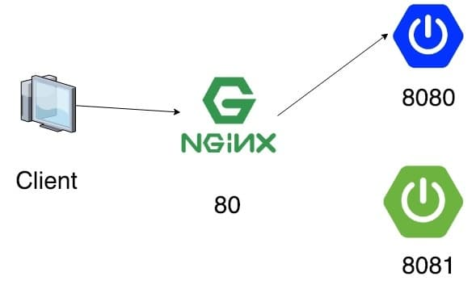
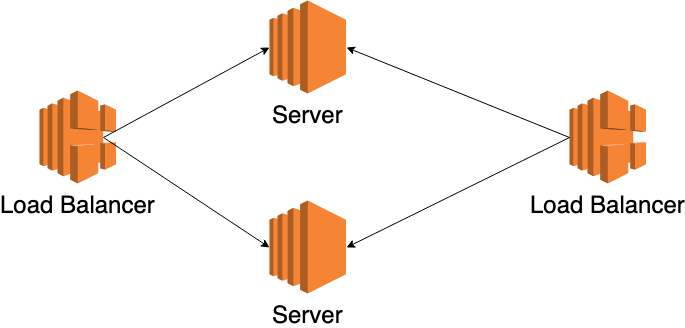
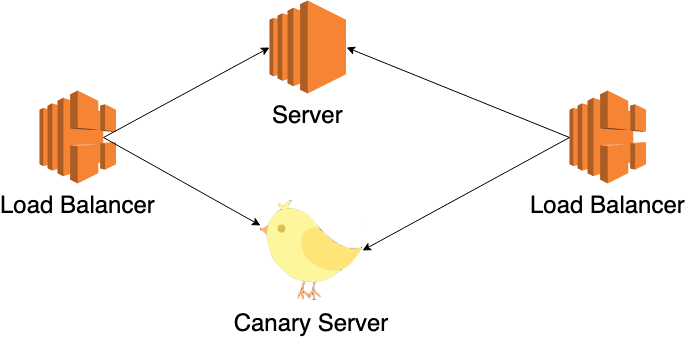

해당 포스트에서는 nginx와 spring boot를 예로 들었지만 apache + Node.js 등등의 조합으로도 충분히 가능하다.  
기본적으로 nginx는 설치돼있고, 기본 설정을 그대로 유지한 상태로 시작하겠다.  
nginx 버전이나 OS 등등의 환경에 따라 설정 파일의 내용은 다를 수 있다.  
포스트에서는 linux OS에서 nginx 1.15.12를 설치해서 진행했다.

## 무중단 배포
실제로 우리가 간단하게 서버를 배포하는 시나리오를 생각해보자.
1. 80포트(혹은 다른 포트)에 우리의 서버를 띄운다.
2. 새롭게 배포할 내용이 있다고 하면 포트가 충돌나면 안 되기 때문에 서버를 다운시킨다.  
3. (옵션) 유저의 이탈을 방지하고자 공사중 이미지를 띄운다.  
4. 80포트(혹은 다른 포트)에 새롭게 배포할 서버를 띄운다.

만약 서버가 뜨는데 30초가 걸린다고 하면 최소 30+@초만큼 다운타임(유저에게 서비스가 불가능한 시간)이 발생한다.  
현대의 어플리케이션이라면 유저에게 최상의 경험을 제공해주기위해 이런 다운타임이 없는 무중단 배포를 지원해야한다.  

### 필요 조건
**두 대 이상의 서버(혹은 서버 어플리케이션을 두 개)를 서비스해야한다.**  
다운타임이 발생하지 않으려면 실제 서비스 중인 서버와 새롭게 배포한 서버가 동시에 존재해야한다.  
비용을 줄이려면 배포할 때만 새롭게 서버를 띄우고 배포가 완료된 후에 기존 서버는 죽이면 된다.

### Rolling Deployment

HA(High Availability)을 위해 프로덕션 환경은 2대 이상의 서버로 구성한다.  
이런 환경에서 배포하기 가장 간단한 방법이 바로 Rolling 배포이다.  
시나리오는 다음과 같다.  
1. 서버 1을 로드 밸런서에서 뺀다.  
2. 서버 1에 배포한다.  
3. 서버 1을 다시 로드 밸런서에 넣는다.  
4. 서버 2를 로드 밸런서에서 뺀다.  
5. 서버 2에 배포한다.  
6. 서버 2를 다시 로드 밸런서에 넣는다.

위와 같이 하면 다운타임 없이 배포가 가능하다.  
배포해야할 서버가 너무 많다면 1대씩 배포하면 너무 느리니 N대 단위로 배포하기도 한다.  
하지만 배포가 끝나기 전까지는 누구는 이전 버전을 서비스 받고, 누구는 신규 버전을 서비스 받는 등의 문제가 존재한다.  
또한 1대에 배포하는 거보다 최소 2배 이상 느리다. (아무리 못해도 2번 이상의 배포가 진행되기 때문에)

### Canary Deployment

광부들이 광산에서 유독가스가 나오는 것을 알아내기 위해서 가스에 민감한 카나리아(조류)를 광산 안에서 키웠다고 해서 유래된 배포이다.  
소수의 유저(혹은 사내)만 사용하는 환경(Canary 환경)에 신규 버전을 배포하고 문제가 없다고 판단됐을 때 다른 모든 서버에 배포한다.  
Canary 환경은 뭐 QA Phase가 될 수도 있고, 랜덤하게 유저를 Canary 환경으로 라우팅시킬 수도 있고 구현하기 나름이다.  

### Blue/Green Deployment
  
**실제로 서비스 중인 환경(Blue)**와 **새롭게 배포할 환경(Green)**을 세트로 준비해서 배포하는 방식을 말한다.  
장점으로는 새롭게 배포할 환경에만 배포하면 되기 때문에 배포 속도가 매우 빠르다. (서버가 N대라 하더라도 N대의 Green 서버에 동시에 배포하면 되기 때문에)  
또한 언제나 Green 환경이 떠있기 때문에 만약에 잘못된 버전으로 배포를 했을 경우에 신속하게 롤백이 가능하다. (수 백대의 서버에 거의 수 초 이내에 롤백이 가능함.)  
물론 언제나 Green 환경이 떠있어야하기 때문에 비용이 두 배로 든다는 단점도 있다.  
또한 Green 환경에서 Scheduler와 같은 배치성 Job이 도는 경우에 레거시 버전으로 돌기 때문에 장애가 발생할 가능성도 존재한다.  
(이럴 때는 배포를 연속적으로 두 번 해서 Blue와 Green의 버전을 일치시키는 것 이외에는 딱히 떠오르지 않는다 ㅠㅠ...)

이렇게 설명하면 이해가 잘 안 가니 그림과 함께 이해해보자.  
(그림에서는 Nginx를 프록시 서버로 사용했지만 Apache 등등을 사용해도 무방하다.  
또한 하나의 서버에 두 대의 어플리케이션을 띄우는 걸로 설명했지만 별도의 서버에 하나의 어플리케이션만 각각 띄워서 구성해도 된다.)

더 자세한 설명은 [Martin Fowler가 쓴 블로그 글](https://martinfowler.com/bliki/BlueGreenDeployment.html)을 참고하자.

먼저 nginx의 설정 파일의 위치를 확인해보자.  
```bash
nginx -t

# nginx: the configuration file /etc/nginx/nginx.conf syntax is ok
# nginx: configuration file /etc/nginx/nginx.conf test is successful
```

그럼 nginx.conf 파일의 내용을 확인해보자.  
```bash
cat /etc/nginx/nginx.conf

# ...
# http {
#     ... 
#     include /etc/nginx/conf.d/*.conf;
#     ...
# }
```

nginx.conf의 설정들을 확인하다보면 http 블록 안에 `include /etc/nginx/conf.d/*.conf;`이란 부분을 확인할 수 있다.  
include directive는 해당 파일을 포함한다는 directive이다.  

그럼 `/etc/nginx/conf.d/`에 있는 *.conf에는 뭐뭐가 있는지 확인해보자.  
```bash
ls /etc/nginx/conf.d/*.conf

# /etc/nginx/conf.d/default.conf
```

기본적으로는 `/etc/nginx/conf.d/default.conf` 파일 하나 밖에 없다.  
해당 파일의 내용을 한 번 확인해보자.  
```bash
cat /etc/nginx/conf.d/default.conf

# server {
#     listen       80;
#     server_name  localhost;
#     ...
#     location / {
#         root   /usr/share/nginx/html;
#         index  index.html index.htm;
#     }  
#     ...
# }
```
server 블럭 안에 listen이란 directive를 통해 80 포트(http)를 리스닝하고 있는 걸 볼 수 있다.  
server_name directive는 virtual server(아마 apache 서버의 virtual host와 유사한 개념일 듯)의 이름들의 목록이라고 한다.  
그리고 location block에는 root path(**/**)을 제외하고 아무것도 없기 때문에 해당 path(**/**)에 대해서만 적용되는 룰임을 알 수 있다.  
location block 안에 있는 root와 index directive를 통해 유추해보면 해당 html을 보여주는 것 같다.  
실제로 `/usr/share/nginx/html/index.html`란 파일이 존재한다.  

위 conf 파일을 통해서 실제로 localhost를 호출 했을 때 해당 html 파일을 응답하는 걸 볼 수 있다.  
```bash
nc localhost 80

# <!DOCTYPE html>
# <html>
# <head>
# <title>Welcome to nginx!</title>
# <style>
#     body {
#         width: 35em;
#         margin: 0 auto;
#         font-family: Tahoma, Verdana, Arial, sans-serif;
#     }
# </style>
# </head>
# <body>
# <h1>Welcome to nginx!</h1>
# <p>If you see this page, the nginx web server is successfully installed and
# working. Further configuration is required.</p>
# 
# <p>For online documentation and support please refer to
# <a href="http://nginx.org/">nginx.org</a>.<br/>
# Commercial support is available at
# <a href="http://nginx.com/">nginx.com</a>.</p>
# 
# <p><em>Thank you for using nginx.</em></p>
# </body>
# </html>
```

하지만 우리는 localhost를 호출했을 때 저런 디폴트 페이지가 아닌 우리의 어플리케이션이 노출되길 원하는 것이기 때문에
저 conf 파일 대신에 우리가 원하는 conf 파일로 작성하자.  
```bash
rm -rf /etc/nginx/conf.d/default.conf
vi /etc/nginx/conf.d/proxy.conf 
```
