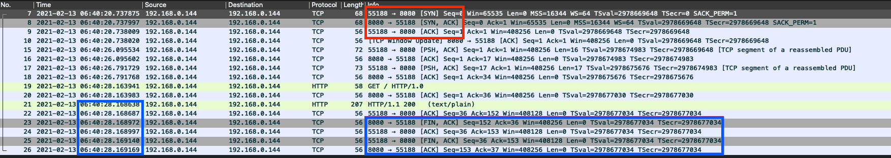
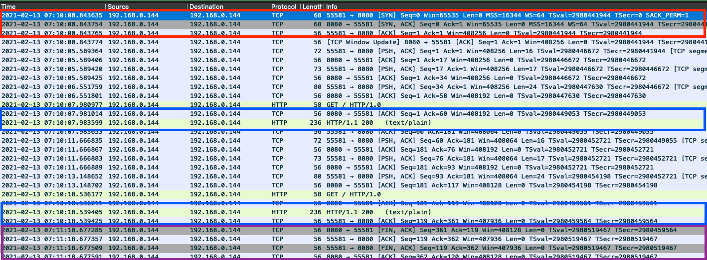
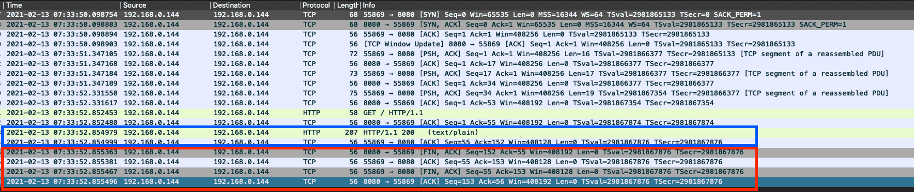
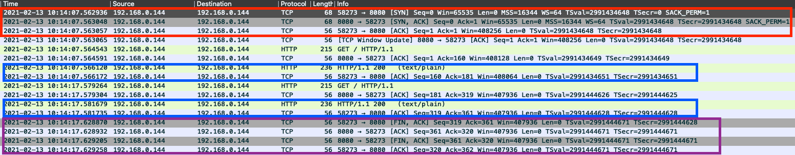

포스트에 사용된 IP 주소는 모두 개발자의 로컬 private IP이며 와이어샤크의 패킷 캡쳐를 위해서 해당 IP를 사용한 것이지, 혼자서 실습해볼 때는 localhost나 127.0.0.1로 치환하면 된다 

## Keep-Alive
HTTP는 기본적으로 stateless(무상태) 프로토콜이다.  
상태를 가질 필요가 없기 때문에 매번 연결을 맺고 끊는 게 기본 동작 방식이다.  

테스트를 위해 API를 하나 만들었다.  
```kotlin
@RestController
class Controller {
    @GetMapping
    fun a() = "I'm response text\n"
}
```

HTTP 1.0에서는 통신이 종료된 이후에 무조건 커넥션을 끊는다.  
```shell script
telnet 192.168.0.144 8080
# Trying 192.168.0.144...
# Connected to localhost.
# Escape character is '^]'.
GET / HTTP/1.0
Host: localhost

# HTTP/1.1 200 
# Content-Type: text/plain;charset=UTF-8
# Content-Length: 18
# Date: Fri, 12 Feb 2021 14:34:38 GMT
# Connection: close
# 
# I'm response text
# Connection closed by foreign host.
```

하지만 매번 커넥션을 맺고, 끊는다는 건 아래와 같은 작업을 매번 진행한다는 뜻이므로 매우 비효율적이다.
1. 소켓(포트)을 연다.
1. tcp 3 way handshake를 통해 커넥션을 맺는다.

  
패킷 캡쳐 도구인 [와이어샤크](https://www.wireshark.org/)를 이용하여 어떻게 동작하는지 확인하였다.  
telnet 명령어를 이용하는 순간 TCP 3 Way Handshake(빨간 박스)가 일어나고, 응답을 받는 즉시 커넥션을 종료한다(파란 박스)

따라서 이런 비용을 줄이고자 [Keep-Alive](https://developer.mozilla.org/en-US/docs/Web/HTTP/Headers/Keep-Alive)라는 메커니즘이 도입되었다.  
HTTP 1.0에서는 클라이언트와 서버 모두 Connection, Keep-Alive 헤더를 해석할 수 있어야 지원하는 기능이다.    
간단하게 예제를 통해 확인해보자.
```shell script
telnet 192.168.0.144 8080
# Trying 192.168.0.144...
# Connected to localhost.
# Escape character is '^]'.
GET / HTTP/1.0
Host: localhost
Connection: Keep-Alive

# HTTP/1.1 200 
# Content-Type: text/plain;charset=UTF-8
# Content-Length: 18
# Date: Fri, 12 Feb 2021 14:43:29 GMT
# Connection: keep-alive
# Keep-Alive: timeout=60
# 
# I'm response text
# Connection closed by foreign host.
```

우선 클라이언트에서 Connection 헤더에 Keep-Alive를 사용하겠다고 요청에 실어보냈다.  
서버측 응답에도 기존에 Connection: close 대신 Connection: `keep-alive`라는 헤더가 왔다.  
그리고 `Keep-Alive: timeout=60`이라는 헤더의 응답에 맞게 커넥션을 바로 끊는 게 아니라 60초 이후에 서버에서 끊었다.  
Connection closed by foreign host.라는 문자열이 60초 이후에 찍혔다는 얘기이다.

  
패킷을 떠보니 응답을 받은 54분 15초(빨간 박스)로부터 1분 후인 55분 15초(파란 박스)에 연결이 끊긴 걸 볼 수 있다.  
  
즉, 60초 안에 다시 요청을 보내면 기존 커넥션을 재활용 할 수 있다는 뜻이다.  
커넥션을 맺는 속도만큼 절약이 가능하다.  
```shell script
telnet 192.168.0.144 8080
# Trying 192.168.0.144...
# Connected to localhost.
# Escape character is '^]'.
GET / HTTP/1.0
Host: localhost
Connection: Keep-Alive

# HTTP/1.1 200 
# Content-Type: text/plain;charset=UTF-8
# Content-Length: 18
# Date: Sat, 13 Feb 2021 07:10:07 GMT
# Connection: keep-alive
# Keep-Alive: timeout=60
# 
# I'm response text
GET / HTTP/1.0
Host: localhost
Connection: Keep-Alive

# HTTP/1.1 200 
# Content-Type: text/plain;charset=UTF-8
# Content-Length: 18
# Date: Sat, 13 Feb 2021 07:10:18 GMT
# Connection: keep-alive
# Keep-Alive: timeout=60
# 
# I'm response text
```
  
1. telnet 명령어를 이용하는 순간 TCP 3 Way Handshake(빨간 박스)가 일어나고
1. 첫 번째 요청에 대한 응답(첫 번째 파란 박스)가 10분 7초에 왔고
1. 두 번째 요청에 대한 응답(두 번째 파란 박스)가 10분 18초에 홨고
1. 마지막 요청으로부터 60초(Keep-Alive 헤더의 timeout 파라미터의 명시된 값) 후인 11분 18초에 커넥션이 끊어졌다. (보라 박스)

또한 커넥션 재활용 횟수를 제한하려면 Keep-Alive 헤더의 max 파라미터를 사용하면 된다.

HTTP 1.1부터는 서버에서 Keep-Alive를 지원하면 클라이언트에서 Connection 헤더에 close를 보내기 전까지는 Keep-Alive가 기본적으로 적용된다.  
```shell script
telnet 192.168.0.144 8080
# Trying 192.168.0.144...
# Connected to localhost.
# Escape character is '^]'.
# GET / HTTP/1.1
# Host: localhost
# 
# HTTP/1.1 200 
# Content-Type: text/plain;charset=UTF-8
# Content-Length: 18
# Date: Fri, 12 Feb 2021 15:00:10 GMT
# 
# I'm response text
# Connection closed by foreign host.
```

  
Connection과 Keep-Alive 헤더가 존재하지 않지만 커넥션이 60초간 유지되다가 끊겼다.

이는 명시적으로 Connection: Keep-Alive 헤더를 보냈을 때와 동일하게 동작한다.  
```shell script
telnet 192.168.0.144 8080
# Trying 192.168.0.144...
# Connected to localhost.
# Escape character is '^]'.
# GET / HTTP/1.1
# Host: localhost
# Connection: Keep-Alive
# 
# HTTP/1.1 200 
# Content-Type: text/plain;charset=UTF-8
# Content-Length: 18
# Date: Fri, 12 Feb 2021 15:05:19 GMT
# Keep-Alive: timeout=60
# Connection: keep-alive
# 
# I'm response text
# Connection closed by foreign host.
```
  
커넥션이 60초간 유지되다가 끊겼다.

만약 커넥션을 재사용하지 않고 바로 끊고 싶다면 명시적으로 Connection 헤더에 Close 값을 넘겨주면 된다.
```shell script
telnet 192.168.0.144 8080
# Trying 192.168.0.144...
# Connected to localhost.
# Escape character is '^]'.
# GET / HTTP/1.1
# Host: localhost
# Connection: Close
# 
# HTTP/1.1 200 
# Content-Type: text/plain;charset=UTF-8
# Content-Length: 18
# Date: Fri, 12 Feb 2021 15:05:19 GMT
# Connection: close
# 
# I'm response text
# Connection closed by foreign host.
```
  
응답을 받자마자 바로 커넥션이 끊겼다.

위에서 봤듯이 HTTP 1.0에서 Connection 헤더의 기본 동작은 Close이고, HTTP1.1에서 Connection 헤더의 기본 동작은 Keep-Alive이다.  

## Spring Boot 웹서버와 Keep-Alive
[https://docs.spring.io/spring-boot/docs/current/reference/html/howto.html#howto-use-another-web-server](https://docs.spring.io/spring-boot/docs/current/reference/html/howto.html#howto-use-another-web-server)를 보면
> For servlet stack applications, the spring-boot-starter-web includes Tomcat by including spring-boot-starter-tomcat

기본적으로 제일 많이 사용하는 web 모듈 같은 경우에 톰캣이 내장돼있다.
그럼 톰캣에서 Keep-Alive의 Default timeout은 몇 초일까??

[AbstractHttp11Protocol](https://github.com/apache/tomcat/blob/master/java/org/apache/coyote/http11/AbstractHttp11Protocol.java#L66)을 보면 알 수 있다.
```java
public AbstractHttp11Protocol(AbstractEndpoint<S,?> endpoint) {
    super(endpoint);
    setConnectionTimeout(Constants.DEFAULT_CONNECTION_TIMEOUT);
    ConnectionHandler<S> cHandler = new ConnectionHandler<>(this);
    setHandler(cHandler);
    getEndpoint().setHandler(cHandler);
}
```

[Constants](https://github.com/apache/tomcat/blob/master/java/org/apache/coyote/http11/Constants.java#L28)를 보면 60000ms(60초)가 기본값이다.
```java
public final class Constants {

    public static final int DEFAULT_CONNECTION_TIMEOUT = 60000;
    // ...
}
```

timeout을 수정하고 싶다면 properties(또는 yml) 파일에 설정을 추가하여 수정할 수 있다.
```yaml
server:
  tomcat:
    connection-timeout: 10s
```
톰캣이 아니라 jetty를 사용한다면 jetty로 수정하면 되고, 본인 프로젝트 설정에 맞게 하면 된다.

## RestTemplate과 Keep-Alive
[ClientHttpRequest](https://docs.spring.io/spring-framework/docs/current/javadoc-api/org/springframework/http/client/ClientHttpRequest.html#:~:text=Interface%20ClientHttpRequest&text=Represents%20a%20client%2Dside%20HTTP,which%20can%20be%20read%20from.)
> Represents a client-side HTTP request. Created via an implementation of the ClientHttpRequestFactory.
  A ClientHttpRequest can be executed, receiving a ClientHttpResponse which can be read from.

ClientHttpRequest는 클라이언트 측면의 [HttpRequest](https://docs.spring.io/spring-framework/docs/current/javadoc-api/org/springframework/http/HttpRequest.html)이며, [ClientHttpRequestFactory](https://docs.spring.io/spring-framework/docs/current/javadoc-api/org/springframework/http/client/ClientHttpRequestFactory.html) 구현체에 의해 생성된다.  
ClientHttpRequest는 실행될 수 있으머, ClientHttpResponse를 받아서 읽을 수 있다.  
대충 해석해보면 이런 내용인데 그냥 request 만들어서 서버로 전송하고 응답받을 수 있다는 내용 같다.    
그럼 이게 RestTemplate과 무슨 관련이 있는지 알아보자.  

RestTemplate은 [HttpAccessor](https://docs.spring.io/spring-framework/docs/current/javadoc-api/org/springframework/http/client/support/HttpAccessor.html)를 상속 받았다.  
```java
public class RestTemplate extends InterceptingHttpAccessor implements RestOperations {
```

```java
public abstract class InterceptingHttpAccessor extends HttpAccessor {
```

그리고 HttpAccessor는 ClientHttpRequest를 생성할 수 있는 ClientHttpRequestFactory를 가지는데, 기본값으로 [SimpleClientHttpRequestFactory](https://docs.spring.io/spring-framework/docs/current/javadoc-api/org/springframework/http/client/SimpleClientHttpRequestFactory.html)를 사용한다.
```java
public abstract class HttpAccessor {

	/** Logger available to subclasses. */
	protected final Log logger = HttpLogging.forLogName(getClass());

	private ClientHttpRequestFactory requestFactory = new SimpleClientHttpRequestFactory();
```

RestTemplate과 그 부모인 InterceptingHttpAccessor와 HttpAccessor의 기본 생성자에서 requestFactory를 할당하는 코드가 없다보니  
RestTemplate의 기본생성자에서는 SimpleClientHttpRequestFactory가 사용된다.
  
하지만 [RestTemplateAutoConfiguration](https://github.com/spring-projects/spring-boot/blob/master/spring-boot-project/spring-boot-autoconfigure/src/main/java/org/springframework/boot/autoconfigure/web/client/RestTemplateAutoConfiguration.java)에 의해 생성되는 [RestTemplateBuilder](https://github.com/spring-projects/spring-boot/blob/master/spring-boot-project/spring-boot/src/main/java/org/springframework/boot/web/client/RestTemplateBuilder.java)는 requestFactory를 설정하지 않아도  
클래스패스 내에 apache http client의 HttpComponentsClientHttpRequestFactory이나 OkHttp3의 OkHttp3ClientHttpRequestFactory 중 하나)가 있다면
해당 ClientHttpRequestFactory가 사용되고 없으면 SimpleClientHttpRequestFactory가 사용된다.    
```java
@Configuration(proxyBeanMethods = false)
@AutoConfigureAfter(HttpMessageConvertersAutoConfiguration.class)
@ConditionalOnClass(RestTemplate.class)
@Conditional(NotReactiveWebApplicationCondition.class)
public class RestTemplateAutoConfiguration {

	@Bean
	@Lazy
	@ConditionalOnMissingBean
	public RestTemplateBuilderConfigurer restTemplateBuilderConfigurer(
			ObjectProvider<HttpMessageConverters> messageConverters,
			ObjectProvider<RestTemplateCustomizer> restTemplateCustomizers,
			ObjectProvider<RestTemplateRequestCustomizer<?>> restTemplateRequestCustomizers) {
		RestTemplateBuilderConfigurer configurer = new RestTemplateBuilderConfigurer();
		configurer.setHttpMessageConverters(messageConverters.getIfUnique());
		configurer.setRestTemplateCustomizers(restTemplateCustomizers.orderedStream().collect(Collectors.toList()));
		configurer.setRestTemplateRequestCustomizers(
				restTemplateRequestCustomizers.orderedStream().collect(Collectors.toList()));
		return configurer;
	}

	@Bean
	@Lazy
	@ConditionalOnMissingBean
	public RestTemplateBuilder restTemplateBuilder(RestTemplateBuilderConfigurer restTemplateBuilderConfigurer) {
		RestTemplateBuilder builder = new RestTemplateBuilder();
		return restTemplateBuilderConfigurer.configure(builder);
	}
```

```java
public class RestTemplateBuilder {
// ...
	/**
	 * Build a new {@link RestTemplate} instance and configure it using this builder.
	 * @return a configured {@link RestTemplate} instance.
	 * @see #build(Class)
	 * @see #configure(RestTemplate)
	 */
	public RestTemplate build() {
		return configure(new RestTemplate());
	}
// ...
	/**
	 * Configure the provided {@link RestTemplate} instance using this builder.
	 * @param <T> the type of rest template
	 * @param restTemplate the {@link RestTemplate} to configure
	 * @return the rest template instance
	 * @see RestTemplateBuilder#build()
	 * @see RestTemplateBuilder#build(Class)
	 */
	public <T extends RestTemplate> T configure(T restTemplate) {
		ClientHttpRequestFactory requestFactory = buildRequestFactory(); // <-- 이 메서드가 호출된다.
		if (requestFactory != null) {
			restTemplate.setRequestFactory(requestFactory);
		}
		addClientHttpRequestInitializer(restTemplate);
		if (!CollectionUtils.isEmpty(this.messageConverters)) {
			restTemplate.setMessageConverters(new ArrayList<>(this.messageConverters));
		}
		if (this.uriTemplateHandler != null) {
			restTemplate.setUriTemplateHandler(this.uriTemplateHandler);
		}
		if (this.errorHandler != null) {
			restTemplate.setErrorHandler(this.errorHandler);
		}
		if (this.rootUri != null) {
			RootUriTemplateHandler.addTo(restTemplate, this.rootUri);
		}
		restTemplate.getInterceptors().addAll(this.interceptors);
		if (!CollectionUtils.isEmpty(this.customizers)) {
			for (RestTemplateCustomizer customizer : this.customizers) {
				customizer.customize(restTemplate);
			}
		}
		return restTemplate;
	}
    // ...
    public ClientHttpRequestFactory buildRequestFactory() {
        ClientHttpRequestFactory requestFactory = null;
        if (this.requestFactory != null) {
            requestFactory = this.requestFactory.get();
        }
        else if (this.detectRequestFactory) { // <-- 여기가 true임.
            requestFactory = new ClientHttpRequestFactorySupplier().get();
        }
        if (requestFactory != null) {
            if (this.requestFactoryCustomizer != null) {
                this.requestFactoryCustomizer.accept(requestFactory);
            }
        }
        return requestFactory;
    }
// ...
}
```

```java
public class ClientHttpRequestFactorySupplier implements Supplier<ClientHttpRequestFactory> {

	private static final Map<String, String> REQUEST_FACTORY_CANDIDATES;

	static {
		Map<String, String> candidates = new LinkedHashMap<>();
		candidates.put("org.apache.http.client.HttpClient",
				"org.springframework.http.client.HttpComponentsClientHttpRequestFactory");
		candidates.put("okhttp3.OkHttpClient", "org.springframework.http.client.OkHttp3ClientHttpRequestFactory");
		REQUEST_FACTORY_CANDIDATES = Collections.unmodifiableMap(candidates);
	}

	@Override
	public ClientHttpRequestFactory get() {
		for (Map.Entry<String, String> candidate : REQUEST_FACTORY_CANDIDATES.entrySet()) {
			ClassLoader classLoader = getClass().getClassLoader();
			if (ClassUtils.isPresent(candidate.getKey(), classLoader)) {
				Class<?> factoryClass = ClassUtils.resolveClassName(candidate.getValue(), classLoader);
				return (ClientHttpRequestFactory) BeanUtils.instantiateClass(factoryClass);
			}
		}
		return new SimpleClientHttpRequestFactory();
	}
}
```

그리고 RestTemplate에서 요청을 전송하는 getForObject 같은 클래스를 타고 들어가다보면 ClientHttpRequestFactory를 사용하는 부분이 나온다.
```java
public class RestTemplate extends InterceptingHttpAccessor implements RestOperations {
    // ...
    @Override
    @Nullable
    public <T> T getForObject(String url, Class<T> responseType, Object... uriVariables) throws RestClientException {
        RequestCallback requestCallback = acceptHeaderRequestCallback(responseType);
        HttpMessageConverterExtractor<T> responseExtractor =
                new HttpMessageConverterExtractor<>(responseType, getMessageConverters(), logger);
        return execute(url, HttpMethod.GET, requestCallback, responseExtractor, uriVariables);
    }
    // ...
	@Override
	@Nullable
	public <T> T execute(String url, HttpMethod method, @Nullable RequestCallback requestCallback,
			@Nullable ResponseExtractor<T> responseExtractor, Object... uriVariables) throws RestClientException {

		URI expanded = getUriTemplateHandler().expand(url, uriVariables);
		return doExecute(expanded, method, requestCallback, responseExtractor);
	}
	// ...
    @Nullable
	protected <T> T doExecute(URI url, @Nullable HttpMethod method, @Nullable RequestCallback requestCallback,
			@Nullable ResponseExtractor<T> responseExtractor) throws RestClientException {

		Assert.notNull(url, "URI is required");
		Assert.notNull(method, "HttpMethod is required");
		ClientHttpResponse response = null;
		try {
			ClientHttpRequest request = createRequest(url, method);
			if (requestCallback != null) {
				requestCallback.doWithRequest(request);
			}
			response = request.execute();
        // ...
}
```

doExecute에서 호출하는 createRequest는 HttpAccessor에 있는 메서드이다.  
```java
public abstract class HttpAccessor {
    // ...
    /**
     * Create a new {@link ClientHttpRequest} via this template's {@link ClientHttpRequestFactory}.
     * @param url the URL to connect to
     * @param method the HTTP method to execute (GET, POST, etc)
     * @return the created request
     * @throws IOException in case of I/O errors
     * @see #getRequestFactory()
     * @see ClientHttpRequestFactory#createRequest(URI, HttpMethod)
     */
    protected ClientHttpRequest createRequest(URI url, HttpMethod method) throws IOException {
        ClientHttpRequest request = getRequestFactory().createRequest(url, method);
        initialize(request);
        if (logger.isDebugEnabled()) {
            logger.debug("HTTP " + method.name() + " " + url);
        }
        return request;
    }
}
```

그리고 SimpleClientHttpRequestFactory의 createRequest 메서드를 보면 요청을 보내기 위해 [HttpURLConnection](https://docs.oracle.com/javase/8/docs/api/java/net/HttpURLConnection.html)을 사용한다는 사실을 알 수 있다.  
```java
/**
 * {@link ClientHttpRequestFactory} implementation that uses standard JDK facilities.
 *
 * @author Arjen Poutsma
 * @author Juergen Hoeller
 * @since 3.0
 * @see java.net.HttpURLConnection
 * @see HttpComponentsClientHttpRequestFactory
 */
@SuppressWarnings("deprecation")
public class SimpleClientHttpRequestFactory implements ClientHttpRequestFactory, AsyncClientHttpRequestFactory {
    // ...
	@Override
	public ClientHttpRequest createRequest(URI uri, HttpMethod httpMethod) throws IOException {
		HttpURLConnection connection = openConnection(uri.toURL(), this.proxy);
		prepareConnection(connection, httpMethod.name());

		if (this.bufferRequestBody) {
			return new SimpleBufferingClientHttpRequest(connection, this.outputStreaming);
		}
		else {
			return new SimpleStreamingClientHttpRequest(connection, this.chunkSize, this.outputStreaming);
		}
	}
    // ...
    /**
	 * Opens and returns a connection to the given URL.
	 * <p>The default implementation uses the given {@linkplain #setProxy(java.net.Proxy) proxy} -
	 * if any - to open a connection.
	 * @param url the URL to open a connection to
	 * @param proxy the proxy to use, may be {@code null}
	 * @return the opened connection
	 * @throws IOException in case of I/O errors
	 */
	protected HttpURLConnection openConnection(URL url, @Nullable Proxy proxy) throws IOException {
		URLConnection urlConnection = (proxy != null ? url.openConnection(proxy) : url.openConnection());
		if (!(urlConnection instanceof HttpURLConnection)) {
			throw new IllegalStateException(
					"HttpURLConnection required for [" + url + "] but got: " + urlConnection);
		}
		return (HttpURLConnection) urlConnection;
	}
    // ...
}
```

그럼 RestTemplate의 기본 생성자에서 HttpURLConnection을 사용한다는 사실을 알아냈고, 그럼 Keep-Alive 메커니즘도 우리 의도대로 동작하는지 확인해보자.  
(기본적으로 로컬에 서버를 띄웠다는 전제 하에 진행한다)

우선 간단하게 컨트롤러를 만들어보자.  
```kotlin
@RestController
class Controller {
    private val restTemplate = RestTemplate() // 요 놈이 제대로 커넥션을 재사용하는지 확인할 대상임.

    @GetMapping("/a")
    fun a() {
        // 와이어샤크에서 패킷 캡쳐를 위해 로컬 IP를 박음
        restTemplate.getForObject("http://192.168.0.144:8080/b", String::class.java)
    }

    @GetMapping("/b")
    fun b() {
        Thread.sleep(10_000)
    }
}
```

이제 의도대로 동작하는지 확인을 해보자.
```kotlin
@Test
fun `총 10개의 요청을 두 번에 끊어서 동시에 5개씩 전송`() {
    val threadCount = 5
    val threadPool = Executors.newFixedThreadPool(threadCount)
    val futures = mutableListOf<CompletableFuture<String?>>()

    val restTemplate = RestTemplate()
    val total = threadCount * 2
    for (i in 1..total) {
        futures.add(CompletableFuture.supplyAsync(
            { restTemplate.getForObject("http://127.0.0.1:8080/a", String::class.java) },
            threadPool
        ))
    }

    futures.forEach { it.join() }
}
```
  
1. TCP 3 Way Handshake(빨간 박스)는 한 번 일어나고,
1. 첫 번째 요청에 대한 응답(첫 번째 파란 박스)가 14분 7초에 왔고
1. 두 번째 요청에 대한 응답(두 번째 파란 박스)가 14분 17초에 홨고 (`Thread.sleep(10_000)`에 의해 10초 딜레이)
1. 마지막 요청이 끝나자마자 커넥션이 끊겼다. (아마 클라이언트에서 끊어버린 것으로 추정됨)
