  
남들의 사랑과 관심이 고파서 라이브러리를 CDN 호스팅 업체에 등록하고자 며 칠 간 고생했던 내용을 적어봤다.  
CDN에 대해서는 구글링하면 많이 나오는데 CDN은 각 지역 별로 서버를 두는 서비스 형식으로 대충 알고있다.  
국내 무료 호스팅 업체에 그냥 나의 라이브러리를 업로드해도 되지만 일정 기간마다 서비스를 연장하거나 트래픽 등등의 문제가 존재하였다.  
그리고 제이쿼리나 부트스트랩 등등의 프레임워크&라이브러리들이 외국 CDN 호스팅 업체에 등록된 걸 보면 뭔가 동경의 대상이었다.  
나의 라이브러리도 한 번 그렇게 만들어 보고 싶었다.  
뭔가 좋아보인다 싶으면 따라하는 게 나의 단점이지만 그래도 해보고 싶었다.

1. [maxCDN](https://www.maxcdn.com/)  
  
  
2. [cdnjs](https://cdnjs.com/)  
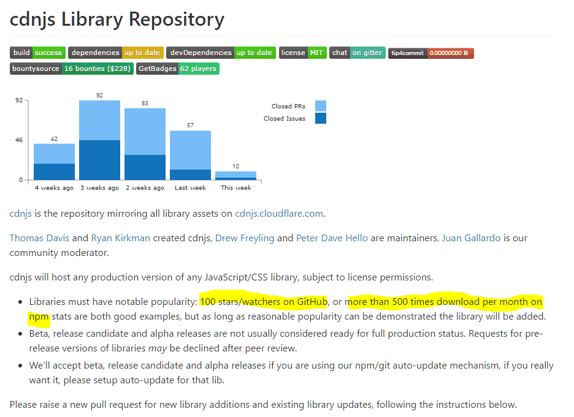  
3. [jsdelivr](http://www.jsdelivr.com/)  
  
&nbsp;  
혼자서 깃헙 문서를 보고 따라할 사람은 아래 링크로 들어가면 된다.  
[https://github.com/jsdelivr/jsdelivr/blob/master/CONTRIBUTING.md](https://github.com/jsdelivr/jsdelivr/blob/master/CONTRIBUTING.md)  
&nbsp;  
준비사항: 라이브러리가 올라가 있는 본인의 깃헙 저장소.  
그리고 그 깃헙 저장소에 태그가 있어야한다.  
태그가 뭔지 모르는 사람은 아래 링크를 참조하자.  
[http://www.whatwant.com/377](http://www.whatwant.com/377)  
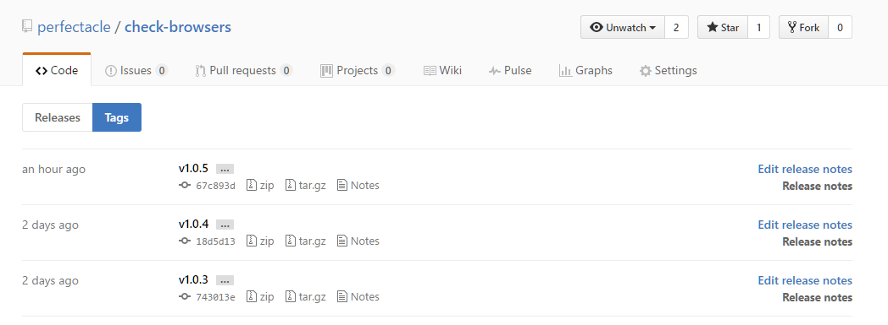  
&nbsp;   
그 이후에 아래 링크로 접속한다.  
[https://github.com/jsdelivr/jsdelivr/tree/master/files](https://github.com/jsdelivr/jsdelivr/tree/master/files)  
  
```
author = "name of lib author"
github = "https://github.com/user_id/repository"
homepage = "없으면 그냥 깃헙 저장소 주소 입력해도 되고, npm 주소 입력해도 됨."
description = "설명"
mainfile = "lib.min.js"
```
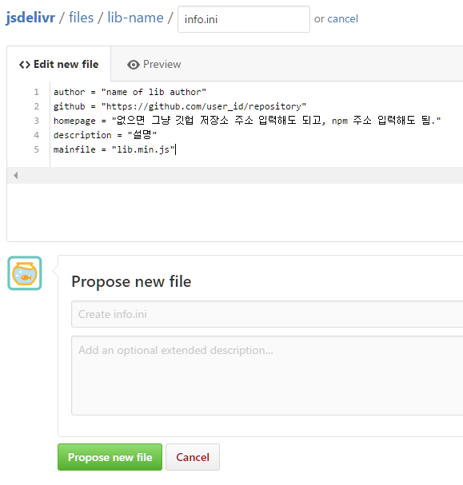  
  
  
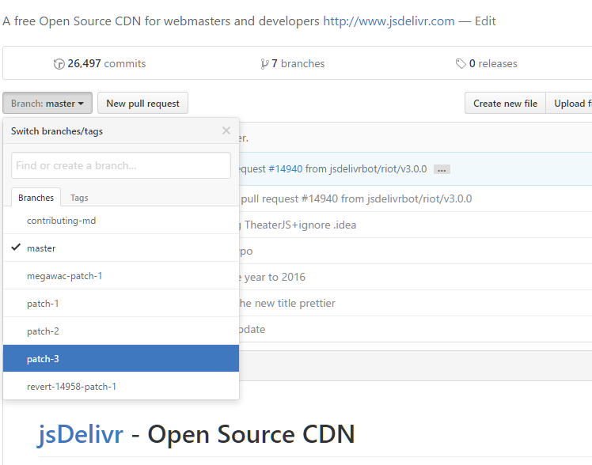  
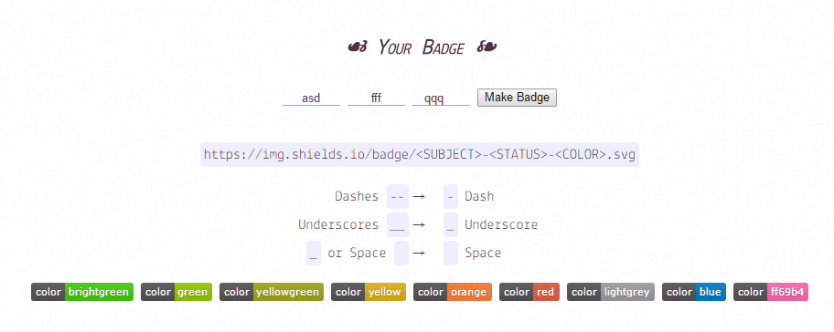  
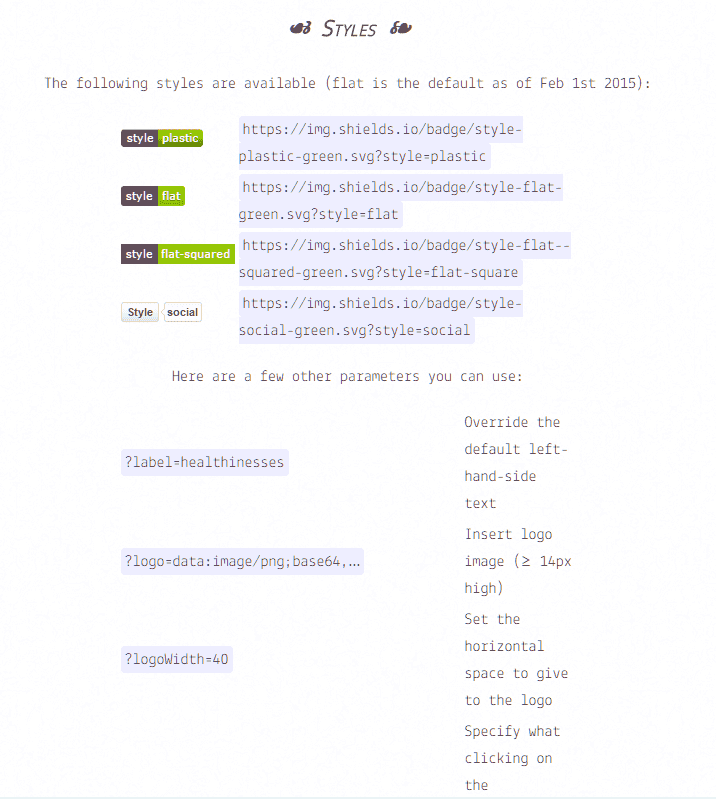  
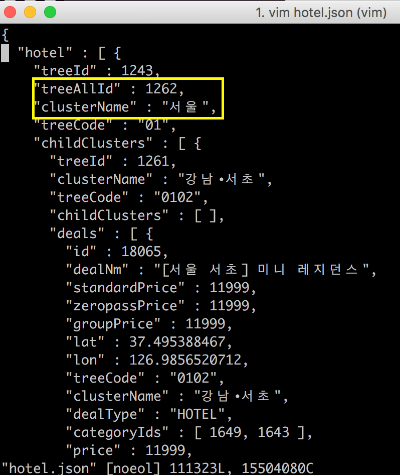  
```
// 패키지 매니저에는 npm이라고 입력해도 되는 것 같다.
// files에는 호스팅 될 파일을 입력하면 된다.
{
  "packageManager": "github",
  "name": "lib-name",
  "repo": "user_id/lib-name",
  "files": {
    "include": ["lib-name.js", "lib-name.min.js"]
  }
}
```
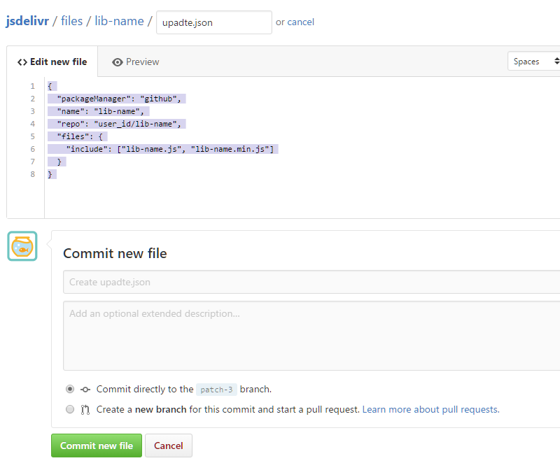  
  
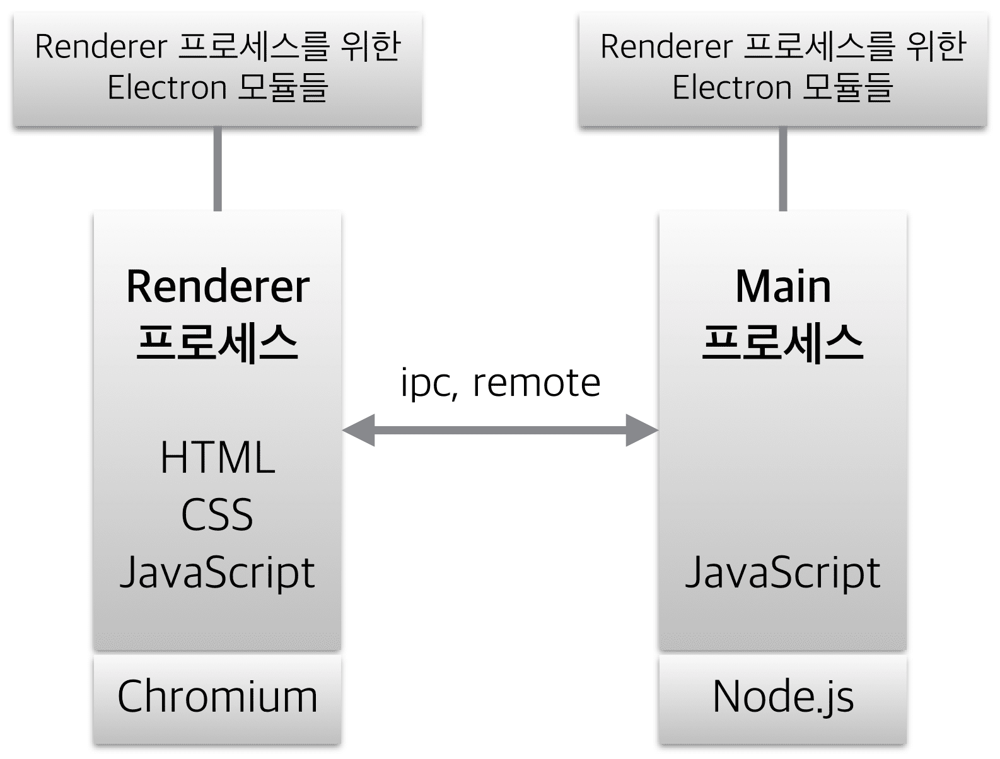  
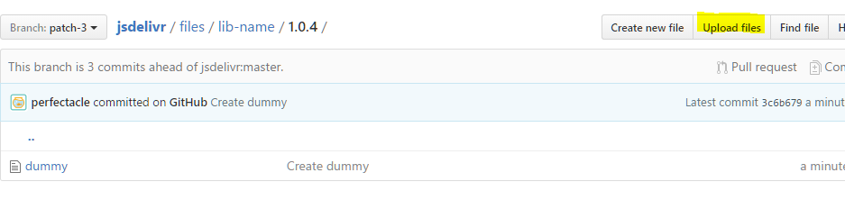  
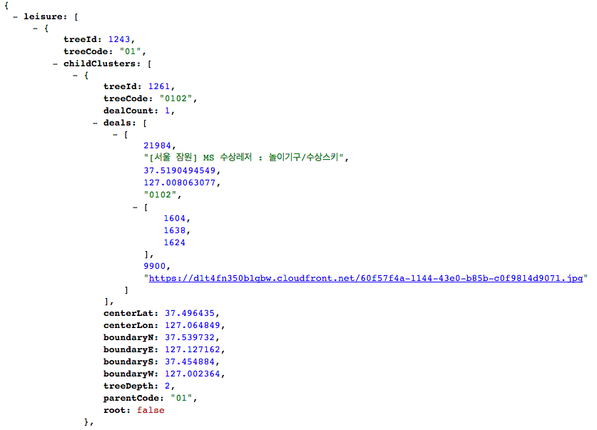  
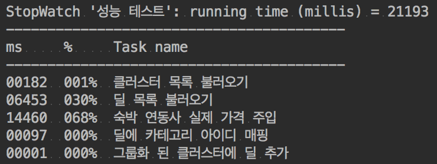  
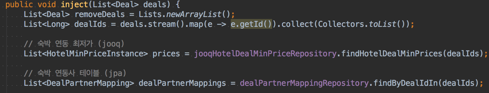  
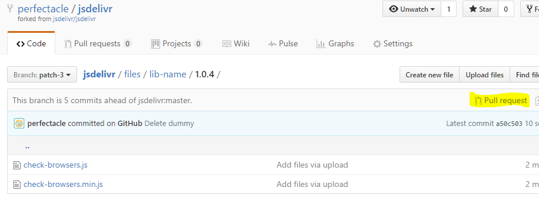  
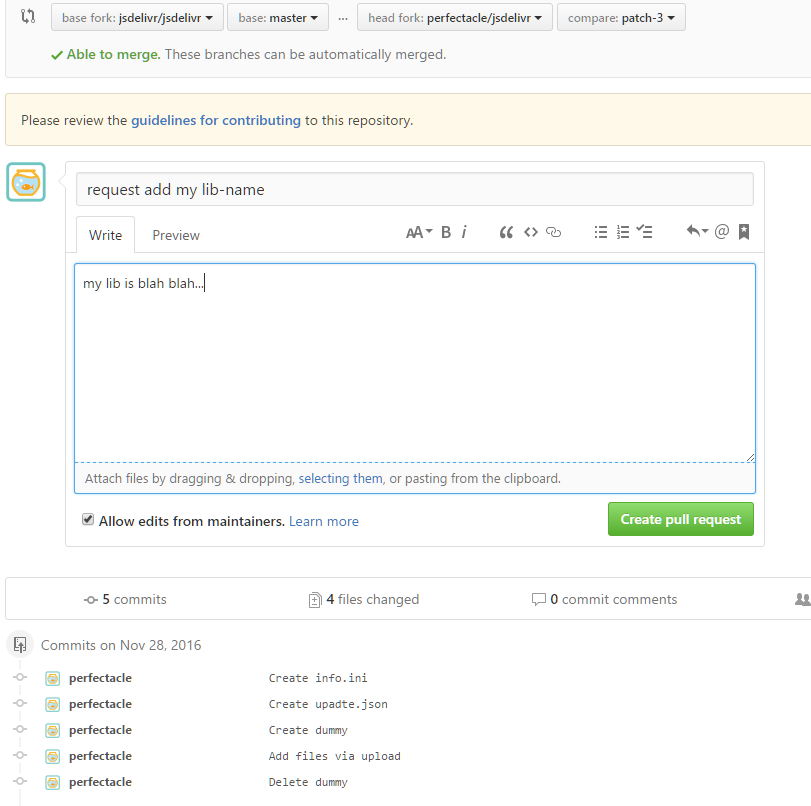  
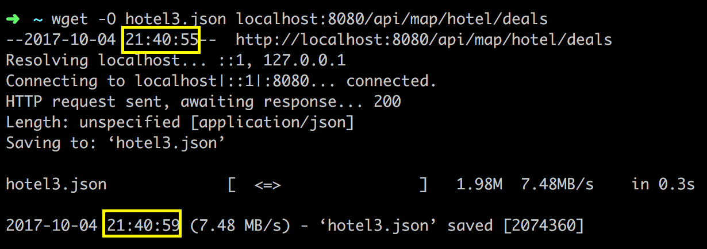  
예제 작성을 위해 한글을 썼더니 ascii 케릭터로만 적으라는 오류를 뿜는다.  
하단의 Close pull request를 눌러서 취소 시키고, 오류를 수정한 후 다시 풀리퀘를 날리면 된다.  
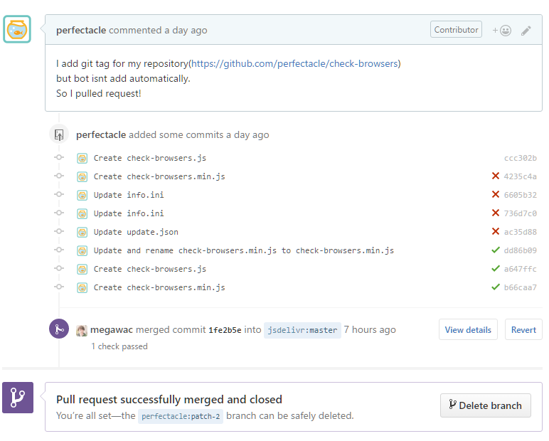  
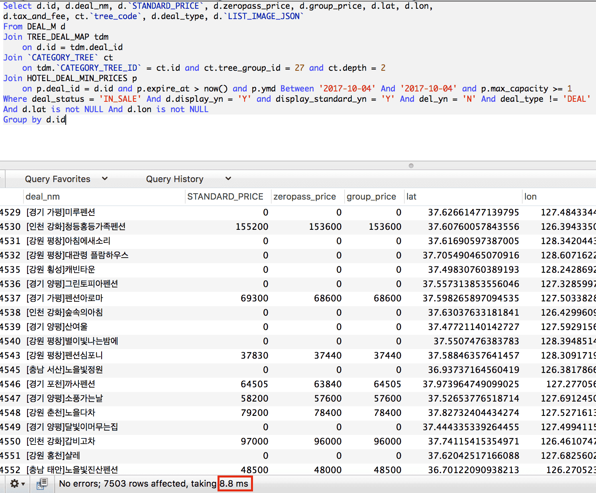  
  
감격의 순간이다 흑흑흑…  
버전 별로 호스팅이 되어있고, unminify, minify한 js 파일 모두 다 호스팅 되었다.  
세상 어딘가에 나의 발자취를 남긴 것 같아 굉장히 뿌듯하다.