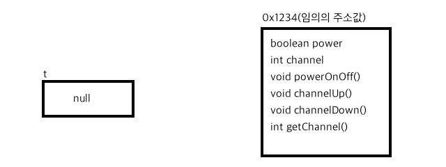
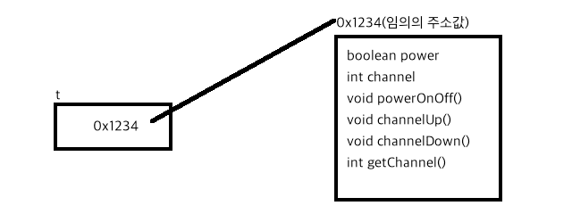

학교에서 클래스를 할당하는 한 가지 방법 밖에 배우지 않았다.  
동적 할당에 대해서 배우지 않았기 때문인데...  
왜 학교에서는 이런 심도있는 내용들은 1도 가르쳐주지 않는 걸까?  
학교에서 이런 내용까지 알려준다면 좀 더 재미나게 수업에 임할 수 있을텐데...  
정말 안타깝다 ㅠㅠ  
이해를 돕기 위해 아래 포스트를 한 번 보는 걸 추천한다.  
[(C/C++) 참고용 정리 - 메모리 영역(Code, Data, Stack, Heap)](/2017/02/09/C-ref-004/)

## 학교에서 배운 방법(정적 할당)
```C
#include <iostream>
using namespace std;
 
class test {
private:
    int num;
public:
    void setNum(int n) {num = n;}
    int getNum() {return num;}
};
 
int main() {
    test t;
    t.setNum(22);
    cout << t.getNum() << endl;
    cout << t; // 에러, t가 가지고 있는 순수 값은 못 본다. 왜일까? ㅠㅠ
    return 0;
}
```
test 클래스의 인스턴스인 t는 스택 영역에 올라가게 된다.  
사실 자바를 먼저 배우고 C++을 그 이후에 배워서...  
자바에서는 저렇게 선언하면 참조변수만 선언한 격이라  
클래스의 인스턴스가 생성되지 않아서 할 수 있는 게 1도 없었는데...  
자바에서는 클래스의 정적 할당이 없어서 그랬나 보다.

## 학교에서 배우지 않은 방법(동적 할당)
```C
#include <iostream>
using namespace std;

class test {
private:
    int num;
public:
    void setNum(int n) {num = n;}
    int getNum() {return num;}
};

int main() {
    test *t;
    t = new test();
    t -> setNum(22);
    cout << t -> getNum() << endl; // 22
    cout << t; // 주소값이 나옴.
    delete t;
    return 0;
}
```
test 클래스의 인스턴스인 t는 힙 영역에 올라가게 된다.  
즉 메모리 동적 할당을 하게 된 것이고,  
delete 해주기 전까지 메모리에서 해제되지 않는다.    

### 동적 메모리 할당의 과정
위 코드는 포인터, 자바와도 관련이 있다.  
어떻게 메모리에 할당되는지 과정을 지켜보자.  
1.`test *t;`  
  
변수의 타입을 test로 지정했다.  
즉 내가 참조해서 쓸 변수의 타입은 test이다.  
하지만 test라는 변수 타입은 없으므로 참조 타입이라고 봐야할 것 같다.  
그 참조 타입은 클래스의 이름인 것 같다.

2.`t = new test();`를 두 가지 관점에서 나눠 보자.  
* t = `new test();`  
  
* t `=` new test();  
  
즉 new는 &와 같은 역할을 하는 녀석인 것 같다.  
기본형 변수 앞에는 `&`가, 참조형 변수 앞에는 `new `가 붙는 것 같다.  
이는 포인터에 변수의 주소를 할당하는 과정과 매우 유사한 것 같다.  
메모리 공간에 포인터 변수와 실제 변수 두 공간이 필요하게 되고,  
클래스의 동적 할당에서도 마찬가지로 포인터 변수와 클래스의 인스턴스 두 공간이 필요하기 때문이다.