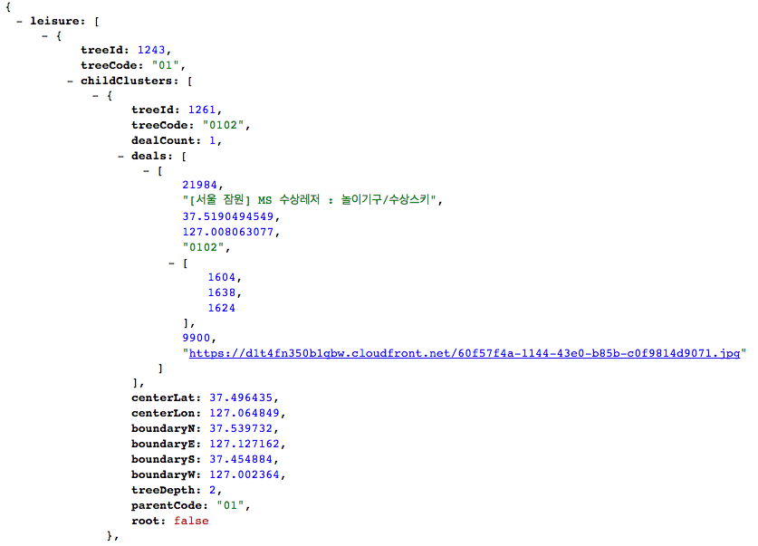

## 목차
1. [들어가기에 앞서](#들어가기에-앞서)
2. [ES5의 함수 단위의 스코프](#ES5의-함수-단위의-스코프)
3. [함수 단위 스코프의 위험성](#함수-단위-스코프의-위험성)
4. [함수 단위 스코프의 극복, 모듈화](#함수-단위-스코프의-극복-모듈화)
5. [ES6의 블록 단위의 스코프](#ES6의-블록-단위의-스코프)
6. [TDZ](#TDZ)

## 들어가기에 앞서  
**스코프**, **콜 스택**, **실행 컨텍스트**가 무엇인지, **ES5**, **ES6**가 무엇인지에 대해서는 설명하지 않는다.  
ES5와 ES6 사이에 있어서 **스코프의 차이점**은  
ES5는 **함수 단위의 스코프**이고, ES6는 **블록 단위의 스코프**라는 점이다.  
ES5와 ES6를 병행하여 학습하는 방법이 필자는 좋다고 여겨 한 포스트에 몰아 넣어서 분량이 길다.  
따뜻한 사랑과 관심이 많이 필요하다.  
ES5의 스코프에 대해 충분히 숙지한 사람들은 [ES6의 블록 단위의 스코프](#ES6의-블록-단위의-스코프)부터 읽도록 하자.  
그럼 스코프에 대해서 심화하여 다뤄보도록 하자.

## ES5의 함수 단위의 스코프
우선 ES5의 **함수 단위 스코프**부터 살펴보자.  
```html
<!doctype html>
<html lang="ko">
<head>
  <meta charset="utf-8" />
  <title>Title</title>
</head>
<body>
<script src="./index2.js"></script>
</body>
</html>
```

```javascript
// index2.js
var A = 'a';
var AA = 'c';
```

  
우선 **크롬**의 **개발자 도구(F12)**에서 **소스 탭**으로 들어간 후에 **자바스크립트 소스 파일**을 선택해준다.  
그리고 변수를 초기화하는 2, 3번 라인에 **브레이크 포인트**를 걸어준 후에 새로고침하면  
2번 라인을 실행하기 전에 브레이크가 걸리게 된다.  
**콜 스택**에는 **전역 실행 컨텍스트**만 쌓여있는 상태인데,  
여기서 실행 컨텍스트가 생기는 경우를 되짚어보자.

1. **전역코드**
2. 함수를 호출한 경우
3. eval() 함수를 호출한 경우

위 예제는 1번에 해당한다.  
전역 코드의 실행 컨텍스트는 콜 스택에 **Push**되고,  
**(anonymous function)**이 그 실행 컨텍스트를 가리킨다.  
전역 실행 컨텍스트의 스코프는 **Global 객체**인 **window 객체**의 프로퍼티로 들어간 것 처럼 보인다.  
브라우저가 아닌 **Node.js**에서는 Global 객체가 window 객체가 아니라  
**global이라는 이름을 가진 객체**이므로 예제는 반드시 브라우저에서 실행하자.  
[http://stackoverflow.com/questions/19849136/does-node-js-have-equivalent-to-window-object-in-browser](http://stackoverflow.com/questions/19849136/does-node-js-have-equivalent-to-window-object-in-browser)  
또한 *delete* 연산자로 삭제되지 않으므로 프로퍼티가 아니니 혼동하지 말길 바란다.  
하지만 *window.A*와 같이 사용이 가능하므로 window 객체의 프로퍼티의 이름을 피해서  
변수 네이밍 하는 걸 추천한다.  
또한 코드가 실행되기도 이전에 **A**와 **AA** 변수가 선언되고 *undefined*라는 값을 가진 걸 볼 수 있다.  
ES5의 이러한 **호이스팅** 때문에 갖은 오류를 양산하기도 하였다.

이번에는 **함수를 호출한 경우**에 스코프가 어떻게 형성되는지 알아보자.  
```html
<!doctype html>
<html lang="ko">
<head>
  <meta charset="utf-8" />
  <title>Title</title>
</head>
<body>
<script src="./index4.js"></script>
</body>
</html>
```

```javascript
// index4.js
'use strict';
var A = 'A';
var B = function() {
  var A = 'B';
  var C = function() {
    console.log(A)
  };
  C();
};  
console.log(A); // 'A'
B(); // 'B'
```

  
6번 라인에서 브레이크 포인트를 걸고 콜스택을 보자.

1. C
2. B
3. (anonymous function)

순으로 콜스택에 쌓여있다.  
이를 풀어 써보자면...

1. 함수 C의 실행 컨텍스트
2. 함수 B의 실행 컨텍스트
3. 전역 실행 컨텍스트

그리고 각 컨텍스트를 한번 뒤집어 까보자!  
먼저 위 사진을 보면 전역 실행 컨텍스트에는 사용자가 변수로 선언한 A가 "A"라는 값을 갖고 있다.  
물론 내리면 변수 B에 함수가 할당된 것도 볼 수 있다.

  
그 다음으로 함수 B의 실행 컨텍스트를 까보자.  
파란색이 함수 B의 실행 컨텍스트, 빨간색이 전역 실행 컨텍스트다.  
함수 B의 실행 컨텍스트는 따로 Local이라는 스코프를 가지고 있다.  
그 안에 존재하는 변수들이 지역 변수가 되는 것이다.  
서로 같은 A라는 변수지만 지역 변수가 더 우선순위가 높아서  
함수 B 안에서는 전역 변수 A가 아닌 지역 변수 A를 갖고 놀게 된다.  
만약 지역 변수 A가 없는데 A를 갖고 놀려면 스코프 체인이란 걸 타고 전역까지 뒤지게 될 것이다.

  
마지막으로 함수 C의 실행 컨텍스트를 까보자.  
빨간색이 함수 B의 실행 컨텍스트, 파란색이 함수 C의 실행 컨텍스트이다.  
함수 C의 실행 컨텍스트의 스코프 내부에는 this 밖에 없다.  
하지만 함수 C에서는 A라는 변수를 갖고 놀고 있다.  
자신의 스코프에 해당 변수가 없으므로 스코프 체인을 타고 올라가서  
바로 상위 스코프인 함수 B의 실행 컨텍스트에 변수 A가 있으므로 그걸 가지고 논다.  
하지만 자신의 스코프가 아닌 상위 스코프를 가지고 노는 것이므로 클로저다.  
다시 한번 클로저의 정의를 상기시켜보자.

1. 이미 생명 주기가 끝난 외부 함수의 변수를 참조하는 함수
2. 생성 당시의 스코프에 대한 연결을 갖는 블록

함수 B의 스코프가 **이미 생명 주기가 끝난 외부 함수의 변수**, **생성 당시의 스코프**이고,  
함수 C의 스코프가 **참조하는 함수**, **연결을 갖는 블록**과 매칭이 된다.  
왜 그런지 궁금하면 아래 링크를 참조하고 공부하자.  
[http://blog.javarouka.me/2012/01/closure.html](http://blog.javarouka.me/2012/01/closure.html)

## 함수 단위 스코프의 위험성  
```html
<!doctype html>
<html lang="ko">
<head>
  <meta charset="utf-8" />
  <title>Title</title>
</head>
<body>
<button id="btn">버튼</button>
<script src="./index2.js"></script>
<script src="./index3.js"></script>
</body>
</html>
```

```javascript
// index2.js
'use strict';
var A = '1';
var btn = document.getElementById('btn');
var evtClick = function() {
  console.log(A);
};
btn.addEventListener('click', evtClick);
```

```javascript
// index3.js
'use strict';
var A = '2';
```

  
index2.js의 5, 7번 라인에서 브레이크 포인트를 걸고 현재 전역 컨텍스트의  
A의 값을 보면 "1"이라는 값이 들어간 것을 볼 수 있다.  
그리고 나서 index.html에서 버튼을 클릭해보자.  
  
index2.js의 7번 라인에서 브레이크가 걸린다.  
그리고 전역 컨텍스트의 A의 값을 보면 쥐도새도 모르게 "2"라는 값으로 바뀌어있다.  
바로 index3.js에서 바꿔치기 한 것이다.  
index.html의 소스를 보면 index2.js를 먼저 로드하고 그 이후에 index3.js를  
그 후에 로드하기 때문에 위 소스를 합쳐보면 아래와 같이 된다.  
```javascript
// index2.js
'use strict';
var A = '1';
var btn = document.getElementById('btn');
var evtClick = function() {
  console.log(A); // 바꿔치기 된 애를 콘솔창에 찍음.
};
btn.addEventListener('click', evtClick);
// index3.js
'use strict';
var A = '2'; // 여기서 바꿔치기 됨.
```

## 함수 단위 스코프의 극복, 모듈화  
위와 같이 전역 스코프가 더러워지는 것을 방지하고자  
자바나 C++과 같이 자바스크립트도 모듈화하려는 시도는 많았다.  
**CommonJS**와 **RequireJS**가 대표적이었으나 현재는 **Webpack**이 대세인 것 같다.  
위와 관련된 글들도 인터넷에 상당히 널려있으니 찾아서 공부하자.  
여기서 위의 내용을 다루기에는 광범위하므로 순수 ES5만으로만 구현해보자.  
index2.js와 index3.js의 소스를 아래와 같이 고쳐보자.  
```javascript
// index2.js
(function() {
  'use strict';
  var A = '1';
  var btn = document.getElementById('btn');
  var evtClick = function() {
    console.log(A);
  };
  btn.addEventListener('click', evtClick);
}());
```

```javascript
// index3.js
(function() {
  'use strict';
  var A = '2';
}());
```

위 코드는 즉시 실행 함수(IIFE)를 이용한 패턴으로,  
코드를 로드하자마자 함수를 실행시켜버려서 스코프로 감싸버리는 것이다.  
따라서 위와 같이 하면 전역에 아무런 변수도 노출시키지 않게 된다.  
  
6, 8번 라인에 브레이크 포인트를 걸고 콜스택을 보면 아래와 같다.

1. (anonymous function)
2. (anonymous function)

풀어서 쓰면 아래와 같다.

1. index.js의 실행 컨텍스트
2. 전역 실행 컨텍스트

index.js의 실행 컨텍스트를 보면 자기 자신이 가지고 있는 변수만 가지고 있다.  
Global 객체를 까봐도 전혀 자신의 정보를 노출하고 있지 않다.

이제 index.html에서 버튼을 눌러서 실제로 어떻게 작동하는지 보자.  
  
색깔로 구분해서 클로저를 사용했다는 것을 쉽게 알 수 있다.  
그리고 모듈화를 하였으므로 다른 파일과 소통을 하지 않아 자기 자신의 값을 그대로 지키고 있다.  
모듈화 패턴은 IIFE말고도 위에 언급한 프레임워크를 쓴다거나 네임스페이스 패턴을 쓰거나  
방법은 무궁무진하므로 본인의 입맛대로 코딩하는 걸 추천한다.

## ES6의 블록 단위의 스코프  
이제부터가 본 게임의 시작이다.  
ES6에서는 **const**와 **let**이라는 키워드로 변수를 선언한다.  
레거시 환경 때문인지 여전히 **var**를 지원하지만 함수 단위의 스코프는  
위에서 말한 단점들이 존재해서 더 이상 쓰지 않는 걸 권장한다.  
**const**는 상수를 선언할 때 쓰며 선언과 동시에 할당을 무조건 해야한다.  
**let**은 var에서 블록 단위의 스코프로 바뀐 것과 [TDZ](#TDZ) 빼고는 크게 차이점은 없다.  
그럼 한번 다시 위의 코드를 const와 let을 써서 바꿔보자.

```html
<!doctype html>
<html lang="ko">
<head>
  <meta charset="utf-8" />
  <title>Title</title>
</head>
<body>
<script src="./index2.js"></script>
</body>
</html>
```

```javascript
// index2.js
const A = 'a';
let AA = 'c';
A = 'a'; // Uncaught TypeError
```

참고로 ES6에서는 항상 strict 모드로 작동한다.  
[http://stackoverflow.com/questions/31685262/not-recommended-to-write-out-use-strict-with-es6](http://stackoverflow.com/questions/31685262/not-recommended-to-write-out-use-strict-with-es6)  
  
소스 코드 전체에 브레이크 포인트를 걸고 지켜봤더니 신기하게 Global 객체에 A와 AA 변수가 없다.  
호이스팅이 일어나지 않는 걸까...?   
  
파이어폭스에서는 호이스팅이 일어난다.  
크롬의 오류다. 크롬이 만능은 아니었다.  
  
1번 라인을 실행 한 후 2번 라인이 실행되기 전에 브레이크가 걸리는데  
이 때 스코프에 새로운 스코프가 생성된다.  
새로운 함수를 실행한 것이 아닌데도 Script라는 새로운 스코프가 생성되었다.  
const와 let을 사용하면 global 객체의 프로퍼티와 변수명이 충돌이 일어나지 않게 되어  
좀 더 자유로운 네이밍이 가능해졌다.  
  
2번 라인을 실행 후 3번 라인이 실행되기 전에 브레이크가 걸리고,  
이 때 스코프를 보면 2번 라인의 AA 변수가 Script라는 스코프에 생성된 걸 볼 수 있다.  
3번 라인까지 실행시키면  
*Uncaught TypeError: Assignment to constant variable.*라는 오류 메시지를 볼 수 있다.  
상수에 값을 할당하려고 했기 때문이다. (설령 같은 값일지라도...)  
ES6는 변수를 새로운 스코프에 할당하는 모양이다.

그럼 위에서 작성했던 코드를 다시 한번 고쳐보자.  
```html
<!doctype html>
<html lang="ko">
<head>
  <meta charset="utf-8" />
  <title>Title</title>
</head>
<body>
<button id="btn">버튼</button>
<script src="./index2.js"></script>
<script src="./index3.js"></script>
</body>
</html>
```

```javascript
// index2.js
const A = '1';
const btn = document.getElementById('btn');
const evtClick = function() {
  console.log(A);
};
btn.addEventListener('click', evtClick);
```

```javascript
// index3.js
const A = '2'; // Uncaught SyntaxError: Identifier 'A' has already been declared
```

분명 파일을 분리했는데도 A를 중복해서 선언했다고 오류를 뿜는다.  
테스트를 위해 index3.js의 소스를 아래와 같이 고쳐보자.  
```javascript
// index3.js
const B = '2';
console.log(A); // 1
```

  
이해를 돕고자 index3.js의 2번 라인에 브레이크 포인트를 걸었다.  
엄머나... Script라는 스코프 안에 index2.js와 index3.js의 변수가 짬뽕 리믹스 돼있다...  
결과적으로 ES5와 다른 점은 글로벌 객체가 아닌 별도의 스코프를 생성할 뿐, 큰 차이는 없다.  
사실 호이스팅이 일어나기는 하지만, [TDZ](#TDZ)라는 것을 알아야하기 때문에 마지막에 설명한다.  
그럼 블록이 무엇인지에 대해서 생각해보자.  
**{ ... }** 이게 블록이다. 끝이다.  
**if(bool) {...}**, **while(bool) {...}**, **for(...) {...}**, **function(...) {...}**  
등등 **{**와 **}**으로 감싸진다면 다 블록이다.  
  
즉 블록 단위 스코프가 함수 단위 스코프를 포함하고 있는 관계가 된다.  
이제 그럼 js 파일들을 블록으로 감싸보자.  
디버깅하려고 로그도 찍어봤다.  
```javascript
// index2.js
{
  const A = '1';
  console.log(1);
  const btn = document.getElementById('btn');
  const evtClick = function() {
    console.log(A);
    console.log(1);
  };
  btn.addEventListener('click', evtClick);
}
```

```javascript
// index3.js
{
  const A = '2';
  console.log(1);
}
```

  
console.log 부분을 전부 브레이크 포인트를 걸어준다.  
3번에서 멈췄고 스코프를 보니 Block이라는 스코프가 새로 생겼다.  
이름만 들어도 블록 스코프임이 틀림 없어보인다.  
  
그 다음은 index3.js에서 브레이크가 걸린다.  
새로운 Block 스코프가 생겼다.  
블록을 만날 때마다 블록 스코프가 생기니 즉시 실행 함수와 같이  
지저분한 패턴을 쓰지 않아도 모듈화가 가능하다.  
  
버튼을 누르고 나서 브레이크가 찍힌 모습이다.  
스코프는 클릭 이벤트 리스너의 스코프만이 존재한다.  
함수로 감싼 게 아니기 때문에 클로저도 아니라 성능면에서도 훨씬 좋다.  
하지만 다른 파일에서 현재 파일의 변수의 값을 얻어오지 못한다.  
블록 스코프로 구현한 모듈은 반쪽짜리 모듈,  
자바로 치면 **private class** 밖에 되지 않는다.  
이를 해결하기 위한 문법으로 **import**, **export** 문이 ES6에 존재하지만 **지원하는 브라우저가 없다.**  
때문에 모듈화를 하고 싶다면 [웹팩](/2016/11/18/Module-bundling-with-Webpck/)이란 녀석을 쓰면 된다.  
이것도 마찬가지로 웹서핑 하면 많이 나오므로 자세한 설명은 생략하도록 하자.

## TDZ  
드디어 대망의 마지막 챕터다.  
**TDZ**는 **Temporal Dead Zone**의 줄임말로 호이스팅, 스코프와 연관이 깊다.  
아래 코드를 보면서 얘기하자.  
```html
<!doctype html>
<html lang="ko">
<head>
  <meta charset="utf-8" />
  <title>Title</title>
</head>
<body>
<button id="btn">버튼</button>
<script src="./index2.js"></script>
</body>
</html>
```

```javascript
// index2.js
{
  const A = '1';
  console.log(1);
  console.log(btn); // Uncaught ReferenceError: btn is not defined
  const btn = document.getElementById('btn');
}
```

  
2번 라인에 브레이크 포인트를 걸고 보면 btn이 undefined라는 값을 가지고 있다.  
5번에 도달하기도 전이니 호이스팅이 된 것이다.  
하지만 4번 라인을 만나는 순간 오류를 뿜게 된다.  
이유는 변수 btn은 선언되기 전까지 호이스팅은 되지만 TDZ에 존재하기 때문이다.  
TDZ에 존재하는 변수에 접근하면 위와 같은 에러를 뿜는 것이고,  
선언이 되는 순간 TDZ에서 빠져나오게 된다.  
선언되기 전까지 임시적(Temporal)으로 죽어(Dead)있기 때문에 그런 이름이 붙지 않았나 싶다.  
아마 레거시 환경(**var**) 때문에 호이스팅을 살려둬야 했고, 그로 인한 오류를 줄이고자  
ES6 환경에서는 TDZ를 만들어서 두 가지 요구사항을 동시에 충족시킨 것 같다.  
이렇게만 보면 점점 자바스럽게 변하는 게 아닐지 모르겠지만  
아래 코드를 보면 생각이 달라질 것이다.  
```java
public class HelloWorld{
  int x = 10;
  void print() {
    System.out.println(x); // 10
    int x = 20;
  }  
  public static void main(String []args){
    HelloWorld _class = new HelloWorld();
     _class.print();
  }
}
```

자바의 경우 호이스팅이 일어나지 않는다.  
TDZ라는 것도 존재하지 않는다.  
하지만 ES6에서는 위 두 개념들이 존재한다.  
호이스팅 된 변수는 선언되기 전까지 TDZ에 존재해 접근이 불가능하다.  
ES6에서 위 코드를 비슷하게 구현에 포커스를 두고 코딩을 하면 아래와 같다.  
```javascript
{
  let x = 10;
  let print = () => {
    console.log(x); // Uncaught ReferenceError: x is not defined
    let x = 15; // 얘가 없다면 콘솔 창에 10이 찍힘.
  };
  print();
}
```

5번 라인의 x가 호이스팅 되고, 5번 라인에 다다르기 전까지는 TDZ에 존재하여 접근이 불가능해진다.  
하지만 4번 라인에서 접근을 하고 있으므로 에러를 뿜는 것이다.  
이 또한 좀 아이러니하게 설계가 된 것 같다.  
레거시 환경을 버릴 수 없으니 이러한 문제점을 떠안고 가는 것 같은데...  
그래도 이렇게 만들어진 걸 어찌하랴, 나중에 또 극복하는 방법들을 찾아보거나  
위와 같은 패턴으로 코딩하는 걸 피하게끔 이런 개념들을 중요시 여기고 익혀야겠다.
