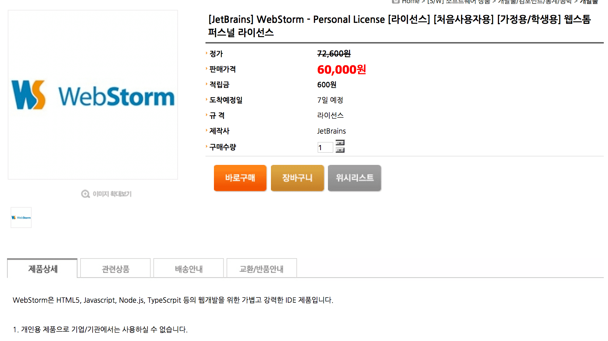

여름방학에 현장실습을 하면서 다음과 같은 경험을 했다.  
> A: 권성 씨, 에디터 좋다. 뭐 써요?
나: 저 웹스톰이요. 저희 학교는 교직원에게만 이메일을 줘서 친구 걸로 인증했어요.
A: 뭐 같은 대학생이니까 상관 없으려나...
(잠시 후...)
A: 어, 웹스톰은 기업용이 아니면 기업에서는 쓰면 안 된다고 하는데요?
나: (나니?!)

  
[국내 유통 업체에서 팔고있는 웹스톰 개인용 라이센스](http://www.kbsmedia.net/shop/shop.htm?type=shopdetail&brandcode=00600800100000000037&NaPm=ct%3Diwuof86w%7Cci%3D39710175c68e1f21f18e9ed8ef37a0ede2bbc992%7Ctr%3Dslsl%7Csn%3D225947%7Chk%3D2c97d4652c52b3836eb42e7e617c1312a1deba82)  
&nbsp;  
내가 느끼기에는 '개인용'이란 단어를 교묘하게  
'가정용/학생용'이라는 단어로 바꿔치운 상술로 밖에 보이지 않았다.  
이 당시에는 서로 바빠서 그냥 무시하고 웹스톰을 계속 썼었는데,  
나중에 취직을 하게 되면 계속 써야할텐데 그 비싼 기업용 라이센스를  
사야하나 싶어서 이번에 집중적으로 알아보았다.

1. 개인용 라이센스를 기업에서도 쓸 수 있는가?  
&nbsp;  
[Can I use my personal license at work and at home?](https://sales.jetbrains.com/hc/en-gb/articles/207240855-Can-I-use-my-personal-license-at-work-and-at-home-)  
<blockquote>Yes, you can use your personal license at work as well as at home. You can use it working on your personal projects as well as projects of your company. Our EULAs do not restrict this.</blockquote>
그냥 써도 된다는 소리다.  
&nbsp;  
[Can I use my personal license for commercial development?](https://sales.jetbrains.com/hc/en-gb/articles/207241015-Can-I-use-my-personal-license-for-commercial-development-)  
<blockquote>Yes, you can use your license for any kind of development. However, only you may use your personal license; you may not share it with others.</blockquote>
직관적으로 상업용 개발을 하는데 개인용 라이센스를 써도 되느냐?  
Yes, 하지만 타인과 공유는 하지 말란다.  
&nbsp;  
2. 개인용 라이센스를 데스크탑과 랩탑에 동시에 설치해도 되는가?  
&nbsp;  
[Can I use my personal license on multiple machines?](https://sales.jetbrains.com/hc/en-gb/articles/206544319-Can-I-use-my-personal-license-on-multiple-machines-)
<blockquote>You may install the product on multiple machines and multiple OS's. However, please note, that our licenses do not allow concurrent connections. This means that the license may only be used on one machine at a time.</blockquote>
다수의 컴퓨터와 다수의 OS에 설치 해도 되지만 동시에 사용하지 말라고 하는데...  
무슨 탐지 기술이라도 있나 싶어서 다른 글을 더 찾아보니...
&nbsp;  
[Using IDE on different machines and operating systems with the same license](https://intellij-support.jetbrains.com/hc/en-us/articles/207241005-Using-IDE-on-different-machines-and-operating-systems-with-the-same-license)  
<blockquote>However, IDE checks for the number of running copies on the local network when starting. In case it finds any copies started with the same license, they are all shut down except the last one.</blockquote>
로컬 네트워크(같은 공유기에 물려있는 경우)에 동일한 라이센스의 IDE가 감지된 경우  
마지막에 실행된 IDE를 빼고 종료를 시킨다고 한다.  
그럼 전 세계의 만날 일 없는 개발자들과 공유하면... 양심에 맡기자.  
&nbsp;  
3. 개인용 라이센스와 기업용 라이센스는 무슨 차이인가?  
&nbsp;  
[What is the difference between commercial and personal licenses?](https://sales.jetbrains.com/hc/en-gb/articles/207241075-What-is-the-difference-between-commercial-and-personal-licenses-)  
<blockquote>A Commercial license is the standard licensing option for organizations and business entities. Licenses are purchased by the company and can be used by any person within this organization.</blockquote>
기업용(상업용, Commercial) 라이센스는 기업이나 기관에서 살 수 있으며,  
즉 `개인이 기업용 라이센스를 사는 것`은 `불가능`하며,  
해당 기업과 기관에 속한 조직원이라면 누구나 해당 라이센스를 쓸 수 있다.  
&nbsp;  
<blockquote>A Personal license is an option for private individuals who purchase a license with their own funds, and solely for their own use. Personal licenses are not to be purchased, refunded or in any way financed by companies.</blockquote>
개인용 라이센스는 개인이 살 수 있으며,  
즉 `기업이 개인용 라이센스를 사주는 것`은 `불가능`하다.  
&nbsp;  
위 사항만 보면 아래와 같은 사항에 대해 어떠한 차이점이 존재하는지 의문점이 생긴다.  
<ol><li>개인용 라이센스를 개인이 사서 개인이 회사에서 작업하나</li><!--
--><li>기업용 라이센스를 기업이 사서 개인이 회사에서 작업하나</li></ol>
[Commercial vs Personal software licenses](http://softwareengineering.stackexchange.com/questions/233898/commercial-vs-personal-software-licenses)  
<blockquote>For Jetbrains, the corporate license is a license that's not linked to an individual. The personal license is linked to a specific person.
What that means inside a company is that if you buy a corporate license for 10 users, any 10 people can use the product at any given time.
If however you buy 10 personal licenses, only the 10 specific people who are mentioned can ever use the product. Were one of them to leave the company, that license becomes useless (though they might have a means to get the license transfered to another person, you'd have to contact Jetbrains about that).</blockquote>
허접한 영어 실력으로 해석해보자면  
<ol><li>기업용 라이센스는 몇 명의 유저가 쓸 수 있는지에 따라서 가격이 달라지는 것 같다.</li><!--
--><li>위에서 구매한 유저 인원수에 따라 로컬 네트워크에 동시 사용을 제한하는 것 같다.</li><!--
--><li>만약 조직 구성원 중 한 명이 떠나면 새로운 개발자에게 기업용 라이센스가 위임되는 것 같다.</li>
마지막으로 `기업용 라이센스를 가진 개인이 집에서 작업을 할 수 있는가?`라는 의문이 들었다.  
[Can I use a commercial license purchased by my company at home?](https://sales.jetbrains.com/hc/en-gb/articles/206544349-Can-I-use-a-commercial-license-purchased-by-my-company-at-home-)  
<blockquote>We, in our EULAs, do not prohibit using commercial licenses of your company at home.
However, please inquire your employer about it as this may vary depending on your company's policies.</blockquote>
사용해도 된다는 소리 같은데, 두 번째 문장을 `Young Gratia` 님께서 친히 번역해주셨다.  
회사 정책에 따라 달라질 수 있으니, 사용 전에 고용주에게 문의해보라는 내용이다.  
&nbsp;  
4. 학생용 라이센스는 개인용 라이센스와 동일한가?  
이 부분에 있어서는 참 질문이 많았다.  
링크에 접속이 되지 않아 직접 주고받은 메일의 pdf 파일을 직접 첨부한다.  
[질문 메일](https://drive.google.com/open?id=0B3_CLdLxNbjRUy0xSThRQlBPVHc)  
[답변 메일](https://drive.google.com/open?id=0B3_CLdLxNbjRNnMtZkNQSzFBUG8)  
&nbsp;  
* 나는 대학생인데 우리 학교는 교직원을 제외하고는 이메일이 제공되지 않는다.  
그래서 친구의 대학 이메일을 빌려서 인증하여 사용 중인데, 이는 유효한 라이센스인가?  
&nbsp;  
<blockquote>You will not need a university email address, it is only necessary to upload an official document showing you are currently a student (you have an option "official document").</blockquote><!--
-->이메일 주소 필요없이 내가 현재 대학생이라는  
사실을 입증할 수 있는 공식적인 서류만 보내면 된단다.  
즉 현재 대학생이라 하더라도 나같이 타인의 이메일을 빌려  
학생 라이센스를 취득한 경우 유효하지 않다.  
&nbsp;  
* 학생용 라이센스를 가지고 기업에서도 사용할 수 있는가?
&nbsp;  
<blockquote>The free student license cannot be used at work for commercial purposes. It is only intended for learning, educational purposes.</blockquote><!--
-->무료 학생용 라이센스는 상업적 목적인 작업에서는 쓰일 수 없단다.  
기업에서는 상업적이지 않을 수가 없으므로 즉 기업에서는 못 쓴다고 보면 된다.  
학생용 라이센스는 오직 학습과 교육을 위해서만 쓰여야한다.  
&nbsp;  
* 학생용 라이센스 인증 기간 도중에 졸업을 하는 경우, 남은 기간동안도 유효한가?  
&nbsp;  
나의 영어 실력이 미흡하여 질문의 의도를 파악하지 못하고,  
졸업생들에게 할인을 해주는 제도에 대해 설명을 하였다.  
만약 졸업 후에 학생용 라이센스 기간이 몇 달 남았다면 집에서만 조용히 쓰도록 하자.  
&nbsp;  
* 대학교 졸업 후에도 이메일이 사라지지 않는 경우, 계속 사용하는 것이 유효한가?  
&nbsp;  
이 역시 나의 영어 실력이 미흡하여 제대로된 답변을 받지 못했으나  
다음의 링크를 보고 답을 얻게 되었다.  
&nbsp;  
[Free for students: Professional developer tools from JetBrains](https://www.jetbrains.com/student/#faq)  
<blockquote>**Is a free Student License perpetual?**
No, the Student License is valid for one year and perpetual licenses are not provided. After one year you will need to renew your Student License for the next year, **or purchase a license if you’re no longer a student.**</blockquote><!--
-->마지막 or 부분부터 해석하자면  
만약 더이상 학생이 아닌 경우에는 구매하라고 한다.  
즉 대학교 이메일이 졸업후에도 사라지지 않더라도 본인이 학생이 아니라면  
그 라이센스는 유효하지 않다.  
만약 사용 가능하다면 집안에서만 조용히 써야할 것이다. 

다른 제품들의 라이센스에 있어서도 상술에 찌든 국내 유통 업체보다는  
해석하기 어렵지만 보다 정확하고 정직한 공식 사이트의 문서들을 참조해야겠다.