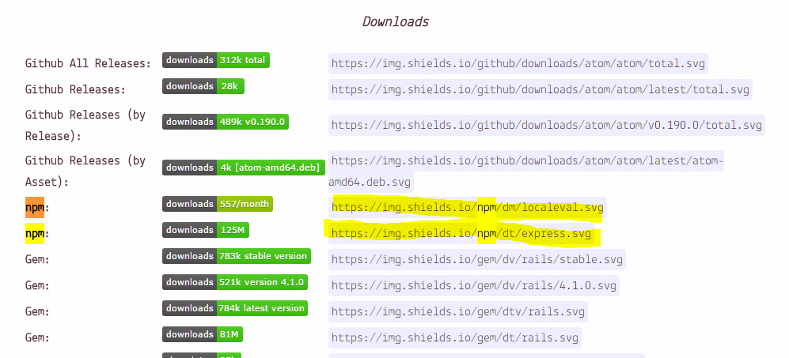
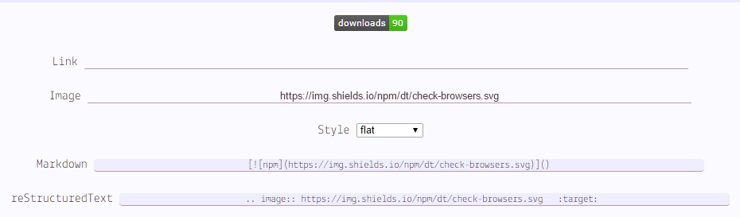
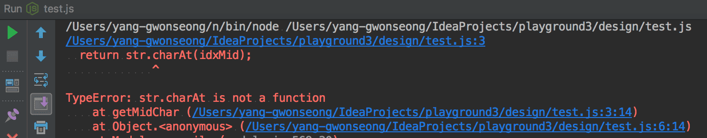
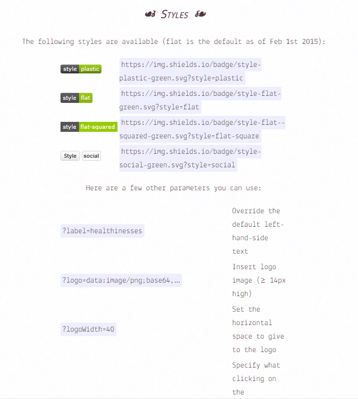
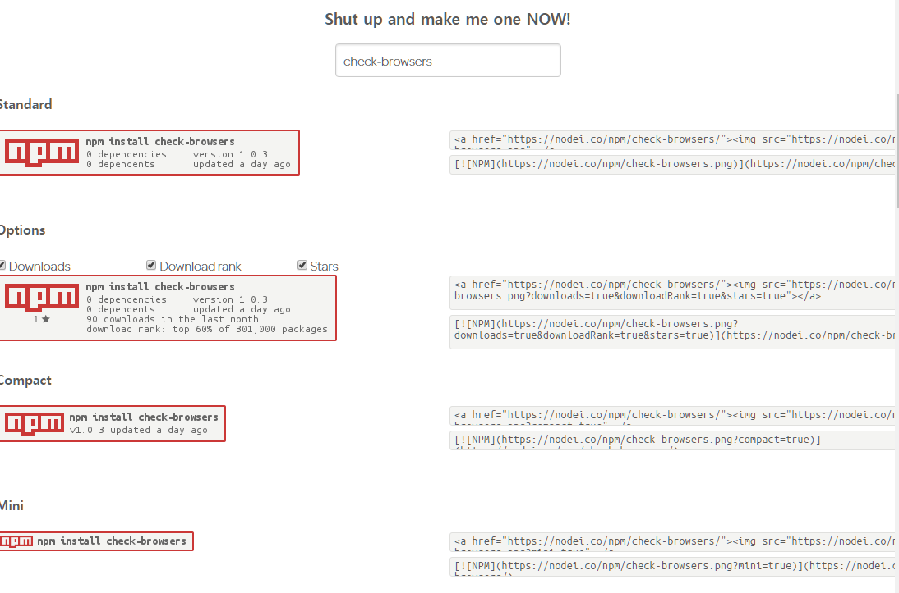

  
이번 포스트는 정말 별 것 없다.  
[마크다운 문법](https://github.com/adam-p/markdown-here/wiki/Markdown-Cheatsheet)에 대한 설명도 아니고 그냥 좀 더 개발자스러운 이미지들을 써보는 글이다.  

## 목차
1. [뭐가 개발자스러운 뱃지인가?](#뭐가-개발자스러운-뱃지인가)
2. [뱃지를 직접 사용해보자](#뱃지를-직접-사용해보자)
3. [커스텀 뱃지 만들기](#커스텀-뱃지-만들기)
4. [NPM 뱃지](#NPM-뱃지)

## 뭐가 개발자스러운 뱃지인가?
  
유명한 라이브러리&프레임워크를 보면 위와 같은 이미지? 스티커?들이 보인다.  
bower며 npm이며 build 등등의 뱃지가 보인다.  
이번 포스트에서 소개할 것은 위 사항들을 사용하는 방법에 대해서 배워보자.

## 뱃지를 직접 사용해보자.
우선 [http://shields.io/](http://shields.io/)로 접속하자.  
여기서 나는 내가 npm에 올린 [check-browsers](https://www.npmjs.com/package/check-browsers)라는 라이브러리의 다운로드 수와 버전을 표시하기로 했다.

  
나는 총 다운로드 수를 표현하고 싶어서 npm의 두 번째 이미지를 클릭하였다.

  
npm 패키지의/dt(다운로드 토탈)/패키지 이름의 형식을 가진다.  
마크다운 문법에서 사용하려면 그냥 복붙하면 된다.

  
이번엔 내 패키지의 버전을 표시해보자.

  
npm 패키지의/v(버전)/패키지 이름의 형식을 가진다.

  
깃헙에서 내 저장소가 따봉 몇 개나 받았는지도 표현할 수 있다.

  
유저이름/저장소 이름의 형식을 가진다.

이외에 커밋 갯수나 트위터 팔로워 뱃지 등등은 직접 찾아서 사용하면 된다.  
또한 뱃지는 svg, json, png 포맷을 지원한다.

## 커스텀 뱃지 만들기
  
커스톰 뱃지의 형태도 나오고 직접 만들어볼 수도 있다.

  
다양한 파라미터를 통해 스타일, 레이블 등등을 바꿔치기 할 수 있다.
이는 커스텀 뱃지나 기존에 만들어져있는 형태의 뱃지에서도 사용이 가능하다.

## NPM 뱃지
NPM 뱃지는 NPM만을 위한 뱃지이다.  
백문이 불여일견, [https://nodei.co/](https://nodei.co/)로 접속해보자.

  
npm에 특화된 다양한 뱃지들이 존재한다.

  
복잡시럽게 읽기 귀찮은 사람들은 간단하게 패키지 이름만 입력하면 다양한 뱃지가 나온다.  

좀 더 커스터마이징 하고 싶은 사람들은 해당 페이지를 읽으면 된다.