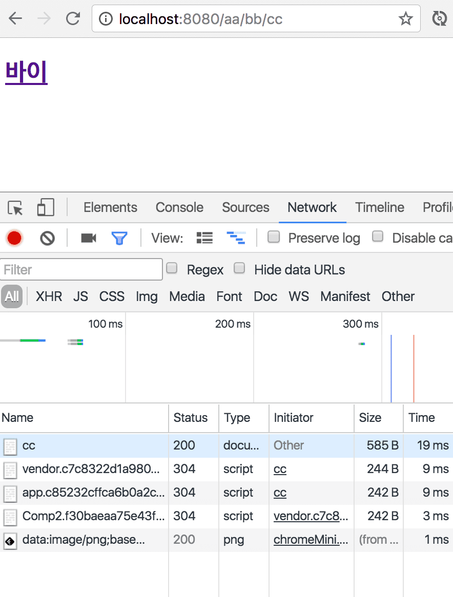

  

메이븐은 기본적으로 빌드할 때 프로필을 지정할 수 있는 것 같은데 gradle은 직접 삽질을 하면서 깨달았다.  
다음의 글들을 보고 Spring boot 1.5.7과 Gradle 3.x(아마)? 에 맞게, 내 입맛에 맞게 각색해보았다.  

* [Gradle 배포 환경 별 설정파일 분리](http://osozaki.tistory.com/14)
* [Gradle에서 서버별 패키징 하기](http://yookeun.github.io/java/2016/04/11/gradle-packing/)

## Profile 구성하기
기본적인 스프링 부트 프로젝트는 다음과 같은 구조를 가질 것이다.  
```
+ project명
  + src
    + main
      + java
        + package명
          - Application.java
      + resources
        - application.properties
    + test
- build.gradle
- gradlew
- gradlew.bat
```

이를 다음과 같이 나눠보자.
```
+ project
  + src
    + main
      + java
        + package
          - Application.java
      + resources
        - application-core.properties
      + resources-env
        + dev
          - application.properties
        + prod
          - application.properties
    + test
- build.gradle
- gradlew
- gradlew.bat
```

.../resources에는 공통적으로 쓰는 설정들이 들어가면 된다.  
application-core.properties에는 테스트 삼아서 다음과 같이 저장해주자.  
```properties
spring.profiles.active=core
core=core
```

.../resources-env/dev에는 개발에 필요한 파일들만 들어가면 된다.  
application.properties에는 테스트 삼아서 다음과 같이 지정해주자.  
```properties
test=dev
```

.../resources-env/prod에는 개발에 필요한 파일들만 들어가면 된다.  
application.properties에는 테스트 삼아서 다음과 같이 지정해주자.  
```properties
test=prod
```

## build.gradle 수정하기
```groovy
ext.profile = (!project.hasProperty('profile') || !profile) ? 'dev' : profile

sourceSets {
	main {
		resources {
			srcDirs "src/main/resources", "src/main/resources-env/${profile}"
		}
	}
}
```
profile 속성의 기본값은 dev이고 그 값에 따라서 리소스 폴더를 지정하는 것이다.  
resources 폴더는 공통적으로 쓰이는 설정 파일들이기 때문에 공통적으로 들어가면 된다.  

샘플 예제는 다음과 같다.  
```groovy
buildscript {
	ext {
		springBootVersion = '1.5.7.RELEASE'
	}
	repositories {
		mavenCentral()
	}
	dependencies {
		classpath("org.springframework.boot:spring-boot-gradle-plugin:${springBootVersion}")
	}
}

apply plugin: 'java'
apply plugin: 'eclipse'
apply plugin: 'org.springframework.boot'

// 이 위치 전에 profile을 구분하는 구문이 오면 오류가 난다.

group = 'com.example'
version = '0.0.1-SNAPSHOT'
sourceCompatibility = 1.8

repositories {
	mavenCentral()
}

dependencies {
	compile('org.springframework.boot:spring-boot-starter')
	testCompile('org.springframework.boot:spring-boot-starter-test')
}

ext.profile = (!project.hasProperty('profile') || !profile) ? 'dev' : profile

sourceSets {
	main {
		resources {
			srcDirs "src/main/resources", "src/main/resources-env/${profile}"
		}
	}
}
```

## properties를 사용하는 스프링 빈 만들기
project/src/main/java/package명 아래에 Bean.java를 만들어주자.  
```java
@Component
public class Bean {
    @Value("${core}")
    private String core;
    @Value("${test}")
    private String test;
    @PostConstruct
    private void method() {
        System.out.println("--------------------------------");
        System.out.println(core);
        System.out.println("--------------------------------");
        System.out.println(test);
        System.out.println("--------------------------------");
    }
}
```
@PostConstruct 어노테이션을 사용해서 간단하게 스프링 컨텍스트?가 로딩된 이후에 메소드를 실행하게 했다.  
또한 스프링 빈으로 등록해야 profile에 있는 값을 불러올 수 있으므로 @Component 어노테이션을 사용했다.  
@Value 어노테이션은 profile에 등록된 값을 얻어오는 녀석이다. 

## 실행하기
당연히 터미널에서 프로젝트 디렉토리로 이동해야한다.  

* Gradle CLI 사용하기
```bash
#! prod
SPRING_PROFILES_ACTIVE=core gradle clean bootRun -Pprofile=prod
#! dev
SPRING_PROFILES_ACTIVE=core gradle clean bootRun
```
.../resources 디렉토리 내의 properties 파일을 뒤져서 spring.profiles.active가 core인 녀석을 찾아서 적용시킨다는 내용이다.  
또한 profile이라는 매개변수에 prod를 인자로 넘긴다는 뜻이다.  
profile의 기본값을 dev로 지정해줬기 때문에 dev용 bootRun에서는 빼줘도 된다.

* Gradlew 사용하기
```bash
#! prod
SPRING_PROFILES_ACTIVE=core ./gradlew clean bootRun -Pprofile=prod
#! dev
SPRING_PROFILES_ACTIVE=core ./gradlew clean bootRun
```
graldew는 Gradle CLI 설치 안 한 사람, 혹은 Gradle의 버전에 의존하지 않고 항상 동일한 Gradle 버전으로 빌드/실행고 싶을 때 매우 유용하다.  
gradlew를 이용하기 위해서는 gradle/wrapper 디렉도리에 있는 gradle-wrapper.properties와 gradle-wrapper.jar 파일이 필요하다.  
따라서 해당 디렉토리를 .gitignore에 등록하는 불상사를 일으키지 말자.

* IDE 사용하기  
IDE를 사용하면 GUI라는 친숙한 환경, 클릭 한 번으로 여러 환경 변수와 설정을 넣어서 실행할 수 있다는 장점이 있다.  
물론 AWS나 CLI만 지원하는 환경이라면 위의 두 방법을 활용해야할 것이다.
인텔리제이(갓텔리제이)를 찬양 경배하므로 갓텔리제이로 설명.  
  
  
  
Name에는 프로덕션용으로 bootRun prod를 넣어주고, Gradle project에 project 이름(자동완성 됨)을 입력하고,  
우측 상단의 Single instance only를 체크해서 서버는 하나만 뜨게 하자.(중복 실행 방지, 포트 충돌 방지)  
tasks에는 실행할 태스크를 입력하면 되는데 bootRun이 spring boot를 실행하는 태스크이다.  
그리고 Arguments에 해당 인자를 넘겨야 prod profile이 적용되고,  
Environment Variables에 SPRING_PROFILES_ACTIVE=core까지 지정해줘서 core profile까지 사용하도록 하자.  
또한 task가 실행되기 전에 clean task를 실행해야하므로 좌하단에 보이는 노란색 박스에 있는 + 버튼을 눌러주자.  
  
  
  
production과 동일한데 Arguments에 인자를 넘길 필요가 없다.  
왜냐하면 dev profile이 기본값이기 때문이다.  


위 방법으로 실행해보면 prod/dev에 따라 다른 결과가 나오는 부분도 있고 core에서 불러온 값은 항상 동일하다.  

## 빌드하기
SPRING_PROFILES_ACTIVE=core가 빠진 이유는 빌드할 때는 리소스(profile이 담긴) 디렉토리는 지정할 수 있지만  
profile 파일 자체를 지정할 수는 없기 때문이고, 실행할 때 넘겨줘야한다.  

* Gradle CLI 사용하기
```bash
#! prod
gradle clean build -Pprofile=prod
#! dev
gradle clean build
```

* Gradlew 사용하기(Gradle CLI 설치 안 한 사람)
```bash
#! prod
./gradlew clean build -Pprofile=prod
#! dev
./gradlew clean build
```

* IDE 사용하기  
  
  
  
[실행하기](#실행하기)의 IDE 사용하기 파트를 참고해서 내용을 채워넣자.  
  
[실행하기](#실행하기)의 IDE 사용하기 파트를 참고해서 내용을 채워넣자.  
  

## 왜 이렇게 빌드해야하는 걸까?
  
다른 방식으로 하게되면 개발용/프로덕션용 리소스(+코어 리소스는 필수이므로 제외) 두 개 다 포함되게 된다.  
그럼 개발 서버의 jar 파일이 털렸을 때 압축파일만 풀면 프로덕션 DB 정보 등등까지 알아낼 수 있게 된다.  
따라서 보안 측면에서 이렇게 좀 귀찮게(?) 빌드해야하는 것이다.  

## 빌드한 결과물을 실행하기  
서버에 jar(던 war던) 파일을 배포해서 실행을 할 때는 다음과 같이 하면 된다.  
```bash
java -jar -Dspring.profiles.active=core application.jar
```

## 테스트 코드 작성하기
test 디렉토리로 가서 기본적으로 만들어진 테스트 클래스를 다음과 같이 수정해주자.  
```java
@ActiveProfiles("core")
@RunWith(SpringRunner.class)
@SpringBootTest
public class DemoApplicationTests {
    @Value("${core}")
    private String core;
    @Value("${test}")
    private String test;

    @Test
    public void contextLoads() {
        assertThat(core, is("core"));
        assertThat(test, is("dev"));
    }
}
```
class 이름은 본인이 만든 거에 맞게 설정하고, 테스트 툴은 JUnit4를 사용하였다.(스프링 부트 기본 내장)  
@ActiveProfiles를 넣어서 spring.profiles.active=core인 profile을 찾는 것이다.  
또한 테스트를 실행할 때 profile 매개변수를 넘기지 않았으므로(모든 테스트에 다 넘기려면 ㅎㄷㄷ...) 기본값인 dev profile이 적용된다.  
스프링 컨텍스트가 제대로 로드됐는지 확인하기 위해 @Value 어노테이션으로 profile에 저장된 값을 불러오고 그걸 검증하는 테스트 코드를 짜봤다.  

이거 때문에 총 삽질한 시간만 8시간 이상은 되는 것 같다.  
또 정리만 3시간 이상을... 또르르... ㅠㅠ