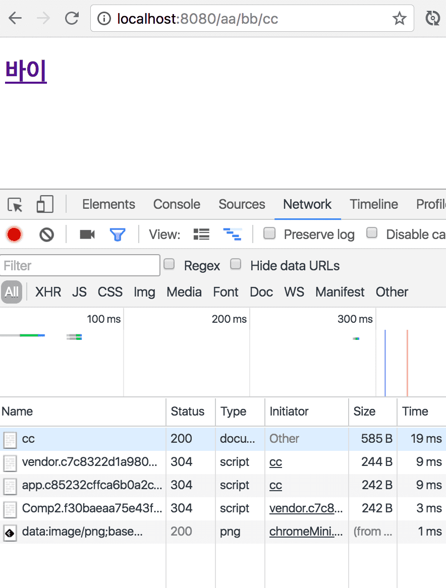
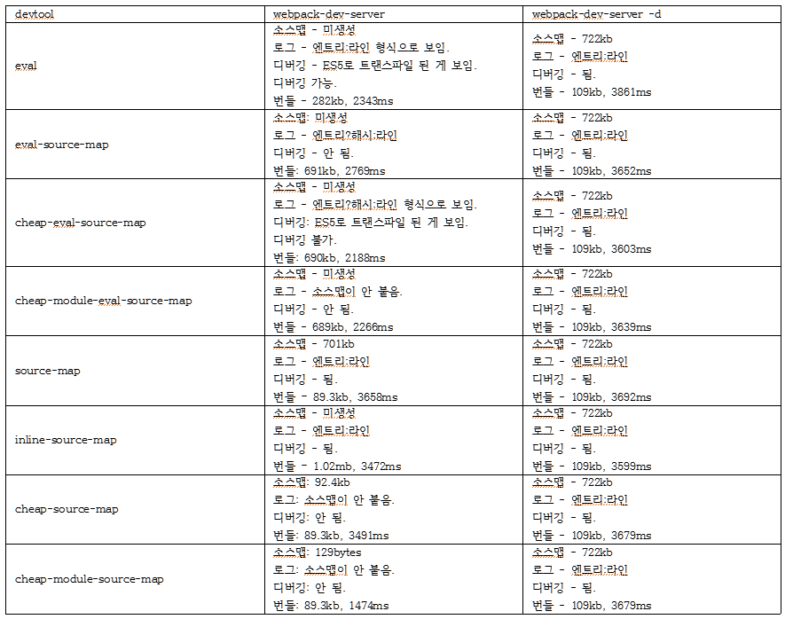

## 목차
1. [들어가기에 앞서](#들어가기에-앞서)
2. [소스맵](#소스맵)
3. [devtool](#devtool)
4. [마치며...](#마치며…)

## 들어가기에 앞서
이 포스트에서는 [웹팩](/2016/11/18/Module-bundling-with-Webpck/)에 대한 기초 내용을 설명하지 않는다.  
웹팩을 모르는 사람은 살포시 뒤로가기를 누르는 걸 권장한다.

## 소스맵

소스맵은 원본 소스와 난독화된 소스를 매핑해주는 방법 중 하나이다.  
*.map 파일을 통해 제공되고, json 형태로 돼있다.  
사진을 통해 한번 보자.  
  
  
  
  

## devtool

웹팩에서 devtool 옵션은 개발을 용이하게 하기 위해 소스맵을 제공하는 옵션이다.  
하지만 devtool 옵션은 굉장히 많고, 그 중 8가지를 테스트 해봤다.

1. eval
2. eval-source-map
3. cheap-eval-source-map
4. cheap-module-eval-source-map
5. source-map
6. inline-source-map
7. cheap-source-map
8. cheap-module-source-map

또한 웹팩에는 배포용 설정과 개발용 설정이 따로 존재하고,  
webpack 명령어와 webpack -d 명령어가 존재하는 등 총 32가지의 테스트를 해봤다.  
먼저 배포용 설정 파일을 보자.  
아래와 같은 설정이 들어있다.

1. ES6 to ES5, 디버깅용 로그들 삭제, js 난독화((이걸 하지 않으면 소스맵이 제대로 붙지 않음.)
2. css 난독화 및 소스맵 적용
3. scss 난독화 및 소스맵 적용
4. html 난독화

```javascript
const path = require('path');
const webpack = require('webpack');
const HtmlWebpackPlugin = require('html-webpack-plugin');

module.exports = {
  devtool: 'devtool 옵션 입력',
  entry: './src/script/entry',
  output: {
    path: path.join(__dirname, 'dist'),
    filename: 'bundle.js',
  },
  plugins: [
    new webpack.optimize.UglifyJsPlugin({
      compressor: {
        warnings: false,
      },
    }),
    new webpack.optimize.OccurrenceOrderPlugin(),
    new HtmlWebpackPlugin({
      template: './src/index.html',
      minify: {
        collapseWhitespace: true,
        keepClosingSlash: true,
        removeComments: true,
      },
      xhtml: true
    })
  ],
  module: {
    loaders: [{
      test: /\.js$/,
      loaders: ['babel', 'webpack-strip?strip[]=debug,strip[]=console.log,strip[]=console.dir'],
      exclude: /(node_modules|bower_components)/
    }, {
      test: /\.css$/,
      loaders: ['style', 'css?sourceMap']
    }, {
      test: /\.scss$/,
      loaders: ['style', 'css?sourceMap', 'sass?sourceMap']
    }]
  }
};
```

  
이제 개발용 설정 파일을 보자.  
아래와 같은 설정이 들어있다.

1. ES6 to ES5, js 난독화 (이걸 하지 않으면 소스맵이 제대로 붙지 않음.) 
2. css 난독화 및 소스맵 적용
3. scss 난독화 및 소스맵 적용
4. 핫 모듈 리플레이스먼트 적용(이 예제에서는 (s)css 파일만 적용됨)
5. 핫 리로드 적용(이 예제에서는 js, html 파일만 적용됨)

```javascript
const path = require('path');
const webpack = require('webpack');

module.exports = {
  devtool: 'devtool 옵션 입력',
  entry: [
    'webpack-dev-server/client?http://localhost:8080',
    'webpack/hot/dev-server',
    './src/script/entry'
  ],
  output: {
    path: path.join(__dirname, '_dist'),
    filename: 'bundle.js',
  },
  plugins: [
    new webpack.HotModuleReplacementPlugin(),
    new webpack.optimize.UglifyJsPlugin({
      compressor: {
        warnings: false,
      },
    })
  ],
  module: {
    loaders: [{
      test: /\.js$/,
      loader: 'babel',
      exclude: /(node_modules|bower_components)/
    }, {
      test: /\.css$/,
      loaders: ['style', 'css?sourceMap']
    }, {
      test: /\.scss$/,
      loaders: ['style', 'css?sourceMap', 'sass?sourceMap']
    }, {
      test: /\.html$/,
      loader: 'raw-loader'
    }]
  },
  devServer: {
    contentBase: './_dist',
    hot: true
  }
};
```



## 마치며...

배포용은 용량이 가장 작은 cheap-module-source-map 옵션을 사용하고 webpack 명령어를 사용하는 게 가장 좋다.  
개발용은 로그, 디버깅, 번들링 타임을 고려하면 inline-source-map 옵션을 사용하고 webpack-dev-server 명령어를 사용하는 게 가장 좋을 것 같다.  
뭐 거의 비슷비슷 하므로 본인의 입맛에 맞게 찾아 쓰면 되겠다.  
또한 devtool은 js 파일의 소스맵하고만 관련 있지, (s)css의 소스맵과는 무관하다.