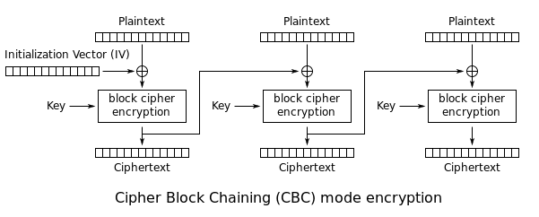

  

막연하게 양방향 암호화 하면 당연스레 AES를 떠올리고, 제대로 모른 채로 사용했다.  
이제부터라도 조금은 알고 써야겠다는 생각이 들어서 살짝 정리해봤다.

## 양방향/단방향 암호화
양방향 암호화는 암호화 및 복호화가 가능하다는 소리다.  
휴대폰 번호 등등 민감한 개인정보는 암호화 해서 저장해야하는데 고객 정보를 식별하기 위해선 복호화도 가능해야한다.  
혹시나 키와 DB가 털린다면 복호화가 가능하므로 적어도 개인정보는 마스킹 한 후에 암호화해서 저장해야한다.  
양방향 암호화 알고리즘에는 DES(보안에 취약), **AES**, SEED(국내에서 개발, 공인인증서에 사용됨) 등등이 있다.

단방향 암호화는 암호화만 가능하고 복호화는 불가능하다는 소리다.  
비밀번호와 같이 암호화 한 값들끼리 단순히 비교만 하면 되고, 복호화 할 필요가 없는 정보들은 단방향 암호화 해야한다.  
혹시나 키와 DB가 털려도 복호화가 불가능하기 때문에 암호화된 값만 알 수 있지 원본 비밀번호는 알 수 없기 때문에 양방향 암호화 보다는 좀 더 안전하다.  
이런 특성 때문에 비밀번호 찾기 대신에 비밀번호 재설정 기능 밖에 지원 할 수 없다. (비밀번호 찾기를 지원해주는 사이트는 보안이 매우 안 좋은 사이트이다.)  
단방향 암호화 알고리즘에는 해시 알고리즘이 사용되며 SHA256, SHA512, MD5(무작위 대입 공격에 약함) 등등이 있다.

## AES (Advanced Encryption Standard)
DES 암호화 방식에 결함이 발견되어 그 이후에 미국에서 열린 암호화 공모전에서 채택된 알고리즘이다.  
대칭키 방식이라 암호화 및 복호화에 사용되는 키 값이 동일하다.  
서버에서 사용되는 AES의 키는 대부분 파일로 저장돼있다기 보다는 키 값에 사용될 값을 어디 비밀스러운 공간에 저장해뒀다가 불러오는 예제가 대다수이다.  
소스코드나 config 파일에 문자열을 하드코딩 해뒀다가 사용하는 곳도 있지만 깃헙 등등이 털리면 답이 없기 때문에 정말 비밀스런 공간에 저장했다가 불러와야한다.  
(정말 비밀스러운 공간에 잘 저장해뒀다가 불러오는 방법은 자세히는 모르겠다.)

### AES128 vs AES192 vs AES256
키 값의 길이에 따라 AES128(128 bit == 16 byte), AES192(192 bit == 24 byte), **AES256(256 bit == 32 byte)**으로 나뉜다.  
키 값이 길면 길수록 무작위 대입 공격에 유리하다는 장점이 있다.  
예를 들면 AES128은 2¹²⁸번 시도해서 공격에 성공한다면 AES256은 2²⁵⁶번 시도해야 성공할 수 있다.

하지만 이것 외에 또 다른 차이점이 있는데, 암호화에는 Round라는 게 존재한다.  
예를 들면 1Round에는 bit-rotation을 진행하고, 2Round에는 1Round에서 나온 걸 XOR 연산하고, 뭐 이런 식으로 각 Round 별로 암호화에 필요한 연산을 진행하게 된다.  
AES128은 10Round, AES192는 12Round, AES256은 14Round에 걸쳐 암호화를 진행한다.  

따라서 AES256은 키 값이 길어서 무작위 대입에도 유리하고, 암호화에 진행되는 Round도 많다보니 다른 방식에 비해 더 우수한 알고리즘이다.  
물론 컴퓨팅 파워를 더 쓰긴 하겠지만, 요즘 서버 스펙에는 큰 무리는 되지 않는다.
오히려 불필요하게 빠르면 무작위 대입 공격에 더 불리해질 뿐이다. (유저 입장에서는 ms 단위의 차이는 체감도 하지 못할 수준일 것이다.)

### Block Cipher
AES는 128 bit(16 byte)라는 고정된 블럭 단위로 암호화를 수행한다.  
이는 키 값의 길이와는 전혀 무관하다.  
하지만 AES는 128 bit까지만 암호화 할 수 있으므로 128 bit가 넘어가는 데이터를 암호화하기 위해 **Block Cipher Mode**(EBC, **CBC** 등등)를 선택해야한다.    
즉 256 bit의 평문을 암호화 할 때 두 개의 128 bit로 쪼개서 각각 암호화를 수행하게 된다.  

또한 128 bit의 블럭으로 쪼개기 때문에 128 bit 보다 작은 블럭이 나올 수 있는데 이런 블럭은 뒤에 값을 붙여주는데 이 값을 **padding**이라고 부른다.  
이따 나올 예제에서 사용하는 패딩의 종류를 보면 PKCS#5 padding을 사용하고 있다.  
하지만 PKCS#5 padding은 8 byte 블럭에 대한 패딩인데 왜 PKCS#5 padding을 사용하는지 의문을 가지게 된다.  
[스택오버플로우의 한 댓글](https://stackoverflow.com/questions/20770072/aes-cbc-pkcs5padding-vs-aes-cbc-pkcs7padding-with-256-key-size-performance-java#comment31139784_20770158)을 살펴보면  
레거시의 잔재인 것 같고, 내부적으로는 PKCS#7 padding으로 변환되는 것 같다.  
PKCS#7 padding은 1~255 byte의 block에 대한 패딩을 만들어내는 방식이다.  
소스 코드에서 PKCS#5 padding을 사용하는 것처럼 보이는 게 싫다면 [Bouncy Castle](https://www.bouncycastle.org/)을 사용해야한다.  
Bouncy Castle 없이 PKCS#7 padding을 사용하려고 하면 java.security.NoSuchAlgorithmException 예외를 만나게 될 것이다.

#### EBC (Electronic Codebook)
짧게 말하면 **실무에서는 절대 사용하면 안 되는** Mode이다.

  

이미지 출처: [https://en.wikipedia.org/wiki/Block_cipher_mode_of_operation#Electronic_Codebook_(ECB)](https://en.wikipedia.org/wiki/Block_cipher_mode_of_operation#Electronic_Codebook_(ECB))

EBC는 각 블럭을 독립적으로 암/복호화한다.  
독립적으로 암호화하기 때문에 병렬로 암/복호화 할 수 있기 때문에 속도 측면에서 장점을 가진다.  
또한 키값만 설정하면 되기 때문에 사용하기 쉽다는 장점도 가지고 있다.

```kotlin
// 키 길이는 256 bit(32 byte)이다.
private const val KEY_LENGTH = 32
// 1바이트 문자열이 아닌 경우에는 java.security.InvalidKeyException: Invalid AES key length 오류가 난다. (ex: 한글 등등)
private val KEY = "a".repeat(KEY_LENGTH)

object AES256ECB {
    private val secretKeySpec = try {
        SecretKeySpec(KEY.toByteArray(), "AES")
    } catch (e: Exception) {
        println("Error while generating key: $e")
        null
    }

    fun encrypt(plainText: String): ByteArray? = try {
        // 각각 알고리즘/Block Cipher Mode/Padding 메카니즘이다.
        val cipher = Cipher.getInstance("AES/ECB/PKCS5PADDING")
        cipher.init(Cipher.ENCRYPT_MODE, secretKeySpec)
        cipher.doFinal(plainText.toByteArray())
    } catch (e: Exception) {
        println("Error while encrypting: $e")
        null
    }

    fun decrypt(cipherText: ByteArray?): String? = try {
        // 각각 알고리즘/Block Cipher Mode/Padding 메카니즘이다.
        val cipher = Cipher.getInstance("AES/ECB/PKC55PADDING")
        cipher.init(Cipher.DECRYPT_MODE, secretKeySpec)
        String(cipher.doFinal(cipherText))
    } catch (e: Exception) {
        println("Error while decrypting: $e")
        null
    }
}
```

```kotlin
private const val PLAIN_TEXT = "a"

internal class AES256ECBTest {
    @Test
    internal fun testEncrypt() {
        // 0 ~ 127 bit까지는 한 블럭 안에 담긴다.
        val encrypted = AES256ECB.encrypt("")
        assertThat(encrypted?.size).isEqualTo(BLOCK_SIZE)
    }

    @Test
    internal fun testDecrypt() {
        val encrypted = AES256ECB.encrypt(PLAIN_TEXT)
        val decrypted = AES256ECB.decrypt(encrypted)

        assertThat(PLAIN_TEXT).isEqualTo(decrypted)
    }
}
```

하지만 각 블럭이 독립적으로 암호화 되기 때문에 더 빨리 공격당하기 쉽고(병렬로 암/복호화 시도), 아래와 같은 결함을 가진다. 
```kotlin
private const val PLAIN_TEXT = "a"
private const val BLOCK_SIZE = 16
private const val DUPLICATED_COUNT = 5

internal class AES256ECBTest {
    @Test
    internal fun `반복된 문자열을 암호화 하면 반복된 암호문 블럭이 나온다`() {
        // 좀 더 깔끔한 예제를 만들기 위해 패딩 값이 없게 끔 각 블럭을 꽉꽉 채워 암호화 시도한다.
        val encrypted = AES256ECB.encrypt(PLAIN_TEXT.repeat(BLOCK_SIZE * DUPLICATED_COUNT))
        val encryptedBlocks = mutableListOf(
                encrypted?.copyOfRange(BLOCK_SIZE, BLOCK_SIZE + BLOCK_SIZE) ?: byteArrayOf()
        )

        for (i in 1 until DUPLICATED_COUNT) {
            val firstBlock = encryptedBlocks.first()
            val currentBlock = encrypted?.copyOfRange(i * BLOCK_SIZE, i * BLOCK_SIZE + BLOCK_SIZE) ?: byteArrayOf()

            if (firstBlock.contentEquals(currentBlock)) continue
            encryptedBlocks.add(currentBlock)
        }

        // 암호문에 들어간 반복된 문자열들을 추론 가능해짐.
        assertThat(encryptedBlocks.size).isEqualTo(1)
    }

    @Test
    internal fun `똑같은 평문을 암호화 하면 똑같은 암호문이 나온다`() {
        val encrypted = AES256ECB.encrypt(PLAIN_TEXT)
        val encrypted2 = AES256ECB.encrypt(PLAIN_TEXT)

        // 딕셔너리를 만들어두면 어느 정도 암호문의 평문 데이터 추론이 가능해진다.
        assertThat(encrypted).isEqualTo(encrypted2)
    }
}
```

위와 같은 보안적 결함 때문에 1 ~ 127 bit의 데이터를 암호화 할 때만 사용해야한다고 하던데,  
그런 거 따질 시간에 그냥 안전한 CBC 모드를 무조건 쓰는 걸 권장한다.  

#### CBC (Cipher Block Chaining)
예제를 찾다보면 가장 많이 보이는 Mode인 것 같다.

  

이미지 출처: [https://en.wikipedia.org/wiki/Block_cipher_mode_of_operation#Cipher_Block_Chaining_(CBC)](https://en.wikipedia.org/wiki/Block_cipher_mode_of_operation#Cipher_Block_Chaining_(CBC))

[IV(Initialization vector)](https://en.wikipedia.org/wiki/Initialization_vector)라는 처음보는 값이 사용된다.  
vector는 힘과 방향을 가진다 라고 학교에서 배웠었는데 여기서 어떤 의미로 vector가 쓰인 건지는 잘 모르겠다...

첫 블럭의 암호문 결과가 다음 블럭에도 쓰이기 때문에 암호화 할 때 병렬로 처리하지 못한다.  
하지만 복호화 할 때는 복호화 한 블럭이 그 다음 블럭에 사용되는 게 아니기 때문에 병렬로 처리할 수 있다.  
이런 부분에 있어서 무작위 대입 공격에 EBC 보다는 더 유리하지 않을까 싶다.

간단하게 예제를 만들어보자.  
```kotlin
// 키 길이는 256 bit(32 byte)이다.
private const val KEY_LENGTH = 32
// 1바이트 문자열이 아닌 경우에는 java.security.InvalidKeyException: Invalid AES key length 오류가 난다. (ex: 한글 등등)
private val KEY = "a".repeat(KEY_LENGTH)

// 첫 블럭과 XOR 연산을 해야되기 때문에 iv의 길이는 블럭 사이즈인 16 byte이다.
private const val BLOCK_SIZE = 16
// 16 바이트가 아닌 경우에는 java.security.InvalidAlgorithmParameterException: Wrong IV length: must be 16 bytes long 오류가 나온다.
private val IV = "a".repeat(BLOCK_SIZE)

object AES256CBC {
    private val ivParameterSpec = IvParameterSpec(IV.toByteArray())
    private val secretKeySpec = try {
        SecretKeySpec(KEY.toByteArray(), "AES")
    } catch (e: Exception) {
        println("Error while generating key: $e")
        null
    }


    fun encrypt(plainText: String): ByteArray? = try {
        val cipher = Cipher.getInstance("AES/CBC/PKCS5PADDING")
        cipher.init(Cipher.ENCRYPT_MODE, secretKeySpec, ivParameterSpec)
        cipher.doFinal(plainText.toByteArray())
    } catch (e: Exception) {
        println("Error while encrypting: $e")
        null
    }

    fun decrypt(cipherText: ByteArray?): String? = try {
        val cipher = Cipher.getInstance("AES/CBC/PKCS5PADDING")
        cipher.init(Cipher.DECRYPT_MODE, secretKeySpec, ivParameterSpec)
        String(cipher.doFinal(cipherText))
    } catch (e: Exception) {
        println("Error while decrypting: $e")
        null
    }
}
```

```kotlin
private const val PLAIN_TEXT = "a"
private const val BLOCK_SIZE = 16
private const val DUPLICATED_COUNT = 5

internal class AES256CBCTest {
    @Test
    internal fun testEncrypt() {
        // 0 ~ 127 bit까지는 한 블럭 안에 담긴다.
        val encrypted = AES256CBC.encrypt("")
        assertThat(encrypted?.size).isEqualTo(BLOCK_SIZE)
    }

    @Test
    internal fun testDecrypt() {
        val encrypted = AES256CBC.encrypt(PLAIN_TEXT)
        val decrypted = AES256CBC.decrypt(encrypted)

        assertThat(PLAIN_TEXT).isEqualTo(decrypted)
    }

    @Test
    internal fun `반복된 문자열을 암호화 해도 각 블럭은 다른 암호문 형태로 나온다`() {
        // 좀 더 깔끔한 예제를 만들기 위해 패딩 값이 없게 끔 각 블럭을 꽉꽉 채워 암호화 시도한다.
        val encrypted = AES256CBC.encrypt(PLAIN_TEXT.repeat(BLOCK_SIZE * DUPLICATED_COUNT))
        val encryptedBlocks = mutableListOf(
                encrypted?.copyOfRange(0, BLOCK_SIZE) ?: byteArrayOf()
        )

        for (i in 1 until DUPLICATED_COUNT) {
            val firstBlock = encryptedBlocks.first()
            val currentBlock = encrypted?.copyOfRange(i * BLOCK_SIZE, i * BLOCK_SIZE + BLOCK_SIZE) ?: byteArrayOf()

            if (firstBlock.contentEquals(currentBlock)) continue
            encryptedBlocks.add(currentBlock)
        }

        // 암호문에 들어간 반복된 문자열들이 추론 불가능하다.
        assertThat(encryptedBlocks.size).isEqualTo(DUPLICATED_COUNT)
    }
}
```

하지만 아래 결함은 여전히 가지고 있다.
```kotlin
private const val BLOCK_SIZE = 16
private const val DUPLICATED_COUNT = 5
private const val PLAIN_TEXT = "a"

internal class AES256CBCTest {
    @Test
    internal fun `똑같은 평문을 암호화 하면 똑같은 암호문이 나온다`() {
        val encrypted = AES256CBC.encrypt(PLAIN_TEXT)
        val encrypted2 = AES256CBC.encrypt(PLAIN_TEXT)

        // 딕셔너리를 만들어두면 어느 정도 암호문의 평문 데이터 추론이 가능해진다.
        assertThat(encrypted).isEqualTo(encrypted2)
    }
}
```

`똑같은 평문을 암호화 하면 똑같은 암호문이 나온다`는 문제는 IV값이 매번 고정이기 때문에 발생하는 문제이다.  
IV 값을 암호화 할 때마다 랜덤하게 생성해주면 된다.  
```kotlin
// 키 길이는 256 bit(32 byte)이다.
private const val KEY_LENGTH = 32
// 1바이트 문자열이 아닌 경우에는 java.security.InvalidKeyException: Invalid AES key length 오류가 난다. (ex: 한글 등등)
private val KEY = "a".repeat(KEY_LENGTH)

// 첫 블럭과 XOR 연산을 해야되기 때문에 iv의 길이는 블럭 사이즈인 16 byte이다.
private const val BLOCK_SIZE = 16

object AES256CBC {
    private val secretKeySpec = try {
        SecretKeySpec(KEY.toByteArray(), "AES")
    } catch (e: Exception) {
        println("Error while generating key: $e")
        null
    }
    
    fun encrypt(plainText: String): ByteArray? = try {
        // Generate Random IV
        val iv = ByteArray(BLOCK_SIZE)
        SecureRandom.getInstanceStrong().nextBytes(iv)
        val ivParameterSpec = IvParameterSpec(iv)

        val cipher = Cipher.getInstance("AES/CBC/PKCS5PADDING")
        cipher.init(Cipher.ENCRYPT_MODE, secretKeySpec, ivParameterSpec)
        val encrypted = cipher.doFinal(plainText.toByteArray())

        // Combine Random IV and Encrypted Data
        iv + encrypted
    } catch (e: Exception) {
        println("Error while encrypting: $e")
        null
    }

    fun decrypt(cipherText: ByteArray?): String? = try {
        // Extract IV and Encrypted Data.
        val iv = cipherText?.copyOfRange(0, BLOCK_SIZE)
        val ivParameterSpec = IvParameterSpec(iv)
        val encrypted = cipherText?.copyOfRange(BLOCK_SIZE, cipherText.size)

        val cipher = Cipher.getInstance("AES/CBC/PKCS5PADDING")
        cipher.init(Cipher.DECRYPT_MODE, secretKeySpec, ivParameterSpec)
        String(cipher.doFinal(encrypted))
    } catch (e: Exception) {
        println("Error while decrypting: $e")
        null
    }
}
```
암호화 할 때 매번 랜덤한 IV 값을 생성하고,  
복호화 할 때는 랜덤한 IV 값을 알 수 없기 때문에 암호문 첫 16바이트는 랜덤하게 생성한 IV 값을 붙여서 리턴해야한다.  

```kotlin
@Test
internal fun `똑같은 평문을 암호화 하면 다른 암호문이 나온다`() {
    val encrypted = AES256CBC.encrypt(PLAIN_TEXT)
    val encrypted2 = AES256CBC.encrypt(PLAIN_TEXT)
    assertThat(encrypted).isNotEqualTo(encrypted2)

    val decrypted = AES256CBC.decrypt(encrypted)
    assertThat(decrypted).isEqualTo(PLAIN_TEXT)
    val decrypted2 = AES256CBC.decrypt(encrypted2)
    assertThat(decrypted2).isEqualTo(PLAIN_TEXT)
}
```

그리고 `문자열의 길이에 따라서 암호문의 길이가 달라지기 때문에 평문의 길이가 유추 가능하다`라는 것도 문제라고 생각했는데  
[Java AES Encryption with salt](https://stackoverflow.com/questions/7303103/java-aes-encryption-with-salt)을 보면
비밀번호와 달리 조금은 덜 민감한 정보를 암호화하는 것이기 때문인지 크게 중요치 않다고 여기는 것 같다.  
애초에 AES의 목적이 고정된 길이를 리턴하는 해시 함수가 아니기 때문에도 그런 것 같다.  

#### PBKDF2 (Password-Based Key Derivation Function)
마지막으로 그러면 안 되겠지만 만약에 키 값이 털렸다고 치자.  
하지만 키 값을 그대로 사용한 게 아니라 키 값을 다시 암호화 해서 사용했다면 어느 정도 안심할 수 있다.  
이 때 사용할 키 값은 복호화 할 때도 사용할 키 값이기 때문에 항상 고정된 값을 리턴하는 암호화 알고리즘이어야 한다.  

이를 해소하기 위한 방법이 **Key Derivation Function**이다.
Key Derivation Function은 키 값도 늘려버리고, 암호화 횟수도 여러 번 돌려서 암호화를 수행하는데 시간이 오래 걸린다.  
(하지만 AES는 키값이 128, 192, 256bit로 고정적이라서 키 값을 늘려버리진 않는다.)  
그렇다고 해서 암호화 하는데 몇 초씩이나 걸리는 건 아니지만 해커가 일 초에 수십억 번 공격할 수 있는 걸 수천 번 정도 수준으로 줄여준다.  
수천 번이라고 하니까 그래도 엄청 많아 보이지만 수십억 번에 비하면 새발의 피다.  
또한 해시돼서 나오는 값이라 복호화도 불가능하다.  

그럼 예제를 살펴보자.
```kotlin
// 키 길이는 256 bit(32 byte)이다.
private const val KEY_LENGTH = 32
// 1바이트 문자열이 아닌 경우에는 java.security.InvalidKeyException: Invalid AES key length 오류가 난다. (ex: 한글 등등)
private val KEY = "a".repeat(KEY_LENGTH)

// 첫 블럭과 XOR 연산을 해야되기 때문에 iv의 길이는 블럭 사이즈인 16 byte이다.
private const val BLOCK_SIZE = 16

// PBKDF2에 적용할 값들이다.
private const val SALT = "{,*jbU787l@BcG:L]Oos/?s7EwMo:i/%No2z)sP@ut@=cydO9&@Xa137-ZHkke"
private const val ITERATION_COUNT = 1024
// 키 값이 256 bit이기 때문에 해시 돌린 digest 길이도 256 bit여야 한다.
private const val DIGEST_BIT_LENGTH = 256

object AES256CBC {
    private val secretKeySpec = try {
        val factory = SecretKeyFactory.getInstance("PBKDF2WithHmacSHA256")
        val spec = PBEKeySpec(KEY.toCharArray(), SALT.toByteArray(), ITERATION_COUNT, DIGEST_BIT_LENGTH)
        SecretKeySpec(factory.generateSecret(spec).encoded, "AES")
    } catch (e: Exception) {
        println("Error while generating key: $e")
        null
    }

    fun encrypt(plainText: String): ByteArray? = try {
        // Generate Random IV
        val iv = ByteArray(BLOCK_SIZE)
        val secureRandom = SecureRandom.getInstanceStrong()
        secureRandom.nextBytes(iv)
        val ivParameterSpec = IvParameterSpec(iv)

        val cipher = Cipher.getInstance("AES/CBC/PKCS5PADDING")
        cipher.init(Cipher.ENCRYPT_MODE, secretKeySpec, ivParameterSpec)
        val encrypted = cipher.doFinal(plainText.toByteArray())

        // Combine Random IV and Encrypted Data
        iv + encrypted
    } catch (e: Exception) {
        println("Error while encrypting: $e")
        null
    }

    fun decrypt(cipherText: ByteArray?): String? = try {
        // Extract IV and Encrypted Data.
        val iv = cipherText?.copyOfRange(0, BLOCK_SIZE)
        val ivParameterSpec = IvParameterSpec(iv)
        val encrypted = cipherText?.copyOfRange(BLOCK_SIZE, cipherText.size)

        val cipher = Cipher.getInstance("AES/CBC/PKCS5PADDING")
        cipher.init(Cipher.DECRYPT_MODE, secretKeySpec, ivParameterSpec)
        String(cipher.doFinal(encrypted))
    } catch (e: Exception) {
        println("Error while decrypting: $e")
        null
    }
}
```

```kotlin
internal class AES256CBCTest {
    @Test
    internal fun testEncrypt() {
        val encrypted = AES256CBC.encrypt("")
        assertThat(encrypted).isNotEmpty()
    }

    @Test
    internal fun testDecrypt() {
        val encrypted = AES256CBC.encrypt(PLAIN_TEXT)
        val decrypted = AES256CBC.decrypt(encrypted)

        assertThat(PLAIN_TEXT).isEqualTo(decrypted)
    }
}
```

## 참고자료
* [Block cipher mode of operation](https://en.wikipedia.org/wiki/Block_cipher_mode_of_operation#Cipher_Block_Chaining_(CBC))  
* [Security Best Practices: Symmetric Encryption with AES in Java and Android](https://proandroiddev.com/security-best-practices-symmetric-encryption-with-aes-in-java-7616beaaade9)  
* [initialization vector (IV)](https://whatis.techtarget.com/definition/initialization-vector-IV)
* [What are the practical differences between 256-bit, 192-bit, and 128-bit AES encryption?](https://crypto.stackexchange.com/questions/20/what-are-the-practical-differences-between-256-bit-192-bit-and-128-bit-aes-enc)  
* [What is the difference between PKCS#5 padding and PKCS#7 padding](https://crypto.stackexchange.com/questions/9043/what-is-the-difference-between-pkcs5-padding-and-pkcs7-padding)  
* [Java AES Encryption Decryption Example](https://howtodoinjava.com/security/java-aes-encryption-example/)  
* [AES Encryption and Decryption in Java(CBC Mode)](https://www.javacodegeeks.com/2018/03/aes-encryption-and-decryption-in-javacbc-mode.html)    
* [Java AES CBC encryption example](https://gist.github.com/itarato/abef95871756970a9dad)  
* [Java AES Encryption with salt](https://stackoverflow.com/questions/7303103/java-aes-encryption-with-salt)
