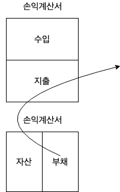
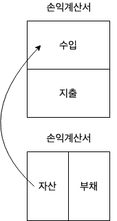
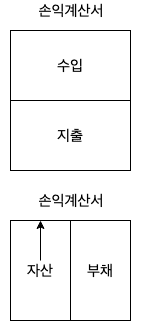

돈으로부터 자유로워지려면 어떻게 해야할까?  
월급을 얼마를 받던 상관없이 내가 원하는 삶을 살 수는 없을까?  
지금은 내가 일을 해서 돈을 벌지만, 내가 일을 못하게 되면 어떤 삶을 살아야할까?    
그렇다면 평생 일을 할 수 있다면, 죽을 때까지 계속해서 일을 해야하는 걸까?

사람마다 일과 삶(Working & Life), 그리고 돈에 대한 가치가 다 다르겠지만 내 스스로 기준을 정하고 내가 원하는 삶으로 이끌어나가기 위해서 책을 읽은 내용을 토대로 좀 정리해봤다.  

## 자산과 부채
로버트 기요사키의 [부자 아빠, 가난한 아빠](https://book.naver.com/bookdb/book_detail.nhn?bid=13347349)에서는 다음과 같이 설명하고 있다.  

> 자산은 내 지갑에 돈을 넣어주고, 부채는 내 지갑에서 돈을 꺼내간다.

### 자산
로버트 기요사키의 [앞으로 10년, 돈의 배반이 시작된다](https://book.naver.com/bookdb/book_detail.nhn?bid=6862489)에서는 자산을 아래 4종류로 분류하고 있다.  

1. 기업  
세계적인 기업들(MS, Google, Apple, Facebook, etc.) 뿐만 아니라 기본적으로 기업은 이익을 창출하는 집단이다
2. 부동산  
월/전세를 놓던, 싸게 사서 더 비싸게 팔던, 건물을 지어서 팔던, 부동산을 통해서도 수익을 낼 수 있다.
3. 금융자산  
주식, 펀드, 채권 등등을 통해 수익을 낼 수 있다.
4. 상품(원자재)  
금, 은 등등의 상품을 통해서도 수익을 낼 수 있다. (물론 금, 은의 가격이 떨어지기도 한다.)  
금과 은의 가격이 등락하는 이유는 미국이 달러의 금본위제도를 폐지하면서 돈이 인쇄 가능한 종이 쪼가리(수준으로 전락)에 불과하기 때문이다.  

### 부채
  
일반적으로 생각하는 빚(은행이나 각종 방법으로 빌린 돈) 말고도 다양한 종류의 부채가 존재한다.

* 자동차  
많은 사람들이 자동차를 산다.  
자동차는 많은 편리함을 주는 반면에 자산과 부채 관점에서 보면 부채에 불과하다.  
자동차를 구매해서 운전하는 순간 자동차의 가치(금액)은 곤두박질 치고, 기름값과 각종 유지비용은 **내 지갑에서 돈을 꺼내가는 부채**이다.  
* 집  
부동산은 자산이 될 수도, 부채가 될 수도 있다.    
집은 오래되면 수리해야하고, 각종 세금도 있고, 주택담보대출 등등의 부채에 대한 이자 또한 **내 지갑에서 돈을 꺼내가는 부채**이다.  
많은 사람들이 평생 내 집 마련을 위해 일하고, 이를 자산으로 여기는데 현금흐름을 창출해내지 못하는 이상 집은 부채에 불과하다.  
* 시간이 지나면 가격이 떨어지는 각종 사치품(시계, 옷, 가방 등등)  
시간이 흘러가면 흘러갈 수록 가치가 올라간다면 부채는 아니겠지만, 그렇지 않은 경우에는 부채다.  
이를 사기 위해 내 지갑에서 돈을 꺼냈는데 이 사치품들은 지나면 지날 수록 가치가 떨어지기 때문이다.  
심지어 이런 사치품들을 사기 위해 할부나 빚을 냈다면 상황은 더더욱 심각하다.

이 외에도 상당히 많은데 내가 어떻게 설명해야할 지 모르겠다.

#### 좋은 부채
그렇다고 해서 부채가 무조건 나쁘다는 건 아니다.  
부채를 통해 자산을 만들어낼 수 있다면 좋은 부채다.  
만약에 은행에서 연 금리 5%로 대출을 받았는데 그 대출금으로 연 6%의 수익률을 낸다면 그 부채는 좋은 부채다.
  
부채 없이 성공한 부자는 없을 것이고, 현재 부자들도 대부분 부채가 있을 것이다.  
만약 현재 부채가 없는 부자라면, 부채가 있었다면 더 큰 부자도 될 수 있었을 것이다.
왜냐면 좋은 부채는 자산을 만들어주는데, 자금이 크면 클 수록 큰 자산을 만들어 낼 수 있고, 자금 조달 수단 중 하나에 부채가 포함되기 때문이다.  

만약 대출받은 100원과 내 돈 100원으로 수익을 내고 있었다고 쳐보자. (수익을 내고 있다는 말은 대출 원리금 상환을 한 후에도 수익이 남는 구조를 뜻한다.)    
내가 투자한 100원을 전부 회수한 이후부터는 내 자본금은 하나도 들이지 않고 수익을 내기 시작하는 것이다.  
이렇게 내 자본금은 하나도 들어가지 않고, 수익을 내는 구조를 **무한수익**이라고 하며, 이렇게 무한 수익을 낼 수 있게 끔 해주는 부채가 가장 좋은 부채가 아닐까 싶다.

#### 나쁜 부채  
자산을 만들어내지 못하는 부채는 전부 나쁜 부채이다. (학자금 대출이 전형적인 경우가 아닐까 싶다.)  
똑같은 자동차라도 가정집에서 그냥 몰면 돈잡아 먹는 부채에 불과하고, 그 자동차로 택시 운전 등등을 통해 현금 흐름을 창출해낸다면 자산이 될 수 있다.  
따라서 그 자동차를 구입하기 위해 받은 대출금 마저도 용도에 따라서 좋은 부채가 될지, 나쁜 부채가 될지가 결정된다.  

대부분의 가계 부채는 나쁜 부채일 것이다.  
내 지갑에서 돈을 꺼내가는 반면에 돈을 채워넣어주지는 않을 것이기 때문이다.  
그렇기 때문에 나는 지갑에 돈을 채워넣기 위해서 더욱 열심히 일해야할 것이다.  

계속해서... 평생...은 일하지 못하기 때문에 문제가 발생한다.  
따라서 은퇴 후에는 각종 연금(국민연금, 퇴직연금, 연금저축보험 등등)에 의존하게 된다.  

하지만 국민 연금의 경우에는 합법적인 **폰지 사기**라는 생각이 든다. (물론 틀렸을 가능성도 크다.)  
폰지 사기는 사기꾼 찰스 폰지의 이름에서 따왔는데 사기의 절차는 다음과 같다.

1. **투자자 A**에게 수익을 약속해서 **폰지**는 투자금을 받는다.  
2. **투자자 B**에게 수익을 약속해서 **폰지**는 투자금을 받는다.  
3. **폰지**는 **투자자 A에**게 수익금을 준다.  

이 폰지 사기의 맹점은 더이상 투자자가 나타나지 않는 이상 수익금은 발생하지 않는다.  
이 폰지 사기를 한 번 국민 연금에 빗대어서 생각해보자.

1. **부모님**에게 물가 상승률 대비 수익을 약속해서 **정부**는 국민연금을 걷는다.  
2. **나**에게 물가 상승률 대비 수익을 약속해서 **정부**는 국민연금을 걷는다.  
3. **정부**는 **부모님**에게 연금을 준다.

저출산, 고령화 시대에 더이상 새롭게 연금을 내줄 사람이 줄어드는 이상 연금은 바닥나거나 젊은이들이 더 많이 부담해야할 것이다.  
정부에서 과연 물가 상승률 대비해서 계속해서 수익을 내고 있을까?  
그렇다면 다행인데 만약 그렇지 않다면 나는 합법적인 폰지 사기와 다를 바 없다고 생각하고 문제가 심각하다고 본다. 

정상적으로 국민연금이 운영됐다는 전제 하에도 예상 수령액을 보면 불우한 내 노후가 눈 앞에 아른거렸다.  
그러다보니 각종 은행 및 보험사 등에서 연금성 저축이나 보험을 권유한다.  
하지만 [황소장의 부동산팩폭](https://www.youtube.com/channel/UC2soFUK5L61ovrRW5L5u-JA)의 [한의사 교수님 그리고 보험](https://www.youtube.com/watch?v=18vDx6p2Ef0) 영상을 보면서 꼼꼼히 검토해보고 가입해야한다.  
영상 내용을 간단히 요약하자면 70년대에 연금 보험을 들었는데 그 때 기준으로 **쌀 두 가마니를 살 수 있는 돈을 저축**했는데, 은퇴 후에 연금을 받아보니 **점심 한 끼 사먹을 수 있는 돈**을 돌려받았다는 얘기이다.  
모든 연금성 저축 상품들이 이렇지 않겠지만 정말 꼼꼼히 검토해보고 가입해야한다.  
과거의 100원과 현재의 100원의 가치는 다르다.  
또한 **현재 1000원을 가지고 있어도 과거의 100원만도 못하게 되는 경우**도 허다하다.
[인플레이션(feat. 물가 상승률)에 대한 내용은 포스트](/2019/08/15/why-central-banks-creates-money/)에 작성해 뒀으니 꼭 이해해야하는 내용 중 하나이다. 

## 현금흐름과 자본이득
  
자신이 가진 부동산 자산에서 나오는 전/월세가 이 경우에 해당한다. (수익형)

  
부동산 가격이 오르거나, 금/은 등의 가격이 오르거나, 주가가 오르는 등이 자본이득이다.  
대부분 투기꾼들이 저가에 사서 **거품**을 잔뜩 끼게 한 다음에 고가에 팔아 치우곤 한다. (시세 차익형)  
이게 과연 거품인지 아닌지를 보는 눈이 있어야 개미들이 피해보지 않을 것이다.  

자본이득 같은 경우에는 미래를 예측하는 눈이 있지 않는 이상은 도박에 불과할 것이다.  
이를 위해서 리스크를 관리하고 회피하는 능력이 있지 않아야할까 싶다.