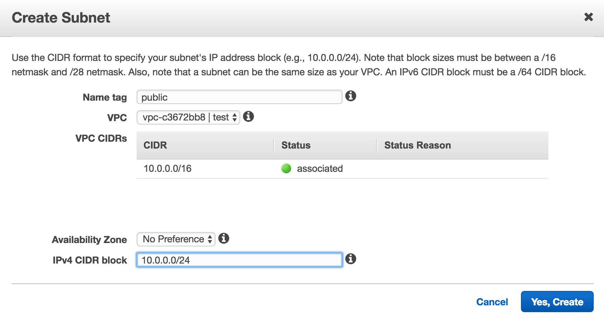

  

## Subnet
서브넷이란 Sub Network, 네트워크의 서브, 메인 네트워크를 쪼갰다고 보면 된다.  
AWS 관점에서 봤을 때 메인 네트워크는 [VPC](/2018/04/25/aws-vpc)라고 보면 된다.    

### Public Subnet
Public Subnet이란 **외부에서 접근이 가능한 네트워크** 정도로 이해하면 될 것 같다.

Public Subnet을 만드려면 AWS 콘솔에서 VPC 서비스로 이동해서 좌측 탭 중에 Subnets를 클릭하고, Create Subnet를 클릭한다.

  
Name tag를 정하고 어떤 VPC에 Subnet을 생성할 것인지 선택하면 된다.  
VPC가 Region에 생성되는 것에 반해 Subnet은 어떤 [AZ(Availability Zone)](https://docs.aws.amazon.com/ko_kr/AWSEC2/latest/UserGuide/using-regions-availability-zones.html#concepts-regions-availability-zones)에 생성될 것인지도 정해야한다.  
따라서 AZ가 다운돼서 장애가 발생하는 것을 방지하려면 Multi AZ로 Subnet을 생성해야하지만, 포스트에서는 단일 AZ로 진행하도록 하겠다.  
그리고 Subnet의 <a href="https://ko.wikipedia.org/wiki/%EC%82%AC%EC%9D%B4%EB%8D%94_(%EB%84%A4%ED%8A%B8%EC%9B%8C%ED%82%B9)" target="_blank">CIDR Block</a>을 지정해야하는데,
Subnet은 VPC의 Subset이기 때문에 VPC의 cidr block을 초과해서 정할 수 없다.
또한 미리 생성한 Subnet의 cidr block과 겹쳐서도 안 된다.  
[ip class](https://ko.wikipedia.org/wiki/%EB%84%A4%ED%8A%B8%EC%9B%8C%ED%81%AC_%ED%81%B4%EB%9E%98%EC%8A%A4)를 참고해서 네트워크 규모에 따라서 cidr block을 설정하면 된다.  

`또한 서브넷 내의 리소스(EC2 인스턴스, ELB 등등)는 무조건 private ip를 가지는데, private ip는 고정할 수 없고,
생성될 때 서브넷의 cidr block 내의 ip가 랜덤으로 할당된다.`

  
기본적으로 서브넷에는 설정에는 서브넷 내의 리소스에 대해 public ip를 자동으로 할당하지 않게 설정돼있다.  
우리는 만드는 목적 자체가 public subnet이기 때문에 public ip를 자동으로 할당하도록 설정하자.

### Internet Gateway
Internet Gateway는 VPC의 문지기와도 같은 역할을 한다.  
VPC 외부에서 접근할 때 항상 Internet Gateway를 거쳐서 접근하게 된다.  
따라서 Public Subnet을 구성하기 위해서는 Internet Gateway를 무조건 만들어야한다.  
VPC 서비스 좌측 탭 중에 Internet Gateways를 클릭하고 Create internet gateway를 클릭하고 Name tag를 입력해서 Internet Gateway를 생성하자.  

  
Internet Gateway는 기본적으로 vpc에 안 붙어있기 때문에 vpc에 붙여주자.  
여기서 끝이 아니고, Subnet에 Route Table을 설정해줘야한다.  

### Route Table
Route Table이란 어떤 IP 주소로 가야할 때 어디로 가야하는지를 나타낸 경로를 뜻한다.  
기본적으로 VPC를 생성하면 Main Route Table이 생성되고, 라우트 테이블을 설정하지 않은 서브넷들은 암묵적으로 메인 라우트 테이블이 설정된다.  
이 포스트에서는 메인 라우트 테이블을 수정하도록 하겠다.  
 
Route Table을 수정하려면 AWS 콘솔에서 Route Tables 서비스로 이동해서 해당 vpc의 메인 라우트 테이블을 선택하고, Edit 버튼을 클릭한다.
  
우선 메인 라우트 테이블의 Destination은 vpc의 cidr block이 할당돼있고, target은 local로 돼있다.  
vpc 내부 자원에 대해서는 cidr block 범위에 해당하는 private ip가 할당돼있기 마련이다.  
따라서 cidr block 내의 ip의 경우에는 local, vpc 내부에서 자원을 찾을 수 있다는 뜻이다.  

우리는 외부와 통신을 해야하기 때문에 라우트 테이블에 인터넷 게이트웨이를 붙어야하기 때문에 Edit 버튼을 누르고 아래와 같이 설정하면 된다.  
  
0.0.0.0/0, 즉 모든 ip에 대해서 인터넷 게이트웨이로 향하게 끔 설정을 했다.  

목적지 ip가 cidr block 내의 private ip(10.0.0.0/16)인 경우에 대해서는 vpc 내부(local)에서 자원을 찾게 끔 설정한 것이고,  
목적지 ip가 cidr block 내의 private ip(10.0.0.0/16)가 아닌 경우(0.0.0.0/0)에 대해서는 인터넷 게이트웨이를 통해서 vpc 외부로 내보내는 것이다.  

### EC2 인스턴스 생성
다른 리소스(ELB 등등)을 해도 되지만 포스트에서는 가장 간단한 [EC2](https://aws.amazon.com/ko/ec2/)로 선택했다.  
EC2 인스턴스는 간단하게 설명하면 그냥 서버 장비 한 대라고 생각하면 된다.  

AWS 콘솔에서 EC2 서비스로 이동해서 Launch Instance를 클릭하자.  
입맛에 맞게 설정을 하면 되는데, Step 2에서 Review and Launch 대신에 Configure Instance Details를 선택해주자.  

  
Step3가 핵심이다.  
위에서 만든 VPC와 Public Subnet을 설정하고, public ip 할당 부분을 enable로 하던가,
아니면 서브넷에 자동으로 public ip 할당 설정이 돼있다면 Use subnet setting을 그대로 내비두면 된다.  

그 이후에는 입맛에 맞게 인스턴스를 생성하면 외부에서 접근 가능한 리소스를 만든 셈이다.  

### 외부에서 접근 가능하게 하기 위한 조건
1. Subnet에 설정된 Route Table에 Internet Gateway가 설정돼있어야한다. (Public Subnet)  
2. 결국 외부에서 접근하는 IP 주소는 Subnet 내의 리소스로 접근하기 때문에 리소스를 만들 때는 꼭 public ip를 할당해야한다.

