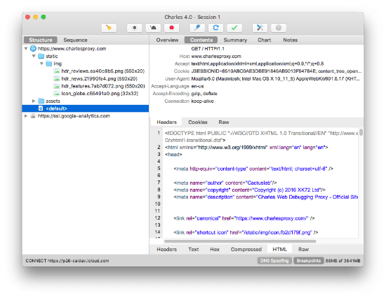

  
  
내 PC에서는 잘 되는데 버그 제보자가 직접 모바일 웹에서 안 되는 걸 보여줬다.  
그리고 내 모바일에서도 해봤고, 다른 사람들의 모바일에서도 전부 안 됐다. (안드로이드, iOS에서 크롬, 사파리, 삼성 인터넷 가릴 것 없이 다 안 됐다.)  

PC에서는 잘 되고, 모바일에서는 안 된다... 나는 당연히 프론트 이슈로 여겼다.  
혹시 서버 쪽 이슈일까봐 액세스 로그를 모니터링해보니 헬스 체크 이외에 로그가 안 찍히길래 자바스크립트 어딘가에서 오류가 나서 API 호출도 못 하는 거라고 확신했다.  

프론트 개발자 분께서 모바일 브라우저 디버깅을 위해 세팅도 다 했는데 브라우저의 콘솔을 보니 에러 로그가 안 찍히는 것이었다.  
  

귀신이 곡할 노릇이라 환경을 완전히 통일시키기 위해 도커로 띄워야하나... 이런 고민까지 하고 있던 찰나에  
프론트 개발자 분께서 내가 접속한 와이파이(사내 와이파이)와 자신이 모바일로 접속한 와이파이(게스트용 와이파이)의 차이점을 발견하였다.  
(사내 정책 때문에 모바일에서는 게스트용 와이파이를 쓰고 있었다.)  

  

## 분석
  
우선 상황은 이랬다.  
* 초반에 상품 10개는 잘 불러온다. (왜 잘 불러와지지?)  
* 추가로 상품 10개를 더 불러오려고 하면 불러와지지 않는다. (왜 안 불러와지지?)

계속 고뇌에 빠졌고, 결국 네트워크 지식이 부족한 탓에 이런 일이 일어났었다.

### 초반에 상품 10개는 잘 불러온다.
우선 프론트 엔드에서 렌더링을 빠르게 하려는 이유에서인지 SSR(Server Side Rendering)을 사용했다.
  
일반적인 CSR(Client Side Rendering)에서는 클라이언트 측에서 AJAX 방식으로 API를 호출했다면,  
SSR은 클라이언트 측에서 렌더링이 되기 전에 필요한 데이터가 모두 갖춰진 상태로 서버에서 HTML 파일을 내려주는 형태이다.  
즉, API 호출이 서버에서 일어난다. (이는 **Server to Server**로 API 호출이 일어남을 의미한다.)  

  
  
  

위와 같이 Security Group을 세팅하고, 초반에 불러오는 상품은 SSR의 특성상 Server to Server로 호출하기 때문에 API 호출이 성공했던 것이다.

### 추가로 상품 10개를 더 불러오려고 하면 불러와지지 않는다.
  
  
  
위와 같이 구성하니 개발환경이 아닌 경우(게스트 와이파이나 LTE 등등)에는 API 호출이 실패하는 것이었다.  
이래서 내 로컬(사내 와이파이)에서는 잘 되는데, 버그 제보자의 모바일(게스트 와이파이)에서는 장애가 재현된 것이다.  
즉, 초기 SSR로 호출하는 API(Server to Server 방식)을 제외하고는 제대로 API 호출이 안 되는 상황이었다.  

따라서 모든 IP에 대해서 API에 대한 접근을 허용할 수 밖에 없었다.  
(추후에는 Front 서버를 통해서만 통신하게 끔 변경해야할 것이다.) 

## 오늘의 교훈은 뭘까~~~요?
  
오늘 느낀 점은 **남탓**을 하지 말자 이다.  
나는 당연히 프론트 이슈일 줄 알고 뒷짐지고 있었다.  
그러는 와중에 프론트 개발자 분은 모바일 디버깅 환경까지 세팅하고, Charles(패킷 캡쳐 도구)까지 깔아서 오류를 분석해주셨다.  
심지어 이번 이슈의 핵심인 와이파이가 다르다는 점까지 발견해주셨다.  
그동안 나는 뒷짐을 지고 있었다. ~~(그렇다고 일을 안 하고 있던 건 아니고...)~~
프론트 개발자 분께서는 충분히 화가 날 수도 있는 상황이었다.  
그 분의 바쁜 시간을 본인의 이슈가 아닌데도 불구하고 열심히 삽질을 했으니 말이다.  

요즘 들어 이 이슈, 저 이슈에 관여를 하면서 `아... 내가 이 이슈까지 봐야할까? 내가 하고 있는 일이랑은 관련이 적어보이는데...`하고 소극적인 태도를 많이 보였다.  
하지만 이번 일을 계기로 이런 생각을 고쳐먹어야겠다고 다짐했다.