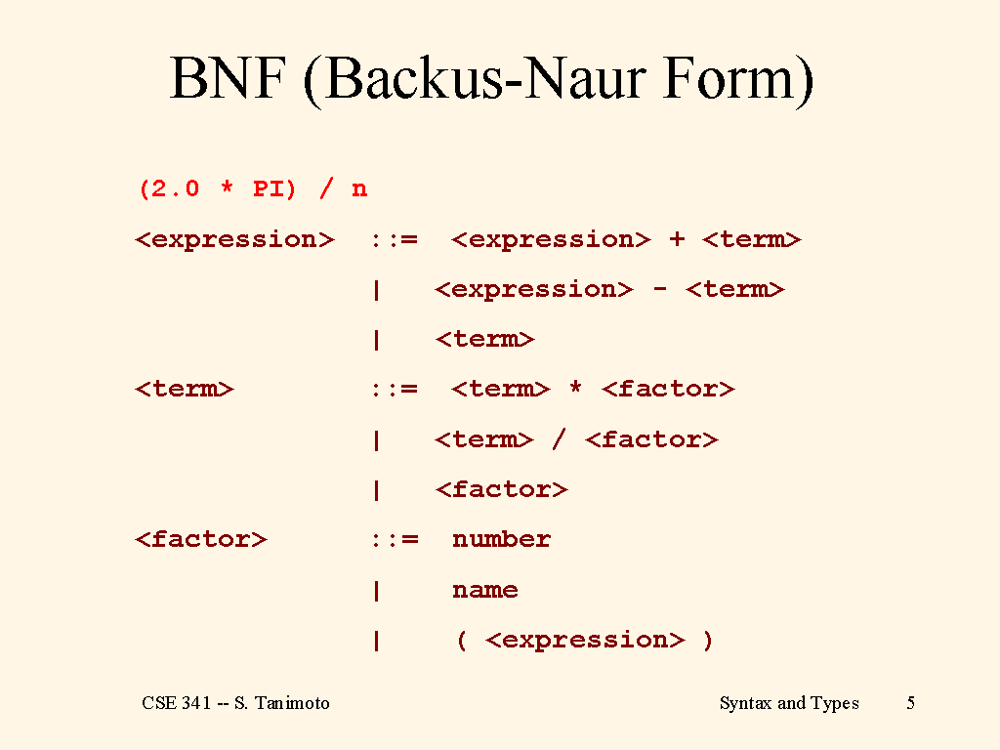

## [BNF(Backus–Naur form)](https://ko.wikipedia.org/wiki/%EB%B0%B0%EC%BB%A4%EC%8A%A4-%EB%82%98%EC%9A%B0%EB%A5%B4_%ED%91%9C%EA%B8%B0%EB%B2%95)  
프로그래밍 언어를 정의하기 위한 메타 언어이다.  
정규화 표현에 많이 사용들 한다고 한다.  
표기법 창시자인 베커스와 그 표기법을 향상시킨 나우르에 의해 베커스 나우르 표기법이란 이름으로 불리고 있다.  

### 표기법
```
<이름> ::= <표현식>
```

표현식은 단말 표현식(더 이상 유도할 수 없는 표현식으로써 `0 1 + *` 같은 애들,
비단말 표현식(유도가 가능한 표현식으로써 `<digit>, <character>`과 )과 같은 표현들을 뜻한다.  

예를 들면 아래와 같이 표기할 수 있다.  
```
<digit> ::= 0 | 1 | 2 | 3 | 4 | 5 | 6 | 7 | 8 | 9
<hex_letter> ::= A | B | C | D | E | F
<hex> ::= <digit> | <hex_letter>
```

### 연산자
* `|`: or을 의미한다.  
`0 | 1 | 2` (0도 되고 1도 되고 2도 되고)
* `-`: 뺄셈의 의미인데 항목 제거의 의미로도 해석할 수 있다.  
```
<digit> ::= 0 | 1 | 2 | 3 | 4 | 5 | 6 | 7 | 8 | 9
<pre-half-digit> ::= 0 | 1 | 2 | 3 | 4
<post-half-digit> ::= <digit> - <half-digit>
<post-half-digit> ::= 5 | 6 | 7 | 8 | 9
```
* `*`: 0개 이상
```
<string> ::= <character>*
```
문자열을 빈 문자열(문자열이 0개)도 포함하므로 문자열이 0개 이상이다.
* `+`: 1개 이상
```
<integer> ::= <digit>+
```
정수는 1개 이상의 숫자로 이루어져있다.  
* `?`: Optional, 있어도 되고, 없어도 되고  
```
<oct-digit> ::= 0 | 1 | 2 | 3 | 4 | 5 | 6 | 7
<oct> ::= 0?<oct-digit>
```
8진수 표기법은 헷갈리지 않게 04 와 같이 표기하지만, 0이 없다고 해서 8진수가 아니라고 말할 수는 없을 것이다. (물론 헷갈릴 순 있겠지만...)  

기타 등등 많지만... 기본적인 내용들은 빼고 자주 쓰는 애들만 적어봤다.  

### 누가 쓰나
* [yaml 스펙](http://yaml.org/spec/1.2/spec.html#id2785586)  

말고는 아직... 못 봤다.
