서버에서 아주 가끔가다가 ClientAbortException(java.io.IOExceiption: Broken pipe)이 발생해서 어떨 때 발생하는지 딥다이브 해봄.


적다보니 글이 길어져 글을 나누었는데 해당 글을 읽고 난 후에 [(Tomcat) ClientAbortException은 왜 발생할까? (Part 2)](/2022/03/20/client-abort-exception-deep-dive-part-02)를 마저 보는 것을 추천함.

---

[https://tomcat.apache.org/tomcat-9.0-doc/api/org/apache/catalina/connector/ClientAbortException.html](https://tomcat.apache.org/tomcat-9.0-doc/api/org/apache/catalina/connector/ClientAbortException.html)
> Extend IOException to identify it as being caused by an abort of a request by a remote client.

외부 클라이언트 측에서 요청을 abort(중단) 시켰을 때 발생하는 예외로 보인다.
톰캣에서 발생시키는 예외인데 Spring Boot의 Web(Mvc) 모듈에서 기본적으로 사용하는 게 Embedded Tomcat이기 때문에 많은 분들께서 자주 마주치지 않았을까... 싶다.
구글링 해보면 뭐 브라우저 이슈(API 응답이 오기 전에 새로고침을 했다던가, 뒤로가기를 했다던가 등등)니 뭐니 하는데 내가 겪은 상황은 server → server 통신에서 발생한 것이기 때문에 서버 간의 통신 관점에서만 파보았다.

삽질을 해보고 싶은 사람은 [https://github.com/perfectacle/client-abort-exception-playground](https://github.com/perfectacle/client-abort-exception-playground) 을 clone 하면 된다.

그리고 ClientAbortException이 발생해도 스프링에서 기본적으로 [HandlerExceptionResolver](https://www.baeldung.com/exception-handling-for-rest-with-spring#exceptionresolver)에서 예외를 핸들링하기 때문에 로그에는 아무것도 남지 않는다.
따라서 해당 에러가 발생하는지 에러 로그로 명확히 확인해보는 게 훨씬 직관적이기 때문에 아래 @RestControllerAdvice를 추가했다.
```kotlin
@RestControllerAdvice
class ControllerAdvice {
    private val log = LoggerFactory.getLogger(this::class.java)

    @ExceptionHandler(value = [Exception::class])
    @ResponseStatus(HttpStatus.INTERNAL_SERVER_ERROR)
    fun handleException(e: Exception): ResponseEntity<Void> {
        log.error(e.message, e)

        return ResponseEntity.internalServerError().build()
    }
}
```

# N줄 요약
1. 클라이언트가 응답 패킷을 받기 전에 연결을 끊으면
   1. ReadTimeout이 발생한 지 60초가 지나기 전에 응답 패킷을 보낸다면 (바로 소켓의 연결을 끊는 게 아니라 오동작을 막기 위해 60초(OS마다 다르지만 tcp_fin_timeout(대다수의 리눅스는 60로초 설정됨)) 동안 대기를 함.)
      ```shell
        # mac (60_000ms)
        sysctl -a | grep net.inet.tcp.fin_timeout
        net.inet.tcp.fin_timeout: 60000
        
        # linux alpine (60s)
        sysctl -a | grep net.ipv4.tcp_fin_timeout
        net.ipv4.tcp_fin_timeout = 60
      ```
      1. 응답 패킷이 아주 작은 경우 (하나의 응답패킷에 담길 만큼)
         1. 아직 소켓이 완전히 닫힌 게 아니기 때문에 응답 패킷을 보낼 수 있기 때문에 ClientAbortException이 발생하지 않는다.
         2. ClientAbortException만 발생하지 않을 뿐이지, 클라이언트 측에서 정상적으로 응답 패킷을 받을 수 있는 건 아니다.
      2. 응답 패킷이 큰 경우 (하나의 응답 패킷에 담기지 않을 만큼)
         1. 아직 소켓이 완전히 닫힌 게 아니기 때문에 몇 개의 응답 패킷을 보낼 수 있다.
         2. 이 때는 ClientAbortException만 발생하지 않을 뿐이지, 클라이언트 측에서 정상적으로 응답 패킷을 받을 수 있는 건 아니다.
         3. 클라이언트 측에서는 FIN 패킷이 오길 원했는데 예상치 못한 패킷이 왔기 때문에 서버 측에 RST 패킷을 보낸 후 소켓을 닫는다.
         4. 나머지 응답 패킷을 보내려고 했는데 소켓이 닫혔기 때문에 `서버 측에서 응답 패킷을 보내려다가 ClientAbortException이 발생한다`.
   2. ReadTimeout이 발생한 지 60초가 지난 이후에 응답 패킷을 보낸다면 (혹은 클라이언트 측 서버 셧다운(배포 혹은 컴퓨터 종료)으로 인해 소켓이 종료된 이후에 보낸다면)
      1. 클라이언트가 ReadTimeout이 발생했다고 바로 소켓의 연결을 끊는 게 아니라 오동작을 막기 위해 60초(OS마다 다르지만 tcp_fin_timeout(대다수의 리눅스는 60로초 설정됨) 만큼) 동안 대기를 함.
      2. 그리고 60초가 지나면 클라이언트/서버 소켓은 모두 종료됨.
      3. 이 상태에서 서버에서 응답 패킷을 보내려고 하면 소켓이 종료됐기 때문에 `서버 측에서 응답 패킷을 보내려다가 ClientAbortException이 발생한다`.
2. [ClientAbortException을 해결하려면?](#ClientAbortException을-해결하려면)
3. 프로세스(메인 함수)가 종료되더라도 Passive Close로부터 FIN 패킷을 받지 않으면 클라이언트/서버의 소켓은 닫히지 않는다. (오동작을 막기 위해 대기하는 것으로 알고 있음.)
   하지만 Passive Close로부터 FIN 패킷이 아닌 다른 패킷이 오면 Active Close에서는 RST 패킷을 보낸 후 소켓을 닫는다. 
   60초(OS마다 다르지만 tcp_fin_timeout(대다수의 리눅스는 60로초 설정됨) 만큼) 동안 대기 후에도 Passive Close에게 아무런 패킷이 오지 않으면 Active Close는 RST 패킷을 보내고 소켓을 닫는다.
4. HTTP Client 구현체마다 다르겠지만 Apache HTTP Client의 경우 Keep-Alive를 사용한다고 했음에도 불구하고 요청이 정상적으로 처리되지 않는 경우(Read Timeout 발생, 500 Internal Sever Error 응답을 받는다던지... 모든 4xx, 5xx가 포함되는 건 아님)에는 커넥션을 커넥션 풀에 반납하지 않고(재사용하지 않고) 종료한다.

# 클라이언트가 응답 패킷을 받기 전에 연결을 끊는 경우

## 1. Read Timeout 발생 후 60초 이내(소켓이 닫히기 전)에 응답 패킷을 전송하는 경우

### 1-1. 클라이언트 측에서 Read Timeout 발생 후 60초 이내(소켓이 닫히기 전)에 응답 패킷을 하나만 전송하는 경우 (응답이 작은 경우)
서버 쪽 API에서 처리하는데 10초 소요되고, 매우 작은 문자열을 응답한다고 가정
```kotlin
@RestController
class SlowResponseController {
    private val log = LoggerFactory.getLogger(this::class.java)

    @GetMapping("/slow")
    fun slow(): String {
        log.info("request is arrived!")

        Thread.sleep(10_000L)

        log.info("slow process is done!")
        return "done!"
    }
}
```

클라이언트 측 리드 타임아웃 설정은 3초로 서버 쪽 처리 시간보다 더 짧게 설정함
```kotlin
fun main() {
    val readTimeout = Duration.ofSeconds(3L)
    val restTemplate = RestTemplate(
        HttpComponentsClientHttpRequestFactory(
            HttpClientBuilder
                .create()
                .setMaxConnPerRoute(100)
                .setMaxConnTotal(100)
                .setKeepAliveStrategy(DefaultConnectionKeepAliveStrategy())
                .setDefaultRequestConfig(
                    RequestConfig.custom().setSocketTimeout(readTimeout.toMillis().toInt()).build()
                )
                .build()
        )
    )

    try {
        restTemplate.getForObject("http://localhost:8080/slow", String::class.java)
    } catch (e: Exception) {
        e.printStackTrace()
    } finally {
        println("[${LocalDateTime.now()}] request is done!")
    }

    // 커넥션 풀에 있는 커넥션을 바로 종료하지 않기 위해 10초간 슬립
    Thread.sleep(10_000L)
    println("[${LocalDateTime.now()}] main function is done!")
}
```

#### 데모 영상


#### 클라이언트 로그
```kotlin
21:15:26.241 [main] DEBUG org.springframework.web.client.RestTemplate - HTTP GET http://localhost:8080/slow
21:15:26.247 [main] DEBUG org.springframework.web.client.RestTemplate - Accept=[text/plain, application/json, application/*+json, */*]
21:15:26.277 [main] DEBUG org.apache.http.client.protocol.RequestAddCookies - CookieSpec selected: default
21:15:26.280 [main] DEBUG org.apache.http.client.protocol.RequestAuthCache - Auth cache not set in the context
21:15:26.280 [main] DEBUG org.apache.http.impl.conn.PoolingHttpClientConnectionManager - Connection request: [route: {}->http://localhost:8080][total available: 0; route allocated: 0 of 100; total allocated: 0 of 100]
21:15:26.284 [main] DEBUG org.apache.http.impl.conn.PoolingHttpClientConnectionManager - Connection leased: [id: 0][route: {}->http://localhost:8080][total available: 0; route allocated: 1 of 100; total allocated: 1 of 100]
21:15:26.285 [main] DEBUG org.apache.http.impl.execchain.MainClientExec - Opening connection {}->http://localhost:8080
21:15:26.289 [main] DEBUG org.apache.http.impl.conn.DefaultHttpClientConnectionOperator - Connecting to localhost/127.0.0.1:8080
21:15:26.289 [main] DEBUG org.apache.http.impl.conn.DefaultHttpClientConnectionOperator - Connection established 127.0.0.1:60596<->127.0.0.1:8080
21:15:26.289 [main] DEBUG org.apache.http.impl.conn.DefaultManagedHttpClientConnection - http-outgoing-0: set socket timeout to 3000
21:15:26.290 [main] DEBUG org.apache.http.impl.execchain.MainClientExec - Executing request GET /slow HTTP/1.1
21:15:26.290 [main] DEBUG org.apache.http.impl.execchain.MainClientExec - Target auth state: UNCHALLENGED
21:15:26.290 [main] DEBUG org.apache.http.impl.execchain.MainClientExec - Proxy auth state: UNCHALLENGED
21:15:26.290 [main] DEBUG org.apache.http.headers - http-outgoing-0 >> GET /slow HTTP/1.1
21:15:26.290 [main] DEBUG org.apache.http.headers - http-outgoing-0 >> Accept: text/plain, application/json, application/*+json, */*
21:15:26.290 [main] DEBUG org.apache.http.headers - http-outgoing-0 >> Host: localhost:8080
21:15:26.290 [main] DEBUG org.apache.http.headers - http-outgoing-0 >> Connection: Keep-Alive
21:15:26.290 [main] DEBUG org.apache.http.headers - http-outgoing-0 >> User-Agent: Apache-HttpClient/4.5.13 (Java/1.8.0_322)
21:15:26.290 [main] DEBUG org.apache.http.headers - http-outgoing-0 >> Accept-Encoding: gzip,deflate
21:15:26.290 [main] DEBUG org.apache.http.wire - http-outgoing-0 >> "GET /slow HTTP/1.1[\r][\n]"
21:15:26.290 [main] DEBUG org.apache.http.wire - http-outgoing-0 >> "Accept: text/plain, application/json, application/*+json, */*[\r][\n]"
21:15:26.290 [main] DEBUG org.apache.http.wire - http-outgoing-0 >> "Host: localhost:8080[\r][\n]"
21:15:26.290 [main] DEBUG org.apache.http.wire - http-outgoing-0 >> "Connection: Keep-Alive[\r][\n]"
21:15:26.290 [main] DEBUG org.apache.http.wire - http-outgoing-0 >> "User-Agent: Apache-HttpClient/4.5.13 (Java/1.8.0_322)[\r][\n]"
21:15:26.290 [main] DEBUG org.apache.http.wire - http-outgoing-0 >> "Accept-Encoding: gzip,deflate[\r][\n]"
21:15:26.290 [main] DEBUG org.apache.http.wire - http-outgoing-0 >> "[\r][\n]"
21:15:29.296 [main] DEBUG org.apache.http.wire - http-outgoing-0 << "[read] I/O error: Read timed out"
21:15:29.296 [main] DEBUG org.apache.http.impl.conn.DefaultManagedHttpClientConnection - http-outgoing-0: Close connection
21:15:29.297 [main] DEBUG org.apache.http.impl.conn.DefaultManagedHttpClientConnection - http-outgoing-0: Shutdown connection
21:15:29.297 [main] DEBUG org.apache.http.impl.execchain.MainClientExec - Connection discarded
21:15:29.297 [main] DEBUG org.apache.http.impl.conn.PoolingHttpClientConnectionManager - Connection released: [id: 0][route: {}->http://localhost:8080][total available: 0; route allocated: 0 of 100; total allocated: 0 of 100]
[2022-03-19T21:15:29.306] request is done!
org.springframework.web.client.ResourceAccessException: I/O error on GET request for "http://localhost:8080/slow": Read timed out; nested exception is java.net.SocketTimeoutException: Read timed out
	at org.springframework.web.client.RestTemplate.doExecute(RestTemplate.java:785)
	at org.springframework.web.client.RestTemplate.execute(RestTemplate.java:711)
	at org.springframework.web.client.RestTemplate.getForObject(RestTemplate.java:334)
	at com.example.playground.slow.SlowResponseRestTemplatePlaygroundKt.main(SlowResponseRestTemplatePlayground.kt:28)
	at com.example.playground.slow.SlowResponseRestTemplatePlaygroundKt.main(SlowResponseRestTemplatePlayground.kt)
Caused by: java.net.SocketTimeoutException: Read timed out
	at java.net.SocketInputStream.socketRead0(Native Method)
	at java.net.SocketInputStream.socketRead(SocketInputStream.java:116)
	at java.net.SocketInputStream.read(SocketInputStream.java:171)
	at java.net.SocketInputStream.read(SocketInputStream.java:141)
	at org.apache.http.impl.conn.LoggingInputStream.read(LoggingInputStream.java:84)
	at org.apache.http.impl.io.SessionInputBufferImpl.streamRead(SessionInputBufferImpl.java:137)
	at org.apache.http.impl.io.SessionInputBufferImpl.fillBuffer(SessionInputBufferImpl.java:153)
	at org.apache.http.impl.io.SessionInputBufferImpl.readLine(SessionInputBufferImpl.java:280)
	at org.apache.http.impl.conn.DefaultHttpResponseParser.parseHead(DefaultHttpResponseParser.java:138)
	at org.apache.http.impl.conn.DefaultHttpResponseParser.parseHead(DefaultHttpResponseParser.java:56)
	at org.apache.http.impl.io.AbstractMessageParser.parse(AbstractMessageParser.java:259)
	at org.apache.http.impl.DefaultBHttpClientConnection.receiveResponseHeader(DefaultBHttpClientConnection.java:163)
	at org.apache.http.impl.conn.CPoolProxy.receiveResponseHeader(CPoolProxy.java:157)
	at org.apache.http.protocol.HttpRequestExecutor.doReceiveResponse(HttpRequestExecutor.java:273)
	at org.apache.http.protocol.HttpRequestExecutor.execute(HttpRequestExecutor.java:125)
	at org.apache.http.impl.execchain.MainClientExec.execute(MainClientExec.java:272)
	at org.apache.http.impl.execchain.ProtocolExec.execute(ProtocolExec.java:186)
	at org.apache.http.impl.execchain.RetryExec.execute(RetryExec.java:89)
	at org.apache.http.impl.execchain.RedirectExec.execute(RedirectExec.java:110)
	at org.apache.http.impl.client.InternalHttpClient.doExecute(InternalHttpClient.java:185)
	at org.apache.http.impl.client.CloseableHttpClient.execute(CloseableHttpClient.java:83)
	at org.apache.http.impl.client.CloseableHttpClient.execute(CloseableHttpClient.java:56)
	at org.springframework.http.client.HttpComponentsClientHttpRequest.executeInternal(HttpComponentsClientHttpRequest.java:87)
	at org.springframework.http.client.AbstractBufferingClientHttpRequest.executeInternal(AbstractBufferingClientHttpRequest.java:48)
	at org.springframework.http.client.AbstractClientHttpRequest.execute(AbstractClientHttpRequest.java:66)
	at org.springframework.web.client.RestTemplate.doExecute(RestTemplate.java:776)
	... 4 more
[2022-03-19T21:15:39.315] main function is done!

Process finished with exit code 0
```
1. 21:15:26.289에 서버와 커넥션 맺음. (`21:15:26.289 [main] DEBUG org.apache.http.impl.conn.DefaultHttpClientConnectionOperator - Connection established 127.0.0.1:60596<->127.0.0.1:8080`)
2. 21:15:26.290에 요청 전송 (`21:15:26.290 [main] DEBUG org.apache.http.wire - http-outgoing-0 >> ...`)
3. 21:15:29.296에 Read Timeout 발생 (정확히 우리가 설정한 3초 후에 발생함, `21:15:29.296 [main] DEBUG org.apache.http.wire - http-outgoing-0 << "[read] I/O error: Read timed out"`)
4. 21:15:29.296 ~ 21:15:29.297에 커넥션 종료 (Keep-Alive 설정했음에도 불구하고, 정상적인 응답을 받지 못했으면 커넥션을 종료함. `21:15:29.296 [main] DEBUG org.apache.http.impl.conn.DefaultManagedHttpClientConnection - http-outgoing-0: Close connection`)
5. 21:15:39.315에 메인함수 종료

#### 서버 로그
```kotlin
2022-03-19 21:15:26.291  INFO 8275 --- [nio-8080-exec-3] c.e.s.SlowResponseController             : request is arrived!
2022-03-19 21:15:36.297  INFO 8275 --- [nio-8080-exec-3] c.e.s.SlowResponseController             : slow process is done!
```
1. 21:15:26.291에 요청 도착
2. 21:15:36.297에 처리 완료 (10초 걸림)

아무런 에러 로그를 출력하지 않기 때문에 서버 측에서는 클라이언트가 올바르게 응답을 처리했는지 알 방법이 없다.

#### 패킷 로그 (소켓 상태)
```kotlin
239	2022-03-19 21:15:26.289278	127.0.0.1	127.0.0.1	TCP	68	60596 → 8080 [SYN] Seq=0 Win=65535 Len=0 MSS=16344 WS=64 TSval=3550708683 TSecr=0 SACK_PERM=1
240	2022-03-19 21:15:26.289504	127.0.0.1	127.0.0.1	TCP	68	8080 → 60596 [SYN, ACK] Seq=0 Ack=1 Win=65535 Len=0 MSS=16344 WS=64 TSval=2530353116 TSecr=3550708683 SACK_PERM=1
241	2022-03-19 21:15:26.289530	127.0.0.1	127.0.0.1	TCP	56	60596 → 8080 [ACK] Seq=1 Ack=1 Win=408256 Len=0 TSval=3550708683 TSecr=2530353116
242	2022-03-19 21:15:26.289547	127.0.0.1	127.0.0.1	TCP	56	[TCP Window Update] 8080 → 60596 [ACK] Seq=1 Ack=1 Win=408256 Len=0 TSval=2530353116 TSecr=3550708683
243	2022-03-19 21:15:26.291192	127.0.0.1	127.0.0.1	HTTP	273	GET /slow HTTP/1.1 
244	2022-03-19 21:15:26.291233	127.0.0.1	127.0.0.1	TCP	56	8080 → 60596 [ACK] Seq=1 Ack=218 Win=408064 Len=0 TSval=2530353118 TSecr=3550708685
245	2022-03-19 21:15:29.297321	127.0.0.1	127.0.0.1	TCP	56	60596 → 8080 [FIN, ACK] Seq=218 Ack=1 Win=408256 Len=0 TSval=3550711691 TSecr=2530353118
246	2022-03-19 21:15:29.297383	127.0.0.1	127.0.0.1	TCP	56	8080 → 60596 [ACK] Seq=1 Ack=219 Win=408064 Len=0 TSval=2530356124 TSecr=3550711691
247	2022-03-19 21:15:36.298103	127.0.0.1	127.0.0.1	HTTP	222	HTTP/1.1 200   (text/plain)
248	2022-03-19 21:15:36.298215	127.0.0.1	127.0.0.1	TCP	44	60596 → 8080 [RST] Seq=219 Win=0 Len=0
```

1. 239 ~ 241번 패킷은 TCP 3 Way Handshake (syn, syn/ack, ack)
   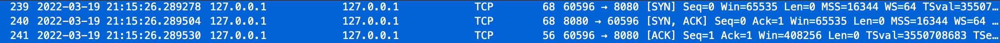
   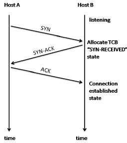
   
2. 243번 패킷에서 클라이언트 → 서버로 HTTP 요청 패킷 전송 (21:15:26.291192)
   
3. 244번 패킷에서 서버가 요청 잘 받았다고 클라이언트한테 ACK 패킷 전송 (21:15:26.291233)
   
4. 245번 패킷에서 클라이언트는 커넥션을 종료한다고 FIN/ACK 패킷을 서버에게 전송 (21:15:29.297321, 정확히 HTTP 패킷 보내고 3초 후(read timeout)임.)
   
5. 246번 패킷에서 서버가 클라이언트로부터 FIN/ACK 패킷을 잘 받았다고 반대로 ACK 패킷을 클라이언트에게 보냄 (21:15:29.297383)
   
6. 클라이언트가 먼저 연결을 종료하겠다는 FIN 패킷을 보냈기 때문에 클라이언트가 Active Close
   서버는 클라이언트로부터 FIN 패킷을 받았기 때문에 서버는 Passive Close가 됨
   (무조건 클라이언트가 Active Close는 아니고 경우에 따라서 다름)
   그리고 아직까지는 서버(Passive Close)로부터 FIN 패킷을 받은 게 아니기 때문에 소켓이 정상적으로 종료된 게 아님.
   
7. 서버 측 소켓의 상태는 CLOSE_WAIT(클라이언트가 보낸 FIN 패킷을 받았으므로)이고, 클라이언트 측 소켓의 상태는 FIN_WAIT_2(서버가 보낸 ACK 패킷을 받았으므로)이다. (21:15:29)
   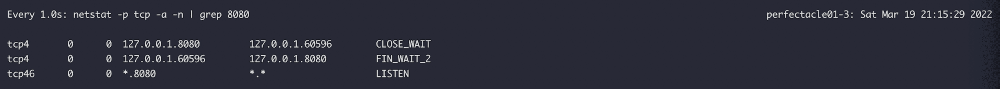
8. 서버는 클라이언트로부터 FIN 패킷을 받았지만 아직 보낼 패킷이 남아있기 때문인지 클라이언트에게 FIN 패킷을 보내지 않음.
   그리고 Active Close(클라이언트) 측에서는 오동작을 막기 위해 바로 소켓의 연결을 끊는 게 아니라 60초(OS마다 다르지만 tcp_fin_timeout(대다수의 리눅스는 60로초 설정됨) 만큼) 동안 대기하게 됨. (21:15:35)
   
9. 247번 패킷에서 서버 → 클라이언트로 HTTP 응답 패킷 전송 (21:15:36.298103, 클라이언트가 요청 보낸 21:15:26.291192로부터 10초가 지난 시간임)
   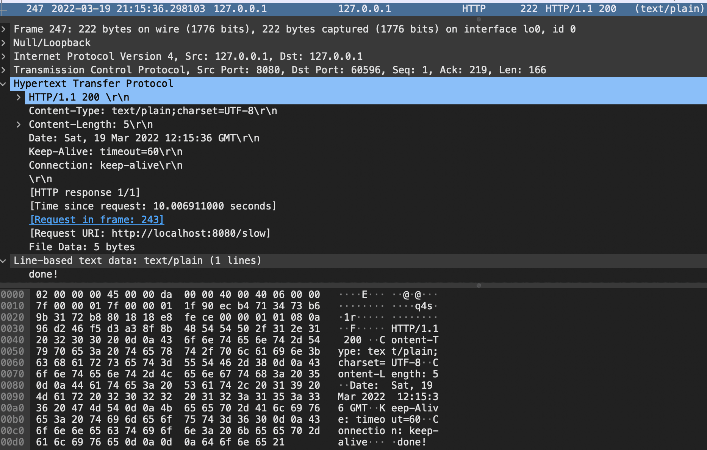
10. 248번 패킷에서 클라이언트 → 서버로 RST 패킷 전송 (21:15:36.298215)
   > When an unexpected TCP packet arrives at a host, that host usually responds by sending a reset packet back on the same connection. A reset packet is simply one with no payload and with the `RST` bit set in the TCP header flags.
   > 출처: https://www.pico.net/kb/what-is-a-tcp-reset-rst/
     
    클라이언트 측에서는 소켓 연결 종료를 준비하고 있었는데 서버 측으로부터 의도치 않은 HTTP 패킷이 왔기 때문에 더 이상 패킷을 받을 수 없다는 RST 패킷을 전송한 것으로 보임. (원래는 서버에서 FIN 패킷을 한 번 보내주고 클라이언트가 다시 ACK 패킷을 보내서 소켓을 종료해야한다.)
    
11. RST 패킷을 전송한 이후에 클라이언트/서버 측 소켓이 정상적으로 종료됨 (21:15:36)
   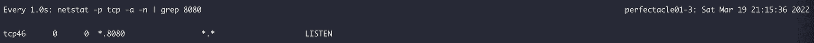

### 1-2. 클라이언트 측에서 Read Timeout 발생 후 60초 이내(소켓이 닫히기 전)에 응답 패킷을 여러 개 전송하는 경우 (응답이 큰 경우)
서버 쪽 API에서 처리하는데 10초 소요되고, 매우 큰 문자열을 응답한다고 가정
```kotlin
@RestController
class SlowLargeResponseController {
    private val log = LoggerFactory.getLogger(this::class.java)

    @GetMapping("/slow-large")
    fun slow(): String {
        log.info("request is arrived!")

        Thread.sleep(10_000L)

        log.info("slow large process is done!")
        return "done!".repeat(1_000_000)
    }
}
```

클라이언트 측 리드 타임아웃 설정은 3초로 서버 쪽 처리 시간보다 더 짧게 설정함
```kotlin
fun main() {
    val readTimeout = Duration.ofSeconds(3L)
    val restTemplate = RestTemplate(
        HttpComponentsClientHttpRequestFactory(
            HttpClientBuilder
                .create()
                .setMaxConnPerRoute(100)
                .setMaxConnTotal(100)
                .setKeepAliveStrategy(DefaultConnectionKeepAliveStrategy())
                .setDefaultRequestConfig(
                    RequestConfig.custom().setSocketTimeout(readTimeout.toMillis().toInt()).build()
                )
                .build()
        )
    )

    try {
        restTemplate.getForObject("http://localhost:8080/slow-large", String::class.java)
    } catch (e: Exception) {
        e.printStackTrace()
    } finally {
        println("[${LocalDateTime.now()}] request is done!")
    }

    // 커넥션 풀에 있는 커넥션을 바로 종료하지 않기 위해 10초간 슬립
    Thread.sleep(10_000L)
    println("[${LocalDateTime.now()}] main function is done!")
}
```

#### 데모 영상


#### 클라이언트 로그
```kotlin
05:19:22.860 [main] DEBUG org.springframework.web.client.RestTemplate - HTTP GET http://localhost:8080/slow-large
05:19:22.867 [main] DEBUG org.springframework.web.client.RestTemplate - Accept=[text/plain, application/json, application/*+json, */*]
05:19:22.895 [main] DEBUG org.apache.http.client.protocol.RequestAddCookies - CookieSpec selected: default
05:19:22.898 [main] DEBUG org.apache.http.client.protocol.RequestAuthCache - Auth cache not set in the context
05:19:22.899 [main] DEBUG org.apache.http.impl.conn.PoolingHttpClientConnectionManager - Connection request: [route: {}->http://localhost:8080][total available: 0; route allocated: 0 of 100; total allocated: 0 of 100]
05:19:22.903 [main] DEBUG org.apache.http.impl.conn.PoolingHttpClientConnectionManager - Connection leased: [id: 0][route: {}->http://localhost:8080][total available: 0; route allocated: 1 of 100; total allocated: 1 of 100]
05:19:22.903 [main] DEBUG org.apache.http.impl.execchain.MainClientExec - Opening connection {}->http://localhost:8080
05:19:22.905 [main] DEBUG org.apache.http.impl.conn.DefaultHttpClientConnectionOperator - Connecting to localhost/127.0.0.1:8080
05:19:22.906 [main] DEBUG org.apache.http.impl.conn.DefaultHttpClientConnectionOperator - Connection established 127.0.0.1:50422<->127.0.0.1:8080
05:19:22.906 [main] DEBUG org.apache.http.impl.conn.DefaultManagedHttpClientConnection - http-outgoing-0: set socket timeout to 3000
05:19:22.906 [main] DEBUG org.apache.http.impl.execchain.MainClientExec - Executing request GET /slow-large HTTP/1.1
05:19:22.906 [main] DEBUG org.apache.http.impl.execchain.MainClientExec - Target auth state: UNCHALLENGED
05:19:22.907 [main] DEBUG org.apache.http.impl.execchain.MainClientExec - Proxy auth state: UNCHALLENGED
05:19:22.907 [main] DEBUG org.apache.http.headers - http-outgoing-0 >> GET /slow-large HTTP/1.1
05:19:22.907 [main] DEBUG org.apache.http.headers - http-outgoing-0 >> Accept: text/plain, application/json, application/*+json, */*
05:19:22.907 [main] DEBUG org.apache.http.headers - http-outgoing-0 >> Host: localhost:8080
05:19:22.907 [main] DEBUG org.apache.http.headers - http-outgoing-0 >> Connection: Keep-Alive
05:19:22.907 [main] DEBUG org.apache.http.headers - http-outgoing-0 >> User-Agent: Apache-HttpClient/4.5.13 (Java/1.8.0_322)
05:19:22.907 [main] DEBUG org.apache.http.headers - http-outgoing-0 >> Accept-Encoding: gzip,deflate
05:19:22.907 [main] DEBUG org.apache.http.wire - http-outgoing-0 >> "GET /slow-large HTTP/1.1[\r][\n]"
05:19:22.907 [main] DEBUG org.apache.http.wire - http-outgoing-0 >> "Accept: text/plain, application/json, application/*+json, */*[\r][\n]"
05:19:22.907 [main] DEBUG org.apache.http.wire - http-outgoing-0 >> "Host: localhost:8080[\r][\n]"
05:19:22.907 [main] DEBUG org.apache.http.wire - http-outgoing-0 >> "Connection: Keep-Alive[\r][\n]"
05:19:22.907 [main] DEBUG org.apache.http.wire - http-outgoing-0 >> "User-Agent: Apache-HttpClient/4.5.13 (Java/1.8.0_322)[\r][\n]"
05:19:22.907 [main] DEBUG org.apache.http.wire - http-outgoing-0 >> "Accept-Encoding: gzip,deflate[\r][\n]"
05:19:22.907 [main] DEBUG org.apache.http.wire - http-outgoing-0 >> "[\r][\n]"
05:19:25.913 [main] DEBUG org.apache.http.wire - http-outgoing-0 << "[read] I/O error: Read timed out"
05:19:25.913 [main] DEBUG org.apache.http.impl.conn.DefaultManagedHttpClientConnection - http-outgoing-0: Close connection
05:19:25.915 [main] DEBUG org.apache.http.impl.conn.DefaultManagedHttpClientConnection - http-outgoing-0: Shutdown connection
05:19:25.916 [main] DEBUG org.apache.http.impl.execchain.MainClientExec - Connection discarded
05:19:25.916 [main] DEBUG org.apache.http.impl.conn.PoolingHttpClientConnectionManager - Connection released: [id: 0][route: {}->http://localhost:8080][total available: 0; route allocated: 0 of 100; total allocated: 0 of 100]
[2022-03-20T05:19:25.920] request is done!
org.springframework.web.client.ResourceAccessException: I/O error on GET request for "http://localhost:8080/slow-large": Read timed out; nested exception is java.net.SocketTimeoutException: Read timed out
	at org.springframework.web.client.RestTemplate.doExecute(RestTemplate.java:785)
	at org.springframework.web.client.RestTemplate.execute(RestTemplate.java:711)
	at org.springframework.web.client.RestTemplate.getForObject(RestTemplate.java:334)
	at com.example.playground.SlowLargeResponseRestTemplatePlaygroundKt.main(SlowLargeResponseRestTemplatePlayground.kt:28)
	at com.example.playground.SlowLargeResponseRestTemplatePlaygroundKt.main(SlowLargeResponseRestTemplatePlayground.kt)
Caused by: java.net.SocketTimeoutException: Read timed out
	at java.net.SocketInputStream.socketRead0(Native Method)
	at java.net.SocketInputStream.socketRead(SocketInputStream.java:116)
	at java.net.SocketInputStream.read(SocketInputStream.java:171)
	at java.net.SocketInputStream.read(SocketInputStream.java:141)
	at org.apache.http.impl.conn.LoggingInputStream.read(LoggingInputStream.java:84)
	at org.apache.http.impl.io.SessionInputBufferImpl.streamRead(SessionInputBufferImpl.java:137)
	at org.apache.http.impl.io.SessionInputBufferImpl.fillBuffer(SessionInputBufferImpl.java:153)
	at org.apache.http.impl.io.SessionInputBufferImpl.readLine(SessionInputBufferImpl.java:280)
	at org.apache.http.impl.conn.DefaultHttpResponseParser.parseHead(DefaultHttpResponseParser.java:138)
	at org.apache.http.impl.conn.DefaultHttpResponseParser.parseHead(DefaultHttpResponseParser.java:56)
	at org.apache.http.impl.io.AbstractMessageParser.parse(AbstractMessageParser.java:259)
	at org.apache.http.impl.DefaultBHttpClientConnection.receiveResponseHeader(DefaultBHttpClientConnection.java:163)
	at org.apache.http.impl.conn.CPoolProxy.receiveResponseHeader(CPoolProxy.java:157)
	at org.apache.http.protocol.HttpRequestExecutor.doReceiveResponse(HttpRequestExecutor.java:273)
	at org.apache.http.protocol.HttpRequestExecutor.execute(HttpRequestExecutor.java:125)
	at org.apache.http.impl.execchain.MainClientExec.execute(MainClientExec.java:272)
	at org.apache.http.impl.execchain.ProtocolExec.execute(ProtocolExec.java:186)
	at org.apache.http.impl.execchain.RetryExec.execute(RetryExec.java:89)
	at org.apache.http.impl.execchain.RedirectExec.execute(RedirectExec.java:110)
	at org.apache.http.impl.client.InternalHttpClient.doExecute(InternalHttpClient.java:185)
	at org.apache.http.impl.client.CloseableHttpClient.execute(CloseableHttpClient.java:83)
	at org.apache.http.impl.client.CloseableHttpClient.execute(CloseableHttpClient.java:56)
	at org.springframework.http.client.HttpComponentsClientHttpRequest.executeInternal(HttpComponentsClientHttpRequest.java:87)
	at org.springframework.http.client.AbstractBufferingClientHttpRequest.executeInternal(AbstractBufferingClientHttpRequest.java:48)
	at org.springframework.http.client.AbstractClientHttpRequest.execute(AbstractClientHttpRequest.java:66)
	at org.springframework.web.client.RestTemplate.doExecute(RestTemplate.java:776)
	... 4 more
[2022-03-20T05:19:35.925] main function is done!

Process finished with exit code 0
```
1. 05:19:22.906에 서버와 커넥션 맺음. (`05:19:22.906 [main] DEBUG org.apache.http.impl.conn.DefaultHttpClientConnectionOperator - Connection established 127.0.0.1:50422<->127.0.0.1:8080`)
2. 05:19:22.907에 요청 전송 (`05:19:22.907 [main] DEBUG org.apache.http.wire - http-outgoing-0 >> ...`)
3. 05:19:25.913에 Read Timeout 발생 (정확히 우리가 설정한 3초 후에 발생함, `05:19:25.913 [main] DEBUG org.apache.http.wire - http-outgoing-0 << "[read] I/O error: Read timed out"`)
4. 05:19:25.913 ~ 05:19:25.915에 커넥션 종료 (Keep-Alive 설정했음에도 불구하고, 정상적인 응답을 받지 못했으면 커넥션을 종료함. `05:19:25.913 [main] DEBUG org.apache.http.impl.conn.DefaultManagedHttpClientConnection - http-outgoing-0: Close connection`)
5. 05:19:35.925에 메인함수 종료

#### 서버 로그
```kotlin
2022-03-20 05:19:22.908  INFO 63172 --- [nio-8080-exec-2] c.e.p.SlowLargeResponseController        : request is arrived!
2022-03-20 05:19:32.913  INFO 63172 --- [nio-8080-exec-2] c.e.p.SlowLargeResponseController        : slow large process is done!
2022-03-20 05:19:32.937 ERROR 63172 --- [nio-8080-exec-2] com.example.playground.ControllerAdvice  : java.io.IOException: Broken pipe

org.apache.catalina.connector.ClientAbortException: java.io.IOException: Broken pipe
	at org.apache.catalina.connector.OutputBuffer.realWriteBytes(OutputBuffer.java:353) ~[tomcat-embed-core-9.0.58.jar:9.0.58]
	at org.apache.catalina.connector.OutputBuffer.flushByteBuffer(OutputBuffer.java:783) ~[tomcat-embed-core-9.0.58.jar:9.0.58]
	at org.apache.catalina.connector.OutputBuffer.append(OutputBuffer.java:688) ~[tomcat-embed-core-9.0.58.jar:9.0.58]
	at org.apache.catalina.connector.OutputBuffer.writeBytes(OutputBuffer.java:388) ~[tomcat-embed-core-9.0.58.jar:9.0.58]
	at org.apache.catalina.connector.OutputBuffer.write(OutputBuffer.java:366) ~[tomcat-embed-core-9.0.58.jar:9.0.58]
	at org.apache.catalina.connector.CoyoteOutputStream.write(CoyoteOutputStream.java:96) ~[tomcat-embed-core-9.0.58.jar:9.0.58]
	at sun.nio.cs.StreamEncoder.writeBytes(StreamEncoder.java:221) ~[na:1.8.0_322]
	at sun.nio.cs.StreamEncoder.implWrite(StreamEncoder.java:282) ~[na:1.8.0_322]
	at sun.nio.cs.StreamEncoder.write(StreamEncoder.java:125) ~[na:1.8.0_322]
	at sun.nio.cs.StreamEncoder.write(StreamEncoder.java:135) ~[na:1.8.0_322]
	at java.io.OutputStreamWriter.write(OutputStreamWriter.java:220) ~[na:1.8.0_322]
	at java.io.Writer.write(Writer.java:157) ~[na:1.8.0_322]
	at org.springframework.util.StreamUtils.copy(StreamUtils.java:147) ~[spring-core-5.3.16.jar:5.3.16]
	at org.springframework.http.converter.StringHttpMessageConverter.writeInternal(StringHttpMessageConverter.java:126) ~[spring-web-5.3.16.jar:5.3.16]
	at org.springframework.http.converter.StringHttpMessageConverter.writeInternal(StringHttpMessageConverter.java:44) ~[spring-web-5.3.16.jar:5.3.16]
	at org.springframework.http.converter.AbstractHttpMessageConverter.write(AbstractHttpMessageConverter.java:227) ~[spring-web-5.3.16.jar:5.3.16]
	at org.springframework.web.servlet.mvc.method.annotation.AbstractMessageConverterMethodProcessor.writeWithMessageConverters(AbstractMessageConverterMethodProcessor.java:293) ~[spring-webmvc-5.3.16.jar:5.3.16]
	at org.springframework.web.servlet.mvc.method.annotation.RequestResponseBodyMethodProcessor.handleReturnValue(RequestResponseBodyMethodProcessor.java:183) ~[spring-webmvc-5.3.16.jar:5.3.16]
	at org.springframework.web.method.support.HandlerMethodReturnValueHandlerComposite.handleReturnValue(HandlerMethodReturnValueHandlerComposite.java:78) ~[spring-web-5.3.16.jar:5.3.16]
	at org.springframework.web.servlet.mvc.method.annotation.ServletInvocableHandlerMethod.invokeAndHandle(ServletInvocableHandlerMethod.java:135) ~[spring-webmvc-5.3.16.jar:5.3.16]
	at org.springframework.web.servlet.mvc.method.annotation.RequestMappingHandlerAdapter.invokeHandlerMethod(RequestMappingHandlerAdapter.java:895) ~[spring-webmvc-5.3.16.jar:5.3.16]
	at org.springframework.web.servlet.mvc.method.annotation.RequestMappingHandlerAdapter.handleInternal(RequestMappingHandlerAdapter.java:808) ~[spring-webmvc-5.3.16.jar:5.3.16]
	at org.springframework.web.servlet.mvc.method.AbstractHandlerMethodAdapter.handle(AbstractHandlerMethodAdapter.java:87) ~[spring-webmvc-5.3.16.jar:5.3.16]
	at org.springframework.web.servlet.DispatcherServlet.doDispatch(DispatcherServlet.java:1067) ~[spring-webmvc-5.3.16.jar:5.3.16]
	at org.springframework.web.servlet.DispatcherServlet.doService(DispatcherServlet.java:963) ~[spring-webmvc-5.3.16.jar:5.3.16]
	at org.springframework.web.servlet.FrameworkServlet.processRequest(FrameworkServlet.java:1006) [spring-webmvc-5.3.16.jar:5.3.16]
	at org.springframework.web.servlet.FrameworkServlet.doGet(FrameworkServlet.java:898) [spring-webmvc-5.3.16.jar:5.3.16]
	at javax.servlet.http.HttpServlet.service(HttpServlet.java:655) [tomcat-embed-core-9.0.58.jar:4.0.FR]
	at org.springframework.web.servlet.FrameworkServlet.service(FrameworkServlet.java:883) [spring-webmvc-5.3.16.jar:5.3.16]
	at javax.servlet.http.HttpServlet.service(HttpServlet.java:764) [tomcat-embed-core-9.0.58.jar:4.0.FR]
	at org.apache.catalina.core.ApplicationFilterChain.internalDoFilter(ApplicationFilterChain.java:227) [tomcat-embed-core-9.0.58.jar:9.0.58]
	at org.apache.catalina.core.ApplicationFilterChain.doFilter(ApplicationFilterChain.java:162) [tomcat-embed-core-9.0.58.jar:9.0.58]
	at org.apache.tomcat.websocket.server.WsFilter.doFilter(WsFilter.java:53) [tomcat-embed-websocket-9.0.58.jar:9.0.58]
	at org.apache.catalina.core.ApplicationFilterChain.internalDoFilter(ApplicationFilterChain.java:189) [tomcat-embed-core-9.0.58.jar:9.0.58]
	at org.apache.catalina.core.ApplicationFilterChain.doFilter(ApplicationFilterChain.java:162) [tomcat-embed-core-9.0.58.jar:9.0.58]
	at org.springframework.web.filter.RequestContextFilter.doFilterInternal(RequestContextFilter.java:100) [spring-web-5.3.16.jar:5.3.16]
	at org.springframework.web.filter.OncePerRequestFilter.doFilter(OncePerRequestFilter.java:117) [spring-web-5.3.16.jar:5.3.16]
	at org.apache.catalina.core.ApplicationFilterChain.internalDoFilter(ApplicationFilterChain.java:189) [tomcat-embed-core-9.0.58.jar:9.0.58]
	at org.apache.catalina.core.ApplicationFilterChain.doFilter(ApplicationFilterChain.java:162) [tomcat-embed-core-9.0.58.jar:9.0.58]
	at org.springframework.web.filter.FormContentFilter.doFilterInternal(FormContentFilter.java:93) [spring-web-5.3.16.jar:5.3.16]
	at org.springframework.web.filter.OncePerRequestFilter.doFilter(OncePerRequestFilter.java:117) [spring-web-5.3.16.jar:5.3.16]
	at org.apache.catalina.core.ApplicationFilterChain.internalDoFilter(ApplicationFilterChain.java:189) [tomcat-embed-core-9.0.58.jar:9.0.58]
	at org.apache.catalina.core.ApplicationFilterChain.doFilter(ApplicationFilterChain.java:162) [tomcat-embed-core-9.0.58.jar:9.0.58]
	at org.springframework.web.filter.CharacterEncodingFilter.doFilterInternal(CharacterEncodingFilter.java:201) [spring-web-5.3.16.jar:5.3.16]
	at org.springframework.web.filter.OncePerRequestFilter.doFilter(OncePerRequestFilter.java:117) [spring-web-5.3.16.jar:5.3.16]
	at org.apache.catalina.core.ApplicationFilterChain.internalDoFilter(ApplicationFilterChain.java:189) [tomcat-embed-core-9.0.58.jar:9.0.58]
	at org.apache.catalina.core.ApplicationFilterChain.doFilter(ApplicationFilterChain.java:162) [tomcat-embed-core-9.0.58.jar:9.0.58]
	at org.apache.catalina.core.StandardWrapperValve.invoke(StandardWrapperValve.java:197) [tomcat-embed-core-9.0.58.jar:9.0.58]
	at org.apache.catalina.core.StandardContextValve.invoke(StandardContextValve.java:97) [tomcat-embed-core-9.0.58.jar:9.0.58]
	at org.apache.catalina.authenticator.AuthenticatorBase.invoke(AuthenticatorBase.java:540) [tomcat-embed-core-9.0.58.jar:9.0.58]
	at org.apache.catalina.core.StandardHostValve.invoke(StandardHostValve.java:135) [tomcat-embed-core-9.0.58.jar:9.0.58]
	at org.apache.catalina.valves.ErrorReportValve.invoke(ErrorReportValve.java:92) [tomcat-embed-core-9.0.58.jar:9.0.58]
	at org.apache.catalina.core.StandardEngineValve.invoke(StandardEngineValve.java:78) [tomcat-embed-core-9.0.58.jar:9.0.58]
	at org.apache.catalina.connector.CoyoteAdapter.service(CoyoteAdapter.java:359) [tomcat-embed-core-9.0.58.jar:9.0.58]
	at org.apache.coyote.http11.Http11Processor.service(Http11Processor.java:399) [tomcat-embed-core-9.0.58.jar:9.0.58]
	at org.apache.coyote.AbstractProcessorLight.process(AbstractProcessorLight.java:65) [tomcat-embed-core-9.0.58.jar:9.0.58]
	at org.apache.coyote.AbstractProtocol$ConnectionHandler.process(AbstractProtocol.java:889) [tomcat-embed-core-9.0.58.jar:9.0.58]
	at org.apache.tomcat.util.net.NioEndpoint$SocketProcessor.doRun(NioEndpoint.java:1735) [tomcat-embed-core-9.0.58.jar:9.0.58]
	at org.apache.tomcat.util.net.SocketProcessorBase.run(SocketProcessorBase.java:49) [tomcat-embed-core-9.0.58.jar:9.0.58]
	at org.apache.tomcat.util.threads.ThreadPoolExecutor.runWorker(ThreadPoolExecutor.java:1191) [tomcat-embed-core-9.0.58.jar:9.0.58]
	at org.apache.tomcat.util.threads.ThreadPoolExecutor$Worker.run(ThreadPoolExecutor.java:659) [tomcat-embed-core-9.0.58.jar:9.0.58]
	at org.apache.tomcat.util.threads.TaskThread$WrappingRunnable.run(TaskThread.java:61) [tomcat-embed-core-9.0.58.jar:9.0.58]
	at java.lang.Thread.run(Thread.java:750) [na:1.8.0_322]
Caused by: java.io.IOException: Broken pipe
	at sun.nio.ch.FileDispatcherImpl.write0(Native Method) ~[na:1.8.0_322]
	at sun.nio.ch.SocketDispatcher.write(SocketDispatcher.java:47) ~[na:1.8.0_322]
	at sun.nio.ch.IOUtil.writeFromNativeBuffer(IOUtil.java:93) ~[na:1.8.0_322]
	at sun.nio.ch.IOUtil.write(IOUtil.java:65) ~[na:1.8.0_322]
	at sun.nio.ch.SocketChannelImpl.write(SocketChannelImpl.java:470) ~[na:1.8.0_322]
	at org.apache.tomcat.util.net.NioChannel.write(NioChannel.java:135) ~[tomcat-embed-core-9.0.58.jar:9.0.58]
	at org.apache.tomcat.util.net.NioEndpoint$NioSocketWrapper.doWrite(NioEndpoint.java:1376) ~[tomcat-embed-core-9.0.58.jar:9.0.58]
	at org.apache.tomcat.util.net.SocketWrapperBase.doWrite(SocketWrapperBase.java:766) ~[tomcat-embed-core-9.0.58.jar:9.0.58]
	at org.apache.tomcat.util.net.SocketWrapperBase.writeBlocking(SocketWrapperBase.java:586) ~[tomcat-embed-core-9.0.58.jar:9.0.58]
	at org.apache.tomcat.util.net.SocketWrapperBase.write(SocketWrapperBase.java:530) ~[tomcat-embed-core-9.0.58.jar:9.0.58]
	at org.apache.coyote.http11.Http11OutputBuffer$SocketOutputBuffer.doWrite(Http11OutputBuffer.java:547) ~[tomcat-embed-core-9.0.58.jar:9.0.58]
	at org.apache.coyote.http11.filters.IdentityOutputFilter.doWrite(IdentityOutputFilter.java:73) ~[tomcat-embed-core-9.0.58.jar:9.0.58]
	at org.apache.coyote.http11.Http11OutputBuffer.doWrite(Http11OutputBuffer.java:194) ~[tomcat-embed-core-9.0.58.jar:9.0.58]
	at org.apache.coyote.Response.doWrite(Response.java:615) ~[tomcat-embed-core-9.0.58.jar:9.0.58]
	at org.apache.catalina.connector.OutputBuffer.realWriteBytes(OutputBuffer.java:340) ~[tomcat-embed-core-9.0.58.jar:9.0.58]
	... 62 common frames omitted
```
1. 05:19:22.908에 요청 도착
2. 05:19:32.913에 처리 완료 (10초 걸림)
3. 05:19:32.937에 `ClientAbortException(java.io.IOException: Broken pipe)` 발생

#### 패킷 로그 (소켓 상태)
```kotlin
143	2022-03-20 05:19:22.906081	127.0.0.1	127.0.0.1	TCP	68	50422 → 8080 [SYN] Seq=0 Win=65535 Len=0 MSS=16344 WS=64 TSval=3840422295 TSecr=0 SACK_PERM=1
144	2022-03-20 05:19:22.906253	127.0.0.1	127.0.0.1	TCP	68	8080 → 50422 [SYN, ACK] Seq=0 Ack=1 Win=65535 Len=0 MSS=16344 WS=64 TSval=3598884109 TSecr=3840422295 SACK_PERM=1
145	2022-03-20 05:19:22.906270	127.0.0.1	127.0.0.1	TCP	56	50422 → 8080 [ACK] Seq=1 Ack=1 Win=408256 Len=0 TSval=3840422295 TSecr=3598884109
146	2022-03-20 05:19:22.906283	127.0.0.1	127.0.0.1	TCP	56	[TCP Window Update] 8080 → 50422 [ACK] Seq=1 Ack=1 Win=408256 Len=0 TSval=3598884109 TSecr=3840422295
147	2022-03-20 05:19:22.908202	127.0.0.1	127.0.0.1	HTTP	279	GET /slow-large HTTP/1.1
148	2022-03-20 05:19:22.908223	127.0.0.1	127.0.0.1	TCP	56	8080 → 50422 [ACK] Seq=1 Ack=224 Win=408064 Len=0 TSval=3598884111 TSecr=3840422297
149	2022-03-20 05:19:25.915247	127.0.0.1	127.0.0.1	TCP	56	50422 → 8080 [FIN, ACK] Seq=224 Ack=1 Win=408256 Len=0 TSval=3840425304 TSecr=3598884111
150	2022-03-20 05:19:25.915291	127.0.0.1	127.0.0.1	TCP	56	8080 → 50422 [ACK] Seq=1 Ack=225 Win=408064 Len=0 TSval=3598887118 TSecr=3840425304
163	2022-03-20 05:19:32.935627	127.0.0.1	127.0.0.1	TCP	8248	8080 → 50422 [PSH, ACK] Seq=1 Ack=225 Win=408064 Len=8192 TSval=3598894139 TSecr=3840425304 [TCP segment of a reassembled PDU]
164	2022-03-20 05:19:32.935668	127.0.0.1	127.0.0.1	TCP	8248	8080 → 50422 [PSH, ACK] Seq=8193 Ack=225 Win=408064 Len=8192 TSval=3598894139 TSecr=3840425304 [TCP segment of a reassembled PDU]
165	2022-03-20 05:19:32.935695	127.0.0.1	127.0.0.1	TCP	8248	8080 → 50422 [PSH, ACK] Seq=16385 Ack=225 Win=408064 Len=8192 TSval=3598894139 TSecr=3840425304 [TCP segment of a reassembled PDU]
166	2022-03-20 05:19:32.935704	127.0.0.1	127.0.0.1	TCP	44	50422 → 8080 [RST] Seq=225 Win=0 Len=0
167	2022-03-20 05:19:32.935715	127.0.0.1	127.0.0.1	TCP	44	50422 → 8080 [RST] Seq=225 Win=0 Len=0
168	2022-03-20 05:19:32.935719	127.0.0.1	127.0.0.1	TCP	44	50422 → 8080 [RST] Seq=225 Win=0 Len=0
169	2022-03-20 05:19:32.935721	127.0.0.1	127.0.0.1	TCP	8248	8080 → 50422 [PSH, ACK] Seq=24577 Ack=225 Win=408064 Len=8192 TSval=3598894139 TSecr=3840425304 [TCP segment of a reassembled PDU]
170	2022-03-20 05:19:32.935741	127.0.0.1	127.0.0.1	TCP	44	50422 → 8080 [RST] Seq=225 Win=0 Len=0
```
1. 143 ~ 145번 패킷은 TCP 3 Way Handshake (syn, syn/ack, ack)
   
   
   
2. 147번 패킷에서 클라이언트 → 서버로 HTTP 요청 패킷 전송 (05:19:22.908202)
   
3. 148번 패킷에서 서버가 요청 잘 받았다고 클라이언트한테 ACK 패킷 전송 (05:19:22.908223)
   
4. 149번 패킷에서 클라이언트는 커넥션을 종료한다고 FIN/ACK 패킷을 서버에게 전송 (05:19:25.915247, 정확히 HTTP 패킷 보내고 3초 이후(read timeout)임.)
   
5. 150번 패킷에서 서버가 클라이언트로부터 FIN/ACK 패킷을 잘 받았다고 반대로 ACK 패킷을 클라이언트에게 보냄 (05:19:25.915291)
   
6. 클라이언트가 먼저 연결을 종료하겠다는 FIN 패킷을 보냈기 때문에 클라이언트가 Active Close
   서버는 클라이언트로부터 FIN 패킷을 받았기 때문에 서버는 Passive Close가 됨
   (무조건 클라이언트가 Active Close는 아니고 경우에 따라서 다름)
   그리고 아직까지는 서버(Passive Close)로부터 FIN 패킷을 받은 게 아니기 때문에 소켓이 정상적으로 종료된 게 아님.
   
7. 서버 측 소켓의 상태는 CLOSE_WAIT(클라이언트가 보낸 FIN 패킷을 받았으므로)이고, 클라이언트 측 소켓의 상태는 FIN_WAIT_2(서버가 보낸 ACK 패킷을 받았으므로)이다. (05:19:26)
   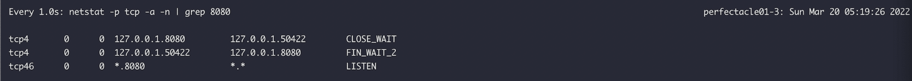
8. 서버는 클라이언트로부터 FIN 패킷을 받았지만 아직 보낼 패킷이 남아있기 때문인지 클라이언트에게 FIN 패킷을 보내지 않음.
   그리고 Active Close(클라이언트) 측에서는 오동작을 막기 위해 바로 소켓의 연결을 끊는 게 아니라 60초(OS마다 다르지만 tcp_fin_timeout(대다수의 리눅스는 60로초 설정됨)) 동안 대기하게 됨. (05:19:32)
   
9. 163번 패킷에서 서버로부터 HTTP 응답이 오는데 너무 커서 한 번에 오지 않고 여러 패킷에 걸쳐서 전송됨. (05:19:32.935627)
   TCP 패킷은 순서를 보장하지 않기 때문에 클라이언트 측에서 재조립하여야하는데 그걸 위해 `현재 시퀀스 넘버(1)`와 `다음 패킷의 시퀀스 넘버(8193)`를 알려주고 있음.
   
10. 164번 패킷을 보니 또 응답 패킷인데 `현재 패킷의 시퀀스 넘버는 8193`이니 163번 패킷의 다음 패킷이고, 그 `다음 패킷의 시퀀스 넘버는 16385`임. (05:19:32.935668)
    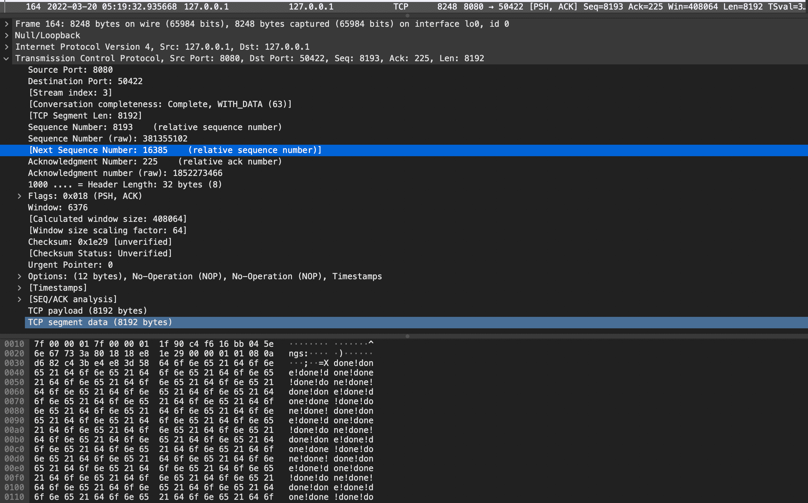
11. 165번 패킷을 보니 또 응답 패킷인데 `현재 패킷의 시퀀스 넘버는 16385`이니 164번 패킷의 다음 패킷이고, 그 `다음 패킷의 시퀀스 넘버는 24577`임. (05:19:32.935695)
    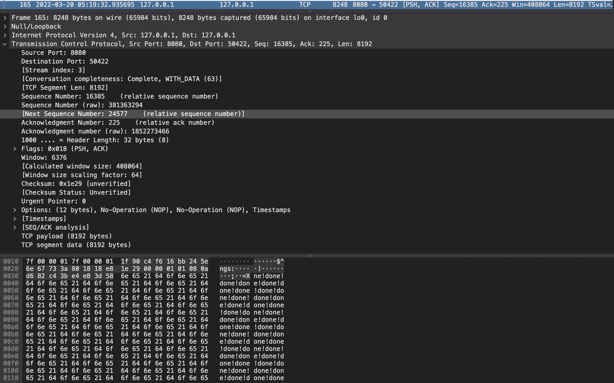
12. 166 ~ 168번 패킷을 보면 클라이언트는 FIN_WAIT_2 상태이기 때문에 서버로부터 FIN 패킷이 올 것을 예상했는데 3번이나 다른 패킷이 왔기 때문에 RST 패킷을 3번 보냄 (05:19:32.935704~ 05:19:32.935719)
    
13. 169번 패킷을 보면 서버 측에 RST 패킷을 보내긴 했지만 아직 소켓이 닫히기 이전이기 때문에 그사이에 또 서버 → 클라이언트로 응답패킷이 왔다. (05:19:32.935721)
    여전히 응답이 더 남았기 때문에 다음 패킷의 시퀀스 넘버도 함께 보내줬다.
    
14. 170번 패킷을 보면 또 서버에서 FIN 패킷이 온 게 아니기 때문에 클라이언트는 다시 서버에게 RST 패킷을 보내서 소켓을 닫을 준비를 한다. (05:19:32.935741)
    
15. 그리고나서 진짜로 클라이언트/서버의 소켓이 닫혔다. (05:19:33)
    

## 2. 클라이언트 측에서 Read Timeout 발생 후 60초 이후(소켓이 닫힌 후)에 응답 패킷을 전송하는 경우
서버 쪽 API에서 처리하는데 70초 소요된다고 가정
```kotlin
@RestController
class VerySlowResponseController {
    private val log = LoggerFactory.getLogger(this::class.java)

    @GetMapping("/very-slow")
    fun verySlow(): String {
        log.info("request is arrived!")

        Thread.sleep(70_000L)

        log.info("very slow process is done!")
        return "done!"
    }
}
```

클라이언트 측 리드 타임아웃 설정은 3초로 서버 쪽 처리 시간보다 훨씬 짧게 설정함
```kotlin
fun main() {
    val readTimeout = Duration.ofSeconds(3L)
    val restTemplate = RestTemplate(
        HttpComponentsClientHttpRequestFactory(
            HttpClientBuilder
                .create()
                .setMaxConnPerRoute(100)
                .setMaxConnTotal(100)
                .setKeepAliveStrategy(DefaultConnectionKeepAliveStrategy())
                .setDefaultRequestConfig(
                    RequestConfig.custom().setSocketTimeout(readTimeout.toMillis().toInt()).build()
                )
                .build()
        )
    )

    try {
        restTemplate.getForObject("http://localhost:8080/very-slow", String::class.java)
    } catch (e: Exception) {
        e.printStackTrace()
    } finally {
        println("[${LocalDateTime.now()}] request is done!")
    }

    // 커넥션 풀에 있는 커넥션을 바로 종료하지 않기 위해 10초간 슬립
    Thread.sleep(10_000L)
    println("[${LocalDateTime.now()}] main function is done!")
}
```

### 데모 영상


### 클라이언트 로그
```kotlin
23:43:15.010 [main] DEBUG org.springframework.web.client.RestTemplate - HTTP GET http://localhost:8080/very-slow
23:43:15.016 [main] DEBUG org.springframework.web.client.RestTemplate - Accept=[text/plain, application/json, application/*+json, */*]
23:43:15.042 [main] DEBUG org.apache.http.client.protocol.RequestAddCookies - CookieSpec selected: default
23:43:15.045 [main] DEBUG org.apache.http.client.protocol.RequestAuthCache - Auth cache not set in the context
23:43:15.046 [main] DEBUG org.apache.http.impl.conn.PoolingHttpClientConnectionManager - Connection request: [route: {}->http://localhost:8080][total available: 0; route allocated: 0 of 100; total allocated: 0 of 100]
23:43:15.050 [main] DEBUG org.apache.http.impl.conn.PoolingHttpClientConnectionManager - Connection leased: [id: 0][route: {}->http://localhost:8080][total available: 0; route allocated: 1 of 100; total allocated: 1 of 100]
23:43:15.050 [main] DEBUG org.apache.http.impl.execchain.MainClientExec - Opening connection {}->http://localhost:8080
23:43:15.052 [main] DEBUG org.apache.http.impl.conn.DefaultHttpClientConnectionOperator - Connecting to localhost/127.0.0.1:8080
23:43:15.053 [main] DEBUG org.apache.http.impl.conn.DefaultHttpClientConnectionOperator - Connection established 127.0.0.1:62960<->127.0.0.1:8080
23:43:15.053 [main] DEBUG org.apache.http.impl.conn.DefaultManagedHttpClientConnection - http-outgoing-0: set socket timeout to 3000
23:43:15.053 [main] DEBUG org.apache.http.impl.execchain.MainClientExec - Executing request GET /very-slow HTTP/1.1
23:43:15.053 [main] DEBUG org.apache.http.impl.execchain.MainClientExec - Target auth state: UNCHALLENGED
23:43:15.053 [main] DEBUG org.apache.http.impl.execchain.MainClientExec - Proxy auth state: UNCHALLENGED
23:43:15.054 [main] DEBUG org.apache.http.headers - http-outgoing-0 >> GET /very-slow HTTP/1.1
23:43:15.054 [main] DEBUG org.apache.http.headers - http-outgoing-0 >> Accept: text/plain, application/json, application/*+json, */*
23:43:15.054 [main] DEBUG org.apache.http.headers - http-outgoing-0 >> Host: localhost:8080
23:43:15.054 [main] DEBUG org.apache.http.headers - http-outgoing-0 >> Connection: Keep-Alive
23:43:15.054 [main] DEBUG org.apache.http.headers - http-outgoing-0 >> User-Agent: Apache-HttpClient/4.5.13 (Java/1.8.0_322)
23:43:15.054 [main] DEBUG org.apache.http.headers - http-outgoing-0 >> Accept-Encoding: gzip,deflate
23:43:15.054 [main] DEBUG org.apache.http.wire - http-outgoing-0 >> "GET /very-slow HTTP/1.1[\r][\n]"
23:43:15.054 [main] DEBUG org.apache.http.wire - http-outgoing-0 >> "Accept: text/plain, application/json, application/*+json, */*[\r][\n]"
23:43:15.054 [main] DEBUG org.apache.http.wire - http-outgoing-0 >> "Host: localhost:8080[\r][\n]"
23:43:15.054 [main] DEBUG org.apache.http.wire - http-outgoing-0 >> "Connection: Keep-Alive[\r][\n]"
23:43:15.054 [main] DEBUG org.apache.http.wire - http-outgoing-0 >> "User-Agent: Apache-HttpClient/4.5.13 (Java/1.8.0_322)[\r][\n]"
23:43:15.054 [main] DEBUG org.apache.http.wire - http-outgoing-0 >> "Accept-Encoding: gzip,deflate[\r][\n]"
23:43:15.054 [main] DEBUG org.apache.http.wire - http-outgoing-0 >> "[\r][\n]"
23:43:18.058 [main] DEBUG org.apache.http.wire - http-outgoing-0 << "[read] I/O error: Read timed out"
23:43:18.059 [main] DEBUG org.apache.http.impl.conn.DefaultManagedHttpClientConnection - http-outgoing-0: Close connection
23:43:18.060 [main] DEBUG org.apache.http.impl.conn.DefaultManagedHttpClientConnection - http-outgoing-0: Shutdown connection
23:43:18.060 [main] DEBUG org.apache.http.impl.execchain.MainClientExec - Connection discarded
23:43:18.060 [main] DEBUG org.apache.http.impl.conn.PoolingHttpClientConnectionManager - Connection released: [id: 0][route: {}->http://localhost:8080][total available: 0; route allocated: 0 of 100; total allocated: 0 of 100]
[2022-03-19T23:43:18.067] request is done!
org.springframework.web.client.ResourceAccessException: I/O error on GET request for "http://localhost:8080/very-slow": Read timed out; nested exception is java.net.SocketTimeoutException: Read timed out
	at org.springframework.web.client.RestTemplate.doExecute(RestTemplate.java:785)
	at org.springframework.web.client.RestTemplate.execute(RestTemplate.java:711)
	at org.springframework.web.client.RestTemplate.getForObject(RestTemplate.java:334)
	at com.example.playground.VerySlowResponseRestTemplatePlaygroundKt.main(VerySlowResponseRestTemplatePlayground.kt:30)
	at com.example.playground.VerySlowResponseRestTemplatePlaygroundKt.main(VerySlowResponseRestTemplatePlayground.kt)
Caused by: java.net.SocketTimeoutException: Read timed out
	at java.net.SocketInputStream.socketRead0(Native Method)
	at java.net.SocketInputStream.socketRead(SocketInputStream.java:116)
	at java.net.SocketInputStream.read(SocketInputStream.java:171)
	at java.net.SocketInputStream.read(SocketInputStream.java:141)
	at org.apache.http.impl.conn.LoggingInputStream.read(LoggingInputStream.java:84)
	at org.apache.http.impl.io.SessionInputBufferImpl.streamRead(SessionInputBufferImpl.java:137)
	at org.apache.http.impl.io.SessionInputBufferImpl.fillBuffer(SessionInputBufferImpl.java:153)
	at org.apache.http.impl.io.SessionInputBufferImpl.readLine(SessionInputBufferImpl.java:280)
	at org.apache.http.impl.conn.DefaultHttpResponseParser.parseHead(DefaultHttpResponseParser.java:138)
	at org.apache.http.impl.conn.DefaultHttpResponseParser.parseHead(DefaultHttpResponseParser.java:56)
	at org.apache.http.impl.io.AbstractMessageParser.parse(AbstractMessageParser.java:259)
	at org.apache.http.impl.DefaultBHttpClientConnection.receiveResponseHeader(DefaultBHttpClientConnection.java:163)
	at org.apache.http.impl.conn.CPoolProxy.receiveResponseHeader(CPoolProxy.java:157)
	at org.apache.http.protocol.HttpRequestExecutor.doReceiveResponse(HttpRequestExecutor.java:273)
	at org.apache.http.protocol.HttpRequestExecutor.execute(HttpRequestExecutor.java:125)
	at org.apache.http.impl.execchain.MainClientExec.execute(MainClientExec.java:272)
	at org.apache.http.impl.execchain.ProtocolExec.execute(ProtocolExec.java:186)
	at org.apache.http.impl.execchain.RetryExec.execute(RetryExec.java:89)
	at org.apache.http.impl.execchain.RedirectExec.execute(RedirectExec.java:110)
	at org.apache.http.impl.client.InternalHttpClient.doExecute(InternalHttpClient.java:185)
	at org.apache.http.impl.client.CloseableHttpClient.execute(CloseableHttpClient.java:83)
	at org.apache.http.impl.client.CloseableHttpClient.execute(CloseableHttpClient.java:56)
	at org.springframework.http.client.HttpComponentsClientHttpRequest.executeInternal(HttpComponentsClientHttpRequest.java:87)
	at org.springframework.http.client.AbstractBufferingClientHttpRequest.executeInternal(AbstractBufferingClientHttpRequest.java:48)
	at org.springframework.http.client.AbstractClientHttpRequest.execute(AbstractClientHttpRequest.java:66)
	at org.springframework.web.client.RestTemplate.doExecute(RestTemplate.java:776)
	... 4 more
[2022-03-19T23:43:28.073] main function is done!

Process finished with exit code 0
```

1. 23:43:15.053에 서버와 커넥션 맺음. (`23:43:15.053 [main] DEBUG org.apache.http.impl.conn.DefaultHttpClientConnectionOperator - Connection established 127.0.0.1:62960<->127.0.0.1:8080`)
2. 23:43:15.054에 요청 전송 (`23:43:15.054 [main] DEBUG org.apache.http.wire - http-outgoing-0 >> ...`)
3. 23:43:18.058에 Read Timeout 발생 (정확히 우리가 설정한 3초 후에 발생함, `23:43:18.058 [main] DEBUG org.apache.http.wire - http-outgoing-0 << "[read] I/O error: Read timed out"`)
4. 23:43:18.059 ~ 23:43:18.060에 커넥션 종료 (Keep-Alive 설정했음에도 불구하고, 정상적인 응답을 받지 못했으면 커넥션을 종료함. `23:43:18.059 [main] DEBUG org.apache.http.impl.conn.DefaultManagedHttpClientConnection - http-outgoing-0: Close connection`)
5. 23:43:28.073에 메인함수 종료

### 서버 로그
```kotlin
2022-03-19 23:43:15.055  INFO 47262 --- [nio-8080-exec-4] c.e.s.VerySlowResponseController         : request is arrived!
2022-03-19 23:44:25.059  INFO 47262 --- [nio-8080-exec-4] c.e.s.VerySlowResponseController         : very slow process is done!
2022-03-19 23:44:25.062 ERROR 47262 --- [nio-8080-exec-4] c.e.playground.ControllerAdvice    : java.io.IOException: Broken pipe

org.apache.catalina.connector.ClientAbortException: java.io.IOException: Broken pipe
	at org.apache.catalina.connector.OutputBuffer.doFlush(OutputBuffer.java:310) ~[tomcat-embed-core-9.0.58.jar:9.0.58]
	at org.apache.catalina.connector.OutputBuffer.flush(OutputBuffer.java:273) ~[tomcat-embed-core-9.0.58.jar:9.0.58]
	at org.apache.catalina.connector.CoyoteOutputStream.flush(CoyoteOutputStream.java:118) ~[tomcat-embed-core-9.0.58.jar:9.0.58]
	at sun.nio.cs.StreamEncoder.implFlush(StreamEncoder.java:297) ~[na:1.8.0_322]
	at sun.nio.cs.StreamEncoder.flush(StreamEncoder.java:141) ~[na:1.8.0_322]
	at java.io.OutputStreamWriter.flush(OutputStreamWriter.java:229) ~[na:1.8.0_322]
	at org.springframework.util.StreamUtils.copy(StreamUtils.java:148) ~[spring-core-5.3.16.jar:5.3.16]
	at org.springframework.http.converter.StringHttpMessageConverter.writeInternal(StringHttpMessageConverter.java:126) ~[spring-web-5.3.16.jar:5.3.16]
	at org.springframework.http.converter.StringHttpMessageConverter.writeInternal(StringHttpMessageConverter.java:44) ~[spring-web-5.3.16.jar:5.3.16]
	at org.springframework.http.converter.AbstractHttpMessageConverter.write(AbstractHttpMessageConverter.java:227) ~[spring-web-5.3.16.jar:5.3.16]
	at org.springframework.web.servlet.mvc.method.annotation.AbstractMessageConverterMethodProcessor.writeWithMessageConverters(AbstractMessageConverterMethodProcessor.java:293) ~[spring-webmvc-5.3.16.jar:5.3.16]
	at org.springframework.web.servlet.mvc.method.annotation.RequestResponseBodyMethodProcessor.handleReturnValue(RequestResponseBodyMethodProcessor.java:183) ~[spring-webmvc-5.3.16.jar:5.3.16]
	at org.springframework.web.method.support.HandlerMethodReturnValueHandlerComposite.handleReturnValue(HandlerMethodReturnValueHandlerComposite.java:78) ~[spring-web-5.3.16.jar:5.3.16]
	at org.springframework.web.servlet.mvc.method.annotation.ServletInvocableHandlerMethod.invokeAndHandle(ServletInvocableHandlerMethod.java:135) ~[spring-webmvc-5.3.16.jar:5.3.16]
	at org.springframework.web.servlet.mvc.method.annotation.RequestMappingHandlerAdapter.invokeHandlerMethod(RequestMappingHandlerAdapter.java:895) ~[spring-webmvc-5.3.16.jar:5.3.16]
	at org.springframework.web.servlet.mvc.method.annotation.RequestMappingHandlerAdapter.handleInternal(RequestMappingHandlerAdapter.java:808) ~[spring-webmvc-5.3.16.jar:5.3.16]
	at org.springframework.web.servlet.mvc.method.AbstractHandlerMethodAdapter.handle(AbstractHandlerMethodAdapter.java:87) ~[spring-webmvc-5.3.16.jar:5.3.16]
	at org.springframework.web.servlet.DispatcherServlet.doDispatch(DispatcherServlet.java:1067) ~[spring-webmvc-5.3.16.jar:5.3.16]
	at org.springframework.web.servlet.DispatcherServlet.doService(DispatcherServlet.java:963) ~[spring-webmvc-5.3.16.jar:5.3.16]
	at org.springframework.web.servlet.FrameworkServlet.processRequest(FrameworkServlet.java:1006) [spring-webmvc-5.3.16.jar:5.3.16]
	at org.springframework.web.servlet.FrameworkServlet.doGet(FrameworkServlet.java:898) [spring-webmvc-5.3.16.jar:5.3.16]
	at javax.servlet.http.HttpServlet.service(HttpServlet.java:655) [tomcat-embed-core-9.0.58.jar:4.0.FR]
	at org.springframework.web.servlet.FrameworkServlet.service(FrameworkServlet.java:883) [spring-webmvc-5.3.16.jar:5.3.16]
	at javax.servlet.http.HttpServlet.service(HttpServlet.java:764) [tomcat-embed-core-9.0.58.jar:4.0.FR]
	at org.apache.catalina.core.ApplicationFilterChain.internalDoFilter(ApplicationFilterChain.java:227) [tomcat-embed-core-9.0.58.jar:9.0.58]
	at org.apache.catalina.core.ApplicationFilterChain.doFilter(ApplicationFilterChain.java:162) [tomcat-embed-core-9.0.58.jar:9.0.58]
	at org.apache.tomcat.websocket.server.WsFilter.doFilter(WsFilter.java:53) [tomcat-embed-websocket-9.0.58.jar:9.0.58]
	at org.apache.catalina.core.ApplicationFilterChain.internalDoFilter(ApplicationFilterChain.java:189) [tomcat-embed-core-9.0.58.jar:9.0.58]
	at org.apache.catalina.core.ApplicationFilterChain.doFilter(ApplicationFilterChain.java:162) [tomcat-embed-core-9.0.58.jar:9.0.58]
	at org.springframework.web.filter.RequestContextFilter.doFilterInternal(RequestContextFilter.java:100) [spring-web-5.3.16.jar:5.3.16]
	at org.springframework.web.filter.OncePerRequestFilter.doFilter(OncePerRequestFilter.java:117) [spring-web-5.3.16.jar:5.3.16]
	at org.apache.catalina.core.ApplicationFilterChain.internalDoFilter(ApplicationFilterChain.java:189) [tomcat-embed-core-9.0.58.jar:9.0.58]
	at org.apache.catalina.core.ApplicationFilterChain.doFilter(ApplicationFilterChain.java:162) [tomcat-embed-core-9.0.58.jar:9.0.58]
	at org.springframework.web.filter.FormContentFilter.doFilterInternal(FormContentFilter.java:93) [spring-web-5.3.16.jar:5.3.16]
	at org.springframework.web.filter.OncePerRequestFilter.doFilter(OncePerRequestFilter.java:117) [spring-web-5.3.16.jar:5.3.16]
	at org.apache.catalina.core.ApplicationFilterChain.internalDoFilter(ApplicationFilterChain.java:189) [tomcat-embed-core-9.0.58.jar:9.0.58]
	at org.apache.catalina.core.ApplicationFilterChain.doFilter(ApplicationFilterChain.java:162) [tomcat-embed-core-9.0.58.jar:9.0.58]
	at org.springframework.web.filter.CharacterEncodingFilter.doFilterInternal(CharacterEncodingFilter.java:201) [spring-web-5.3.16.jar:5.3.16]
	at org.springframework.web.filter.OncePerRequestFilter.doFilter(OncePerRequestFilter.java:117) [spring-web-5.3.16.jar:5.3.16]
	at org.apache.catalina.core.ApplicationFilterChain.internalDoFilter(ApplicationFilterChain.java:189) [tomcat-embed-core-9.0.58.jar:9.0.58]
	at org.apache.catalina.core.ApplicationFilterChain.doFilter(ApplicationFilterChain.java:162) [tomcat-embed-core-9.0.58.jar:9.0.58]
	at org.apache.catalina.core.StandardWrapperValve.invoke(StandardWrapperValve.java:197) [tomcat-embed-core-9.0.58.jar:9.0.58]
	at org.apache.catalina.core.StandardContextValve.invoke(StandardContextValve.java:97) [tomcat-embed-core-9.0.58.jar:9.0.58]
	at org.apache.catalina.authenticator.AuthenticatorBase.invoke(AuthenticatorBase.java:540) [tomcat-embed-core-9.0.58.jar:9.0.58]
	at org.apache.catalina.core.StandardHostValve.invoke(StandardHostValve.java:135) [tomcat-embed-core-9.0.58.jar:9.0.58]
	at org.apache.catalina.valves.ErrorReportValve.invoke(ErrorReportValve.java:92) [tomcat-embed-core-9.0.58.jar:9.0.58]
	at org.apache.catalina.core.StandardEngineValve.invoke(StandardEngineValve.java:78) [tomcat-embed-core-9.0.58.jar:9.0.58]
	at org.apache.catalina.connector.CoyoteAdapter.service(CoyoteAdapter.java:359) [tomcat-embed-core-9.0.58.jar:9.0.58]
	at org.apache.coyote.http11.Http11Processor.service(Http11Processor.java:399) [tomcat-embed-core-9.0.58.jar:9.0.58]
	at org.apache.coyote.AbstractProcessorLight.process(AbstractProcessorLight.java:65) [tomcat-embed-core-9.0.58.jar:9.0.58]
	at org.apache.coyote.AbstractProtocol$ConnectionHandler.process(AbstractProtocol.java:889) [tomcat-embed-core-9.0.58.jar:9.0.58]
	at org.apache.tomcat.util.net.NioEndpoint$SocketProcessor.doRun(NioEndpoint.java:1735) [tomcat-embed-core-9.0.58.jar:9.0.58]
	at org.apache.tomcat.util.net.SocketProcessorBase.run(SocketProcessorBase.java:49) [tomcat-embed-core-9.0.58.jar:9.0.58]
	at org.apache.tomcat.util.threads.ThreadPoolExecutor.runWorker(ThreadPoolExecutor.java:1191) [tomcat-embed-core-9.0.58.jar:9.0.58]
	at org.apache.tomcat.util.threads.ThreadPoolExecutor$Worker.run(ThreadPoolExecutor.java:659) [tomcat-embed-core-9.0.58.jar:9.0.58]
	at org.apache.tomcat.util.threads.TaskThread$WrappingRunnable.run(TaskThread.java:61) [tomcat-embed-core-9.0.58.jar:9.0.58]
	at java.lang.Thread.run(Thread.java:750) [na:1.8.0_322]
Caused by: java.io.IOException: Broken pipe
	at sun.nio.ch.FileDispatcherImpl.write0(Native Method) ~[na:1.8.0_322]
	at sun.nio.ch.SocketDispatcher.write(SocketDispatcher.java:47) ~[na:1.8.0_322]
	at sun.nio.ch.IOUtil.writeFromNativeBuffer(IOUtil.java:93) ~[na:1.8.0_322]
	at sun.nio.ch.IOUtil.write(IOUtil.java:65) ~[na:1.8.0_322]
	at sun.nio.ch.SocketChannelImpl.write(SocketChannelImpl.java:470) ~[na:1.8.0_322]
	at org.apache.tomcat.util.net.NioChannel.write(NioChannel.java:135) ~[tomcat-embed-core-9.0.58.jar:9.0.58]
	at org.apache.tomcat.util.net.NioEndpoint$NioSocketWrapper.doWrite(NioEndpoint.java:1376) ~[tomcat-embed-core-9.0.58.jar:9.0.58]
	at org.apache.tomcat.util.net.SocketWrapperBase.doWrite(SocketWrapperBase.java:766) ~[tomcat-embed-core-9.0.58.jar:9.0.58]
	at org.apache.tomcat.util.net.SocketWrapperBase.flushBlocking(SocketWrapperBase.java:719) ~[tomcat-embed-core-9.0.58.jar:9.0.58]
	at org.apache.tomcat.util.net.SocketWrapperBase.flush(SocketWrapperBase.java:709) ~[tomcat-embed-core-9.0.58.jar:9.0.58]
	at org.apache.coyote.http11.Http11OutputBuffer$SocketOutputBuffer.flush(Http11OutputBuffer.java:573) ~[tomcat-embed-core-9.0.58.jar:9.0.58]
	at org.apache.coyote.http11.filters.IdentityOutputFilter.flush(IdentityOutputFilter.java:117) ~[tomcat-embed-core-9.0.58.jar:9.0.58]
	at org.apache.coyote.http11.Http11OutputBuffer.flush(Http11OutputBuffer.java:221) ~[tomcat-embed-core-9.0.58.jar:9.0.58]
	at org.apache.coyote.http11.Http11Processor.flush(Http11Processor.java:1255) [tomcat-embed-core-9.0.58.jar:9.0.58]
	at org.apache.coyote.AbstractProcessor.action(AbstractProcessor.java:402) ~[tomcat-embed-core-9.0.58.jar:9.0.58]
	at org.apache.coyote.Response.action(Response.java:209) ~[tomcat-embed-core-9.0.58.jar:9.0.58]
	at org.apache.catalina.connector.OutputBuffer.doFlush(OutputBuffer.java:306) ~[tomcat-embed-core-9.0.58.jar:9.0.58]
	... 56 common frames omitted
```

1. 23:43:15.055에 요청 도착
2. 23:44:25.059에 처리 완료 (70초 걸림)
3. 23:44:25.062에 `ClientAbortException(java.io.IOException: Broken pipe)` 발생

### 패킷 로그 (소켓 상태)
```kotlin
97	2022-03-19 23:43:15.053056	127.0.0.1	127.0.0.1	TCP	68	62960 → 8080 [SYN] Seq=0 Win=65535 Len=0 MSS=16344 WS=64 TSval=2309492195 TSecr=0 SACK_PERM=1
98	2022-03-19 23:43:15.053210	127.0.0.1	127.0.0.1	TCP	68	8080 → 62960 [SYN, ACK] Seq=0 Ack=1 Win=65535 Len=0 MSS=16344 WS=64 TSval=234888919 TSecr=2309492195 SACK_PERM=1
99	2022-03-19 23:43:15.053225	127.0.0.1	127.0.0.1	TCP	56	62960 → 8080 [ACK] Seq=1 Ack=1 Win=408256 Len=0 TSval=2309492195 TSecr=234888919
100	2022-03-19 23:43:15.053235	127.0.0.1	127.0.0.1	TCP	56	[TCP Window Update] 8080 → 62960 [ACK] Seq=1 Ack=1 Win=408256 Len=0 TSval=234888919 TSecr=2309492195
101	2022-03-19 23:43:15.055087	127.0.0.1	127.0.0.1	HTTP	278	GET /very-slow HTTP/1.1 
102	2022-03-19 23:43:15.055106	127.0.0.1	127.0.0.1	TCP	56	8080 → 62960 [ACK] Seq=1 Ack=223 Win=408064 Len=0 TSval=234888922 TSecr=2309492198
103	2022-03-19 23:43:18.060226	127.0.0.1	127.0.0.1	TCP	56	62960 → 8080 [FIN, ACK] Seq=223 Ack=1 Win=408256 Len=0 TSval=2309495203 TSecr=234888922
104	2022-03-19 23:43:18.060286	127.0.0.1	127.0.0.1	TCP	56	8080 → 62960 [ACK] Seq=1 Ack=224 Win=408064 Len=0 TSval=234891927 TSecr=2309495203
119	2022-03-19 23:44:18.060374	127.0.0.1	127.0.0.1	TCP	44	62960 → 8080 [RST, ACK] Seq=224 Ack=1 Win=408256 Len=0
```
1. 97 ~ 99번 패킷은 TCP 3 Way Handshake (syn, syn/ack, ack)
   
   
   
2. 101번 패킷에서 클라이언트 → 서버로 HTTP 요청 패킷 전송 (23:43:15.055087)
   
3. 102번 패킷에서 서버가 요청 잘 받았다고 클라이언트한테 ACK 패킷 전송 (23:43:15.055106)
   
4. 103번 패킷에서 클라이언트는 커넥션을 종료한다고 FIN/ACK 패킷을 서버에게 전송 (23:43:18.060226, 정확히 HTTP 패킷 보내고 3초 후(read timeout)임.)
   
5. 104번 패킷에서 서버가 클라이언트로부터 FIN/ACK 패킷을 잘 받았다고 반대로 ACK 패킷을 클라이언트에게 보냄 (23:43:18.060286)
   
6. 클라이언트가 먼저 연결을 종료하겠다는 FIN 패킷을 보냈기 때문에 클라이언트가 Active Close
   서버는 클라이언트로부터 FIN 패킷을 받았기 때문에 서버는 Passive Close가 됨
   (무조건 클라이언트가 Active Close는 아니고 경우에 따라서 다름)
   그리고 아직까지는 서버(Passive Close)로부터 FIN 패킷을 받은 게 아니기 때문에 소켓이 정상적으로 종료된 게 아님.
   
7. 서버 측 소켓의 상태는 CLOSE_WAIT(클라이언트가 보낸 FIN 패킷을 받았으므로)이고, 클라이언트 측 소켓의 상태는 FIN_WAIT_2(서버가 보낸 ACK 패킷을 받았으므로)이다. (23:43:18)
   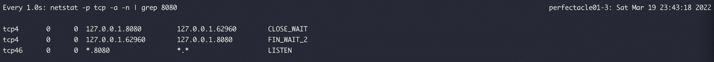
8. 서버는 클라이언트로부터 FIN 패킷을 받았지만 아직 보낼 패킷이 남아있기 때문인지 클라이언트에게 FIN 패킷을 보내지 않음.
   그리고 Active Close(클라이언트) 측에서는 오동작을 막기 위해 바로 소켓의 연결을 끊는 게 아니라 60초(OS마다 다르지만 tcp_fin_timeout(대다수의 리눅스는 60로초 설정됨)) 동안 대기하게 됨. (23:44:17)
   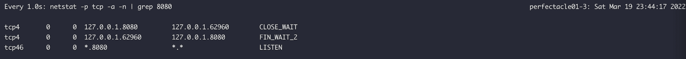
10. 119번 패킷에서 이제 기다릴만큼 다 기다렸는데도 서버 측에서 FIN 패킷이 오지 않기 때문에 클라이언트 → 서버로 RST, ACK 패킷을 날림. (23:44:18.060374, 정확하게 서버로 ACK 패킷 받은 이후부터 60초간 대기한 후 전송)
    
11. RST 패킷을 전송한 이후에 클라이언트/서버 측 소켓이 정상적으로 종료됨 (23:44:18)
   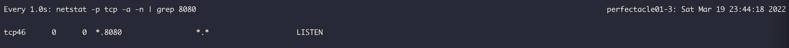

# ClientAbortException을 해결하려면?
1. 서버 측에서 처리 속도를 더 빠르게 한다.
2. 처리 속도는 빠르지만 응답이 크다면 응답의 사이즈를 줄인 API를 제공한다 (불필요한 필드 제거 or 페이징 API 제공)
3. 클라이언트 측 리드 타임아웃 설정값을 늘린다.
4. 정 합의가 안 된다면 ClientAbortException을 핸들링 해서 log.info로만 남긴다. (장애 상황은 아니라서 불필요한 노이즈라고 판단된다는 가정 하에)
5. 클라이언트 측에서는 ReadTimeout이 발생했다면(ClientAbortException 여부와 상관 없이), 장애 상황(고객에게 돈은 출금이 됐는데 주문은 완료처리 안 됐다던지)을 막기 위해 서버 측에 취소 API 같은 걸 호출하거나 상태 조회 API 같은 걸 호출한 이후 내가 처리를 따로 해야하는 건지 아닌지 판단한 후에 올바른 처리를 해줘야한다.
