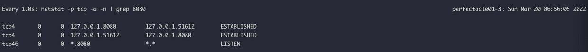
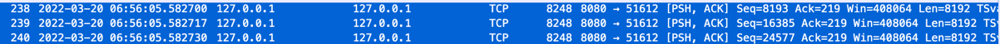
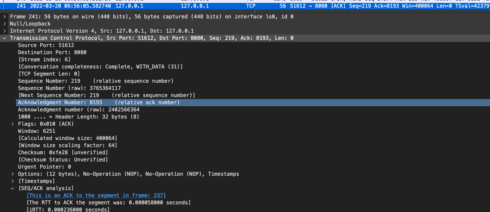
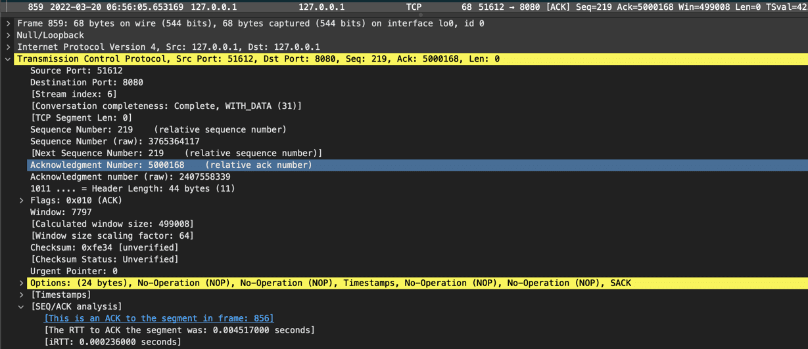
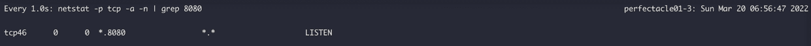
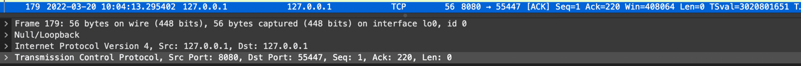
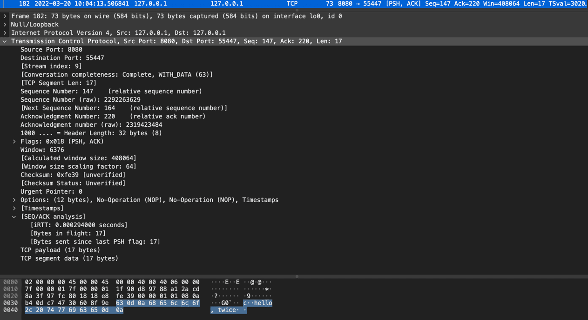
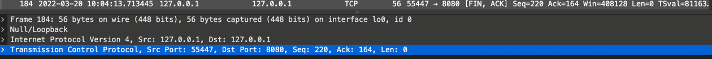
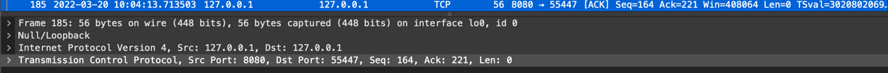
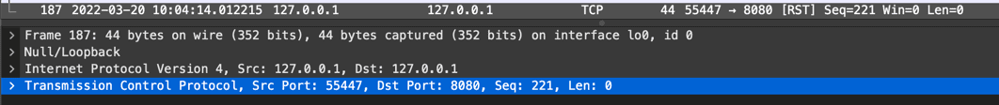

서버에서 아주 가끔가다가 ClientAbortException(java.io.IOExceiption: Broken pipe)이 발생해서 어떨 때 발생하는지 딥다이브 해봄.


적다보니 글이 길어져 글을 나누었는데 해당 글을 읽기 전에 [(Tomcat) ClientAbortException은 왜 발생할까? (Part 1)](/2022/03/20/client-abort-exception-deep-dive-part-01)을 먼저 보는 것을 추천함.

---

[https://tomcat.apache.org/tomcat-9.0-doc/api/org/apache/catalina/connector/ClientAbortException.html](https://tomcat.apache.org/tomcat-9.0-doc/api/org/apache/catalina/connector/ClientAbortException.html)
> Extend IOException to identify it as being caused by an abort of a request by a remote client.

외부 클라이언트 측에서 요청을 abort(중단) 시켰을 때 발생하는 예외로 보인다.
톰캣에서 발생시키는 예외인데 Spring Boot의 Web(Mvc) 모듈에서 기본적으로 사용하는 게 Embedded Tomcat이기 때문에 많은 분들께서 자주 마주치지 않았을까... 싶다.
구글링 해보면 뭐 브라우저 이슈(API 응답이 오기 전에 새로고침을 했다던가, 뒤로가기를 했다던가 등등)니 뭐니 하는데 내가 겪은 상황은 server → server 통신에서 발생한 것이기 때문에 서버 간의 통신 관점에서만 파보았다.

삽질을 해보고 싶은 사람은 [https://github.com/perfectacle/client-abort-exception-playground](https://github.com/perfectacle/client-abort-exception-playground) 을 clone 하면 된다.

그리고 ClientAbortException이 발생해도 스프링에서 기본적으로 [HandlerExceptionResolver](https://www.baeldung.com/exception-handling-for-rest-with-spring#exceptionresolver)에서 예외를 핸들링하기 때문에 로그에는 아무것도 남지 않는다.
따라서 해당 에러가 발생하는지 에러 로그로 명확히 확인해보는 게 훨씬 직관적이기 때문에 아래 @RestControllerAdvice를 추가했다.
```kotlin
@RestControllerAdvice
class ControllerAdvice {
    private val log = LoggerFactory.getLogger(this::class.java)

    @ExceptionHandler(value = [Exception::class])
    @ResponseStatus(HttpStatus.INTERNAL_SERVER_ERROR)
    fun handleException(e: Exception): ResponseEntity<Void> {
        log.error(e.message, e)

        return ResponseEntity.internalServerError().build()
    }
}
```

# N줄 요약
1. 클라이언트가 응답 패킷을 받는 와중에 Read Timeout 시간을 초과하면
   1. 각 응답 패킷의 시간 간격은 Read Timeout 안에 왔지만 모든 응답 패킷은 Read Timeout 안에 오지 않았다면
      1. Read Timeout의 의미는 모든 응답 패킷을 받는데까지 걸리는 시간이 아니라 각 응답 패킷 사이의 Timeout을 의미한다. (그래서 Apach HTTP Client는 오해의 소지를 줄이고자인지 socketTimeout이라고 부르고 있다.)
      2. 따라서 총 응답 패킷을 다 받는데까지는 Read Timeout에 설정한 시간을 초과해도 클라이언트/서버 모두 아무런 오류가 발생하지 않는다.
   2. 각 응답 패킷의 시간 간격이 Read Timeout 안에 오지 않은 경우
      1. Read Timeout의 의미는 각 응답 패킷 사이의 Timeout을 의미한다.
      2. 응답 패킷이 계속해서 잘 오다가 특정 패킷 하나만 Read Timeout을 초과하더라도 Read Timeout이 발생한다.
      3. 클라이언트 측에서 Read Timeout이 발생해서 소켓을 종료한 이후에도 `서버 측에서 응답 패킷을 보내면 ClientAbortException이 발생한다`. 
2. [ClientAbortException을 해결하려면?](#ClientAbortException을-해결하려면)
3. 프로세스(메인 함수)가 종료되더라도 Passive Close로부터 FIN 패킷을 받지 않으면 클라이언트/서버의 소켓은 닫히지 않는다. (오동작을 막기 위해 대기하는 것으로 알고 있음.)
   하지만 Passive Close로부터 FIN 패킷이 아닌 다른 패킷이 오면 Active Close에서는 RST 패킷을 보낸 후 소켓을 닫는다. 
   60초(OS마다 다르지만 tcp_fin_timeout(대다수의 리눅스는 60로초 설정됨) 만큼) 동안 대기 후에도 Passive Close에게 아무런 패킷이 오지 않으면 Active Close는 RST 패킷을 보내고 소켓을 닫는다.
4. 소켓이 정상 종료된 경우에 ACTIVE_CLOSE 측에서 소켓이 바로 사라지는 게 아니라 오동작을 막기 위해 TIME_WAIT 상태로 대기하다가 사라지게 되는데 그 전까지는 해당 소켓(로컬ip:로컬port, 서버ip:서버port 쌍)을 사용하지 못한다.
   대기 시간은 대부분 60초(OS마다 다르지만 2 * MSL(Maximum Segment Lifetime, OS 커널 레벨에 하드코딩 돼있는데 대다수의 리눅스는 60로초 설정됨) 동안 대기 후에 사라지게 된다.
   ```shell
      # mac
      sysctl -a | grep net.inet.tcp.msl
      net.inet.tcp.msl: 15000
      
      # linux alpine
      sysctl -a | grep msl
      # 몇몇 linux os는 tcp_fin_timeout을 2*msl로 사용하는 os도 있다고 함. (alpine linux도 아무것도 안 나오는 거 보면 그런 거 같음)
   ```
5. HTTP Client 구현체마다 다르겠지만 Apache HTTP Client의 경우 Keep-Alive를 사용한다고 했음에도 불구하고 요청이 정상적으로 처리되지 않는 경우(Read Timeout 발생, 500 Internal Sever Error 응답을 받는다던지... 모든 4xx, 5xx가 포함되는 건 아님)에는 커넥션을 커넥션 풀에 반납하지 않고(재사용하지 않고) 종료한다.

# 클라이언트가 응답 패킷을 받는 시간이 Read Timout을 초과한 경우

## 1. 각 응답 패킷의 시간 간격은 Read Timeout 안에 왔지만 모든 응답 패킷은 Read Timeout 안에 오지 않은 경우
서버 쪽 API에서 큰 응답을 준다고 가정
```kotlin
@RestController
class LargeResponseController {
    private val log = LoggerFactory.getLogger(this::class.java)

    @GetMapping("/large")
    fun slow(): String {
        log.info("request is arrived!")
        return "done!".repeat(1_000_000)
    }
}
```

클라이언트 측은 응답을 받다가 끊어야하기 때문에 리드 타임아웃 설정을 25ms로 매우 짧게 설정함.
```kotlin
fun main() {
    val readTimeout = Duration.ofMillis(25L)
    val restTemplate = RestTemplate(
        HttpComponentsClientHttpRequestFactory(
            HttpClientBuilder
                .create()
                .setMaxConnPerRoute(100)
                .setMaxConnTotal(100)
                .setKeepAliveStrategy(DefaultConnectionKeepAliveStrategy())
                .setDefaultRequestConfig(
                    RequestConfig.custom().setSocketTimeout(readTimeout.toMillis().toInt()).build()
                )
                .build()
        )
    )

    try {
        restTemplate.getForObject("http://localhost:8080/large", String::class.java)
    } catch (e: Exception) {
        e.printStackTrace()
    } finally {
        println("[${LocalDateTime.now()}] request is done!")
    }

    // 커넥션 풀에 있는 커넥션을 바로 종료하지 않기 위해 10초간 슬립
    Thread.sleep(10_000L)
    println("[${LocalDateTime.now()}] main function is done!")
}
```

### 데모 영상


### 클라이언트 로그 (콘솔에 응답을 로깅하느라 짤림...)
```kotlin
06:56:05.670 [main] DEBUG org.apache.http.wire - http-outgoing-0 << "done!done!done!done!done!done!done!done!done!done!done!done!done!done!done!done!done!done!done!done!done!done!done!done!done!done!done!done!done!done!done!done!done!done!done!done!done!done!done!done!done!done!done!done!done!done!done!done!done!done!done!done!done!done!done!done!done!done!done!done!done!done!done!done!done!done!done!done!done!done!done!done!done!done!done!done!done!done!done!done!done!done!done!done!done!done!done!done!done!done!done!done!done!done!done!done!done!done!done!done!done!done!done!done!done!done!done!done!done!done!done!done!done!done!done!done!done!done!done!done!done!done!done!done!done!done!done!done!done!done!done!done!done!done!done!done!done!done!done!done!done!done!done!done!done!done!done!done!done!done!done!done!done!done!done!done!done!done!done!done!done!done!done!done!done!done!done!done!done!done!done!done!done!done!done!done!done!done!done!done!done!done!done!done!done!done!done!done!done!done!done!done!done!done!done!done!done!done!done!done!done!done!done!done!done!done!done!done!done!done!done!done!done!done!done!done!done!done!done!done!done!done!done!done!done!done!done!done!done!done!done!done!done!done!done!done!done!done!done!done!done!done!done!done!done!done!done!done!done!done!done!done!done!done!done!done!done!done!done!done!done!done!done!done!done!done!done!done!done!done!done!done!done!done!done!done!done!done!done!done!done!done!done!done!done!done!done!done!done!done!done!done!done!done!done!done!done!done!done!done!done!done!done!done!done!done!done!done!done!done!done!done!done!done!done!done!done!done!done!done!done!done!done!done!done!done!done!done!done!done!done!done!done!done!done!done!done!done!done!done!done!done!done!done!done!done!done!done!done!done!done!done!done!done!done!done!done!done!done!done!done!done!done!done!done!done!done!done!done!done!done!done!done!done!done!done!done!done!done!done!done!done!done!done!done!done!done!done!done!done!done!done!done!done!done!done!done!done!done!done!done!done!done!done!done!done!done!done!done!done!done!done!done!done!done!done!done!done!done!done!done!done!done!done!done!done!done!done!done!done!done!done!done!done!done!done!done!done!done!done!done!done!done!done!done!done!done!done!done!done!done!done!done!done!done!done!done!done!done!done!done!done!done!done!done!done!done!done!done!done!done!done!done!done!done!done!done!done!done!done!done!done!done!done!done!done!done!done!done!done!done!done!done!done!done!done!done!done!done!done!done!done!done!done!done!done!done!done!done!done!done!done!done!done!done!done!done!done!done!done!done!done!done!done!done!done!done!done!done!done!done!done!done!done!done!done!done!done!done!done!done!done!done!done!done!done!done!done!done!done!done!done!done!done!done!done!done!done!done!done!done!done!done!done!done!done!done!done!done!done!done!done!done!done!done!done!done!done!done!done!done!done!done!done!done!done!done!done!done!done!done!done!done!done!done!done!done!done!done!done!done!done!done!done!done!done!done!done!done!done!done!done!done!done!done!done!done!done!done!done!done!done!done!done!done!done!done!done!done!done!done!done!done!done!done!done!done!done!done!done!done!done!done!done!done!done!done!done!done!done!done!done!done!done!done!done!done!done!done!done!done!done!done!done!done!done!done!done!done!done!done!done!done!done!done!done!done!done!done!done!done!done!done!done!done!done!done!done!done!done!done!done!done!done!done!done!done!done!done!done!done!done!done!done!done!done!done!done!done!done!done!done!done!done!done!done!done!done!done!done!done!done!done!done!done!done!done!done!done!done!done!done!done!done!done!done!done!done!done!done!done!done!done!done!done!done!done!done!done!done!done!done!done!done!done!done!done!done!done!done!done!done!done!done!done!done!done!done!done!done!done!done!done!done!done!done!done!done!done!done!done!done!done!done!done!done!done!done!done!done!done!done!done!done!done!done!done!done!done!done!done!done!done!done!done!done!done!done!done!done!done!done!done!done!done!done!done!done!done!done!done!done!done!done!done!done!done!done!done!done!done!done!done!done!done!done!done!done!done!done!done!done!done!done!done!done!done!done!done!done!done!done!done!done!done!done!done!done!done!done!done!done!done!done!done!done!done!done!done!done!done!done!done!done!done!done!done!done!done!done!done!done!done!done!done!done!done!done!done!done!done!done!done!done!done!done!done!done!done!done!done!done!done!done!done!done!done!done!done!done!done!done!done!done!done!done!done!done!done!done!done!done!done!done!done!done!done!done!done!done!done!done!done!done!done!done!done!done!done!done!done!done!done!done!done!done!done!done!done!done!done!done!done!done!done!done!done!done!done!done!done!done!done!done!done!done!done!done!done!done!done!done!done!done!done!done!done!done!done!done!done!done!done!done!done!done!done!done!done!done!done!done!done!done!done!done!done!done!done!done!done!done!done!done!done!done!done!done!done!done!done!done!done!done!done!done!done!done!done!done!done!done!done!done!done!done!done!done!done!done!done!done!done!done!done!done!done!done!done!done!done!done!done!done!done!done!done!done!done!done!done!done!done!done!done!done!done!done!done!done!done!done!done!done!done!done!done!done!done!done!done!done!done!done!done!done!done!done!done!done!done!done!done!done!done!done!done!done!done!done!done!done!done!done!done!done!done!done!done!done!done!done!done!done!done!done!done!done!done!done!done!done!done!done!done!done!done!done!done!done!done!done!done!done!done!done!done!done!done!done!done!done!done!done!done!done!done!done!done!done!done!done!done!done!done!done!done!done!done!done!done!done!done!done!done!done!done!done!done!done!done!done!done!done!done!done!done!done!done!done!done!done!done!done!done!done!done!done!done!done!done!done!done!done!done!done!done!done!done!done!done!done!done!done!done!done!done!done!done!done!done!done!done!done!done!done!done!done!done!done!done!done!done!done!done!done!done!done!done!done!done!done!done!done!done!done!done!done!done!done!done!done!done!done!done!done!done!done!done!done!done!done!done!done!done!done!done!done!done!done!done!done!done!done!done!done!done!done!done!done!done!done!done!done!done!done!done!done!done!done!done!done!done!done!done!done!done!done!done!done!done!done!done!done!done!done!done!done!done!done!done!done!done!done!done!done!done!done!done!done!done!done!done!done!done!done!done!done!done!done!done!done!done!done!done!done!done!done!done!done!done!done!done!done!done!done!done!done!done!done!done!done!done!done!done!done!done!done!done!done!done!done!done!done!done!done!done!done!done!done!done!done!done!done!done!done!done!done!done!done!done!done!done!done!done!done!done!done!done!done!done!done!done!done!done!done!done!done!done!done!done!done!done!done!done!done!done!done!done!done!done!done!done!done!done!done!done!done!done!done!done!done!done!done!done!done!done!done!done!done!done!done!done!done!done!done!done!done!done!done!done!done!done!done!done!done!done!done!done!done!done!done!done!done!done!done!done!done!done!done!done!done!done!done!done!done!done!done!done!done!done!done!done!done!done!done!done!done!done!done!done!done!done!done!done!done!done!done!done!done!done!done!done!done!done!done!done!done!done!done!done!done!done!done!done!done!done!done!done!done!done!done!done!done!done!done!done!done!done!done!done!done!done!done!done!done!done!done!done!done!done!done!done!done!done!done!done!done!done!done!done!done!done!done!done!done!done!done!done!done!done!done!done!done!done!done!done!done!done!done!done!done!done!done!done!done!done!done!done!done!done!done!done!done!done!done!done!done!done!done!done!done!done!done!done!done!done!done!done!done!done!done!done!done!done!done!done!done!done!done!done!done!done!done!done!done!done!done!done!done!done!done!done!done!done!done!done!done!done!done!done!done!done!done!done!done!done!done!done!done!done!done!done!done!done!done!done!done!done!done!done!done!done!done!done!done!done!done!done!done!done!done!done!done!done!done!done!done!do"
06:56:05.670 [main] DEBUG org.apache.http.wire - http-outgoing-0 << "ne!done!done!done!done!done!done!done!done!done!done!done!done!done!done!done!done!done!done!done!done!done!done!done!done!done!done!done!done!done!done!done!done!done!done!done!done!done!done!done!done!done!done!done!done!done!done!done!done!done!done!done!done!done!done!done!done!done!done!done!done!done!done!done!done!done!done!done!done!done!done!done!done!done!done!done!done!done!done!done!done!done!done!done!done!done!done!done!done!done!done!done!done!done!done!done!done!done!done!done!done!done!done!done!done!done!done!done!done!done!done!done!done!done!done!done!done!done!done!done!done!done!done!done!done!done!done!done!done!done!done!done!done!done!done!done!done!done!done!done!done!done!done!done!done!done!done!done!done!done!done!done!done!done!done!done!done!done!done!done!done!done!done!done!done!done!done!done!done!done!done!done!done!done!done!done!done!done!done!done!done!done!done!done!done!done!done!done!done!done!done!done!done!done!done!done!done!done!done!done!done!done!done!done!done!done!done!done!done!done!done!done!done!done!done!done!done!done!done!done!done!done!done!done!done!done!done!done!done!done!done!done!done!done!done!done!done!done!done!done!done!done!done!done!done!done!done!done!done!done!done!done!done!done!done!done!done!done!done!done!done!done!done!done!done!done!done!done!done!done!done!done!done!done!done!done!done!done!done!done!done!done!done!done!done!done!done!done!done!done!done!done!done!done!done!done!done!done!done!done!done!done!done!done!done!done!done!done!done!done!done!done!done!done!done!done!done!done!done!done!done!done!done!done!done!done!done!done!done!done!done!done!done!done!done!done!done!done!done!done!done!done!done!done!done!done!done!done!done!done!done!done!done!done!done!done!done!done!done!done!done!done!done!done!done!done!done!done!done!done!done!done!done!done!done!done!done!done!done!done!done!done!done!done!done!done!done!done!done!done!done!done!done!done!done!done!done!done!done!done!done!done!done!done!done!done!done!done!done!done!done!done!done!done!done!done!done!done!done!done!done!done!done!done!done!done!done!done!done!done!done!done!done!done!done!done!done!done!done!done!done!done!done!done!done!done!done!done!done!done!done!done!done!done!done!done!done!done!done!done!done!done!done!done!done!done!done!done!done!done!done!done!done!done!done!done!done!done!done!done!done!done!done!done!done!done!done!done!done!done!done!done!done!done!done!done!done!done!done!done!done!done!done!done!done!done!done!done!done!done!done!done!done!done!done!done!done!done!done!done!done!done!done!done!done!done!done!done!done!done!done!done!done!done!done!done!done!done!done!done!done!done!done!done!done!done!done!done!done!done!done!done!done!done!done!done!done!done!done!done!done!done!done!done!done!done!done!done!done!done!done!done!done!done!done!done!done!done!done!done!done!done!done!done!done!done!done!done!done!done!done!done!done!done!done!done!done!done!done!done!done!done!done!done!done!done!done!done!done!done!done!done!done!done!done!done!done!done!done!done!done!done!done!done!done!done!done!done!done!done!done!done!done!done!done!done!done!done!done!done!done!done!done!done!done!done!done!done!done!done!done!done!done!done!done!done!done!done!done!done!done!done!done!done!done!done!done!done!done!done!done!done!done!done!done!done!done!done!done!done!done!done!done!done!done!done!done!done!done!done!done!done!done!done!done!done!done!done!done!done!done!done!done!done!done!done!done!done!done!done!done!done!done!done!done!done!done!done!done!done!done!done!done!done!done!done!done!done!done!done!done!done!done!done!done!done!done!done!done!done!done!done!done!done!done!done!done!done!done!done!done!done!done!done!done!done!done!done!done!done!done!done!done!done!done!done!done!done!done!done!done!done!done!done!done!done!done!done!done!done!done!done!done!done!done!done!done!done!done!done!done!done!done!done!done!done!done!done!done!done!done!done!done!done!done!done!done!done!done!done!done!done!done!done!done!done!done!done!done!done!done!done!done!done!done!done!done!done!done!done!done!done!done!done!done!done!done!done!done!done!done!done!done!done!done!done!done!done!done!done!done!done!done!done!done!done!done!done!done!done!done!done!done!done!done!done!done!done!done!done!done!done!done!done!done!done!done!done!done!done!done!done!done!done!done!done!done!done!done!done!done!done!done!done!done!done!done!done!done!done!done!done!done!done!done!done!done!done!done!done!done!done!done!done!done!done!done!done!done!done!done!done!done!done!done!done!done!done!done!done!done!done!done!done!done!done!done!done!done!done!done!done!done!done!done!done!done!done!done!done!done!done!done!done!done!done!done!done!done!done!done!done!done!done!done!done!done!done!done!done!done!done!done!done!done!done!done!done!done!done!done!done!done!done!done!done!done!done!done!done!done!done!done!done!done!done!done!done!done!done!done!done!done!done!done!done!done!done!done!done!done!done!done!done!done!done!done!done!done!done!done!done!done!done!done!done!done!done!done!done!done!done!done!done!done!done!done!done!done!done!done!done!done!done!done!done!done!done!done!done!done!done!done!done!done!done!done!done!done!done!done!done!done!done!done!done!done!done!done!done!done!done!done!done!done!done!done!done!done!done!done!done!done!done!done!done!done!done!done!done!done!done!done!done!done!done!done!done!done!done!done!done!done!done!done!done!done!done!done!done!done!done!done!done!done!done!done!done!done!done!done!done!done!done!done!done!done!done!done!done!done!done!done!done!done!done!done!done!done!done!done!done!done!done!done!done!done!done!done!done!done!done!done!done!done!done!done!done!done!done!done!done!done!done!done!done!done!done!done!done!done!done!done!done!done!done!done!done!done!done!done!done!done!done!done!done!done!done!done!done!done!done!done!done!done!done!done!done!done!done!done!done!done!done!done!done!done!done!done!done!done!done!done!done!done!done!done!done!done!done!done!done!done!done!done!done!done!done!done!done!done!done!done!done!done!done!done!done!done!done!done!done!done!done!done!done!done!done!done!done!done!done!done!done!done!done!done!done!done!done!done!done!done!done!done!done!done!done!done!done!done!done!done!done!done!done!done!done!done!done!done!done!done!done!done!done!done!done!done!done!done!done!done!done!done!done!done!done!done!done!done!done!done!done!done!done!done!done!done!done!done!done!done!done!done!done!done!done!done!done!done!done!done!done!done!done!done!done!done!done!done!done!done!done!done!done!done!done!done!done!done!done!done!done!done!done!done!done!done!done!done!done!done!done!done!done!done!done!done!done!done!done!done!done!done!done!done!done!done!done!done!done!done!done!done!done!done!done!done!done!done!done!done!done!done!done!done!done!done!done!done!done!done!done!done!done!done!done!done!done!done!done!done!done!done!done!done!done!done!done!done!done!done!done!done!done!done!done!done!done!done!done!done!done!done!done!done!done!done!done!done!done!done!done!done!done!done!done!done!done!done!done!done!done!done!done!done!done!done!done!done!done!done!done!done!done!done!done!done!done!done!done!done!done!done!done!done!done!done!done!done!done!done!done!done!done!done!done!done!done!done!done!done!done!done!done!done!done!done!done!done!done!done!done!done!done!done!done!done!done!done!done!done!done!done!done!done!done!done!done!done!done!done!done!done!done!done!done!done!done!done!done!done!done!done!done!done!done!done!done!done!done!done!done!done!done!done!done!done!done!done!done!done!done!done!done!done!done!done!done!done!done!done!done!done!done!done!done!done!done!done!done!done!done!done!done!done!done!done!done!done!done!done!done!done!done!done!done!done!done!done!done!done!done!done!done!done!done!done!done!done!done!done!done!done!done!done!done!done!done!done!done!done!done!done!done!done!done!done!done!done!done!done!done!done!done!done!done!done!done!done!done!done!done!done!done!done!done!done!done!done!done!done!done!done!done!done!done!done"
06:56:05.670 [main] DEBUG org.apache.http.wire - http-outgoing-0 << "!done!done!done!done!done!done!done!done!done!done!done!done!done!done!done!done!done!done!done!done!done!done!done!done!done!done!done!done!done!done!done!done!done!done!done!done!done!done!done!done!done!done!done!done!done!done!done!done!done!done!done!done!done!done!done!done!done!done!done!done!done!done!done!done!done!done!done!done!done!done!done!done!done!done!done!done!done!done!done!done!done!done!done!done!done!done!done!done!done!done!done!done!done!done!done!done!done!done!done!done!done!done!done!done!done!done!done!done!done!done!done!done!done!done!done!done!done!done!done!done!done!done!done!done!done!done!done!done!done!done!done!done!done!done!done!done!done!done!done!done!done!done!done!done!done!done!done!done!done!done!done!done!done!done!done!done!done!done!done!done!done!done!done!done!done!done!done!done!done!done!done!done!done!done!done!done!done!done!done!done!done!done!done!done!done!done!done!done!done!done!done!done!done!done!done!done!done!done!done!done!done!done!done!done!done!done!done!done!done!done!done!done!done!done!done!done!done!done!done!done!done!done!done!done!done!done!done!done!done!done!done!done!done!done!done!done!done!done!done!done!done!done!done!done!done!done!done!done!done!done!done!done!done!done!done!done!done!done!done!done!done!done!done!done!done!done!done!done!done!done!done!done!done!done!done!done!done!done!done!done!done!done!done!done!done!done!done!done!done!done!done!done!done!done!done!done!done!done!done!done!done!done!done!done!done!done!done!done!done!done!done!done!done!done!done!done!done!done!done!done!done!done!done!done!done!done!done!done!done!done!done!done!done!done!done!done!done!done!done!done!done!done!done!done!done!done!done!done!done!done!done!done!done!done!done!done!done!done!done!done!done!done!done!done!done!done!done!done!done!done!done!done!done!done!done!done!done!done!done!done!done!done!done!done!done!done!done!done!done!done!done!done!done!done!done!done!done!done!done!done!done!done!done!done!done!done!done!done!done!done!done!done!done!done!done!done!done!done!done!done!done!done!done!done!done!done!done!done!done!done!done!done!done!done!done!done!done!done!done!done!done!done!done!done!done!done!done!done!done!done!done!done!done!done!done!done!done!done!done!done!done!done!done!done!done!done!done!done!done!done!done!done!done!done!done!done!done!done!done!done!done!done!done!done!done!done!done!done!done!done!done!done!done!done!done!done!done!done!done!done!done!done!done!done!done!done!done!done!done!done!done!done!done!done!done!done!done!done!done!done!done!done!done!done!done!done!done!done!done!done!done!done!done!done!done!done!done!done!done!done!done!done!done!done!done!done!done!done!done!done!done!done!done!done!done!done!done!done!done!done!done!done!done!done!done!done!done!done!done!done!done!done!done!done!done!done!done!done!done!done!done!done!done!done!done!done!done!done!done!done!done!done!done!done!done!done!done!done!done!done!done!done!done!done!done!done!done!done!done!done!done!done!done!done!done!done!done!done!done!done!done!done!done!done!done!done!done!done!done!done!done!done!done!done!done!done!done!done!done!done!done!done!done!done!done!done!done!done!done!done!done!done!done!done!done!done!done!done!done!done!done!done!done!done!done!done!done!done!done!done!done!done!done!done!done!done!done!done!done!done!done!done!done!done!done!done!done!done!done!done!done!done!done!done!done!done!done!done!done!done!done!done!done!done!done!done!done!done!done!done!done!done!done!done!done!done!done!done!done!done!done!done!done!done!done!done!done!done!done!done!done!done!done!done!done!done!done!done!done!done!done!done!done!done!done!done!done!done!done!done!done!done!done!done!done!done!done!done!done!done!done!done!done!done!done!done!done!done!done!done!done!done!done!done!done!done!done!done!done!done!done!done!done!done!done!done!done!done!done!done!done!done!done!done!done!done!done!done!done!done!done!done!done!done!done!done!done!done!done!done!done!done!done!done!done!done!done!done!done!done!done!done!done!done!done!done!done!done!done!done!done!done!done!done!done!done!done!done!done!done!done!done!done!done!done!done!done!done!done!done!done!done!done!done!done!done!done!done!done!done!done!done!done!done!done!done!done!done!done!done!done!done!done!done!done!done!done!done!done!done!done!done!done!done!done!done!done!done!done!done!done!done!done!done!done!done!done!done!done!done!done!done!done!done!done!done!done!done!done!done!done!done!done!done!done!done!done!done!done!done!done!done!done!done!done!done!done!done!done!done!done!done!done!done!done!done!done!done!done!done!done!done!done!done!done!done!done!done!done!done!done!done!done!done!done!done!done!done!done!done!done!done!done!done!done!done!done!done!done!done!done!done!done!done!done!done!done!done!done!done!done!done!done!done!done!done!done!done!done!done!done!done!done!done!done!done!done!done!done!done!done!done!done!done!done!done!done!done!done!done!done!done!done!done!done!done!done!done!done!done!done!done!done!done!done!done!done!done!done!done!done!done!done!done!done!done!done!done!done!done!done!done!done!done!done!done!done!done!done!done!done!done!done!done!done!done!done!done!done!done!done!done!done!done!done!done!done!done!done!done!done!done!done!done!done!done!done!done!done!done!done!done!done!done!done!done!done!done!done!done!done!done!done!done!done!done!done!done!done!done!done!done!done!done!done!done!done!done!done!done!done!done!done!done!done!done!done!done!done!done!done!done!done!done!done!done!done!done!done!done!done!done!done!done!done!done!done!done!done!done!done!done!done!done!done!done!done!done!done!done!done!done!done!done!done!done!done!done!done!done!done!done!done!done!done!done!done!done!done!done!done!done!done!done!done!done!done!done!done!done!done!done!done!done!done!done!done!done!done!done!done!done!done!done!done!done!done!done!done!done!done!done!done!done!done!done!done!done!done!done!done!done!done!done!done!done!done!done!done!done!done!done!done!done!done!done!done!done!done!done!done!done!done!done!done!done!done!done!done!done!done!done!done!done!done!done!done!done!done!done!done!done!done!done!done!done!done!done!done!done!done!done!done!done!done!done!done!done!done!done!done!done!done!done!done!done!done!done!done!done!done!done!done!done!done!done!done!done!done!done!done!done!done!done!done!done!done!done!done!done!done!done!done!done!done!done!done!done!done!done!done!done!done!done!done!done!done!done!done!done!done!done!done!done!done!done!done!done!done!done!done!done!done!done!done!done!done!done!done!done!done!done!done!done!done!done!done!done!done!done!done!done!done!done!done!done!done!done!done!done!done!done!done!done!done!done!done!done!done!done!done!done!done!done!done!done!done!done!done!done!done!done!done!done!done!done!done!done!done!done!done!done!done!done!done!done!done!done!done!done!done!done!done!done!done!done!done!done!done!done!done!done!done!done!done!done!done!done!done!done!done!done!done!done!done!done!done!done!done!done!done!done!done!done!done!done!done!done!done!done!done!done!done!done!done!done!done!done!done!done!done!done!done!done!done!done!done!done!done!done!done!done!done!done!done!done!done!done!done!done!done!done!done!done!done!done!done!done!done!done!done!done!done!done!done!done!done!done!done!done!done!done!done!done!done!done!done!done!done!done!done!done!done!done!done!done!done!done!done!done!done!done!done!done!done!done!done!done!done!done!done!done!done!done!done!done!done!done!done!done!done!done!done!done!done!done!done!done!done!done!done!done!done!done!done!done!done!done!done!done!done!done!done!done!done!done!done!done!done!done!done!done!done!done!done!done!done!done!done!done!done!done!done!done!done!done!done!done!done!done!done!done!done!done!done!done!done!done!done!done!done!done!done!done!done!done!done!done!done!done!done!done!done!done!done!done!done!done!done!done!done!done!done!done!done!done!done!done!done!done!done!done!done!done!done!done!done!done!done!done!done!done!done!done!done!done!done!done!d"
06:56:05.670 [main] DEBUG org.apache.http.wire - http-outgoing-0 << "one!done!done!done!done!done!done!done!done!done!done!done!done!done!done!done!done!done!done!done!done!done!done!done!done!done!done!done!done!done!done!done!done!done!done!done!done!done!done!done!done!done!done!done!done!done!done!done!done!done!done!done!done!done!done!done!done!done!done!done!done!done!done!done!done!done!done!done!done!done!done!done!done!done!done!done!done!done!done!done!done!done!done!done!done!done!done!done!done!done!done!done!done!done!done!done!done!done!done!done!done!done!done!done!done!done!done!done!done!done!done!done!done!done!done!done!done!done!done!done!done!done!done!done!done!done!done!done!done!done!done!done!done!done!done!done!done!done!done!done!done!done!done!done!done!done!done!done!done!done!done!done!done!done!done!done!done!done!done!done!done!done!done!done!done!done!done!done!done!done!done!done!done!done!done!done!done!done!done!done!done!done!done!done!done!done!done!done!done!done!done!done!done!done!done!done!done!done!done!done!done!done!done!done!done!done!done!done!done!done!done!done!done!done!done!done!done!done!done!done!done!done!done!done!done!done!done!done!done!done!done!done!done!done!done!done!done!done!done!done!done!done!done!done!done!done!done!done!done!done!done!done!done!done!done!done!done!done!done!done!done!done!done!done!done!done!done!done!done!done!done!done!done!done!done!done!done!done!done!done!done!done!done!done!done!done!done!done!done!done!done!done!done!done!done!done!done!done!done!done!done!done!done!done!done!done!done!done!done!done!done!done!done!done!done!done!done!done!done!done!done!done!done!done!done!done!done!done!done!done!done!done!done!done!done!done!done!done!done!done!done!done!done!done!done!done!done!done!done!done!done!done!done!done!done!done!done!done!done!done!done!done!done!done!done!done!done!done!done!done!done!done!done!done!done!done!done!done!done!done!done!done!done!done!done!done!done!done!done!done!done!done!done!done!done!done!done!done!done!done!done!done!done!done!done!done!done!done!done!done!done!done!done!done!done!done!done!done!done!done!done!done!done!done!done!done!done!done!done!done!done!done!done!done!done!done!done!done!done!done!done!done!done!done!done!done!done!done!done!done!done!done!done!done!done!done!done!done!done!done!done!done!done!done!done!done!done!done!done!done!done!done!done!done!done!done!done!done!done!done!done!done!done!done!done!done!done!done!done!done!done!done!done!done!done!done!done!done!done!done!done!done!done!done!done!done!done!done!done!done!done!done!done!done!done!done!done!done!done!done!done!done!done!done!done!done!done!done!done!done!done!done!done!done!done!done!done!done!done!done!done!done!done!done!done!done!done!done!done!done!done!done!done!done!done!done!done!done!done!done!done!done!done!done!done!done!done!done!done!done!done!done!done!done!done!done!done!done!done!done!done!done!done!done!done!done!done!done!done!done!done!done!done!done!done!done!done!done!done!done!done!done!done!done!done!done!done!done!done!done!done!done!done!done!done!done!done!done!done!done!done!done!done!done!done!done!done!done!done!done!done!done!done!done!done!done!done!done!done!done!done!done!done!done!done!done!done!done!done!done!done!done!done!done!done!done!done!done!done!done!done!done!done!done!done!done!done!done!done!done!done!done!done!done!done!done!done!done!done!done!done!done!done!done!done!done!done!done!done!done!done!done!done!done!done!done!done!done!done!done!done!done!done!done!done!done!done!done!done!done!done!done!done!done!done!done!done!done!done!done!done!done!done!done!done!done!done!done!done!done!done!done!done!done!done!done!done!done!done!done!done!done!done!done!done!done!done!done!done!done!done!done!done!done!done!done!done!done!done!done!done!done!done!done!done!done!done!done!done!done!done!done!done!done!done!done!done!done!done!done!done!done!done!done!done!done!done!done!done!done!done!done!done!done!done!done!done!done!done!done!done!done!done!done!done!done!done!done!done!done!done!done!done!done!done!done!done!done!done!done!done!done!done!done!done!done!done!done!done!done!done!done!done!done!done!done!done!done!done!done!done!done!done!done!done!done!done!done!done!done!done!done!done!done!done!done!done!done!done!done!done!done!done!done!done!done!done!done!done!done!done!done!done!done!done!done!done!done!done!done!done!done!done!done!done!done!done!done!done!done!done!done!done!done!done!done!done!done!done!done!done!done!done!done!done!done!done!done!done!done!done!done!done!done!done!done!done!done!done!done!done!done!done!done!done!done!done!done!done!done!done!done!done!done!done!done!done!done!done!done!done!done!done!done!done!done!done!done!done!done!done!done!done!done!done!done!done!done!done!done!done!done!done!done!done!done!done!done!done!done!done!done!done!done!done!done!done!done!done!done!done!done!done!done!done!done!done!done!done!done!done!done!done!done!done!done!done!done!done!done!done!done!done!done!done!done!done!done!done!done!done!done!done!done!done!done!done!done!done!done!done!done!done!done!done!done!done!done!done!done!done!done!done!done!done!done!done!done!done!done!done!done!done!done!done!done!done!done!done!done!done!done!done!done!done!done!done!done!done!done!done!done!done!done!done!done!done!done!done!done!done!done!done!done!done!done!done!done!done!done!done!done!done!done!done!done!done!done!done!done!done!done!done!done!done!done!done!done!done!done!done!done!done!done!done!done!done!done!done!done!done!done!done!done!done!done!done!done!done!done!done!done!done!done!done!done!done!done!done!done!done!done!done!done!done!done!done!done!done!done!done!done!done!done!done!done!done!done!done!done!done!done!done!done!done!done!done!done!done!done!done!done!done!done!done!done!done!done!done!done!done!done!done!done!done!done!done!done!done!done!done!done!done!done!done!done!done!done!done!done!done!done!done!done!done!done!done!done!done!done!done!done!done!done!done!done!done!done!done!done!done!done!done!done!done!done!done!done!done!done!done!done!done!done!done!done!done!done!done!done!done!done!done!done!done!done!done!done!done!done!done!done!done!done!done!done!done!done!done!done!done!done!done!done!done!done!done!done!done!done!done!done!done!done!done!done!done!done!done!done!done!done!done!done!done!done!done!done!done!done!done!done!done!done!done!done!done!done!done!done!done!done!done!done!done!done!done!done!done!done!done!done!done!done!done!done!done!done!done!done!done!done!done!done!done!done!done!done!done!done!done!done!done!done!done!done!done!done!done!done!done!done!done!done!done!done!done!done!done!done!done!done!done!done!done!done!done!done!done!done!done!done!done!done!done!done!done!done!done!done!done!done!done!done!done!done!done!done!done!done!done!done!done!done!done!done!done!done!done!done!done!done!done!done!done!done!done!done!done!done!done!done!done!done!done!done!done!done!done!done!done!done!done!done!done!done!done!done!done!done!done!done!done!done!done!done!done!done!done!done!done!done!done!done!done!done!done!done!done!done!done!done!done!done!done!done!done!done!done!done!done!done!done!done!done!done!done!done!done!done!done!done!done!done!done!done!done!done!done!done!done!done!done!done!done!done!done!done!done!done!done!done!done!done!done!done!done!done!done!done!done!done!done!done!done!done!done!done!done!done!done!done!done!done!done!done!done!done!done!done!done!done!done!done!done!done!done!done!done!done!done!done!done!done!done!done!done!done!done!done!done!done!done!done!done!done!done!done!done!done!done!done!done!done!done!done!done!done!done!done!done!done!done!done!done!done!done!done!done!done!done!done!done!done!done!done!done!done!done!done!done!done!done!done!done!done!done!done!done!done!done!done!done!done!done!done!done!done!done!done!done!done!done!done!done!done!done!done!done!done!done!done!done!done!done!done!done!done!done!done!done!done!done!done!done!done!done!done!done!done!done!done!done!done!done!done!done!done!done!done!done!done!done!done!done!done!done!done!done!done!done!done!done!done!done!done!done!done!don"
06:56:05.670 [main] DEBUG org.apache.http.wire - http-outgoing-0 << "e!done!done!done!done!done!done!done!done!done!done!done!done!done!done!done!done!done!done!done!done!done!done!done!done!done!done!done!done!done!done!done!done!done!done!done!done!done!done!done!done!done!done!done!done!done!done!done!done!done!done!done!done!done!done!done!done!done!done!done!done!done!done!done!done!done!done!done!done!done!done!done!done!done!done!done!done!done!done!done!done!done!done!done!done!done!done!done!done!done!done!done!done!done!done!done!done!done!done!done!done!done!done!done!done!done!done!done!done!done!done!done!done!done!done!done!done!done!done!done!done!done!done!done!done!done!done!done!done!done!done!done!done!done!done!done!done!done!done!done!done!done!done!done!done!done!done!done!done!done!done!done!done!done!done!done!done!done!done!done!done!done!done!done!done!done!done!done!done!done!done!done!done!done!done!done!done!done!done!done!done!done!done!done!done!done!done!done!done!done!done!done!done!done!done!done!done!done!done!done!done!done!done!done!done!done!done!done!done!done!done!done!done!done!done!done!done!done!done!done!done!done!done!done!done!done!done!done!done!done!done!done!done!done!done!done!done!done!done!done!done!done!done!done!done!done!done!done!done!done!done!done!done!done!done!done!done!done!done!done!done!done!done!done!done!done!done!done!done!done!done!done!done!done!done!done!done!done!done!done!done!done!done!done!done!done!done!done!done!done!done!done!done!done!done!done!done!done!done!done!done!done!done!done!done!done!done!done!done!done!done!done!done!done!done!done!done!done!done!done!done!done!done!done!done!done!done!done!done!done!done!done!done!done!done!done!done!done!done!done!done!done!done!done!done!done!done!done!done!done!done!done!done!done!done!done!done!done!done!done!done!done!done!done!done!done!done!done!done!done!done!done!done!done!done!done!done!done!done!done!done!done!done!done!done!done!done!done!done!done!done!done!done!done!done!done!done!done!done!done!done!done!done!done!done!done!done!done!done!done!done!done!done!done!done!done!done!done!done!done!done!done!done!done!done!done!done!done!done!done!done!done!done!done!done!done!done!done!done!done!done!done!done!done!done!done!done!done!done!done!done!done!done!done!done!done!done!done!done!done!done!done!done!done!done!done!done!done!done!done!done!done!done!done!done!done!done!done!done!done!done!done!done!done!done!done!done!done!done!done!done!done!done!done!done!done!done!done!done!done!done!done!done!done!done!done!done!done!done!done!done!done!done!done!done!done!done!done!done!done!done!done!done!done!done!done!done!done!done!done!done!done!done!done!done!done!done!done!done!done!done!done!done!done!done!done!done!done!done!done!done!done!done!done!done!done!done!done!done!done!done!done!done!done!done!done!done!done!done!done!done!done!done!done!done!done!done!done!done!done!done!done!done!done!done!done!done!done!done!done!done!done!done!done!done!done!done!done!done!done!done!done!done!done!done!done!done!done!done!done!"
06:56:05.670 [main] DEBUG org.apache.http.impl.conn.PoolingHttpClientConnectionManager - Connection [id: 0][route: {}->http://localhost:8080] can be kept alive for 60.0 seconds
06:56:05.670 [main] DEBUG org.apache.http.impl.conn.DefaultManagedHttpClientConnection - http-outgoing-0: set socket timeout to 0
06:56:05.670 [main] DEBUG org.apache.http.impl.conn.PoolingHttpClientConnectionManager - Connection released: [id: 0][route: {}->http://localhost:8080][total available: 1; route allocated: 1 of 100; total allocated: 1 of 100]
[2022-03-20T06:56:05.674] request is done!
[2022-03-20T06:56:15.679] main function is done!

Process finished with exit code 0
```
1. 06:56:05.670에 마지막 응답 패킷을 받음 (`06:56:05.670 [main] DEBUG org.apache.http.wire - http-outgoing-0 << "e!done!done!done!done!done!done!done!done!done!done!don...`)
2. 06:56:05.670에 커넥션을 종료하지 않고 커넥션 풀에 반납함 (Keep-Alive 설정에 따라 60초 동안 idle 상태의 커넥션이라도 보관함, `06:56:05.670 [main] DEBUG org.apache.http.impl.conn.PoolingHttpClientConnectionManager - Connection released: [id: 0][route: {}->http://localhost:8080][total available: 1; route allocated: 1 of 100; total allocated: 1 of 100]`)
3. 06:56:15.679에 메인함수 종료

### 서버 로그
```kotlin
2022-03-20 06:56:05.568  INFO 86561 --- [nio-8080-exec-1] c.e.playground.LargeResponseController   : request is arrived!
```
1. 06:56:05.568에 요청 도착

### 패킷 로그 (소켓 상태)
```kotlin
231	2022-03-20 06:56:05.565966	127.0.0.1	127.0.0.1	TCP	68	51612 → 8080 [SYN] Seq=0 Win=65535 Len=0 MSS=16344 WS=64 TSval=4237975396 TSecr=0 SACK_PERM=1
232	2022-03-20 06:56:05.566176	127.0.0.1	127.0.0.1	TCP	68	8080 → 51612 [SYN, ACK] Seq=0 Ack=1 Win=65535 Len=0 MSS=16344 WS=64 TSval=3590453492 TSecr=4237975396 SACK_PERM=1
233	2022-03-20 06:56:05.566202	127.0.0.1	127.0.0.1	TCP	56	51612 → 8080 [ACK] Seq=1 Ack=1 Win=408256 Len=0 TSval=4237975396 TSecr=3590453492
234	2022-03-20 06:56:05.566226	127.0.0.1	127.0.0.1	TCP	56	[TCP Window Update] 8080 → 51612 [ACK] Seq=1 Ack=1 Win=408256 Len=0 TSval=3590453492 TSecr=4237975396
235	2022-03-20 06:56:05.568288	127.0.0.1	127.0.0.1	HTTP	274	GET /large HTTP/1.1
236	2022-03-20 06:56:05.568329	127.0.0.1	127.0.0.1	TCP	56	8080 → 51612 [ACK] Seq=1 Ack=219 Win=408064 Len=0 TSval=3590453495 TSecr=4237975399
237	2022-03-20 06:56:05.582682	127.0.0.1	127.0.0.1	TCP	8248	8080 → 51612 [PSH, ACK] Seq=1 Ack=219 Win=408064 Len=8192 TSval=3590453510 TSecr=4237975399 [TCP segment of a reassembled PDU]
238	2022-03-20 06:56:05.582700	127.0.0.1	127.0.0.1	TCP	8248	8080 → 51612 [PSH, ACK] Seq=8193 Ack=219 Win=408064 Len=8192 TSval=3590453510 TSecr=4237975399 [TCP segment of a reassembled PDU]
239	2022-03-20 06:56:05.582717	127.0.0.1	127.0.0.1	TCP	8248	8080 → 51612 [PSH, ACK] Seq=16385 Ack=219 Win=408064 Len=8192 TSval=3590453510 TSecr=4237975399 [TCP segment of a reassembled PDU]
240	2022-03-20 06:56:05.582730	127.0.0.1	127.0.0.1	TCP	8248	8080 → 51612 [PSH, ACK] Seq=24577 Ack=219 Win=408064 Len=8192 TSval=3590453510 TSecr=4237975399 [TCP segment of a reassembled PDU]
241	2022-03-20 06:56:05.582740	127.0.0.1	127.0.0.1	TCP	56	51612 → 8080 [ACK] Seq=219 Ack=8193 Win=400064 Len=0 TSval=4237975414 TSecr=3590453510
...
856	2022-03-20 06:56:05.648652	127.0.0.1	127.0.0.1	TCP	12387	8080 → 51612 [PSH, ACK] Seq=4987837 Ack=219 Win=408064 Len=12331 TSval=3590453575 TSecr=4237975479 [TCP segment of a reassembled PDU]
857	2022-03-20 06:56:05.648660	127.0.0.1	127.0.0.1	TCP	56	51612 → 8080 [ACK] Seq=219 Ack=4987837 Win=250048 Len=0 TSval=4237975479 TSecr=3590453575
858	2022-03-20 06:56:05.653137	127.0.0.1	127.0.0.1	TCP	12387	[TCP Retransmission] 8080 → 51612 [PSH, ACK] Seq=4987837 Ack=219 Win=408064 Len=12331 TSval=3590453579 TSecr=4237975479
859	2022-03-20 06:56:05.653169	127.0.0.1	127.0.0.1	TCP	68	51612 → 8080 [ACK] Seq=219 Ack=5000168 Win=499008 Len=0 TSval=4237975483 TSecr=3590453575 SLE=4987837 SRE=5000168
860	2022-03-20 06:56:05.666381	127.0.0.1	127.0.0.1	TCP	56	[TCP Window Update] 51612 → 8080 [ACK] Seq=219 Ack=5000168 Win=763648 Len=0 TSval=4237975497 TSecr=3590453575
861	2022-03-20 06:56:05.670136	127.0.0.1	127.0.0.1	TCP	56	[TCP Window Update] 51612 → 8080 [ACK] Seq=219 Ack=5000168 Win=1025792 Len=0 TSval=4237975500 TSecr=3590453575
866	2022-03-20 06:56:16.068837	127.0.0.1	127.0.0.1	TCP	56	51612 → 8080 [FIN, ACK] Seq=219 Ack=5000168 Win=1045248 Len=0 TSval=4237985900 TSecr=3590453575
867	2022-03-20 06:56:16.068992	127.0.0.1	127.0.0.1	TCP	56	8080 → 51612 [ACK] Seq=5000168 Ack=220 Win=408064 Len=0 TSval=3590463996 TSecr=4237985900
870	2022-03-20 06:56:16.069677	127.0.0.1	127.0.0.1	TCP	56	8080 → 51612 [FIN, ACK] Seq=5000168 Ack=220 Win=408064 Len=0 TSval=3590463996 TSecr=4237985900
871	2022-03-20 06:56:16.069725	127.0.0.1	127.0.0.1	TCP	56	51612 → 8080 [ACK] Seq=220 Ack=5000169 Win=1045248 Len=0 TSval=4237985900 TSecr=3590463996
```

1. 231 ~ 233번 패킷은 TCP 3 Way Handshake (syn, syn/ack, ack)
   
   
   
2. 235번 패킷에서 클라이언트 → 서버로 HTTP 요청 패킷 전송 (06:56:05.568288)
   
3. 236번 패킷에서 서버가 요청 잘 받았다고 클라이언트한테 ACK 패킷 전송 (06:56:05.568329)
   
4. 237번 패킷은 서버에서 온 응답인데 ACK를 받은 06:56:05.5`68`329에서 Read Timeout으로 설정한 `25`ms 이전에 도착함 (06:56:05.5`82`682)
   
5. 238 ~ 240번 패킷은 서버에서 응답 패킷을 쪼개서 보내고 있음 (06:56:05.582700 ~ 06:56:05.582730)
   
6. 241번 패킷은 클라이언트가 서버한테 응답 패킷 잘 받았다고 ACK 패킷을 보내고 있음 (06:56:05.582740)
   
7. 858번 패킷은 마지막 응답 패킷인데 패킷 유실 때문인지 재전송을 하고 있다. (06:56:05.653137)
   원래 클라이언트가 생각했던 Read Timeout 25ms는 최초 ACK를 받은 06:56:05.5`68`329 시점부터 계산해보면 06:56:05.5`93`329이다.
   근데 마지막 응답 패킷이 온 걸 보면 06:56:05.`653`137으로 실제로는 ACK를 받은 시점으로부터 85ms가 흘렀다.
   즉, Read Timeout은 클라이언트의 모든 요청을 받은 시간이 아닌 각 응답 패킷을 받는데까지 걸리는 시간이다.
   
8. 859번 패킷에서 응답 패킷을 잘 받았다는 마지막 ACK 패킷을 서버에게 보내고 있다. (06:56:05.653169)
   
10. 866 ~ 871번 패킷은 TCP Connection Termination (FIN/ACK/FIN/ACK)이다. (06:56:16.068837 ~ 06:56:16.069725)
    클라이언트가 먼저 연결을 종료하겠다는 FIN 패킷을 보냈기 때문에 클라이언트가 Active Close
    서버는 클라이언트로부터 FIN 패킷을 받았기 때문에 서버는 Passive Close가 됨
    (무조건 클라이언트가 Active Close는 아니고 경우에 따라서 다름)
    마지막 패킷을 받은 이후 10초 동안 메인 함수의 Thread.sleep을 했기 때문에 10초 이후에 메인 함수가 종료(프로세스가 종료)되면서 커넥션을 끊게 되는 것이다.
    
    
11. 소켓이 종료된 이후에 바로 해당 소켓이 사라지는 게 아니라 오동작을 막기 위해 30초(OS마다 다르지만 2 * MSL(Maximum Segment Lifetime, OS 커널 레벨에 하드코딩 돼있는데 대다수의 리눅스는 60로초 설정됨, 내가 쓰는 맥os는 30초)) 동안 TIME_WAIT 상태에서 대기를 함. (06:56:16)
    
12. 30초가 지나면 소켓이 사라지고 해당 소켓(로컬ip:로컬port, 서버ip:서버port 쌍)을 재사용 할 수 있다. (06:56:47)
    

## 2. 각 응답 패킷의 시간 간격이 Read Timeout 안에 오지 않은 경우
서버 쪽 API에서 각 응답을 주는 패킷의 지연시간이 제각각이라고 가정
```kotlin
@RestController
class StreamResponseController {
   private val executor = Executors.newCachedThreadPool()
   private val log = LoggerFactory.getLogger(this::class.java)

   @GetMapping("/stream")
   fun stream(): ResponseEntity<ResponseBodyEmitter> {
      val emitter = ResponseBodyEmitter()
      executor.execute {
         try {
            Thread.sleep(100L)
            emitter.send("hello, once", MediaType.TEXT_PLAIN)
            log.info("hello, once")

            Thread.sleep(100L)
            emitter.send("hello, twice", MediaType.TEXT_PLAIN)
            log.info("hello, twice")

            Thread.sleep(500L) // 최대 지연 시간
            emitter.send("hello, thrice", MediaType.TEXT_PLAIN)
            log.info("hello, thrice")

            Thread.sleep(100L)
            emitter.send("bye", MediaType.TEXT_PLAIN)
            log.info("bye")

            emitter.complete()
         } catch (e: Exception) {
            emitter.completeWithError(e)
            log.error(e.message, e)
         }
      }
      return ResponseEntity(emitter, HttpStatus.OK)
   }
}
```
클라이언트 측은 서버 측 응답 패킷의 최대 지연 시간보다 짧게 Read Timeout을 설정함.
```kotlin
fun main() {
    val readTimeout = Duration.ofMillis(200L)

    val restTemplate = RestTemplate(
        HttpComponentsClientHttpRequestFactory(
            HttpClientBuilder
                .create()
                .setMaxConnPerRoute(100)
                .setMaxConnTotal(100)
                .setKeepAliveStrategy(DefaultConnectionKeepAliveStrategy())
                .setDefaultRequestConfig(
                    RequestConfig.custom().setSocketTimeout(readTimeout.toMillis().toInt()).build()
                )
                .build()
        )
    )

    try {
        restTemplate.getForObject("http://localhost:8080/stream", String::class.java)
    } catch (e: Exception) {
        e.printStackTrace()
    } finally {
        println("[${LocalDateTime.now()}] request is done!")
    }

    // 커넥션 풀에 있는 커넥션을 바로 종료하지 않기 위해 10초간 슬립
    Thread.sleep(10_000L)
    println("[${LocalDateTime.now()}] main function is done!")
}
```

### 데모 영상


### 클라이언트 로그
```kotlin
10:04:13.248 [main] DEBUG org.springframework.web.client.RestTemplate - HTTP GET http://localhost:8080/stream
10:04:13.254 [main] DEBUG org.springframework.web.client.RestTemplate - Accept=[text/plain, application/json, application/*+json, */*]
10:04:13.282 [main] DEBUG org.apache.http.client.protocol.RequestAddCookies - CookieSpec selected: default
10:04:13.285 [main] DEBUG org.apache.http.client.protocol.RequestAuthCache - Auth cache not set in the context
10:04:13.285 [main] DEBUG org.apache.http.impl.conn.PoolingHttpClientConnectionManager - Connection request: [route: {}->http://localhost:8080][total available: 0; route allocated: 0 of 100; total allocated: 0 of 100]
10:04:13.289 [main] DEBUG org.apache.http.impl.conn.PoolingHttpClientConnectionManager - Connection leased: [id: 0][route: {}->http://localhost:8080][total available: 0; route allocated: 1 of 100; total allocated: 1 of 100]
10:04:13.290 [main] DEBUG org.apache.http.impl.execchain.MainClientExec - Opening connection {}->http://localhost:8080
10:04:13.293 [main] DEBUG org.apache.http.impl.conn.DefaultHttpClientConnectionOperator - Connecting to localhost/127.0.0.1:8080
10:04:13.294 [main] DEBUG org.apache.http.impl.conn.DefaultHttpClientConnectionOperator - Connection established 127.0.0.1:55447<->127.0.0.1:8080
10:04:13.294 [main] DEBUG org.apache.http.impl.conn.DefaultManagedHttpClientConnection - http-outgoing-0: set socket timeout to 200
10:04:13.294 [main] DEBUG org.apache.http.impl.execchain.MainClientExec - Executing request GET /stream HTTP/1.1
10:04:13.294 [main] DEBUG org.apache.http.impl.execchain.MainClientExec - Target auth state: UNCHALLENGED
10:04:13.294 [main] DEBUG org.apache.http.impl.execchain.MainClientExec - Proxy auth state: UNCHALLENGED
10:04:13.294 [main] DEBUG org.apache.http.headers - http-outgoing-0 >> GET /stream HTTP/1.1
10:04:13.294 [main] DEBUG org.apache.http.headers - http-outgoing-0 >> Accept: text/plain, application/json, application/*+json, */*
10:04:13.294 [main] DEBUG org.apache.http.headers - http-outgoing-0 >> Host: localhost:8080
10:04:13.294 [main] DEBUG org.apache.http.headers - http-outgoing-0 >> Connection: Keep-Alive
10:04:13.295 [main] DEBUG org.apache.http.headers - http-outgoing-0 >> User-Agent: Apache-HttpClient/4.5.13 (Java/1.8.0_322)
10:04:13.295 [main] DEBUG org.apache.http.headers - http-outgoing-0 >> Accept-Encoding: gzip,deflate
10:04:13.295 [main] DEBUG org.apache.http.wire - http-outgoing-0 >> "GET /stream HTTP/1.1[\r][\n]"
10:04:13.295 [main] DEBUG org.apache.http.wire - http-outgoing-0 >> "Accept: text/plain, application/json, application/*+json, */*[\r][\n]"
10:04:13.295 [main] DEBUG org.apache.http.wire - http-outgoing-0 >> "Host: localhost:8080[\r][\n]"
10:04:13.295 [main] DEBUG org.apache.http.wire - http-outgoing-0 >> "Connection: Keep-Alive[\r][\n]"
10:04:13.295 [main] DEBUG org.apache.http.wire - http-outgoing-0 >> "User-Agent: Apache-HttpClient/4.5.13 (Java/1.8.0_322)[\r][\n]"
10:04:13.295 [main] DEBUG org.apache.http.wire - http-outgoing-0 >> "Accept-Encoding: gzip,deflate[\r][\n]"
10:04:13.295 [main] DEBUG org.apache.http.wire - http-outgoing-0 >> "[\r][\n]"
10:04:13.401 [main] DEBUG org.apache.http.wire - http-outgoing-0 << "HTTP/1.1 200 [\r][\n]"
10:04:13.401 [main] DEBUG org.apache.http.wire - http-outgoing-0 << "Transfer-Encoding: chunked[\r][\n]"
10:04:13.401 [main] DEBUG org.apache.http.wire - http-outgoing-0 << "Date: Sun, 20 Mar 2022 01:04:13 GMT[\r][\n]"
10:04:13.401 [main] DEBUG org.apache.http.wire - http-outgoing-0 << "Keep-Alive: timeout=60[\r][\n]"
10:04:13.401 [main] DEBUG org.apache.http.wire - http-outgoing-0 << "Connection: keep-alive[\r][\n]"
10:04:13.401 [main] DEBUG org.apache.http.wire - http-outgoing-0 << "[\r][\n]"
10:04:13.401 [main] DEBUG org.apache.http.wire - http-outgoing-0 << "b[\r][\n]"
10:04:13.401 [main] DEBUG org.apache.http.wire - http-outgoing-0 << "hello, once[\r][\n]"
10:04:13.402 [main] DEBUG org.apache.http.headers - http-outgoing-0 << HTTP/1.1 200 
10:04:13.402 [main] DEBUG org.apache.http.headers - http-outgoing-0 << Transfer-Encoding: chunked
10:04:13.402 [main] DEBUG org.apache.http.headers - http-outgoing-0 << Date: Sun, 20 Mar 2022 01:04:13 GMT
10:04:13.402 [main] DEBUG org.apache.http.headers - http-outgoing-0 << Keep-Alive: timeout=60
10:04:13.402 [main] DEBUG org.apache.http.headers - http-outgoing-0 << Connection: keep-alive
10:04:13.404 [main] DEBUG org.apache.http.impl.execchain.MainClientExec - Connection can be kept alive for 60000 MILLISECONDS
10:04:13.406 [main] DEBUG org.springframework.web.client.RestTemplate - Response 200 OK
10:04:13.407 [main] DEBUG org.springframework.web.client.RestTemplate - Reading to [java.lang.String] as "application/octet-stream"
10:04:13.506 [main] DEBUG org.apache.http.wire - http-outgoing-0 << "c[\r][\n]"
10:04:13.507 [main] DEBUG org.apache.http.wire - http-outgoing-0 << "hello, twice[\r][\n]"
10:04:13.712 [main] DEBUG org.apache.http.wire - http-outgoing-0 << "[read] I/O error: Read timed out"
10:04:13.712 [main] DEBUG org.apache.http.impl.conn.DefaultManagedHttpClientConnection - http-outgoing-0: Close connection
10:04:13.713 [main] DEBUG org.apache.http.impl.execchain.MainClientExec - Connection discarded
10:04:13.713 [main] DEBUG org.apache.http.impl.conn.PoolingHttpClientConnectionManager - Connection released: [id: 0][route: {}->http://localhost:8080][total available: 0; route allocated: 0 of 100; total allocated: 0 of 100]
10:04:13.715 [main] DEBUG org.apache.http.wire - http-outgoing-0 << "[read] I/O error: Socket closed"
[2022-03-20T10:04:13.719] request is done!
org.springframework.web.client.RestClientException: Error while extracting response for type [class java.lang.String] and content type [application/octet-stream]; nested exception is java.net.SocketTimeoutException: Read timed out
	at org.springframework.web.client.HttpMessageConverterExtractor.extractData(HttpMessageConverterExtractor.java:120)
	at org.springframework.web.client.RestTemplate.doExecute(RestTemplate.java:778)
	at org.springframework.web.client.RestTemplate.execute(RestTemplate.java:711)
	at org.springframework.web.client.RestTemplate.getForObject(RestTemplate.java:334)
	at com.example.playground.StreamResponseRestTemplatePlaygroundKt.main(StreamResponseRestTemplatePlayground.kt:29)
	at com.example.playground.StreamResponseRestTemplatePlaygroundKt.main(StreamResponseRestTemplatePlayground.kt)
Caused by: java.net.SocketTimeoutException: Read timed out
	at java.net.SocketInputStream.socketRead0(Native Method)
	at java.net.SocketInputStream.socketRead(SocketInputStream.java:116)
	at java.net.SocketInputStream.read(SocketInputStream.java:171)
	at java.net.SocketInputStream.read(SocketInputStream.java:141)
	at org.apache.http.impl.conn.LoggingInputStream.read(LoggingInputStream.java:84)
	at org.apache.http.impl.io.SessionInputBufferImpl.streamRead(SessionInputBufferImpl.java:137)
	at org.apache.http.impl.io.SessionInputBufferImpl.fillBuffer(SessionInputBufferImpl.java:153)
	at org.apache.http.impl.io.SessionInputBufferImpl.readLine(SessionInputBufferImpl.java:280)
	at org.apache.http.impl.io.ChunkedInputStream.getChunkSize(ChunkedInputStream.java:261)
	at org.apache.http.impl.io.ChunkedInputStream.nextChunk(ChunkedInputStream.java:222)
	at org.apache.http.impl.io.ChunkedInputStream.read(ChunkedInputStream.java:183)
	at org.apache.http.conn.EofSensorInputStream.read(EofSensorInputStream.java:135)
	at java.io.FilterInputStream.read(FilterInputStream.java:133)
	at java.io.PushbackInputStream.read(PushbackInputStream.java:186)
	at sun.nio.cs.StreamDecoder.readBytes(StreamDecoder.java:284)
	at sun.nio.cs.StreamDecoder.implRead(StreamDecoder.java:326)
	at sun.nio.cs.StreamDecoder.read(StreamDecoder.java:178)
	at java.io.InputStreamReader.read(InputStreamReader.java:184)
	at java.io.Reader.read(Reader.java:140)
	at org.springframework.util.StreamUtils.copyToString(StreamUtils.java:91)
	at org.springframework.http.converter.StringHttpMessageConverter.readInternal(StringHttpMessageConverter.java:96)
	at org.springframework.http.converter.StringHttpMessageConverter.readInternal(StringHttpMessageConverter.java:44)
	at org.springframework.http.converter.AbstractHttpMessageConverter.read(AbstractHttpMessageConverter.java:199)
	at org.springframework.web.client.HttpMessageConverterExtractor.extractData(HttpMessageConverterExtractor.java:114)
	... 5 more
[2022-03-20T10:04:23.725] main function is done!

Process finished with exit code 0
```

1. 10:04:13.294에 서버와 커넥션 맺음. (`10:04:13.294 [main] DEBUG org.apache.http.impl.conn.DefaultHttpClientConnectionOperator - Connection established 127.0.0.1:55447<->127.0.0.1:8080`)
2. 10:04:13.295에 요청 전송 (`10:04:13.295 [main] DEBUG org.apache.http.headers - http-outgoing-0 >> ...`)
3. 10:04:13.401에 첫 번째 응답이 옴 (대략 100ms 이후에 옴, `10:04:13.401 [main] DEBUG org.apache.http.wire - http-outgoing-0 << "hello, once[\r][\n]"`)
4. 10:04:13.507에 두 번째 응답이 옴 (대략 100ms 이후에 옴, `10:04:13.507 [main] DEBUG org.apache.http.wire - http-outgoing-0 << "hello, twice[\r][\n]"`)
5. 10:04:13.712에 Read Timeout 발생 (마지막 패킷이 온 이후로 정확히 우리가 설정한 200ms 후에 발생함, `10:04:13.712 [main] DEBUG org.apache.http.wire - http-outgoing-0 << "[read] I/O error: Read timed out"`)
7. 10:04:13.712 ~ 10:04:13.715에 커넥션 종료 (Keep-Alive 설정했음에도 불구하고, 정상적인 응답을 받지 못했으면 커넥션을 종료함. `10:04:13.712 [main] DEBUG org.apache.http.impl.conn.DefaultManagedHttpClientConnection - http-outgoing-0: Close connection`)
8. 10:04:23.725에 메인함수 종료

### 서버 로그
```kotlin
2022-03-20 10:04:13.401  INFO 54891 --- [pool-1-thread-3] c.e.playground.StreamResponseController  : hello, once
2022-03-20 10:04:13.506  INFO 54891 --- [pool-1-thread-3] c.e.playground.StreamResponseController  : hello, twice
2022-03-20 10:04:14.012  INFO 54891 --- [pool-1-thread-3] c.e.playground.StreamResponseController  : hello, thrice
2022-03-20 10:04:14.118 ERROR 54891 --- [pool-1-thread-3] c.e.playground.StreamResponseController  : java.io.IOException: Broken pipe

org.apache.catalina.connector.ClientAbortException: java.io.IOException: Broken pipe
	at org.apache.catalina.connector.OutputBuffer.doFlush(OutputBuffer.java:310) ~[tomcat-embed-core-9.0.58.jar:9.0.58]
	at org.apache.catalina.connector.OutputBuffer.flush(OutputBuffer.java:273) ~[tomcat-embed-core-9.0.58.jar:9.0.58]
	at org.apache.catalina.connector.CoyoteOutputStream.flush(CoyoteOutputStream.java:118) ~[tomcat-embed-core-9.0.58.jar:9.0.58]
	at sun.nio.cs.StreamEncoder.implFlush(StreamEncoder.java:297) ~[na:1.8.0_322]
	at sun.nio.cs.StreamEncoder.flush(StreamEncoder.java:141) ~[na:1.8.0_322]
	at java.io.OutputStreamWriter.flush(OutputStreamWriter.java:229) ~[na:1.8.0_322]
	at org.springframework.util.StreamUtils.copy(StreamUtils.java:148) ~[spring-core-5.3.16.jar:5.3.16]
	at org.springframework.http.converter.StringHttpMessageConverter.writeInternal(StringHttpMessageConverter.java:126) ~[spring-web-5.3.16.jar:5.3.16]
	at org.springframework.http.converter.StringHttpMessageConverter.writeInternal(StringHttpMessageConverter.java:44) ~[spring-web-5.3.16.jar:5.3.16]
	at org.springframework.http.converter.AbstractHttpMessageConverter.write(AbstractHttpMessageConverter.java:227) ~[spring-web-5.3.16.jar:5.3.16]
	at org.springframework.web.servlet.mvc.method.annotation.ResponseBodyEmitterReturnValueHandler$HttpMessageConvertingHandler.sendInternal(ResponseBodyEmitterReturnValueHandler.java:212) ~[spring-webmvc-5.3.16.jar:5.3.16]
	at org.springframework.web.servlet.mvc.method.annotation.ResponseBodyEmitterReturnValueHandler$HttpMessageConvertingHandler.send(ResponseBodyEmitterReturnValueHandler.java:205) ~[spring-webmvc-5.3.16.jar:5.3.16]
	at org.springframework.web.servlet.mvc.method.annotation.ResponseBodyEmitter.sendInternal(ResponseBodyEmitter.java:205) ~[spring-webmvc-5.3.16.jar:5.3.16]
	at org.springframework.web.servlet.mvc.method.annotation.ResponseBodyEmitter.send(ResponseBodyEmitter.java:199) ~[spring-webmvc-5.3.16.jar:5.3.16]
	at com.example.playground.StreamResponseController.stream$lambda-0(StreamResponseController.kt:35) ~[main/:na]
	at java.util.concurrent.ThreadPoolExecutor.runWorker(ThreadPoolExecutor.java:1149) ~[na:1.8.0_322]
	at java.util.concurrent.ThreadPoolExecutor$Worker.run(ThreadPoolExecutor.java:624) ~[na:1.8.0_322]
	at java.lang.Thread.run(Thread.java:750) ~[na:1.8.0_322]
Caused by: java.io.IOException: Broken pipe
	at sun.nio.ch.FileDispatcherImpl.write0(Native Method) ~[na:1.8.0_322]
	at sun.nio.ch.SocketDispatcher.write(SocketDispatcher.java:47) ~[na:1.8.0_322]
	at sun.nio.ch.IOUtil.writeFromNativeBuffer(IOUtil.java:93) ~[na:1.8.0_322]
	at sun.nio.ch.IOUtil.write(IOUtil.java:65) ~[na:1.8.0_322]
	at sun.nio.ch.SocketChannelImpl.write(SocketChannelImpl.java:470) ~[na:1.8.0_322]
	at org.apache.tomcat.util.net.NioChannel.write(NioChannel.java:135) ~[tomcat-embed-core-9.0.58.jar:9.0.58]
	at org.apache.tomcat.util.net.NioEndpoint$NioSocketWrapper.doWrite(NioEndpoint.java:1376) ~[tomcat-embed-core-9.0.58.jar:9.0.58]
	at org.apache.tomcat.util.net.SocketWrapperBase.doWrite(SocketWrapperBase.java:766) ~[tomcat-embed-core-9.0.58.jar:9.0.58]
	at org.apache.tomcat.util.net.SocketWrapperBase.flushBlocking(SocketWrapperBase.java:719) ~[tomcat-embed-core-9.0.58.jar:9.0.58]
	at org.apache.tomcat.util.net.SocketWrapperBase.flush(SocketWrapperBase.java:709) ~[tomcat-embed-core-9.0.58.jar:9.0.58]
	at org.apache.coyote.http11.Http11OutputBuffer$SocketOutputBuffer.flush(Http11OutputBuffer.java:573) ~[tomcat-embed-core-9.0.58.jar:9.0.58]
	at org.apache.coyote.http11.filters.ChunkedOutputFilter.flush(ChunkedOutputFilter.java:157) ~[tomcat-embed-core-9.0.58.jar:9.0.58]
	at org.apache.coyote.http11.Http11OutputBuffer.flush(Http11OutputBuffer.java:221) ~[tomcat-embed-core-9.0.58.jar:9.0.58]
	at org.apache.coyote.http11.Http11Processor.flush(Http11Processor.java:1255) ~[tomcat-embed-core-9.0.58.jar:9.0.58]
	at org.apache.coyote.AbstractProcessor.action(AbstractProcessor.java:402) ~[tomcat-embed-core-9.0.58.jar:9.0.58]
	at org.apache.coyote.Response.action(Response.java:209) ~[tomcat-embed-core-9.0.58.jar:9.0.58]
	at org.apache.catalina.connector.OutputBuffer.doFlush(OutputBuffer.java:306) ~[tomcat-embed-core-9.0.58.jar:9.0.58]
	... 17 common frames omitted
```
1. 10:04:13.401에 첫 번째 응답 전송
2. 10:04:13.506에 두 번째 응답 전송 (100ms 지연)
3. 10:04:14.012에 세 번째 응답 전송 (500ms 지연)
4. 10:04:14.118에 `ClientAbortException(java.io.IOException: Broken pipe)` 발생
5. 소켓이 종료된 상태에서 "bye"라는 응답 패킷을 전송하려다 발생함.

### 패킷 로그
워낙 순식간에 지나가서 netstat으로 소켓의 상태는 관찰하지 못함.
```kotlin
174	2022-03-20 10:04:13.293423	127.0.0.1	127.0.0.1	TCP	68	55447 → 8080 [SYN] Seq=0 Win=65535 Len=0 MSS=16344 WS=64 TSval=811634482 TSecr=0 SACK_PERM=1
175	2022-03-20 10:04:13.293697	127.0.0.1	127.0.0.1	TCP	68	8080 → 55447 [SYN, ACK] Seq=0 Ack=1 Win=65535 Len=0 MSS=16344 WS=64 TSval=3020801649 TSecr=811634482 SACK_PERM=1
176	2022-03-20 10:04:13.293717	127.0.0.1	127.0.0.1	TCP	56	55447 → 8080 [ACK] Seq=1 Ack=1 Win=408256 Len=0 TSval=811634482 TSecr=3020801649
177	2022-03-20 10:04:13.293729	127.0.0.1	127.0.0.1	TCP	56	[TCP Window Update] 8080 → 55447 [ACK] Seq=1 Ack=1 Win=408256 Len=0 TSval=3020801649 TSecr=811634482
178	2022-03-20 10:04:13.295356	127.0.0.1	127.0.0.1	HTTP	275	GET /stream HTTP/1.1 
179	2022-03-20 10:04:13.295402	127.0.0.1	127.0.0.1	TCP	56	8080 → 55447 [ACK] Seq=1 Ack=220 Win=408064 Len=0 TSval=3020801651 TSecr=811634484
180	2022-03-20 10:04:13.401563	127.0.0.1	127.0.0.1	TCP	202	8080 → 55447 [PSH, ACK] Seq=1 Ack=220 Win=408064 Len=146 TSval=3020801757 TSecr=811634484 [TCP segment of a reassembled PDU]
181	2022-03-20 10:04:13.401620	127.0.0.1	127.0.0.1	TCP	56	55447 → 8080 [ACK] Seq=220 Ack=147 Win=408128 Len=0 TSval=811634590 TSecr=3020801757
182	2022-03-20 10:04:13.506841	127.0.0.1	127.0.0.1	TCP	73	8080 → 55447 [PSH, ACK] Seq=147 Ack=220 Win=408064 Len=17 TSval=3020801863 TSecr=811634590 [TCP segment of a reassembled PDU]
183	2022-03-20 10:04:13.506895	127.0.0.1	127.0.0.1	TCP	56	55447 → 8080 [ACK] Seq=220 Ack=164 Win=408128 Len=0 TSval=811634696 TSecr=3020801863
184	2022-03-20 10:04:13.713445	127.0.0.1	127.0.0.1	TCP	56	55447 → 8080 [FIN, ACK] Seq=220 Ack=164 Win=408128 Len=0 TSval=811634902 TSecr=3020801863
185	2022-03-20 10:04:13.713503	127.0.0.1	127.0.0.1	TCP	56	8080 → 55447 [ACK] Seq=164 Ack=221 Win=408064 Len=0 TSval=3020802069 TSecr=811634902
186	2022-03-20 10:04:14.012150	127.0.0.1	127.0.0.1	TCP	74	HTTP/1.1 200   [TCP segment of a reassembled PDU]
187	2022-03-20 10:04:14.012215	127.0.0.1	127.0.0.1	TCP	44	55447 → 8080 [RST] Seq=221 Win=0 Len=0
```

1. 174 ~ 176번 패킷은 TCP 3 Way Handshake (syn, syn/ack, ack)
   
   
2. 178번 패킷에서 클라이언트 → 서버로 HTTP 요청 패킷 전송 (10:04:13.295356)
   
3. 179번 패킷에서 서버가 요청 잘 받았다고 클라이언트한테 ACK 패킷 전송 (10:04:13.295402)
   
4. 180번 패킷은 서버에서 온 첫 번째 응답 패킷(hello, once)인데 ACK를 받은 10:04:13.`295`402에서 Read Timeout으로 설정한 `200`ms 이전에 도착함 (10:04:13.`401`563)
   
5. 181번 패킷은 서버에서 보낸 응답 패킷을 잘 받았다는 ACK 패킷을 클라이언트 -> 서버로 보내고 있음. (10:04:13.401620)
   
6. 182번 패킷은 서버에서 온 두 번째 응답 패킷(hello, twice)인데 마지막 응답 패킷(hello, once)을 받은 10:04:13.`401`563에서 Read Timeout으로 설정한 `200`ms 이전에 도착함 (10:04:13.`506`841)
   
7. 183번 패킷은 서버에서 보낸 응답 패킷을 잘 받았다는 ACK 패킷을 클라이언트 -> 서버로 보내고 있음. (10:04:13.506895)
   
8. 184번 패킷은 서버에서 온 마지막 응답 패킷(hello, twice)을 받은 10:04:13.`506`841에서 Read Timeout으로 설정한 `200`ms이 넘도록 아무런 패킷이 오지 않아 Read Timeout이 발생해서 서버 측에 FIN/ACK 패킷을 날려서 커넥션을 종료할 준비를 하고 있음. (10:04:13.`713`445)
   
9. 185번 패킷에서 서버가 클라이언트로부터 FIN/ACK 패킷을 잘 받았다고 반대로 ACK 패킷을 클라이언트에게 보냄 (10:04:13.713503)
   
10. 클라이언트가 먼저 연결을 종료하겠다는 FIN 패킷을 보냈기 때문에 클라이언트가 Active Close
    서버는 클라이언트로부터 FIN 패킷을 받았기 때문에 서버는 Passive Close가 됨
    (무조건 클라이언트가 Active Close는 아니고 경우에 따라서 다름)
    그리고 아직까지는 서버(Passive Close)로부터 FIN 패킷을 받은 게 아니기 때문에 소켓이 정상적으로 종료된 게 아님.
    
11. 186번 패킷에서 서버 → 클라이언트로 HTTP 세 번째 응답 패킷(hello, thrice) 전송 (10:04:14.`012`150, 마지막 응답 패킷(hello, twice)를 보낸 10:04:13.`506`841에서 500ms가 지난 시점임.)
    
12. 187번 패킷을 보면 서버에서 FIN 패킷이 온 게 아니기 때문에 클라이언트는 다시 서버에게 RST 패킷을 보내서 소켓을 닫을 준비를 한다. (10:04:14.012215)
     
13. 소켓이 닫혔기 때문에 "bye"라는 응답패킷은 전송되지 않았다.

# ClientAbortException을 해결하려면?
1. 서버 측에서 처리 속도를 더 빠르게 한다.
2. 처리 속도는 빠르지만 응답이 크다면 응답의 사이즈를 줄인 API를 제공한다 (불필요한 필드 제거 or 페이징 API 제공)
3. 클라이언트 측 리드 타임아웃 설정값을 늘린다.
4. 정 합의가 안 된다면 ClientAbortException을 핸들링 해서 log.info로만 남긴다. (장애 상황은 아니라서 불필요한 노이즈라고 판단된다는 가정 하에)
5. 클라이언트 측에서는 ReadTimeout이 발생했다면(ClientAbortException 여부와 상관 없이), 장애 상황(고객에게 돈은 출금이 됐는데 주문은 완료처리 안 됐다던지)을 막기 위해 서버 측에 취소 API 같은 걸 호출하거나 상태 조회 API 같은 걸 호출한 이후 내가 처리를 따로 해야하는 건지 아닌지 판단한 후에 올바른 처리를 해줘야한다.