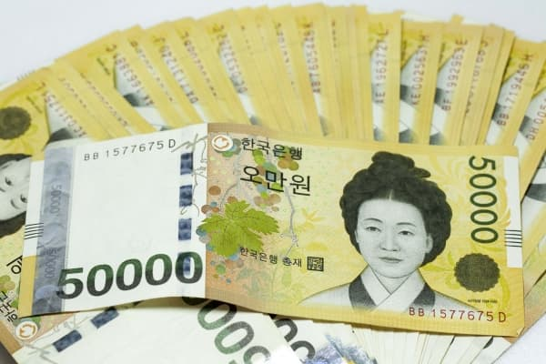
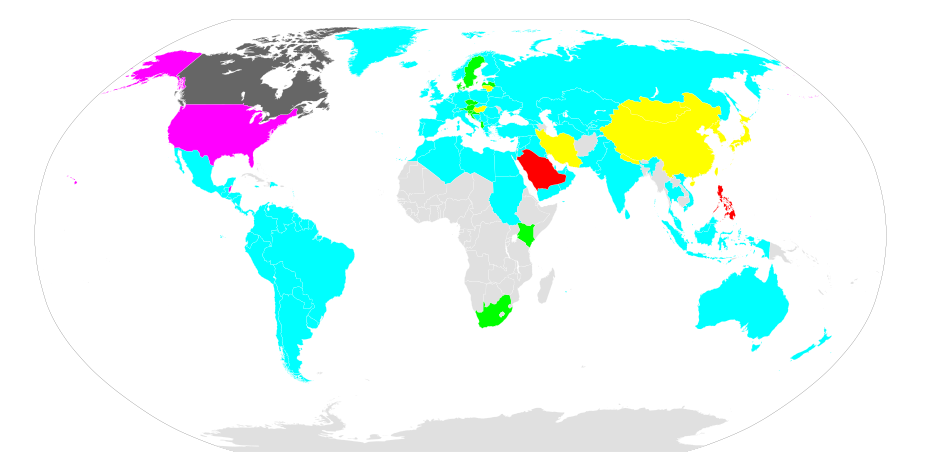

## GMT(Greenwich Mean Time) vs. UTC(Coordinated Universal Time)
세계 표준 시간 관련해서 위 두 키워드가 자주 나오길래 [구글](https://www.google.co.kr/search?newwindow=1&hl=en-KR&rlz=1C5CHFA_enKR721KR721&ei=zc2pW-WIHYq88QXQmKzABQ&q=gmt+vs+utc&oq=gmt+vs+utc&gs_l=psy-ab.3..0i67k1j0i20i263k1j0l3.1063480.1067397.0.1067832.22.18.2.0.0.0.289.2326.0j9j4.14.0....0...1.1j4.64.psy-ab..6.16.2500.6..0i131k1j0i10k1j35i39k1j0i203k1.171.hKhy4qSkjm4)에서 검색해보았다.  

> There is no time difference between Greenwich Mean Time and Coordinated Universal Time.  
6:13 AM Tuesday, Greenwich Mean Time (GMT) is 6:13 AM Tuesday, Coordinated Universal Time (UTC)  

둘의 차이점이 없다고 한다.  
그래서 다른 사이트를 뒤져보았다.

> GMT is a time zone and UTC is a time standard.  
Although GMT and UTC share the same current time in practice.  
https://www.timeanddate.com/time/gmt-utc-time.html

Time Zone과 Time Standard인 게 차이라는데...  
둘의 차이는 무엇일까... 찾아보았다.  

### Time Zone
세계에는 다양한 Time Zone이 존재한다.  
우선 우리나라에서 사용하는 KST(Korea Standard Timezone), 하와이에서 사용하는 HST(Hawaii Standard Time), UK 등등에서 사용하는 [GMT](#GMT-Greenwich-Mean-Time) 등등이 있다.

#### GMT(Greenwich Mean Time)
> GMT is a time zone officially used in some European and African countries.  
The time can be displayed using both the 24-hour format (0 - 24) or the 12-hour format (1 - 12 am/pm).
https://www.timeanddate.com/time/gmt-utc-time.html  

뭐, 유럽과 아프리카 쪽에서 주로 사용되는 **타임존**이란다.  
의문점은 왜 0 ~ 23이 아니라 0 ~ 24라고 표기했을까...  
0 ~ 23이라고 표기하는 국가도 있고, 1 ~ 24라고 표기하는 국가도 있어서 그런 걸까...?  
뭐, 짜치는 문제이므로 건너 뛰자.

[Greenwich](https://en.wikipedia.org/wiki/Greenwich)는 영국에 위치한 도시이고, 경도(longitude)가 0도인 곳이다.  
다른 경도가 0인 도시도 많을텐데 아마 이런 표준을 제정할 때 영국이 강대국이었을 것이고, 지리 및 정치 기타 등등의 요소로 인해 Greenwich가 선정된 게 아닐까 싶다.  

> GMT is based on the Earth's motion, mainly its daily rotation.  
  The day is the "mean (average) solar day" of 86,400 (mean solar) seconds. 
  That's simply 24 hours of 60 minutes, each with 60 seconds.    
  https://www.quora.com/What-is-difference-between-GMT-and-UTC

GMT는(아마 다른 타임존들도 동일할 것이다.) 지구의 자전(daily rotation)을 기반으로 한다.  
따라서 하루(The day)는 지구의 자전을 의미하고, 지구의 자전 주기를 86,400으로 나눈 단위를 **초(Second)**라고 부른다.  
즉, 천재지변의 사유로 지구의 자전 주기가 조금 느려졌다 하더라도 하루는 86,400**초**로 동일하다.  
**초**의 단위가 절대적이지 않음을 의미한다. 

### Time Standard
세계 어디서나 사용할 수 있는 시간의 표준을 의미한다.    
그 대표는 어디를 기준으로 해야할까?  
시간은 경도(longitude)에 따라 달라지지, 위도(longitude)에 따라 달라지지 않는다.  
따라서 경도가 0°인 곳을 기준으로 하다보니 GMT가 Time Standard로 선정됐**었**다.  
과거형이니 현재는 GMT가 Time Standard가 아님을 의미한다.  
현재는 UTC가 Time Standard라는 뜻이다.  
왜 GMT는 Time Standard에서 탈락하게 된 것일까...?  

#### UT(Universal Time)
> Universal Time (UT) was created at the International Meridian Conference in 1884.
  This is the basis for the 24-hour time zone system we know today.
  At the time, Greenwich Mean Time (GMT) was chosen as the world’s time standard.
  https://www.timeanddate.com/time/aboututc.html 

1884년에 UT(24시간 시스템의 기본)가 만들어졌다.  
이 때 선정된 표준 시간(Time Standard)이 [GMT](#GMT-Greenwich-Mean-Time)이다.  

#### GMT에서 UTC로...
> In 1960, the International Radio Consultative Committee formalized the concept of UTC, and it was put into practice the year after.
The name Coordinated Universal Time was officially adopted in 1967.
UTC was adjusted several times until 1972.  
https://www.timeanddate.com/time/aboututc.html

UTC는 1972년까지 여러 번 제정되었다.

> Until 1972, Greenwich Mean Time (also known as Zulu time) was the same as Universal Time (UT).
Since then, GMT is no longer a time standard. 
Today, Greenwich Mean Time (GMT) is only the name of a time zone.
https://www.timeanddate.com/time/aboututc.html

동시에 1972년부터 GMT는 Time Standard의 자리를 박탈당하고 일개 Time Zone에 불과하게 되었다.

### UTC(Coordinated Universal Time)  
> UTC is not a time zone, but a time standard that is the basis for civil time and time zones worldwide.  
This means that no country or territory officially uses UTC as a local time.  
https://www.timeanddate.com/time/gmt-utc-time.html    

GMT와는 달리 세계에서 공통적으로 쓰이는 **시간 표준(time standard)**이란다.  
KST, GMT와 같이 현지 시간을 반영한 Time Zone과 달리 UTC는 현지 시간(local time)이 반영되지 않은, 즉 Time Zone에 얽매이지 않는 게 특징이다.  
그래서 세계 표준 시간을 언급할 때 UTC가 많이 언급되는 것 같다.

> UTC is almost the same as GMT, but it's based on the scientific definition of a second (the SI second), which does not depend on the time it takes the Earth to rotate.
  The day length, based on UTC, is also 86,400 seconds, but they are SI seconds.
  The "mean solar day" is about 86,400.002 "SI seconds".
  That difference is very slowly increasing as the rotation period of Earth very slowly increases.
  https://www.quora.com/What-is-difference-between-GMT-and-UTC

UTC는 지구의 자전(the Earth to rotate)에 기반하지 않고, [SI 기준](https://en.wikipedia.org/wiki/International_System_of_Units)의 초(이하 SI Second)에 기반하고 있다.  
즉 UTC에서는 하루(The day length)는 SI Second로 86,400초이다.  
절대적인 기준으로 하루를 세기 때문에 GMT(지구의 자전을 기반으로 하는)와는 미세한 차이가 존재한다.  
이를 보정하기 위해 UTC에서는 [윤초(Leap Second)](https://ko.wikipedia.org/wiki/%EC%9C%A4%EC%B4%88)라는 개념을 도입했다.

UTC를 위에 Coordinated Universal Time라고 적어놨는데 왜 UTC라고 줄여서 부르는 걸까...?  
원래 UTC는 표준 명칭이 CUT(Coordinated Universal Time in English), TUC(Temps Universel Coordonné in French)로 두 개였다.  
혼란을 줄이기 위해 표준을 정해야하는데 한 쪽의 손을 들어주면 정치적 싸움판이 될테므로 아마 둘 다 택하지 않고 쌩뚱맞은 UTC로 간 게 아닐까... 싶다.  
하지만 왜 Universal Coordinated Time이 아닌 Coordinated Universal Time이라고 부르는지는 잘 모르겠다...  
영어가 불어보다는 글로벌하기 때문에 풀네임은 영어권의 손을 들어준 것일까...?

### Zulu Time
> Zulu (short for "Zulu time") is used in the military and in navigation generally as a term for Universal Coordinated Time (UCT), sometimes called Universal Time Coordinated ( UTC ) or Coordinated Universal Time (but abbreviated UTC), and formerly called Greenwich Mean Time.
  https://whatis.techtarget.com/definition/Zulu-Zulu-time
  
짧게는 Zulu라고 부르고, 군사적이나 배, 비행기 항법 등등에서 주로 사용한다.  

> Zulu Time Zone (Z) has no offset from Coordinated Universal Time (UTC).
  Zulu Time Zone is often used in aviation and the military as another name for UTC +0.
  https://www.timeanddate.com/time/zones/z

UTC +0(GMT가 아니다)의 또다른 이름으로 이해하면 될 것 같다.

## 그래서 우리나라는...?
우리나라는 **KST(Korea Standard Time)**를 사용하고 있다.  
KST는 UTC에 9시간을 더한 시간으로 **UTC +9** 와 같이 표기하고 있다.  
그리고 UTC +9을 사용하는 나라가 더 있는데 대표적으로 일본이 있다.  
하지만 KST는 우리나라에서나 사용하지, 일본에서는 **JST(Japan Standard Time)**를 사용하고 있다.  
따라서 [일본과 우리나라는 세계 시간이 동일](https://www.zeitverschiebung.net/en/difference/country/kr/city/1850147)하다.    

또한 영토가 좌우로 쭉 뻗은 미국 같은 경우에는 여러 타임존(HST(Hawaii Standard Time), PDT(Pacific Daylight Time) 등등)을 사용하고 있다.

이러한 사유로 AWS RDS의 기본 타임존은 UTC이고, 우리는 현재 시간을 저장(now())했다고 판단했는데 DB에 저장된 시간을 보면 9시간 이전의 시간이 저장된 사례를 볼 수 있다.  
이게 바로 우리나라가 UTC +9인 KST를 사용하고 있기 때문이다.  

## [ISO-8601 - Date and time format](https://en.wikipedia.org/wiki/ISO_8601)
[ISO(International Organization for Standardization)](https://en.wikipedia.org/wiki/International_Organization_for_Standardization)는 세계에서 인정하는 표준을 정의하는 기관이다.  
이 기관에서 시간과 날짜에 관한 표준을 지정하였는데 이게 이 기관에서 정한 8601번 째 표준이라는 의미이다.  
자바를 비롯해서 많은 프로그래밍 언어에서 날짜와 시간을 표기할 때 위 표준을 준수하고 있다.  

사진에서 보다싶이 동아시아권(한국, 일본, 중국 등등)에서는 연-월-일의 순서로 표기한다.  
하지만 다른 많은 나라에서는 일-월-연, 월-일-연 등등 아주 다양하게 쓰고 있다.  
우리나라에서는 1970년 01월 02일을 표기할 때 1970-01-02이지만, 미국에서는 02-01-1970이 된다.  
이런 혼란을 줄이고자 ISO 8601이 나오게 된 것이다.  

기본적인 규칙은 다음과 같다.  
* 큰 단위부터 작은 단위로(연 월 일 시 분 초) 표기한다.  
* 0 ~ 9의 숫자는 00 ~ 09와 같이 표기한다.  
* 날짜는 **-**을 구분자(delimiter)로 사용하고, 시간은 **:**을 구분자(delimiter)로 사용한다.  
* Time Zone(KST, GMC 등등) 대신에 UTC를 기준으로 시간대를 ±기호를 사용해서 표기한다.

포스팅 날짜 및 시간인 2018년 9월 26일 00시 10분 13초 KST를 ISO 8601 표기법으로 나타내면 다음과 같다.
2018-09-26T00:10:13+09:00
2018-09-25T15:10:13+00:00  
2018-09-25T15:10:13Z
여기서 T는 날짜와 시간의 구분자(delimiter)이고, Z는 [Zulu Time](#Zulu-Time)을 의미한다.  

꼭 날짜와 시간을 함께 표시할 필요는 없고 날짜만 표기해도 ISO 8601 표준을 준수했다고 볼 수 있다.
