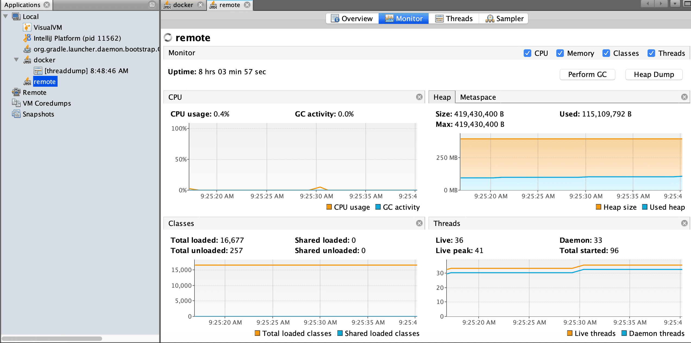

웹 개발을 배울 때 항상 나만의 도메인을 가지고 싶었다.  
github.io 라는 간지나는 도메인을 가지고 있긴 했지만, 지킬 내장이라 hexo를 쓰는 나로선 조금의 불편함이 존재했다.  
따라서 io 도메인을 사려고 했지만 [6만원이 넘어갔다...](https://kr.godaddy.com/tlds/io-domain)  
그래서 값은 싸지만 나름 구리지 않은 닷컴 도메인을 사기로 마음 먹고 가장 저렴한 곳을 찾았다.  

## [GoDaddy](https://godaddy.com)
우선 기본적으로 [회원가입](https://sso.godaddy.com/account/create?realm=idp&path=%2F&app=mya)을 진행해야 한다.  
나는 귀찮아서 소셜 로그인(페북)을 이용했다.  
그 이후에 [메인 페이지](https://godaddy.com)로 가서 도메인을 검색하자.  
똑같은 도메인이라 하더라도 사람들이 많이 찾는 단어일 수록 가격이 높으니 적당한 단어(자신을 알릴 수 있는?)를 선택하자.  

  
메인 페이지에서 도메인을 검색했다면 이런 페이지가 나온다.  
닷컴 도메인이 현재 가장 싸고 그나마 덜 구리므로 유니크한 닷컴 도메인이 나올 때까지 검색을 하고 카트에 추가를 클릭하고 카트로 이동하자.  
그리고 나서 뭔 필요없는 옵션들을 막 선택하라고 하는데 다 필요없다고 하자, 다 돈 든다.  

  
그리고 최소 구매 단위인 1년을 선택하면 아마 12,800원이 찍힐 것이다.  
1331원에 구매했다면서 어그로 끌었다고 생각할 수도 있는데 프로모션 코드에 `cjcgroupc`를 넣자.  
만약 유효하지 않다고 나오면 [GoDaddy 쿠폰 모음](https://www.groupon.com/coupons/stores/godaddy.com)에서 쿠폰을 새로 받으면 된다.  

  
가격이 1299원까지 떨어졌고 마스터/비자 등등 해외 사이트 결제가 가능한 카드로 진행하면 된다.  

아마 또 별도의 수수료가 있거나 해서 1331원까지 올라간 것 같다.  

여기서 끝난 건 아니다. 도메인 관리 등등의 페이지로 가면 아래와 같이 이메일 인증해야 도메인을 관리할 수 있다고 한다.  
  
그런데 이 버튼 눌러도 오는 이메일이라곤 결제 내역이나 지들 서비스 홍보하는 메일 뿐이다.  
이거 때문에 한시간 가까이 뻘짓을 했지만 **이메일 전송을 누르고 1시간 정도 기다리면 된다.**  
나도 이걸 몰라서 주말에 혼자서 돈날렸나 안절부절 했지만 1시간 후에 이메일 폭탄을 받았다.  

  
이메일을 큐에다 쌓아 놓고 일괄 발송 처리하는 것 같은데 그 주기가 1시간 정도 걸리나보다.  
그리고 1년 단위로 도메인 자동 갱신(결제)이 걸려 있는데 이걸 풀어야 다음 번에도 싼 값에 갱신이 가능한 것 같다.  

여기까지 마쳐야 도메인 관리가 가능해진다!