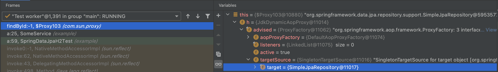

## 3줄 요약
1. OSIV가 꺼져있으면 트랜잭션이 시작될 때 엔티티 매니저가 생성되고, 트랜잭션이 끝날 때 엔티티 매니저를 종료한다.
1. OSIV가 꺼져있고, 다른 트랜잭션이라면 엔티티 매니저가 공유되지 않기 때문에 엔티티 매니저의 1차 캐시도 서로 공유되지 않는다.
1. OSIV가 켜져있으면 요청 당 엔티티 매니저는 한 번 생성되고, 뷰 렌더링이 끝날 때까지 엔티티 매니저는 종료되지 않고 트랜잭션이 다르더라도 1차 캐시가 공유된다. 

## 들어가기에 앞서
엔티티 매니저 팩토리는 생성 비용이 비싸서 대부분 어플리케이션 당 하나를 생성하는 편이고, 엔티티 매니저는 생성 비용이 비싸지 않아서 어플리케이션에서 여러 번 생성된다.  
하지만 엔티티 매니저는 쓰레드 세이프 하지 않기 때문에, 쓰레드 당 하나를 생성해야할 것 같고 Spring MVC는 리퀘스트 당 하나의 쓰레드가 할당되기 때문에 리퀘스트 당 하나의 엔티티 매니저가 생성될 것만 같은 기분이 든다.  
나 또한 그렇게 알고 있었는데 아래 코드를 통해 뭔가 의문이 생겼다.

```kotlin
interface SomeRepository : JpaRepository<SomeEntity, Long>

@Service
class SomeService(
    private val repository: SomeRepository
) {
    fun some() {
        val someEntity = repository.findById(1L)
        val someEntity2 = repository.findById(1L)
    }
}
```

위 코드를 보면 select 쿼리는 몇 번 날아갈 것 같은가??  
첫 라인에서는 엔티티 매니저의 1차 캐시에 아무것도 없어서 쿼리가 날아갈 것 같고, 두 번째 라인에서는 엔티티 매니저의 1차 캐시에 id가 1인 SomeEntity가 있을 것 같으니 쿼리가 안 날아갈 것 같지 않은가?  
답은 `spring.jpa.open-in-view: false`로 OSIV 설정이 꺼져있으면 두 번 날아가고, OSIV 설정을 따로 건드리지 않았다면 기본적으로 켜져있을테니 한 번만 날아가게 된다.

먼저 알아둬야할 사항은 JpaRepository 인터페이스의 기본 구현체인 [SimpleJpaRepository](https://github.com/spring-projects/spring-data-jpa/blob/main/src/main/java/org/springframework/data/jpa/repository/support/SimpleJpaRepository.java#L83)에 대해 알아야한다.    
우리가 만든 인터페이스 SomeRepository도 결국 실행될 때는 객체화 돼야하는데 이 때 JpaRepository 구현체인 SimpleJpaRepository를 상속받아서 구현되기 때문이다.  
  
```java
@Repository
@Transactional(readOnly = true)
public class SimpleJpaRepository<T, ID> implements JpaRepositoryImplementation<T, ID> {
    // ...
    @Override
    public Optional<T> findById(ID id) {

        Assert.notNull(id, ID_MUST_NOT_BE_NULL);

        Class<T> domainType = getDomainClass();

        if (metadata == null) {
            return Optional.ofNullable(em.find(domainType, id));
        }

        LockModeType type = metadata.getLockModeType();

        Map<String, Object> hints = getQueryHints().withFetchGraphs(em).asMap();

        return Optional.ofNullable(type == null ? em.find(domainType, id, hints) : em.find(domainType, id, type, hints));
    }
    // ...
}
```
우리가 만든 repository의 findById 메서드를 호출하면 기본적으로 SimpleJpaRepository의 findById 메서드를 호출하게 되고, readOnly `트랜잭션 안에서 실행`된다고 보면 된다.

## OSIV가 꺼졌을 때
### 엔티티 매니저 생성
1. [TransactionInterceptor의 invoke 메서드](https://github.com/spring-projects/spring-framework/blob/main/spring-tx/src/main/java/org/springframework/transaction/interceptor/TransactionInterceptor.java#L119)에서 부모 클래스인 [TransactionAspectSupport의 invokeWithinTransaction 메서드](https://github.com/spring-projects/spring-framework/blob/main/spring-tx/src/main/java/org/springframework/transaction/interceptor/TransactionAspectSupport.java#L336)를 호출한다.
1. [TransactionAspectSupport의 invokeWithinTransaction 메서드](https://github.com/spring-projects/spring-framework/blob/main/spring-tx/src/main/java/org/springframework/transaction/interceptor/TransactionAspectSupport.java#L382)에서 [createTransactionIfNecessary 메서드](https://github.com/spring-projects/spring-framework/blob/main/spring-tx/src/main/java/org/springframework/transaction/interceptor/TransactionAspectSupport.java#L579)를 호출한다.
1. [createTransactionIfNecessary 메서드](https://github.com/spring-projects/spring-framework/blob/main/spring-tx/src/main/java/org/springframework/transaction/interceptor/TransactionAspectSupport.java#L595)에서 [AbstractPlatformTransactionManager의 getTransaction 메서드](https://github.com/spring-projects/spring-framework/blob/main/spring-tx/src/main/java/org/springframework/transaction/support/AbstractPlatformTransactionManager.java#L341)를 호출한다.
1. [AbstractPlatformTransactionManager의 getTransaction 메서드](https://github.com/spring-projects/spring-framework/blob/main/spring-tx/src/main/java/org/springframework/transaction/support/AbstractPlatformTransactionManager.java#L347)에서 [JpaTransactionManager의 doGetTransaction 메서드](https://github.com/spring-projects/spring-framework/blob/main/spring-orm/src/main/java/org/springframework/orm/jpa/JpaTransactionManager.java#L367)를 호출한다.

```java
@Override
protected Object doGetTransaction() {
    JpaTransactionObject txObject = new JpaTransactionObject();
    txObject.setSavepointAllowed(isNestedTransactionAllowed());

    EntityManagerHolder emHolder = (EntityManagerHolder)
            TransactionSynchronizationManager.getResource(obtainEntityManagerFactory());
    // ...
}
```
1. 엔티티 매니저 팩토리를 가져온 후에 [TransactionSynchronizationManager의 getResource 메서드](https://github.com/spring-projects/spring-framework/blob/main/spring-tx/src/main/java/org/springframework/transaction/support/TransactionSynchronizationManager.java#L138)를 호출하고 있다.  
1. [TransactionSynchronizationManager의 getResource 메서드](https://github.com/spring-projects/spring-framework/blob/main/spring-tx/src/main/java/org/springframework/transaction/support/TransactionSynchronizationManager.java#L140)에서 [doGetResource 메서드](https://github.com/spring-projects/spring-framework/blob/main/spring-tx/src/main/java/org/springframework/transaction/support/TransactionSynchronizationManager.java#L140)를 호출하고 있다.

```java
@Nullable
private static Object doGetResource(Object actualKey) {
    Map<Object, Object> map = resources.get();
    if (map == null) {
        return null;
    }
    Object value = map.get(actualKey);
    // Transparently remove ResourceHolder that was marked as void...
    if (value instanceof ResourceHolder && ((ResourceHolder) value).isVoid()) {
        map.remove(actualKey);
        // Remove entire ThreadLocal if empty...
        if (map.isEmpty()) {
            resources.remove();
        }
        value = null;
    }
    return value;
}
```
actualKey는 엔티티 매니저 팩토리이고, resources는 ThreadLocal Map 객체란 걸 알 수 있다.  
```java
public abstract class TransactionSynchronizationManager {
    // ...
    private static final ThreadLocal<Map<Object, Object>> resources =
            new NamedThreadLocal<>("Transactional resources");
    // ...
```
하지만 해당 쓰레드에서는 한 번도 엔티티 매니저 팩토리를 키로 맵에 값을 넣은 적이 없기 때문에 null을 반환하게 된다.

다시 [JpaTransactionManager의 doGetTransaction 메서드](https://github.com/spring-projects/spring-framework/blob/main/spring-orm/src/main/java/org/springframework/orm/jpa/JpaTransactionManager.java#L367)로 돌아와보자.
```java
@Override
protected Object doGetTransaction() {
    JpaTransactionObject txObject = new JpaTransactionObject();
    txObject.setSavepointAllowed(isNestedTransactionAllowed());

    EntityManagerHolder emHolder = (EntityManagerHolder)
            TransactionSynchronizationManager.getResource(obtainEntityManagerFactory());
    if (emHolder != null) {
        if (logger.isDebugEnabled()) {
            logger.debug("Found thread-bound EntityManager [" + emHolder.getEntityManager() +
                    "] for JPA transaction");
        }
        txObject.setEntityManagerHolder(emHolder, false);
    }

    // ...

    return txObject;
}
```
TransactionSynchronizationManager.getResource(obtainEntityManagerFactory())가 null을 반환하기 때문에 txObject는 entityManagerHolder를 초기화하지 못한다.

```java
public final TransactionStatus getTransaction(@Nullable TransactionDefinition definition)
        throws TransactionException {
    // ...
    if (isExistingTransaction(transaction)) {
        // Existing transaction found -> check propagation behavior to find out how to behave.
        return handleExistingTransaction(def, transaction, debugEnabled);
    }
    // ...
}
```
1. 다시 [AbstractPlatformTransactionManager의 getTransaction 메서드](https://github.com/spring-projects/spring-framework/blob/main/spring-tx/src/main/java/org/springframework/transaction/support/AbstractPlatformTransactionManager.java#L350)로 돌아오면 [JpaTransactionManager의 isExistingTransaction 메서드](https://github.com/spring-projects/spring-framework/blob/main/spring-orm/src/main/java/org/springframework/orm/jpa/JpaTransactionManager.java#L391)를 호출한다.
1. [JpaTransactionManager의 isExistingTransaction 메서드](https://github.com/spring-projects/spring-framework/blob/main/spring-orm/src/main/java/org/springframework/orm/jpa/JpaTransactionManager.java#L392)에서 [JpaTransactionObject의 hasTransaction 매서드](https://github.com/spring-projects/spring-framework/blob/main/spring-orm/src/main/java/org/springframework/orm/jpa/JpaTransactionManager.java#L692)를 호출한다.
```java
public boolean hasTransaction() {
    return (this.entityManagerHolder != null && this.entityManagerHolder.isTransactionActive());
}
```
entityManagerHolder는 null이기 때문에 hasTransaction은 false이고 isExistingTransaction 메서드도 false이다.

다시 [AbstractPlatformTransactionManager의 getTransaction 메서드](https://github.com/spring-projects/spring-framework/blob/main/spring-tx/src/main/java/org/springframework/transaction/support/AbstractPlatformTransactionManager.java#L361)로 돌아와보자.
```java
@Override
public final TransactionStatus getTransaction(@Nullable TransactionDefinition definition)
        throws TransactionException {
    // ...
    // No existing transaction found -> check propagation behavior to find out how to proceed.
    if (def.getPropagationBehavior() == TransactionDefinition.PROPAGATION_MANDATORY) {
        throw new IllegalTransactionStateException(
                "No existing transaction found for transaction marked with propagation 'mandatory'");
    }
    else if (def.getPropagationBehavior() == TransactionDefinition.PROPAGATION_REQUIRED || 
            def.getPropagationBehavior() == TransactionDefinition.PROPAGATION_REQUIRES_NEW ||
            def.getPropagationBehavior() == TransactionDefinition.PROPAGATION_NESTED) {
        SuspendedResourcesHolder suspendedResources = suspend(null);
        if (debugEnabled) {
            logger.debug("Creating new transaction with name [" + def.getName() + "]: " + def);
        }
        try {
            return startTransaction(def, transaction, debugEnabled, suspendedResources);
        }
        catch (RuntimeException | Error ex) {
            resume(null, suspendedResources);
            throw ex;
        }
    }
}
```

@Transactional의 기본 propagation 설정은 PROPAGATION_REQUIRED이기 때문에 [startTransaction 메서드](https://github.com/spring-projects/spring-framework/blob/main/spring-tx/src/main/java/org/springframework/transaction/support/AbstractPlatformTransactionManager.java#L394)를 호출한다.
```java
private TransactionStatus startTransaction(TransactionDefinition definition, Object transaction,
        boolean debugEnabled, @Nullable SuspendedResourcesHolder suspendedResources) {

    boolean newSynchronization = (getTransactionSynchronization() != SYNCHRONIZATION_NEVER);
    DefaultTransactionStatus status = newTransactionStatus(
            definition, transaction, true, newSynchronization, debugEnabled, suspendedResources);
    doBegin(transaction, definition);
    prepareSynchronization(status, definition);
    return status;
}

protected DefaultTransactionStatus newTransactionStatus(
        TransactionDefinition definition, @Nullable Object transaction, boolean newTransaction,
        boolean newSynchronization, boolean debug, @Nullable Object suspendedResources) {

    boolean actualNewSynchronization = newSynchronization &&
            !TransactionSynchronizationManager.isSynchronizationActive();
    return new DefaultTransactionStatus(
            transaction, newTransaction, actualNewSynchronization,
            definition.isReadOnly(), debug, suspendedResources);
}
```
새롭게 트랜잭션을 시작하는 것이기 때문에 TransactionStatus를 만들 때 newTransaction을 true로 만든다.
그리고나서 [JpaTransactionManager의 doBegin 메서드](https://github.com/spring-projects/spring-framework/blob/main/spring-orm/src/main/java/org/springframework/orm/jpa/JpaTransactionManager.java#L396)를 호출한다.  
```java
protected void doBegin(Object transaction, TransactionDefinition definition) {
    JpaTransactionObject txObject = (JpaTransactionObject) transaction;

    // ...

    try {
        if (!txObject.hasEntityManagerHolder() ||
                txObject.getEntityManagerHolder().isSynchronizedWithTransaction()) {
            EntityManager newEm = createEntityManagerForTransaction();
            if (logger.isDebugEnabled()) {
                logger.debug("Opened new EntityManager [" + newEm + "] for JPA transaction");
            }
            txObject.setEntityManagerHolder(new EntityManagerHolder(newEm), true);
        }
        // ...
        // Bind the entity manager holder to the thread.
        if (txObject.isNewEntityManagerHolder()) {
            TransactionSynchronizationManager.bindResource(
                    obtainEntityManagerFactory(), txObject.getEntityManagerHolder());
        }
        // ...
    }
    // ...
}
```

위에서 봤다싶이 EntityManagerHolder를 초기화하지 못했기 때문에 위 if문을 타고 [createEntityManagerForTransaction 메서드](https://github.com/spring-projects/spring-framework/blob/main/spring-orm/src/main/java/org/springframework/orm/jpa/JpaTransactionManager.java#L480)를 호출하여 엔티티 매니저를 생성하고 [JpaTransactionObject의 setEntityManagerHolder 메서드](https://github.com/spring-projects/spring-framework/blob/main/spring-orm/src/main/java/org/springframework/orm/jpa/JpaTransactionManager.java#L672)를 호출하고 있다.
```java
public void setEntityManagerHolder(
        @Nullable EntityManagerHolder entityManagerHolder, boolean newEntityManagerHolder) {

    this.entityManagerHolder = entityManagerHolder;
    this.newEntityManagerHolder = newEntityManagerHolder;
}
```
엔티티 매니저 홀더를 초기화하는 것과 더불어 `새로운 엔티티 매니저 홀더라고 마킹`까지 하고 있다.
그리고 새로운 엔티티 매니저 홀더라고 마킹했기 때문에 txObject.isNewEntityManagerHolder()는 true이고, [TransactionSynchronizationManager의 bindResource 메서드](https://github.com/spring-projects/spring-framework/blob/main/spring-tx/src/main/java/org/springframework/transaction/support/TransactionSynchronizationManager.java#L177)를 호출하고 있다.  
```java
/**
 * Bind the given resource for the given key to the current thread.
 * @param key the key to bind the value to (usually the resource factory)
 * @param value the value to bind (usually the active resource object)
 * @throws IllegalStateException if there is already a value bound to the thread
 * @see ResourceTransactionManager#getResourceFactory()
 */
public static void bindResource(Object key, Object value) throws IllegalStateException {
    Object actualKey = TransactionSynchronizationUtils.unwrapResourceIfNecessary(key);
    Assert.notNull(value, "Value must not be null");
    Map<Object, Object> map = resources.get();
    // set ThreadLocal Map if none found
    if (map == null) {
        map = new HashMap<>();
        resources.set(map);
    }
    Object oldValue = map.put(actualKey, value);
    // Transparently suppress a ResourceHolder that was marked as void...
    if (oldValue instanceof ResourceHolder && ((ResourceHolder) oldValue).isVoid()) {
        oldValue = null;
    }
    if (oldValue != null) {
        throw new IllegalStateException("Already value [" + oldValue + "] for key [" +
                actualKey + "] bound to thread [" + Thread.currentThread().getName() + "]");
    }
    if (logger.isTraceEnabled()) {
        logger.trace("Bound value [" + value + "] for key [" + actualKey + "] to thread [" +
                Thread.currentThread().getName() + "]");
    }
}
```
쓰레드 로컬 맵인 resources에 엔티티 매니저 팩토리를 키로, 엔티티 매니저 홀더를 값으로 넣고 있다.

이렇게 트랜잭션이 시작할 때 엔티티 매니저가 생성된다는 것을 알 수 있다.

### 엔티티 매니저 종료
다시 [TransactionAspectSupport의 invokeWithinTransaction 메서드](https://github.com/spring-projects/spring-framework/blob/main/spring-tx/src/main/java/org/springframework/transaction/interceptor/TransactionAspectSupport.java#L336)로 돌아오자.  
1. [TransactionAspectSupport의 invokeWithinTransaction 메서드](https://github.com/spring-projects/spring-framework/blob/main/spring-tx/src/main/java/org/springframework/transaction/interceptor/TransactionAspectSupport.java#L407)에서 [commitTransactionAfterReturning 메서드](https://github.com/spring-projects/spring-framework/blob/main/spring-tx/src/main/java/org/springframework/transaction/interceptor/TransactionAspectSupport.java#L649)를 호출하고 있다.
1. [commitTransactionAfterReturning 메서드](https://github.com/spring-projects/spring-framework/blob/main/spring-tx/src/main/java/org/springframework/transaction/interceptor/TransactionAspectSupport.java#L654)에서 [AbstractPlatformTransactionManager의 commit 메서드](https://github.com/spring-projects/spring-framework/blob/main/spring-tx/src/main/java/org/springframework/transaction/support/AbstractPlatformTransactionManager.java#L688)를 호출하고 있다.
1. [AbstractPlatformTransactionManager의 commit 메서드](https://github.com/spring-projects/spring-framework/blob/main/spring-tx/src/main/java/org/springframework/transaction/support/AbstractPlatformTransactionManager.java#L711)에서 [processCommit 메서드](https://github.com/spring-projects/spring-framework/blob/main/spring-tx/src/main/java/org/springframework/transaction/support/AbstractPlatformTransactionManager.java#L720)를 호출하고 있다.
1. [processCommit 메서드](https://github.com/spring-projects/spring-framework/blob/main/spring-tx/src/main/java/org/springframework/transaction/support/AbstractPlatformTransactionManager.java#L790)에서 [cleanupAfterCompletion 메서드](https://github.com/spring-projects/spring-framework/blob/main/spring-tx/src/main/java/org/springframework/transaction/support/AbstractPlatformTransactionManager.java#L998)를 호출하고 있다.
```java
private void cleanupAfterCompletion(DefaultTransactionStatus status) {
    status.setCompleted();
    if (status.isNewSynchronization()) {
        TransactionSynchronizationManager.clear();
    }
    if (status.isNewTransaction()) {
        doCleanupAfterCompletion(status.getTransaction());
    }
    // ...
}
```
새롭게 만든 트랜잭션이기 때문에 status.isNewTransaction()은 true이고, [JpaTransactionManager의 doCleanupAfterCompletion 메서드](https://github.com/spring-projects/spring-framework/blob/main/spring-orm/src/main/java/org/springframework/orm/jpa/JpaTransactionManager.java#L615)를 호출한다.

```java
protected void doCleanupAfterCompletion(Object transaction) {
    JpaTransactionObject txObject = (JpaTransactionObject) transaction;

    // Remove the entity manager holder from the thread, if still there.
    // (Could have been removed by EntityManagerFactoryUtils in order
    // to replace it with an unsynchronized EntityManager).
    if (txObject.isNewEntityManagerHolder()) {
        TransactionSynchronizationManager.unbindResourceIfPossible(obtainEntityManagerFactory());
    }
    // ...
}
```
엔티티 매니저 홀더를 설정할 때도 새 엔티티 매니저 홀더라고 마킹했기 때문에 txObject.isNewEntityManagerHolder()는 true라서 [TransactionSynchronizationManager의 unbindResourceIfPossible 메서드](https://github.com/spring-projects/spring-framework/blob/main/spring-tx/src/main/java/org/springframework/transaction/support/TransactionSynchronizationManager.java#L224)를 호출한다.  
그 다음에 [doUnbindResource 메서드](https://github.com/spring-projects/spring-framework/blob/main/spring-tx/src/main/java/org/springframework/transaction/support/TransactionSynchronizationManager.java#L233)를 호출하고 있다.  
```java
private static Object doUnbindResource(Object actualKey) {
    Map<Object, Object> map = resources.get();
    if (map == null) {
        return null;
    }
    Object value = map.remove(actualKey);
    // Remove entire ThreadLocal if empty...
    if (map.isEmpty()) {
        resources.remove();
    }
    // Transparently suppress a ResourceHolder that was marked as void...
    if (value instanceof ResourceHolder && ((ResourceHolder) value).isVoid()) {
        value = null;
    }
    if (value != null && logger.isTraceEnabled()) {
        logger.trace("Removed value [" + value + "] for key [" + actualKey + "] from thread [" +
                Thread.currentThread().getName() + "]");
    }
    return value;
}
```
resources는 쓰레드 로컬 맵이고, 이전에 엔티티 매니저 팩토리를 키로, 엔티티 매니저 홀더를 값으로 넣었기 때문에 해당 키는 삭제된다.

그리고 다시 [JpaTransactionManager의 doCleanupAfterCompletion 메서드](https://github.com/spring-projects/spring-framework/blob/main/spring-orm/src/main/java/org/springframework/orm/jpa/JpaTransactionManager.java#L645)를 마저 보자.
```java
protected void doCleanupAfterCompletion(Object transaction) {
    JpaTransactionObject txObject = (JpaTransactionObject) transaction;
    // ...
    // Remove the entity manager holder from the thread.
    if (txObject.isNewEntityManagerHolder()) {
        EntityManager em = txObject.getEntityManagerHolder().getEntityManager();
        if (logger.isDebugEnabled()) {
            logger.debug("Closing JPA EntityManager [" + em + "] after transaction");
        }
        EntityManagerFactoryUtils.closeEntityManager(em);
    }
    else {
        logger.debug("Not closing pre-bound JPA EntityManager after transaction");
    }
}
```
JpaTransactionObject을 만들 때 새로운 엔티티 매니저 홀더라고 마킹했기 때문에 txObject.isNewEntityManagerHolder()는 true이고, [EntityManagerFactoryUtils의 closeEntityManager 메서드](https://github.com/spring-projects/spring-framework/blob/main/spring-orm/src/main/java/org/springframework/orm/jpa/EntityManagerFactoryUtils.java#L423)를 호출한다.
```java
/**
 * Close the given JPA EntityManager,
 * catching and logging any cleanup exceptions thrown.
 * @param em the JPA EntityManager to close (may be {@code null})
 * @see javax.persistence.EntityManager#close()
 */
public static void closeEntityManager(@Nullable EntityManager em) {
    if (em != null) {
        try {
            if (em.isOpen()) {
                em.close();
            }
        }
        catch (Throwable ex) {
            logger.error("Failed to release JPA EntityManager", ex);
        }
    }
}
```

이렇게 트랜잭션이 끝날 때 엔티티 매니저가 종료된다는 것을 알게 되었다.  

### 부모 트랜잭션을 사용한다면...?
만약 트랜잭션이 부모의 것을 사용하여 쭉 이어진다면 어떻게 될까...?

```kotlin
@Service
@Transactional
class SomeService(
    private val repository: SomeRepository
) {
    fun some() {
        val someEntity = repository.findById(1L)
        val someEntity2 = repository.findById(1L)
    }
}
```
SimpleJpaRepository의 findById(자식)가 SomeService(부모)의 트랜잭션을 사용한다면 어떻게 될까...?
먼저 SomeService 진입 시 새로운 트랜잭션이 생성(엔티티 매니저도 생성)되는 건 생략하고 그 이후 과정부터 지켜보자.  
1. [TransactionInterceptor의 invoke 메서드](https://github.com/spring-projects/spring-framework/blob/main/spring-tx/src/main/java/org/springframework/transaction/interceptor/TransactionInterceptor.java#L119)에서 부모 클래스인 [TransactionAspectSupport의 invokeWithinTransaction 메서드](https://github.com/spring-projects/spring-framework/blob/main/spring-tx/src/main/java/org/springframework/transaction/interceptor/TransactionAspectSupport.java#L336)를 호출한다.
1. [TransactionAspectSupport의 invokeWithinTransaction 메서드](https://github.com/spring-projects/spring-framework/blob/main/spring-tx/src/main/java/org/springframework/transaction/interceptor/TransactionAspectSupport.java#L382)에서 [createTransactionIfNecessary 메서드](https://github.com/spring-projects/spring-framework/blob/main/spring-tx/src/main/java/org/springframework/transaction/interceptor/TransactionAspectSupport.java#L579)를 호출한다.
1. [createTransactionIfNecessary 메서드](https://github.com/spring-projects/spring-framework/blob/main/spring-tx/src/main/java/org/springframework/transaction/interceptor/TransactionAspectSupport.java#L595)에서 [AbstractPlatformTransactionManager의 getTransaction 메서드](https://github.com/spring-projects/spring-framework/blob/main/spring-tx/src/main/java/org/springframework/transaction/support/AbstractPlatformTransactionManager.java#L341)를 호출한다.
1. [AbstractPlatformTransactionManager의 getTransaction 메서드](https://github.com/spring-projects/spring-framework/blob/main/spring-tx/src/main/java/org/springframework/transaction/support/AbstractPlatformTransactionManager.java#L347)에서 [JpaTransactionManager의 doGetTransaction 메서드](https://github.com/spring-projects/spring-framework/blob/main/spring-orm/src/main/java/org/springframework/orm/jpa/JpaTransactionManager.java#L367)를 호출한다.
```java
@Override
protected Object doGetTransaction() {
    JpaTransactionObject txObject = new JpaTransactionObject();
    txObject.setSavepointAllowed(isNestedTransactionAllowed());

    EntityManagerHolder emHolder = (EntityManagerHolder)
            TransactionSynchronizationManager.getResource(obtainEntityManagerFactory());
    if (emHolder != null) {
        if (logger.isDebugEnabled()) {
            logger.debug("Found thread-bound EntityManager [" + emHolder.getEntityManager() +
                    "] for JPA transaction");
        }
        txObject.setEntityManagerHolder(emHolder, false);
    }

    // ...

    return txObject;
}
```
이미 부모 트랜잭션에서 TransactionSynchronizationManager.bindResource 메서드를 호출했기 때문에 TransactionSynchronizationManager.getResource는 null이 아니다.  
따라서 txObject에 emHolder를 초기화할 수 있는데, 부모 트랜잭션에서 만들어둔 엔티티 매니저 홀더이기 때문에 새로운 엔티티 매니저 홀더가 아니라고 마킹한다.

```java
public final TransactionStatus getTransaction(@Nullable TransactionDefinition definition)
        throws TransactionException {

    // Use defaults if no transaction definition given.
    TransactionDefinition def = (definition != null ? definition : TransactionDefinition.withDefaults());

    Object transaction = doGetTransaction();
    boolean debugEnabled = logger.isDebugEnabled();

    if (isExistingTransaction(transaction)) {
        // Existing transaction found -> check propagation behavior to find out how to behave.
        return handleExistingTransaction(def, transaction, debugEnabled);
    }
    // ...
}
```
1. 다시 [AbstractPlatformTransactionManager의 getTransaction 메서드](https://github.com/spring-projects/spring-framework/blob/main/spring-tx/src/main/java/org/springframework/transaction/support/AbstractPlatformTransactionManager.java#L350)으로 돌아오면 [JpaTransactionManager의 isExistingTransaction 메서드](https://github.com/spring-projects/spring-framework/blob/main/spring-orm/src/main/java/org/springframework/orm/jpa/JpaTransactionManager.java#L391)를 호출한다.
1. [JpaTransactionManager의 isExistingTransaction 메서드](https://github.com/spring-projects/spring-framework/blob/main/spring-orm/src/main/java/org/springframework/orm/jpa/JpaTransactionManager.java#L392)에서 [JpaTransactionObject의 hasTransaction 매서드](https://github.com/spring-projects/spring-framework/blob/main/spring-orm/src/main/java/org/springframework/orm/jpa/JpaTransactionManager.java#L692)를 호출한다.
```java
public boolean hasTransaction() {
    return (this.entityManagerHolder != null && this.entityManagerHolder.isTransactionActive());
}
```
둘 다 true이기 때문에 hasTransaction도 true를 반환한다.
결국 isExistingTransaction(transaction)도 true이기 때문에 [handleExistingTransaction 메서드](https://github.com/spring-projects/spring-framework/blob/main/spring-tx/src/main/java/org/springframework/transaction/support/AbstractPlatformTransactionManager.java#L408)를 호출한다.
```java
private TransactionStatus handleExistingTransaction(
        TransactionDefinition definition, Object transaction, boolean debugEnabled)
        throws TransactionException {
    // ...
    return prepareTransactionStatus(definition, transaction, false, newSynchronization, debugEnabled, null);
}

protected final DefaultTransactionStatus prepareTransactionStatus(
        TransactionDefinition definition, @Nullable Object transaction, boolean newTransaction,
        boolean newSynchronization, boolean debug, @Nullable Object suspendedResources) {

    DefaultTransactionStatus status = newTransactionStatus(
            definition, transaction, newTransaction, newSynchronization, debug, suspendedResources);
    prepareSynchronization(status, definition);
    return status;
}

protected DefaultTransactionStatus newTransactionStatus(
        TransactionDefinition definition, @Nullable Object transaction, boolean newTransaction,
        boolean newSynchronization, boolean debug, @Nullable Object suspendedResources) {

    boolean actualNewSynchronization = newSynchronization &&
            !TransactionSynchronizationManager.isSynchronizationActive();
    return new DefaultTransactionStatus(
            transaction, newTransaction, actualNewSynchronization,
            definition.isReadOnly(), debug, suspendedResources);
}
```
새로운 트랜잭션이 아니라 부모 트랜잭션을 그대로 사용하는 것이기 때문에 newTransaction을 false로 마킹을 해서 TransactionStatus를 반환한다.  
결국 새로운 트랜잭션을 시작한 게 아니기 때문에 엔티티 매니저 홀더도 부모가 쓰던 걸 물려받았고, 그렇기 때문에 새롭게 엔티티 매니저를 생성하지 않았다.  
그럼 부모 트랜잭션부터 시작된 엔티티 매니저가 유지되기 때문에 엔티티 매니저의 1차 캐시도 유지된다고 볼 수 있다.

그럼 자식 트랜잭션이 종료될 때는 엔티티 매니저를 종료할까?? 
다시 [TransactionAspectSupport의 invokeWithinTransaction 메서드](https://github.com/spring-projects/spring-framework/blob/main/spring-tx/src/main/java/org/springframework/transaction/interceptor/TransactionAspectSupport.java#L336)로 돌아오자.  
1. [TransactionAspectSupport의 invokeWithinTransaction 메서드](https://github.com/spring-projects/spring-framework/blob/main/spring-tx/src/main/java/org/springframework/transaction/interceptor/TransactionAspectSupport.java#L407)에서 [commitTransactionAfterReturning 메서드](https://github.com/spring-projects/spring-framework/blob/main/spring-tx/src/main/java/org/springframework/transaction/interceptor/TransactionAspectSupport.java#L649)를 호출하고 있다.
1. [commitTransactionAfterReturning 메서드](https://github.com/spring-projects/spring-framework/blob/main/spring-tx/src/main/java/org/springframework/transaction/interceptor/TransactionAspectSupport.java#L654)에서 [AbstractPlatformTransactionManager의 commit 메서드](https://github.com/spring-projects/spring-framework/blob/main/spring-tx/src/main/java/org/springframework/transaction/support/AbstractPlatformTransactionManager.java#L688)를 호출하고 있다.
1. [AbstractPlatformTransactionManager의 commit 메서드](https://github.com/spring-projects/spring-framework/blob/main/spring-tx/src/main/java/org/springframework/transaction/support/AbstractPlatformTransactionManager.java#L711)에서 [processCommit 메서드](https://github.com/spring-projects/spring-framework/blob/main/spring-tx/src/main/java/org/springframework/transaction/support/AbstractPlatformTransactionManager.java#L720)를 호출하고 있다.
1. [processCommit 메서드](https://github.com/spring-projects/spring-framework/blob/main/spring-tx/src/main/java/org/springframework/transaction/support/AbstractPlatformTransactionManager.java#L790)에서 [cleanupAfterCompletion 메서드](https://github.com/spring-projects/spring-framework/blob/main/spring-tx/src/main/java/org/springframework/transaction/support/AbstractPlatformTransactionManager.java#L998)를 호출하고 있다.
```java
private void cleanupAfterCompletion(DefaultTransactionStatus status) {
    status.setCompleted();
    if (status.isNewSynchronization()) {
        TransactionSynchronizationManager.clear();
    }
    if (status.isNewTransaction()) {
        doCleanupAfterCompletion(status.getTransaction());
    }
    if (status.getSuspendedResources() != null) {
        if (status.isDebug()) {
            logger.debug("Resuming suspended transaction after completion of inner transaction");
        }
        Object transaction = (status.hasTransaction() ? status.getTransaction() : null);
        resume(transaction, (SuspendedResourcesHolder) status.getSuspendedResources());
    }
}
```
transaction이 새로운 트랜잭션이 아니기 때문에 [JpaTransactionManager의 doCleanupAfterCompletion 메서드](https://github.com/spring-projects/spring-framework/blob/main/spring-orm/src/main/java/org/springframework/orm/jpa/JpaTransactionManager.java#L615)를 호출하고 있지 않다.
해당 메서드 안에서 쓰레드 로컬 맵도 지우고, 엔티티 매니저도 종료하는 등의 작업을 하고 있는데 호출하지 않기 때문에 엔티티 매니저는 종료되지 않는다.

즉, 부모 트랜잭션이 종료되기 전까지 엔티티 매니저를 새롭게 생성하거나 종료하는 일이 발생하지 않기 때문에 엔티티 매니저가 유효하고, 1차 캐시도 공유된다는 걸 알 수 있다. (물론 부모 트랜잭션을 사용하지 않는 Propagation.REQUIRES_NEW를 사용한다면 부모 트랜잭션을 사용하지 않고 새로운 트랜잭션을 만들기 때문에 엔티티 매니저를 새롭게 생성하고 해당 트랜잭션이 종료될 때 엔티티 매니저도 같이 종료될 것이다.)  
트랜잭션 내에서만 1차 캐시의 성능 최적화를 맛 볼 수 있기 때문에 생각보다 1차 캐시의 hit rate가 낮을 것 같다.   

## OSIV가 켜져있을 때
Spring Boot의 Auto Configuration인 [JpaWebConfiguration](https://github.com/spring-projects/spring-boot/blob/main/spring-boot-project/spring-boot-autoconfigure/src/main/java/org/springframework/boot/autoconfigure/orm/jpa/JpaBaseConfiguration.java#L206)을 보면 아래와 같이 설정이 돼있다.
```java
@Configuration(proxyBeanMethods = false)
@ConditionalOnWebApplication(type = Type.SERVLET)
@ConditionalOnClass(WebMvcConfigurer.class)
@ConditionalOnMissingBean({ OpenEntityManagerInViewInterceptor.class, OpenEntityManagerInViewFilter.class })
@ConditionalOnMissingFilterBean(OpenEntityManagerInViewFilter.class)
@ConditionalOnProperty(prefix = "spring.jpa", name = "open-in-view", havingValue = "true", matchIfMissing = true)
protected static class JpaWebConfiguration {

    private static final Log logger = LogFactory.getLog(JpaWebConfiguration.class);

    private final JpaProperties jpaProperties;

    protected JpaWebConfiguration(JpaProperties jpaProperties) {
        this.jpaProperties = jpaProperties;
    }

    @Bean
    public OpenEntityManagerInViewInterceptor openEntityManagerInViewInterceptor() {
        if (this.jpaProperties.getOpenInView() == null) {
            logger.warn("spring.jpa.open-in-view is enabled by default. "
                    + "Therefore, database queries may be performed during view "
                    + "rendering. Explicitly configure spring.jpa.open-in-view to disable this warning");
        }
        return new OpenEntityManagerInViewInterceptor();
    }

    @Bean
    public WebMvcConfigurer openEntityManagerInViewInterceptorConfigurer(
            OpenEntityManagerInViewInterceptor interceptor) {
        return new WebMvcConfigurer() {

            @Override
            public void addInterceptors(InterceptorRegistry registry) {
                registry.addWebRequestInterceptor(interceptor);
            }

        };
    }

}
```
`spring.jpa.open-in-view`가 설정돼있지 않거나 true로 설정돼있으면 [OpenEntityManagerInViewInterceptor](https://github.com/spring-projects/spring-framework/blob/main/spring-orm/src/main/java/org/springframework/orm/jpa/support/OpenEntityManagerInViewInterceptor.java#L59)가 적용된다.  
```java
public class OpenEntityManagerInViewInterceptor extends EntityManagerFactoryAccessor implements AsyncWebRequestInterceptor {
    // ...
    @Override
    public void preHandle(WebRequest request) throws DataAccessException {
        // ...
        EntityManagerFactory emf = obtainEntityManagerFactory();
        if (TransactionSynchronizationManager.hasResource(emf)) {
            // Do not modify the EntityManager: just mark the request accordingly.
            Integer count = (Integer) request.getAttribute(key, WebRequest.SCOPE_REQUEST);
            int newCount = (count != null ? count + 1 : 1);
            request.setAttribute(getParticipateAttributeName(), newCount, WebRequest.SCOPE_REQUEST);
        }
        else {
            logger.debug("Opening JPA EntityManager in OpenEntityManagerInViewInterceptor");
            try {
                EntityManager em = createEntityManager();
                EntityManagerHolder emHolder = new EntityManagerHolder(em);
                TransactionSynchronizationManager.bindResource(emf, emHolder);
    
                AsyncRequestInterceptor interceptor = new AsyncRequestInterceptor(emf, emHolder);
                asyncManager.registerCallableInterceptor(key, interceptor);
                asyncManager.registerDeferredResultInterceptor(key, interceptor);
            }
            catch (PersistenceException ex) {
                throw new DataAccessResourceFailureException("Could not create JPA EntityManager", ex);
            }
        }
    }
    // ...
    @Override
    public void afterCompletion(WebRequest request, @Nullable Exception ex) throws DataAccessException {
        if (!decrementParticipateCount(request)) {
            EntityManagerHolder emHolder = (EntityManagerHolder)
                    TransactionSynchronizationManager.unbindResource(obtainEntityManagerFactory());
            logger.debug("Closing JPA EntityManager in OpenEntityManagerInViewInterceptor");
            EntityManagerFactoryUtils.closeEntityManager(emHolder.getEntityManager());
        }
    }
    // ...
}
```
요청이 들어오면 preHandle 메서드가 실행되는데 TransactionSynchronizationManager.hasResource(emf)는 아마 false가 반환될 것이다. (대부분 그럴 거 같은데 100%는 아닐 것이다.)  
TransactionSynchronizationManager 안의 쓰레드 로컬 맵(resources 변수)에 해당 키(emf)가 존재하는지 확인하는 메서드인데 아직 해당 키가 존재하지 않을 것이기 때문이다.
그럼 else 문을 타서 새롭게 엔티티 매니저, 엔티티 매니저 홀더를 생성하고 TransactionSynchronizationManager의 bindResource 메서드에서 쓰레드 로컬 맵(resources 변수)에 엔티티 매니저 팩토리를 키로, 엔티티 매니저 홀더를 값으로 넣게 된다.

그리고 뷰 렌더링이 모두 끝나면 afterCompletion이 호출되는데 이 때 TransactionSynchronizationManager의 unbindResource 메서드에서 쓰레드 로컬 맵(resources 변수)에 할당된 키(엔티티 매니저 팩토리)도 제거하고 엔티티 매니저도 종료하는 걸 볼 수 있다.

그럼 인터셉터에서 엔티티 매니저를 생성한 이후에 또 생성하거나 미리 제거하는 일은 없는 걸까??

### 엔티티 매니저 생성
1. [TransactionInterceptor의 invoke 메서드](https://github.com/spring-projects/spring-framework/blob/main/spring-tx/src/main/java/org/springframework/transaction/interceptor/TransactionInterceptor.java#L119)에서 부모 클래스인 [TransactionAspectSupport의 invokeWithinTransaction 메서드](https://github.com/spring-projects/spring-framework/blob/main/spring-tx/src/main/java/org/springframework/transaction/interceptor/TransactionAspectSupport.java#L336)를 호출한다.
1. [TransactionAspectSupport의 invokeWithinTransaction 메서드](https://github.com/spring-projects/spring-framework/blob/main/spring-tx/src/main/java/org/springframework/transaction/interceptor/TransactionAspectSupport.java#L382)에서 [createTransactionIfNecessary 메서드](https://github.com/spring-projects/spring-framework/blob/main/spring-tx/src/main/java/org/springframework/transaction/interceptor/TransactionAspectSupport.java#L579)를 호출한다.
1. [createTransactionIfNecessary 메서드](https://github.com/spring-projects/spring-framework/blob/main/spring-tx/src/main/java/org/springframework/transaction/interceptor/TransactionAspectSupport.java#L595)에서 [AbstractPlatformTransactionManager의 getTransaction 메서드](https://github.com/spring-projects/spring-framework/blob/main/spring-tx/src/main/java/org/springframework/transaction/support/AbstractPlatformTransactionManager.java#L341)를 호출한다.
1. [AbstractPlatformTransactionManager의 getTransaction 메서드](https://github.com/spring-projects/spring-framework/blob/main/spring-tx/src/main/java/org/springframework/transaction/support/AbstractPlatformTransactionManager.java#L347)에서 [JpaTransactionManager의 doGetTransaction 메서드](https://github.com/spring-projects/spring-framework/blob/main/spring-orm/src/main/java/org/springframework/orm/jpa/JpaTransactionManager.java#L367)를 호출한다.
```java
@Override
protected Object doGetTransaction() {
    JpaTransactionObject txObject = new JpaTransactionObject();
    txObject.setSavepointAllowed(isNestedTransactionAllowed());

    EntityManagerHolder emHolder = (EntityManagerHolder)
            TransactionSynchronizationManager.getResource(obtainEntityManagerFactory());
    if (emHolder != null) {
        if (logger.isDebugEnabled()) {
            logger.debug("Found thread-bound EntityManager [" + emHolder.getEntityManager() +
                    "] for JPA transaction");
        }
        txObject.setEntityManagerHolder(emHolder, false);
    }

    // ...

    return txObject;
}
```
이미 OpenEntityManagerInViewInterceptor에서 TransactionSynchronizationManager.bindResource 메서드를 호출했기 때문에 TransactionSynchronizationManager.getResource는 null이 아니다.  
따라서 txObject에 emHolder를 초기화할 수 있는데, OpenEntityManagerInViewInterceptor에서 만들어둔 엔티티 매니저 홀더이기 때문에 새로운 엔티티 매니저 홀더가 아니라고 마킹한다.

```java
public final TransactionStatus getTransaction(@Nullable TransactionDefinition definition)
        throws TransactionException {

    // Use defaults if no transaction definition given.
    TransactionDefinition def = (definition != null ? definition : TransactionDefinition.withDefaults());

    Object transaction = doGetTransaction();
    boolean debugEnabled = logger.isDebugEnabled();

    if (isExistingTransaction(transaction)) {
        // Existing transaction found -> check propagation behavior to find out how to behave.
        return handleExistingTransaction(def, transaction, debugEnabled);
    }
    // ...
}
```
1. 다시 [AbstractPlatformTransactionManager의 getTransaction 메서드](https://github.com/spring-projects/spring-framework/blob/main/spring-tx/src/main/java/org/springframework/transaction/support/AbstractPlatformTransactionManager.java#L350)으로 돌아오면 [JpaTransactionManager의 isExistingTransaction 메서드](https://github.com/spring-projects/spring-framework/blob/main/spring-orm/src/main/java/org/springframework/orm/jpa/JpaTransactionManager.java#L391)를 호출한다.
1. [JpaTransactionManager의 isExistingTransaction 메서드](https://github.com/spring-projects/spring-framework/blob/main/spring-orm/src/main/java/org/springframework/orm/jpa/JpaTransactionManager.java#L392)에서 [JpaTransactionObject의 hasTransaction 매서드](https://github.com/spring-projects/spring-framework/blob/main/spring-orm/src/main/java/org/springframework/orm/jpa/JpaTransactionManager.java#L692)를 호출한다.
```java
public boolean hasTransaction() {
    return (this.entityManagerHolder != null && this.entityManagerHolder.isTransactionActive());
}
```
entityManagerHolder는 null이 아니지만 isTransactionActive가 false이기 때문에 hasTransaction은 false를 반환한다.
결국 isExistingTransaction(transaction)은 false이기 때문에 [handleExistingTransaction 메서드](https://github.com/spring-projects/spring-framework/blob/main/spring-tx/src/main/java/org/springframework/transaction/support/AbstractPlatformTransactionManager.java#L408)를 호출하지 않는다.

다시 [AbstractPlatformTransactionManager의 getTransaction 메서드](https://github.com/spring-projects/spring-framework/blob/main/spring-tx/src/main/java/org/springframework/transaction/support/AbstractPlatformTransactionManager.java#L361)로 돌아와보자.
```java
@Override
public final TransactionStatus getTransaction(@Nullable TransactionDefinition definition)
        throws TransactionException {
    // ...
    // No existing transaction found -> check propagation behavior to find out how to proceed.
    if (def.getPropagationBehavior() == TransactionDefinition.PROPAGATION_MANDATORY) {
        throw new IllegalTransactionStateException(
                "No existing transaction found for transaction marked with propagation 'mandatory'");
    }
    else if (def.getPropagationBehavior() == TransactionDefinition.PROPAGATION_REQUIRED || 
            def.getPropagationBehavior() == TransactionDefinition.PROPAGATION_REQUIRES_NEW ||
            def.getPropagationBehavior() == TransactionDefinition.PROPAGATION_NESTED) {
        SuspendedResourcesHolder suspendedResources = suspend(null);
        if (debugEnabled) {
            logger.debug("Creating new transaction with name [" + def.getName() + "]: " + def);
        }
        try {
            return startTransaction(def, transaction, debugEnabled, suspendedResources);
        }
        catch (RuntimeException | Error ex) {
            resume(null, suspendedResources);
            throw ex;
        }
    }
```

@Transactional의 기본 propagation 설정은 PROPAGATION_REQUIRED이기 때문에 [startTransaction 메서드](https://github.com/spring-projects/spring-framework/blob/main/spring-tx/src/main/java/org/springframework/transaction/support/AbstractPlatformTransactionManager.java#L394)를 호출한다.
```java
private TransactionStatus startTransaction(TransactionDefinition definition, Object transaction,
        boolean debugEnabled, @Nullable SuspendedResourcesHolder suspendedResources) {

    boolean newSynchronization = (getTransactionSynchronization() != SYNCHRONIZATION_NEVER);
    DefaultTransactionStatus status = newTransactionStatus(
            definition, transaction, true, newSynchronization, debugEnabled, suspendedResources);
    doBegin(transaction, definition);
    prepareSynchronization(status, definition);
    return status;
}

protected DefaultTransactionStatus newTransactionStatus(
        TransactionDefinition definition, @Nullable Object transaction, boolean newTransaction,
        boolean newSynchronization, boolean debug, @Nullable Object suspendedResources) {

    boolean actualNewSynchronization = newSynchronization &&
            !TransactionSynchronizationManager.isSynchronizationActive();
    return new DefaultTransactionStatus(
            transaction, newTransaction, actualNewSynchronization,
            definition.isReadOnly(), debug, suspendedResources);
}
```
새롭게 트랜잭션을 시작하는 것이기 때문에 TransactionStatus를 만들 때 newTransaction을 true로 만든다.
그리고나서 [JpaTransactionManager의 doBegin 메서드](https://github.com/spring-projects/spring-framework/blob/main/spring-orm/src/main/java/org/springframework/orm/jpa/JpaTransactionManager.java#L396)를 호출한다.  
```java
protected void doBegin(Object transaction, TransactionDefinition definition) {
    JpaTransactionObject txObject = (JpaTransactionObject) transaction;

    // ...

    try {
        if (!txObject.hasEntityManagerHolder() ||
                txObject.getEntityManagerHolder().isSynchronizedWithTransaction()) {
            EntityManager newEm = createEntityManagerForTransaction();
            if (logger.isDebugEnabled()) {
                logger.debug("Opened new EntityManager [" + newEm + "] for JPA transaction");
            }
            txObject.setEntityManagerHolder(new EntityManagerHolder(newEm), true);
        }
        // ...
        // Bind the entity manager holder to the thread.
        if (txObject.isNewEntityManagerHolder()) {
            TransactionSynchronizationManager.bindResource(
                    obtainEntityManagerFactory(), txObject.getEntityManagerHolder());
        }
        // ...
    }
    // ...
}
```

OpenEntityManagerInViewInterceptor에서 생성한 엔티티 매니저 홀더를 txObject에 초기화 했기 때문에 [createEntityManagerForTransaction 메서드](https://github.com/spring-projects/spring-framework/blob/main/spring-orm/src/main/java/org/springframework/orm/jpa/JpaTransactionManager.java#L480)를 호출하지 않는다.
즉, 새로운 트랜잭션은 맞지만 entity manager는 새롭게 생성하지 않고 OpenEntityManagerInViewInterceptor에서 생성한 엔티티 매니저를 그대로 사용하는 걸 알 수 있다.

### 엔티티 매니저 종료
다시 [TransactionAspectSupport의 invokeWithinTransaction 메서드](https://github.com/spring-projects/spring-framework/blob/main/spring-tx/src/main/java/org/springframework/transaction/interceptor/TransactionAspectSupport.java#L336)로 돌아오자.  
1. [TransactionAspectSupport의 invokeWithinTransaction 메서드](https://github.com/spring-projects/spring-framework/blob/main/spring-tx/src/main/java/org/springframework/transaction/interceptor/TransactionAspectSupport.java#L407)에서 [commitTransactionAfterReturning 메서드](https://github.com/spring-projects/spring-framework/blob/main/spring-tx/src/main/java/org/springframework/transaction/interceptor/TransactionAspectSupport.java#L649)를 호출하고 있다.
1. [commitTransactionAfterReturning 메서드](https://github.com/spring-projects/spring-framework/blob/main/spring-tx/src/main/java/org/springframework/transaction/interceptor/TransactionAspectSupport.java#L654)에서 [AbstractPlatformTransactionManager의 commit 메서드](https://github.com/spring-projects/spring-framework/blob/main/spring-tx/src/main/java/org/springframework/transaction/support/AbstractPlatformTransactionManager.java#L688)를 호출하고 있다.
1. [AbstractPlatformTransactionManager의 commit 메서드](https://github.com/spring-projects/spring-framework/blob/main/spring-tx/src/main/java/org/springframework/transaction/support/AbstractPlatformTransactionManager.java#L711)에서 [processCommit 메서드](https://github.com/spring-projects/spring-framework/blob/main/spring-tx/src/main/java/org/springframework/transaction/support/AbstractPlatformTransactionManager.java#L720)를 호출하고 있다.
1. [processCommit 메서드](https://github.com/spring-projects/spring-framework/blob/main/spring-tx/src/main/java/org/springframework/transaction/support/AbstractPlatformTransactionManager.java#L790)에서 [cleanupAfterCompletion 메서드](https://github.com/spring-projects/spring-framework/blob/main/spring-tx/src/main/java/org/springframework/transaction/support/AbstractPlatformTransactionManager.java#L998)를 호출하고 있다.
```java
private void cleanupAfterCompletion(DefaultTransactionStatus status) {
    status.setCompleted();
    if (status.isNewSynchronization()) {
        TransactionSynchronizationManager.clear();
    }
    if (status.isNewTransaction()) {
        doCleanupAfterCompletion(status.getTransaction());
    }
    if (status.getSuspendedResources() != null) {
        if (status.isDebug()) {
            logger.debug("Resuming suspended transaction after completion of inner transaction");
        }
        Object transaction = (status.hasTransaction() ? status.getTransaction() : null);
        resume(transaction, (SuspendedResourcesHolder) status.getSuspendedResources());
    }
}
```
OpenEntityManagerInViewInterceptor를 탔다고 하더라도 새로운 트랜잭션이 시작된 것이기 때문에 status.isNewTransaction()은 true이고 [JpaTransactionManager의 doCleanupAfterCompletion 메서드](https://github.com/spring-projects/spring-framework/blob/main/spring-orm/src/main/java/org/springframework/orm/jpa/JpaTransactionManager.java#L615)를 호출한다.
```java
protected void doCleanupAfterCompletion(Object transaction) {
    JpaTransactionObject txObject = (JpaTransactionObject) transaction;

    // Remove the entity manager holder from the thread, if still there.
    // (Could have been removed by EntityManagerFactoryUtils in order
    // to replace it with an unsynchronized EntityManager).
    if (txObject.isNewEntityManagerHolder()) {
        TransactionSynchronizationManager.unbindResourceIfPossible(obtainEntityManagerFactory());
    }
    // ...
    // Remove the entity manager holder from the thread.
    if (txObject.isNewEntityManagerHolder()) {
        EntityManager em = txObject.getEntityManagerHolder().getEntityManager();
        if (logger.isDebugEnabled()) {
            logger.debug("Closing JPA EntityManager [" + em + "] after transaction");
        }
        EntityManagerFactoryUtils.closeEntityManager(em);
    }
    else {
        logger.debug("Not closing pre-bound JPA EntityManager after transaction");
    }
}
```
엔티티 매니저 홀더는 새롭게 생성한 게 아니라 OpenEntityManagerInViewInterceptor에서 생성한 것이기 때문에 txObject.isNewEntityManagerHolder 메서드는 전부 false이다.  
따라서 엔티티 매니저는 종료되지 않고 계속 살아있게 된다.