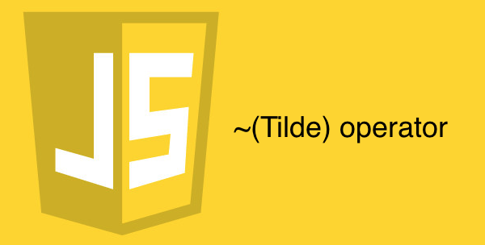

  
우리는 주로 `~`라는 문자를 물결이라고 읽었다.  
하지만 영어권 국가에서는 Tilde(틸드)라고 읽는다.  
따라서 해당 연산자를 틸드 연산자라고 부른다.  
해당 연산자가 기본적으로 어떤 일을 하는지 보자.  

## 뭐하는 놈이니?
~ 연산자는 비트 단위의 연산자이다.  
즉, 10진수를 2진수로 바꿔버린 후 연산을 진행한다는 것이다.  
비트 단위의 연산자 중에 Not을 진행하는 연산자이다.  
Not 연산자이므로 단항 연산자이다.  
간단하게 어떻게 작동하는지 보자.  
```javascript
console.log(~1); // -2
```
일단 1을 2진수로 바꿔보자.  
00000001  
여기서 틸드 연산자를 쓰면  
~00000001  
Not 연산자 이므로 0을 1로, 1을 0으로 역전시킨다.  
11111110  
위에 2진수가 -2인지 확인해보자.  
  

## -1의 비밀
유독 자바스크립트의 메소드를 보면 -1을 반환하는 녀석들이 많다.  
* [String.prototype.indexOf()](https://developer.mozilla.org/ko/docs/Web/JavaScript/Reference/Global_Objects/String/indexOf)  
* [String.prototype.charAt()](https://developer.mozilla.org/ko/docs/Web/JavaScript/Reference/Global_Objects/String/charAt)  
* [String.prototype.search()](https://developer.mozilla.org/ko/docs/Web/JavaScript/Reference/Global_Objects/String/search)  
* [Array.prototype.indexOf()](https://developer.mozilla.org/ko/docs/Web/JavaScript/Reference/Global_Objects/Array/indexOf)  
* [Array.prototype.findIndex()](https://developer.mozilla.org/ko/docs/Web/JavaScript/Reference/Global_Objects/Array/findIndex)

뭐 이외에도 더 있는지 모르겠지만 내가 아는 범위 내에서는 이게 끝이다.  
주로 검색과 관련된 메소드 중에서  
인덱스(number)를 반환하는 메소드에서  
존재하면 해당 인덱스틀, 존재하지 않는다면 -1을 반환한다.  
단순히 인덱스가 0부터 정수로 쭉쭉 뻗어가니  
존재하지 않으면 0에서 가장 가까운 -1을 반환하는 게 타당해보인다.  
하지만 틸드 연산자와 생각해보면 이 -1이란 녀석을 이용해먹을 수 있다.  

일단 -1을 2진수로 표현하면  
11111111  
인데 틸드 연산자를 써서 역전시켜버리면  
00000000  
정수 0이 돼버린다.  
0은 형변환 했을 때 false로 취급되는 falsy value이다.  
`~-1 === 0`이라는 점을 이용하면 조건식을 간결하게 만들 수 있다.  
```javascript
const str = '나는바보입니다';
let search = '냐';
if(str.indexOf(search) === -1) console.log('없다');
// ~ 연산자를 쓰면 아래와 같이 줄일 수 있다.
// ~-1 === 0 == false이기 때문에 논리 부정 연산자(!)를 썼다.
if(!~str.indexOf(search)) console.log('없다');

search = '바보';
if(str.indexOf(search) !== -1) console.log('있다');
// ~ 연산자를 쓰면 아래와 같이 줄일 수 있다.
// str.indexOf(search) === 2
// -1이 아닌 값에 틸드 연산자를 쓰면 0은 안 나옴.
// ~str.indexOf(search) === 0은 무조건 안 나옴.
// 0이 아닌 숫자는 무조건 true로 형변환 하게 돼있음.
if(~str.indexOf(search)) console.log('있다');
```
연산 속도를 한번 비교해보자.  
```javascript
// 큰 차이는 없다.
const iterations = 10000000;
const str = '나는바보입니다';
let search = '냐';
console.time("===");
for(let i=0; i<iterations; i++){
    if(str.indexOf(search) === -1); // ===: 610.604ms
}
console.timeEnd("===");
console.time("!~");
for(let i=0; i<iterations; i++){
    if(!~str.indexOf(search)); // !~: 578.663ms
}
console.timeEnd("!~");
search = '바보';
console.time("!==");
for(let i=0; i<iterations; i++){
    if(str.indexOf(search) !== -1); // !==: 607.395ms
}
console.timeEnd("!==");
console.time("~");
for(let i=0; i<iterations; i++){
    if(~str.indexOf(search)); // ~: 619.903ms
}
console.timeEnd("~");
```

## ~의 ~(~~)
기본적으로 Tilde 연산자는 소수점 아래 비트를 버리는 성질을 가진다.  
```javascript
console.log(~1.1); // -2
console.log(~1); // -2
```
Not 연산은 기본적으로 두 번 사용하면 원본값을 반환하는 성질을 가진다.  
```javascript
console.log(!true); // false
console.log(!!true); // true
```
논리 부정 연산인 !은 단순히 true를 false로, false를 true로 역전시킬 뿐이지만  
비트 논리 부정 연산자인 ~는 조금 다르다.  
위에서 보다 싶이 소수점 아래 비트를 아예 버려버리는 성질이 있기 때문에  
이 점을 이용하면 다음과 같은 효과를 낼 수 있다.  
```javascript
// ES6에서 추가된 Math.trunc를 바벨이나 Polyfill을 쓰지 않아도 된다.
console.log(Math.trunc(45.6)); // 45
console.log(~~45.6); // 45
console.log(Math.trunc(-45.6)); // -45
console.log(~~-45.6); // -45

// 역시 비트 단위의 논리 연산자라서 메소드 호출보다 연산 속도가 훨씬 빠르다.
const iterations = 10000000;
console.time("Math.trunc()");
for(let i=0; i<iterations; i++){
    Math.trunc(-45.6); // Math.trunc: 124.700ms
}
console.timeEnd("Math.trunc()");
console.time("~~");
for(let i=0; i<iterations; i++){
    ~~-45.6; // ~~: 21.944ms
}
console.timeEnd("~~");
```
