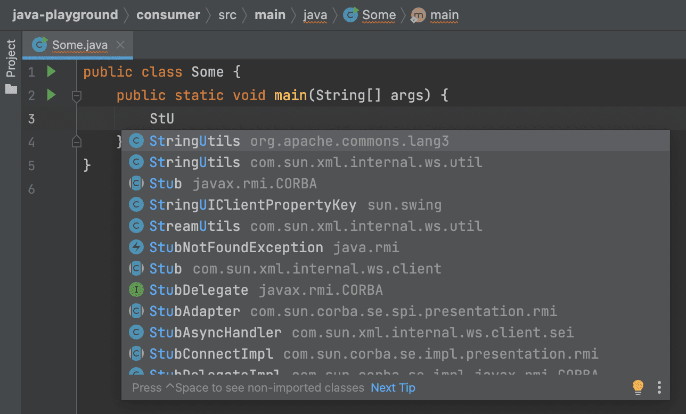
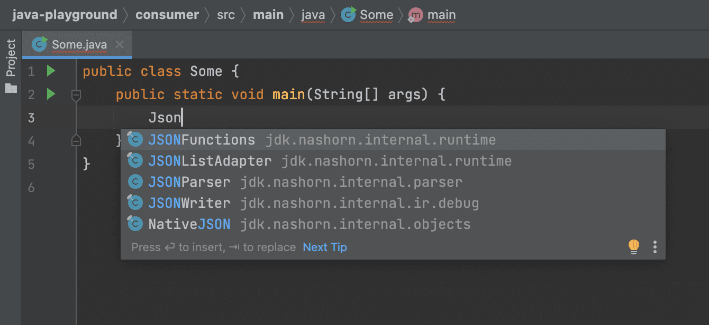
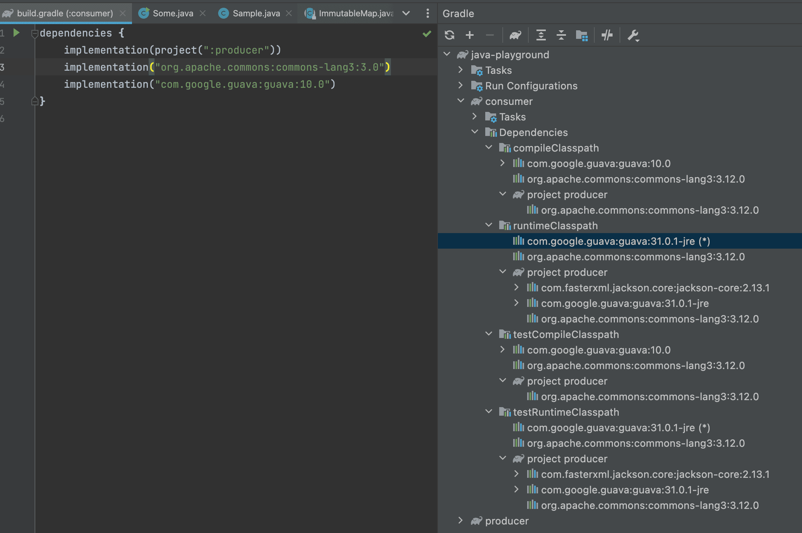

3줄 요약
1. [implementation](#implementation)을 사용하자
2. implementation을 사용하더라도 라이브러리를 사용하는 [consumer 측의 runtimeClassPath에 추가되기 때문에 런타임 의존성 충돌](#%EA%B7%B8%EB%9F%BC-implementation%EB%A7%8C-%EC%93%B0%EB%A9%B4-%EB%A7%8C%EC%82%AC-OK%EC%9D%BC%EA%B9%8C)이 발생할 수 있으니 의존성은 최대한 적게 추가하자.
3. [api](#api)가 필요한 건지 100번 고민하고 설계가 잘못된 건 아닌지 의심해 본 후 api를 사용한다. (api는 consumer의 compile/runtimeClassPath에 모두 추가된다.)

## 들어가기에 앞서
의존성(라이브러리/프레임워크)을 추가하기 위해 build.gradle(or build.gradle.kts)에 아래와 같이 디펜던시들을 추가하게 된다.

```groovy
dependencies {
    api("org.springframework.boot:spring-boot-starter-web")
    implementation("com.fasterxml.jackson.module:jackson-module-kotlin")
}
```

참고로 compile은 depreacate 됐기 때문에 사용하면 안 되고 implementation을 쓰라고 나와있다. (compile은 api와 마찬가지로 consumer의 (test)compile/runtimeClassPath에 모두 추가되니 사용하지 않는 게 좋다.)

> The compile configuration has been deprecated for dependency declaration. 
> This will fail with an error in Gradle 7.0. Please use the implementation configuration instead.
> Consult the upgrading guide for further information: [https://docs.gradle.org/6.9/userguide/upgrading_version_5.html#dependencies_should_no_longer_be_declared_using_the_compile_and_runtime_configurations](https://docs.gradle.org/6.9/userguide/upgrading_version_5.html#dependencies_should_no_longer_be_declared_using_the_compile_and_runtime_configurations)

```kotlin
@Deprecated(message = "The compile configuration has been deprecated for dependency declaration. Please use the 'implementation' configuration instead.")
fun DependencyHandler.`compile`(dependencyNotation: Any): Dependency? =
    add("compile", dependencyNotation)
```

그럼 implementation은 뭐고 api는 뭘까??

## implementation
[implementation](https://docs.gradle.org/current/userguide/java_plugin.html#tab:configurations)으로 의존성을 관리하기 위해서는 [java 플러그인](https://docs.gradle.org/current/userguide/java_plugin.html)을 활성화해야한다.

```groovy
plugins {
    id 'java'
}
```

멀티 모듈인 경우 아래와 같이 활성화 시켜줘야한다. (java는 gradle core 플러그인이기 때문에 plugins 모듈에 별도로 정의 안 하고도 서브 모듈들에게 적용이 가능하다.)

```groovy
subprojects {
    apply plugin: 'java'
}
```

build.gradle.kts에서는 kotlin jvm 플러그인만 활성화 시켜주면 된다.

```kotlin
plugins {
    kotlin("jvm") version "$kotlinVersion"
}
```

멀티 모듈인 경우 아래와 같이 활성화 시켜줘야한다. (kotlin jvm 플러그인은 gradle core 플러그인이 아니기 때문에 plugins 모듈에 별도로 정의 해놔야 서브 모듈들에게 적용이 가능하다.)

```kotlin
plugins {
    kotlin("jvm") version "$kotlinVersion"
}

subprojects {
    apply(plugin = "org.jetbrains.kotlin.jvm")
}
```


출처: [https://docs.gradle.org/current/userguide/java_plugin.html#tab:configurations](https://docs.gradle.org/current/userguide/java_plugin.html#tab:configurations)

기본적으로 implementation으로 의존성을 추가한다는 사실은 아래 클래스패스에 추가한다는 사실이다.
- compileClassPath: main 경로에서 해당 모듈을 컴파일할 때 사용함, 우리가 spring-tx 모듈의 @Transactional 어노테이션을 사용하는데 컴파일 클래스패스에 존재하지 않는다면 컴파일에 실패함. (대표적으로 lombok이 어노테이션 프로세서에 의해 소스코드에 있는 어노테이션을 해석하여 실제로 소스코드로 컴파일 할 때는 전부 사라지기 때문에 compileClassPath에만 존재하면 되고, runtimeClassPath에는 필요없는 경우이다. 그래서 [lombok을 compileOnly로 추가](https://mvnrepository.com/artifact/org.projectlombok/lombok/1.18.22)하는 게 좋다.)
- runtimeClassPath: main 경로에서 해당 모듈을 런타임에서 사용함, 우리가 컴파일한 소스코드를 실행할 때(런타임) spring-tx 모듈의 @Transactional 어노테이션을 사용하는데 런타임 클래스패스에 존재하지 않는다면 @Transactional을 사용하는 코드로 진입 시에 [NoClassDefFoundError](https://docs.oracle.com/javase/8/docs/api/java/lang/NoClassDefFoundError.html)나 [ClassNotFoundException](https://docs.oracle.com/javase/8/docs/api/java/lang/ClassNotFoundException.html)과 같은 에러/예외가 발생하며 서버가 제대로 뜨지 않거나 서버는 떴는데 특정 API만 호출하면 장애가 발생할 수도 있다. (대표적으로 mysql-connector-java 같은 경우가 우리가 소스코드에서 직접적으로 사용하지는 않기 때문에 compileClassPath에서는 필요 없는데 런타임에 jdbc 드라이버라던지 HikariCP 등등에서 사용할 것이기 때문에 runtimeClassPath에만 존재하면 되고, compileClassPath에는 필요없는 경우이다. 그래서 mysql-connector-java를 runtimeOnly로 추가하는 게 좋다.)
- testCompileClassPath: test 경로에서 해당 모듈을 컴파일할 때 사용함, 우리가 spring-boot-test 모듈의 @SpringBootTest 어노테이션을 사용하는데 컴파일 클래스패스에 존재하지 않는다면 컴파일에 실패함. (대표적으로 junit 같은 경우가 실제 어플리케이션을 구동하는데는 필요하지 않고, 테스트를 수행하는데 필요하기 때문에 testImplementation으로 추가하는 게 좋다.)
- testRuntimeClassPath: test 경로에서 해당 모듈을 런타임에서 사용함, 우리가 컴파일한 소스코드를 실행할 때(런타임) spring-boot-test 모듈의 @SpringBootTest 어노테이션을 사용하는데 런타임 클래스패스에 존재하지 않는다면 @SpringBootTest을 사용하는 코드로 진입 시에 [NoClassDefFoundError](https://docs.oracle.com/javase/8/docs/api/java/lang/NoClassDefFoundError.html)나 [ClassNotFoundException](https://docs.oracle.com/javase/8/docs/api/java/lang/ClassNotFoundException.html)과 같은 에러/예외가 발생하며 테스트가 실패하게 됨. (대표적으로 h2 db 같이 테스트에서 사용할 목적으로 쓰이는 인메모리 db의 경우 우리가 소스코드에서 직접 사용하는 게 아니라 Spring Boot의 특정 Auto Configuration에서 사용하기 때문에 컴파일 할 때는 필요 없어서 testCompileClassPath에는 존재할 필요가 없고, 런타임에서만 사용하기 때문에 testRuntimeClassPath에는 존재해야하는 경우이다. 그래서 h2는 testRuntimeOnly로 추가하는 게 좋다.)


실제로 implementation으로 jackson-core 모듈을 추가하고 보면 4가지 클래스패스에 모두 추가된 걸 볼 수 있다.

## api
api로 의존성을 관리하기 위해서는 [java-library](https://docs.gradle.org/current/userguide/java_library_plugin.html) 플러그인을 사용해야한다.

```groovy
plugins {
    id 'java-library'
}
```

멀티 모듈인 경우 아래와 같이 활성화 시켜줘야한다. (java-library는 gradle core 플러그인이기 때문에 plugins 모듈에 별도로 정의 안 하고도 서브 모듈들에게 적용이 가능하다.)

```groovy
subprojects {
    apply plugin: 'java-library'
}
```

build.gradle.kts에서는 똑같이 kotlin jvm 플러그인만 활성화 시켜주면 된다.

```groovy
plugins {
    kotlin("jvm") version "$kotlinVersion"
}
```

멀티 모듈인 경우 아래와 같이 활성화 시켜줘야한다. (kotlin jvm 플러그인은 gradle core 플러그인이 아니기 때문에 plugins 모듈에 별도로 정의 해놔야 서브 모듈들에게 적용이 가능하다.)

```kotlin
plugins {
    kotlin("jvm") version "$kotlinVersion"
}

subprojects {
    apply(plugin = "org.jetbrains.kotlin.jvm")
}
```


출처: [https://docs.gradle.org/current/userguide/java_library_plugin.html#sec:java_library_configurations_graph](https://docs.gradle.org/current/userguide/java_library_plugin.html#sec:java_library_configurations_graph)

이미지를 보면 implementation과 마찬가지로 api도 compileClassPath, runtimeClassPath, testCompileClassPath, testRuntimeClassPath에 추가된다고 나와있다.


실제로 api로 jackson-core 모듈을 추가하고 보면 4가지 클래스패스에 모두 추가된 걸 볼 수 있다.

## implementation vs api
여태까지 봤을 때는 둘 다 compileClassPath, runtimeClassPath, testCompileClassPath, testRuntimeClassPath에 추가된다는 걸 봐서 큰 차이점은 없어보인다.

하지만 이건 해당 모듈을 사용하는 컨슈머 입장이 돼봐야 그 차이점을 알게 된다.
* 라이브러리: jakcson-core, spring-tx, 우리 프로젝트 내에서 만드는 모듈들 등등
* 컨슈머: 프로젝트 내에서 라이브러리를 사용하는 모듈, 우리 프로젝트에서 위 라이브러리들을 사용하는 모듈 등등

프로젝트에 두 가지 모듈(producer와 consumer)을 만들어서 차이점을 확인해보자.

먼저 producer 모듈에 의존성을 추가할 때 implementation과 api로 각각 추가해보자


implementation으로 추가한 jackson-core와 api로 추가한 commons-lang3 모듈이 모두 클래스패스에 추가됐다.


consumer 쪽에서 producer 모듈을 의존성으로 추가하는데 여기서 차이점이 나온다. (producer 모듈을 api로 추가해도 마찬가지다.)
producer 모듈에서 implementation으로 추가했던 의존성인 jackson-core는 (test)runtimeClassPath에만 추가되고, (test)compileClassPath에는 추가되지 않았다.
그리고 api로 추가했던 의존성인 commons-lang3는 모든 클래스패스에 추가됐다.

(test)compileClassPath에 의존성을 전파하지 않음으로써 얻는 이점들은 다음과 같다.

### implementation의 장점 1: 불필요한 의존성 전파를 막아준다.

consumer module의 compileClassPath에 있는 commons-lang3 모듈 같은 경우에는 실제 소스코드에서 사용이 가능하다.


하지만 consumer moudle의 compileClassPath에 없는 jackson-core 같은 경우에는 실제 소스코드에서 사용이 불가능하다.
compileClassPath에 없기 때문에 consumer 모듈에서 직접적인 사용이 불가능한 것이지, runtime에 jackson-core를 사용하는 producer 모듈을 사용하는 것에는 아무런 문제가 없다. (runtimeClassPath에 있기 때문에)
producer 모듈에 jackson-core를 이용하는 클래스를 작성해보자.

```java
import com.fasterxml.jackson.core.JsonParser;

public class Sample {
    void a() {
        // 아무 의미 없지만 jackson-core 모듈을 사용하는데 아무 이상이 없다는 걸 보여주기 위해 사용함.
        final JsonParser.Feature allowComments = JsonParser.Feature.ALLOW_COMMENTS;
        System.out.println("test~");
    }
}
```
그리고 consumer 모듈에서 jackson-core를 이용하는 Sample 클래스를 사용하는 클래스를 작성해보자.

```java
public class Some {
    public static void main(String[] args) {
        final Sample sample = new Sample();
        sample.a(); // test~
    }
}
```
Some 클래스의 메인 함수를 호출하면 Sample 클래스의 a 메서드가 호출되서 test~ 문자열이 정상적으로 호출되는 걸 볼 수 있다.
consumer 모듈 입장에서는 불필요한 의존성 전파(jackson-core 모듈이 consumer까지 전파)되는 걸 막아줘서 import 자체가 되지 않다보니 자동완성에서 import 할 수 있는 가짓수가 줄어들다보니 어떤 클래스를 사용해야하는지 고민할 시간이 줄어들고(생산성 향상),
producer 입장에서는 해당 모듈을 외부로 노출시키지 않다보니 마음대로 구현체를 갈아끼워도 컴파일 타임에 오류가 나지 않을 것이라는 신뢰가 어느정도 생긴다는 장점이 존재한다.

### implementation의 장점 2: compileClassPath의 의존성 충돌이 일어나지 않는다.

producer 모듈에 guava를 implementation으로 추가해보자

```groovy
implementation("com.google.guava:guava:31.0.1-jre")
```

그리고 consumer 모듈에도 똑같이 guava 모듈을 추가하는데 굉장히 하위 버전을 추가해보자

```groovy
implementation("com.google.guava:guava:10.0")
```

그리고 이번에는 producer 모듈에서 api로 추가했었던 commons-lang3 모듈을 consumer 모듈에 추가하는데 버전을 좀 낮게 추가해보자.

```groovy
implementation("org.apache.commons:commons-lang3:3.0")
```


이제 consumer 모듈의 classPath를 보면
- producer 모듈에서 api로 추가했던 commons-lang3 같은 경우에는 (test)compile/runtimeClassPath에서 의존성 충돌이 나서 producer 모듈에 추가한 가장 최신 버전인 3.12.0이 적용됨
- producer 모듈에서 implement로 추가했던 guava 같은 경우에는 (test)compileClassPath에는 consumer 모듈에 추가한 10.0이 적용됨, (test)runtimeClassPath에서는 의존성 충돌이 나서 producer 모듈에 추가한 가장 최신 버전인 31.0.1-jre가 적용됨

즉, implementation을 쓰면 consumer 입장에서 소스코드를 직접 작성하는 것과 연관이 있는 (test)compileClassPath는 의존성이 전파가 되지 않았기 때문에 consumer 모듈에 추가한 버전이 적용되었고,
소스코드를 실제 실행하는데 필요한 (test)runtimeClassPath는 의존성이 전파됐기 때문에 의존성 충돌에 의해 가장 최신버전이 적용된다. (안 그러면 런타임에 메서드나 클래스를 찾을 수 없다는 오류가 발생할 수 있다.)
반대로 최신버전에서는 사라진 코드를 사용했다면 컴파일은 성공하는데 런타임에 오류가 발생할 수도 있기 때문에 runtime 의존성도 체크하면서 사용해야 안전하다. (최대한 런타임 의존성과 호환성이 맞는 버전을 사용해야 안전하다.)

반면 api를 쓰면 (test)compile/runtimeClassPath에 모두 의존성을 전파하기 때문에 의존성 충돌로 인해 원하는 버전을 쓰려면 버전을 강제하는 방법을 쓰거나 해야해서 사용하기가 좀 구려진다.

### implementation의 장점 3: compileClassPath에 포함되지 않기 때문에 라이브러리 측에서 의존성을 변경해도 컨슈머는 재컴파일 하지 않아도 된다.

consumer 측에서 producer에서 api로 의존성을 추가한 commons-lang3를 사용한다고 해보자.

```java
import org.apache.commons.lang3.StringUtils;

public class Some {
    public static void main(String[] args) {
        StringUtils.isBlank("asf");
        System.out.println("hello~");
    }
}
```

그리고 producer 측에서 commons-lang3 모듈의 의존성 버전을 바꿔보자.

```groovy
api("org.apache.commons:commons-lang3:3.10")
```

그리고 consumer 측의 Some 클래스의 main 함수를 실행하면 Some 클래스는 하나도 수정한 게 없는데 다시 컴파일 하는 걸 볼 수 있다.
```text
6:04:36 AM: Executing ':consumer:Some.main()'...

> Task :producer:compileJava
> Task :consumer:compileJava
> Task :consumer:processResources UP-TO-DATE
> Task :consumer:classes
> Task :producer:processResources NO-SOURCE
> Task :producer:classes
> Task :producer:jar UP-TO-DATE

> Task :consumer:Some.main()
hello~
```

하지만 producer에서 implementation으로 추가했던 jackson-core나 guava 같은 경우에는 consumer 측의 (test)compileClassPath에는 포함조차 돼있지 않기 때문에 해당 모듈은 의존성을 바꾼다 하더라도 consumer에서는 컴파일을 할 필요가 없다.
```text
6:05:36 AM: Executing ':consumer:Some.main()'...

> Task :producer:compileJava
> Task :consumer:compileJava UP-TO-DATE
> Task :consumer:processResources UP-TO-DATE
> Task :consumer:classes UP-TO-DATE
> Task :producer:processResources NO-SOURCE
> Task :producer:classes
> Task :producer:jar UP-TO-DATE

> Task :consumer:Some.main()
hello~
```

### implementation의 장점 4: compileClassPath 사이즈가 줄어들었기 때문에 컴파일 속도가 빨라진다.

컴파일 클래스패스가 줄어들었다는 것은 컴파일 해야할지 말아야할지 판단할 근거도 줄었다는 뜻이다.
위에서 보듯이 producer에서 api로 추가한 모듈들은 consumer에서 사용하는지, 안 하는지에 따라서 해당 클래스를 재컴파일 해야하는지 말아야하는지 비교를 해야한다.
하지만 전부 implementation으로 막혀있다면 그 비교 대상 자체가 확연히 줄어들게 될 것이다.
그로 인해 컴파일 속도가 빨라진다. (엄청나게 빨라지는 것까지는 아니겠지만... 의존성이 많으면 많을 수록 더 큰 빛을 발할 것 같다.)

## 언제 implementaion을 쓰고 언제 api를 써야할까?

[https://docs.gradle.org/current/userguide/java_library_plugin.html#sec:java_library_recognizing_dependencies](https://docs.gradle.org/current/userguide/java_library_plugin.html#sec:java_library_recognizing_dependencies)

> Prefer the `implementation` configuration over `api` when possible

일단 무지성으로 implementation을 쓰고 어쩔 수 없을 때만 고민 한 100번 정도 한 다음에 api를 쓰면 된다.

### implementation을 써야할 때

> any type that is used in the following list is irrelevant to the ABI, and therefore should be declared as an `implementation` dependency:
• types exclusively used in method bodies
• types exclusively used in private members
• types exclusively found in internal classes (future versions of Gradle will let you declare which packages belong to the public API)

ABI(Application Binary Interface)와 무관한 케이스에는 implementation을 쓰면 된다.
- 타입이 메서드 바디 안에서만 쓰이는 경우
- 타입이 프라이빗 멤버(변수/메서드 등등)에서만 쓰이는 경우
- 타입이 인터널 클래스에서만 쓰이는 경우

### api를 써야할 때
> An API dependency is one that contains at least one type that is exposed in the library binary interface, often referred to as its ABI (Application Binary Interface). This includes, but is not limited to:
• types used in super classes or interfaces
• types used in public method parameters, including generic parameter types (where *public* is something that is visible to compilers. I.e. , *public*, *protected* and *package private* members in the Java world)
• types used in public fields
• public annotation types

ABI(Application Binary Interface)와 관련있는 케이스에는 api를 쓰면 된다.
- 타입이 인터페이스나 슈퍼 클래스에서 쓰이는 경우
- 타입이 public/protected/package private 메서드의 파라미터(메서드의 인자 혹은 리턴타입 및 제네릭 파라미터 타입)에서 쓰일 때
- 타입이 퍼블릭 필드에서 쓰일 때
- 퍼블릭 어노테이션 타입일 때

## 그럼 implementation만 쓰면 만사 OK일까??
아니다, 최대한 의존성을 줄여야한다.
implementation이라 할지라도 (test)runtimeClassPath에 포함되기 때문에 의존성 충돌로 인해 문제가 발생할 수 있다.
런타임 의존성 충돌로 인해 실제 런타임에 내가 만든 소스코드가 제대로 동작하지 않을 수 있다.
내가 사용한 모듈(컴파일 클래스패스에 추가한) 버전에서는 존재하는 메서드였는데 런타임 의존성 충돌로 최신버전으로 주입됐을 때 최신버전에서는 삭제된 메서드일 때 [NoSuchMethodException](https://docs.oracle.com/javase/8/docs/api/java/lang/NoSuchMethodException.html) 같은 게 날 수 있다.
혹은 라이브러리의 버전이 바뀌면서 내부 동작이 바뀌는 등의 무서운 일이 발생한다면 더욱 큰 장애로 이어질 수도 있다.
그리고 컴파일 타임에 발견되지 않고 런타임에 발견되는 문제는 해당 코드 블럭이 실행돼야지만 발견되는 장애이기 때문에 더더욱 무섭다.
