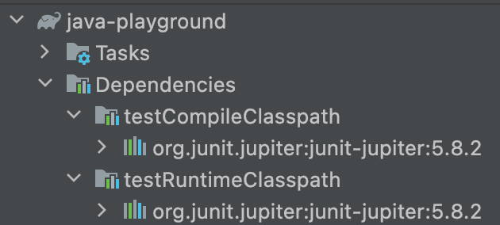
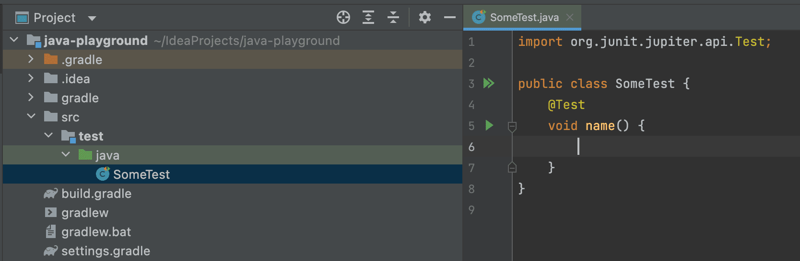
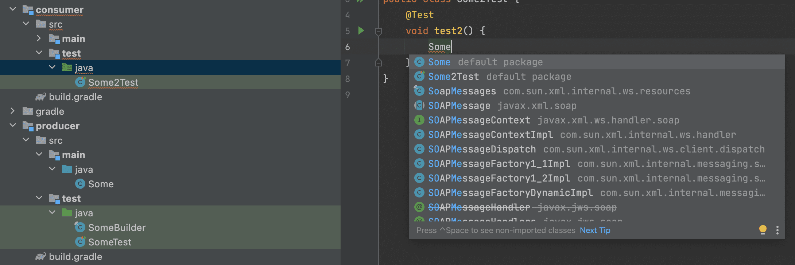
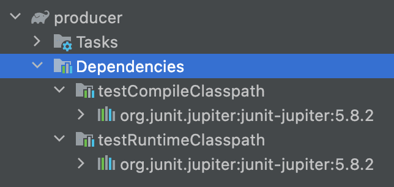
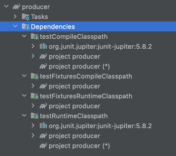
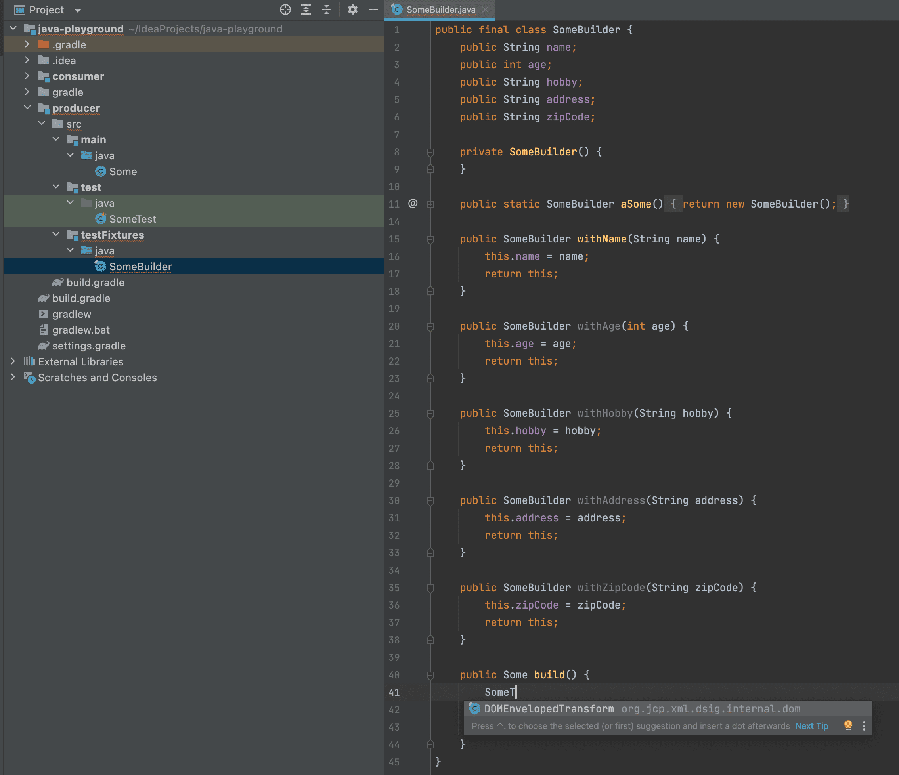
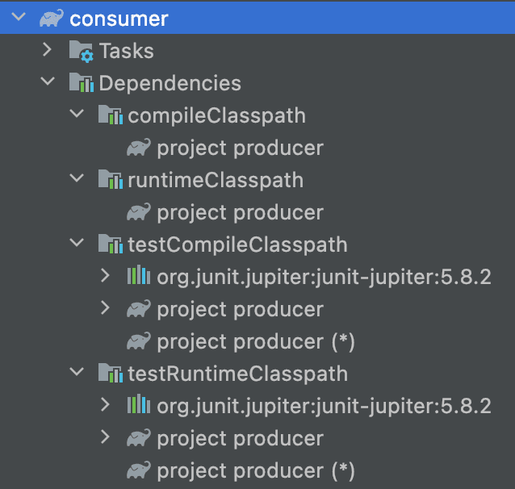
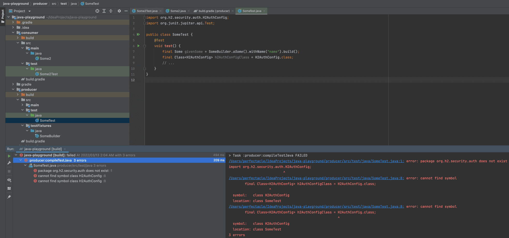
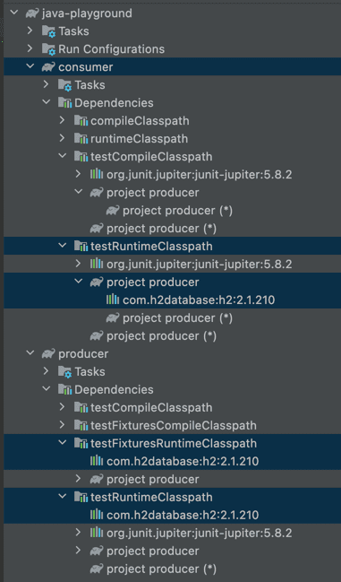

## 들어가기에 앞서
[(Gradle) implementation vs api](/2022/03/12/gradle-implementation-vs-api/)에서는 compile/runtime 의존성을 관리하는 방법에 대해 정리했다.  
하지만 이는 실제 src/main 경로에 대해서만 의존성을 관리하는 것이지 src/test 경로에서 사용하는 테스트 의존성(testCompileClasspath, testRuntimeClasspath)에 대해서는 딥하게 다루지 않았다.
테스트도 관리해야할 대상이고 하나의 소프트웨어라는 관점에서 테스트의 의존성 조차도 신경을 써줘야한다.

## testImplementation


기본적으로 [implementation](/2022/03/12/gradle-implementation-vs-api/#implementation)과 [api](/2022/03/12/gradle-implementation-vs-api/#api)로 의존성을 추가한 경우에도 testCompileClasspath, testRuntimeClasspath에 추가돼서 테스트에서도 사용이 가능하다.
하지만 compileClasspath, runtimeClasspath에도 추가되다보니 실제 프로덕션에서는 사용할 필요가 없고, 테스트에서만 사용할 목적으로 testImplementation을 많이 사용한다.

[testImplementation](https://docs.gradle.org/current/userguide/java_plugin.html#tab:configurations)으로 의존성을 관리하기 위해서는 [java 플러그인](https://docs.gradle.org/current/userguide/java_plugin.html)을 활성화해야한다.

```groovy
plugins {
    id 'java'
}
```

멀티 모듈인 경우 아래와 같이 활성화 시켜줘야한다. (java는 gradle core 플러그인이기 때문에 plugins 모듈에 별도로 정의 안 하고도 서브 모듈들에게 적용이 가능하다.)

```groovy
subprojects {
    apply plugin: 'java'
}
```

build.gradle.kts에서는 kotlin jvm 플러그인만 활성화 시켜주면 된다.

```kotlin
plugins {
    kotlin("jvm") version "$kotlinVersion"
}
```

멀티 모듈인 경우 아래와 같이 활성화 시켜줘야한다. (kotlin jvm 플러그인은 gradle core 플러그인이 아니기 때문에 plugins 모듈에 별도로 정의 해놔야 서브 모듈들에게 적용이 가능하다.)

```kotlin
plugins {
    kotlin("jvm") version "$kotlinVersion"
}

subprojects {
    apply(plugin = "org.jetbrains.kotlin.jvm")
}
```

그리고 의존성 추가를 위해 build.gradle(or build.gradle.kts)에 아래와 같이 디펜던시들을 추가하게 된다.
```groovy
dependencies {
    testImplementation("org.junit.jupiter:junit-jupiter:5.8.2")
}
```


실제로 gradle dependency를 보게되면 compileClasspath와 runtimeClasspath에는 추가되지 않고, testCompileClasspath와 testRuntimeClasspath에만 추가된 걸 볼 수 있다.


testCompileClasspath에 추가됐기 때문에 src/test에서 junit 5를 사용할 수 있다.


compileClasspath에 추가되지 않았기 때문에 src/main에서는 junit 5를 사용할 수 없다.

## 테스트 경로에 있는 클래스들을 외부로 노출시키기
단일 모듈의 경우에는 testImplementation, testCompileOnly, testRuntimeOnly 정도로 테스트 전용으로 의존성을 관리할 수 있다.
하지만 멀티 모듈의 경우에는 조금 복잡해진다.

* 라이브러리: jakcson-core, spring-tx, 우리 프로젝트 내에서 만드는 모듈들 등등
* 컨슈머: 프로젝트 내에서 라이브러리를 사용하는 모듈, 우리 프로젝트에서 위 라이브러리들을 사용하는 모듈 등등

프로젝트에 두 가지 모듈(producer와 consumer)을 만들어서 차이점을 확인해보자.


producer는 모듈을 제공하는 측이고, consumer는 모듈을 소비하는 측이다.
따라서 consumer 모듈의 build.gradle(또는 build.gradle.kts)를 보면 producer 모듈에 의존하는 모습을 볼 수 있다.
```groovy
dependencies {
    implementation(project(":producer"))
}
```

이 때 producer 모듈에 기본 생성자는 없고, 생성자에 인자가 많아서 생성하기 번거로운 클래스가 있다고 가정해보자.
```java
public class Some {
    public final String name;
    public final int age;
    public final String hobby;
    public final String address;
    public final String zipCode;

    public Some(final String name, final int age, final String hobby, final String address, final String zipCode) {
        this.name = name;
        this.age = age;
        this.hobby = hobby;
        this.address = address;
        this.zipCode = zipCode;
    }
}
```

테스트에서 생성자에 모든 인자를 넣어서 매번 생성하기 번거로우므로 아래와 같은 빌더를 src/test 하위 경로에 만들자.
```java
public final class SomeBuilder {
    public String name;
    public int age;
    public String hobby;
    public String address;
    public String zipCode;

    private SomeBuilder() {
    }

    public static SomeBuilder aSome() {
        return new SomeBuilder();
    }

    public SomeBuilder withName(String name) {
        this.name = name;
        return this;
    }

    public SomeBuilder withAge(int age) {
        this.age = age;
        return this;
    }

    public SomeBuilder withHobby(String hobby) {
        this.hobby = hobby;
        return this;
    }

    public SomeBuilder withAddress(String address) {
        this.address = address;
        return this;
    }

    public SomeBuilder withZipCode(String zipCode) {
        this.zipCode = zipCode;
        return this;
    }

    public Some build() {
        return new Some(name, age, hobby, address, zipCode);
    }
}
```

이제 내가 원하는 인자들만 설정하고 나머지는 빌더에 설정된 기본값을 사용하여 테스트에서 쉽게 해당 객체를 찍어낼 수 있다.
```java
public class SomeTest {
    @Test
    void test() {
        final Some givenSome = SomeBuilder.aSome().withName("name").build();
        // ...
    }
}
```

producer 모듈에서 테스트 작성 시에 이렇게 SomeBuilder를 통해 원하는 객체를 원하는 모양으로 쉽게 찍어낼 수 있었는데 consumer 모듈에서는 어떨까??

consumer 모듈에서는 producer 모듈의 src/main에 있는 Some 클래스에는 접근이 가능한데 src/test에 있는 SomeBuilder 클래스에는 접근이 안 된다.  

왜 그런 걸까??
우선 프로젝트를 빌드해보자.
```text
./gradlew build

1:03:15 AM: Executing 'build'...

> Task :producer:compileJava
> Task :producer:processResources NO-SOURCE
> Task :producer:classes
> Task :producer:jar
> Task :consumer:compileJava NO-SOURCE
> Task :consumer:processResources NO-SOURCE
> Task :consumer:classes UP-TO-DATE
> Task :consumer:jar
> Task :consumer:assemble
> Task :consumer:compileTestJava
> Task :consumer:processTestResources NO-SOURCE
> Task :consumer:testClasses
> Task :consumer:test
> Task :consumer:check
> Task :consumer:build
> Task :producer:assemble
> Task :producer:compileTestJava
> Task :producer:processTestResources NO-SOURCE
> Task :producer:testClasses
> Task :producer:test
> Task :producer:check
> Task :producer:build
```


그리고 나서 producer 모듈의 빌드된 jar를 까보면 src/main에 있는 Some 클래스만 존재하는 걸 볼 수 있다.
애초에 jar 파일에 SomeBuilder가 존재하지 않기 때문에 consumer 모듈에서는 접근조차 불가능한 것이다.

그럼 문제를 어떻게 해결해야할까?
가장 간단한 방법은 consumer 모듈의 src/test에도 똑같이 SomeBuilder 파일을 복붙하는 방법이다.
하지만 IDE의 리팩토링 기능으로 관리가 되지 않기 때문에 동일한 파일을 두 번 관리해야한다는 매우 비효율을 낳게 된다.

### 구세주 java-test-fixtures 플러그인
src/main에 있는 파일만 jar로 뽑듯이 src/test에 있는 파일들도 jar로 뽑아내기 위해 gradle에는 [java-test-fixtures](https://docs.gradle.org/current/userguide/java_testing.html#sec:java_test_fixtures)라는 플러그인이 존재한다. 

먼저 src/test 하위 경로에 있는 파일들을 노출시키고 싶은 producer 모듈의 build.gradle 파일에 java-test-fixtures 플러그인을 추가해주자.
```groovy
plugins {
    id 'java-test-fixtures'
}
```

build.gradle.kts 같은 경우에는 아래와 같이 추가하면 된다.
```kotlin
plugins {
    `java-test-fixtures`
}
```


플러그인을 추가한 후 producer 모듈에 새로운 경로를 추가하려고 하면 인텔리제이와 같은 IDE에서 testFixtures 경로를 자동으로 추천해주게 된다.

그리고 testFixtures 하위에 있는 파일들은 아래와 같은 특징을 가진다.
* they can see the main source set classes (src/testFixtures에 존재하는 클래스에서 src/main에 존재하는 클래스에 접근 가능)
* test sources can see the test fixtures classes (src/test에 존재하는 테스트 클래스에서 src/testFixtures 클래스에 접근 가능)


java-test-fixtures 플러그인을 추가하기 전에는 testCompileClasspath와 testRuntimeClasspath만 존재하고, junit 5만 의존성으로 가지고 있는 모습이다.


java-test-fixtures 플러그인을 추가하고 보면 testFixturesCompileClasspath와 testFixturesRuntimeClasspath가 추가된 모습을 볼 수 있다.
testCompileClasspath와 testRuntimeClasspath에 포함된 producer 모듈들은 아마 producer/src/main, producer/src/testFixtures 모듈이 아닐까 싶다.
그리고 testFixturesCompileClasspath와 testFixturesRuntimeClasspath에 포함된 producer 모듈은 producer/src/main 모듈이 아닐까 싶다.


그렇기에 SomeBuilder를 src/test에서 src/testFixutres로 옮겨도 아무런 문제가 없다.


testFixtures에서는 main에 있는 Some에는 접근이 가능하지만 test에 있는 SomeTest2에는 접근이 불가능하다.


test에서는 main에 있는 Some과 testFixtures에 있는 SomeBuilder에 모두 접근이 가능하다.


main에서는 당연하게도 test에 있는 SomeTest와 testFixtures에 있는 SomeBuilder에 모두 접근이 불가능하다.

이 상태에서 다시 빌드를 때려보자
```text
./gradlew build

1:22:00 AM: Executing 'build'...

> Task :producer:compileJava
> Task :producer:processResources NO-SOURCE
> Task :producer:classes
> Task :producer:jar
> Task :consumer:compileJava NO-SOURCE
> Task :consumer:processResources NO-SOURCE
> Task :consumer:classes UP-TO-DATE
> Task :consumer:jar
> Task :consumer:assemble
> Task :consumer:compileTestJava
> Task :consumer:processTestResources NO-SOURCE
> Task :consumer:testClasses
> Task :consumer:test
> Task :consumer:check
> Task :consumer:build
> Task :producer:assemble
> Task :producer:compileTestFixturesJava
> Task :producer:compileTestJava
> Task :producer:processTestResources NO-SOURCE
> Task :producer:testClasses
> Task :producer:processTestFixturesResources NO-SOURCE
> Task :producer:testFixturesClasses
> Task :producer:testFixturesJar
> Task :producer:test
> Task :producer:check
> Task :producer:build
```

기존에는 보지 못했던 testFixtures 관련 태스크들이 수행된 것을 볼 수 있다.
* :producer:compileTestFixturesJava
* :producer:processTestFixturesResources
* :producer:testFixturesClasses
* :producer:testFixturesJar


그리고 빌드된 jar를 보면 *-test-fixtures.jar 파일이 추가됐고, 해당 jar를 까보면 testFixtures 하위에 존재하던 SomeBuilder가 존재한다.
이렇듯 java-test-fixtures 플러그인은 src/test 하위에 존재하는 불필요한 테스트 클래스는 jar에 포함시키지 않고 내가 원하는 클래스들만 jar에 추가시켜준다.

하지만 이렇게 test-fixtures.jar로 빌드했다고 해서 바로 consumer 모듈에서 사용할 수 있는 건 아니다.


consumer 모듈의 의존성을 보면 testCompileClasspath와 testRuntimeClasspath에 producer 모듈이 존재하긴 하는데 이건 일반 jar(src/main을 빌드한)만 의존성으로 가지고 있다는 뜻이다.

아래와 같이 test-fixtures.jar(src/testFixtures를 빌드한)도 의존성으로 추가해줘야한다.
```groovy
testImplementation(testFixtures(project(":producer")))
```


testImplementation으로 추가했기 때문에 compileClasspath와 runtimeClasspath에는 전혀 차이가 존재하지 않고, testCompileClasspath와 testRuntimeClasspath에만 producer 모듈(test-fixtures.jar)이 의존성에 추가된 걸 볼 수 있다.


이렇게 consumer 모듈의 테스트 클래스에서도 producer 모듈의 src/testFixtures에 존재하는 SomeBuilder와 producer 모듈의 src/main에 존재하는 Some 클래스에 모두 접근이 가능한 것을 볼 수 있다.
그리고 jar에 포함되지 않는 producer 모듈의 src/test에 존재하는 SomeTest 클래스에는 접근이 불가능하다.


당연히 consumer 모둘의 src/main에 존재하는 클래스에서는 producer 모듈의 src/testFixtures에 존재하는 SomeBuilder에는 접근이 불가능하다.
대신 producer 모듈의 src/main에 존재하는 Some 클래스에는 접근이 가능하다.

## 테스트 의존성을 외부로 노출시키기
만약 producer 모듈에서 인메모리 db로 테스트 할 일이 있어서 h2 db를 testRuntimeOnly로 추가했다고 가정해보자.
(h2 db의 클래스는 우리 테스트 클래스에서 직접 사용하기 보다는 Spring Boot Auto Configuration 등등에서 런타임에 사용하기 때문에 testCompileClasspath에는 추가될 필요가 딱히 없다.)
```groovy
testRuntimeOnly("com.h2database:h2:2.1.210")
```


testRuntimeOnly로 추가했기 때문에 testRuntimeClasspath를 제외한 다른 클래스패스에는 h2가 추가되지 않았다.


testCompileClasspath에 존재하지 않기 때문에 테스트 클래스에서 H2 관련 클래스를 사용해서 컴파일 하면 컴파일 타임에 오류가 난다. (왜 IDE에서는 빨간 줄이 생기지 않는지 의문이다. 일시적 버그인가...)

그리고 consumer 모듈에서도 h2를 사용하여 테스트를 진행한다고 가정해보자.

하지만 단순히 producer 모듈에 testRuntimeOnly로 h2를 추가했다 하더라도 consumer 모듈의 testRuntimeClasspath에는 노출되지 않는다.
producer 모듈은 (testFixtures)compile/runtimeClasspath를 기준으로 jar 파일을 생성하고 consumer 모듈에서 해당 jar 파일에 의존하게 되는데 h2는 해당 클래스패스에는 존재하지 않고, testRuntimeClasspath에만 존재하기 때문이다.

따라서 producer 모듈의 testFixturesCompileClasspath/testFixturesRuntimeClasspath에 추가해야 test-fixtures.jar에 의존성이 추가되고
```groovy
testFixturesRuntimeOnly("com.h2database:h2:2.1.210")
```

consumer 모듈에서도 test-fixtures.jar를 의존성으로 추가해줘야
```groovy
testImplementation(testFixtures(project(":producer")))
```


consumer 모듈의 testRuntimeClasspath에도 h2가 의존성으로 추가된 모습을 볼 수 있다.