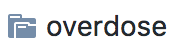
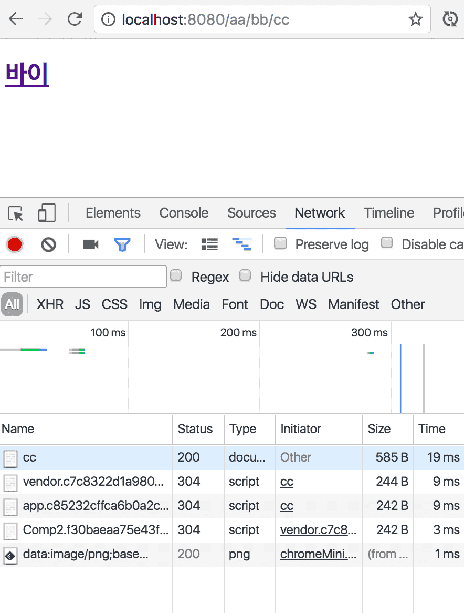
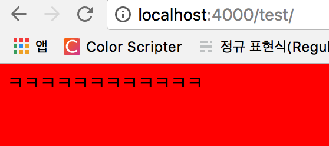

  
[깃헙 저장소로 바로가기](https://github.com/perfectacle/hexo-theme-overdose-starter)

## 만든 계기
기본적으로 헥소로 블로그 테마를 얹히는 것은 크게 어렵지 않다.  
하지만 적용한 테마를 깃헙에 올리고 다른 컴퓨터에서 다운받으려고 하면 참담한 결과를 맞이하게 된다.  
  
이유는 다음 스크린샷을 보면 알게 된다.  
  
이러한 문제점은 모든 테마에서 발생하고 있으며 .git 폴더를 삭제하면 해결되는 문제이다.  
하지만 이미 컴퓨터를 포맷한 이후라면 여태까지 커스터마이징한 내역을 복구가 불가능할 것이다. (지못미 ㅠㅠ)  
물론 .gitignore도 삭제해야 우리가 여태까지 테마를 커스터마이징한 설정 파일인 _config.yml까지 형상관리가 가능하게 된다.  

### overdose 테마의 문제점
일단 한국인이 만들었고, 테마도 깔끔하다는 점은 굉장히 높게 평가할만 하다.  
하지만 다음과 같은 문제점이 존재한다.  

**overdose에서 사용하는 패키지 중에 Node 8을 지원하지 않는 패키지가 있는데 명시돼있지 않다! (Node 7 버전 이하만 사용 가능한 테마이다.)**

또한 테마를 설치하고 테마의 디렉토리로 이동해서 항상 아래 명령어를 입력해주어야한다.([packge.json](https://github.com/HyunSeob/hexo-theme-overdose/blob/master/package.json) 참조)  
```bash
npm run clone
```
해당 명령어는 다음과 같은 역할을 한다.  
1. https://github.com/spoqa/spoqa-han-sans 저장소를 source/libs/spoqa-han-sans 폴더로 클론한다.  
이 과정이 제일 문제가 많다. 해당 저장소를 가보면 Original과 VFB_FILES 디렉토리를 보면 폰트 개발자나 관심있을 법한 폰트 관련한 파일들이 존재한다.  
우리에게 필요한 것은 웹폰트와 css 파일이 전부인데 쓸 데 없는 파일까지 클론을 받게 되는 것이다.  
뭐 이게 무슨 대수냐고 볼 수도 있는데 두 디렉토리의 용량이 각각 238MiB와 195MiB에 달한다.  
테마의 국제화를 겨냥한 것인지 일본어 폰트까지 제공해주는 테마에서 이렇게 큰 용량은 인터넷 속도가 빠른 한국에서도 부담이 될 수 밖에 없는 용량이다.  
2. https://github.com/hyunseob/noto-sans-kr 저장소를 source/libs/noto-sans-kr 폴더로 클론한다.  
이 과정에서는 2MiB 정도의 데이터만 다운받기 때문에 큰 시간은 소요되지 않는다.  

하지만 위 과정에도 역시나 문제는 존재한다.  
  
이유는 바로 클론을 받았기 때문에 해당 디렉토리 내에도 .git 디렉토리가 존재한다.  
따라서 .git 디렉토리를 지워주고 다시 올려야 나중에 클론할 때도 폰트 파일까지 정상적으로 받아오게 된다.  
~~물론 폰트파일만 400MiB가 넘을테지만...~~

아마 최신의 폰트를 제공하고자 해당 저장소의 내용을 내포하고 있는 게 아니라 클론시키게 하다보니 이런 문제점이 발생하는 것 같다.  
하지만 해당 폰트는 CJK(중국, 일본, 한국) 계열에서나 쓸 법한 폰트지 그 이외의 국가에서는 사용하지 않을 법 하므로 필수적으로 설치하지 않게 한 것은 높은 점수를 줄만하다.

## 그래서 어떻게 해결했나?  
1. overdose 테마가 저장소에 올라가지 않던 문제  
테마를 커스터마이징한 내역을 내포하게 끔 하다보니 내가 작업한 현 시점의 overdose 최신 테마를 stater 저장소에 추가하였다.  
v0.2.8이 최신이지만, 내가 업데이트하지 않는 한 해당 테마의 최신버전을 따라서 업데이트가 되긴 힘들 것이다.  
2. spoqa-han-sans 폰트의 용량이 400MiB가 넘어가던 문제  
이건 최소한으로 용량을 줄이고자 웹폰트(*.ttf 제외, 용량이 커서...)와 css 파일만 따로 뺀 저장소를 [한국어](https://github.com/perfectacle/spoqa-han-sans-kr), [일본어](https://github.com/perfectacle/spoqa-han-sans-jp) 버전으로 만들었다.  
이것도 내가 spoqa-han-sans의 업데이트에 발맞춰 갱신하지 않는 이상은 해당 버전과 발맞춰 따라가기가 힘들 것이다.  
3. 설치한 폰트가 저장소에 올라가지 않던 문제  
이 문제는 클론 받는 대신에 그냥 저장소 자체에 폰트 파일을 내장하면 되지만 그렇게 되면 두 가지 문제점이 존재한다.  
  1. 폰트를 최신 버전이 아닌 내가 저장소에 추가한 시점의 폰트만 사용이 가능하다. (그렇다고 해서 내가 폰트 파일을 계속 업데이트 할 지는 모르겠지만...)  
  2. CJK 계열이 아닌 다른 국가에서도 해당 폰트를 필수로 설치해야한다. (용량이 20MiB에 달한다. 일어만 16MiB...)

따라서 해당 문제는 클론을 받되 해당 디렉토리의 .git을 삭제하는 단계를 거치도록 하였다.  
물론 명령어로 해결하면 되지만, 윈도우 유저와 Mac 폴더 삭제부터 명령어 차이가 나기 때문에(npm scripts에서 구분은 불가능한 걸로 알고 있다.)  
node에서 지우도록 rm-git.js라는 파일을 만들었다. 클론이 끝난 이 후에 이 파일을 실행하게 된다.  

또한 폰트 설치 옵션을 다음과 같이 세분화하였다.  
왜냐하면 noto-sans-kr이나 spoqa-han-sans-kr은 각각 2MiB 남짓이라 크게 부담되지 않을 수 있는데,  
spoqa-han-sans-jp는 한자 때문인지 16MiB에 달해 부담이 될만한 용량이라 각각 나눠놨다.  
1. noto-sans-kr
2. spoqa-han-sans-kr
3. spoqa-han-sans-jp
4. 한국어 폰트(noto-sans-kr, spoqa-han-sans-kr),
5. Spoqa 폰트(spoqa-han-sans-kr, spoqa-han-sans-jp),
6. 모든 폰트(noto-sans-kr, spoqa-han-sans-kr, spoqa-han-sans-jp)

## 추가된 사항
* 정적인 html 파일들만 버전관리가 되는 문제  
  
기존 헥소 블로그에는 위와 같은 고질적인 문제가 존재한다.  
따라서 나는 이러한 문제를 해결하고자 과거에는 md나 기타 파일들을 관리하는 저장소를 따로 팠었는데 그냥 브랜치를 하나 파서 하나의 저장소에서 관리하게끔 하였다.  
그리고 새로 만든 브랜치를 default 브랜치로 정해놓으면 더 편하다.    
  
* 포트폴리오를 블로그 위에 얹기  
원래 깃헙 페이지는 블로그가 메인이 아니라 정적 페이지를 서비스하는 게 메인인 것으로 알고 있다. (아닌가...?)  
그럼 블로그 위에 포트폴리오도 얹을 수 있다는 발상이 떠오르게 된다.  
  
물론 포트폴리오는 웹서버나 DB를 사용하지 않는 동적인 페이지만 가능하다. (예를 들면 홈페이지나 웹 어플리케이션)  
이 디렉토리에 있는 파일들은 아래와 같이 접근이 가능하다.  
  
* SEO 친화적으로 만들기(검색 엔진에 노출 잘 되게 만들기)  
1. [hexo-generator-seo-friendly-sitemap](https://github.com/ludoviclefevre/hexo-generator-seo-friendly-sitemap)을 이용하여 사이트맵 만들기.  
2. [hexo-generator-feed](https://github.com/hexojs/hexo-generator-feed)을 이용하여 RSS Feed를 만들기.  
3. [hexo-autonofollow](https://github.com/liuzc/hexo-autonofollow)를 이용하여 크롤러를 위해 외부 링크에는 nofollow 속성이 달리게 끔 하기.  
4. 대표 URL(선호 URL)을 지정해주는 canonical 속성 추가하기.

## 남은 과제
overdose 테마의 컨트리뷰터가 되어 이렇게 스타터 저장소를 만들 게 아니라  
근본적인 문제를 해결하고자 해당 저장소에 pull request를 몇 개 날려봐야겠다.  
