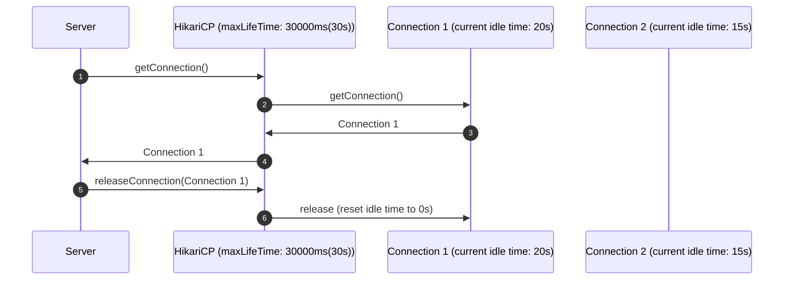
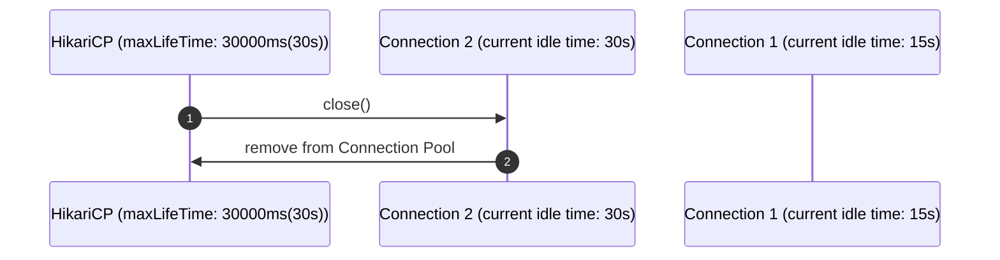
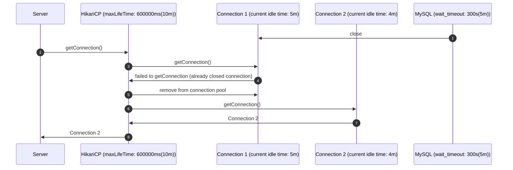
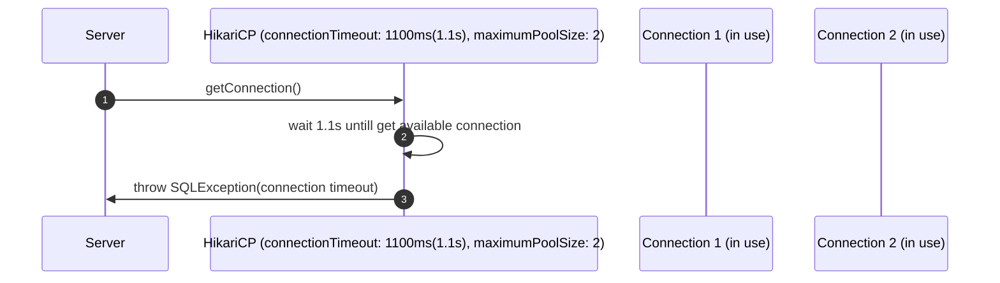
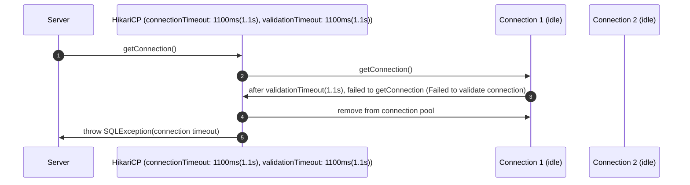
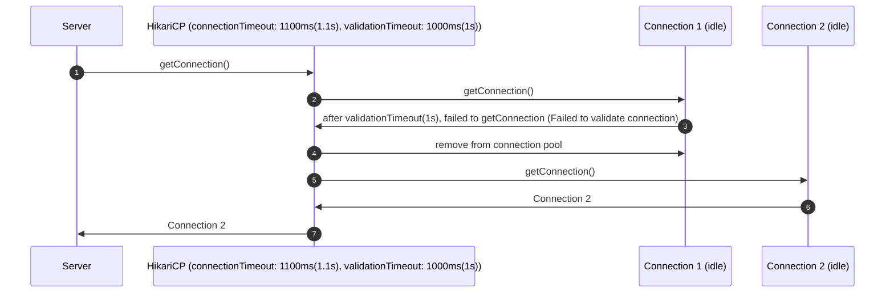
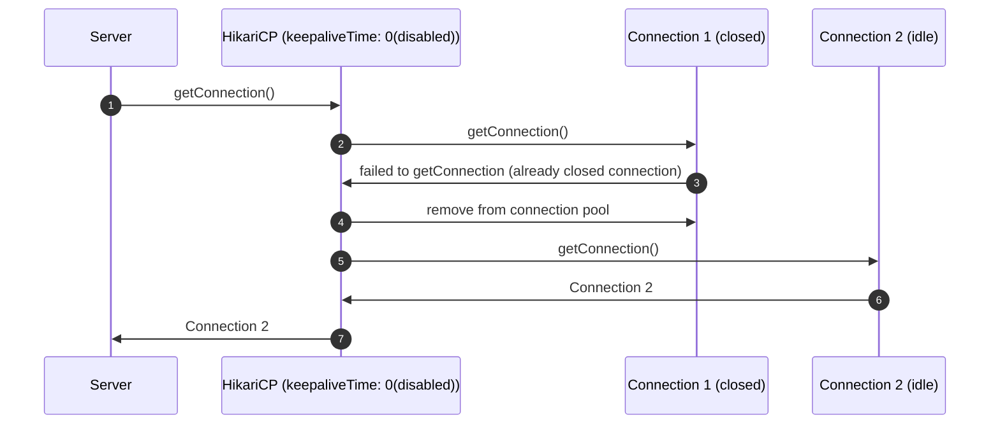
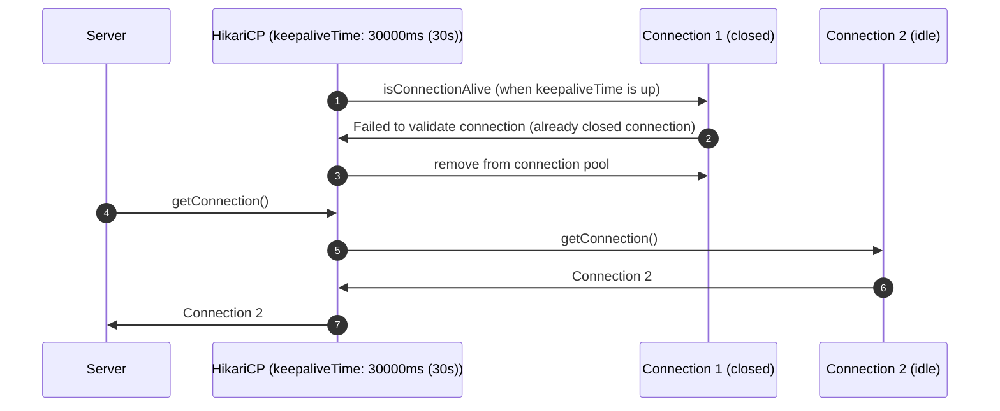

[Spring Boot 2](https://spring.io/projects/spring-boot)에서 제공하는 RDB 관련 의존성을 추가하면 DB의 커넥션 풀을 관리하기 위해 기본적으로 사용하는 [HikariCP](https://github.com/brettwooldridge/HikariCP)는 시간 관련해서 다양한 설정들이 있다.  
하지만 그냥 설명하는 것만 봐서는 무슨 내용인지 헷갈리는 설명들이 있어서 요번에 프로젝트에 도입된 설정들을 포함해 몇가지 정리를 해보았다.

## maxLifeTime
> ⏳maxLifetime
  This property controls the maximum lifetime of a connection in the pool. 
  An in-use connection will never be retired, only when it is closed will it then be removed. 
  On a connection-by-connection basis, minor negative attenuation is applied to avoid mass-extinction in the pool. 
  We strongly recommend setting this value, and it should be several seconds shorter than any database or infrastructure imposed connection time limit. 
  A value of 0 indicates no maximum lifetime (infinite lifetime), subject of course to the idleTimeout setting. 
  The minimum allowed value is 30000ms (30 seconds). Default: 1800000 (30 minutes)

커넥션 풀에서 idle 커넥션이 최대 얼마동안 생존할 수 있냐는 설정이다. (단위는 ms, 기본값은 30분, 최소값은 30초, 0으로 설정하면 무제한)  
반환될 때마다 idle time은 다시 0으로 초기화 될테니 트래픽이 많이 들어와서 커넥션이 계속 사용되는 서비스라면 이 설정에 의해 커넥션이 종료될 일은 적을 것이다.


히카리 CP에서 커넥션을 가져오고 반납하는 과정을 대략적으로 그려보면 위와 같을 것이다.  
커넥션 풀에 있는 idle 커넥션을 가져와서 사용하고 반납할 때는 idle time을 다시 0으로 초기화해서 반납하는 것이다.

위와 같은 상황에서 15초가 지났다고 할 때 어떻게 될까...??


HikariCP에서는 내부적으로 maxLifeTime에 도달한 idle conenection을 종료하고 커넥션 풀에서 제거하는 스케쥴러가 돌고 있다.  
그리고 커넥션들이 동시에 종료돼서 성능 상 이슈를 유발하는 것을 방지하고자 각 커넥션 사이에 ms 단위의 차이를 두고 순차적으로 종료시키고 있다.  
자세한 내용은 다음 블로그에 나와있다.
[HikariCP는 test-while-idle과 같은 커넥션 갱신 기능이 없을까?](https://pkgonan.github.io/2018/04/HikariCP-test-while-idle#hikaricp-%EA%B0%9C%EB%B0%9C%EC%9E%90%EB%8A%94-%EC%99%9C-test-while-idle%EC%9D%84-%EB%B0%98%EB%8C%80%ED%95%A0%EA%B9%8C)

### maxLifeTime을 DBMS의 wait_timeout 보다 길게 설정한 경우
maxLifeTime을 지나치게 길게 설정했거나 아무런 설정도 하지 않았을 경우에 가끔 아래와 같은 warn 로그를 보게 된다. (주로 트래픽이 없는 어드민 류의 서버에서 종종 발생했던 거 같다.)  
```text
hikari-pool - Failed to validate connection com.mysql.cj.jdbc.ConnectionImpl@1e2db70 (No operations allowed after connection closed.).  
Possibly consider using a shorter maxLifetime value.
```

위 로그는 DB에 설정한 wait_timeout(DBMS마다 파라미터 이름은 다를 수 있다.) 보다 maxLifeTime을 길게 줬을 경우 발생할 수 있다. (여기서는 MySQL을 사용한다고 가정하고 설명한다.)
MySQL의 경우 아래와 같이 쿼리를 날려서 [wait_timeout](https://dev.mysql.com/doc/refman/5.7/en/server-system-variables.html#sysvar_wait_timeout)을 확인해볼 수 있다. (기본값은 28800(s)로 8시간이다.)
```sql
show global variables like 'wait_timeout' 
```

MySQL의 wait_timeout 기본값은 8시간이고, maxLifeTime의 기본값은 30분이라서 발생하지 않을텐데 MySQL의 wait_timeout이 maxLifeTime 보다 짧을 때 어떻게 동작하는지 알아보자.


MySQL에서는 wait_timeout에 도달한 idle connection을 끊어버린다.  
하지만 MySQL은 해당 커넥션을 어떤 어플리케이션에서 사용하는지 모르니 해당 어플리케이션에도 커넥션을 사용하지 말라는 패킷을 보낼 수 없다.  
따라서 우리가 짠 어플리케이션에는 HikariCP에 아직도 종료된 커넥션이 남아있는 것이다.  
이 때 우리가 해당 커넥션을 풀에서 꺼내려고 하면 warn 로그가 뜨는 것이다.  
하지만 warn 로그이기 때문에 유효한 connection을 제대로 획득했다면 서비스 장애로까지 전파되지는 않을 것이다. (connection 획득에 실패했으면 다른 에러로그가 찍혔을 것이다.)  
따라서 warn 로그에 나와있는대로 maxLifeTime을 줄여야한다. (네트워크 지연 등등을 고려하여 wait_timeout 보다 2~3초 정도 짧게 잡아주는 걸 권장하는 것으로 알고 있다.)
위 warn 로그에 대한 내용도 다음 블로그에 자세하게 나와있다.  
[HikariCP Failed to Validate Connection Warning 이야기](https://jaehun2841.github.io/2020/01/08/2020-01-08-hikari-pool-validate-connection)

## connectionTimeout
> ⏳connectionTimeout 
  This property controls the maximum number of milliseconds that a client (that's you) will wait for a connection from the pool. 
  If this time is exceeded without a connection becoming available, a SQLException will be thrown. 
  Lowest acceptable connection timeout is 250 ms. Default: 30000 (30 seconds)

커넥션을 맺는데 걸리는 시간을 의미하며 이 시간은 단순히 하나의 물리적인 커넥션을 맺는데 걸리는 시간을 의미하는 게 아니라 [커넥션 풀에서 커넥션을 획득하는데 걸리는 시간](https://github.com/brettwooldridge/HikariCP/blob/dev/src/main/java/com/zaxxer/hikari/pool/HikariPool.java#L136-L176)을 의미한다.


### 더이상 커넥션을 맺지 못하는 상황에 도달했는데 connectionTimeout 내에 유효한 커넥션을 획득하지 못하는 경우
커넥션 풀에 유효한 커넥션이 없으면 새로운 커넥션을 맺게 되는데 maximumPoolSize 등에 도달하는 등의 상황에 의해 더이상 커넥션을 맺지 못하게 될 가능성이 있다.  
이런 상황에 어떻게 되는지 한 번 살펴보자.



유효한 커넥션을 획득하지 못해 DB를 사용하지 못하는 상황이기 때문에 아마 해당 API는 제대로 처리하지 못하고, 이런 상황이 오래 유지되면 전면 장애도 발생할 수 있을 것이다.
이런 상황이 발생하는데는 아래와 같은 이유 등등이 있을 것이다.
1. 장기간 커넥션을 물고 있을만한 상황은 없는지?
   1. 슬로우 쿼리가 발생해서 커넥션을 오래 물고 있는 커넥션은 없는지? 이런 경우 슬로우 쿼리의 원인을 찾아서 해결해야한다.  
      슬로우 쿼리 로그를 남기고 있지 않다면 access log 등등을 통해 당시 오래 걸렸던 API를 찾는다던지 해서 오래 걸리는 쿼리의 explain을 떠서 원인도 분석해보자. (올바른 index를 타지 않아 풀 텍스트 스캔을 돌고 있었다던지...?) 
   2. 롱 트랜잭션(트랜잭션 안에서 외부 API 호출과 같이 오래 걸리는 작업을 한다던지)으로 인해 커넥션을 오래 유지하고 있다던지?  
      트랜잭션의 범위를 최소화하여야한다. 
      하나의 큰 트랜잭션이 아닌 작은 범위의 트랜잭션으로 잘게 쪼개고, 각 트랜잭션을 보장할 수 있도록 별도의 상태를 더 두고 수동 롤백 전략(롤백 코드 직접 작성)을 취해야할 수도 있다.
   3. OSIV(Open Session In View)에 의해 커넥션을 과도하게 물고있는 것은 아닌지...? 
      스프링 부트 1부터 2까지 [OSIV는 기본값으로 활성화](https://github.com/spring-projects/spring-boot/blob/main/spring-boot-project/spring-boot-autoconfigure/src/main/java/org/springframework/boot/autoconfigure/orm/jpa/JpaBaseConfiguration.java#L213) 돼있다.
      그리고 Spring Data JPA에서 Hibernate를 사용할 경우 Hibernate의 기본값을 덮어씌우는 것들이 존재한다. 
      Spring Boot 2.x의 Spring Data JPA에서 기본적으로 사용하는 Hibernate 5.2+의 [커넥션 핸들링 전략(PhysicalConnectionHandlingMode)](https://github.com/hibernate/hibernate-orm/blob/5.2/hibernate-core/src/main/java/org/hibernate/resource/transaction/backend/jta/internal/JtaTransactionCoordinatorBuilderImpl.java#L39-L42)은 [DELAYED_ACQUISITION_AND_RELEASE_AFTER_STATEMENT](https://github.com/hibernate/hibernate-orm/blob/5.2/hibernate-core/src/main/java/org/hibernate/resource/jdbc/spi/PhysicalConnectionHandlingMode.java#L42)이다. (최대한 커넥션을 늦게 획득하고 트랜잭션이 종료되기 전에도 SQL 문이 하나 종료될 때마다 커넥션을 반납하는 전략)
      하지만 Spring Boot 2.x에서는 Hibernate의 기본값을 무시하고 [DELAYED_ACQUISITION_AND_HOLD로 덮어씌우고](https://github.com/spring-projects/spring-framework/blob/5.3.x/spring-orm/src/main/java/org/springframework/orm/jpa/vendor/HibernateJpaVendorAdapter.java#L159-L162) 있다. (최대한 커넥션을 늦게 획득하고 요청이 끝나는 시점인 엔티티매니저가 close 되는 시점에 커넥션풀에 커넥션을 반납하는 전략)  
      위 전략은 DELAYED_ACQUISITION이기 때문에 엔티티 매니저가 생성되는 시점인 컨트롤러가 요청을 받는 시점에는 커넥션을 획득하지 않는다.  
      커넥션이 정말 필요한 트랜잭션을 만난다던지, 쿼리를 날려야하는 상황이 올 때만 비로소 커넥션을 획득한다.
      그리고 트랜잭션이 끝나거나 단건 쿼리가 종료됐음에도 불구하고 Lazy 로딩된 엔티티를 언제 조회하게 될지 모르기 때문에 커넥션을 다시 반납하지 않는 것 같다.  
      하지만 이로 인해 커넥션을 과도하게 오래 물고 있을 수 있기 때문에 커넥션 풀 고갈을 유발해서 장애가 발생할 수 있다.
      따라서 OSIV를 킨 상황에서는 PhysicalConnectionHandlingMode를 DELAYED_ACQUISITION_AND_RELEASE_AFTER_TRANSACTION(최대한 늦게 획득하고 트랜잭션 종료 즉시 반납)을 설정하는 게 커넥션 풀 고갈을 방지할 수 있다.  
      근본적으로 OSIV를 비활성화 시키면 굳이 PhysicalConnectionHandlingMode를 따로 설정할 필요가 없지만 이미 운영중인 서비스의 OSIV를 비활성화 시키면 런타임에 언제 장애([LazyInitializationException](https://docs.jboss.org/hibernate/core/3.5/api/org/hibernate/LazyInitializationException.html))를 맞을지 모르니 추천하지 않는다.
2. 커넥션풀 사이즈(maximumPoolSize)를 너무 작게 유지한 건 아닌지?
   내가 생각하기에는 트래픽이 얼마 안 들어올 줄 알고 DB 자원을 아끼려고 커넥션풀 사이즈를 작게 잡았는데 이로 인해 커넥션풀 고갈이 생각보다 빨리 발생할 수 있다.  
   평상시 트래픽/피크 시간의 트래픽 추이를 분석해서 적절한 사이즈를 지정해주자 (물론 단일 서버로 서비스할 때는 계산하기 쉽겠지만 여러 서버에서 서비스하면 좀 더 복합적인 요소를 계산해야할 것이다.)
3. connectionTimeout을 너무 짧게 유지한 건 아닌지?
   예제에서는 1.1초(1초 안에 DB 서버에서 syn+ack가 오지 않으면 OS 레벨에서 TCP Syn Retransmission을 하기 때문에 한 번 정도 TCP 3Way Handshake를 더 하게 된다, 물론 OS 설정에 따라 Retransmission 주기는 다르지만 대부분의 리눅스는 1초였던 걸로 기억한다.)로 지정했다.  
   하지만 어플리케이션 서버와 DB 서버의 네트워크가 불안정하거나 물리적 거리가 멀다던지, 아니면 그다지 빠른 응답을 보장할 필요가 없는 서비스(내부 스케쥴러에서 돈다던지)라면 connectionTimeout을 늘리는 것도 고려해보아야한다. 

## validationTimeout
> ⏳validationTimeout
  This property controls the maximum amount of time that a connection will be tested for aliveness. 
  This value must be less than the connectionTimeout. 
  Lowest acceptable validation timeout is 250 ms. Default: 5000

커넥션의 유효성(사용 가능한 상태인지)을 검사하는데 걸리는 최대 마지노선 시간이라고 보면 된다. (기본값은 5초이고, 최소값은 250ms)  
그리고 connectionTimeout 보다 짧게 유지해야한다고 하는데 HikariCP의 커넥션 유효성 검증 전략을 우선 짚고 이해해야한다.

다른 DB Connection Pool에서는 idle connection을 계속 유지하려고 select 1과 같은 무의미한 쿼리를 지속적으로 날려서 커넥션을 유지한다.  
HikariCP에서는 이런 것조차 오버헤드(여러 대의 서버에서 여러 커넥션이 주기적으로 쿼리를 날리면 생각보다 오버헤드가 클 수도 있다.)라고 판단하는 듯하다. (관련 이슈: [https://github.com/brettwooldridge/HikariCP/issues/766](https://github.com/brettwooldridge/HikariCP/issues/766))
따라서 HikariCP에서는 주기적으로 쿼리를 날리지 않는다.  
대신 [JDBC4 이상의 드라이버를 사용한다면 단순한 validation 패킷 정도만 날리는 것](https://github.com/brettwooldridge/HikariCP/blob/2.4.x/src/main/java/com/zaxxer/hikari/pool/PoolBase.java#L142-L148)만으로도 커넥션의 유효성을 검사할 수 있다.  

아래 상황에 대해서 커넥션의 유효성을 검사한 이후에 아직 커넥션이 끊기지 않은 상태이니 사용 가능한 커넥션이라 판단해서 풀에 남기던지, 아니면 제거하던지 하게 된다.
1. 커넥션을 DB에서 새로 맺을 때
2. 커넥션 풀에서 커넥션을 획득할 때
3. 커넥션의 idle time이 keepaliveTime에 도달했을 때

참고로 validationTimeout이 발생하면 `Failed to validate connection com.mysql.cj.jdbc.ConnectionImpl@63123dfa (No operations allowed after connection closed.). Possibly consider using a shorter maxLifetime value.` 요런 warn 로그가 발생하곤 한다.
해당 로그 이후에 커넥션 획득에 실패했다는 에러 로그 같은 게 남지 않았으면 서비스가 장애까지 이어지지 않았다고 판단하면 된다.  
저 로그 이후 connectionTimeout 이내에 유효한 커넥션을 획득했으니 에러로그가 남지 않았을 거다.
validationTimeout은 정말 작은 패킷을 주고 받기 때문에 어지간해서 발생하지 않는데 아래 상황에 발생할 수 있다.  
다만 warn이기 때문에 너무 자주 발생하는 게 아니면 즉각 조치가 필요하지는 않을 것 같고, noise라고 느껴질 정도로 과하게 느껴지면 connectionTimeout과 validationTimeout을 함께 조금씩 늘려보는 것도 고려해보아야한다.
1. 네트워크가 불안정하거나
2. DB 서버에서 어떤 사유에 의해 연결을 먼저 끊은 상황이거나
3. 물리적으로 거리가 먼데 비해 과도하게 짧게 잡았거나

근데 connectionTimeout과 validationTimeout은 어떤 상관관계가 있기에 validationTimeout을 더 짧게 설정하라는 걸까?  

### validationTimeout이 connectionTimeout 보다 짧지 않은 경우

validationTimeout이 connectionTimeout 보다 짧지 않기 때문에 오롯이 커넥션 하나가 살아있는지 확인하느라 시간을 다 쓸 수 있다.  
빠르게 validation을 멈추고 다음 커넥션 획득을 시도했더라면 성공할 수도 있지 않았을까...??

### validationTimeout이 connectionTimeout 보다 짧은 경우

위에 얘기했던대로 validationTimeout을 너무 과하게 잡아서 다른 커넥션 획득 시도의 기회조차 잃어버릴 수 있기 때문에  
이를 방지하고자 validationTimeout이 connectionTimeout 보다 짧게 설정하면 커넥션 획득 시도를 여러 번 할 수 있기 때문에 장애를 방지할 수도 있다.  
하지만 그렇다고 해서 connectionTimeout을 너무 길게 잡으면 우리 시스템은 온전히 처리했지만 클라이언트 측 시스템에서 Read Timeout이 발생할 수 있으니 이 부분은 상황에 맞게 설정해야한다.

## keepaliveTime
> ⏳keepaliveTime
  This property controls how frequently HikariCP will attempt to keep a connection alive, in order to prevent it from being timed out by the database or network infrastructure. 
  This value must be less than the maxLifetime value. 
  A "keepalive" will only occur on an idle connection. 
  When the time arrives for a "keepalive" against a given connection, that connection will be removed from the pool, "pinged", and then returned to the pool. 
  The 'ping' is one of either: invocation of the JDBC4 isValid() method, or execution of the connectionTestQuery. 
  Typically, the duration out-of-the-pool should be measured in single digit milliseconds or even sub-millisecond, and therefore should have little or no noticible performance impact. 
  The minimum allowed value is 30000ms (30 seconds), but a value in the range of minutes is most desirable. Default: 0 (disabled)

idle connection에 대해서 keepaliveTime에 도달하면 주기적으로 커넥션의 유효성을 검증한다. (최소값은 30분, 기본값은 비활성화(0)이다.)  
커넥션이 살아있다고 해도 idle time이 0으로 초기화 되는 건 아니고 그냥 커넥션이 잘 살아있는지 확인하는 것 뿐이다.  

idle connection은 다양한 사유에 의해 DB 서버로부터 먼저 커넥션이 끊길 수 있다.  
1. maxLifeTime이 DBMS의 wait_timeout 보다 긴 경우
2. DB 서버의 리소스 부족 등등으로 인해 불필요한 idle 커넥션을 종료시키는 경우

### keepaliveTime을 설정하지 않은 경우
위와 같이 DB 서버에서 먼저 커넥션을 끊은 경우 아래와 같은 오버헤드가 발생할 수 있다.

Connection 1은 이미 종료됐기 때문에 굳이 커넥션 획득을 할 필요가 없었다.  
하지만 HikariCP는 그 사실을 모르기 때문에 Connection 1 획득 절차가 끼어들게 되고 이 시간만큼 지연이 발생해서 혹시 connectionTimeout이 발생한다고 하면 장애가 발생할 수도 있다.

### keepaliveTime을 설정한 경우
keepaliveTime을 설정하지 않았을 때의 문제는 커넥션이 종료됐다는 사실을 트래픽을 받은 시점에 알게 된다는 것이다.  
트래픽을 받았을 때는 최대한 빠른 응답성을 보장해야하는데 저런 자잘한 것들로 인해 빠른 응답성을 보장하지 못하거나 장애를 유발할 수도 있게 된다. (간헐적일 수도 있겠지만...)  

그럼 keepaliveTime을 설정했을 때 어떤 장점이 있는지 알아보자.


트래픽을 받기 전부터 Connection 1의 종료사실을 인지하고 커넥션 풀에서 제거했기 때문에 트래픽이 들어왔을 때는 바로 유효한 커넥션인 Conenction 2부터 획득을 시도했다.  
사소하고 찰나의 시간으로 인식할 수도 있지만 대용량 트래픽에서 이런 것들이 쌓이게 됐을 때 힘을 발휘할 수 있을 것 같다.  
또한 DB에 뭔가 문제가 있다는 상황, 혹은 네트워크가 불안정하다는 상황을 트래픽을 받은 시점이 아닌 미리 파악할 수 있다는 장점도 존재한다.
서버가 엄청 많이 떠있는 서버는 keepaliveTime을 너무 짧게 설정하면 오히려 그게 오버헤드를 유발할 수도 있기 때문에 적절한 튜닝이 필요한 것 같다.

## 마치며
처음에는 maxLifeTime과 connectionTimeout 정도만 신경썼는데 DevOps(SRE 겸임) 개발자 분께서 올려주신 PR을 보고 저 설정은 도대체 무엇일까... 하고 고민하면서
질문하고 공부하면서 정리한 내용이 머릿속으로는 어느정도 있었는데 그림으로 한 번 그려보니 어떤 상황에 문제가 있고 어떤 문제를 해결하는지 좀 더 명쾌해진 것 같다.  
아직 보지도 못한 설정들도 많을텐데 이런식으로 정복해나가면 그래도 조금이나마 더 나은 엔지니어가 되지 않을까? 싶다. 

## 참조 링크
* [HikarCP Github](https://github.com/brettwooldridge/HikariCP)
* [MySQL Server System Variables](https://dev.mysql.com/doc/refman/5.7/en/server-system-variables.html#sysvar_wait_timeout)
* [HikariCP는 test-while-idle과 같은 커넥션 갱신 기능이 없을까?](https://pkgonan.github.io/2018/04/HikariCP-test-while-idle#hikaricp-%EA%B0%9C%EB%B0%9C%EC%9E%90%EB%8A%94-%EC%99%9C-test-while-idle%EC%9D%84-%EB%B0%98%EB%8C%80%ED%95%A0%EA%B9%8C)
* [HikariCP Failed to Validate Connection Warning 이야기](https://jaehun2841.github.io/2020/01/08/2020-01-08-hikari-pool-validate-connection)
