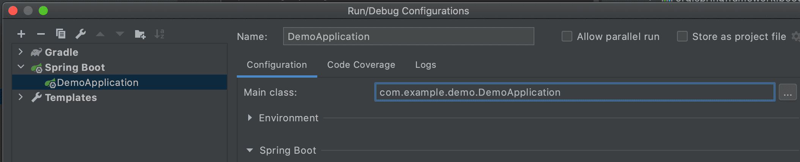

```kotlin
dependencies {
    compileOnly("org.springframework.boot:spring-boot-starter-web:2.4.0")
}
```

runtime classpath에는 추가되지 않아서 원래는 `java.lang.ClassNotFoundException`이 나야 정상이다.
하지만 IntelliJ의 Spring Boot Configuration으로 실행하면 실행이 잘만 된다.


실제로 classpath를 찍어보면 아래와 같이 spring-boot-starter-web을 포함하고 있다.
```kotlin
fun main(args: Array<String>) {
    val property = System.getProperty("java.class.path")
    println(property)
    runApplication<DemoApplication>(*args)
}
```
```
/Users/perfectacle/IdeaProjects/demo/build/classes/kotlin/main:
/Users/perfectacle/IdeaProjects/demo/build/resources/main:
/Users/perfectacle/.gradle/caches/modules-2/files-2.1/org.jetbrains.kotlin/kotlin-stdlib-jdk8/1.4.10/998caa30623f73223194a8b657abd2baec4880ea/kotlin-stdlib-jdk8-1.4.10.jar:
/Users/perfectacle/.gradle/caches/modules-2/files-2.1/org.springframework.boot/spring-boot-starter-web/2.4.0/4bdd422c370d1d66ffc12ecafdecc70cad406367/spring-boot-starter-web-2.4.0.jar:
/Users/perfectacle/.gradle/caches/modules-2/files-2.1/org.jetbrains.kotlin/kotlin-stdlib-jdk7/1.4.10/30e46450b0bb3dbf43898d2f461be4a942784780/kotlin-stdlib-jdk7-1.4.10.jar:
/Users/perfectacle/.gradle/caches/modules-2/files-2.1/org.jetbrains.kotlin/kotlin-stdlib/1.4.10/ea29e063d2bbe695be13e9d044dcfb0c7add398e/kotlin-stdlib-1.4.10.jar:
...
```
하지만 spring boot gradle plugin을 사용하여 bootRun Task를 실행하면 클래스패스가 아래와 같이 spring-boot-starter-web을 포함하고 있지 않는다.

```
/Users/perfectacle/IdeaProjects/demo/build/classes/java/main:
/Users/perfectacle/IdeaProjects/demo/build/classes/kotlin/main:
/Users/perfectacle/IdeaProjects/demo/build/resources/main:
/Users/perfectacle/.gradle/caches/modules-2/files-2.1/org.jetbrains.kotlin/kotlin-stdlib-jdk8/1.4.10/998caa30623f73223194a8b657abd2baec4880ea/kotlin-stdlib-jdk8-1.4.10.jar:
/Users/perfectacle/.gradle/caches/modules-2/files-2.1/org.jetbrains.kotlin/kotlin-stdlib-jdk7/1.4.10/30e46450b0bb3dbf43898d2f461be4a942784780/kotlin-stdlib-jdk7-1.4.10.jar:
/Users/perfectacle/.gradle/caches/modules-2/files-2.1/org.jetbrains.kotlin/kotlin-stdlib/1.4.10/ea29e063d2bbe695be13e9d044dcfb0c7add398e/kotlin-stdlib-1.4.10.jar:
/Users/perfectacle/.gradle/caches/modules-2/files-2.1/org.jetbrains.kotlin/kotlin-stdlib-common/1.4.10/6229be3465805c99db1142ad75e6c6ddeac0b04c/kotlin-stdlib-common-1.4.10.jar:
/Users/perfectacle/.gradle/caches/modules-2/files-2.1/org.jetbrains/annotations/13.0/919f0dfe192fb4e063e7dacadee7f8bb9a2672a9/annotations-13.0.jar
```
실제 build된 jar 파일을 실행했을 때는 classpath 내에 spring-boot-starter-web jar 파일이 없기 때문에 서버가 뜨지도 않기 때문에 bootRun task의 클래스패스가 더 리얼월드에 가깝다.
따라서 인텔리제이에서 돌려봤을 때 서버 뜬다고 신나하면 안 되고 gradle의 bootRun task까지 돌려봐야 가장 정확할 것 같다. (test code도 마찬가지일 듯??)