[Java Virtual Threads 훑어보기](/2022/12/29/look-over-java-virtual-threads/)에서 Virtual Thread에 대해 대충 훑어봤었고, 2023/09/19에 나오는 [JDK21(심지어 LTS)](https://openjdk.org/projects/jdk/21/)에서 [Virtual Threads (JEP 444)](https://openjdk.org/jeps/444)가 정식으로 출시된다는 소식을 들었다.  
그러다보니 코틀린의 코루틴의 소식이 궁금했다.

출처: https://www.youtube.com/live/QxxG66eQoTc?feature=share&t=3652  
많은 사람들이 Virtual Thread가 코루틴과 같은 역할을 할 수 있을지 궁금해하는 것 같았고, 나 또한 코루틴을 잘 모르는 입장에서 '결국 코루틴은 사장되는 게 아닐까?'란 생각이 들었다.

그러던 중 [Coroutines and Loom behind the scenes by Roman Elizarov](https://www.youtube.com/live/QxxG66eQoTc?feature=share&t=3652)라는 영상을 보게 되어서 이해한 내용을 겸사겸사 정리해보았다. (나중에 회사에서 Virtual Thread 적용 할 때 고민해야할 부분도 함께 적어두기 위해서도 있지만...)  
우선 해당 포스트에서는 Virtual Thread에 대한 기본적인 내용들은 알고 있다는 전제 하에 작성했다.


## 간단 요약

가상 쓰레드는 요청 당 쓰레드 하나를 만드는 모델(Spring WebMVC 같은)에 적합하고, 이미 존재하는 코드를 재사용할 수 있다는 장점이 있다.  
코루틴은 높은 동시성(동시에 여러 요청을 보내서 응답을 받은 후 머지를 한다던지)을 요구하거나 Event 기반 시스템(유저의 이벤트를 받아서 UI를 제어해야한다던지)이나 Hierarchy가 있는 작업(Strucured Concurrency)을 처리하거나 취소해야하는 경우에 적합하다.

## Virtual Thread 간단히 훑어보기

우선 Virtual Thread는 기존에 존재하던 java.lang.Thread API의 최소한의 변경만을 목표로 하고, 서버 사이드에서 1 Request에 1 Thread를 사용하는 모델(Spring WebMVC 같은)에서 최적화가 잘 되는 걸 목표로 삼고 있다.  

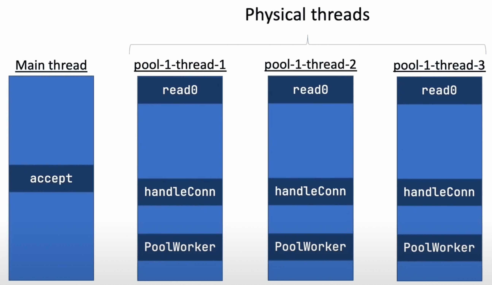
그래서 이렇게 전통적인 방식으로 코드를 짜게 되면 요청이 여러번 들어왔을 때 OS의 Thread와 매칭되는 실제 쓰레드가 생성되고, Blocking I/O를 만나는 순간 쓰레드가 블락되고, 다른 쓰레드로 CPU의 제어권이 넘어가면서 컨텍스트 스위칭이 발생한다.  

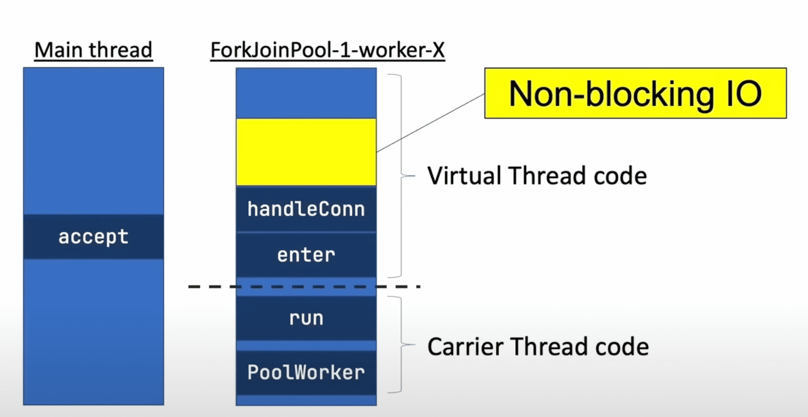

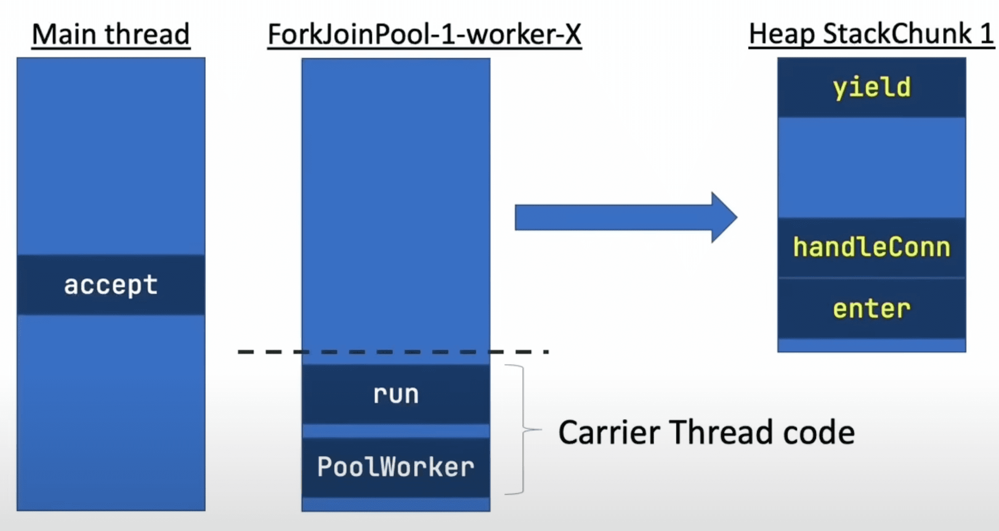
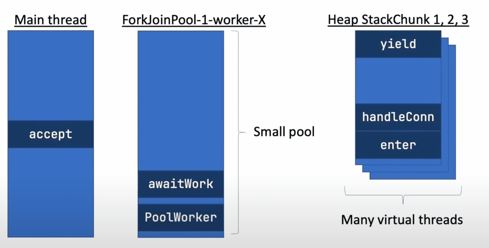
Virtual Thread 방식은 OS의 Thread와 매칭되는 실제 쓰레드는 조금만(컨텍스트 스위칭 비용을 줄이기 위해 기본적으로 CPU 코어 갯수 정도)만 만들고, 필요할 때마다 가상 쓰레드를 만든다.  
그리고 가상 쓰레드 내에서도 Blocking I/O를 만나는 순간 쓰레드가 블락되지만, 가상 쓰레드만 블락이 되고 실제 쓰레드는 블락되지 않는다.  
그리고 다른 가상 쓰레드로 컨텍스트 스위칭을 하는데 이 때 실제 쓰레드 전환이 일어나는 게 아니기 때문에 컨텍스트 스위칭 비용이 매우 적다.  

  
하지만 가상 쓰레드에도 다음과 같은 두 가지 상황에서 Carrier Thread가 블락당할 수 있다. 
1. native method(JNI 같은)를 호출하는 경우에 Blocking I/O를 만나도 다른 가상 쓰레드로 yield를 하지 않는다. 가상 쓰레드에서 yield 하는 역할은 JVM에서 할 역할인데 native method는 JVM에서 실행되는 것이 아니기 때문에 JVM이 알 수가 없다.  
2. synchroized block을 만나는 경우에도 Blocking I/O를 만나도 다른 가상 쓰레드로 yield를 하지 않는다. synchronized block은 실제 쓰레드인 Carrier Thread 전체를 synchronized block에 진입시키기 때문에 다른 가상 쓰레드로 yield를 시킬 수가 없다.  
> Instead, avoid frequent and long-lived pinning by revising synchronized blocks or methods that run frequently and guard potentially long I/O operations to use java.util.concurrent.locks.ReentrantLock instead. 
> There is no need to replace synchronized blocks and methods that are used infrequently (e.g., only performed at startup) or that guard in-memory operations.
> ...
> In a future release we may be able to remove the first limitation above, namely pinning inside synchronized. The second limitation is required for proper interaction with native code.
> https://openjdk.org/jeps/444#Executing-virtual-threads

이렇게 쓰레드가 핀(가상 쓰레드가 고정돼서 다른 가상 쓰레드로 전환되지 않는 현상) 되지 않으려면 synchronized 대신 ReentrantLock의 사용을 권장하고 있고,  
아주 가끔 호출되는(초기 설정 같은) 경우나 아주 짧은 시간동안만 점유하는 경우(메모리 내의 변수만 조작한다던지)에는 굳이 synchronized를 바꿀 필요가 없다고 한다.  
만약 본인이 사용하는 라이브러리/프레임워크에서도 synchronized를 어디서 어떻게 사용하는지 보고 문제가 없는지 확인도 해야한다.
PostgreSQL JDBC Driver 같은 경우에도 [synchronized를 ReentrantLock으로 바꾸는 작업](https://github.com/pgjdbc/pgjdbc/issues/1951)을 하고 있다.
그리고 이런 제약들이 추후 수정된다는데 언제 수정될 지도 모르고, LTS가 아닌 이상 회사에서 해당 버전을 쓰다가 안정성에 문제가 생겨도 서포트 기간이 끝나면 업데이트가 올라오지 않을 수도 있다보니 우선은 조심해서 써야한다.  

## 코루틴 간단히 훑어보기

코루틴은 기존에 존재하는 다양한 비동기 API들(Java NIO, 다양한 Future 구현체 등등)을 래핑해서 사용하기 쉽게 만들고, 다른 라이브러리들에 의존성을 가지지 않으며, async/await를 사용하는 케이스나 generator 블럭(아마 둘 다 ECMAScript에 있는 내용을 얘기하는 것 같음)를 커버하는 것을 목표로 하고 있다. 

## Virtual Thread vs 코루틴
### Use case
  
  
그러다보니 가상 쓰레드는 Thread에, Coroutine은 비동기에 더욱 집중하고 있으며 가상 쓰레드는 서버 사이드에서 외부 네트워크를 콜 하는 경우 등등에 적합한 반면, 코루틴은 다양한 동시성 이슈(UI에 다양한 애니메이션 이벤트가 돌아가야하는 경우, 서버 사이드에서 다른 서비스에 동시에 요청을 보내서 응답을 머지해야하는 경우 등등)를 다뤄야하는 복잡한 케이스에 적합하다고 한다.

### 프로그래밍 스타일
  
virtual thread 같은 경우에는 중간에 Blocking I/O를 만나더라도 다른 가상 쓰레드로 스위칭 될 거기 때문에 그냥 동기 방식으로 코드 짜듯이 순차적으로 짜면 된다.  

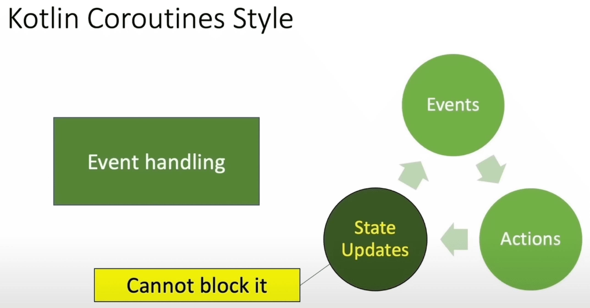
반면 코루틴은 이벤트를 핸들링하는 방식으로 코드를 많이 짜기 때문에 상태를 업데이트 하는 부분에 Blocking I/O를 넣어선 안 된다.  
그러면 다음 이벤트를 핸들링 할 수 없기 때문에 UI가 멈추는 현상이 발생하거나 서버 사이드에서 다른 서비스에 요청을 보내서 응답을 머지하는 경우에도 블락이 발생한다면 다른 요청을 보내지 못하게 되거나 할 수도 있다.

  
그리고 코틀린은 suspend function과 일반 function을 구분하는 게 매우 중요하다고 하는데 아마 suspend function으로 진입하는 순간 다른 코루틴 스코프에게 제어권을 양보하기 때문에 로컬에서 아주 짧은 시간 동안 처리하고 끝낼 수 있음에도 불구하고, 다시 제어권을 획득할 때까지 기다려야하기 때문에 처리 속도가 느려질 수 있는 이유 때문이 아닐까 싶다.

  
그리고 코루틴은 자식/부모 코루틴 스코프와 같이 구조화된 코루틴을 사용할 수도 있고, 특정 코루틴 스코프의 실행을 취소 시켜버리거나 에러를 핸들링하기 쉽다는 점도 존재한다.

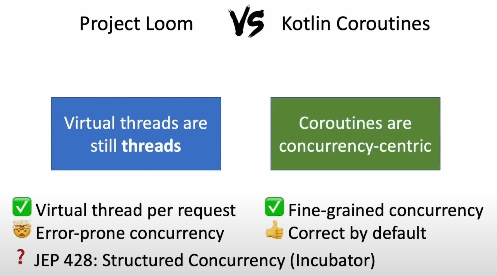  
물론 가상 쓰레드도 incubating 단계이긴 하지만 [JEP 428: Structured Concurrency](https://openjdk.org/jeps/428)에서 위에서 언급한 코루틴의 에러 핸들링이나 취소 기능을 지원하려고 하고 있다.

### 내부 구현
  
  
가상 쓰레드는 Blocking I/O가 발생하여 yield 메서드가 실행되는 순간 가상 쓰레드가 들고있던 정보들(로컬 변수, 쓰레드 로컬 변수, 콜스택 정보 등등)을 힙메모리에 올리는 과정이 진행된다.  
그리고 나서 다른 가상 쓰레드가 Carrier Thread를 점유하게 되는데 실제 쓰레드는 스위칭 된 게 아니기 때문에 우리가 알고 있는 컨텍스트 스위칭에 비해서는 쓰레드 스위칭 비용이 훨씬 싸다.  

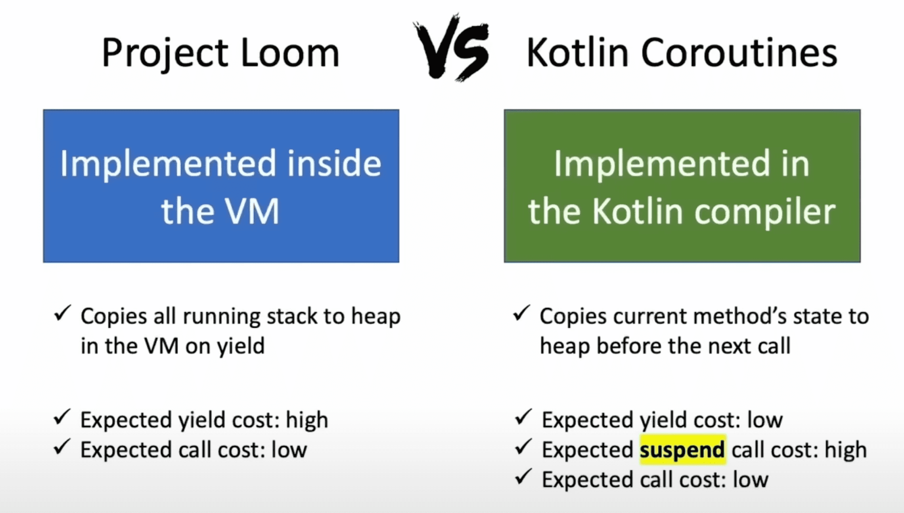  
그렇기 때문에 가상 쓰레드에서는 yield 하는 비용이 가장 크다.  
그런 반면 코루틴에서는 yield 할 때 비용이 발생하는 게 아니라 다음 suspend function을 만났을 때 현재 메서드의 상태를 힙에 저장하기 때문에 이 때 비용이 가장 크다.  
그러한 이유 때문에 suspend function과 일반 function을 잘 구분해서 작성해야한다.

### 성능
#### 메모리
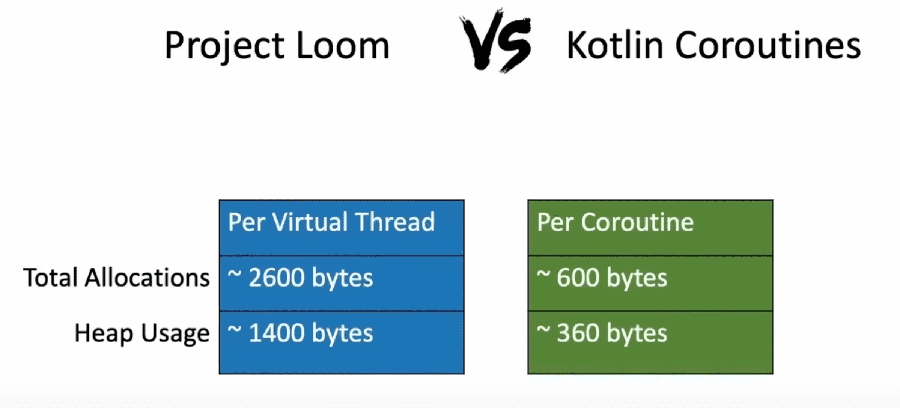
메모리는 코루틴이 더 적게 먹긴 하는데 가상 쓰레드가 100만개라고 가정했을 때 2.6GB 정도 차지하는데 요즘 어지간해서 JVM에 힙메모리는 4GB 이상은 주지 않나(케바케긴 하겠지만) 싶고, 사실 단일 서버가 100만개의 요청을 동시에 받을 일도 없고 하다보니 메모리는 크게 신경쓰지 않아도 될 것 같다.  

  
그리고 가상 쓰레드가 느린 이유를 아래 3가지로 설명하고 있다.
1. 아직 가상 쓰레드가 정식 버전으로 출시된 게 아니기 때문에 아직 더 최적화의 여지가 존재함.
2. 가상 쓰레드는 가상이라 할지라도 쓰레드라는 컨셉을 유지하고 있기 때문에 정말 가벼운 동시성 관련된 컨셉들만 가지고 있는 코루틴에 비해서는 무겁다.  
3. 코루틴은 suspend/non suspend function을 구분하고, suspend function을 위해서 컴파일러가 최적화 작업을 하는데 비해 가상 쓰레드는 그런 구분이나 최적화가 없기 때문에 더 무겁다.  
코루틴은 어디서 suspend 되는지 안 되는지를 알아서 suspend 되는 쪽에 최적화를 할 수 있는 반면, 가상 쓰레드는 어떤 메서드가 yield 될지 안 될지 몰라서 최적화가 불가능하기 때문이 아닐까 싶다.

#### CPU
  
  
코루틴과 가상 쓰레드의 CPU 리소스 사용률을 비교하려고 하는데 가상 쓰레드에 마땅히 비교할 때 사용할만한 API가 없다고 한다.  
아마 가상 쓰레드는 쓰레드에 포커스를 맞췄기 때문에 저렇게 명시적으로 특정 가상 쓰레드를 yield만 하는 API는 딱히 없는 것 같다.  
그럴 필요도 없이 쭉 실행하면 돼서 그런 게 아닐까 싶다.  

이쯤에서 궁금해지는 게 코루틴은 저렇게 명시적으로 다른 코루틴 스코프에게 제어권을 양보하는 yield 메서드가 있고, 일반적인 멀티쓰레드 모델에서는 OS의 쓰레드가 사용되니까 OS에 의해 쓰레드가 스케쥴링이 될텐데 그럼 가상 쓰레드는 어떻게 스케쥴링이 될까? 궁금하기도 했다.  
Blocking I/O를 만나면 yield 메서드가 실행되어 다른 쓰레드에게 제어권을 양보할텐데 만약 CPU 집약적인 작업을 많이 해서 오랫동안 yield 메서드가 실행되지 않고 있는 가상 쓰레드가 있다면 어떻게 될까??
> The scheduler does not currently implement time sharing for virtual threads. Time sharing is the forceful preemption of a thread that has consumed an allotted quantity of CPU time. 
> While time sharing can be effective at reducing the latency of some tasks when there are a relatively small number of platform threads and CPU utilization is at 100%, 
> it is not clear that time sharing would be as effective with a million virtual threads.
> https://openjdk.org/jeps/444#Scheduling-virtual-threads

아직 Time Sharing 방식으로 가상 쓰레드를 스케쥴링을 하지 않고 있다고 한다.  
따라서 CPU 집약적인 작업을 오래하는 가상 쓰레드가 있다면 그 가상 쓰레드는 계속 CPU를 점유하게 될 것이다.  

> How that capability will be exposed to the schedulers is TBD, and will likely not make it to the first Preview.
> https://cr.openjdk.org/~rpressler/loom/loom/sol1_part2.html#forced-preemption

하지만 추후 개선될 예정이라고 하니 그 전까지는 조심조심 하면서 사용해야하고, 혹시 CPU 집약적인 작업이 많은 어플리케이션이라면 가상 쓰레드를 꼭 써야하는지 고민 후 적용해봐야할 것 같다. (아니면 부분적으로만 적용한다던지) 

#### I/O
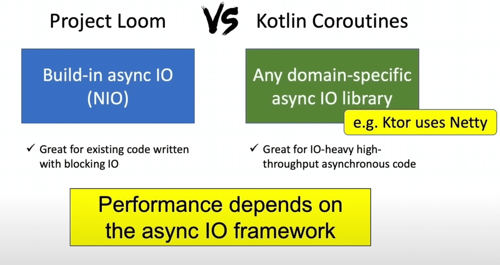
가상 쓰레드는 built-in으로 Async I/O(NIO 같은)을 지원하는데 반해 코루틴은 특정 I/O 라이브러리(프레임워크)에 종속적이지 않고, 여러 I/O 기술을 범용적으로 다룰 수 있다.  
그러다보니 가상 쓰레드는 Blocking I/O를 쓰는 코드에서 적합하고, 코루틴은 I/O를 많이 쓰면서 높은 처리량을 내야하는 비동기 코드에 적합하다고 한다.  
그리고 코루틴이 특정 I/O 기술에 종속적인 게 아니다보니 어떤 Async I/O 프레임워크를 쓰는지에 따라서 성능도 달라질 수 있다고 한다.

#### Tools
  

가상 쓰레드의 마지막 목표는 기존에 있던 도구들(힙메모리 분석 도구, IDE의 디버깅 툴 등등)을 그대로 이용하는 것이다.  
따라서 IntelliJ IDEA에서도 가상 쓰레드를 디버깅 할 수 있는데 아직은 가상 쓰레드가 Preview 버전이라 좀 더 작업할 것들이 남아있다고 한다.  

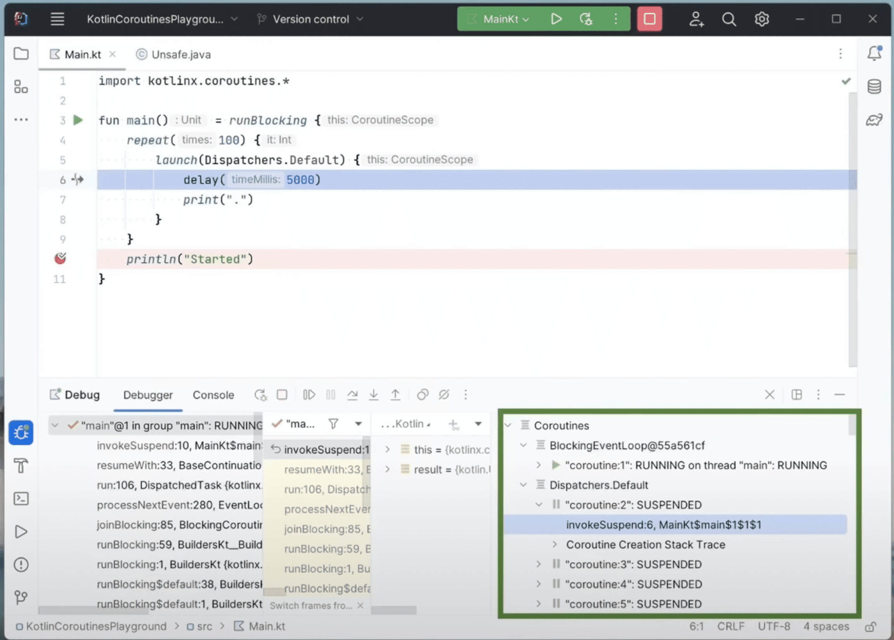
그리고 코루틴은 기존에 없던 것이다 보니 도구가 새롭게 나왔는데, JetBrains에서 코틀린도 만들고, IntelliJ IDEA도 만들었으니 IntelliJ를 사용하면 코루틴도 디버깅이 가능하다.  

## 가상 쓰레드와 코루틴 함께 사용하기
  
그럼 가상 쓰레드와 코루틴은 언제 함께 사용하는 게 좋을까??  
코루틴의 단점은 보완하면서 가상 쓰레드의 장점을 사용할 수 있을 때 함께 사용하면 좋다고 한다. (그 반대 케이스인 가상 쓰레드의 단점을 코루틴이 보완하는 케이스도 궁금했는데 영상에는 나오지 않는다.)  

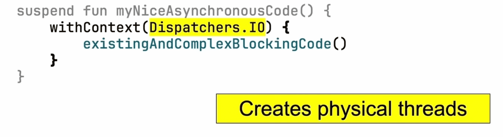  
코루틴 안에서 복잡한 레거시 로직을 호출해야하는데 이 안에 Blocking I/O가 있다고 하면 suspend function이 적절한 타이밍에 yield를 하지 않기 때문에 Dispatchers.IO를 사용해서 코루틴을 별도 쓰레드에서 실행시키면 된다.  
[Coroutine의 IO Dispatcher와 Default Dispatcher 의 사용 시 차이](https://sandn.tistory.com/110)에 [Dispatchers.IO](https://kotlinlang.org/api/kotlinx.coroutines/kotlinx-coroutines-core/kotlinx.coroutines/-dispatchers/-i-o.html)에 대해 간단히 설명하고 있다.  
하지만 Dispatchers.IO 같은 경우에는 실제 쓰레드를 생성하기 때문에 메모리를 더 많이 쓴다는 단점이 존재한다.  

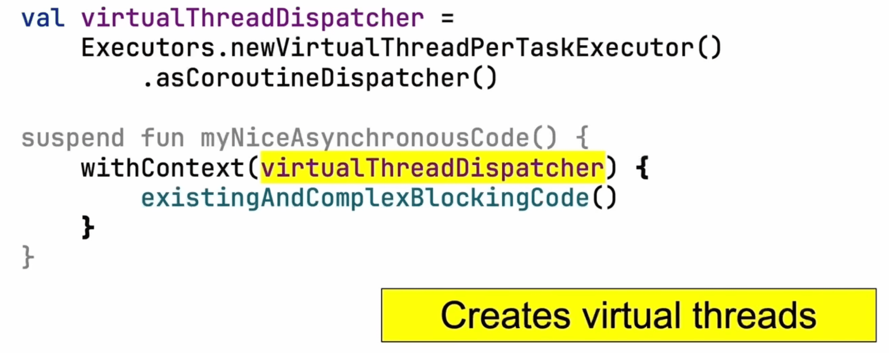  
이럴 때 Blocking 로직을 가상 쓰레드에서 실행시키면 메모리를 절약할 수 있다는 장점이 존재한다.

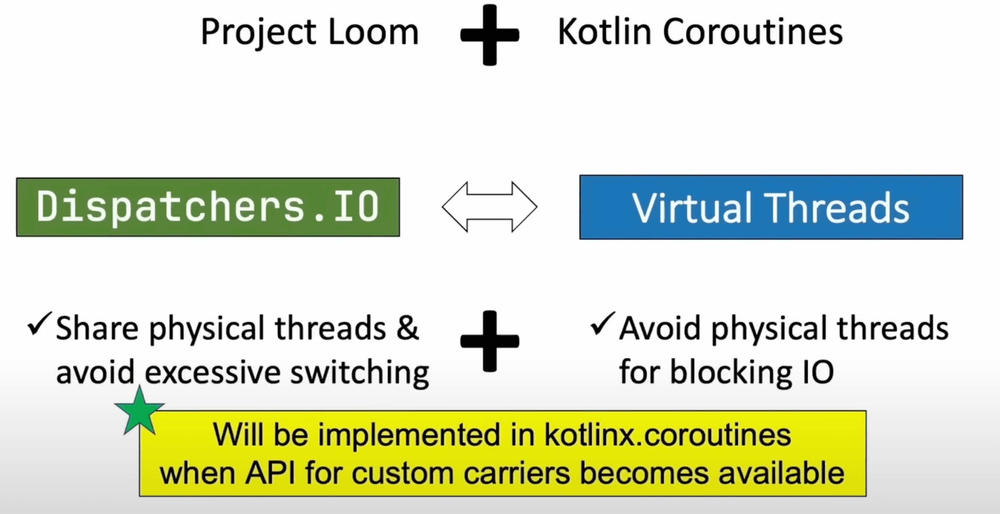  
그럼에도 불구하고 무조건 가상 쓰레드가 좋은 건 아니고 트레이드 오프가 존재한다.  
Dispatchers.IO 같은 경우에는 Blocking 전/후에 실행되는 쓰레드가 같기 때문에 불필요하게 컨텍스트 스위칭이 일어나지 않는다는 장점이 존재하고, 반면 메모리를 더 사용한다는 단점이 있다.  
가상 쓰레드의 경우에는 메모리를 덜 사용한다는 장점이 있지만, 쓰레드가 다르기 때문에 물리적인 쓰레드의 스위칭까지는 아니지만 가상 쓰레드끼리는 스위칭이 발생한다는 단점이 존재한다.  
물론 둘의 단점이 각각 미비할 수 있기 때문에 상황에 따라서 적절히 사용하면 된다.

  
물론 나중에 가상 쓰레드가 정식으로 나오면 Dispatchers.IO가 가상 쓰레드를 사용하도록 바뀌고, 가상 쓰레드끼리도 스위칭이 발생하지 않을 수 있게 서로의 장점만 취하는 방향으로 개발한다고 한다.  
근데 가상 쓰레드 사용하는데 Blocking I/O를 만나서 yield가 되면서 힙메모리에 기존 가상 쓰레드의 컨텍스트 정보들을 올려뒀다가 다시 실행될 때는 그 정보들을 다시 가져오느라 비용이 발생할텐데 어떻게 이런 비용을 줄일 수 있을지 궁금하다.

## 결론
가상 쓰레드와 코루틴은 서로 컨셉부터 다르고 장단점도 명확한 것 같다.  
다만 나는 아직까지는 높은 동시성 처리/처리량을 요구하는 시스템이라기 보다는 돈이 오고가는 도메인을 다루다보니 안정성을 더 중점적으로 다루다보니 코루틴의 장점이 크게 와닿지 않았다.  
그리고 코루틴은 어쨋든 코루틴 스코프 안에서 실행이 돼야하고, 이게 일반 function에서 실행시킬 것인지, suspend function에서 실행시킬 것인지, suspend function 안에 Blocking I/O가 있는 건 아닌지 등등 고민을 많이 해서 코드를 짜야한다는 단점이 존재하는 것 같다.  
가상 쓰레드로도 몸빵이 안 쳐지는 높은 처리량을 요구하는 서버라면 차라리 서버를 더 늘리는 게 값 싼 것 같다.  
아직까지는 사람이 제일 비싼 자원인 것 같고, 사람이 이해하기 쉽고 관리하기 편한 코드를 짜는 게 더 중요한 것 같다.  
다만 가상 쓰레드도 위에 얘기한 것처럼 synchronized 블럭에 진입하면 해당 가상 쓰레드가 핀 된다던지, Structured Concurreny가 Preview 단계라던지 하는 등의 문제 때문에 필요에 따라서는 코루틴과 함께 사용할 수도 있을 것 같다.
