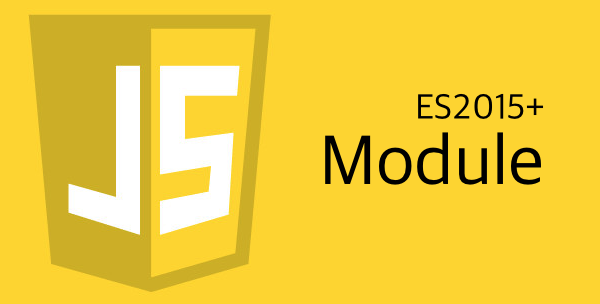

## 자알쓰란?
`자`바스크립트 `알`고 `쓰`자. (잘 쓰자는 의미도 담겨있다.)  
자바스크립트라는 언어 자체는 내 기준에서는 설계 상 미스가 참 많다.  
함수 단위의 스코프, 호이스팅, 동적 타입 등등  
자바와 같은 깐깐(?)한 언어를 배우고 바라본 자스는 허점 투성이처럼 보였다.  
애초에 자바스크립트는 어떠한 프로그램을 만들기 위해서 탄생했다기 보다는  
웹 페이지에 입력값에 대한 유효성 검사(데이터가 공란인지 아닌지 등등)와 같은  
페이지의 동적 제어가 주된 목적 + 짧은 개발 기간(넷 스케이프 사의 새로운 브라우저에 탑재 예정) 때문에  
설계 상에 미스가 있을 수 밖에 없다고 나는 생각된다.  
일종의 안전 장치가 없어서 개발자가 일일이 구현해주고, 신경써야 하는 느낌이었다.  
그렇다고 해서 자바스크립트를 극혐하거나 그런 것은 아니고 매우 사랑한다.  
또한 그 허점을 아는 사람은 허점을 보완해서 요리조리 피해서 잘 쓰겠지만...  
잘 모르는 부분들은 잘못 써도 동작이 잘 되기 마련이다.  
이는 지금 당장에는 큰 문제가 안 될지 모르겠지만, 추후에 대규모 웹 어플리케이션을 만들거나  
직면할 문제로부터 미리 해방시키기 위해 처음부터 좋은 습관을 들여가는 것이 좋다고 생각한다.  
그 여섯 번째 시리즈는 ES2015+의 Module(모듈)을 주제로 진행하겠다.  
일단 [ES5 이하에서 모듈화](/2017/05/20/js-005-module/)를 읽고 오길 바란다.  

## import/export
ES5 이하에서는 네임스페이스 패턴을 이용해 모듈화를 진행했지만 전역 스코프를 더럽힌다는 단점,  
전역 스코프를 더럽히지 않으려면 즉시 실행함수 패턴을 이용해야하지만 외부에서 접근이 불가능하다는 단점이 존재했다.  
진정한 모듈이라고 하면 외부에서 참조가 가능하면서 전역 스코프를 더럽히면 안 된다.  
그를 해결한 게 ES2015의 import/export 문법인데 `지원 가능한 브라우저/노드`가 없다.  
[바벨](/2016/11/11/Babel-ES6-with-IE8/)이라는 트랜스파일러를 사용해서 ES5로 변환해도 Node.js에서 밖에 안 되고,  
브라우저에서는 모듈들을 하나로 합쳐주는 [웹팩](/2016/11/18/Module-bundling-with-Webpck/)과 같은 모듈 번들러를 이용하는 수 밖에 없다.  
일단 스펙에는 표준으로 등록됐으니 한 번 알아보도록 하자.  

```javascript
// export 키워드로 모듈(변수라고 보이지만 이 변수가 하나의 일을 수행하는 모듈이 될 수도 있다.)을 내보내고 있다.
// a.js
export const a = 11;
export const b = 22;
const ajax = function(url) {
  // 비동기 통신을 하는 함수.
};

// 그걸 외부에서 사용할 수 있게 끔 모듈로 만듦.
// default로 만들 수 있는 모듈은 파일 당 한 개 뿐이다. 
export default c;

// b.js
export const a = 33;
export const b = 44;
const getLastIndex = function(arr) {
  // 배열의 마지막 인덱스를 구하는 함수.
};


// 그걸 외부에서 사용할 수 있게 끔 모듈로 만듦. 
export default c;

// a파일에 존재하는 모듈과 b파일에 존재하는 모듈들을 써서 실제로 앱을 만들어보자 
// app.js

// default 키워드로 export 한 모듈은 {} 안에 안 써줘도 된다.
// 그냥 export 한 모듈은 {} 요 안에 모듈 이름을 적어줘야한다.
// export 한 모듈을 한 번에 다 import 하려면 * as A 하면 A 객체의 프로퍼티로 모듈이 전부 바인딩 된다.
import ajax, * as A from './a.js';

// default 키워드로 export 한 모듈은 이름을 어떻게 불러와도 사용이 가능하다.
// b.js에 a란 모듈을 불러오려고 했는데 이미 a란 모듈이 불러와졌거나 a라는 이름이 마음에 안 들면
// as 라는 별칭 키워드를 써서 _a로 이름을 바꿔서 불러오고 있다.
// b는 export 했지만 안 쓴다면 export하지 않아도 된다.
import getLastIdx, {a as _a} from './b.js'

console.log(A.a); // 11
console.log(A.b); // 22
console.log(_a); // 33

// 모듈을 마음대로 불러다 쓸 수 있다.
ajax('http://www.naver.com');
getLastIdx([1, 2, 3, null, undefined, 7]);
```

전역 스코프를 더럽히지도 않으면서 네이밍도 자유로워지고 불러올 때도 입맛에 맞춰 불러올 수 있다.  
사실 여기서 설명한 모듈화는 빙산의 일각이고(내가 일각만 알고 있기도 하고...),  
[import](https://developer.mozilla.org/ko/docs/Web/JavaScript/Reference/Statements/import) / [export](https://developer.mozilla.org/ko/docs/Web/JavaScript/Reference/Statements/export)에서 좀 더 자세한 설명을 참고하고,  
추가적으로 Node.js 진영에서 모듈화를 위해 사용하는 CommonJS 스펙과 브라우저 진영에서 사용했던 AMD 스펙을 비교/정리 해주는  
[JavaScript 표준을 위한 움직임: CommonJS와 AMD](http://d2.naver.com/helloworld/12864) 포스팅을 참고하길 바란다.  
다음으로는 자료형과 변수에 대해서 정리를 해 볼 예정이다.  