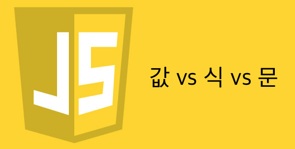

  

## 자알쓰란?
`자`바스크립트 `알`고 `쓰`자. (잘 쓰자는 의미도 담겨있다.)  
자바스크립트라는 언어 자체는 내 기준에서는 설계 상 미스가 참 많다.  
함수 단위의 스코프, 호이스팅, 동적 타입 등등  
자바와 같은 깐깐(?)한 언어를 배우고 바라본 자스는 허점 투성이처럼 보였다.  
애초에 자바스크립트는 어떠한 프로그램을 만들기 위해서 탄생했다기 보다는  
웹 페이지에 입력값에 대한 유효성 검사(데이터가 공란인지 아닌지 등등)와 같은  
페이지의 동적 제어가 주된 목적 + 짧은 개발 기간(넷 스케이프 사의 새로운 브라우저에 탑재 예정) 때문에  
설계 상에 미스가 있을 수 밖에 없다고 나는 생각된다.  
일종의 안전 장치가 없어서 개발자가 일일이 구현해주고, 신경써야 하는 느낌이었다.  
그렇다고 해서 자바스크립트를 극혐하거나 그런 것은 아니고 매우 사랑한다.  
또한 그 허점을 아는 사람은 허점을 보완해서 요리조리 피해서 잘 쓰겠지만...  
잘 모르는 부분들은 잘못 써도 동작이 잘 되기 마련이다.  
이는 지금 당장에는 큰 문제가 안 될지 모르겠지만, 추후에 대규모 웹 어플리케이션을 만들거나  
직면할 문제로부터 미리 해방시키기 위해 처음부터 좋은 습관을 들여가는 것이 좋다고 생각한다.  
그 일곱 번째 시리즈는 값 vs 식 vs 문을 주제로 진행하겠다.  

## 값(Value)
값은 고정적이다. 변하지 않는다. 너무 쉬워서 뭐라 달리 설명할 게 없다.  
아래와 같은 것을 값이라고 부른다.  
```javascript
// 1. Undefined
console.log(undefined);

// 2. Null
console.log(null);

// 3. Boolean
console.log(true);
console.log(false);

// 4. Number
console.log(1);
console.log(0);
console.log(-2.1);
console.log(NaN);
console.log(-0);
console.log(Infinity);
console.log(-Infinity);

// 5. String
console.log('');
console.log('\n');
console.log('aa qq');

// 6. Symbol (ES2015+)
console.log(Symbol('aa'));
console.log(Symbol.for('qqq'));

// 7. Object
console.log(function(){});
console.log([]);
console.log({});
console.log(/a/);
```

### Falsy Value && Truthy value
Falsy Value는 조건식에서 false로 취급되는 모든 경우를 뜻한다.  
다음과 같다.  
```javascript
console.log(!!0);
console.log(!!NaN);
console.log(!!'');
console.log(!!undefined);
console.log(!!null);
console.log(false);
```
Truthy Value는 조건식에서 true로 취급되는 값이고 위의 경우를 제외하고 전부이다.

## 식(Expression)
표현식이라고도 부른다.  
평가(실행)했을 때 값을 반환하는 녀석은 전부 식이라고 한다.  
다음과 같이 말도 안 되는 것 같이 보이는 것들도 식이라고 할 수 있다.  
```javascript
var a = 2;
function b(c) { return c*c; }

// 대부분은 아래와 같이 변수 할당'문'(?)의 형태로만 써봤을 것이다.
// a = 3;
console.log(a = 3); // 3
console.log(b(2)); // 8
console.log((a=3, false, 3+7)) // 10

// 아래 코드를 다음과 같이 쓸 수 있다. 물론 권장하지 않는다.
// a = 1 > a ? 3 : 2;
1 > a ? a = 3 : a = 2;
```

제일 기괴한 것은 `a = 3`을 문이 아닌 식으로써 쓸 수 있다는 것이다.  
대부분 a = 3; 과 같이 문으로써는 써봤어도 식으로써는 써본 적이 적거나 없을 것이다.  
여기서는 일단 위 구문을 식으로써 써서 값을 반환한다는 정도만 알아두자.  
다음에 연재할 [연산자](/2017/06/02/js-008-operator/) 파트에서 자세히 알아보도록 하자.  
여기서 알아둘 점은 식은 값을 반환하고 그 값을 변수에 할당이 가능, 즉 `변수 할당문 우변에 사용이 가능`하다는 뜻이다.  
혹은 반복문이나 조건문의 조건식, 반복문의 증감식 등등에도 쓰일 수 있고 삼항 연산자,  
함수의 반환값 등등에서도 충분히 사용이 가능하니 꼭 알아둬야할 부분이다.  

## 문(Statement)
세미콜론을 만나면 문이라고 생각하면 된다.  
단 조건문, 반복문, 함수 선언문, 예외 처리 구문 등등과 같이 블록(`{}`)이 들어간 구문은  
문 끝에 세미콜론이 포함되면 문법 상 옳지 않다.
```javascript
if(1 > 10) { alert(1); } // 조건문
while(false) { alert(2); } // 반복문
function x(){} // 함수 선언문
// 예외 처리 구문
try {}
catch(e) {}
var z; // 변수 선언문
z = 2; // 변수 할당문
x(); // 함수 호출문
var y = function(a){ // 변수 초기화 구문
  return a; // 값 반환 구문
};
```
문 중에는 변수 할당문과 함수 호출문 같이 식으로써 쓰일 수 있는 것도 있다.  
하지만 다른 문들은 값, 식과는 달리 할 수 없는 게 있다.  
바로 `문은 변수에 할당이 불가능`하다.  
상식적으로 if 문을 변수에 할당한다고 생각하면 말이 안 된다고 볼 수 있다.  
예외로 함수 선언문은 함수 표현식으로 변환이 되어 변수에 할당이 가능하다.

막상 적고 보니 별로 생각나는 게 없으니 이만 마무리하고 [연산자](/2017/06/02/js-008-operator/) 파트까지 보도록 하자.