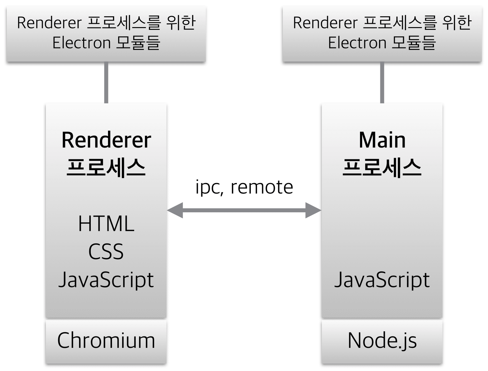

  
## 자알쓰란?
`자`바스크립트 `알`고 `쓰`자. (잘 쓰자는 의미도 담겨있다.)  
자바스크립트라는 언어 자체는 내 기준에서는 설계 상 미스가 참 많다.  
함수 단위의 스코프, 호이스팅, 동적 타입 등등  
자바와 같은 깐깐(?)한 언어를 배우고 바라본 자스는 허점 투성이처럼 보였다.  
애초에 자바스크립트는 어떠한 프로그램을 만들기 위해서 탄생했다기 보다는  
웹 페이지에 입력값에 대한 유효성 검사(데이터가 공란인지 아닌지 등등)와 같은  
페이지의 동적 제어가 주된 목적 + 짧은 개발 기간(넷 스케이프 사의 새로운 브라우저에 탑재 예정) 때문에  
설계 상에 미스가 있을 수 밖에 없다고 나는 생각된다.  
일종의 안전 장치가 없어서 개발자가 일일이 구현해주고, 신경써야 하는 느낌이었다.  
그렇다고 해서 자바스크립트를 극혐하거나 그런 것은 아니고 매우 사랑한다.  
또한 그 허점을 아는 사람은 허점을 보완해서 요리조리 피해서 잘 쓰겠지만...  
잘 모르는 부분들은 잘못 써도 동작이 잘 되기 마련이다.  
이는 지금 당장에는 큰 문제가 안 될지 모르겠지만, 추후에 대규모 웹 어플리케이션을 만들거나  
직면할 문제로부터 미리 해방시키기 위해 처음부터 좋은 습관을 들여가는 것이 좋다고 생각한다.  
그 열 두 번째 시리즈는 번외편 격으로 디버깅 하는 방법을 주제로 진행하겠다.  

## 디버깅이란...?
우선 디버그란 De Bug, Bug를 제거하는 것이다.  
그렇다면 버그란...? 우리가 생각하는 오류를 뜻한다.  
그럼 왜 버그가 오류인가...?  
과거에 벌레(버그)가 기계 속에 들어가서 프로그램이 오류가 난 적이 있다.  
그래서 해당 벌레를 제거(디버그)했더니 프로그램이 정상적으로 실행됐다는 사례 때문에 붙여진 이름이라고 한다.  
디버깅은 디버그 하는 것, 즉 버그를 제거하는 것, 오류를 고치는 행위를 말한다.

## 디버깅을 해보자
아래와 같은 코드가 있다고 해보자.  
```javascript
var getMidChar = function(str) {
  var idxMid = ~~(str.length / 2);
  return str.charAt(idxMid);
};
var num = 1234;
var midStr = getMidChar(num);
```

위 코드를 실행하면 `Uncaught TypeError: str.charAt is not a function`이라는 오류가 나게 된다.  
매개변수 str에 도대체 어떤 값이 들어왔길래 charAt가 함수가 아니라는 건지 도저히 모르겠을 때 다음과 같은 방법으로 str의 값을 얻어낼 수 있다.  

### 로그 찍어보기.  
가장 간단하면서 빠른 방법이다.  
코드를 아래와 같이 고쳐보자.  
```javascript
var getMidChar = function(str) {
  console.log(str); // 1234
  var idxMid = ~~(str.length / 2);
  return str.charAt(idxMid);
};
var num = 1234;
var midStr = getMidChar(num);
```

코드가 간단해서 굳이 로그를 안 찍어봐도 되지만 로직이 복잡한 경우에 이렇게 로그를 찍어보면 어떤 값이 넘어와서 에러를 유발하는지 쉽게 찾아낼 수 있다.  

### 브레이크 포인트 지정하기(묵시적)
BP(Break Point), 말 그대로 코드를 끝까지 실행하는 게 아니라 어느 시점(Point)에서 멈추게(Break) 하는 것이다.  
위 코드를 로그 찍어보는 대신에 브레이크 포인트를 지정해 str에 넘어온 값을 얻어보고자 한다.  
로그를 찍어보는 것은 궁금한 내용을 찍어보기 위해서는 계속 소스를 수정해야하지만,  
브레이크 포인트를 걸어두면 브레이크 걸린 시점에서 소스 수정 없이 이것 저것 테스트 해볼 수 있다는 장점이 존재한다.  
이 포스트에서는 디버거의 사용 방법(다음 BP로 이동 등등)에 대해서는 설명하지 않으니 그건 알아서 공부하자.   

#### 브라우저    
설명은 **크롬** 기준으로 하지만 다른 브라우저에서도 모두 지원할 것이다.  

우선 아래와 같은 html 파일을 만들자.    
```html
<!doctype html>
<html>
<head>
<meta charset="UTF-8">
<title>Document</title>
</head>
<body>
<script>
var getMidChar = function(str) {
  var idxMid = ~~(str.length / 2);
  return str.charAt(idxMid);
};
var num = 1234;
var midStr = getMidChar(num);
</script>  
</body>
</html>
```

브라우저에서 해당 html 파일을 열고 개발자 도구를 열어서 콘솔 탭을 보자.    
  
11번 줄에서 에러가 난 상황이고, 11번을 call? 호출? 한 건 14번 라인에 의한 것이란다.  
일단 11번 라인으로 가기 위해 파란 박스를 클릭해주자.  

  
해당 라인에서 오류가 나고 있다.  
정확히 어떤 값이 넘어오는지 봐야하기 때문에 브레이크 포인트를 지정해주자.  
파란 박스 친 11번 라인을 클릭해주자.  

  
이제 새로고침을 해주자.  

  
11번 라인이 실행되기 **직전**에 딱 브레이크가 걸린다.  
스코프들의 관계(누가 누구를 호출했는지) 콜스택을 통해 볼 수 있고, 어떤 브레이크 포인트에 의해 브레이크 된 건지 등등의 유용한 정보를 볼 수 있다.
  
  
또한 원래 콘솔에서는 전역 스코프만 접근이 가능했는데 브레이크 걸린 스코프는 로컬 스코프인데 마치 전역 스코프인 것 마냥 그 안으로 파고 들어와서 테스트를 할 수 있다.  

#### Node.js  
설명은 **IntelliJ**로 하지만 VSCode나 Atom에서도 Node.js를 디버깅 할 수 있는 것으로 알고 있다.  
요즘에는 Javascript가 브라우저를 탈출해 Node.js 런타임 환경까지 생기다보니 IDE에서 Node 인터프리터를 제공해주기도 한다.  
Node를 이용하면 브라우저에서 제공하는 DOM이나 BOM 객체의 사용은 불가능하지만, ES+Node API를 통해 데이터에 집중해서 테스트 할 수 있다는 장점이 존재한다.  

아래와 같은 js 파일을 만들자.  
```javascript
var getMidChar = function(str) {
  var idxMid = ~~(str.length / 2);
  return str.charAt(idxMid);
};
var num = 1234;
var midStr = getMidChar(num);
```
  
우클릭 후 **Run 'test.js'**를 클릭해주자.

  
동일한 코드이므로 동일한 부분에서 에러가 난다.  
3번 라인 14번째 칸에서 오류가 났다고 하고, (3: 14)  
6번 라인 14번째 칸에 의해 호출이 일어났다고 한다. (6: 14)  

  
3번 라인을 클릭해 BP를 걸어주자.  

  
그리고 이번엔 **Debug 'test.js'**를 클릭해주자.

  
그럼 3번 라인에서 BP가 걸리고 소스코드 창에는 해당 스코프에 어떤 인자가 넘어왔는지 등등을 보여주고 있다.  

  
인터프리터 창의 Debugger 탭의 좌측에는 콜스택, 우측에는 스코프를 보여주고 있다.  

  
인터프리터 창의 Console 탭으로 와서 str을 찍어보려고 하면  
마치 로컬 스코프(getMidChar())가 전역 스코프(Global)인 것마냥 자동완성을 해서 보여주고 있다.

  
별도의 소스코드 수정 없이 해당 스코프에서 하고싶은 테스트를 콘솔창에서 마음껏 해볼 수 있다.  

### 브레이크 포인트 지정하기(명시적)
명시적으로 소스코드 상에 브레이크 포인트를 지정해주는 걸 말한다.  

다음과 같은 js 파일을 만들어주자.  
```javascript
var getMidChar = function(str) {
  var idxMid = ~~(str.length / 2);
  debugger;
  return str.charAt(idxMid);
};
var num = 1234;
var midStr = getMidChar(num);
```

4번 라인이 실행되기 전에 BP를 명시적으로 걸어준 것이다.  
브라우저에서는 기본적으로 BP가 걸리고 IntelliJ에서는 **Debug 'test.js'** 해줘야지만 BP가 걸리는 모습을 볼 수 있다.

### 소스코드 주석 처리하기(+로그 출력하기)
메소드의 어느 부분까지 제대로 실행되는지 확인하기 위해서는 확인하려는 부분 아래로 쭉 주석을 달고 오류가 나지 않는지 확인하면 된다.(혹은 그냥 제거해도 된다.)  
혹은 확인하려는 부분에 로그(의미없는 로그보다는 눈으로 확인하기 쉬운 임의의 로그)를 출력해보면 메소드가 어디까지 제대로 실행됐는지 확인할 수 있다.

## BP 걸고 로그 찍어서 어떻게 디버깅을 하는데?  
어떤 값이 들어왔는지 모르는 상황에서 머릿 속으로 상상의 나래를 펼치는 것보다  
그냥 로그 찍어보고 BP 걸어서 어떤 값들이 들어왔는지 확인하는 게 훨씬 빠를 경우가 많다.  
그래서 어떤 값들이 들어왔는지 확인하고 인자를 수정하던, 메소드 등등을 수정하던지 하면 훨씬 디버깅 하는데 용이할 것이다.  
따라서 로그 찍어보고 BP 거는 습관을 들이보다보면 훨씬 디버깅하는 데 용이할 것이다.   
