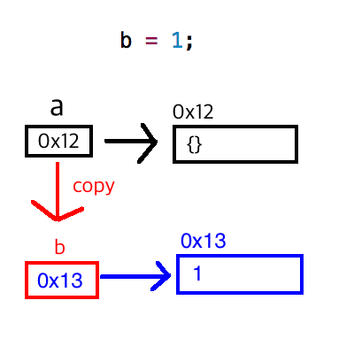

## 자알쓰란?
`자`바스크립트 `알`고 `쓰`자. (잘 쓰자는 의미도 담겨있다.)  
자바스크립트라는 언어 자체는 내 기준에서는 설계 상 미스가 참 많다.  
함수 단위의 스코프, 호이스팅, 동적 타입 등등  
자바와 같은 깐깐(?)한 언어를 배우고 바라본 자스는 허점 투성이처럼 보였다.  
애초에 자바스크립트는 어떠한 프로그램을 만들기 위해서 탄생했다기 보다는  
웹 페이지에 입력값에 대한 유효성 검사(데이터가 공란인지 아닌지 등등)와 같은  
페이지의 동적 제어가 주된 목적 + 짧은 개발 기간(넷 스케이프 사의 새로운 브라우저에 탑재 예정) 때문에  
설계 상에 미스가 있을 수 밖에 없다고 나는 생각된다.  
일종의 안전 장치가 없어서 개발자가 일일이 구현해주고, 신경써야 하는 느낌이었다.  
그렇다고 해서 자바스크립트를 극혐하거나 그런 것은 아니고 매우 사랑한다.  
또한 그 허점을 아는 사람은 허점을 보완해서 요리조리 피해서 잘 쓰겠지만...  
잘 모르는 부분들은 잘못 써도 동작이 잘 되기 마련이다.  
이는 지금 당장에는 큰 문제가 안 될지 모르겠지만, 추후에 대규모 웹 어플리케이션을 만들거나  
직면할 문제로부터 미리 해방시키기 위해 처음부터 좋은 습관을 들여가는 것이 좋다고 생각한다.  
그 열 네 번째 시리즈는 call by value vs call by reference를 주제로 진행하겠다.

## call by 뭐시기...?
Call by 뭐시기 하는 것은 <a href="https://ko.wikipedia.org/wiki/%ED%8F%89%EA%B0%80_%EC%A0%84%EB%9E%B5_(%EC%BB%B4%ED%93%A8%ED%84%B0_%ED%94%84%EB%A1%9C%EA%B7%B8%EB%9E%98%EB%B0%8D)">평가 전략(Evaluation Strategy)</a> 중에 하나이며 위키피디아에서는 아래와 같이 서술하고 있다.  
> 프로그래밍 언어에서 함수 호출의 아규먼트(argument)의 순서를 언제 결정하고 함수에 어떤 종류의 값을 통과시킬지 결정하는 것

즉 함수에 인자로 뭘 던지느냐에 따라서 함수가 어떻게 실행될지에 대한 방법?을 결정하는 것이라고 보면 된다.  
여러가지 호출 방법들이 있지만 오늘은 대표적인 [call by value](#call-by-value)와 [call by reference](#call-by-reference)에 대해 살펴보도록 하자.  

## parameter vs arguments
우선 call by value에 들어가기에 앞서서 parameter(매개변수)와 arguments(인자)에 대해 짚고 넘어가자.  
parameter는 formal parameter(형식 매개변수)로 인식하면 되고, arguments는 actual parameter(실인자)로 받아들이면 된다.  
간단하게 예제로 살펴보자.  

```javascript
var a = 1;
var func = function(b) { // parameter, formal parameter, 매개변수, 형식 매개변수
  // code...
};

func(a); // arguments, actual parameter, 인자, 실인자
```
parameter, formal parameter, 매개변수, 형식 매개변수는 **b**가 되는 것이고,  
실제로 넘어가는 값인 arguments, actual parameter, 인자, 실인자는 **1**이 되는 것이다.

parameter는 **함수 선언부**에 정의되고, arguments는 **함수 호출부**에서 사용된다.

## [call by value](https://en.wikipedia.org/wiki/Evaluation_strategy#Call_by_value)
위키피디아에서는 call by value를 다음과 같이 설명하고 있다.

> Call by value (also referred to as pass by value) is the most common evaluation strategy,
 used in languages as different as C and Scheme. In call by value,
  the argument expression is evaluated,
   and the resulting value is bound to the corresponding variable in the function 
   (frequently by copying the value into a new memory region).
    If the function or procedure is able to assign values to its parameters,
     only its local copy is assigned—that is,
      anything passed into a function call is unchanged in the caller's scope when the function returns.

영어가 잘 안 되니 대충 call by value의 설명을 요약해보자면 다음과 같다.  
1. arguments로 **값**이 넘어온다.  
2. 값이 넘어올 때 **복사된 값**이 넘어온다.
3. caller(호출하는 녀석)가 인자를 복사해서 넘겨줬으므로 callee(호출당한 녀석)에서 해당 인자를 지지고 볶아도 caller는 **영향을 받지 않는다**.  

간단한 예제로 살펴보자. 
```javascript
var a = 1;
var func = function(b) { // callee
  b = b + 1;
}
func(a); // caller
console.log(a); // 1
```

기본적으로 자바스크립트는 [원시값](/2017/07/01/js-009-data-type-primitive-value/)을 arguments로 넘겨주면 call by value의 형태로 작동한다.  
따라서 caller가 1을 arguments로 넘겨줘도 그 값은 복사되어 넘어오기 때문에 callee 내부에서 지지고 볶고 해도 전혀 영향을 받지 않아서 결과적으로 a 값은 원래 값인 1이 찍히게 된다.

## [call by reference](https://en.wikipedia.org/wiki/Evaluation_strategy#Call_by_reference)
위키피디아에서는 call by reference를 다음과 같이 설명하고 있다.  

> Call by reference (also referred to as pass by reference) is an evaluation strategy where a function receives an implicit reference to a variable used as argument,
 rather than a copy of its value. This typically means that the function can modify (i.e. assign to) the variable used as argument—something that will be seen by its caller.
  Call by reference can therefore be used to provide an additional channel of communication between the called function and the calling function.
   A call-by-reference language makes it more difficult for a programmer to track the effects of a function call,
    and may introduce subtle bugs.
    
역시나 영어가 부족하니 대충 call by reference를 요약해보자면 다음과 같다.  
1. arguments로 **reference(값에 대한 참조 주소, 메모리 주소를 담고있는 변수)**를 넘겨준다.  
2. reference를 넘기다 보니 해당 reference가 가리기는 값을 **복사하지는 않는다**.  
3. caller(호출하는 녀석)가 인자를 복사해서 넘기지 않았으므로 callee(호출당한 녀석)에서 해당 인자를 지지고 볶으면 caller는 **영향을 받는다**.  

간단한 예제로 살펴보자. 
```javascript
var a = {};
var func = function(b) { // callee
  b.a = 1;
}
func(a); // caller
console.log(a.a); // 1
```

~~기본적으로 자바스크립트는 [참조 타입](/2017/07/01/js-010-data-type-object/)을 arguments로 넘겨주면 call by reference의 형태로 작동한다.  
따라서 caller가 객체 a를 parameter로 넘겼을 때 실제 arguments로 넘어오는 값은 객체 a에 대한 reference이지 복사된 객체 a가 아니다.  
따라서 callee 내부에서 지지고 볶고 하면 영향을 받기 때문에 조심해서 사용해야한다.~~라고들 오해하고 있다.  

## [call by sharing](https://en.wikipedia.org/wiki/Evaluation_strategy#Call_by_sharing)
call by reference에서 끝날 줄 알았는데 뜬금없이 sharing까지 나와버렸다.  
이게 왜 나왔는지는 아래 예제를 한번 봐보자.  
```javascript
var a = {};
var func = function(b) { // callee
  b = 1;
}
func(a); // caller
console.log(a); // {}
```

참조 타입을 넘겼는데 값이 변하지 않았다.  
바로 자바스크립트에서는 무조건 call by value로 작동하기 때문이다.  
사람들이 참조 타입을 넘기면 call by reference로 작동한다고 알고 있고, 위 코드가 그 생각이 오해임을 명백하게 밝혀주고 있다.  
자바스크립트(자바, 루비, 파이썬 등등도 마찬가지...)에서는 참조 타입을 인자로 넘기면 참조값에 대한 **복사본**을 만들어서 넘긴다.  

이해하기 쉽게 도식화 하면 다음과 같다.  

**메모리 주소는 임의로 지정.**
  
변수 a에 담기는 것은 객체 {}가 담겨있는 메모리 주소 0x12이다. (원시값이 아닌 참조 타입이기 때문)

  
a에 대한 참조값을 복사한 value(b)가 새로 생성된다.  
아직까지는 이 참조된 값이 {} 객체를 가리키고 있다.  


`=` 연산자로 참조값을 재할당하기 때문에 기존에 참조하던 {}에서 1로 참조 대상이 변경되었다.  

C++을 배웠던 사람이라면 알고있던 call by value와는 다르단 느낌에 매우 혼동을 하게 된다.  
따라서 이런 혼동을 줄이고자 call by sharing이 등장한 것 같다.  

## Quiz(댓글 유도 작전)
그렇다면 아래 예제의 결과는 무엇일까?  
그 이유까지 한 번 적어보도록 하자! (제발 ㅠㅠ)  
```javascript
var a = {};
var func = function(b) {
  b = (b.a=1);
  b.b = 2;
}
func(a);
console.log(a); // ??
```

## 결론
1. 자바스크립트에서 call by reference는 존재하지 않고 **call by value만 존재**한다.  
2. 참조 타입을 인자로 넘기면 참조값에 대한 **복사본**이 넘어간다.  
3. 이러한 혼동을 줄이고자 call by sharing이란 용어로 부르기도 한다.

## 참조 링크
* [Is Java “pass-by-reference” or “pass-by-value”?](https://stackoverflow.com/questions/40480/is-java-pass-by-reference-or-pass-by-value)  
* [자바의 아규먼트 전달 방식](https://brunch.co.kr/@kd4/2)
* [Java 인자 전달 방식: Call-by-{Value | Reference}?](http://mussebio.blogspot.kr/2012/05/java-call-by-valuereference.html)