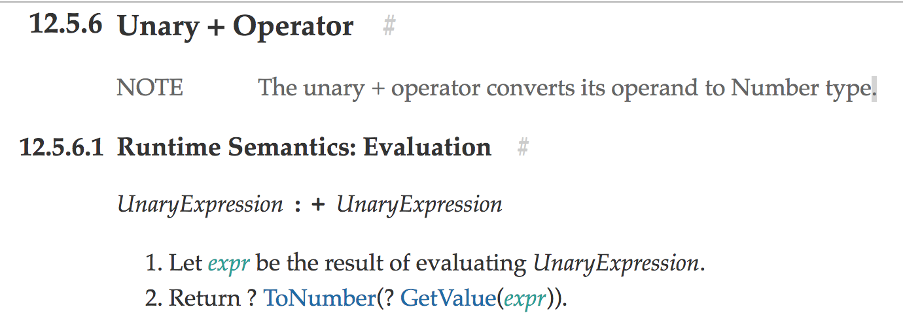

  
## 자알쓰란?
`자`바스크립트 `알`고 `쓰`자. (잘 쓰자는 의미도 담겨있다.)  
자바스크립트라는 언어 자체는 내 기준에서는 설계 상 미스가 참 많다.  
함수 단위의 스코프, 호이스팅, 동적 타입 등등  
자바와 같은 깐깐(?)한 언어를 배우고 바라본 자스는 허점 투성이처럼 보였다.  
애초에 자바스크립트는 어떠한 프로그램을 만들기 위해서 탄생했다기 보다는  
웹 페이지에 입력값에 대한 유효성 검사(데이터가 공란인지 아닌지 등등)와 같은  
페이지의 동적 제어가 주된 목적 + 짧은 개발 기간(넷 스케이프 사의 새로운 브라우저에 탑재 예정) 때문에  
설계 상에 미스가 있을 수 밖에 없다고 나는 생각된다.  
일종의 안전 장치가 없어서 개발자가 일일이 구현해주고, 신경써야 하는 느낌이었다.  
그렇다고 해서 자바스크립트를 극혐하거나 그런 것은 아니고 매우 사랑한다.  
또한 그 허점을 아는 사람은 허점을 보완해서 요리조리 피해서 잘 쓰겠지만...  
잘 모르는 부분들은 잘못 써도 동작이 잘 되기 마련이다.  
이는 지금 당장에는 큰 문제가 안 될지 모르겠지만, 추후에 대규모 웹 어플리케이션을 만들거나  
직면할 문제로부터 미리 해방시키기 위해 처음부터 좋은 습관을 들여가는 것이 좋다고 생각한다.  
이번에는 번외편 격으로 훼이크 연산자를 배워보도록 하자.  
아이디어를 제공해주신 [백성훈](https://www.facebook.com/profile.php?id=100005410202751) 님께 감사를 전한다.

## 훼이크 연산자?
말 그대로 훼이크 연산자이다. 공식 명칭은 아니다.    
의도한 대로 동작하지 않는 연산자를 뜻한다.  
어찌보면 왜 이렇게 스펙에 구현됐는지 이해하기 힘든 내용이라서 굳이 몰라도 될 것 같기도 하다.  

기본적으로 함수 선언`문`은 함수의 이름이 필수적이다.  
```javascript
function a() {}
function() {} // Uncaught SyntaxError: Unexpected token (
```

그에 반해 함수 표현`식`은 함수의 이름이 옵션이다.  
디버깅을 위해서 권장을 한다지만 크롬에서는 이마저도 기본으로 제공해주는 것 같다.  
```javascript
const a = function a() {};
const b = function() {};
```

에러가 전혀 나질 않는다.  
하지만 여기서 공통된 부분이 보인다.  
```javascript
// 함수 선언문에서 이름을 뺀 부분, 비록 에러가 나지만...
function() {}

// 함수 표현식에서 이름을 뺀 부분
const b = function() {};
```

위 두 구문에서 변수 선언을 제외하고는 완전히 일치한다.  
이 내용들이 아래 (훼이크)연산자들을 만나면 시너지(?)를 발휘한다.  
모두 단항(Unary) 연산자들이다.

```
+ - ! ~
```

단항 연산자가 뭐라고 훼이크 연산자라고 말하는지 모르겠다면  
최신 스펙 문서인 ES2017 스펙의 Unary Operator 부분에서 대표적으로 [Unary + Operator](https://www.ecma-international.org/ecma-262/7.0/#sec-unary-plus-operator)만 살펴보자.  

  
맨 위에 보이듯이 우선 우리가 예측하는, + 연산자의 기능은 뒤에 있는 표현`식`의 평가 결과로써 얻어지는 `값`을 숫자형으로 변환해주는 기능을 한다.  
그렇다. + 뒤에있는 녀석은 무조건 표현`식`으로 취급한다.  
그 뒤에 있는 녀석이 표현`식`으로서의 문법만 지켰다면 선언`문`이어도 표현`식`인 것처럼 강제로 문변환? 식변환?이 일어나게 되는 것이다.  
그렇다면 우리가 살펴볼 훼이크 오퍼레이터 부분은 아래 부분에 나온다.
`evaluating UnaryExpression`. + 뒤에 나오는 단항 표현`식`을 `평가`한다고 하는 것 같다.  
그렇다면 여기서 한 번 짱구를 굴려봐서
> 선언`문`을 표현`식`으로서 강제시켜서 써먹을 수 있는 방법이 있을까?

라는 생각까지 미치게 된다. (사실 나도 다른 글을 보고 유추한 거지만...)  
그렇다면 선언`문`과 표현`식`이 같은 문법으로 쓰이는 경우를 찾아보니 위에 적어논 익명(?) 함수 선언문과 익명 함수 표현식이었다.  
익명 함수 선언문은 오류를 뿜지만 이를 표현식으로써 사용한다면 문법상 오류를 뿜어내질 않는다.  
확인해보자.  
```javascript
// 함수 표현식을 평가해서 나오는 것은 함수 그 자체이다.
// 왜냐하면 함수를 호출해서 true를 반환한 게 아니기 때문이다.
// 이 함수 그 자체를 숫자형으로 바꾸니 Not a Number(NaN)이 나오는 것이다.
console.log(isNaN(+function() {return true;})); // true

// 내 말이 안 믿긴다면 아래의 결과로 확인해보자.
const a = function() {return true;};
console.log(+a); // NaN 
```

이렇게만 쓰면 의미가 없으니 대부분 IIFE(Immediately Invoked Function Expressions, 즉시 실행 함수)와 엮어서 많이 쓴다.
```javascript
// 이렇게 쓰는 이유는 두 가지가 있는 것 같다.
// 즉시 실행 함수의 가독성이 떨어지거나 보기 흉해서 보기 좋게 표현하려고,
// 혹은 반환값을 가지고 다른 연산을 해야하는 경우인 것 같다.
+function() {return true;}() === 1;
```

그런데 나는 딱히 즉시 실행 함수의 가독성이 나쁘다고 생각해본 적이 없고,  
즉시 실행 함수의 반환값을 가지고 뭘 해본 적이 없어서 딱히 필요성은 잘 모르겠다.  
다만 선언문 형태를 표현식으로서 취급한다는 게 신기했다.

## 참고 링크
* [JavaScript plus sign in front of function name](https://stackoverflow.com/questions/13341698/javascript-plus-sign-in-front-of-function-name)  
* [Fake operator overloading in JavaScript](http://2ality.com/2011/12/fake-operator-overloading.html)  