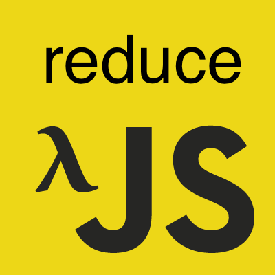

이 포스트는 [인프런](https://www.inflearn.com/)에서 진행한 [유인동](https://www.facebook.com/profile.php?id=100011413063178) 님의 [함수형 자바스크립트](https://www.inflearn.com/course/%ED%95%A8%EC%88%98%ED%98%95-%ED%94%84%EB%A1%9C%EA%B7%B8%EB%9E%98%EB%B0%8D/)를 듣고 감명 받아서 쓴 글이다.  
사실 [underscore](http://underscorejs.org/), [lodash](https://lodash.com/) 등 함수형 패러타임으로 코드를 짤 수 있게 끔
미리 이런 함수들을 제공하는 라이브러리들을 쓰고, 이 포스트는 그닥 볼 필요가 없다.  
하지만 이런 원리를 알고 접근을 하다보면 위 라이브러리를 쓴다고 하더라도 추가로 필요한 나의 코드를 함수형으로 더 짜기 유용하지 않을까?  

## reduce
기본적으로 reduce는 **기존 데이터들을 가공해 아예 새로운 데이터**를 얻고자 할 때 쓰인다.  
1~6까지의 배열이 존재할 때 해당 수들을 가지고 새로운 수를 얻고자 할 때 쓰인다.  

```javascript
const nums = [1, 2, 3, 4, 5, 6];
let sum = 0;
for(const num of nums) sum += num*2;
console.log(sum); // 42
sum = 0;
for(const num of nums) if(num%2) sum+= num;
console.log(sum); // 1 + 3 + 5 = 9
```

뭐 딱히 추상화할 건 별로 없어보이지만 이런 반복스런 냄새들을 잘 맡고 캐치하는 것이 중요하다.  
반복문 부분, 그리고 arrayLike와 객체를 위해 일단 추상화를 진행해보자.  

```javascript
const _each = (list, iteratee) => {
  if(list.toString() === '[object Object]') {
    const objValList = [];
    for(const key of Object.keys(list)) key !== 'length' && objValList.push(list[key]);
    list = objValList;
  }
  for(const item of list) iteratee(item)
};
// memo는 디자인 패턴 중 하나인 메모제이션 패턴을 이용한다는 것을 뜻하는 것 같다.
// 또한 데이터들을 어떻게 가공할지는 반복된 함수(iteratee)에게 위임, 추상화 하였다.
const _reduce = (list, iteratee, memo) => {
  // for(const item of list) memo = iteratee(item, memo);
  // 위 코드는 리스트의 반복문을 돌기 때문에 아래와 같이 추상화가 가능하다.
  _each(list, item => memo = iteratee(item, memo));
  return memo;
};
const nums = [1, 2, 3, 4, 5, 6];
console.log(_reduce(nums, (num, memo) => memo + num*2, 0)); // 42
```

## head, tail
하지만 초기값인 메모제이션 인자가 제공되지 않으면 위 함수는 죽고 만다.  
좀 더 사용하기 쉽게 함수를 만드려면 초기값은 생략이 가능해야한다.  
```javascript
const _each = (list, iteratee) => {
  if(list.toString() === '[object Object]') {
    const objValList = [];
    for(const key of Object.keys(list)) key !== 'length' && objValList.push(list[key]);
    list = objValList;
  }
  for(const item of list) iteratee(item)
};
// 리듀스에 초기값이 제공되지 않는 경우 그 초기 값을 얻어내기 위한 함수
// 인덱스로 접근할 수 없는 객체에 대해서 처리를 해줘야 함.
const _head = list => list.toString() === '[object Object]' ? Object.keys(list)[0] : list[0];
// 초기값을 제외한 값들
const _tail = list => (
  // slice 메소드가 없는 객체의 경우에는 키값들을 퉁친 배열로 반환
  list.toString() === '[object Object]' ? Object.keys(list).slice(1) :
    // slice 메소드(프로토타입 등등)가 있으면 고대로 쓰면 되고 ArrayLike 같은 경우에는 Array로 바꿔준 후에 호출하면 됨.
    list.slice ? list.slice(1) : Array.from(list).slice(1)
);
const _reduce = (list, iteratee, memo) => {
  if(memo === undefined) { // 초기 값이 없다면
    // 해당 리스트의 첫 번째 값을 초기값으로 삼으면 된다.
    memo = _head(list);
    // 해당 리스트의 첫 번째 값을 제외한 녀석을 리스트로 삼으면 된다.
    list = _tail(list);
  }
  _each(list, item => memo = iteratee(item, memo));
  return memo;
};
const nums = [1, 2, 3, 4, 5, 6];
const doms = document.querySelectorAll('*');
const obj = {name: 'ㅁㄴㅇㄹ', age: 9999};
console.log(_reduce(nums, (item, memo) => memo + item*2)); // 41
console.log(_reduce(doms, (node, memo) => `${memo}노드 이름은 ${node.nodeName}\n`, ''));
console.log(_reduce(obj, (key, memo) => `${memo}${key}: ${obj[key]}\n`, ''));
```

세미나 들은 걸 토대로 머리를 굴려봐서 짜봤는데 틀린 부분은 없는지 확신은 못 하겠다.  
~~여튼 뭐 돌아는 가니...~~

[curry와 curryr](/2017/06/30/js-func-07-curry/), 그리고 [pipe](/2017/06/30/js-func-08-pipe/)와 go가 정말 함수형의 꽃인 것 같은데...  
일단 다음 포스트인 [find](/2017/06/28/js-func-06-find/)를 보도록 하자!  
