## 들어가기에 앞서
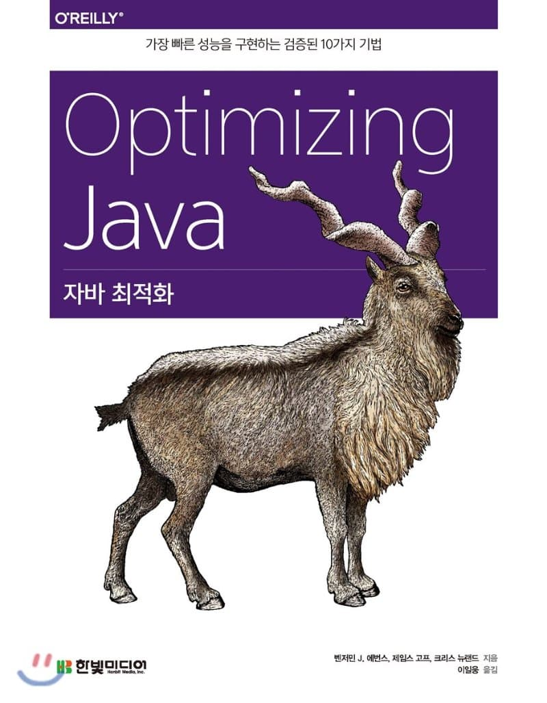
이 글은 이일웅 님께서 번역하신 [자바 최적화](https://book.naver.com/bookdb/book_detail.nhn?bid=14796595)란 책을 읽던 도중 공부한 내용을 정리한 글입니다.  
절대 해당 책의 홍보는 아니며 좋은 책을 써준 사람과 번역해주신 분께 진심으로 감사하는 마음에 썼습니다.  
이 글을 읽어보시기 전에 [Garbage Collection Basic](/2019/05/07/jvm-gc-basic/) 편을 읽어보시면 더 도움이 될 것입니다 :) 

## Mark and Sweep Algorithm
Basic 편에서는 간단하게 Young/Old Generation과 Mark and Sweep 알고리듬에 대해서 간단하게 알아보았다.  
해당 알고리듬을 사용하는 GC를 **scavenge garbage collector**라고도 부른다.
Mark and Sweep Algorith의 단점은 GC를 수행하는 동안 Stop the World(이하 STW)가 발생한다는 것이다. 
 

그럼 이제 해당 알고리듬을 사용하는 GC 알고리듬에는 뭐가 있는지 알아보자.

### Serial GC
**프로덕션에서 절대 사용하면 안 되는 GC이다.** (싱글 코어 CPU를 사용하는 서버를 제외하고... ~~설마 아직도??~~)  
CPU 코어를 한 개만 사용하기 때문에, 해당 GC는 싱글 코어 환경에서만 적합하다. (쓰레드 간의 컨텍스트 스위칭도 적기 때문에...)  
Young/Old Generation 모두 Mark and Sweep 알고리듬을 사용하여 GC를 수행한다.  
Young Generation에서는 gc 수행 시간을 줄이고자 memory compaction을 수행하지 않고 survivor 영역을 전전긍긍하다 Old Generation으로 승진시켜버린다.  
Old Generation은 survivor 영역처럼 별도의 메모리 영역이 없다보니 memory compaction도 하고, 메모리 사이즈도 크다보니 수행 시간이 길다. (그만큼 STW도 길다...)

-XX:+UseSerialGC 파라미터를 주고 실행하면 적용된다.

### ParallelGC(Young) / ParallelOldGC(Old)
Java 7~8의 기본 GC이며 [Serial GC](#Serial-GC)의 멀티 코어 판이다.  
'Serial GC에서 하던 걸 다수의 코어(및 쓰레드)가 하다보니 더 빠르게 수행하겠구나~'정도로 받아들이고 있다.

둘은 쌍쌍바 같은 녀석이라 -XX:+UseParallelGC 파라미터를 주면 자동으로 -XX:+UseParallelOldGC 파라미터가 활성화되고,
-XX:+UseParallelOldGC 파라미터를 주면 자동으로 -XX:+UseParallelGC 파라미터가 활성화된다.

## Tri-color Marking Algorithm
Tri-color Abstraction으로도 불리는 것 같으며 '자바 최적화'란 책에서는 '삼색 마킹 알고리즘'이라고 번역하였다.  
Tri라는 접두사는 숫자 3을 의미하며, 총 3가지 색을 써서 마킹하는 알고리듬을 뜻한다.  
[Mark and Sweep Algorithm](/2019/05/07/jvm-gc-basic/#Mark-and-Sweep-Algorithm)에서는 2가지 색(마킹되었거나, 마킹되지 않았거나)을 쓴 것과 차이점을 지닌다.  
이 알고리듬은 동시성 알고리듬과 GC의 정확성을 증명했다는데, 즉 어플리케이션이 멈추지 않으면서 GC를 **동시**에 **정확**하게 쓰기 위해 나온 알고리듬 같다.  

먼저 알고리듬을 알아보기 전에 각각의 색에는 무엇이 있고, 어떤 역할을 하는지 알아보자.  
1. 회색(Grey)  
해당 객체가 참조하고 있는 객체를 식별하지 않은, 즉 처리가 되지 않은 객체
2. 검은색(Black)  
해당 객체가 참조하고 있는 객체를 모두 식별한, 즉 모든 처리를 끝마친 객체
3. 흰색(White)  
해당 객체를 참조하고 있는 객체가 아무런 객체도 없는 객체, 수집 대상이 되는 객체

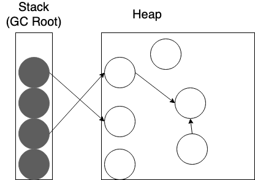  
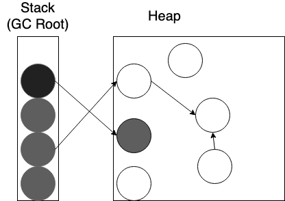  
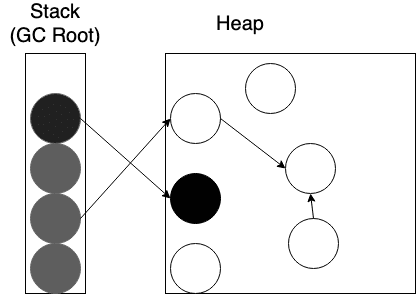  
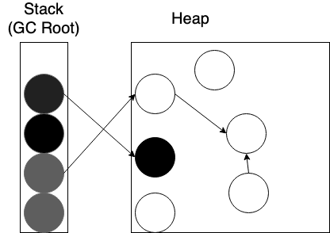    
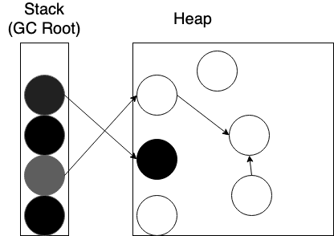    
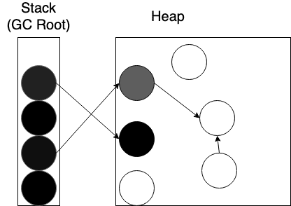  
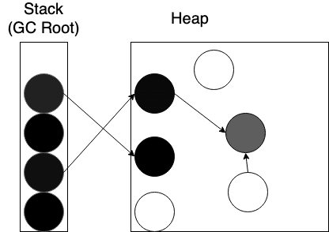  
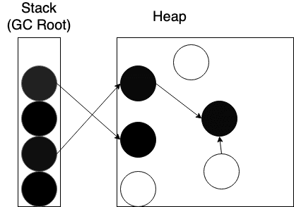  
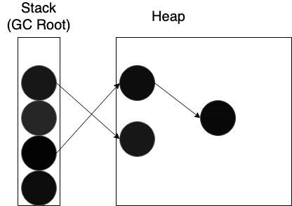  

### Issue
Mark and Sweep Algorithm과 달리 Tri-color Marking Algorithm은 어플리케이션과 동시에 수행된다.  
따라서 마킹하는 도중에 어플리케이션 스레드(책에선 Mutator라고 표기)에서 수정 사항이 반영되기 때문에 라이브 객체가 수집되는 현상이 발생될 수 있다.

```java
aInstance.setSomeField(cInstance);
```
  

```java
aInstance.setSomeField(cInstance);

// blah blah...

aInstance.setSomeField(bInstance);
```
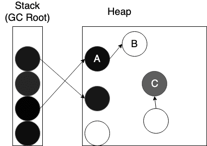  
여기서 두 가지 문제점이 발생한다.  
1. A는 검은색 객체로 모든 작업이 끝난 객체다.    
또한 B는 흰색으로 마킹돼있다, 즉 수집의 대상이다.  
라이브 객체를 수집하기 때문에 추후에 NPE(NullPointerException)이 발생할 가능성이 존재한다.
2. C는 회색 객체로 마킹돼있고, 나중에 검은색 객체로 바뀐다.  
즉, C는 GC 루트로부터 아무도 참조하지 않는 객체가 된 죽은 객체인데도 불구하고 흰색으로 마킹되지 않는다.  
따라서 수집 대상이 되지 않기 때문에 메모리 릭을 유발할 수 있다. (물론 다음 GC에서 수거해가겠지만...)  
이렇게 아무도 참조하고 있지 않은데 혼자 남아있는 객체를 부유 가비지(Floating Garbage)라고 부른다.

위와 같은 경우에는 애플리케이션 스레드가 객체를 변경했을 때 재마킹하게 끔하거나,  
알고리듬을 깨버릴만한 모든 변경 사항을 큐 형태로 넣어놓고 GC의 main phase가 끝난 다음에 fixup phase에서 바로 잡는 방법 등등이 존재한다. 

### CMS(Concurrent Mark Sweep) GC
CMS GC는 Tri-color Marking Algorithm을 사용하기 때문에 GC와 함께 어플리케이션을 돌릴 수 있다.    
그렇다고 해서 아예 STW가 없는 건 아닌데 Parallel(Old)GC에 비하면 훨씬 짧다.  
즉, 레이턴시에 엄청 민감한 경우에 적합한 GC라고 볼 수 있다.  
절반은 GC 돌리고, 절반은 어플리케이션 스레드를 돌리는 것이다. (물론 평상시에는 100% 어플리케이션이 쓰겠지만...)  
CMS GC는 Old Generation 전용 GC이고, 해당 GC를 사용하면 자동적으로 Young Generation 전용으로 ParNewGC를 사용한다.  
(Java 8에서 -XX:+UseConcMarkSweepGC -XX:-UseParNewGC 이 조합이 Deprecate 되었다.  
그냥 -XX:+UseConcMarkSweepGC만 사용하면 된다.)  
ParNewGC에 대해선 좀 이따 간단히 설명하겠다.

CMS GC의 장점은 아래와 같다.
1. 어플리케이션 스레드가 오랫동안 멈추지 않는다. (짧게 짧게 쪼개서 멈춘다.)  

CMS GC의 단점은 아래와 같다.  
1. GC 풀 사이클 자체는 Parallel(Old)GC 보다 길다.  
1. GC가 도는 도중에는 어플리케이션 스레드가 절반만 돌기 때문에 처리율이 감소한다. 
1. Mark and Sweep 알고리듬에 비해 하는 일도 많고 복잡하다보니 메모리, CPU를 더 많이 쓴다.  
1. CMS GC는 Old Generation의 메모리 Compaction을 수행하지 않으므로 단편화가 발생한다.

역시 은총알은 없는 것 같다... ㅠㅠ

CMS GC는 어플리케이션 쓰레드와 같이 돌기 때문에 좀 복잡하게 동작한다.  
1. 초기 마킹(Initial Mark, **STW 발생**)
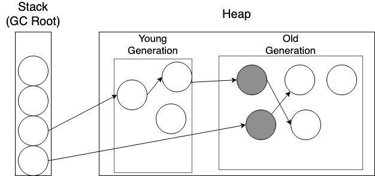  
이렇게 마킹해놓으면 마킹 단계에서 다른 메모리 영역은 신경쓰지 않고 하나의 GC 풀에만 신경쓰면 된다.  

2. 동시 마킹(Concurrent Mark)  
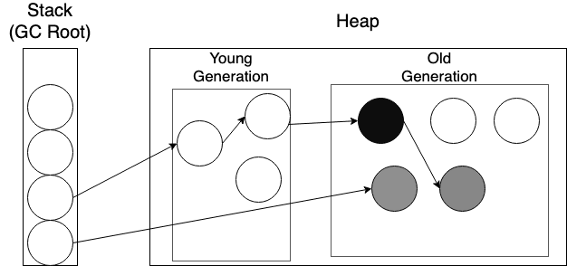  

3. 동시 사전 정리(Concurrent Preclean)  
  
그리고 Initial Mark 이후에 참조 간에 변경이 생긴 곳을 Dirty Card라고 부른다.  
자세한 내용은 [The JVM Write Barrier - Card Marking](http://psy-lob-saw.blogspot.com/2014/10/the-jvm-write-barrier-card-marking.html)을 참고하자.  
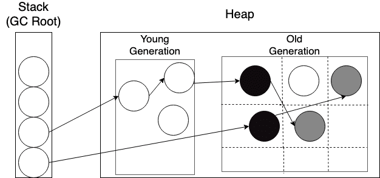  
이 phase의 목적은 5단계(재마크, Final Remark) 시에 STW 시간을 줄이기 위함이다.

4. Abort 가능한 동시 사전 정리(Concurrent Abortable Precelan)  
이 phase의 목적 역시 5단계(재마크, Final Remark) 시에 STW 시간을 줄이기 위함이다.  
해당 phase는 이름부터 Abortable이 들어가기 때문에 아래와 같은 조건 의해 Abort 될 수 있다.  
반복 횟수를 넘거나, 정해진 시간을 초과하거나, 사전 정리가 효과적으로 이루어졌거나 등등... (JVM 옵션으로 설정 가능한 것들도 있다.)  

5. 재마크 (Final Remark, **STW 발생**)  
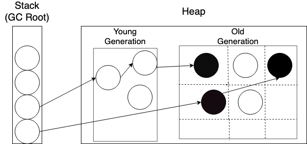  

6. 동시 쓸어담기 (Concurrent Sweep)  
  

7. 동시 리셋 (Concurrent Reset)
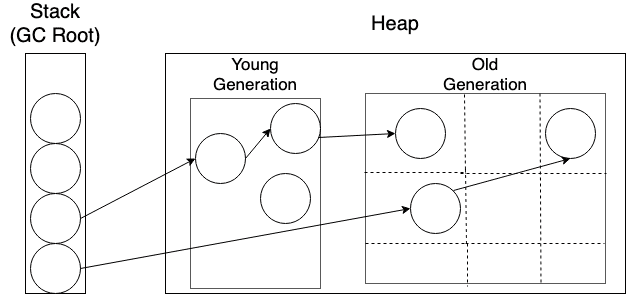

#### CMF(Concurrent Mode Failure)
ParallelOldGC는 긴 STW를 가지는 대신에 CMS는 짧은 두 번의 STW만 있으므로 지연이 매우 적다.  

하지만 Old Generation을 GC하고 있는 와중에 동시에 Eden 영역도 차게 되는데, 이러다 Eden 영역이 꽉찬 경우에는 어떻게 될까?    
Young Generation을 GC해야하는데 ParNewGC도 STW를 유발하는데 쓰레드 절반은 Minor GC, 쓰레드 절반은 Major GC를 수행하고 있기 때문에 Minor GC는 ParallelGC 보다 느리다.  
또한 Minor GC 이후에 적당한 나이를 먹은 객체는 Old Generation으로 [승진](/2019/05/07/jvm-gc-basic/#Promotion)시켜야하는데,  
CMS GC는 메모리 컴팩션을 하지 않기 때문에 메모리 단편화가 발생하기 때문에 ParallelGC 보다 더 적은 객체를 Old Generation으로 승진시킨다.  
(-XX:InitialTenuringThreshold와 -XX:MaxTenuringThreshold의 기본 값을 좀 높여서 사용하는 걸까...?)
또한 Old Generation으로 승진시킴과 동시에 Old Generation은 아직 GC 중이기도 하고해서 좀 더 긴밀한 조정을 하게되는데 이것도 ParNewGC와 ParallelGC와의 차이점이다.

또한 객체의 할당률이 급증해서 [조기 승진](/2019/05/07/jvm-gc-basic/#Premature-Promotion)이 일어나기도 하고,  
급기야 승진한 객체가 너무 많은 경우에는 Old Generation 조차 꽉차는 경우가 존재한다. (단편화로 인해 연속된 메모리 공간을 확보하지 못하는 것도 한 몫 한다.)  
이런 경우에는 어쩔 수 없이 CMS GC에서 ParallelOldGC로 바뀌게 되고, STW가 발생한다.

CMF가 발생하지 않게 하려면, Old Generation이 꽉 차기 전에 얼른얼른 GC를 수행해야하는데
-XX:CMSInitiatingOccupancyFraction 파라미터로 정할 수 있고 기본값은 75이다. (Old Generation의 75%가 차면 GC 시작)

CMS는 내부적으로 사용 가능한 빈 공간을 '프리 리스트'라는 걸 통해 관리한다.  
Concurrent Sweep 단계에서 Sweeper 쓰레드는 다음의 일을 한다.  
1. 여유 공간을 더 큰 덩어리로 만든다.  
1. 단편화로 인해 CMF가 발생하지 않도록 연속된 빈 블록들을 하나로 뭉친다.

하지만 Sweeper는 어플리케이션 쓰레드와 동시에 작동하므로 쓰레드가 적절히 동기화되지 않는 한 새로 할당된 블록이 잘못 수집될 가능성이 존재한다.  
따라서 Sweeper 쓰레드는 프리 리스트를 잠근 후에 작업한다.

### G1 GC(Garbage First GC)
G1 GC는 자바 6에 실험적으로 등장하여 자바 8u40 이후부터 쓸만큼의 성능 및 안정성을 발휘하기 시작했고, **자바 9부터 기본 GC**로 채택됐다. (자바 12가 나온 현재도 기본 GC이다.)
G1 GC는 처음부터 CMS를 대체할 목적으로 설계되었는데 CMS GC를 사용중인데 아무런 문제가 없는데 성급하게 바꾸는 행위는 하지 않는 게 좋다.  
굳이 바꾸지 않아도 바꾸는 건 안정성을 떨어뜨리는 행위이며 조금이라도 처리율을 높이고 싶어서 올리고 싶다면 충분한 테스트를 거친 이후에 하자.

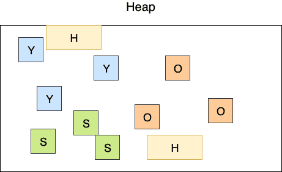  
즉, Survivor 영역도 기존에는 2개였는데 G1 GC에서는 그러한 개념도 사라졌다.    
또한 거대한 객체(Humongous Object)를 저장하는 '거대 영역(Humongous Region)'이라는 특수한 영역도 존재한다.(Humongous Object는 Old Generation에 바로 할당된다.)  
Humongous Object라고 식별하는 기준은 리전 사이즈의 50%를 넘는 객체면 된다.   

G1 GC는 처음부터 CMS를 대체할 목적으로 중단 시간이 짧은 수집기로 설계했기 때문에 아래와 같은 특징이 있다.    
1. 수십 GB 이상의 힙에서도 짧은 STW를 지향한다.  
1. 객체 할당과 Old Generation으로 승진이 많은 경우에도 메모리 Compaction을 하기 때문에 CMS처럼 Full GC가 돌지 않는다.  
1. 짧은 STW와 예측 가능한 STW 시간  
-XX:MaxGCPauseMillis라는 옵션으로 지정할 수 있는데 100(ms) 이하로 지정하면 이를 어길 가능성이 크다고 한다.
1. Java 10부터 Full GC 시에 Multi Thread로 작동한다. ([JEP 307: Parallel Full GC for G1](https://bugs.openjdk.java.net/browse/JDK-8172890))  
참고로 CMS GC는 Full GC 시에 Single Thread로 동작하는 것으로 알고 있는데, 지금은 고쳐졌는지 모르겠다.  
애초에 CMS GC를 대체할 목적으로 G1 GC 개발에 몰두했을 거 같기 때문에 안 고쳤을 것 같다...

G1 GC는 힙을 '영역(Region)'이라는 것으로 구성한다. (일단 힙크기는 4GiB라고 가정해보자.)  
영역의 크기 = 힙크기 / 2048 => 4096 / 2048 = 2(MiB)  
만약 딱 나누어떨어지지 않는다면 크기 값게 가장 가까운 수치로 반올림하여 계산한다.  
영역의 크기는 1, 2, 4, 8, 16, 32 MiB 중에 정해진다.  

#### Why G1?
이름이 왜 G1(Garbage First)일까?  
G1 GC는 살아있는 객체를 마킹한 후에 리전 별로 얼만큼을 살려둬야하는지 알 수 있다. (생존률?)  
그 다음 G1 GC는 리전 중에 모든 객체가 죽은 리전(유효한 객체가 없는 리전, 즉 **Garbage**만 있는 Region)부터 회수를 한다.  
메모리 회수를 먼저 하면 빈 공간 확보를 더 빨리 할 수 있다.  
빈 공간 확보를 더 빨리 한다는 건 조기 승격이나 급격히 할당률이 늘어나는 경우를 방지할 수 있다.  
이렇게 되면 Old Generation이 비교적 한가해지게 된다.

다른 컬렉터들과 달리 G1 GC는 죽어있는 객체만 있는 Region(Garbage)을 처음에(First) 수거하기 때문에 이런 이름이 붙게 됐다.  

#### G1 GC는 어떻게 대용량 힙에서 낮은 중단 시간을 가질 수 있게 되었을까?
힙 용량이 커지면 커질 수록 객체의 갯수가 많아지고, 객체의 갯수가 많아지면 GC 수행시간이 길어지고, 그러다보면 STW 시간도 당연히 늘어나게 된다.  
근데 G1 GC는 어떻게 그렇게 빨리 대용량 힙을 GC할 수 있는 걸까??

1. GC 시에 전체 Heap에 대해서 GC를 수행해도 되지 않는다.  
GC 해야하는 Region만 GC를 하면 되기 때문이다.  
이 GC 해야만하는 Region을 뒤질 때도 좀 더 특수한 기법을 쓴다.  
바로 Region 별로 RSet(Remembered Set)을 두고, 이 RSet만 뒤져서 추적을 하면 되기 때문이다.  
RSet에는 외부에서 힙 영역 내부를 참조하는 레퍼런스를 관리하기 위한 정보들이 저장돼있다.  
1. Old Generation Compaction을 하는데 전체 Old Generation 대해서 Compaction을 하지 않아도 된다.  
해당 Region에 대해서만 Compaction을 하면된다.  
1. Garbage를 먼저 수집해간다.  
이는 G1 GC의 이름의 유래에서도 설명했는데 빈 공간을 먼저 확보하기 때문에 메모리의 여유 공간이 확보가 많이 된다.  
여유 공간이 확보가 빨리 빨리 되니 그만큼 GC 빈도도 줄어들게 되는 것이다.

#### Evacuation
Minor GC 이후에 Survivor Space로 객체를 옮기거나 Old Generation으로 객체를 옮겨야한다.  
이 때 G1 GC는 해당 객체를 기존의 Region 혹은 새 Region에 복사후에 메모리를 compact시킨다.  
마치 전쟁통에 **피난(Evacuation)**가는 느낌 때문인지 이러한 행위를 Evacuation이라고 부른다.

Major GC 시에도 마찬가지다.  
Old Generation Region에 있는 생존 객체를 다른 리전으로 피난(Evacuation)시킨 후 해당 메모리를 Compact한다.
하지만 Old Generation의 특수한 리전인 Humongous Region에 대해서는 Evacuation이 발생하지 않는다.  
그냥 해당 리전의 객체(Humongous Object)가 더 이상 참조하는 객체가 없어서 사망하셨으면 바로 회수해간다.

#### G1 GC Cycle
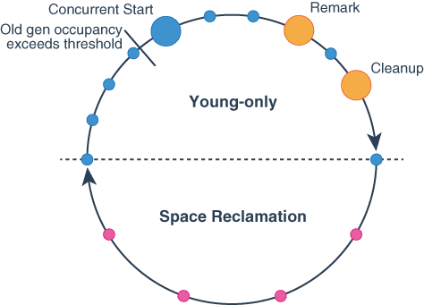  
위 그림은 알고리듬의 Phase 및 STW가 발생하는 걸 표현한 것이다.  

모든 원은 STW가 발생함을 나타낸 것이고, 그 크기에 따라 시간이 달라진다고 생각하면 될 것 같다.  
파란원은 Minor GC가 진행함에 따라 STW가 발생하는 것이고,
주황원은 Major GC가 진행하면서 객체를 마킹하느라고 생기는 STW이고,
빨간원은 Mixed Collection(Minor/Major GC)을 진행함에 따라 STW가 발생하는 것이다.  

Young Only Phase는 이름에서 보듯이 Young Only (Garbage Collection) Phase라고 이해하면 될 것 같다.  
여기서 Major GC가 일어나긴 하지만 마킹만 하는 단계고, 메모리를 회수해가는 단계는 아니기 때문이다.  
파란원이 Minor GC 때문에 생긴 STW이다.  
이렇게 평화롭게 Minor GC만 수행하다가 -XX:InitiatingHeapOccupancyPercent에 지정한 값을 초과하는 순간 Major GC도 시작한다.  
Major GC의 첫단계는 Initial Mark이며 Minro GC와 동시에 수행되며 둘 다 STW를 수반한다. (따라서 다른 파란원보다 크기가 크다.)  
그 이후에 어플리케이션 쓰레드, Minor GC, Concurrent Mark가 동시에 수행되는데 Remark가 수행되는 순간 다른 작업은 멈추게 된다.    
그리고 주황색 원에서 보다싶이 Remark가 수행되면서 STW가 발생한다. (일반 파란원보다 긴 시간이 필요하다.)  
그 이후에 또 짜잘하게 Minor GC가 수행되다가 주황색 원에서 보다싶이 Cleanup을 수행한다.  

이제 Young Only Phase가 끝나고 Space Reclamation(공간 회수) Phase가 시작된다.  
Space Reclamation Phase는 이름에서 보다싶이 Young Only Phase에서 마킹한 리전(Space)의 메모리를 수집(Reclamation)하는 단계이다.  
Space Reclamation Phase에서는 Mixed Collection(Minor/Major GC)이 수행되는데 이는 빨간원으로 표시했다.  
Mark 단계가 없어서인지 Space Reclamation Phase에서는 STW 빈도가 훨씬 줄어든 모습을 볼 수 있다.

Space Reclamation Phase가 끝나면 다시 Young Only Phase로 돌아가서 Minor GC만 메모리를 수집하게 된다.  
이렇게 G1 GC는 Young Only Phase와 Space Reclamation Phase를 번갈아 수행하는 싸이클을 갖고 있다.  

#### Algorithm
이제부터는 각 GC 및 단계를 좀 더 면밀히 관찰해보자.  
아래 나오는 모든 그림의 출처는 [Getting Started with the G1 Garbage Collector - Oracle](https://www.oracle.com/technetwork/tutorials/tutorials-1876574.html)이다.

##### Minor GC (Young Generation)
Minor GC는 기존 GC들과 크게 다르지 않다.  
물론 멀티 쓰레드에서 병렬로 돌아간다.  
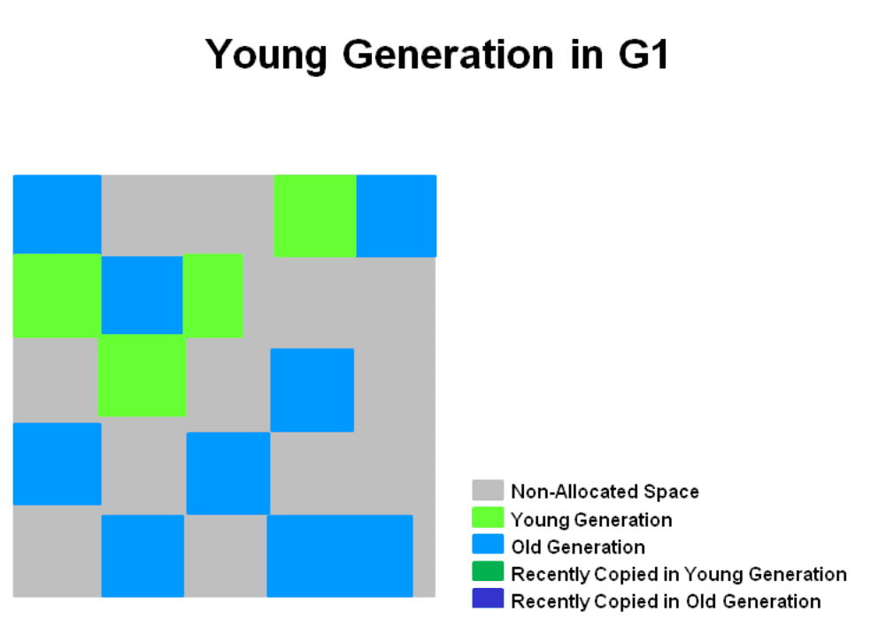  
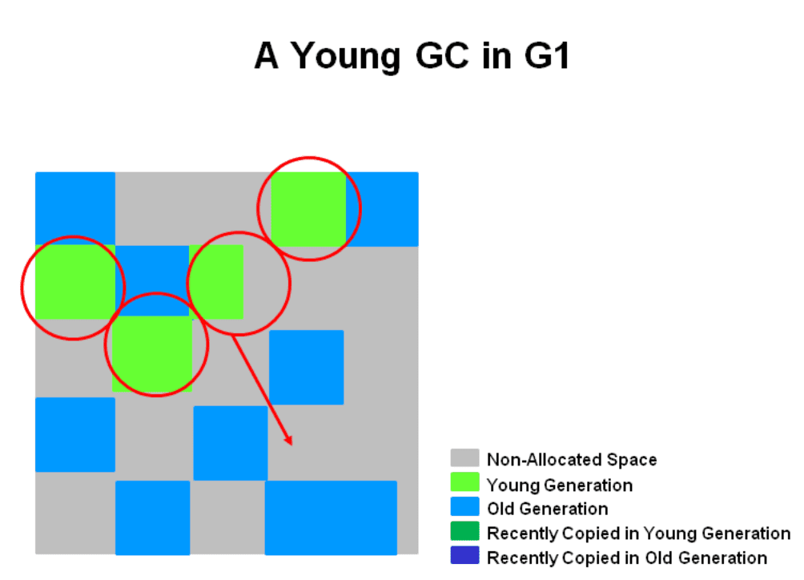  
이 단계에서 STW가 발생하고, Eden과 Survivor의 사이즈는 다음 Minor GC를 위해 재계산 된다.    
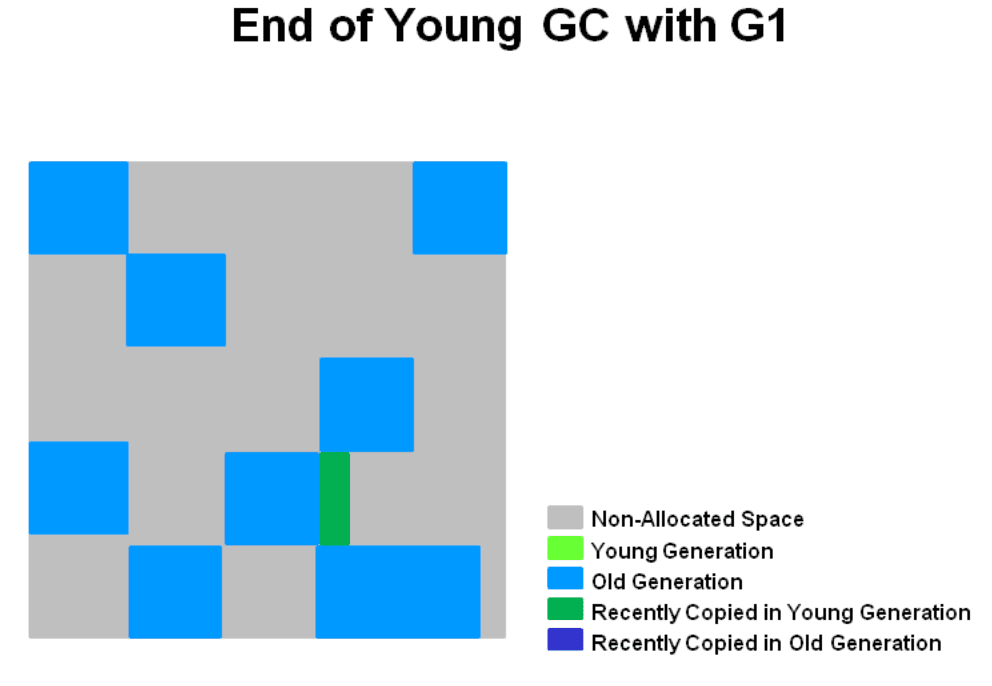  

##### Major GC (Old Generation)
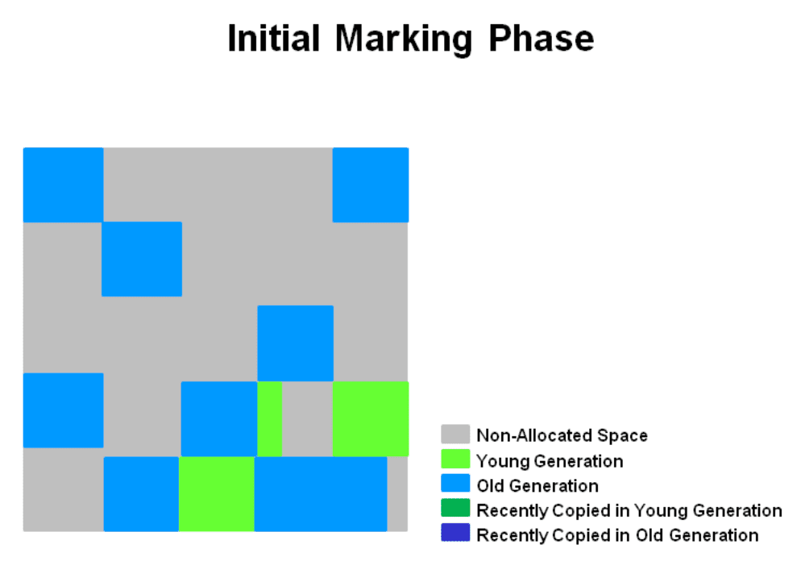  
Initial Mark는 Survivor Region에서 Old Region을 참조하는 게 있는지 파악해서 Mark하는 단계이다.  
Survivor Region에 의존적이기 때문에 Survivor Region은 깔끔한 상태여야하고,
Survivor Region이 깔끔하려면 Minor GC가 전부 끝난 상태여야한다.  
따라서 Initial Mark가 Minor GC에 의존적이다.  

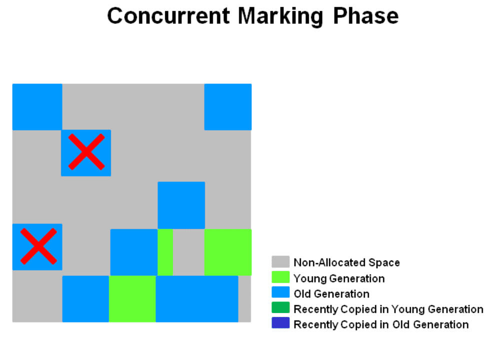  
Concurrent Mark 단계에서는 Old Generation 내에 생존해있는 모든 객체를 마크하고 다닌다.  
STW가 없기 때문에 어플리케이션 쓰레드와 동시에 돌고, 종종 Minor GC한테 인터럽트 당한다.  

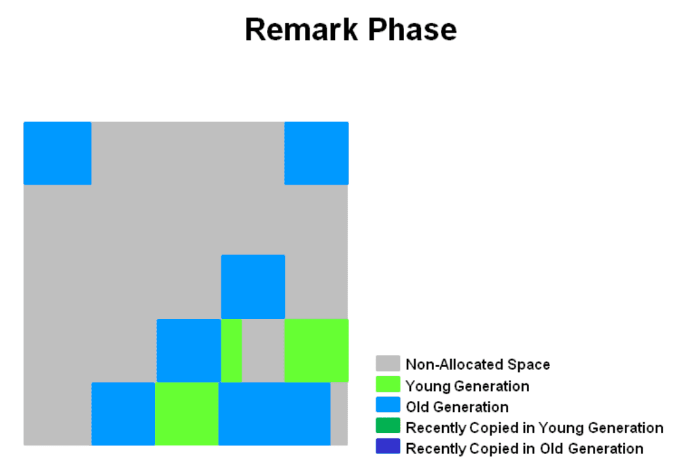  
Remark Phase 역시 STW를 수반한다.    
또한 Concurrent Mark 단계에서 깔짝깔짝 마킹하던 걸 완전히 끝내버린다.  
그리고 SATB(snapshot-at-the-beginning) 기법을 쓰기 때문에 CMS GC보다 더 빠르다.  
여기서 SATB는 `수집 사이클을 시작할 때 접근 가능하거나 그 이후에 할당된 객체를 라이브 객체로 간주하는 기법`이다.

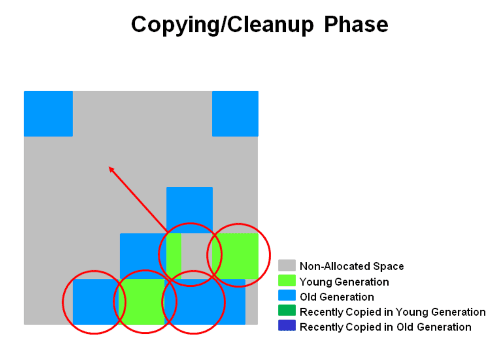  
이 단계는 STW를 수반하지 않는다.    
Remark에서 제일 수집하기 쉬운 Empty Region을 수집해갔으니 이제 그 다음으로 수집하기 쉬운 영역을 수집해갈 차례다.  
Empty Region 다음으로 수집하기 쉬운 Region은 생존률이 제일 낮은 Region이고 생존률이 낮은 순으로 순차적으로 수거해가는 것이다.  
먼저 해당 region을 피난(copy or move)시키고, 수집해간다.  
G1 GC는 이렇게 Garbage의 수집을 우선(First)해서 계속해서 여유 공간을 신속하게 확보해둔다.  

또한 Cleanup 단계에서는 아래와 같은 일을 한다. 
* Performs accounting on live objects and completely free regions. (STW 발생)  
살아있는 객체와 완전히 비어있는 region을 계산함(번역이 맞는지 확인해주십시오 ㅠㅠ)
* RSet을 정리(STW 발생)
* 빈 리전을 정리하고나서 Free List에 추가(Concurrent)

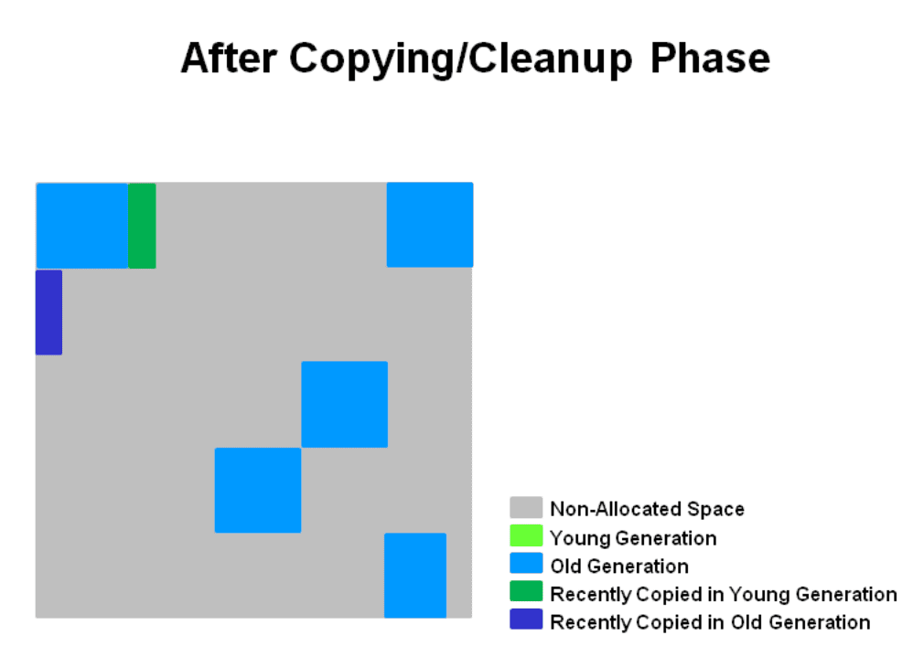

## Epsilon Collector
이 컬렉터는 GC를 전혀 수행하지 않는 컬렉터이다.  
따라서 **실서버 운영 환경에서는 절대 절대 쓰면 안된다.**  

다음의 경우에 적합하다.  
* 성능 테스트 전용  
정확한 성능 테스트를 해야하는데 GC가 돌아감에 의해 영향을 미칠 수도 있기 때문에
이마저도 없앤 후에 성능 테스트를 하고 싶을 때 사용한다.  
[JMH](https://openjdk.java.net/projects/code-tools/jmh/)란 툴로 마이크로벤치마킹 할 때 이런 GC가 영향을 미치는 테스트도 있는 모양이다.
* 할당률이 낮거나 0인 자바 앱 등등  
존재하기나 할까... 싶다.
* 회귀 테스트(정확히 뭔지 모르겠음)  
변경된 코드 때문에 메모리 할당률이 급격히 달라지지 않았나 확인할 때 유용하다고 한다.

혹시나 사용하고 싶다면 `-XX:+UnlockExperimentalVMOptions -XX:+UseEpsilonGC` 옵션을 주자.

## 마치며
은총알은 없는 것 같습니다.  
모든 GC에는 각자 장단점이 있으니 충분하고 검증된 테스트를 통해 본인의 상황에 맞는 GC를 고르는 역량을 길러야합니다. (이러고 작성자는 무조건 G1 GC를 디폴트로 쓰고 있습니다 ㅠㅠ)  
또한 작성자의 역량 부족으로 인해 [Z GC](https://wiki.openjdk.java.net/display/zgc/Main)에 대해서는 다루지 못했습니다.  
또한 Hotspot VM 계열의 GC만 다루었습니다. (제가 OpenJDK만 사용하고 있고, 다 다루기에는 이해하기도 힘들기도 하고 많기도 해서 ㅠㅠ...)
혹시나 다른 VM 계열의 GC(셰난도아(Shenandoah), C4, IBM J9)가 궁금하신 분은 이일웅 님께서 번역하신 [자바 최적화](https://book.naver.com/bookdb/book_detail.nhn?bid=14796595)란 책을 참고하시면 좋을 것 같습니다.    
다시 한 번 거듭 말씀드리지만 절대 해당 책의 홍보는 아니며 좋은 책을 써준 사람과 번역해주신 분께 진심으로 감사하는 마음에 썼습니다.

## 참고 링크
* [Concurrent Mark and Sweep | Plumbr](https://plumbr.io/handbook/garbage-collection-algorithms-implementations/concurrent-mark-and-sweep)  
* [Concurrent Mark Sweep (CMS) Collector - Oracle](https://docs.oracle.com/javase/8/docs/technotes/guides/vm/gctuning/cms.html)  
* [Java Garbage Collection - Naver D2](https://d2.naver.com/helloworld/1329)  
* [쓰레기 수집 (컴퓨터 과학) - 위키피디아](https://ko.wikipedia.org/wiki/%EC%93%B0%EB%A0%88%EA%B8%B0_%EC%88%98%EC%A7%91_(%EC%BB%B4%ED%93%A8%ED%84%B0_%EA%B3%BC%ED%95%99)
* [The JVM Write Barrier - Card Marking](http://psy-lob-saw.blogspot.com/2014/10/the-jvm-write-barrier-card-marking.html) 
* [Java 12 HotSpot VM Options - Oracle](https://docs.oracle.com/en/java/javase/12/tools/java.html#GUID-3B1CE181-CD30-4178-9602-230B800D4FAE)
* [Java 12 Garbage-First Garbage Collector - Oracle](https://docs.oracle.com/en/java/javase/12/gctuning/garbage-first-garbage-collector.html#GUID-ED3AB6D3-FD9B-4447-9EDF-983ED2F7A573)  
* [Getting Started with the G1 Garbage Collector - Oracle](https://www.oracle.com/technetwork/tutorials/tutorials-1876574.html)  
* [JVM 튜닝](https://imp51.tistory.com/entry/G1-GC-Garbage-First-Garbage-Collector-Tuning)
  
