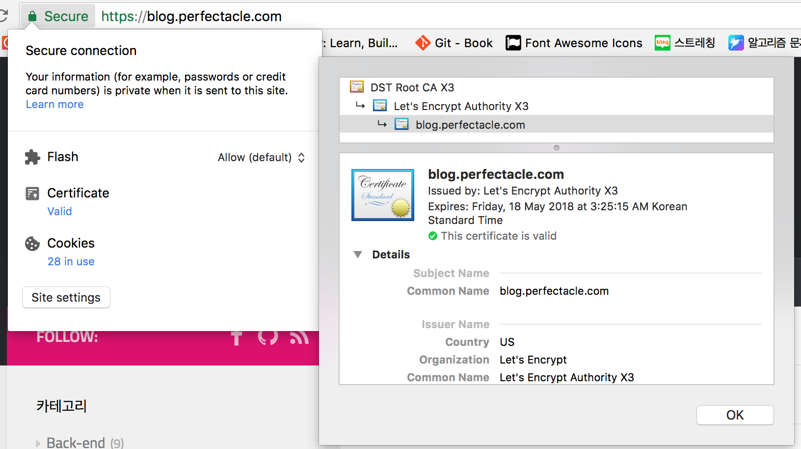

이번 포스트에서는 평문의 데이터를 암호화/복호화 하는 방법에 대해서 이해해보자.  
사람이 알아볼 수 있는 데이터를 평문(plain text)라고 말하고, 평문을 암호화한 걸 암호문(cipher text)라고 부른다.  
수학적 원리를 알아보는 것도 아니기 때문에 간단하게만 정리해봤다.

## 키(KEY)
암호화/복호화 할 때 핵심 역할을 한다.  
예를 들면 `알파벳 순서를 3칸 땡겨라`와 같은 키가 있을 때 키는 두 가지 관점에서 바라볼 수 있다.  
1. 알파벳 순서를 땡겨라/밀어라 - 알고리즘  
암호화 할 때 땡겨라 였으면 복호화 할 때는 밀어라 가 된다.
2. 3칸 - 비밀번호  
비밀번호에 따라서 동일한 알고리즘이지만 암호화 했을 때 다른 값이 나온다.

동일한 알고리즘을 사용했다고 해서 항상 동일한 키가 생성되는 게 아니고, 동일한 패스워드를 사용했다고 해서 동일한 키가 생성되는 게 아니다.  
대부분의 경우에는 수학적 원리를 따지지 않고, 보안상 이슈가 없는 알고리즘을 그냥 선택하기 마련이라서 개발자들이 선택하는 알고리즘은 비슷한 걸 많이 쓰는 걸로 알고 있다.  
알고리즘만 가지고 키를 유추할 수 있다면 웬만한 서비스들의 보안은 구멍 투성이었을 것이다. 

## 대칭키 암호화
암호화/복호화 할 때 사용하는 키가 동일한 경우를 말한다.  
(triple)DES(Data Encryption Standard, 많이 취약한 것으로 알려짐), AES(Advanced Encryption Standard) 등등이 있지만  
AES256 CBC를 가장 많이 쓴다.  
국내에서 만든 걸로는 SEED, ARIA 등등이 있다.  
위 알고리즘은 세 가지 구분으로 나눠서 볼 수 있다.  
1. AES - 알고리즘
2. 256 - 키의 길이를 나타냄.
3. CBC(cipher-block chaining) - 자세한 링크는 [블록 암호 운용 방식](http://brownbears.tistory.com/302)를 참조

암호화/복호화 관련해서 실습을 해볼 때는 [OpenSSL](https://www.openssl.org/)을 이용하면 매우 간편하다.  
```bash
echo "LOVE" | openssl enc -aes-256-cbc -a
```
위 명령어를 치고 비밀번호를 입력하면 해당 키를 가지고 암호화 된 텍스트가 나온다.  

암호화 된 텍스트를 평문으로 복호화 할 때는 아래 명령어를 입력하면 된다.  
```bash
echo "U2FsdGVkX1+3CGPrtP48HYcpt1x2jMB3ZlvUnpLP6H4=" | openssl enc -aes-256-cbc -a -d
```
비밀번호를 잘못입력하면 `bad decrypt`와 같은 문구가 나올 것이고, 비밀번호를 잘 입력하면 올바른 키로 복호화 된 LOVE란 평문을 볼 수 있다.

이렇듯 암호화/복호화 할 때 동일한 키를 사용하는 것을 대칭키라고 부른다.  
대칭키는 암호화 연산 속도가 빠르다는 장점을 가지고 있다.  
하지만 내가 어떤 키로 암호화를 했다면 수신자도 같은 키를 가지고 있어야한다.  
그러기 위해서는 둘이 실제로 만나서 암호화에 쓰였던 키를 교환해야한다.  
하지만 이 과정에서 중간에 제 3자가 개입해서 키를 몰래 엿보거나 조작을 할 수 있다.  
이런 행위를 [중간자 공격(man in the middle attack)](https://ko.wikipedia.org/wiki/%EC%A4%91%EA%B0%84%EC%9E%90_%EA%B3%B5%EA%B2%A9)이라고 부른다.  

## 비대칭키 암호화
대칭키의 키 관리가 매우 취약하다는 문제를 해결하고자 등장한 방식이다.  
대칭키와 반대로 암호화 할 때 사용하는 키와 복호화 할 때 사용하는 키가 다른 경우를 말한다.  
타인에게 절대 노출되서는 안되는 비밀키(개인키), 비밀키를 토대로 만든 공개키가 쌍을 이룬 형태이다.

Diffie–Hellman 키 교환, RSA(알고리즘 제작자인 Ron Rivest, Adi Shamir, Leonard Adleman의 성의 이니셜을 땀) 등등의 알고리즘이 있다.  
TLS, SSH 프로토콜에서는 주로 RSA 알고리즘을 채택해서 사용한다.  

비대칭키 암호화는 키 교환 알고리즘이 안전하다는 장점에 비해 알고리즘이 복잡한 수학적 연산으로 구성돼있어서 속도 측면에서는 단점이다.

또한 앞으로 설명할 비밀키/공개키, 전자 서명, 전자 인증서, CA를 통틀어 PKI(Public Key Infrastructure, 공개키 기반 구조)라고 부른다.

### 공개키 암호화
공개키를 통해 암호화하는 경우를 말한다.  
공개키로 암호화를 했다는 것은 비밀키로만 풀 수 있다는 뜻이다.  
주로 보안에 민감한 정보를 공개키 암호화 방식으로 보낸다.  

특정(수신자) 비밀키로만 복호화가 가능한 공개키를 만드려면 해당 비밀키로 공개키를 만들면 된다.  
하지만 비밀키는 어떠한 사유에서도 유출하면 안 되고, 송신측에서는 수신측의 비밀키가 없으므로 공개키를 만들 수 없다.  
따라서 아래와 같은 시나리오를 따른다.  
1. 수신측에서 본인의 비밀키로 공개키를 만든다.  
2. 수신측은 해당 공개키를 송신측에 보낸다.  
3. 송신측은 해당 공개키로 데이터를 암호화해서 보낸다.  
4. 수신측은 본인의 비밀키로 데이터를 복호화한다.

위 과정에서 다음과 같은 의문을 품을 수 있다.  
`2번의 과정에서 수신측의 공개키가 제 3자에게 탈취당하면 어떡하지?`  
탈취 당해도 된다. 그래봤자 수신측의 비밀키가 없기 때문에 데이터를 복호화 할 수 없다.

하지만 위 과정에서 다음과 같은 취약점이 존재한다.
1. 수신측에서 본인의 비밀키로 공개키를 만든다.
2. 수신측은 해당 공개키를 송신측에 보낸다.
3. 송신 측에 전달하기 전에 제 3자가 패킷을 가로채 자신의 공개키를 송신측에 전달한다.
4. 송신 측은 제 3자의 공개키로 데이터를 암호화해서 보낸다.
5. 이 때 제 3자가 또 패킷을 가로채서 본인의 개인키로 데이터를 복호화하면 원본 데이터 탈취가 가능하다.

#### 전자 인증서
  
공개키 암호화 방식으로 통신할 때 내가 원하지 않는 상대방에게 데이터가 전달되는 취약점을 방지하고자 등장했다.  
전자 인증서는 `자기 자신이라는 것을 증명하기 위한 수단`이라고 보면 된다.
tcp 3way handshake를 통해서 연결이 확립됐다고 해서 안심하면 안 된다.  
공개키 암호화 방식으로 통신을 하기 위해 공개키를 전달하는 과정에서  
공개키를 보내주는 쪽을 흉내낸 제3자가 보낸 공개키일 가능성이 있을 수 있기 때문이다.  
이렇듯 신뢰할 수 있는 곳이 아닌 곳에서 보낸 공개키에 대한 검증 없이 바로 해당 공개키로 암호화해서 데이터를 보내면 데이터가 탈취당한 것이다.  

전자 인증서를 발급받기 위해서는 CA(Certification Authority, 인증 기관)에 발급 요청을 해야한다.  
최근 이슈를 일으킨 시만텍(symantec), 무료 SSL/TLS 인증서를 발급해주는 Let's Encrypt에서 사용하는 ISRG(Internet Security Research Group), Comodo 등등이 있다.
별도의 검증 없이 인증서를 발급해주면 각종 벤더사 등등으로부터 외면받고 신뢰도가 떨어지는 경우도 있으니 어느 인증기관에서 발급한 인증서인지도 중요하다.  
이 CA 사이에도 계층 구조가 있어서 루트 CA가 있고, 그 하위 CA가 연쇄적으로 있다.
따라서 특정 CA는 인증서의 묶음을 가지게 되는데 이걸 보고 인증서 체인(certificate chain)이라고 부른다.

전자 인증서를 발급받으려면 다음과 같은 시나리오를 따른다.  
1. 본인의 공개키와 소유자 정보(도메인 주소 같은 정보)를 CA에 보낸다.  
2. CA에서는 소유자 정보와 공개키를 검증해서 전자 인증서를 발급해준다.  
3. 전자 인증서에는 공개키, 소유자 정보, 인증 기관의 [전자 서명](#전자-서명-비밀키-암호화)이 포함돼있다.

전자 인증서가 공개키 암호화에 어떻게 사용하는지는 아래 시나리오를 보면 된다.  
1. 수신측에서 본인의 비밀키로 공개키를 만든다.  
2. 수신측은 해당 공개키와 소유자 정보를 토대로 CA에 전자 인증서 발급 요청을 한다.  
3. 정상적이라면 전자 인증서를 발급받고 송신측에 전자인증서를 보낸다.  
4. 송신측은 전자인증서를 토대로 수신측이 정말 수신자가 맞는지 확인을 한다.  
전자인증서를 발급해준 CA에게 정말 해당 CA에서 발급한 인증서가 맞는지 확인 요청한다.  
5. 검증이 끝났으면 전자인증서에 있는 공개키로 데이터를 암호화 해서 수신측에 보낸다.  
6. 수신측은 암호화된 데이터를 본인의 개인키로 풀어서 복호화된 데이터를 본다.

### 전자 서명(비밀키 암호화)
전자서명은 비밀키로 암호화한 **데이터**를 의미한다. 
비밀키로 암호화 했다는 것은 공개키로만 풀 수 있다는 뜻이다.  
공개키로 복호화 할 수 있다니 아래와 같은 의문을 품을 수 있다.  
`공개키면 아무나 다 해당 메시지를 풀어볼 수 있는 건가?`  
맞다, 애초에 공개를 위한 메시지이다.  
그렇다면 공개를 위한 메시지인데 왜 암호화를 한 것일까?  
이름에서부터 알 수 있듯이 전자 **서명**이다, 본인의 신원을 보증하는 역할을 한다.  

어떤 근거로 전자 서명이 본인의 신원을 보증하는 역할을 하는 것일까?  
바로 비밀키로 암호화하기 때문이다.  
비밀키는 본인만 가지고 있어야하고, 그런 전제가 성립된다면 해당 비밀키를 가진 장비에서 데이터를 보냈다는 사실이 입증되는 것이다.  
따라서 비밀키는 어떠한 경우에도 공유가 이뤄지면 안 된다.  

전자 서명은 아래와 같은 시나리오를 따른다.  
1. 송신측에서 데이터를 비밀키로 암호화한다.
2. 수신측에서 데이터를 복호화해야하니 암호화한 데이터 + 공개키를 같이 보낸다.
3. 수신측에서는 암호화한 데이터를 받아서 송신측의 공개키를 통해 데이터를 복호화한다.

하지만 위와 같은 과정에서는 다음과 같은 문제가 발생한다.  
2번의 과정에서 제 3자가 패킷을 가로채서 데이터를 조작하고 본인의 개인키로 암호화한 후에 본인의 공개키를 실어서 보내면
수신측에서는 송신측에서 보낸 정보라고 취급하기 때문에 이 부분은 취약점이라고 할 수 있다.

#### 해시 함수(메시지 다이제스트 함수)
해시 함수는 데이터의 무결성(위변조가 일어나지 않았다는 검증)을 위해 등장했다.  
해시 함수는 임의의 메시지를 입력 받으면 고정된 블록의 길이의 메시지를 출력하는 함수이다.  
데이터 압축과는 달리 복호화가 불가능한 함수이다.  
복호화가 불가능 하기 때문에 단방향 암호화에서도 쓰이며 비밀번호화 같이 데이터가 유출돼도 원본 데이터의 유추가 불가능해야하는 보안에 아주 민감한 정보에 대해 이런 방식으로 암호화를 한다.  
라고 생각할 수 있으나 해시 함수는 애초에 비밀번호와 같은 데이터를 암호화 하려고 설계된 게 아니라 짧은 시간에 데이터를 검색하기 위해 설계됐으므로  
데이터의 무결성을 체크할 때만 확인해야한다, 자세한 내용은 [안전한 패스워드 저장](http://d2.naver.com/helloworld/318732)을 확인하자.  
(이러한 이유 때문에 대부분의 웹서비스가 비밀번호를 알려주고 싶어도 보안상 이슈로 알려주지 못하고 초기화를 진행하게 되는 것이다.
만약 아직도 비밀번호를 알려주는 서비스가 있다면 보안에 대한 관리가 허술하게 운영되고 있는 사이트라고 판단하면 된다.)
데이터 압축은 데이터의 모든 데이터를 들고 있는 반면에 해시 함수는 데이터의 손실이 발생해서 복구가 불가능하다.  
데이터의 손실이 있기 때문에 다른 입력값인데도 불구하고 동일한 출력이 발생하는 충돌(Collision)이 발생할 가능성이 존재한다.  
이런 충돌에 관해서는 [비둘기집 원리](https://namu.wiki/w/%EB%B9%84%EB%91%98%EA%B8%B0%20%EC%A7%91%EC%9D%98%20%EC%9B%90%EB%A6%AC)나 [생일 문제](https://ko.wikipedia.org/wiki/%EC%83%9D%EC%9D%BC_%EB%AC%B8%EC%A0%9C)를 참고해도 재미있다.  

예를 들면 이름을 입력하면 성을 출력하는 해시 함수를 생각해 볼 수 있다.  
```
f(양권성) = 양
f(양간장) = 양
```
양권성이란 데이터를 입력했더니 양이란 데이터가 출력됐다.  
이 과정에서 데이터의 손실이 발생했다.  
또한 양권성과는 다른 양간장이란 데이터를 입력했더니 동일한 출력이 양이 나왔다.  
해시 함수의 출력값을 `메시지 다이제스트`라고 부른다.

이렇듯 충돌이 잦은 알고리즘은 좋은 해시 함수라고 말할 수 없으며 취약점이 아주 많다.  
따라서 혼자서 해시 함수를 만들어서 상용 서비스에 사용하겠다는 생각보다는
MD5(Message-Digest algorithm, 보안상 취약점으로 권장되지 않음)나 
SHA(Secure Hash Algorithm, SHA-1도 보안상 취약점이 발견됨) 같은 검증된 알고리즘(취약점이 발견되지 않고, 충돌이 잦지 않은)을 사용하는 게 좋다.

이 해시 함수가 어떻게 전자 서명에 사용되는지 아래 시나리오를 보면 된다.
1. 송신측에서 해시 함수를 통해 원본 메시지를 해싱해서 메시지 다이제스트를 구한다.  
2. 메시지 다이제스트를 비밀키로 암호화한다.
3. 수신측에 해시 함수 알고리즘, 비밀키로 암호화한 메시지 다이제스트, 원본 데이터, 공개키를 전달한다.  
4. 수신측에서는 비밀키로 암호화한 메시지 다이제스트를 공개키로 풀어서 원래 메시지 다이제스트를 구한다.  
5. 원본 데이터를 해시 함수 알고리즘으로 해싱해서 메시지 다이제스트를 구한다.  
6. 4번과 5번의 메시지 다이제스트가 일치하면 데이터 위변조가 없다고 판단하고 송신측에서 전달한 데이터라는 걸 신뢰하면 된다.  

## 대칭키 암호화와 비대칭키 암호화의 혼용
대칭키는 속도가 빠른 대신에 키 교환에 있어서 취약점이 존재하고,
비대칭 키는 키 교환에 있어서 안전한 반면에 속도가 느리다는 단점이 존재한다.  
따라서 위 두 방식을 섞어 사용하면 장점만을 살릴 수가 있다.  
키 교환에는 비대칭 키를 사용하고, 데이터 암호화/복호화에는 대칭키 암호화를 진행하면 된다.  

1. 송신측에서 대칭키를 공개키 암호화 한다.  
  1. 수신측에서 공개키가 포함된 전자 인증서를 송신측에게 보낸다.  
  2. 송신측에서 전자 인증서를 토대로 수신측의 신원 확인을 한다.  
  3. 검증이 끝나면 공개키를 신뢰하고 쓰면 되고, 이제 공개키를 위한 키 교환 알고리즘은 끝났다.
2. 수신측에서는 암호화 된 대칭키를 비밀키로 푼다.  
3. 송신측/수신측 모두 대칭키를 안전하게 전달받았으므로 해당 대칭키로 암호화/복호화를 통해 통신하면 된다.

위 과정을 이해하면 SSL/TLS 프로토콜이 어떻게 동작하는지 이해할 수 있다.