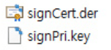
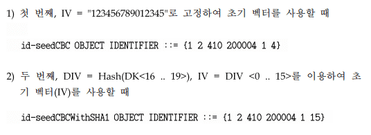
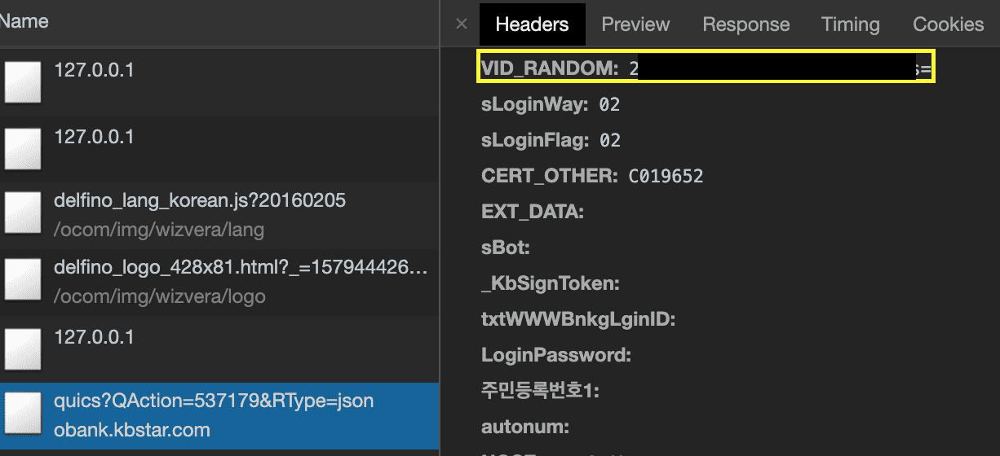

## 인증서는 왜 쓸까
A가 데이터를 보냈는데 이게 진짜 A가 보낸 건지 아닌지를 검증할 수가 없다.  
인증서는 A라는 사람이라는 것을 **보증해주는 문서**라고 보면 된다.  
따라서 A한테 메세지가 올 때 A의 인증서가 오지 않는다면 A라고 취급을 하지 않으면 된다.  
하지만 개나소나 인증서를 발급할 수 있으면 A 행세를 아무나 낼테니까 **인증된 기관(CA, Certificate Authority)**으로부터 적절한 절차를 거쳐 인증서를 발급받을 수 있다.

우리가 알고 있는 TLS 인증서(https 도메인마다 발라져있는) 같은 경우에도 이런 절차를 거쳐 발급된다.
그리고 이런 인증서들은 **X.509(공개키 인증서 포맷의 표준)**라는 표준을 준수한다.

## 공인인증서는 왜 나왔을까
인터넷 뱅킹이나 온라인 쇼핑몰 등등을 이용하기 위해서는 보안이 취약해서는 안되며 이를 위해서 인증서 사용은 필수이다.

[https://news.joins.com/article/521864](https://news.joins.com/article/521864)  
하지만 과거에는 미국의 수출 금지법에 의해 미국을 제외한 나라에서는 브라우저에서 56bit 길이 이하의 약한 암호화 방식 밖에 사용할 수 없었다.

따라서 국내에서 직접 암호화 알고리즘인 SEED(128bit 길이, 2009년부터는 256bit 길이도 제공)를 개발하고,  
해당 알고리즘을 사용하는 **공인인증서**도 만들게 되었다. 하지만 국제 표준 암호 알고리즘도 아니고 국내에서만 인증된 CA에서 발급한 인증서이다보니 웹 브라우저에서 사용할 수 없었다.  
따라서 당시 국내 점유율이 압도적인 IE에서 사용이 가능한 ActiveX라는 기술을 사용하여 공인인증서를 사용할 수 있게 만들었다.

과거에는 어쩔 수 없는 선택일 수 밖에 없었을 것 같은데 브라우저에서 해당 제약이 사라진 요즘같은 시대에
비표준 기술을 위해 ActiveX나 설치형 프로그램을 잔뜩 깔아야하는 건 아마 여러 이해관계가 얽혀있기 때문이 아닐까 싶다.
(그 때문에 사용자만 엄청 고생하는 ㅠㅠ...)

## 공인인증서 구조

MacOS는 /Users/사용자이름/Library/Preferences/NPKI,  
Windows 10는 C:\Users\사용자이름\AppData\LocalLow\NPKI에 위치하고 있다.

공인인증서(\*.der, \*.cer 등등)와 개인키(\*.key)파일로 이루어져있다.  
아니면 공인인증서와 개인키 파일이 합쳐진 형태(\*.p12, \*.pfx 등등)로 이루어진 경우도 있다.  
공인인증서와 개인키 파일이 합쳐진 형태는 PKCS#12(**P**ublic **K**ey **C**ryptography **S**tandards, 공개키 암호화 표준의 12번째 표준)을 준수하고 있다.  
PKCS#12는 다수의 `X.509 인증서 + 개인키` 묶음을 하나의 파일로 저장하기 위한 표준이다.

## 공인인증서
*.cer(Canonical Encoding Rules) 또는 *.der(Distinguished Encoding Representation)과 같은 확장자를 가지며 바이너리 형태로 인코딩 돼있다.

  
공인인증서는 **X.509 V3**을 따른다.
또한 공인인증서 소유자의 **공개키** + CA(Certificate Authority, 발행기관) 정보 및 **전자서명** + 사용목적 + 유효기간 등등이 저장돼있다.

위 인증서는 은행에서 사용 중인 공인인증서인데 은행에 대한 정보는 1도 없다.  
아마 은행은 CA가 아니기 때문에 CA에게 대신 발급 요청(CSR, Certificate Signing Request)을 하고 발급받은 인증서를 개인에게 전달해주는 시스템 같다.  
아마 보안모듈은 공인인증서를 전달받으면 해당 CA로부터 발급된 인증서가 맞는지 검증까지 해주는 것 같다.  
(TLS 인증서였다면 이런 행위는 브라우저가 알아서 해주겠지만...)  
CA(인증서 발급 기관, Certificate Authority)에게 인증서 발급을 요청할 때 요청자의 공개키를 함께 보낸다.    
그러면 CA는 서명(CA의 개인키로 암호화)한 인증서를 발급해준다.    
그리고 인증서 안에는 **인증서 발급 요청자의 공개키**가 포함돼있고, 어떤 용도의 인증서인지,
어느 기관(CA, Certificate Authority)에서 발급한 건지 등등의 정보가 포함돼있다.

  
또한 공인인증서는 국내에서만 사용하는 인증서이기 때문에 OS 레벨에서는 해당 인증서가 신뢰된 CA로부터 발급받은 인증서인지 알 수가 없다.
(그냥 은행이나 공공기관 등등을 믿고 쓰는 수 밖에...)

## 비밀키 (*.key)
  
[전자서명인증관리센터](https://www.rootca.or.kr/kor/accredited/accredited06_01.jsp)에 보면 PKCS#5와 PKCS#8 형식이라고 나와있다.

> In cryptography, PKCS #8 is a standard syntax for storing private key information.
  The PKCS #8 private key may be encrypted with a passphrase using the PKCS #5 standards,
  which supports multiple ciphers.

PKCS#8(Private-Key Information Syntax Standard)이 뭔지 찾아보니 [위키피디아](https://en.wikipedia.org/wiki/PKCS_8)에서는 개인키 저장을 위한 문법 표준이라고 하고 있다.  
웬만한 개인키는 다 이 형식을 따르는 것 같다.  
여기서 말하는 passphrase는 사용자가 공인인증서를 만들 때 입력한 비밀번호를 의미한다.

이번엔 PKCS#5(Password-Based Cryptography Standard)가 뭔지 찾아보니 패스워드를 깨먹기 어렵게 하기 위한 표준 같아 보였다.  
그 안에는 Key Derivation Functions라는 게 있는데 패스워드 + salt + 이터레이션 카운트(해당 함수를 몇 번 이터레이션 돌릴지) 등등을 인자로 받아서 추가 연산을 진행하는 함수인데,
패스워드를 빠르게 계산하기 어렵게 해서 해커가 공격을 빠르게 하지 못하게 막기 위해 사용하는 함수 같다. 
이런 Key Derivation Function을 커스텀하게 구현해도 되지만 좀 더 검증되고 표준에 등재된
PBKDF1과 PBKDF2가 있는데 공인인증서는 두 가지 방식을 모두 지원한다.

그리고 공인인증서의 개인키는 SEED 알고리즘으로 암호화해서 저장돼있다고 하니 개인키를 얻어오려면 복호화를 해야한다.

## ASN.1(Abstract Syntax Notation One)
X.509 인증서의 데이터 구조는 ASN.1 표기법에 의해 표기된다.
따라서 디코딩해보면 더 많은 정보를 얻어낼 수 있는데 온라인에서 디코딩을 할 수 있다.  

  
[https://lapo.it/asn1js](https://lapo.it/asn1js)에 들어가서 공인인증서나 개인키 파일을 Base64로 인코딩한 텍스트를 입력한 후에 decode 버튼을 누르면 더 자세한 정보를 볼 수 있다.  

  
개인키 파일을 디코딩해보면 어떤 암호화 알고리즘을 사용했는지, 어떤 KDF(Key Derivation Function)를 사용했는지 나온다.
object identifer를 [http://oid-info.com/get/1.2.410.200004.1.4](http://oid-info.com/get/1.2.410.200004.1.4)에서 검색하면 더 자세한 정보가 나온다.

  
또한 [SEED 알고리즘 규격 문서](http://www.rootca.or.kr/kcac/down/TechSpec/2.3-KCAC.TS.ENC.pdf)를 보면 OID에 따라서 초기 벡터 값을 어떻게 세팅해야하는지 나온다.

## ActiveX로 깔은 모듈(delfino, Xecure 등등)에서는 무슨 일을 할까...?
  
그 안에서 공인인증서도 가져오고, 개인키 파일을 복호화 해서 개인키를 획득하기도 하고...  
여러가지 행위들을 한다.

  
PKCS #7(Cryptographic Message Syntax)이 뭔지 찾아보니 전자서명에 대한 표준 같아 보였다.  
실제로 어떤 카드사의 경우에는 PKCS7 방식으로 전자서명 하는 모듈을 쓰는 곳도 있다.

근데 PKCS7에 보낸 데이터를 보니 Base64 인코딩 된 스트링이고 이 데이터는 전자서명한 데이터는 아니고,  
ASN.1 Decoder로 보니 내 공인인증서였다.  
내 공인인증서를 보냄으로써 내가 맞는지 검증하는 것 같다.  
하지만 공개키 인증서는 기본적으로 여기저기 공유가 돼도 문제 없도록 만들었다.  
따라서 저 공인인증서를 내가 전달한 건지, 남이 전달한 건지 서버는 알 길이 없다.

  
[식별번호를 이용한 본인확인 기술규격](http://www.rootca.or.kr/kcac/down/TechSpec/1.5-KCAC.TS.SIVID.pdf)을 보면 다음과 같은 부분이 나와있다.  
`VID = h(h(IDN, R)`

- VID: 가상식별번호
- h( ) : 해쉬 함수
- IDN : 식별번호
- 식별번호 : 전자서명법 시행규칙 제13조의2에 의한 주민등록번호, 사업자등록번호 및 고유번호
- R: 비트열 난수
  `본 규격에서는 적어도 160비트 이상의 안전한 임의의 난수를 생성하여 사용해야한다. 난수는 가상 식별번호를 생성하는데 사용되며 가상 식별번호와 함께 공인인증기관에 전달되어 공인인증기관이 식별번호를 검증하는데 사용된다.`
  국민은행 측에 보낸 VID_RANDOM 값을 Base64 디코딩해보면 20바이트(160비트)의 데이터가 나온다.
  

따라서 보안 모듈에서는 다음과 같은 행동이 일어났다.

1. 공인인증서 목록을 불러온다.
2. 비밀번호를 입력받아서 개인키를 복호화한다.
3. 복호화한 개인키에서 R값을 가져온다.
4. js에서 보안모듈(127.0.0.1)과 통신을 해서 R값과 공인인증서 값을 받아와서 국민은행 사이트에게 ajax로 요청을 보낸다.
5. 해당 유저의 공인인증서와 R값이 맞다면 로그인을 성공시킨다.

모듈마다 어떻게 인증 절차를 거치는지 다 다르다.  
어떤 모듈은 PKCS7 방식으로 전자서명한 데이터를 보내는 모듈도 있고, 어떤 모듈은 추출한 R 값을 한 번 더 암호화 해서 보내는 곳도 있고,
어떤 곳은 Base64 인코딩이 아닌 Hex 인코딩을 사용하는 곳도 있다.  
하지만 같은 모듈을 사용하는 은행/카드사가 있다면 비슷한 방식을 통해 로그인 과정이 이뤄진다.  
(하나를 뚫으면 여러 벤더사를 함께 뚫을 수 있게 된다.)

## 참조 링크
* [https://www.letmecompile.com/certificate-file-format-extensions-comparison/](https://www.letmecompile.com/certificate-file-format-extensions-comparison/https://www.letmecompile.com/certificate-file-format-extensions-comparison/)
* [https://indienote.tistory.com/272](https://indienote.tistory.com/272)
* [https://indienote.tistory.com/273](https://indienote.tistory.com/273)
* [https://www.slideshare.net/ied206/4th-inc0gnito](https://www.slideshare.net/ied206/4th-inc0gnito)
* [https://unius.tistory.com/entry/%EC%A0%84%EC%9E%90%EC%84%9C%EB%AA%85-%EC%89%BD%EA%B2%8C-%EC%9D%B4%ED%95%B4%ED%95%98%EA%B8%B0https://unius.tistory.com/entry/%EC%A0%84%EC%9E%90%EC%84%9C%EB%AA%85-%EC%89%BD%EA%B2%8C-%EC%9D%B4%ED%95%B4%ED%95%98%EA%B8%B0](https://unius.tistory.com/entry/%EC%A0%84%EC%9E%90%EC%84%9C%EB%AA%85-%EC%89%BD%EA%B2%8C-%EC%9D%B4%ED%95%B4%ED%95%98%EA%B8%B0)
* [https://news.joins.com/article/521864](https://news.joins.com/article/521864)
* [SEED 암호 알고리즘 규격](https://www.rootca.or.kr/kcac/down/TechSpec/2.3-KCAC.TS.ENC.pdf) 
* [전자서명 인증서 프로파일 규격](https://www.rootca.or.kr/kcac/down/TechSpec/1.1-KCAC.TS.CERTPROF.pdf)