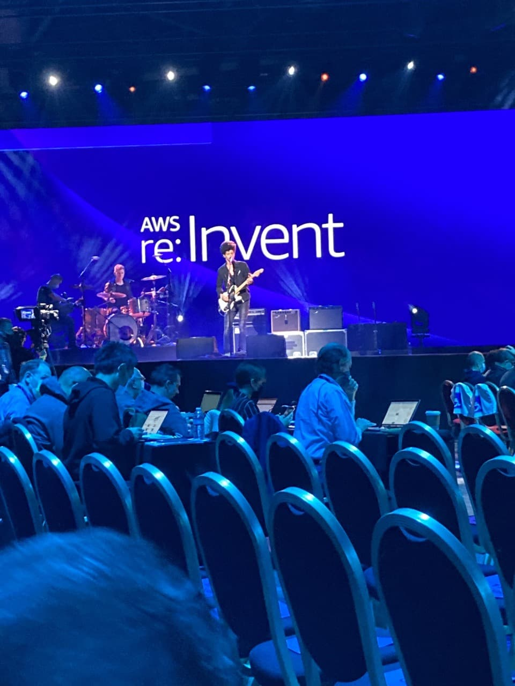
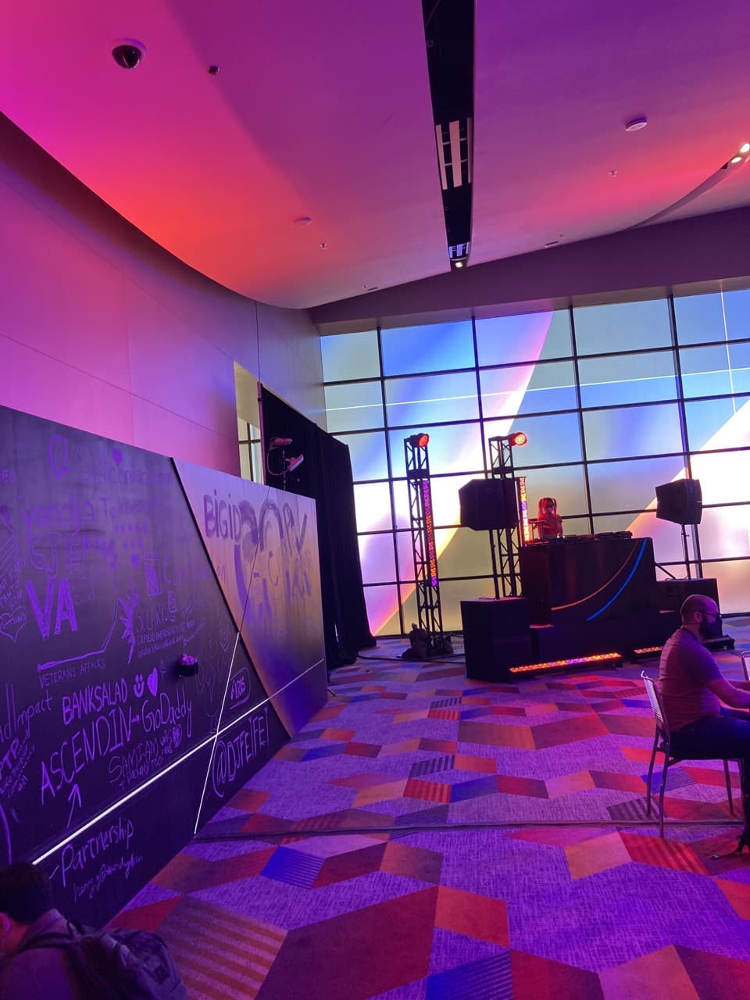
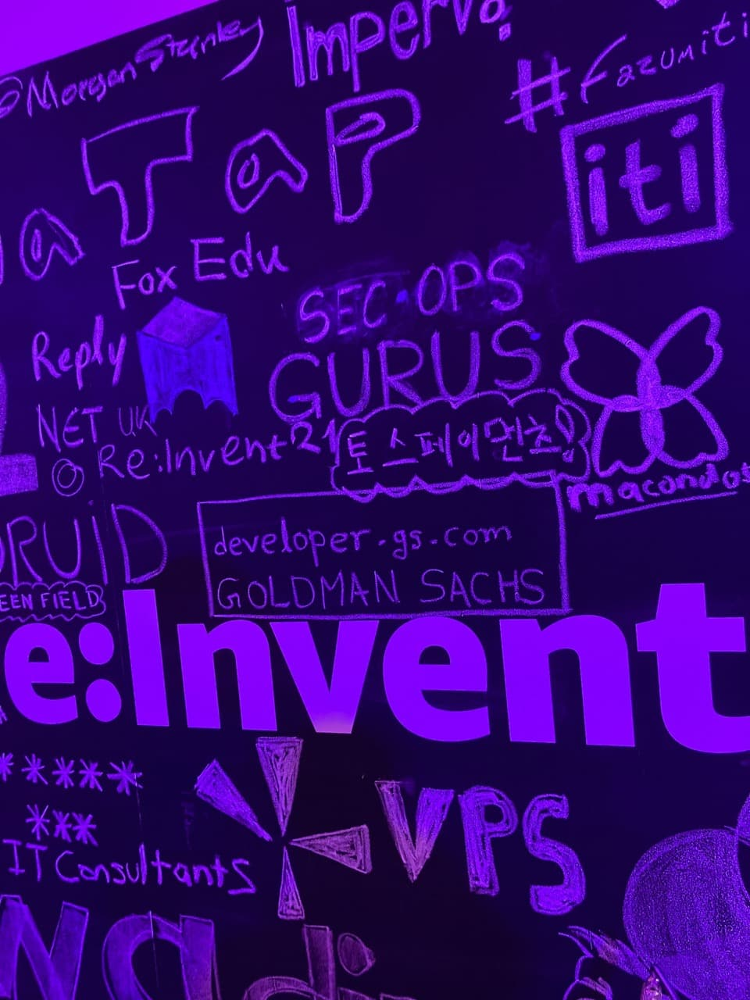
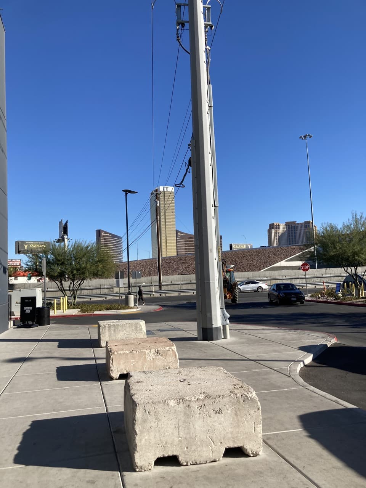
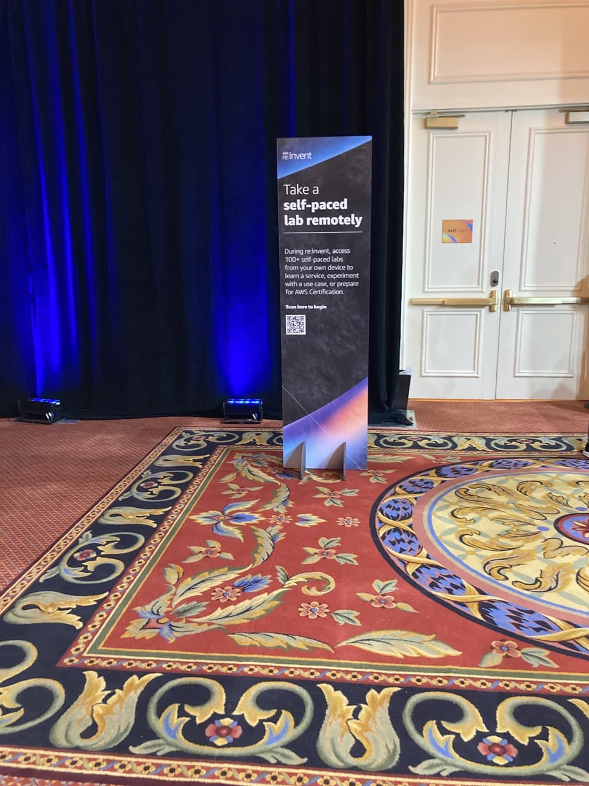
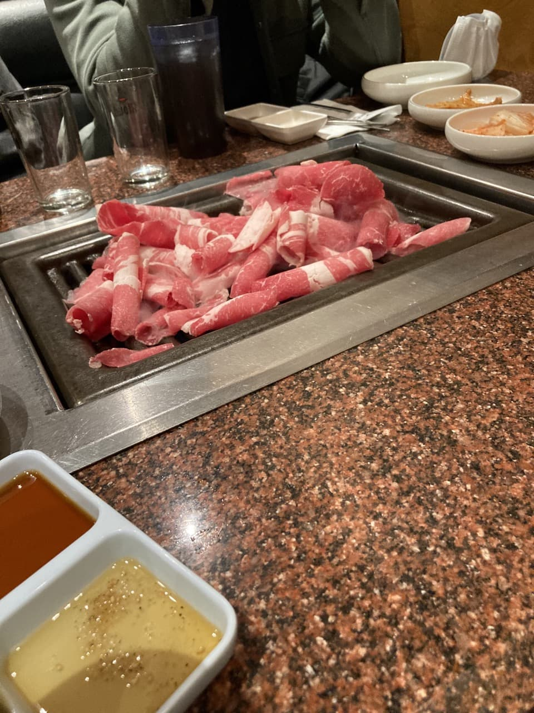
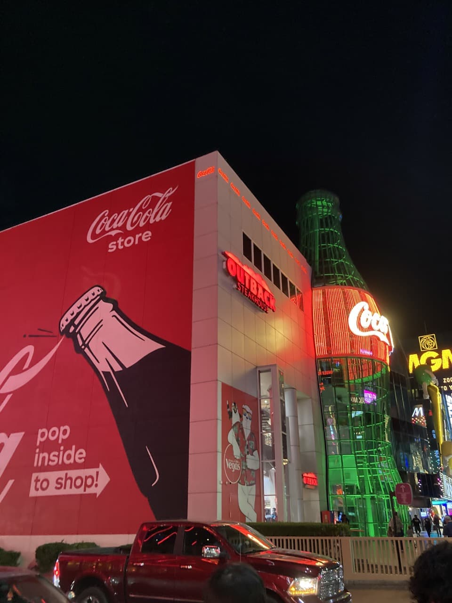
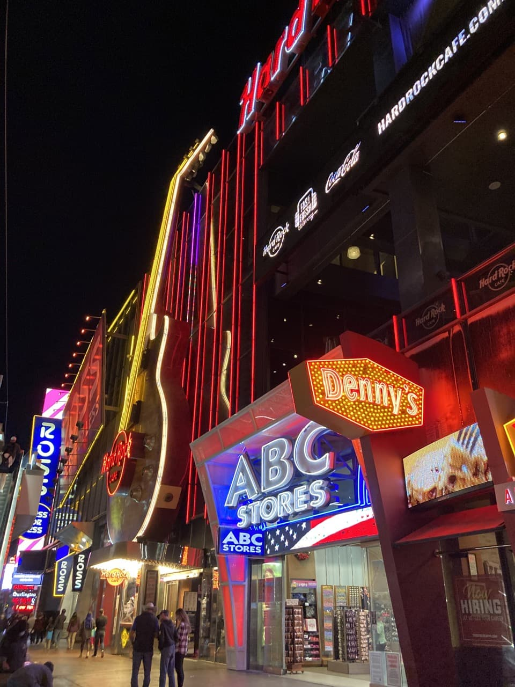

회사에서 좋은 기회가 생겨 [AWS re:invent](https://reinvent.awsevents.com/)(2021/11/29 ~ 2021/12/03)에 참석할 기회가 생겼다.  
영어도 잘 못하고, 평상시 [AWS](https://aws.amazon.com/)를 직접 쓰지 않은지 오래 되기도 했지만 견문을 넓히자는 차원에서 지원하여 갔다오게 되었다.  
살면서 미국에 처음 가보는 것이다보니 `미국에서만 할 수 있는 걸 해보자`라는 목표를 세우고 갔으나 많은 실패들이 있었고, 영어가 잘 안되다보니 aws reinvent 컨벤션 후기 보다는 라스베가스 여행기가 되어버린 것 같았다.
기술적인 부분에서 인사이트를 크게 얻지 못해 창피하여 aws reinvent 후기는 적지 못하고, 미국이라는 기회의 땅에 가본 경험을 휘발성 데이터로 냅두기 아까워 기억들이 더이상 날아가기 전에 이렇게라도 기록을 해둬야할 거 같아서 이 글을 쓰게 되었다.
쓰다보니 사진이 많아서인지 글이 좀 루즈해지는 감이 없잖아 있어 파트를 좀 쪼개보았다.

* [1편 - 인천공항에서 세미나 첫 날까지 (11/28 ~ 11/29)](/2021/12/31/las-vegas-aws-reinvent-01/)
* 2편 - 세미나 둘째 날 (11/30) - 현재 게시물
* [3편 - 세미나 셋째 날 (12/01)](/2021/12/31/las-vegas-aws-reinvent-03/)
* [4편 - 세미나 넷째 날 (12/02)](/2021/12/31/las-vegas-aws-reinvent-04/)
* [5편 - 세미나 마지막 날부터 인천공항까지(12/03 ~ 12/05)](/2021/12/31/las-vegas-aws-reinvent-05/)

## 어느정도 익숙해지기 시작한 세미나 둘째 날

베네시안 호텔에 아침부터 키노트가 있어서 이동을 하였다.  
그래도 반복되는 길을 이틀 동안 왔다갔다 하다보니 도시의 풍경과 길들이 익숙해지기 시작했다.  
또 신기한 것은 라스베가스 호텔 근처에서는 24시간 내내 음악 소리가 들리는 것 같았다.  
밤에는 시끄러운 음악이 들렸던 것 같은데 아침에는 또 잔잔한 음악이었나... 여튼 분위기에 맞는 음악이 길거리에 울려퍼지는 게 신기했다.

  
어제만 해도 김치나 라면이 마려웠는데 잠자고 일어나니 그새 까먹고 빵보니 또 눈이 돌아가서 두 개나 집었다.  
약간 좀 과하게 집었나... 생각이 들어 뒤를 쳐다봤는데 외국인들도 빵은 하나만 집고 있었다.  
평상시에 아침도 잘 먹지 않는데 두개는 역시나 과했는지 한 개 밖에 먹지 못했다.

아침을 먹고 키노트 세션을 들으러 갔는데 대기시간에 유명한지 안 유명한지 모르겠는 밴드가 공연을 하였다.

키노트가 시작되어 연설을 했고 내가 샌프란시스코 - 라스베가스로 이동할 때 탔던 United 항공사라던지 나스닥 거래소라던지 이런 기업들이 어떻게 AWS를 사용해서 문제를 해결했는지 설명해주었다.  
영어라서 뭔소린지 제대로 못 알아듣고, 그냥 그런갑다~란 생각으로 듣곤 했다.
나중에 알고보니 키노트는 동시통역을 제공해줬다고 한다.  
근데 다른 키노트에서 들어보았는데 헤드셋이 너무 압박해서 귀가 아픈데 막상 주변 잡음은 다 들렸다.  
그리고 영어를 한국어로 통역하다보니 어순이 맞지 않아 발표자가 한참 말하고 나서 한국어로 따다다다 통역을 하는 경우도 생겼고,  
무엇보다 통역하는 사람이 엔지니어가 아닌 거 같은 게 통역의 퀄이 썩... 좋지 않았다.

키노트가 끝나서 또 다른 세션 장소로 이동 중이었는데 아침부터 DJ는 열일하고 있었다.  
어제 저녁에도 다른 DJ가 있었던 것 같은데 아마 몇교대를 계속 돌리는 것 같았다...

그리고 칠판같은 공간에 여러 낙서가 있었고 기업을 홍보하는 듯한 문구도 있었다.  
나는 악필이라 딱히 적지 않았고 동료 분께서 회사명을 적은 걸 기념해서 한 컷 찍어보았다.
(가끔 이렇게 영어 속에 다른 한글로 된 기업들의 문구를 보면 뭔가 반갑고 신기했다.)

## 코로나 검사를 받기 위한 여정
코시국이다보니 입국할 때도 코로나 PCR 음성 검사 확인서가 있어야했다. (물론 출국할 때도 영문으로 된 확인서가 필요하기에 한국에서 8만원 가량을 내고 민간 병원에서 진행하였다.)  
백신 2차 접종여부에 따라 달라지지만 나는 2차 접종을 했기 때문에 출국하기 72시간 이전에 검사받은 확인서가 필요하였다.  
금요일 저녁에 출국이기 때문에 적당히 화요일 오후에 진행하였다.  
무료로 해주는 곳은 시간이 좀 걸려서 혹시나 출국 전까지 안 나올 가능성이 존재하여 따로 유료로 하는 곳도 알아보았는데 호텔까지 와서 검사를 해주는데 30만원 가량이 들었다.  
리스크에 도박을 해야했지만 30만원은 좀 선넘는다는 생각에 무료로 하거나 좀 더 싸게 할 수 있는 방법을 찾아보게 되었다.
대부분이 드라이브 쓰루 검사 밖에 지원을 해주지 않았지만 [curative](https://book.curative.com/sites/32612) 사이트에서 라스베가스에 Walk in(차 없이 걸어서) 검사가 가능한 곳을 찾았다.  
혼자 리스크를 감수하기에는 좀 쫄려서 동료 한 명을 섭외하고 같이 무료로 코로나 검사 예약을 진행하였다.

택시를 타고 이동하였는데 이상한 자동차 전시물과 건물, 주차장 말고 코로나 검사라고 보일법한 공간이 보이지 않았다.  
그래서 뭔가 이상하여 건물을 쭉 한바퀴 돌아도 여전히 코로나 검사 안내 표지판이 하나도 보이지 않아 직원으로 보이는 사람 아무나 붙잡고 물어보았다.  
뭐 영어는 잘 통하지 않았지만 대충 어느 방향으로 가라 정도까지만 알아듣고 또 가다가 이해가 안 되면 주변에 있는 사람 붙잡고 물어볼 예정이었다.  
직원이 안내한 공간으로 아무리 가도 주차장 말고 다른 큰 건물 같은 건 보이지 않았다.  
그러다 주차장 가장 구석에 컨테이너 박스가 하나 있는 것이 보였고 거기서 코로나 검사를 진행한다는 작은 안내표시판 같은 게 있어서 그걸 보고 겨우겨우 코로나 검사를 마칠 수 있었다.  
가끔 코로나 검사 결과가 너무 빨리 나와 72시간이라는 기준을 준수하지 못하는 경우도 있어서 일부러 해당 시간 지나서 결과가 나오게 해달라고 얘기를 하고 그 다음날 검사 결과 이메일이 날아와서 코로나 검사는 다행히 잘 끝마칠 수 있었다.

## 세션 말고 할만한 건 뭐가 있지?

세션을 계속 듣긴 듣는데 집중은 안 되고... 이해는 안 되고... 슬슬 지쳐갔다.
과연 세션을 무리해서 듣는 게 의미가 있을까? 라스베가스 현지에서만 할 수 있는 건 뭘까? 하고 고민하다가 찾은 게 Self-paced lab이었다.  
들어가면 강의실에 온 거 마냥 자리에 PC(안타깝게 윈도우)들이 깔려있고 AWS 콘솔에 로그인을 하면 상황을 선택하여 AWS의 서비스들을 사용하여 해결하는 방식으로 AWS 서비스에 익숙해질 수 있게 만들어주었다.
들어가니 한국인 AWS 솔루션 아키텍트 사람도 있어서 간단한 대화를 나누었다. 내가 AWS를 직접 썼더라면 더 다양한 걸 물어봤을텐데 평상시 사용을 하지 않아서 궁금증이 덜 한 상태에서 만나서 별로 얘기할 껀덕지는 없었다.
그리고 나는 이해도가 느려서 그냥 상황 해결만 하는 것에 그치지 않고 이것 저것 설정을 바꿔보고 어떻게 동작하는지 궁금해서 뭔가 하나를 익히는데 오랜 시간이 걸리는 편이었는데 다른 일정 때문에 하나의 시나리오도 제대로 끝내지 못해 아쉬웠다.

저녁 먹기 전까지 또 시간이 살짝 붕 떠서 엑스포 구경을 갔다.  
여기서부터 진짜 영어의 필요성을 절실히 체감하였다.  
우선 여기 있는 기업들의 이름을 처음 들어보는 것도 많았는데 그들이 풀고자 하는 문제는 무엇이고, 그들의 솔루션들을 썼을 때 얼마나 편리해지는지 궁금했다.
그들은 어떤 AWS 서비스들을 사용해서 문제를 해결했는지 등등 궁금한 것은 많았는데 영어가 되지 않으니 용기가 생기지 않았다.  
그들 입장에서도 말이 통해야 설명할 맛이 나고 홍보를 할텐데 대화도 안 통하는 사람이 와서 뻘쭘하게 서있거나 제대로 질문도 못하면 뭐라고 생각할까? 란 생각이 들어 선뜻 말을 걸지 못했다.
그래서 그냥 낯익은 기업이 보이면 스티커 가져가도 되냐? (Can I get some stickers?)와 같은 수준의 영어만 말하고 스티커만 몇 개 수집하고 말았다.
진짜 영어를 하지 못한다는 게 비통하다는 걸 처음으로 깨닫게 되는 순간이었다.
세션 이해 못하는 것 정도야 나중에 유튜브에서 다시 보면 되겠지... 정도로 말았는데 글로벌 테크 기업에서 주된 관심사는 무엇일까? 그들은 어떻게 해결했을까? 등등
어떻게 보면 여기에서 밖에 얻지 못할 것 같은 정보들을 하나도 얻지 못했다.
역시 기회는 준비된 자에게 오고, 준비가 되지 않은 자는 이렇게 회사에서 돈을 퍼줘서 떠먹여줘도 먹지 못한다는 사실을 절실히 깨닫게 되었다.
(라고 말하지만 그럼에도 불구하고 한국에 와서 열심히 영어공부하지 않는 걸 보면 사람은 쉽게 바뀌지 않는 것 같다...)

## 또 다시 관광모드로...

저녁은 [진생](https://m.blog.naver.com/PostView.naver?isHttpsRedirect=true&blogId=ks287&logNo=221201934657)이란 곳에서 먹었다.  
한인식당이다보니 들어가마자 TV에서 K-pop 같은 게 틀어져있었고 종업원들도 한국인이고 한국인 손님들도 많아서 뭔가 한국에 온 듯한 이질감이 들었다.  
김치찌개 같은 얼큰한 걸 먹지 않아서 아쉬웠지만 그래도 삼겹살 같은 한국 음식을 먹었다는 것에 위안 삼았다.

저녁을 먹고 주변을 좀 둘러다 보다 들어가기로 했는데 [뉴욕뉴욕 호텔](https://newyorknewyork.mgmresorts.com/en.html)을 만나게 되었다.  
베네시안 호텔이 이탈리아 베니스를 테마로 만들어졌다면 뉴욕뉴욕 호텔은 미국의 뉴욕을 테마로 만들어진 호텔이다.  
한국에서 비슷하게 영어마을 같은 게 있지만 이건 진짜 제대로 흉내낸 듯한 느낌이었다. (개인적으로는 제대로 흉내냈다고 느꼈지만 동료들은 그냥 어줍짢게 흉내낸 느낌이 든다고도 하였다.)

관광지 답게 기념품 상점들이 많았다.  
그것도 단순한 기념품 상점이 아닌 글로벌 기업들의 기념품 상점이라고 하니 궁금하였다. (하지만 뭐 하나도 사지는 않았다.)

코카콜라 기념품 샵인데 진짜 별에 별 게 다 있었다.  
코카콜라 찐팬들이라면 눈 돌아갈테지만 나는 그정도까지는 아니고 즐겨먹는 음료이기 때문에 그냥 눈으로만 즐겼다.  
귀여운 북극곰 인형 정도 하나 사서 조카한테 줄까 싶었지만 인형은 너무 많다고 누나가 그래서 딱히 사지는 않았다.

[m&m's](http://www.m-ms.co.kr/)라는 초콜릿인지 과자 기업의 기념품 샵도 있었다.  
자주 먹지는 않지만 그냥 슈퍼마켓에서 종종 보던 로고라서 궁금증에 들어갔고 가족단위로 놀러온 사람들에게는 좋은 관광코스가 될 것 같았다.
아이들도 좋아하는 듯 보였다.
하지만 여기서도 뭐 딱히 사지는 않았다.

그리고 마지막 날의 대미를 장식을 [벨라지오 호텔](https://bellagio.mgmresorts.com/en.html)의 분수쇼를 관람하였다.


벨라지오 호텔의 분수쇼는 꼭 한 번 보는 걸 추천한다.  
물론 계속 하는 건 아니고 30분인가 몇분 주기로 하긴 하지만 안 보고 오면 너무 아까운 쇼인 것 같다.

## 세미나 둘째 날까지의 소감 (11/30)
영어의 필요성을 절실히 체감하였다.
기회의 땅이라는데 나는 준비가 안 돼있어서 남이 떠먹여줘도 기회를 얻지 못했다.
진짜 영어를 할 줄 아는 건 쇼미더머니 치트키를 쓰는 것이나 다름이 없는 것 같았다.
내가 아무리 기술적 역량이 뛰어난다한들 세상의 흐름에 뒤쳐지는 건 너무나 빠르게 진행이 될 것 같았다.
라고 말하고 한국에 와서 영어 공부를 열심히 하지 않는 걸 보면... 음... 어떻게 해야 사람이 바뀔런지 궁금하기도 하다.

또한 둘째 날부터 그나마 호텔 근방을 조금이나마 벗어나보았다.  
코로나 검사를 하러 우버인가 리프트를 타고 근방으로 가보긴 했는데 확실히 차 없으면 미국에서는 관광이 너무 힘들 것 같았다.  
영어도 안 되니 대중교통을 이용하여 원하는 목적지까지 가는 건 너무나 두려웠다. (로밍을 했는데 인터넷이 잘 되지 않아 지도 앱을 보고 따라가는 것도 한계가 있어보였다.)  
그리고 호텔 주변은 그냥 일반 도심같은 느낌이 들었는데 차를 타고 조금만 이동하니 주변이 사막이라는 걸 체감할 수 있게 끔 황량한 풍경들이 조금씩 보이는 것 같았다.
둘째 날부터 조금씩 호텔 근방을 벗어나보고 벨라지오 분수쇼도 보고 하다보니 '아... 드디어 라스베가스에 왔구나...'라는 느낌이 들었다.
그 전까지는 근방에서만 활동하다보니 그냥 AWS 리인벤트 세션 들으러 온 기분 밖에 나지 않았는데 뭔가 주변 관광 코스라고 할법한 공간들을 돌아다녀 보니 라스베가스에 왔다는 느낌을 조금이나마 체감할 수 있었다.

그리고 잠들기 전에 또 느낀 게 하나 있다.
어떻게 마지막 날까지 `버티지?`
버틴다는 생각이 들은 이유는 기름진 음식들, 반복된 패턴(일어나서 밥먹고 세션듣고 밥먹고 세션듣고 밥먹고 잠자기), 세션을 들어도 이해가 안 되니 지루함이 컸다.  
마지막 날까지 버텨내야한다는 생각을 하다보니 점점 더 무리하게 세션을 듣는 것을 포기하고 선택과 집중을 해야겠다는 생각이 들었다.