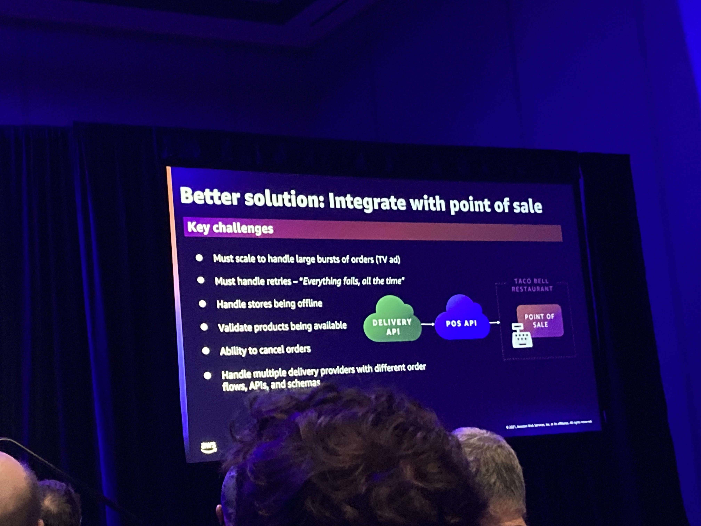
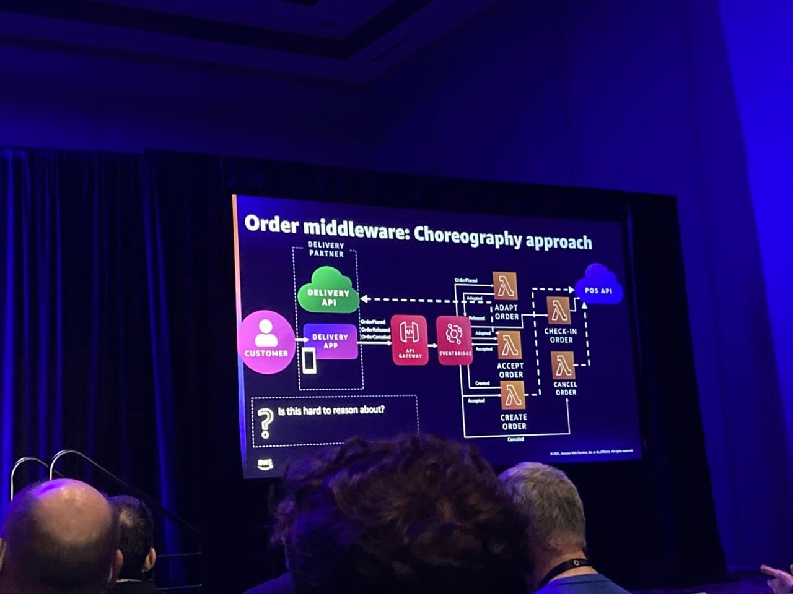
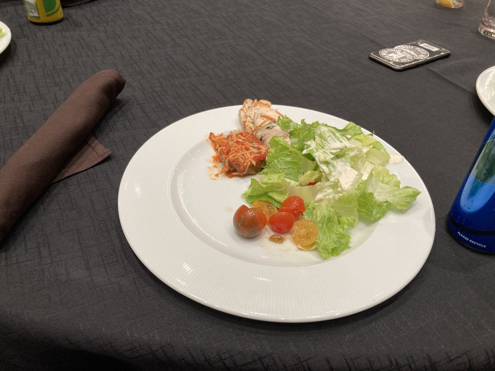
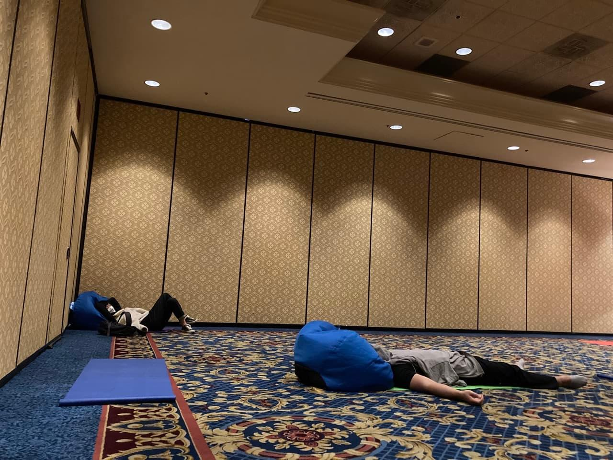
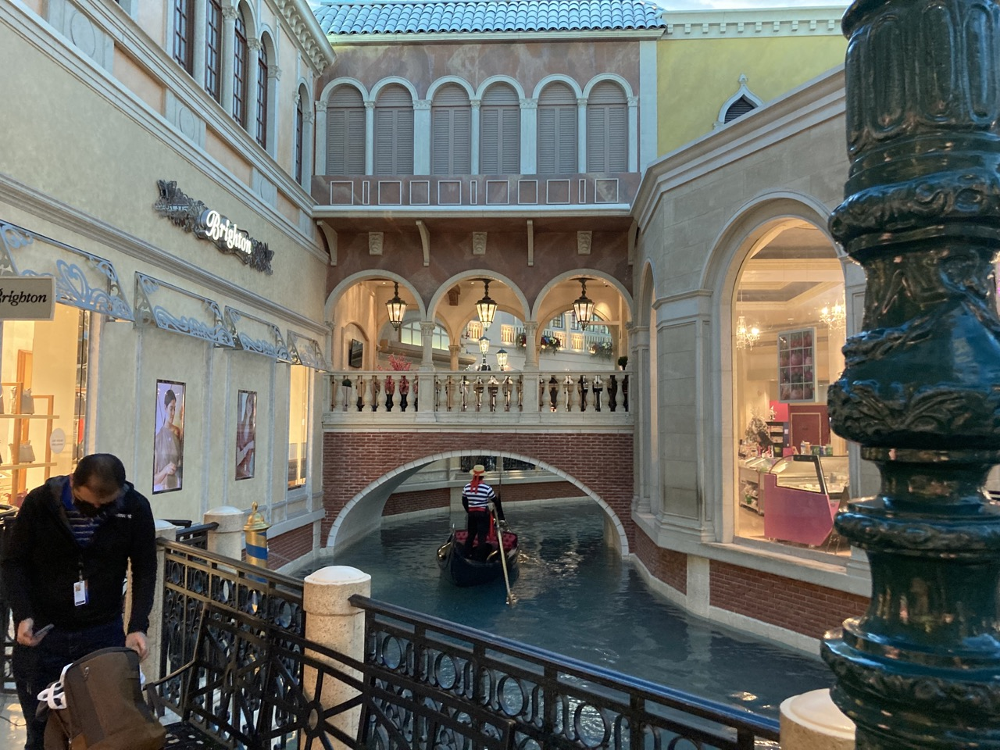
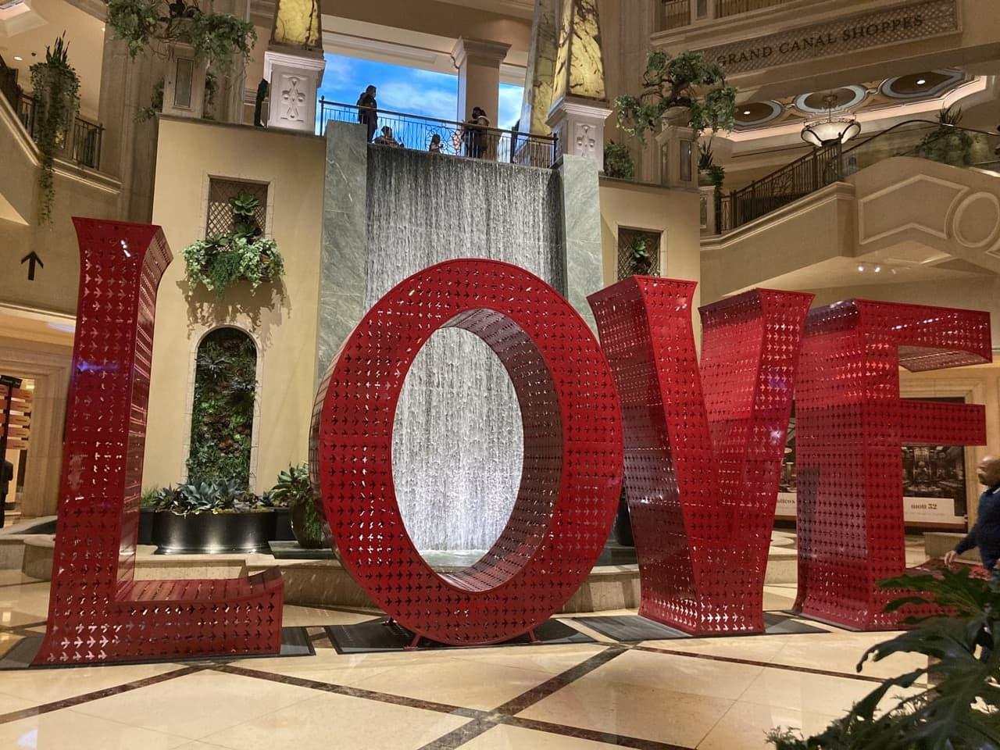

회사에서 좋은 기회가 생겨 [AWS re:invent](https://reinvent.awsevents.com/)(2021/11/29 ~ 2021/12/03)에 참석할 기회가 생겼다.  
영어도 잘 못하고, 평상시 [AWS](https://aws.amazon.com/)를 직접 쓰지 않은지 오래 되기도 했지만 견문을 넓히자는 차원에서 지원하여 갔다오게 되었다.  
살면서 미국에 처음 가보는 것이다보니 `미국에서만 할 수 있는 걸 해보자`라는 목표를 세우고 갔으나 많은 실패들이 있었고, 영어가 잘 안되다보니 aws reinvent 컨벤션 후기 보다는 라스베가스 여행기가 되어버린 것 같았다.
기술적인 부분에서 인사이트를 크게 얻지 못해 창피하여 aws reinvent 후기는 적지 못하고, 미국이라는 기회의 땅에 가본 경험을 휘발성 데이터로 냅두기 아까워 기억들이 더이상 날아가기 전에 이렇게라도 기록을 해둬야할 거 같아서 이 글을 쓰게 되었다.
쓰다보니 사진이 많아서인지 글이 좀 루즈해지는 감이 없잖아 있어 파트를 좀 쪼개보았다.

* [1편 - 인천공항에서 세미나 첫 날까지 (11/28 ~ 11/29)](/2021/12/31/las-vegas-aws-reinvent-01/)
* [2편 - 세미나 둘째 날 (11/30)](/2021/12/31/las-vegas-aws-reinvent-02/)
* 3편 - 세미나 셋째 날 (12/01) - 현재 게시물
* [4편 - 세미나 넷째 날 (12/02)](/2021/12/31/las-vegas-aws-reinvent-04/)
* [5편 - 세미나 마지막 날부터 인천공항까지(12/03 ~ 12/05)](/2021/12/31/las-vegas-aws-reinvent-05/)

## 미국의 원할머니 보쌈이 AWS에서 발표를 한다고?? (12/01)
요번 리인벤트에서는 특정 서비스에 딥다이브 하기 보다는 좀 더 추상적인 '아키텍처' 관점의 세션들을 많이 들어보았다.  
내가 AWS의 서비스에 대한 이해도가 낮기도 하다보니 내 소스코드에도 적용 가능한 추상적인, 이론적인 내용들은 무엇이 있을까?하다보니
이벤트 드리븐, 클라우드 네이티브, 모던, next generation 뭐 이런 키워드 있는 것들을 주로 들었던 것 같다.
하지만 영어가 되지 않아 대부분 이해가 되지 않던 와중 나를 충격에 빠뜨린 세션이 있었다.


Building next-gen applications with `event-driven` architectures라는 세션이었는데 이벤트 드리븐에 꽂혀서 신청했던 세션이다.  
나는 당연히 테크 기업이 나와서 발표를 하겠거니... 라고 생각했는데 [타코벨](https://www.tacobell.com)에서 나와서 발표를 하였다.
`잠깐만... 타코벨?? 타코... 그 멕시코 음식 파는 기업 아니야??`
라는 생각이 뇌리를 스쳐지나갔다.
우리나라로치면 원할머니 보쌈이 AWS 리인벤트에 나와서 이벤트 드리븐 아키텍쳐로 자기네들이 가진 문제를 풀었다고 하는 것이다.  
말이 되는가? 원할머니 보쌈은 음식이 메인이고 기껏해야 배민이나 쿠팡이츠, 요기요 같은 플랫폼 기업에 음식점 등록하고 수수료 떼는 게 끝 아닌가?  
우리나라에서 푸드 테크기업이라고 불리면서 직접적으로 음식을 만들어 파는 곳이 있는가? 라고 했을 때 떠오르는 곳이 없었다.  

그래... 타코벨에서 AWS를 어찌저찌 썼다고 치자... 그래서 그들은 무슨 문제를 풀었던 걸까??

미국의 슈퍼볼 같은 행사의 TV 광고를 한 번 때리면 주문량이 미친 듯이 폭주한다는 것이다.  
그래서 그들은 배달기사 / 음식점 / 고객 사이에서 발생하는 상호작용 사이에서 이벤트 드리븐을 적용했다는 것이다.  
그것도 서버리스로!! 그래서 미친듯이 폭발하는 트래픽을 견뎌낼 수 있었다고 한다...

이들은 배민 같은 중간 플랫폼 사업자들을 끼지 않고 직접 배달을 하고 있었고, 음식점 포스에도 기술을 도입했다.  
생각이나 해보자... 월드컵 경기 중간에 TV에서 네네치킨 광고를 한다고 네네치킨에서 이벤트 드리븐 아키텍쳐를 상상이나 할 수 있을까?  
그냥 배민 같은 곳이 안 터지길 빌어야하는 것이다.  

이걸 보고 또 느낀 점이 있었다...
역시 사업은 글로벌로 해야하는구나... 그래야 어떤 비즈니스도 돈이 될 정도의 트래픽들이 모인다는 사실이다.  
우리나라가 미국 정도의 인구규모만 되더라도 내수시장에서 먹고 살 수 있겠지만... 이미 한국은 저출산 시대와 그 사이에 피터지는 경쟁으로 인해 거대 플랫폼 기업들이 다 뜯어먹고 있는 시장같아 보였다.  
미국 정도 규모에서 일부만 먹더라도... 한국에서의 10%와 미국에서의 10%는 정말 하늘과 땅 차이이기 때문에 인구가 깡패라는 점도 느꼈다.  
우리나라가 미국 정도 인구 규모에 슈퍼볼 같이 배달이 폭주할 만한 행사들이 종종 있다면... 원할머니 보쌈에서도 이벤트 드리븐 아키텍쳐를 고민할 날이 오지 않을까??

이번 세션이 나한테 큰 충격을 준 만큼 정말 질문하고 싶은 내용이 많았다.
* 한국에서는 단순 음식점이 테크기업이 된 사례는 없는 것으로 알고 있는데 너네는 어떻게 이런 생각을 했냐? 우버이츠 이런 거 쓸법도 한데...
* 서버리스? 그거 쓰면 미리 서버 배포 안 해놔도 순간 미칠듯한 트래픽 버틸 수 있니? 대부분 오토스케일링이 되기 전에 피크 치고 서버 다 뻗어서 미리 2~3배 서버 증설해놓는데 서버리스는 그럴 필요가 없는 거니?
* 우리는 스프링을 써서 서버리스로 소스코드 관리하면 재사용성도 떨어지고, 어플리케이션 컨텍스트 띄우느라 콜드스타트도 굉장히 심할 거 같은데... 너네는 어떻게 이런 문제를 해결했니? 스프링에는 적합하지 않다고 생각하니?

세션을 들은지 한참이 지난 지금에 와서도 이렇게 질문들이 생각이 나는데... 이런 질문을 할 수 없는 나의 영어 실력이 참으로 비통했다.  
진짜... 영어를 할 줄 아는 사람이면 나 정도는 금방 제끼겠구나... 영어가 내 앞길을 막는 날이 언젠가 올 줄 알았는데 오늘이 그날이구나... 하고 느꼈다.
라고 말하면서 이전 포스트에서도 말했듯이 영어공부를 열심히 하지 않는 걸 보면... 어디 해커스 학원 같은데 돈이라도 쳐발라야 돈이 아까워서 공부를 할까 싶다.

## 점점 지쳐가는 일상들...
라스베가스에 온지 4일 째가 되었다.  
그러다보니 먹고자고 세션 듣는 것들이 일상이 되었다.  

그럼에도 불구하고 aws에서 제공하는 식단들은 너무나 물렸고, 이제는 맛도 없다고 느껴지고... 얼른 육개장 사발면 한사발 얼큰하게 때리고 싶은 마음 뿐이었다...

시차적응이 된 것도 같지만 아침부터 세션을 듣고 호텔들을 돌아다니다보면 지치는 건 마찬가지였다.  
세션을 들어도 이해가 잘 되지 않으니 자포자기같은 심정을 먹다보니 자연스레 체력을 좀 보충하자는 생각에 또 리플렉션 룸에서 휴식을 청했다.  
리플렉션 룸에서 쉬면서 노트북으로 Self-paced lab도 할 수 있어서 그나마 좀 내 템포대로 진행할 수 있어 편했다.

## 소소한 행복 찾기
세션을 듣기도 더이상 지치다보니 자연스레 '미국에서만 할 수 있는 걸 찾아보자'란 생각에 또 AWS 부스 이곳 저곳 기웃기웃 거렸다.
하지만 역시 언어의 장벽에 막히고 자신감이 많이 줄어들은 상태라 많은 곳을 둘러보지는 못했다.


그러다 뭔가 미국에서 밖에 할 수 없는 것이 눈에 들어왔다.
정확한 명칭은 뭔지는 모르겠지만 카우보이 뭐시기가 아닐까... 싶다.  
확실히 미국은 이런 카우보이 문화가 발달한 것인지 이런 놀이문화도 있는 것이 신기했다.  
내 앞에 여러 사람들이 10초 대 초반에 떨어지는 걸 보고 나는 더 오래 버티리라는 다짐을 하고 올라타게 되었다.  
근데 막상 찍힌 동영상을 보니 즐기기 보다는 '기록을 깨겠다'라는 경쟁심으로 불타있어 보였다.  
다른 외국인들은 한손으로 타고 소리도 지르고 즐기던데... 나는 즐기러 온 게 아닌가? 라는 생각이 들었다.
여기까지 와서도 어떻게든 이겨보겠다는 그런 생각에 스트레스를 날려보내려면 마음을 다르게 고쳐먹어야겠다는 생각도 들었다.

셋째 날도 그냥 지나가다가 또 안 찍은 것 같은 공간을 몇 개 찍어보았다.  
셋째 날은 그냥저냥 지쳐서 크게 한 건 없던 것 같다.

## 세미나 셋째 날까지의 소감 (12/02)
셋째 날에도 영어의 필요성을 절실히 체감하였지만 타코벨 세션이 정말 큰 충격을 주었다.  
일개 음식점이라고 생각했던 기업이 테크기업이 됐다고?? 이벤트 드리븐 아키텍쳐를 고민한다고??
우리나라에서 감히 상상이나 할 수 있겠는가? 원할머니 보쌈이나 네네치킨 같은 곳에서...??
왜 미국을 기회의 땅이라고 하는 건지... 왜 미국 같은 곳에 와서 경험을 해봐야하는 건지 뼈저리게 느낀 날이었다.
우리나라에서는 조그만 비즈니스도 스케일이 커질 수 있고, 낙후한 산업이라고 생각했던 부분들이 미국에서는 거기마저도 기술을 도입하고 클라우드 위에서 돌아간다는 것이 신기했다.
영어를 못해도 이정도 깨달음을 얻을 수 있는데... 영어를 할 수 있었더라면 그들에게서 얼만큼의 인사이트들을 얻어낼 수 있을까?  
감히 상상조차 되지 않았고, 영어 할 줄 아는 사람들이 진짜진짜 너무너무 부러웠다.

그리고 셋째 날 쯤... 되다보니 한국에 가고싶어졌다.
첫날에는 우와~ 라스베가스다~ 주변 풍경도 너무 삐까뻔쩍하고 멋있다~ 란 생각에 가득차있었다.  
하지만 하루 이틀 지나다보니 그런 게 일상이 되었고, 오늘도 내일도 먹고자고세션듣고 먹고자고세션듣고 반복일 걸 생각하니 지루했다. (거기다 영어까지 못하니...)
남들은 여행으로 힐링을 한다지만 나는 딱히 힐링이 된다는 느낌 보다는 그냥 침대에 누워서 유튜브 보는 게 더 행복했다. 
한편으로는 내 사비를 들여 친구들과 여행을 오면 좀 다른 느낌일까... 싶기도 했다.
나한테 이정도면 장기여행이고, 여행에 대한 나의 가치관을 다시 생각하게 된 계기가 된 것 같아 나중에 유럽여행에 대한 것도 고민을 좀 해봐야할 것 같다.  
살면서 유럽도 별로 가볼 일이 없어서 가보긴 할 거 같지만 과연 내 생각만큼 즐겁고 행복할지는 이번 여행을 통해 더더욱 불확실해졌다.
