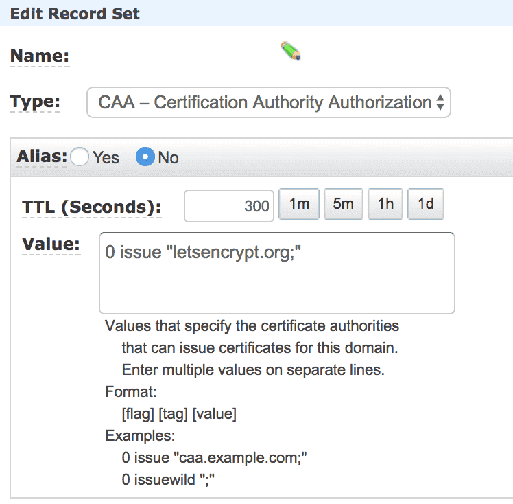

기본적으로 서버와 도메인(SSL 인증서에 넣을)은 확보가 돼있는 상태로 진행을 해야한다.  
자본이 빵빵하고(?) 좀 더 간단한 걸 원한다면 [AWS ELB로 HTTPS 서버 열기](/2017/10/05/https-with-elb/)를 보자.  
해당 포스트는 ELB 말고 인스턴스에 직접 도메인을 달고, 인스턴스에서 직접 HTTPS 서버를 서비스 하고자 하는 포스트이다.

## HTTPS
HTTP 통신은 데이터를 암호화하지 않아서 보안에 취약하다.  
따라서 HTTPS 프로토콜로 통신을 해야하는데 암/복호화를 하려면 키가 존재해야하고,
그 키는 인증된 기관에서 만든 게 아니면 신뢰할 수 없는 키가 된다.  
이 키에 대한 정보가 SSL 인증서에 들어가있는 것이고 이 SSL 인증서를 발급해주는 기관들이 따로 있다.  
(사실 SSL의 이름은 TLS로 바뀌었지만 계속해서 SSL로 쓰이는 듯...)  
그런데 그 인증서를 발급해주는 기관에서는 돈을 받고 SSL 인증서를 발급해주고 일정 기간마다 돈을 추가로 내서 갱신해야한다.  

## 공짜 SSL 인증서 발급기관
[Let's Encrypt](https://letsencrypt.org/)라는 사이트에서 공짜로 SSL 인증서를 발급해준다.  
과거에는 어떻게 했는지 모르겠지만 지금은 [Certbot](https://certbot.eff.org/)이라는 프로그램을 통해서
Let's Encrypt의 SSL 인증서를 발급받을 수 있다.  
또한 Let's Encrypt는 90일 동안만 유효한 SSL 인증서를 발급해주는데 Certbot을 이용하면 갱신이 매우 쉬워진다.  

## Route 53(도메인) 설정하기
기본적으로 도메인을 확보한 이후에 또 해야하는 게 있다.  
바로 해당 도메인에 대한 CAA(Certificate Authority Authorization) Record를 추가해야한다.  
[SSLMate’s CAA Record Generator](https://sslmate.com/caa/)에 들어가면 만들 수 있다지만 들어가봐도 네트워크 지식이 없다보니 그냥 아래 스샷과 같이 만들었다.  
  
name에는 당연히 발급을 위한 도메인이 들어가야한다.

## Certbot
[Certbot](https://certbot.eff.org/) 사이트에 들어가면 어떻게 설치하는지 나오지만 나도 헷갈려서 직접 정리해보았다.  
**이 포스트에서는 OS는 Amazon Linux AMI와 웹서버는 nginx를 사용하였다.**

혹시 커맨드를 입력했을 때 권한이 없다고 하면 귀찮으니까 root 유저로 진행하자.  
```bash
sudo su
```

SSL 인증서를 발급받기 전에 nginx와 같은 웹서버는 무조건 중단해야한다.
```bash
service nginx stop
```

이제 아래 커맨드를 입력해서 certbot 설치를 하자.
```bash
curl -O https://dl.eff.org/certbot-auto
chmod +x certbot-auto
mv certbot-auto /usr/bin/certbot-auto
```

그리고 실제 SSL 인증서를 발급받아보도록 하자.  
현재 AWS Linux는 아직 정식 지원이 아닌지 --debug를 붙여줘야한다.
```bash
certbot-auto certonly --standalone -d 발급받을도메인

# 위 과정에서 이메일을 물어볼 수도 있다.
# 아래와 같은 메시지가 나온다면 발급에 성공한 것이다.
# IMPORTANT NOTES:
#  - Congratulations! Your certificate and chain have been saved at
#    /etc/letsencrypt/live/example.com/fullchain.pem. Your cert will
#    expire on 2018-mm-dd. To obtain a new version of the certificate in
#    the future, simply run Certbot again.
#  - If you like Certbot, please consider supporting our work by:
# 
#    Donating to ISRG / Let's Encrypt:   https://letsencrypt.org/donate
#    Donating to EFF:                    https://eff.org/donate-le
```

```
There were too many requests of a given type :: Error creating new authz :: Too many invalid authorizations recently.
Please see the logfiles in /var/log/letsencrypt for more details.
```
위와 같은 오류를 만났다면 단시간 내에 SSL 발급 요청을 너무 많이 했는데 모두  
유효하지 않은 요청이라 악의적이라 판단해서 해당 도메인에 대해 발급 요청이 일시 중단된 상태이다.  
1시간 가량 기다린 후에 진행하면 다시 되는 것 같다.  

```
-- The following errors were reported by the server:
Domain: <my_domain>
Type: connection
Detail: CAA record for <my_domain> prevents issuance
```
위와 같은 오류는 도메인에 CAA record가 제대로 등록되지 않았다는 것이다.  
도메인명과 CAA 레코드에 제대로 된 값들이 들어갔는지 다시 확인해보자.  

## 적용하기
nginx 서버에서 다음와 같이 설정을 해주어야한다.  
기본적인 설정 파일은 /etc/nginx/conf.d/virtual.conf에 있다.  
```bash
server {
    listen       80;
    server_name  ~.;
    return 301 https://$host$request_uri;
}
```

80번 포트로 들어오면 다시 https로 리다이렉트 시키는 부분이다.  
301 redirect는 영구적으로 옮겼을 때 사용한다.  

그리고 아래 부분에는 HTTPS 서버를 리스닝 하는 부분을 추가해주자.  
```bash
server {
    server_name  ~.;
    listen 443;
    
    ssl                  on;
    ssl_certificate      /etc/letsencrypt/live/도메인/fullchain.pem;
    ssl_certificate_key  /etc/letsencrypt/live/도메인/privkey.pem;
    ssl_session_cache shared:SSL:1m;
    ssl_session_timeout  10m;
    ssl_protocols TLSv1 TLSv1.1 TLSv1.2;
    ssl_ciphers HIGH:SEED:!aNULL:!eNULL:!EXPORT:!DES:!RC4:!MD5:!PSK:!RSAPSK:!aDH:!aECDH:!EDH-DSS-DES-CBC3-SHA:!KRB5-DES-CBC3-SHA:!SRP;
    ssl_prefer_server_ciphers   on;

    # 특정 포트로 다시 보내고 싶을 때
    # location / {
    #     proxy_set_header X-Real-IP $remote_addr;
    #     proxy_set_header HOST $http_host;
    #     proxy_set_header X-NginX-Proxy true;
    #     proxy_set_header X-Forwarded-For $proxy_add_x_forwarded_for;
 
    #     proxy_pass http://127.0.0.1:8080;
    #     proxy_redirect off;
    # }
}
```
도메인 부분에 SSL 인증서를 발급받은 도메인을 입력하면 된다.  
그리고 실제 톰캣과 같은 WAS나 서버가 띄워져있는 포트로 보내려면 주석을 지우고 포트를 바꿔주면 된다.  
그리고 아래와 같이 nginx 서버를 재구동 하고 브라우저에서 도메인을 입력하고 http to https와 ssl 인증서가 제대로 적용됐는지 확인해보자.  
```bash
service nginx start
# 혹시 재시작이 안 됐다면 아래 커맨드를 입력하자.
/etc/init.d/nginx restart
```

## 자동 갱신하기
Certbot으로 발급 받았다 하더라도 Let's Encrypt의 SSL 인증서를 발급받은 것이기 때문에 유효기간은 90일이다.  
따라서 수동으로 갱신할 때 명령어는 다음과 같다.  
```bash
certbot-auto renew
```

하지만 갱신일이 30일 이상 남은 경우에는 아래와 같은 오류를 보게될 것이다.  
```
Cert not yet due for renewal
```

따라서 테스트를 위해서는 --dry-run 옵션을 추가해야한다.  
```bash
certbot-auto renew --dry-run
```

하지만 이번에는 아래와 같은 오류가 나게 된다.  
```
produced an unexpected error: Problem binding to port 443: Could not bind to IPv4 or IPv6.. Skipping.
All renewal attempts failed. The following certs could not be renewed
```
갱신하려는 인증서를 이미 nginx 서버에서 사용중이기 때문에 갱신이 불가능하다는 내용이다.  
따라서 nginx를 스탑하고 갱신하고 다시 start 해야하는데 귀찮으므로 hook 옵션을 제공해서 아래와 같이 사용하면 된다.

```bash
certbot-auto renew --pre-hook "service nginx stop" --post-hook "service nginx start" --dry-run
```
드디어 아래와 같은 성공 메시지를 보게 될 것이다.  
```
Congratulations, all renewals succeeded. The following certs have been renewed:
```

하지만 아직 테스트 단계이므로 실제로 갱신이 이루어지지는 않는다.  
갱신일이 궁금하다면 아래 커맨드를 입력하면 된다.  
```bash
echo | openssl s_client -connect localhost:443 2>/dev/null | openssl x509 -noout -dates
```

30일 남았는지 일일이 체크해서 갱신하기란 매우 귀찮다.  
따라서 매달 1일에 갱신하는 커맨드를 실행하게 끔 crontab을 사용하자.  
```bash
# 잡을 등록
crontab -e

# 그리고 아래 잡을 추가하고 저장하자.
0 0 1 * * certbot-auto renew --pre-hook "service nginx stop" --post-hook "service nginx start"

# 등록된 잡 목록 보기
crontab -l
```

crontab 규칙은 [crontab.guru](https://crontab.guru/)에서 확인할 수 있고, 직접 만들거나 결과를 예측해볼 수도 있다.  

## 마무리
끝이다.  
아직 나도 갱신일이 30일 넘게 남아서(사실 오늘 만들어봤지만...) 테스트를 해보지 않았다.  
나중에 시간이 지나면 잘 되는지 보고 다시 수정해봐야겠다.  
이 과정이 좀 어렵고 자본이 빵빵하다면(?) [AWS ELB로 HTTPS 서버 열기](/2017/10/05/https-with-elb/)를 보자.