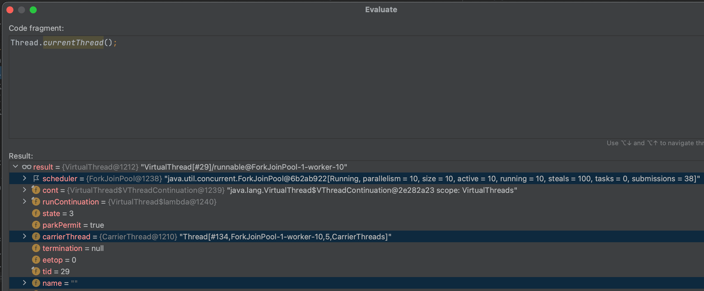
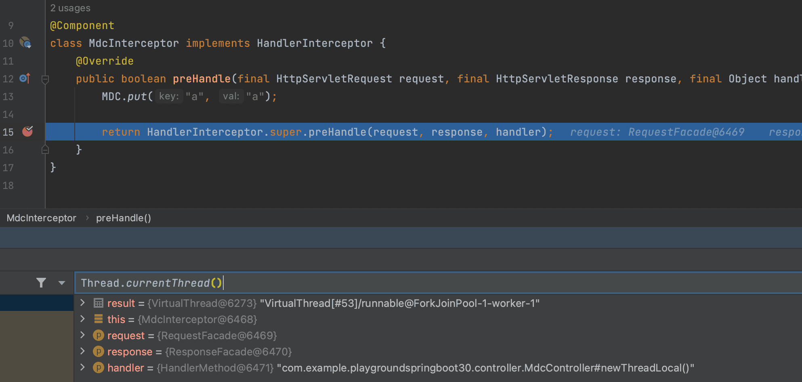
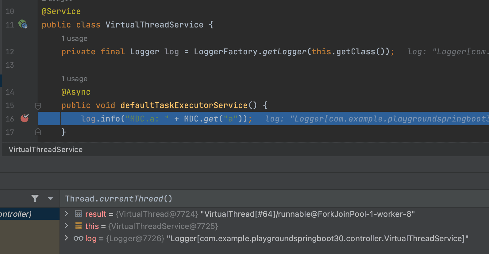

Java의 [Virtual Threads](https://openjdk.org/jeps/425)는 JDK 19에 [Preview Features](https://openjdk.org/jeps/12)로 추가되었다.    
[프로젝트 룸(Loom)](https://wiki.openjdk.org/display/loom/Main)에서 개발한 기능으로 알고있는데 사실 큰 관심도 없던(뭐하는 지도 모르던) 프로젝트였고, JDK 19가 LTS도 아니기 때문에 회사에서 바로 써볼 수도 없기에 JDK 19는 큰 관심도 가지고 있지 않았다.  
하지만 최근 스프링 블로그에서 [Embracing Virtual Threads](https://spring.io/blog/2022/10/11/embracing-virtual-threads) 라는 포스트가 올라온 걸 보고 살짝 관심 가지게 되었다.

[Spring Web MVC](https://docs.spring.io/spring-framework/docs/current/reference/html/web.html#mvc)와 같이 전형적인 1 Request per 1 Thread 모델의 한계(쓰레드 자체가 많은 메모리를 소비하고, 컨텍스트 스위칭에 따른 불필요한 시간 소요 등등)를 극복하기 위해  
[Spring Webflux](https://docs.spring.io/spring-framework/docs/current/reference/html/web-reactive.html#spring-webflux)(가 의존하는 [Netty](https://netty.io/))에서는 코어 갯수 * 2개만의 쓰레드를 만듦으로 인해 그 한계를 극복하였지만 하나의 요청을 하나의 쓰레드가 온전히 처리하는 것이 아니기 때문에 스택트레이스를 봐도 파편화된 정보가 남아 트러블 슈팅에 문제가 있었고, 
[Mono](https://projectreactor.io/docs/core/release/api/reactor/core/publisher/Mono.html)나 [Flux](https://projectreactor.io/docs/core/release/api/reactor/core/publisher/Flux.html)와 같은 Publisher 타입으로 값을 감싸야 하기 때문에 코드가 매우 보기 힘들고, 어디서 쓰레드를 블락하는 코드를 호출하는 건 아닌지 항상 불안에 떨었어야했다.  

그러다보니 Webflux가 더 고성능을 보장하더라도 유지보수하기가 힘들고 러닝커브 또한 존재하기 때문에 어지간한 경우가 아니면 Web MVC로 프로젝트를 만들었다.  
사실 프로덕션에서 RDBMS를 안 쓰는 곳이 거의 없는데 [R2DBC](https://r2dbc.io/)를 사용하기에는 너무 불안정해 보이기도 했고, 그리고 TPS가 안 나오면 대부분 스케일 아웃하는 형태로 해결을 많이 했다.  
서버보다는 사람이 가장 비싼 자원이라고 생각되기에 유지보수 측면으로만 생각하다보니 Webflux는 거의 사용한 적이 없는 것 같다.  
결정적으로 Web MVC(Spring Boot를 사용한다면 톰캣의 최대 쓰레드인 200개)만으로도 부족함이 없는 서비스도 많았고, 단일 서버가 아닌 이중화 등등으로 인해 서버가 다중으로 뜨기에 Webflux를 써야할 만큼의 처리를 단일서버에서 하지 않는 경우가 대다수였다.  

그럼에도 불구하고 Virtual Threads는 어떠한 문제를 해결해주는 것인지, Spring과 함께 사용하면 어떤 시너지를 낼 수 있을지 궁금해서 살짝만 훑어보았다.

## Platform Threads

우리가 일반적으로 자바에서 쓰레드라고 부르는 것은 OS에서 생성한 쓰레드를 래핑해서 JVM에서 사용하기 쉽게 만든 Platform Threads라는 것을 말한다.  
OS에 의해 스케쥴링 되기 때문에 쓰레드 간 전환을 위해 컨텍스트 스위칭이 발생하기도 하고, Platform Thread 하나를 생성하는 것은 OS에도 쓰레드를 하나 생성하는 것이기 때문에 일반적인 객체 생성과는 비교 불가능할 정도로 느리기 때문에 기본적으로 쓰레드 풀이라는 것을 만들고 거기에 미리 쓰레드들을 생성해두게 된다.  
그러다보면 쓰레드 풀을 또 관리해야하는데 많은 양의 쓰레드를 만들다보면 또 메모리를 너무 많이 사용해서 문제가 발생하기도 한다.

## Virtual Threads

그에 반해 Virtual Threads는 OS의 Thread와 1:1로 대응되지 않는다.  
OS와 1:1로 대응되던 Platform Threads는 Carrier Threads라고 부른다.  
이 Carrier Threads는 여전히 OS에 의해 스케쥴링 된다.

> initially, carrier threads for virtual threads are threads in a ForkJoinPool that operates in FIFO mode. The size of this pool defaults to the number of available processors.
> https://www.infoq.com/articles/java-virtual-threads

Virtual Threads를 JVM에서 스케쥴링 하기 위해 [ForkJoinPool](https://docs.oracle.com/en/java/javase/19/docs/api/java.base/java/util/concurrent/ForkJoinPool.html)을 사용하는데 기본적으로 CPU 코어 갯수(정확히는 available processor)만큼의 Carrier Threads를 생성한다. (아마 컨텍스트 스위칭 비용 때문이 아닐까 싶다.)  

> We dont have to guess how much stack space a thread might need, or make a one-size-fits-all estimate for all threads; 
> the memory footprint for a virtual thread starts out at only a few hundred bytes, and is expanded and shrunk automatically as the call stack expands and shrinks.
> https://www.infoq.com/articles/java-virtual-threads

그리고 Virtual Threads는 OS의 쓰레드와 대응되는 개념도 아니고, JVM에서 직접 쓰레드를 생성하기 때문에 생성 비용(용량/시간 등등의 측면에서)이 비싸지도 않고, 크기가 자동으로 조절되기 때문에 쓰레드 풀처럼 갯수를 관리할 필요도 없다.

> The difference with virtual threads is that, due to them being under the control of the JVM, the thread stack is stored in the heap memory and not in the stack. 
> This means that allocating the thread stack for an awakened virtual thread becomes much cheaper. 
> https://theboreddev.com/understanding-java-virtual-threads/ 

JVM에서 쓰레드를 스케쥴링 해야하기 때문에 stack이 아닌 Heap 메모리 영역에 쓰레드의 스택이 저장되고 관리되기 때문에 우리가 알고있는 컨텍스트 스위칭에 대한 비용이 OS 레벨이 아닌 JVM 레벨에서 끝나기 때문에 훨씬 값싼 것이다.

### Virtual Threads 스케쥴링
> The operating system schedules OS threads, and thus platform threads, but virtual threads are scheduled by the JDK. 
> The JDK does so indirectly by assigning virtual threads to platform threads in a process called mounting. 
> The JDK unassigns the platform threads later; this is called unmounting.
> ...
> To implement this process, the JDK uses a dedicated ForkJoinPool in first-in-first-out (FIFO) mode as a virtual thread scheduler. 
> (Note: This is distinct from the common pool used by parallel streams.)
> ...
> The JDK could mount a virtual thread by copying all its frames from heap to stack. 
> When the virtual thread is unmounted, most frames are left on the heap and copied lazily as needed.
> https://blogs.oracle.com/javamagazine/post/java-loom-virtual-threads-platform-threads

Carrier Threads(Platform Threads)와 달리 Virtual Threads는 JDK에 의해 스케쥴링 되는데 ForkJoinPool을 이용하여 구현하였다. (parallel streams에서 사용하는 common pool과는 별개의 ForkJoinPool이라고 함.)  
Virtual Threads 내에서는 CPU를 사용하지 않는 블로킹 메서드(네트워크 I/O, 파일 I/O 등등)를 만나게 되면 **stack frames를 Heap 메모리에 저장(복사)** 해놓는데 이 과정을 **unmounting**이라고 부른다.  
그리고 블로킹 메서드가 종료되면 **Heap 메모리에 저장된 stack frames를 다시 Virtual Threads로 불러오는데** 이 과정을 **mounting**이라고 부른다.

이렇게 JVM 내에서 Virtual Threads 간 컨텍스트 스위칭이 이루어지기 때문에 Platform Threads를 사용할 때 비해서 컨텍스트 스위칭 비용이 매우 싸고, 스택트레이스를 찍었을 때 유실없이 모든 정보를 남길 수 있는 것이다.

코드를 통해 어떻게 Virtual Threads가 스케쥴링 되는지 좀 더 자세히 보자.
```java
public class VirtualThreadExample {
    private static final Logger log = Logger.getAnonymousLogger();

    public static void main(String[] args) throws InterruptedException {
        // Dec 29, 2022 2:39:08 AM org.example.VirtualThreadExample main
        // INFO:
        // threadName: main
        // availableProcessors: 10
        log.info("\nthreadName: " + Thread.currentThread().getName() + "\navailableProcessors: " + Runtime.getRuntime().availableProcessors());

        final long start = System.currentTimeMillis();
        final AtomicLong index = new AtomicLong();
        final int count = 100;
        final CountDownLatch countDownLatch = new CountDownLatch(count);

        final Runnable runnable = () -> {
            try {
                final long indexValue = index.incrementAndGet();
                Thread.sleep(1000L);
                
                // INFO: 
                // threadName:
                // value: xx
                // Dec 29, 2022 2:39:09 AM org.example.VirtualThreadExample lambda$main$0
                log.info("\nthreadName: " + Thread.currentThread().getName() + "\nvalue: " + indexValue);
                
                countDownLatch.countDown();
            } catch (final InterruptedException e) {
                countDownLatch.countDown();
            }
        };

        // 일반적으로 쓰레드 풀의 갯수를 지정하는 것과는 달리 쓰레드의 갯수를 지정할 필요가 없다.
        try (final ExecutorService executorService = Executors.newVirtualThreadPerTaskExecutor()) {
            for (int i = 0; i < count; i++) {
                executorService.submit(runnable);
            }
        }

        countDownLatch.await();
        final long finish = System.currentTimeMillis();
        final long timeElapsed = finish - start;
        
        // Dec 29, 2022 2:39:09 AM org.example.VirtualThreadExample main
        // INFO:
        // threadName: main
        // Run time: 1022
        log.info("\nthreadName: " + Thread.currentThread().getName() + "\nRun time: " + timeElapsed);
    }
}
```

  
Virtual Thread로 실행하는 블럭 내에 브레이크 포인트를 걸고 디버그 모드로 실행해서 확인해보면 Carrier Thread가 뭔지 볼 수 있다.

  
Virtual Threads는 Platform Threads와 달리 더 많은 상태들을 가지고 있다.
```java
 /*
 * Virtual thread state and transitions:
 *
 *      NEW -> STARTED         // Thread.start
 *  STARTED -> TERMINATED      // failed to start
 *  STARTED -> RUNNING         // first run
 *
 *  RUNNING -> PARKING         // Thread attempts to park
 *  PARKING -> PARKED          // cont.yield successful, thread is parked
 *  PARKING -> PINNED          // cont.yield failed, thread is pinned
 *
 *   PARKED -> RUNNABLE        // unpark or interrupted
 *   PINNED -> RUNNABLE        // unpark or interrupted
 *
 * RUNNABLE -> RUNNING         // continue execution
 *
 *  RUNNING -> YIELDING        // Thread.yield
 * YIELDING -> RUNNABLE        // yield successful
 * YIELDING -> RUNNING         // yield failed
 *
 *  RUNNING -> TERMINATED      // done
 */
private static final int NEW      = 0;
private static final int STARTED  = 1;
private static final int RUNNABLE = 2;     // runnable-unmounted
private static final int RUNNING  = 3;     // runnable-mounted
private static final int PARKING  = 4;
private static final int PARKED   = 5;     // unmounted
private static final int PINNED   = 6;     // mounted
private static final int YIELDING = 7;     // Thread.yield
private static final int TERMINATED = 99;  // final state

// can be suspended from scheduling when unmounted
private static final int SUSPENDED = 1 << 8;
private static final int RUNNABLE_SUSPENDED = (RUNNABLE | SUSPENDED);
private static final int PARKED_SUSPENDED   = (PARKED | SUSPENDED);
```

  
무조건 cpu 코어 갯수만큼 생기는 건 아니고, Virtual Threads 갯수가 적다면 더 적은 Carrier Threads(ForkJoinPool Worker 쓰레드)가 생성된다.

그리고 실행 결과를 보면 100번의 Thread.sleep(1초)가 발생했고, 실제로 OS Thread와 매칭되는 Carrier Thread는 10개 밖에 사용하지 않았는데 1초 만에 모든 연산이 종료된 걸 볼 수 있다.  
동일하게 10개의 Platform Threads를 사용하면 10초가 걸린다. (`Executors.newFixedThreadPool(10)`)

### 기존 코드와의 호환성
Virtual Thread를 사용하면 100%는 아니지만 기존 코드의 변경없이 Virtual Thread를 사용할 수 있다고 한다.  
어떻게 그게 가능한지 살펴보자.

#### Thread 클래스의 호환성
[VirtualThread](https://github.com/openjdk/loom/blob/fibers/src/java.base/share/classes/java/lang/VirtualThread.java)의 부모 타입인 [BaseVirtualThread](https://github.com/openjdk/loom/blob/fibers/src/java.base/share/classes/java/lang/BaseVirtualThread.java)가 [Thread 클래스](https://docs.oracle.com/en/java/javase/19/docs/api/java.base/java/lang/Thread.html)를 상속받았기 때문에 기존 Thread 구현의 변경 없이 Virtual Threads를 사용할 수 있다.

실제로 Thread.sleep(long millis) 메서드를 보면 아래와 같이 구현돼있다.
```java
public static void sleep(long millis) throws InterruptedException {
    if (millis < 0) {
        throw new IllegalArgumentException("timeout value is negative");
    }

    if (currentThread() instanceof VirtualThread vthread) {
        long nanos = MILLISECONDS.toNanos(millis);
        vthread.sleepNanos(nanos);
        return;
    }

    if (ThreadSleepEvent.isTurnedOn()) {
        ThreadSleepEvent event = new ThreadSleepEvent();
        try {
            event.time = MILLISECONDS.toNanos(millis);
            event.begin();
            sleep0(millis);
        } finally {
            event.commit();
        }
    } else {
        sleep0(millis);
    }
}
```
내부에서 VirtualThread인지 아닌지 판단하고 있다.  
그리고 VirtualThread라면 [sleepNanos(long nanos) 메서드](https://github.com/openjdk/loom/blob/fibers/src/java.base/share/classes/java/lang/VirtualThread.java#L728-L785)를 호출하고 있다.

```java
final class VirtualThread extends BaseVirtualThread {
    // ...
    
    /**
     * Sleep the current virtual thread for the given sleep time.
     *
     * @param nanos the maximum number of nanoseconds to sleep
     * @throws InterruptedException if interrupted while sleeping
     */
    void sleepNanos(long nanos) throws InterruptedException {
        assert Thread.currentThread() == this;
        if (nanos >= 0) {
            if (ThreadSleepEvent.isTurnedOn()) {
                ThreadSleepEvent event = new ThreadSleepEvent();
                try {
                    event.time = nanos;
                    event.begin();
                    doSleepNanos(nanos);
                } finally {
                    event.commit();
                }
            } else {
                doSleepNanos(nanos);
            }
        }
    }

    /**
     * Sleep the current thread for the given sleep time (in nanoseconds). If
     * nanos is 0 then the thread will attempt to yield.
     *
     * @implNote This implementation parks the thread for the given sleeping time
     * and will therefore be observed in PARKED state during the sleep. Parking
     * will consume the parking permit so this method makes available the parking
     * permit after the sleep. This may be observed as a spurious, but benign,
     * wakeup when the thread subsequently attempts to park.
     */
    private void doSleepNanos(long nanos) throws InterruptedException {
        assert nanos >= 0;
        if (getAndClearInterrupt())
            throw new InterruptedException();
        if (nanos == 0) {
            tryYield();
        } else {
            // park for the sleep time
            try {
                long remainingNanos = nanos;
                long startNanos = System.nanoTime();
                while (remainingNanos > 0) {
                    parkNanos(remainingNanos);
                    if (getAndClearInterrupt()) {
                        throw new InterruptedException();
                    }
                    remainingNanos = nanos - (System.nanoTime() - startNanos);
                }
            } finally {
                // may have been unparked while sleeping
                setParkPermit(true);
            }
        }
    }

    /**
     * Parks up to the given waiting time or until unparked or interrupted.
     * If already unparked then the parking permit is consumed and this method
     * completes immediately (meaning it doesn't yield). It also completes immediately
     * if the interrupt status is set or the waiting time is {@code <= 0}.
     *
     * @param nanos the maximum number of nanoseconds to wait.
     */
    @Override
    void parkNanos(long nanos) {
        assert Thread.currentThread() == this;

        // complete immediately if parking permit available or interrupted
        if (getAndSetParkPermit(false) || interrupted)
            return;

        // park the thread for the waiting time
        if (nanos > 0) {
            long startTime = System.nanoTime();

            boolean yielded;
            Future<?> unparker = scheduleUnpark(this::unpark, nanos);
            setState(PARKING);
            try {
                yielded = yieldContinuation();
            } finally {
                assert (Thread.currentThread() == this)
                    && (state() == RUNNING || state() == PARKING);
                cancel(unparker);
            }

            // park on carrier thread for remaining time when pinned
            if (!yielded) {
                long deadline = startTime + nanos;
                if (deadline < 0L)
                    deadline = Long.MAX_VALUE;
                parkOnCarrierThread(true, deadline - System.nanoTime());
            }
        }
    }

    /**
     * Unmounts this virtual thread, invokes Continuation.yield, and re-mounts the
     * thread when continued. When enabled, JVMTI must be notified from this method.
     * @return true if the yield was successful
     */
    @ChangesCurrentThread
    private boolean yieldContinuation() {
        // unmount
        if (notifyJvmtiEvents) notifyJvmtiUnmountBegin(false);
        unmount();
        try {
            return Continuation.yield(VTHREAD_SCOPE);
        } finally {
            // re-mount
            mount();
            if (notifyJvmtiEvents) notifyJvmtiMountEnd(false);
        }
    }
    
    // ...
}
```
sleepNanos -> doSleepNanos -> parkNanos -> yieldContinuation 메서드를 순차적으로 호출하게 되는데
yieldContinuation 메서드 안에서 unmount 메서드를 호출해서 virtual thread를 block 시키고, 지정한 시간이 지나면 다시 mount 메서드를 호출해서 block 된 virtual thread를 깨워서 해당 지점부터 다시 task를 진행하도록 한다.

```java
/**
 * Unmounts this virtual thread from the carrier. On return, the
 * current thread is the current platform thread.
 */
@ChangesCurrentThread
private void unmount() {
    // set Thread.currentThread() to return the platform thread
    Thread carrier = this.carrierThread;
    carrier.setCurrentThread(carrier);

    // break connection to carrier thread, synchronized with interrupt
    synchronized (interruptLock) {
        setCarrierThread(null);
    }
    carrier.clearInterrupt();
}

/**
 * Mounts this virtual thread onto the current platform thread. On
 * return, the current thread is the virtual thread.
 */
@ChangesCurrentThread
private void mount() {
    // sets the carrier thread
    Thread carrier = Thread.currentCarrierThread();
    setCarrierThread(carrier);

    // sync up carrier thread interrupt status if needed
    if (interrupted) {
        carrier.setInterrupt();
    } else if (carrier.isInterrupted()) {
        synchronized (interruptLock) {
            // need to recheck interrupt status
            if (!interrupted) {
                carrier.clearInterrupt();
            }
        }
    }

    // set Thread.currentThread() to return this virtual thread
    carrier.setCurrentThread(this);
}
```

unmount 메서드에서는 Virtual Thread의 Carrier Thread(ForkJoinPool Worker 쓰레드)의 currentThread(VirtualThread)를 Carrier Thread 그 자체로 할당해버림으로써 VirtualThread는 할당된 Carrier Thread가 없기 때문에 남은 연산을 수행하지 못하게 만들어버리고(blocking),
mount 메서드에서는 Virtual Thread의 Carrier Thread(ForkJoinPool Worker 쓰레드)의 currentThread(ForkJoinPool Worker 쓰레드)를 다시 자기 자신인 Virtual Thread 그 자체로 할당해버림으로써 VirtualThread의 남은 연산을 다시 Carrier Thread에서 수행하게 끔 만든다.

이렇게 되면 실제로 OS Thread와 매칭되는 Carrier Thread 그 자체가 블로킹 된 건 아니기 때문에 OS 레벨에서는 컨텍스트 스위칭이 발생하지 않고, JVM 레벨에서만 Carrier Thread에 다른 Virtual Thread를 할당하는 컨텍스트 스위칭만 발생하게 된다.

#### Socket API와의 호환성
기존 코드와의 호환성을 위해 [JEP 353 (Reimplement the legacy Socket API)](https://openjdk.org/jeps/353), [JEP 373 (Reimplement the legacy DatagramSocket API)](https://openjdk.org/jeps/373)에서 Socket API들을 재구현함으로써 코드의 변경없이 Virtual Thread를 사용할 수 있도록 하였다.  

JDK 11로 실행시킨 Apache HTTP Client 4.5의 stacktrace 
```java
at java.base/java.net.SocketInputStream.socketRead0(Native Method)
at java.base/java.net.SocketInputStream.socketRead(SocketInputStream.java:115)
at java.base/java.net.SocketInputStream.read(SocketInputStream.java:168)
at java.base/java.net.SocketInputStream.read(SocketInputStream.java:140)
at org.apache.http.impl.io.SessionInputBufferImpl.streamRead(SessionInputBufferImpl.java:137)
at org.apache.http.impl.io.SessionInputBufferImpl.fillBuffer(SessionInputBufferImpl.java:153)
at org.apache.http.impl.io.SessionInputBufferImpl.readLine(SessionInputBufferImpl.java:280)
at org.apache.http.impl.conn.DefaultHttpResponseParser.parseHead(DefaultHttpResponseParser.java:138)
at org.apache.http.impl.conn.DefaultHttpResponseParser.parseHead(DefaultHttpResponseParser.java:56)
at org.apache.http.impl.io.AbstractMessageParser.parse(AbstractMessageParser.java:259)
at org.apache.http.impl.DefaultBHttpClientConnection.receiveResponseHeader(DefaultBHttpClientConnection.java:163)
at org.apache.http.impl.conn.CPoolProxy.receiveResponseHeader(CPoolProxy.java:157)
at org.apache.http.protocol.HttpRequestExecutor.doReceiveResponse(HttpRequestExecutor.java:273)
at org.apache.http.protocol.HttpRequestExecutor.execute(HttpRequestExecutor.java:125)
at org.apache.http.impl.execchain.MainClientExec.execute(MainClientExec.java:272)
at org.apache.http.impl.execchain.ProtocolExec.execute(ProtocolExec.java:186)
at org.apache.http.impl.execchain.RetryExec.execute(RetryExec.java:89)
at org.apache.http.impl.execchain.RedirectExec.execute(RedirectExec.java:110)
at org.apache.http.impl.client.InternalHttpClient.doExecute(InternalHttpClient.java:185)
at org.apache.http.impl.client.CloseableHttpClient.execute(CloseableHttpClient.java:83)
at org.apache.http.impl.client.CloseableHttpClient.execute(CloseableHttpClient.java:108)
```

JDK 19로 실행시킨 Apache HTTP Client 4.5의 stacktrace
```java
at java.base/sun.nio.ch.NioSocketImpl.implRead(NioSocketImpl.java:313)
at java.base/sun.nio.ch.NioSocketImpl.read(NioSocketImpl.java:340)
at java.base/sun.nio.ch.NioSocketImpl$1.read(NioSocketImpl.java:789)
at java.base/java.net.Socket$SocketInputStream.read(Socket.java:1025)
at org.apache.http.impl.io.SessionInputBufferImpl.streamRead(SessionInputBufferImpl.java:137)
at org.apache.http.impl.io.SessionInputBufferImpl.fillBuffer(SessionInputBufferImpl.java:153)
at org.apache.http.impl.io.SessionInputBufferImpl.readLine(SessionInputBufferImpl.java:280)
at org.apache.http.impl.conn.DefaultHttpResponseParser.parseHead(DefaultHttpResponseParser.java:138)
at org.apache.http.impl.conn.DefaultHttpResponseParser.parseHead(DefaultHttpResponseParser.java:56)
at org.apache.http.impl.io.AbstractMessageParser.parse(AbstractMessageParser.java:259)
at org.apache.http.impl.DefaultBHttpClientConnection.receiveResponseHeader(DefaultBHttpClientConnection.java:163)
at org.apache.http.impl.conn.CPoolProxy.receiveResponseHeader(CPoolProxy.java:157)
at org.apache.http.protocol.HttpRequestExecutor.doReceiveResponse(HttpRequestExecutor.java:273)
at org.apache.http.protocol.HttpRequestExecutor.execute(HttpRequestExecutor.java:125)
at org.apache.http.impl.execchain.MainClientExec.execute(MainClientExec.java:272)
at org.apache.http.impl.execchain.ProtocolExec.execute(ProtocolExec.java:186)
at org.apache.http.impl.execchain.RetryExec.execute(RetryExec.java:89)
at org.apache.http.impl.execchain.RedirectExec.execute(RedirectExec.java:110)
at org.apache.http.impl.client.InternalHttpClient.doExecute(InternalHttpClient.java:185)
at org.apache.http.impl.client.CloseableHttpClient.execute(CloseableHttpClient.java:83)
at org.apache.http.impl.client.CloseableHttpClient.execute(CloseableHttpClient.java:108)
```

둘의 가장 큰 차이는 JDK 19에서는 NioSocket을 사용한다는 것이다.
기본적으로 SocketImpl의 구현체로 NioSocketImpl을 사용하는 건 JDK 13부터 변경된 사항이지만, JDK 19부터 Virtual Threads의 지원을 위해 내부에서 VirtualThread의 park 메서드를 호출하고 있다.

```java
public final class NioSocketImpl extends SocketImpl implements PlatformSocketImpl {
    // ...
    
    /**
     * Reads bytes from the socket into the given byte array.
     * @return the number of bytes read or -1 at EOF
     * @throws SocketException if the socket is closed or a socket I/O error occurs
     * @throws SocketTimeoutException if the read timeout elapses
     */
    private int implRead(byte[] b, int off, int len) throws IOException {
        int n = 0;
        FileDescriptor fd = beginRead();
        try {
            if (connectionReset)
                throw new SocketException("Connection reset");
            if (isInputClosed)
                return -1;
            int timeout = this.timeout;
            configureNonBlockingIfNeeded(fd, timeout > 0);
            if (timeout > 0) {
                // read with timeout
                n = timedRead(fd, b, off, len, MILLISECONDS.toNanos(timeout));
            } else {
                // read, no timeout
                n = tryRead(fd, b, off, len);
                while (IOStatus.okayToRetry(n) && isOpen()) {
                    park(fd, Net.POLLIN);
                    n = tryRead(fd, b, off, len);
                }
            }
            return n;
        } catch (InterruptedIOException e) {
            throw e;
        } catch (ConnectionResetException e) {
            connectionReset = true;
            throw new SocketException("Connection reset");
        } catch (IOException ioe) {
            throw new SocketException(ioe.getMessage());
        } finally {
            endRead(n > 0);
        }
    }

    /**
     * Disables the current thread for scheduling purposes until the
     * socket is ready for I/O or is asynchronously closed, for up to the
     * specified waiting time.
     * @throws IOException if an I/O error occurs
     */
    private void park(FileDescriptor fd, int event, long nanos) throws IOException {
        Thread t = Thread.currentThread();
        if (t.isVirtual()) {
            Poller.poll(fdVal(fd), event, nanos, this::isOpen);
            if (t.isInterrupted()) {
                throw new InterruptedIOException();
            }
        } else {
            long millis;
            if (nanos == 0) {
                millis = -1;
            } else {
                millis = NANOSECONDS.toMillis(nanos);
            }
            Net.poll(fd, event, millis);
        }
    }
    
    // ...
}
```

```java
public abstract class Poller {
    /**
     * Parks the current thread until a file descriptor is ready for the given op.
     * @param fdVal the file descriptor
     * @param event POLLIN or POLLOUT
     * @param nanos the waiting time or 0 to wait indefinitely
     * @param supplier supplies a boolean to indicate if the enclosing object is open
     */
    public static void poll(int fdVal, int event, long nanos, BooleanSupplier supplier)
        throws IOException
    {
        assert nanos >= 0L;
        if (event == Net.POLLIN) {
            readPoller(fdVal).poll(fdVal, nanos, supplier);
        } else if (event == Net.POLLOUT) {
            writePoller(fdVal).poll(fdVal, nanos, supplier);
        } else {
            assert false;
        }
    }

    /**
     * Parks the current thread until a file descriptor is ready.
     */
    private void poll(int fdVal, long nanos, BooleanSupplier supplier) throws IOException {
        if (USE_DIRECT_REGISTER) {
            poll1(fdVal, nanos, supplier);
        } else {
            poll2(fdVal, nanos, supplier);
        }
    }

    /**
     * Parks the current thread until a file descriptor is ready. This implementation
     * registers the file descriptor, then parks until the file descriptor is polled.
     */
    private void poll1(int fdVal, long nanos, BooleanSupplier supplier) throws IOException {
        register(fdVal);
        try {
            boolean isOpen = supplier.getAsBoolean();
            if (isOpen) {
                if (nanos > 0) {
                    LockSupport.parkNanos(nanos);
                } else {
                    LockSupport.park();
                }
            }
        } finally {
            deregister(fdVal);
        }
    }

    /**
     * Parks the current thread until a file descriptor is ready. This implementation
     * queues the file descriptor to the update thread, then parks until the file
     * descriptor is polled.
     */
    private void poll2(int fdVal, long nanos, BooleanSupplier supplier) {
        Request request = registerAsync(fdVal);
        try {
            boolean isOpen = supplier.getAsBoolean();
            if (isOpen) {
                if (nanos > 0) {
                    LockSupport.parkNanos(nanos);
                } else {
                    LockSupport.park();
                }
            }
        } finally {
            request.awaitFinish();
            deregister(fdVal);
        }
    }
}
```

```java
public class LockSupport {
    // ...
    public static void park() {
        if (Thread.currentThread().isVirtual()) {
            VirtualThreads.park();
        } else {
            U.park(false, 0L);
        }
    }

    // ...
    public static void parkNanos(long nanos) {
        if (nanos > 0) {
            if (Thread.currentThread().isVirtual()) {
                VirtualThreads.park(nanos);
            } else {
                U.park(false, nanos);
            }
        }
    }
}
```

코드의 변경이 없기 때문에 마치 Thread(Carrier Threads/Platform Threads)가 블로킹 될 것처럼 보이지만, 내부를 들여다보면 Virtual Threads만 unmounting 되는 걸 볼 수 있다.  
따라서 Carrier Threads에서는 블로킹 없이 다른 연산들을 처리할 수 있게 된다. 

#### Spring과의 호환성
[스프링 블로그 포스트](https://spring.io/blog/2022/10/11/embracing-virtual-threads)에서 가장 최신 버전을 기준으로 설명하기 때문에 Spring Boot 3.0.1(Spring 6.0.3)을 기준으로 설명한다.
[Spring Boot Starter Web](https://docs.spring.io/spring-boot/docs/current/reference/html/web.html)을 사용하게 되면 Embedded Tomcat을 사용하게 되므로 아래와 같이 Virtual Threads를 사용하도록 설정해주면 된다.
```java
@Bean
public TomcatProtocolHandlerCustomizer<?> protocolHandlerVirtualThreadExecutorCustomizer() {
    return protocolHandler -> protocolHandler.setExecutor(Executors.newVirtualThreadPerTaskExecutor());
}
```
쓰레드 풀의 갯수를 신경 쓸 필요 없는 것도 엄청난 장점같다.

그리고 혹시나 MDC도 정상적으로 동작하는지 궁금했다.  
Webflux에서는 [Context](https://projectreactor.io/docs/core/release/reference/#context)라는 것에 넣어야해서 매우 번거로웠던 기억이 있는데 한 번 MDC에 값을 넣는 인터셉터를 설정해보자.

```java
@Component
class MdcInterceptor implements HandlerInterceptor {
    @Override
    public boolean preHandle(final HttpServletRequest request, final HttpServletResponse response, final Object handler) throws Exception {
        MDC.put("a", "a");

        return HandlerInterceptor.super.preHandle(request, response, handler);
    }
}

@Configuration
public class WebMvcConfiguration implements WebMvcConfigurer {
    private final MdcInterceptor mdcInterceptor;

    public WebMvcConfiguration(final MdcInterceptor mdcInterceptor) {
        this.mdcInterceptor = mdcInterceptor;
    }

    @Override
    public void addInterceptors(final InterceptorRegistry registry) {
        registry.addInterceptor(mdcInterceptor);
    }
}
```

  
우리가 위에서 `protocolHandler.setExecutor(Executors.newVirtualThreadPerTaskExecutor())`로 세팅을 해놨기 때문에 요청을 받아들이는 부분부터 Virtual Threads를 사용하기 때문에 당연히 Interceptor에서도 Virtual Threads를 사용하게 된다.  

  
동일한 Virtual Thread이기 때문에 ThreadLocal 값인 MDC의 값이 그대로 유지되는 걸 볼 수 있다.  

```text
2022-12-29T05:35:27.085+09:00  INFO 12707 --- [               ] c.e.p.controller.MdcController           : MDC.a: a
```
참고로 Virtual Thread이기 때문에 쓰레드의 이름은 찍히지 않는다.

그리고 아래와 같이 @Async 어노테이션에서 사용할 쓰레드 풀에도 Virtual Thread를 사용할 수 있다.
```java
@Configuration
@EnableAsync
public class AsyncConfig {
    @Bean(TaskExecutionAutoConfiguration.APPLICATION_TASK_EXECUTOR_BEAN_NAME)
    public Executor asyncTaskExecutor() {
        return new TaskExecutorAdapter(Executors.newVirtualThreadPerTaskExecutor());
    }
}
```

@Async 어노테이션을 사용했을 때는 MDC가 어떻게 동작하는지 한 번 살펴보자.



Virtual Thread가 달라졌기 때문에 ThreadLocal 값인 MDC의 값은 유지되지 않는 걸 볼 수 있다.

```text
2022-12-29T05:55:02.257+09:00  INFO 14591 --- [               ] c.e.p.controller.VirtualThreadService    : MDC.a: null
```

이는 Platform Threads를 사용했을 때도 마찬가지이므로 [MDCTaskDecorator](https://blog.gangnamunni.com/post/mdc-context-task-decorator/) 같은 걸 만들면 쉽게 해결할 수 있다.
```java
public class MdcTaskDecorator implements TaskDecorator {
    @Override
    public Runnable decorate(final Runnable runnable) {
        final Map<String, String> mdcContext = MDC.getCopyOfContextMap();
        return () -> {
            if(mdcContext != null){
                MDC.setContextMap(mdcContext);
            }
            runnable.run();

            MDC.clear();
        };
    }
}
```

```java
@Bean(TaskExecutionAutoConfiguration.APPLICATION_TASK_EXECUTOR_BEAN_NAME)
public Executor asyncTaskExecutor() {
    final TaskExecutorAdapter taskExecutorAdapter = new TaskExecutorAdapter(Executors.newVirtualThreadPerTaskExecutor());
    taskExecutorAdapter.setTaskDecorator(new MdcTaskDecorator());
    return taskExecutorAdapter;
}
```

#### 코틀린과의 호환성
코틀린 최신 버전인 1.8.0에서 JDK 19를 지원하긴 하지만, JDK 19에서도 Preview Features인 Virtual Threads를 코틀린으로 한 번 더 컴파일까지 거쳐야하면 의도대로 동작한다는 보장이 없어서 아직은 시기상조인 것 같다.

### 주의사항
아무리 Virtual Threads가 기존 코드와의 호환성을 최대한 지켰다고는 하지만 100% 호환성을 가진 건 아니다.  
코드가 돌아가는 측면에서는 호환성을 지켰을지 몰라도 아래 주의사항 같은 걸 지키지 않으면 시스템에 심각한 성능저하를 유발할 수도 있다.

[Coming to Java 19: Virtual threads and platform threads](https://blogs.oracle.com/javamagazine/post/java-loom-virtual-threads-platform-threads)의 마지막 부분인 Three pieces of practical advice 파트를 눈여겨보면 된다.
* Virtual Threads를 풀링하지 말고 Semaphore를 사용해라.
Virtual Threads는 생성 비용도 굉장히 싸기 때문에 굳이 풀링할 필요가 없고, 기존 방식대로 풀링하게 되면 Virtual Threads가 아닌 Platform Threads를 아마 사용하게 되는 것 같다.  
따라서 만약 풀링해야하는 일이 있다면 Semaphore 방식을 권장하고 있다.

* synchronized 키워드를 사용해서 Carrier Thread까지 Blocking 되는 현상(이걸 보고 Thread가 Pinning 됐다고 말하는 듯)을 피해라
> Fortunately, future work may make synchronization nonpinning.

다만 추후에는 synchronized 키워드를 사용해도 쓰레드가 pinning 되는 현상은 사라질 듯 하다.  
* 쓰레드 로컬을 조심해서 사용해라  
Virtual Thread는 굉장히 많은 갯수일 수 있다보니 어디선가 오염이 될 수 있다는 뜻인가? 이건 왜 얘기한 건지 모르겠음.

## 마치며
기존의 비동기 모델이 거의 끝판왕이라고 생각하고 성능을 얻으려면 코드의 퀄리티는 포기해야할 줄 알았는데 이렇게 내가 생각한 한계를 깨부시는 아키텍처가 나오는 걸 보면 정말 흥미롭다.  
얼른 Virtual Threads를 실무에서 사용할 날이 왔으면 좋겠는데 [JEP 428: Structured Concurrency](https://openjdk.org/jeps/428), [JEP 429: Scoped Values](https://openjdk.org/jeps/429)까지 완료시키려면 한참 멀었나... 싶다.  
다음 LTS인 JDK 21(2023/09월에 릴리즈)에 포함되면 참 좋을 것만 같다.  

## 참고 링크
해당 포스트는 아래 링크들을 참고하여 짜집기한 글이므로 보다 자세한 정보들은 아래 링크를 참고하는 걸 추천한다.
* [Coming to Java 19: Virtual threads and platform threads](https://blogs.oracle.com/javamagazine/post/java-loom-virtual-threads-platform-threads)
* [Virtual Threads: New Foundations for High-Scale Java Applications](https://www.infoq.com/articles/java-virtual-threads/)
* [Understanding Java Virtual Threads – The Death of Async Programming](https://theboreddev.com/understanding-java-virtual-threads/)
* [Intro to virtual threads: A new approach to Java concurrency](https://www.infoworld.com/article/3678148/intro-to-virtual-threads-a-new-approach-to-java-concurrency.html)
* [Difference Between Thread and Virtual Thread in Java](https://www.baeldung.com/java-virtual-thread-vs-thread)
* [Embracing Virtual Threads](https://spring.io/blog/2022/10/11/embracing-virtual-threads)
* [Java Concurrency Evolution](https://homoefficio.github.io/2020/12/11/Java-Concurrency-Evolution/)
* [Java의 동시성 개선을 위한 Project Loom은 reactive streams를 대체할 것인가?](http://gunsdevlog.blogspot.com/2020/09/java-project-loom-reactive-streams.html)
* [Report card: Java 19 and the end of Kotlin](https://jakewharton.com/report-card-java-19-and-the-end-of-kotlin/#virtual-threads)
* [Spring 의 동기, 비동기, 배치 처리시 항상 context 를 유지하고 로깅하기](https://blog.gangnamunni.com/post/mdc-context-task-decorator/)
