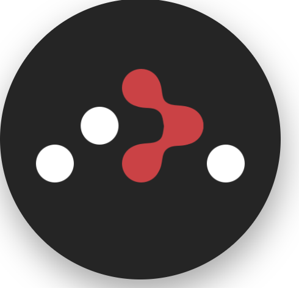
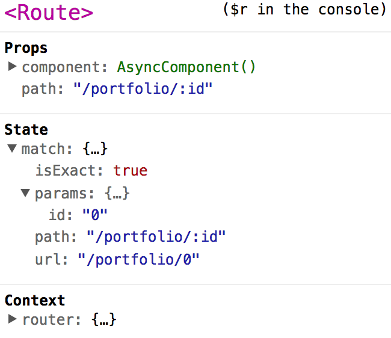

  

## 들어가기에 앞서
~~React Router v4가 정식으로 나와서 3은 deprecated 된 거나 마찬가지라고 본다.~~~  
현재 React Router v3은 디프리케잇 되지 않고 React Router v4와 다른 노선을 탔을 뿐, 지원은 계속 해주는 것 같다.  
따라서 레거시 환경을 싫어하기도 해서 한 번 마이그레이션을 간단하게 해보았다.  
기본적으로 [웹팩](/2016/11/18/Module-bundling-with-Webpck/), [바벨](/2016/11/11/Babel-ES6-with-IE8/), 리액트 라우터 등등은 안다는 전제 하에 글을 썼다.  
웹팩 2에 대한 모르는 부분은 아래 글을 조금씩 참조하면 도움이 될 것이다.  
* [(Webpack 2) 트리 쉐이킹을 해보자!](/2017/03/12/webpack2-tree-shaking/)  
* [(Webpack 2) 코드를 분할해보자!](/2017/03/13/webpack2-code-splitting/)

## v3으로 만들어보기
소스 코드는 [정재남](https://www.facebook.com/gomugomm?fref=ts) 님께서 제공해주신 [소스](https://github.com/react-study/todo-app/tree/_lecture/05_router-test/src/routerTest)를 이용했다.  
v3으로 만든 [라이브 데모](http://react-router-v3.surge.sh/)에서 직접 내용을 확인해보고 시작하자.  
혹시 만들기 귀찮거나 중간중간 확인할 사람은 [소스 코드](https://github.com/perfectacle/react-router-4/tree/master)를 보도록 하자.
서버는 없으니 새로고침을 하면 제대로 정보를 표시 못 하지만, 우리가 실제 진행할 때는  
Node.js의 express 프레임워크를 사용해서 새로고침을 해도 제대로 작동하게 만들 것이다.  

전체적인 프로젝트 구조는 다음과 같다.


일단 packge.json 파일을 만들고 다음 패키지들을 설치하자.  
```bash
npm i -D babel-core babel-loader babel-plugin-syntax-dynamic-import babel-preset-env babel-preset-react webpack-dev-server
npm i -S express html-webpack-plugin react react-dom react-router@^3.x webpack
```
`babel-plugin-syntax-dynamic-import`는 코드 스플리팅을 위해 추가한 플러그인이다.  
.babelrc 파일을 만들고 아래와 같이 적어주자.
```json
{
  "presets": [
    [
      "env",
      {
        "browsers": ["last 2 versions", "> 10%", "ie 9"],
        // tree shaking
        "modules": false
      }
    ],
    "react"
  ],
  "plugins": [
    "syntax-dynamic-import"
  ]
}
```
presets 부분이 요상하게 적혀있는데 트리 쉐이킹을 위한 것이니 모르는 사람은  
[(Webpack 2) 트리 쉐이킹을 해보자!](/2017/03/12/webpack2-tree-shaking/)을 참조하자.  

이제 컴포넌트들을 하나 하나 작성해보자.  

```javascript
// About.js
// 프롭스 중에 children도 같이 렌더링한다.
import React from 'react/lib/React';

const About = ({children}) => (
  <div>
    <h2>About</h2>
    <div>{children}</div>
  </div>
);

export default About;
```

```javascript
// Container.js
// 상단에 메뉴(고정)들이 존재하고, 프롭스 중에 children 내용이 변경되면서 렌더링 된다.
import React from 'react/lib/React';
import Link from 'react-router/es/Link';

const Container = ({children}) => (
  <div>
    <header>
      <ul>
        <li><Link to="/">Home</Link></li>
        <li><Link to="/about">About</Link></li>
        <li><Link to="/about/name">About - Name</Link></li>
        <li><Link to="/about/redirect0">About - RedirectTo: Portfolio #0</Link></li>
        <li><Link to="/about/redirect1">About - RedirectTo: Portfolio #1</Link></li>
        <li><Link to="/portfolio">Portfolio - All</Link></li>
        <li><Link to="/portfolio/0">Portfoilo - #0</Link></li>
        <li><Link to="/portfolio/1">Portfoilo - #1</Link></li>
      </ul>
    </header>
    <div>
      {children}
    </div>
  </div>
);

export default Container;
```

```javascript
// Home.js
import React from 'react/lib/React';

const Home = () => (<h2>Home</h2>);

export default Home;
```

```javascript
// Name.js
import React from 'react/lib/React';

const Name = () => (<h2>Name</h2>);

export default Name;
```

```javascript
// Portfolio.js
import React from 'react/lib/React';

const Portfolio = ({routeParams: {id}}) =>  {
  const allList = [
    { id: 0, text: 'portfolio #0' },
    { id: 1, text: 'portfolio #1' }
  ];
  const filterList = id ? allList.filter(v => v.id === +id) : allList;
  const renderList = filterList.map(v => (
      <li key={v.id}>{v.text}</li>
    )
  );
  return (
    <div>
      <h2>Portfolio</h2>
      <ul>{renderList}</ul>
    </div>
  );
};

export default Portfolio;
```

  
id는 추후에 우리가 정할 파라미터이다.

```javascript
// App.js
import React from 'react/lib/React';

// import { Router, Route, IndexRoute, Redirect, browserHistory, hashHistory } from 'react-router';
// 리액트 라우터를 코드 스플리팅 하려면 위 코드를 이렇게 하나씩 불러와야한다 귀찮 ㅠ
import Router from 'react-router/es/Router';
import Route from 'react-router/es/Route';
import IndexRoute from 'react-router/es/IndexRoute';
import Redirect from 'react-router/es/Redirect';
import browserHistory from 'react-router/es/browserHistory';
import hashHistory from 'react-router/es/hashHistory';

// HTML5 History API 지원여부 파악
const isBrowserHistory = history.pushState;

// 리액트 라우터 3에서 코드 스플리팅 하기.
const loadRoute = callback => module => callback(null, module.default);

const App = () => (
  <Router history={isBrowserHistory ? browserHistory : hashHistory}>
    <Route path="/" getComponent={ // component 대신에 getComponent를 써야 코드 스플리팅이 됨.
      (loaction, callback) => {
        import('./components/Container').then(loadRoute(callback))
      }}>
      <IndexRoute getComponent={ // 요 아래 컴포넌트들은 전부 Container 라우트의 자식들이다.
        (loaction, callback) => {
          import('./components/Home').then(loadRoute(callback))
        }}/>
      <Route path="about" getComponent={
        (loaction, callback) => {
          import('./components/About').then(loadRoute(callback))
        }}>
        <Route path="name" getComponent={
          (loaction, callback) => {
            import('./components/Name').then(loadRoute(callback))
          }}/>
        <Route path="redirect0"
               onEnter={(nextState, replace) => replace('/portfolio/0')}
        />
        <Redirect from="redirect1" to="/portfolio/1" />
      </Route>
      <Route path="portfolio(/:id)" getComponent={
        // 파라미터 :id 때문에 위의 사진과 같이 파라미터가 id가 된 거다.
        // 괄호로 감쌌기 때문에 생략이 가능하다는 소리다.
        (loaction, callback) => {
          import('./components/Portfolio').then(loadRoute(callback))
        }}/>
    </Route>
  </Router>
);

export default App;
```
component 대신에 getComponent를 써서 코드 스플리팅을 하였다.  
또한 그 안에 `import(component)`와 같은 구문 때문에  
`babel-plugin-syntax-dynamic-import`를 쓰게 된 거다.  
혹시 코드 스플리팅에 대해 잘 모르는 사람은 [(Webpack 2) 코드를 분할해보자!](/2017/03/13/webpack2-code-splitting/)를 봐보자.  

```javascript
// index.js
if( // 배포할 때는 리액트 개발 도구를 죽여놔야함.
  process.env.NODE_ENV === 'production' &&
  window.__REACT_DEVTOOLS_GLOBAL_HOOK__ &&
  Object.keys(window.__REACT_DEVTOOLS_GLOBAL_HOOK__._renderers).length
) window.__REACT_DEVTOOLS_GLOBAL_HOOK__._renderers = {};

import React from 'react/lib/React';
import { render } from 'react-dom';

import App from './App';

render(<App />, document.getElementById('app'));
```
마지막으로 index.html도 만들어주자.  
```html
<!DOCTYPE html>
<html lang="ko">
<head>
  <meta charset="UTF-8" />
  <meta name="viewport" content="width=device-width, initial-scale=1.0, maximum-scale=1.0, user-scalable=0" />
  <title>Title</title>
</head>
<body>
<div id="app">
</div>
</body>
</html>
```

이제 웹팩의 개발용 설정 파일을 작성하자.
```javascript
// webpack.dev.config.js
const webpack = require('webpack');
const {resolve} = require('path');
const HtmlWebpackPlugin = require('html-webpack-plugin');

const PORT = 3001;
const ROOT = './app/src';

module.exports = {
  devtool: 'inline-source-map',
  entry: [
    `webpack-dev-server/client?http://localhost:${PORT}`,
    // bundle the client for webpack-dev-server
    // and connect to the provided endpoint

    'webpack/hot/only-dev-server',
    // bundle the client for hot reloading
    // only- means to only hot reload for successful updates

    resolve(ROOT, 'index')
    // the entry point of our app
  ],
  output: {
    publicPath: '/',
    filename: 'bundle.js',
  },
  plugins: [
    new webpack.HotModuleReplacementPlugin(),
    // enable HMR globally

    new webpack.NamedModulesPlugin(),
    // prints more readable module names in the browser console on HMR updates

    new HtmlWebpackPlugin({
      template: `${ROOT}/index.html`
    })
  ],
  module: {
    rules: [{
      test: /\.js$/,
      use: ['babel-loader'],
      exclude: /node_modules/,
    }]
  },
  devServer: {
    hot: true,
    inline: true,
    port: PORT,
    historyApiFallback: true,
    contentBase: ROOT
  }
};

process.noDeprecation = true;
```

이제 배포용 웹팩 설정 파일을 작성하자.
```javascript
// webpack.config.js
'use strict';
const webpack = require('webpack');
const {resolve} = require('path');
const HtmlWebpackPlugin = require('html-webpack-plugin');

const ROOT = './app/src';
const DIST = 'app/dist';

module.exports = {
  entry: {
    app: ROOT + '/index.js',
  },
  output: {
    filename: '[name].[chunkhash].js',
    path: resolve(__dirname, DIST),
    publicPath: '/'
  },
  plugins: [
    new webpack.LoaderOptionsPlugin({
      minimize: true
    }),

    new webpack.optimize.UglifyJsPlugin({
      compress: {
        warnings: false, // 터미널 창에 출력되는 게 보기 귀찮아서 추가.
        unused: true // tree shaking
      }
    }),

    new webpack.optimize.CommonsChunkPlugin({
      name: 'vendor',
      // 아래 부분이 핵심
      minChunks: function (module) {
        // this assumes your vendor imports exist in the node_modules directory
        return module.context && module.context.indexOf('node_modules') !== -1;
      }
    }),
    new webpack.DefinePlugin({
      'process.env': {
        NODE_ENV: JSON.stringify('production')
      }
    }),
    new HtmlWebpackPlugin({
      template: './app/src/index.html',
      minify: {
        collapseWhitespace: true,
        conservativeCollapse: true,
        keepClosingSlash: true,
        removeComments: true,
        removeRedundantAttributes: true,
        removeScriptTypeAttributes: true,
        removeStyleLinkTypeAttributes: true
      }
    })
  ],
  module: {
    rules: [{
      test: /\.js$/,
      use: ['babel-loader'],
      exclude: /node_modules/,
    }]
  }
};

process.noDeprecation = true;
```

chunkhash가 뭔지 모르는 사람도 역시 [(Webpack 2) 코드를 분할해보자!](/2017/03/13/webpack2-code-splitting/#hash-vs-chunkhash)를 봐보자.

이제 배포용 파일을 테스트 하기 위해 express 프레임워크를 써서 서버 설정 파일을 작성하자.  
```javascript
// server.js
const express =  require('express');
const app = express();
const PORT = 3000;
const DIST = `${__dirname}/app/dist/`;

// server-open
app.use('/', express.static(DIST));
app.listen(PORT, () => {
  console.log('Express listening on port', PORT);
});

// client router
app.get('*', (req, res) => {
  res.sendFile(DIST);
});
```

작업을 편안하게 하기 위해 packge.json의 npm script를 수정해보자.  
```json
{
  "scripts": {
    "test": "echo \"Error: no test specified\" && exit 1",
    "start": "./node_modules/webpack-dev-server/bin/webpack-dev-server.js -d --config webpack.dev.config.js",
    "build": "rm -rf app/dist && node_modules/webpack/bin/webpack.js && node server"
  }
}
```

1. npm start라고 치고 http://localhost:3001/에 접속하면 개발용 버전으로 볼 수 있고(소스맵, 리액트 개발 도구)  
2. npm build라고 치고 http://localhost:3000/에 접속하면 배포용으로 볼 수 있다. (소스맵 X, 리액트 개발 도구 X)  

윈도우 유저는 `rm -rf`에 해당하는 다른 명령어로 build 스크립트를 수정해야할 것이다.  

## 리액트 라우터 v4로 마이그레이션 하기
리액트 라우터 v3로 만드는 것도 좀 귀찮았는데 아직 마이그레이션은 시작도 하지 않았다.  
리액트 라우터 v4에서는 바뀐 게 참 많아서... 수정해야할 부분이 참 많다.  
혹시 따라하기 귀찮거나 중간 중간 확인하고 싶은 사람은 [소스 코드](https://github.com/perfectacle/react-router-4/tree/v4)를 확인하자.

  
v3 때는 react-router 하나 밖에 못 봤던 것 같은데... 5개나 됐다.  
대표적으로 react-router, react-router-dom, react-router-native만 알아봤다.  
* react-router = react-router-dom + react-router-native  
* react-router-dom = Web 용 react-router  
* react-router-native = App 용 react-router

나는 웹을 주로 사용하니 react-router-dom v4로 설치하자.  
```bash
npm un -S react-router
npm i -S react-router-dom
```

Container.js를 Menu.js로 이름을 바꾼 후 다음과 같이 수정하자.  
```javascript
// v4로 오면서 컨테이너로써의 기능을 상실하게 된다.
// 즉 Route 컴포넌트는 자식을 가질 수 없게 됐다.
import React from 'react/lib/React';

import Link from 'react-router-dom/es/Link';
const Menu = () => (
  <div>
    <header>
      <ul>
        <li><Link to="/">Home</Link></li>
        <li><Link to="/about">About</Link></li>
        <li><Link to="/about/name">About - Name</Link></li>
        <li><Link to="/about/redirect0">About - RedirectTo: Portfolio #0</Link></li>
        <li><Link to="/about/redirect1">About - RedirectTo: Portfolio #1</Link></li>
        <li><Link to="/portfolio">Portfolio - All</Link></li>
        <li><Link to="/portfolio/0">Portfoilo - #0</Link></li>
        <li><Link to="/portfolio/1">Portfoilo - #1</Link></li>
      </ul>
    </header>
  </div>
);

export default Menu;
```

```javascript
// Portfolio.js
import React from 'react/lib/React';

const Portfolio = ({ match: {params: {id}} }) =>  {
  const allList = [
    { id: 0, text: 'portfolio #0' },
    { id: 1, text: 'portfolio #1' }
  ];
  const filterList = id ? allList.filter(v => v.id === +id) : allList;
  const renderList = filterList.map(v =>
    <li key={v.id}>{v.text}</li>
  );
  return (
    <div>
      <h2>Portfolio</h2>
      <ul>{renderList}</ul>
    </div>
  );
};

export default Portfolio;
```


App.js가 가장 수정 사항이 많다...  
나도 원리 보다는 사용방법 위주로 익혔으니 자세한 내용은 [공식 사이트](https://reacttraining.com/react-router/)를 참조하자.  
```javascript
// App.js
import React, {Component} from 'react/lib/React';

// import { BrowserRouter, HashRouter, Route, Redirect, Switch } from 'react-router-dom';
// 리액트 라우터를 코드 스플리팅 하려면 위 코드를 이렇게 하나씩 불러와야한다 귀찮 ㅠ
import BrowserRouter from 'react-router-dom/es/BrowserRouter';
import HashRouter from 'react-router-dom/es/HashRouter';
import Route from 'react-router-dom/es/Route';
import Redirect from 'react-router-dom/es/Redirect';
import Switch from 'react-router-dom/es/Switch';

import Menu from './components/Menu';

// HTML5 History API 지원여부 파악
const isBrowserHistory = history.pushState;
const Router = isBrowserHistory ? BrowserRouter : HashRouter;

// 리액트 라우터 4에서 코드 스플리팅 하기.
// getComponent is a function that returns a promise for a component
// It will not be called until the first mount
const asyncComponent = getComponent => (
  class AsyncComponent extends Component {
    constructor() {
      super();
      this.state = {Component: AsyncComponent.Component};
    }

    componentWillMount() {
      if (!this.state.Component) {
        getComponent().then(Component => {
          AsyncComponent.Component = Component;
          this.setState({Component});
        });
      }
    }
    render() {
      const {Component} = this.state;
      if(Component) {
        return <Component {...this.props} />;
      }
      return null;
    }
  }
);

const About = asyncComponent(() => import('./components/About').then(module => module.default));
const Home = asyncComponent(() => import('./components/Home').then(module => module.default));
const Name = asyncComponent(() => import('./components/Name').then(module => module.default));
const Portfolio = asyncComponent(() => import('./components/Portfolio').then(module => module.default));

const App = () => (
  // v3에는 Router 속성에 browserRouter or hashRouter가 들어갔는데,
  // v4에는 BrowserRouter or HashRouter가 Router까지 포함한다.
  // 또한 Router 안에는 하나의 컴포넌트만 들어가야한다.
  // 따라서 div 같은 컴포넌트로 그 안을 한 번 감싸줘야한다.
  // 또한 IndexRoute는 Route 컴포넌트의 exact라는 속성으로 대체되었다.
  // Redirect 컴포넌트는 Switch 컴포넌트로 감싸줘야 정상 작동한다.
  // 또한 파라미터는 괄호를 써서 생략 가능하던 것이 불가능해졌다.
  <Router>
    <div>
      <Menu/>
      <Route exact path="/" component={Home} />
      <Route path="/about" component={About} />
      <Route path="/about/name" component={Name} />
      <Switch>
        <Redirect to="/portfolio/0" from="/about/redirect0"/>
        <Redirect from="/about/redirect1" to="/portfolio/1"/>
      </Switch>
      <Route exact path="/portfolio" component={Portfolio} />
      <Route path="/portfolio/:id" component={Portfolio} />
    </div>
  </Router>
);

export default App;
```

이렇게 하면 일단 내가 먼저 react-router v3으로 작성했던 내용들은 마이그레이션 됐다.  
`npm start`와 `npm build`를 통해 확인해보자.  
더 자세한 사용 방법들은 무조건 [공식 사이트](https://reacttraining.com/react-router/)를 참조하자.  

그리고 여기서 끝난 게 아니다.  
리액트 라우터 4는 리액트 핫 로더와도 문제가 있어서 리액트 핫 로더 3에서 해결했다고는 하지만...  
이 또한 어느 정도 문제가 존재해 추후에 해당 내용을 다뤄봐야겠다.  

## 참조 링크
* [React Router: Declarative Routing for React.js](https://reacttraining.com/react-router/)  
* [Server-side rendering, code-splitting, and hot reloading with React Router v4](https://medium.com/@apostolos/server-side-rendering-code-splitting-and-hot-reloading-with-react-router-v4-87239cfc172c#.c2cte5qa3)  
* [Quick and dirty code splitting with React Router v4](https://gist.github.com/acdlite/a68433004f9d6b4cbc83b5cc3990c194)  
* [React-Router v4 Pre-Release 사용해보기](https://velopert.com/2261)