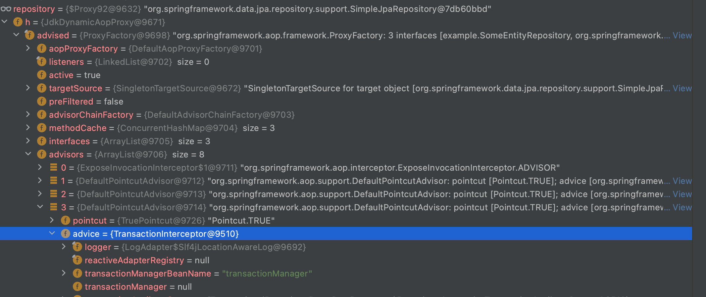

# 3줄 요약
1. @Transaction(readOnly = true)로 설정해도 트랜잭션은 시작된다. (transaction isolation level 보장)
1. readOnly 트랜잭션도 시작한 트랜잭션을 종료시켜야하기 때문에 커밋도 한다.
1. readOnly 트랜잭션의 Hibernate Session의 FlushMode는 Manual로 강제하기 때문에 트랜잭션을 커밋하기 전에 flush를 하지 않는다. (readOnly 보장)

## @Transaction(readOnly = true)로 설정해도 트랜잭션은 시작된다.
```java
public interface SomeEntityRepository extends JpaRepository<Parent, Long> {
    @Transactional(readOnly = true)
    List<Parent> findByName(String name);
}

@Service
public SomeService {
    private final SomeEntityRepository repository;
    
    public SomeService(final SomeEntityRepository repository) {
        this.repository = repository;
    }
    
    public void test() {
        repository.findByName("qwer");
    }
}
```


repository의 구현체는 프록시 객체로써 인터페이스이기 때문에 jdk dynamic 프록시 객체가 생성이 된다.  
또한 TransactionInterceptor라는 Advisor를 가지고 있으며 
1. [TransactionInterceptor.invoke()](https://github.com/spring-projects/spring-framework/blob/main/spring-tx/src/main/java/org/springframework/transaction/interceptor/TransactionInterceptor.java#L119)
1. [TransactionAspectSupport.invokeWithinTransaction()](https://github.com/spring-projects/spring-framework/blob/main/spring-tx/src/main/java/org/springframework/transaction/interceptor/TransactionAspectSupport.java#L382)
1. [TransactionAspectSupport.createTransactionIfNecessary()](https://github.com/spring-projects/spring-framework/blob/main/spring-tx/src/main/java/org/springframework/transaction/interceptor/TransactionAspectSupport.java#L595)
1. [AbstractPlatformTransactionManager.getTransaction()](https://github.com/spring-projects/spring-framework/blob/main/spring-tx/src/main/java/org/springframework/transaction/support/AbstractPlatformTransactionManager.java#L373)
1. [AbstractPlatformTransactionManager.startTransaction()](https://github.com/spring-projects/spring-framework/blob/main/spring-tx/src/main/java/org/springframework/transaction/support/AbstractPlatformTransactionManager.java#L400)
1. [JpaTransactionManager.doBegin()](https://github.com/spring-projects/spring-framework/blob/main/spring-orm/src/main/java/org/springframework/orm/jpa/JpaTransactionManager.java#L421)
1. [HibernateJpaDialect.beginTransaction()](https://github.com/spring-projects/spring-framework/blob/main/spring-orm/src/main/java/org/springframework/orm/jpa/vendor/HibernateJpaDialect.java#L164)
1. [TransactionImpl.begin()](https://github.com/hibernate/hibernate-orm/blob/main/hibernate-core/src/main/java/org/hibernate/engine/transaction/internal/TransactionImpl.java#L83)
1. [JdbcResourceLocalTransactionCoordinatorImpl.TransactionDriverControlImpl.begin()](https://github.com/hibernate/hibernate-orm/blob/main/hibernate-core/src/main/java/org/hibernate/resource/transaction/backend/jdbc/internal/JdbcResourceLocalTransactionCoordinatorImpl.java#L246)
1. [LogicalConnectionManagedImpl.begin()](https://github.com/hibernate/hibernate-orm/blob/main/hibernate-core/src/main/java/org/hibernate/resource/jdbc/internal/LogicalConnectionManagedImpl.java#L285)
1. [AbstractLogicalConnectionImplementor.begin()](https://github.com/hibernate/hibernate-orm/blob/main/hibernate-core/src/main/java/org/hibernate/resource/jdbc/internal/AbstractLogicalConnectionImplementor.java#L68)

위와 같은 메서드 호출을 통해서 실제로 트랜잭션을 시작하게 된다.

## @Transaction(readOnly = true)에 의해 시작된 트랜잭션은 flush를 하지 않는다.
[HibernateJpaDialect.beginTransaction()](https://github.com/spring-projects/spring-framework/blob/main/spring-orm/src/main/java/org/springframework/orm/jpa/vendor/HibernateJpaDialect.java#L136) 을 타고 보다보면 아래와 같은 흐름을 따라가게 된다.
```java
@Override
public Object beginTransaction(EntityManager entityManager, TransactionDefinition definition)
        throws PersistenceException, SQLException, TransactionException {

    Session session = getSession(entityManager);

    if (definition.getTimeout() != TransactionDefinition.TIMEOUT_DEFAULT) {
        session.getTransaction().setTimeout(definition.getTimeout());
    }

    boolean isolationLevelNeeded = (definition.getIsolationLevel() != TransactionDefinition.ISOLATION_DEFAULT);
    Integer previousIsolationLevel = null;
    Connection preparedCon = null;

    if (isolationLevelNeeded || definition.isReadOnly()) {
        if (this.prepareConnection) {
            preparedCon = HibernateConnectionHandle.doGetConnection(session);
            previousIsolationLevel = DataSourceUtils.prepareConnectionForTransaction(preparedCon, definition);
        }
        else if (isolationLevelNeeded) {
            throw new InvalidIsolationLevelException(getClass().getSimpleName() +
                    " does not support custom isolation levels since the 'prepareConnection' flag is off.");
        }
    }

    // Standard JPA transaction begin call for full JPA context setup...
    entityManager.getTransaction().begin();

    // Adapt flush mode and store previous isolation level, if any.
    FlushMode previousFlushMode = prepareFlushMode(session, definition.isReadOnly());
    // ...
}

@Nullable
protected FlushMode prepareFlushMode(Session session, boolean readOnly) throws PersistenceException {
    FlushMode flushMode = (FlushMode) ReflectionUtils.invokeMethod(getFlushMode, session);
    Assert.state(flushMode != null, "No FlushMode from Session");
    if (readOnly) {
        // We should suppress flushing for a read-only transaction.
        if (!flushMode.equals(FlushMode.MANUAL)) {
            session.setFlushMode(FlushMode.MANUAL);
            return flushMode;
        }
    }
    // ...
}
```
Transaction의 설정이 readOnly = true라면 Hibernate Session의 FlushMode를 MANUAL(명시적으로 [EntityManager.flush()](https://docs.oracle.com/javaee/7/api/javax/persistence/EntityManager.html#flush--) 메서드를 호출하기 전까지 flush 되지 않음)로 강제하고 있다.

그리고 나서 실질적인 로직이 끝난 이후에 [TransactionAspectSupport.invokeWithinTransaction()](https://github.com/spring-projects/spring-framework/blob/main/spring-tx/src/main/java/org/springframework/transaction/interceptor/TransactionAspectSupport.java#L380) 메서드에서 아래와 같은 호출 흐름을 가진다.
```java
@Nullable
protected Object invokeWithinTransaction(Method method, @Nullable Class<?> targetClass,
        final InvocationCallback invocation) throws Throwable {
    // ...
    if (txAttr == null || !(ptm instanceof CallbackPreferringPlatformTransactionManager)) {
        // Standard transaction demarcation with getTransaction and commit/rollback calls.
        TransactionInfo txInfo = createTransactionIfNecessary(ptm, txAttr, joinpointIdentification);

        Object retVal;
        try {
            // This is an around advice: Invoke the next interceptor in the chain.
            // This will normally result in a target object being invoked.
            retVal = invocation.proceedWithInvocation();
        }
        catch (Throwable ex) {
            // target invocation exception
            completeTransactionAfterThrowing(txInfo, ex);
            throw ex;
        }
        finally {
            cleanupTransactionInfo(txInfo);
        }

        if (retVal != null && vavrPresent && VavrDelegate.isVavrTry(retVal)) {
            // Set rollback-only in case of Vavr failure matching our rollback rules...
            TransactionStatus status = txInfo.getTransactionStatus();
            if (status != null && txAttr != null) {
                retVal = VavrDelegate.evaluateTryFailure(retVal, txAttr, status);
            }
        }

        commitTransactionAfterReturning(txInfo);
        return retVal;
    }
    // ...
}
```


1. invocation.proceedWithInvocation()에 의해 트랜잭션 내부 로직을 호출한다.  
1. [TransactionAspectSupport.commitTransactionAfterReturning()](https://github.com/spring-projects/spring-framework/blob/main/spring-tx/src/main/java/org/springframework/transaction/interceptor/TransactionAspectSupport.java#L654)
1. [AbstractPlatformTransactionManager.commit()](https://github.com/spring-projects/spring-framework/blob/main/spring-tx/src/main/java/org/springframework/transaction/support/AbstractPlatformTransactionManager.java#L711)
1. [AbstractPlatformTransactionManager.processCommit()](https://github.com/spring-projects/spring-framework/blob/main/spring-tx/src/main/java/org/springframework/transaction/support/AbstractPlatformTransactionManager.java#L743)
1. [JpaTransactionManager.doCommit()](https://github.com/spring-projects/spring-framework/blob/main/spring-orm/src/main/java/org/springframework/orm/jpa/JpaTransactionManager.java#L562)
1. [TransactionImpl.commit()](https://github.com/hibernate/hibernate-orm/blob/main/hibernate-core/src/main/java/org/hibernate/engine/transaction/internal/TransactionImpl.java#L101)
1. [JdbcResourceLocalTransactionCoordinatorImpl.TransactionDriverControlImpl.commit()](https://github.com/hibernate/hibernate-orm/blob/main/hibernate-core/src/main/java/org/hibernate/resource/transaction/backend/jdbc/internal/JdbcResourceLocalTransactionCoordinatorImpl.java#L281)
1. [JdbcResourceLocalTransactionCoordinatorImpl.beforeCompletionCallback()](https://github.com/hibernate/hibernate-orm/blob/main/hibernate-core/src/main/java/org/hibernate/resource/transaction/backend/jdbc/internal/JdbcResourceLocalTransactionCoordinatorImpl.java#L183)
1. [JdbcCoordinatorImpl.beforeTransactionCompletion()](https://github.com/hibernate/hibernate-orm/blob/main/hibernate-core/src/main/java/org/hibernate/engine/jdbc/internal/JdbcCoordinatorImpl.java#L448)
1. [SessionImpl.beforeTransactionCompletion()](https://github.com/hibernate/hibernate-orm/blob/main/hibernate-core/src/main/java/org/hibernate/internal/SessionImpl.java#L2409)
1. [SessionImpl.flushBeforeTransactionCompletion()](https://github.com/hibernate/hibernate-orm/blob/main/hibernate-core/src/main/java/org/hibernate/internal/SessionImpl.java#L3268)

SessionImpl.flushBeforeTransactionCompletion 코드를 보면 아래와 같다.
```java
public void flushBeforeTransactionCompletion() {
    final boolean doFlush = isTransactionFlushable()
            && getHibernateFlushMode() != FlushMode.MANUAL;

    try {
        if ( doFlush ) {
            managedFlush();
        }
    }
    catch (RuntimeException re) {
        throw ExceptionMapperStandardImpl.INSTANCE.mapManagedFlushFailure( "error during managed flush", re, this );
    }
}
```
위에서 readOnly이면 Hibernate Session의 Flush 모드를 MANUAL로 강제했기 때문에 getHibernateFlushMode()는 MANUAL이 나오기 때문에
`getHibernateFlushMode() != FlushMode.MANUAL`는 false이기 때문에 doFlush는 false라서 managedFlush 메서드를 호출하지 않아서 실질적으로 flush가 호출되지 않는다.

## @Transaction(readOnly = true)에 의해 시작된 트랜잭션도 종료를 해야하기 때문에 커밋을 한다.
flush는 하지 않았지만 트랜잭션을 시작했기 때문에 트랜잭션을 종료해야 정상적으로 커넥션을 반환하게 된다.
다시 [JdbcResourceLocalTransactionCoordinatorImpl.TransactionDriverControlImpl.commit()](https://github.com/hibernate/hibernate-orm/blob/main/hibernate-core/src/main/java/org/hibernate/resource/transaction/backend/jdbc/internal/JdbcResourceLocalTransactionCoordinatorImpl.java#L282) 로 돌아오면
1. [AbstractLogicalConnectionImplementor.commit()](https://github.com/hibernate/hibernate-orm/blob/main/hibernate-core/src/main/java/org/hibernate/resource/jdbc/internal/AbstractLogicalConnectionImplementor.java#L86)
1. [ProxyConnection.commit()](https://github.com/brettwooldridge/HikariCP/blob/dev/src/main/java/com/zaxxer/hikari/pool/ProxyConnection.java#L387)
1. [Connection.commit()](https://docs.oracle.com/javase/7/docs/api/java/sql/Connection.html#commit())

위와 같은 메서드 호출을 통해 실제 DB 물리 커넥션에 commit을 날리기 때문에 위에서 시작한 트랜잭션을 종료하게 된다.