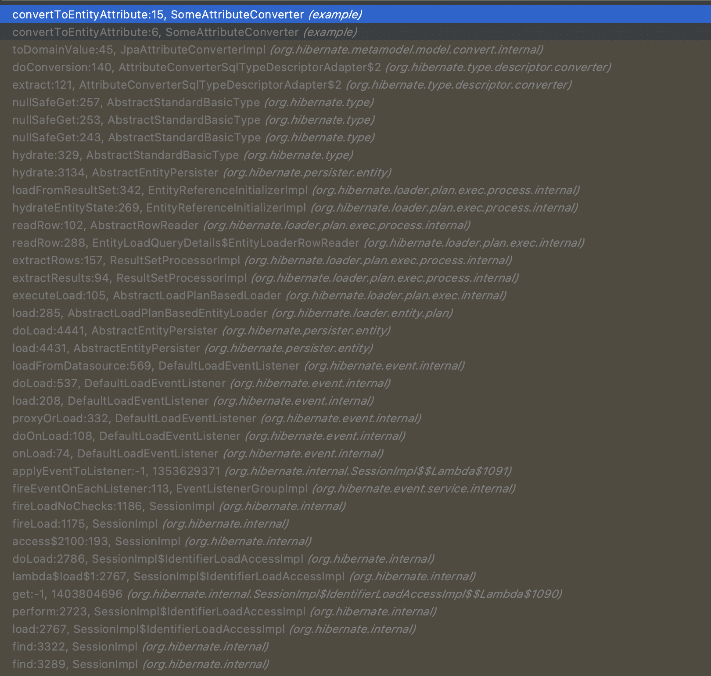

## 3줄 요약
1. @Transaction(readOnly = true)로 설정하면 select 할 당시 엔티티의 스냅샷을 만들지 않는다.
1. [(JPA) Readonly 트랜잭션은 트랜잭션을 시작하지만 flush를 하지 않는다](/2021/05/05/readonly-transaction-begin-transaction/)에서 봤다 싶이 트랜잭션이 커밋될 때 flush를 하지 않는다.
1. flush를 할 필요가 없기 때문에 Dirty Checking을 할 필요가 없고, 그에 따라서 엔티티의 스냅샷도 만들지 않는 것이다.

## 엔티티 구조
이해를 편하게 돕기 위해 엔티티는 아래와 같은 구조를 가진다.
```java
@Entity
@Table(name = "parents")
public class Parent {
    @Id
    @GeneratedValue(strategy = GenerationType.IDENTITY)
    private Long no;

    @Column(name = "helloName")
    private SomeType someType;
}
```

```java
public class SomeType {
    private final String helloName;

    public SomeType(final String helloName) {
        this.helloName = helloName;
    }
}
```

SomeType은 JPA에서 모르는 커스텀 타입이기 때문에 컨버터를 만들어주자.
```java
@Converter(autoApply = true)
public class SomeAttributeConverter implements AttributeConverter<SomeType, String> {
    @Override
    public String convertToDatabaseColumn(final SomeType attribute) {
        return attribute.getHelloName();
    }

    @Override
    public SomeType convertToEntityAttribute(final String dbData) {
        return new SomeType(dbData);
    }
}
```

테스트 편의성을 위해 convertToEntityAttribute 메서드에 브레이크 포인트를 걸고 확인해보면 편하다.

## Readonly 트랜잭션이 아니면 스냅샷을 만든다 (엔티티를 딥카피한다)
테스트를 위해 Repository에 Readonly 트랜잭션이 아닌 findBy 메서드를 만든다.  
(SimpleJpaRepositroy의 findById 메서드는 readonly 트랜잭션이기 때문에 커스텀 메서드를 만들었다.)
```java
public interface ParentRepository extends JpaRepository<Parent, Long> {
    @Transactional
    Parent findByNo(final long no);
}
```

그리고 findByNo를 호출하면서 SomeAttributeConverter.convertToEntityAttribute 메서드는 몇 번 호출되는지 보자.
  
  

[TwoPhaseLoad.initializeEntityFromEntityEntryLoadedState 메서드](https://github.com/hibernate/hibernate-orm/blob/main/hibernate-core/src/main/java/org/hibernate/engine/internal/TwoPhaseLoad.java#L339)가 핵심이다.  
```java
if ( isReallyReadOnly ) {
    //no need to take a snapshot - this is a
    //performance optimization, but not really
    //important, except for entities with huge
    //mutable property values
    persistenceContext.setEntryStatus( entityEntry, Status.READ_ONLY );
}
else {
    //take a snapshot
    TypeHelper.deepCopy(
            hydratedState,
            persister.getPropertyTypes(),
            persister.getPropertyUpdateability(),
            //after setting values to object
            hydratedState,
            session
    );
    persistenceContext.setEntryStatus( entityEntry, Status.MANAGED );
}
```

readonly 트랜잭션이면 성능최적화를 위해 스냅샷을 만들 필요가 없다고 하고 있고, 그게 아니면 스냅샷을 만들고 있고 그 안에서 딥카피가 수행되고 있다.

**여기서 핵심은 트랜잭션을 생성하지 않더라도 스냅샷(딥카피)를 만든다는 것이다.** 
```java
public interface ParentRepository extends JpaRepository<Parent, Long> {
    Parent findByNo(final long no);
}
```

위와 같이 트랜잭션을 생성하지 않더라도 리드온리 트랜잭션은 아니기 때문에 else 구문을 탄다.

## Readonly 트랜잭션이면 스냅샷을 만들지 않는다
이번에는 readonly 트랜잭션을 사용하는 [SimpleJpaRepository.findById](https://github.com/spring-projects/spring-data-jpa/blob/main/src/main/java/org/springframework/data/jpa/repository/support/SimpleJpaRepository.java#L295) 메서드를 사용하여 스냅샷(딥카피)을 만드는지 직접 확인해보자.  
```java
@Repository
@Transactional(readOnly = true)
public class SimpleJpaRepository<T, ID> implements JpaRepositoryImplementation<T, ID> {
    // ...
    @Override
    public Optional<T> findById(ID id) {

        Assert.notNull(id, ID_MUST_NOT_BE_NULL);

        Class<T> domainType = getDomainClass();

        if (metadata == null) {
            return Optional.ofNullable(em.find(domainType, id));
        }

        LockModeType type = metadata.getLockModeType();

        Map<String, Object> hints = getQueryHints().withFetchGraphs(em).asMap();

        return Optional.ofNullable(type == null ? em.find(domainType, id, hints) : em.find(domainType, id, type, hints));
    }
    // ...
}
```

위에서 보다싶이 SimpleJpaRepository는 타입에 readonly 트랜잭션이 적용돼있어서 해당 어노테이션을 오버라이딩 하지 않은 모든 메서드는 readonly 트랜잭션을 사용한다는 것을 알 수 있다.


이렇듯 JPA(하이버네이트)에서는 readonly 트랜잭션이면 성능최적화를 위해 엔티티의 스냅샷(딥카피)을 만들지 않는 걸 볼 수 있다.
