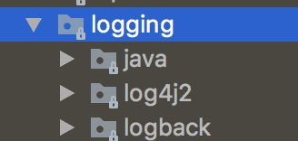

오늘은 서버를 구성할 때 필수적인 로깅에 대해 알아보자!  
우선 [환경 별로 profile 쪼개기](/2018/07/22/spring-boot-2-env/)가 진행된 상태에서 시작한다.  
최종 결과물은 [github 저장소](https://github.com/perfectacle/spring-boot-2-logging)에서 확인 가능하다.

## 로깅 라이브러리
여러가지 logging 라이브러리가 있는데 Spring Boot 2.0에서는 사진과 같이
[Java Util Logging](https://docs.oracle.com/javase/10/docs/api/java/util/logging/package-summary.html),
[Log4j 2](http://logging.apache.org/log4j/2.x/),
[Logback](https://logback.qos.ch/)을 기본적으로 사용할 수 있다.  


[logback 사용해야 하는 이유](https://beyondj2ee.wordpress.com/2012/11/09/logback-%EC%82%AC%EC%9A%A9%ED%95%B4%EC%95%BC-%ED%95%98%EB%8A%94-%EC%9D%B4%EC%9C%A0-reasons-to-prefer-logback-over-log4j/)
에 왜 logback을 사용해야하는지 나왔있으니 logback으로 로깅 라이브러리를 선택했다.

혹시나 다른 로깅 라이브러리로 갈아타기 편하기 위해 Facade 패턴을 적용한 [Slf4j](https://www.slf4j.org/)를 사용하기 위해 lombok을 디펜던시에 추가해야한다.  
```groovy
compileOnly('org.projectlombok:lombok')
```

또한 logback 관련된 설정을 찾다보면 logback.xml vs logback-spring.xml을 보게 되는데  
Web Application이 시작되고 나서 classpath 내의 logback.xml을 뒤져서 환경 설정을 적용한다.  
이 때는 Spring이 구동되기 이전이라 application.properties 내에 존재하는 값들을 불러올 수 없다.  
logback-spring.xml에서는 Spring이 구동된 후라 application.properties에 있는 값들을 불러올 수 있다.

## 콘솔 로깅
기본적으로 콘솔 로깅은 뭔가 디버깅할 용도로 많이 사용하기 때문에 local, test 환경에서 많이 사용한다.  
우선 resources 디렉토리를 아래와 같이 구성하자.  
```
- resources
  - log
    - console.xml
```

아래 내용을 복붙해주자.  
```xml
<?xml version="1.0" encoding="UTF-8"?>
<appender name="STDOUT" class="ch.qos.logback.core.ConsoleAppender">
    <encoder>
        <charset>UTF-8</charset>
        <pattern>%d{yyyyMMdd HH:mm:ss.SSS} [%thread] %-3level %logger{5} - %msg %n</pattern>
    </encoder>
</appender>
```
name은 다른 파일이나 위치에서 해당 appender를 무슨 이름으로 참조할지 이름을 정한 것이고,
ConsoleAppender 클래스를 사용해서 콘솔에 로깅한다고 명시하는 거 같다.  
한글이 들어갈지도 모르니 charset을 UTF-8로 세팅해주자.  
패턴은 어떤 형태로 찍을지에 대해서 규칙을 정한 것이다.  
자세한 내용은 [PatternLayout](https://logback.qos.ch/manual/layouts.html#ClassicPatternLayout)을 살펴보자.  
1. `%d{yyyyMMdd HH:mm:ss.SSS}` - 날짜
2. `%thread` - 어떤 스레드에서 실행한 것인지
3. `%-3level` - 로깅 레벨
4. `%logger{5}` - 어떤 클래스의 로거가 실행된 건지
5. `%msg` - 메세지  
6. `%n` - 줄바꿈

이제 해당 appender를 사용하게 끔 resources 디렉토리에 logback-spring.xml을 만들어주자.  
```xml
<?xml version="1.0" encoding="UTF-8"?>
<configuration>
    <include resource="log/console.xml" />
    <root level="info">
        <springProfile name="local">
            <appender-ref ref="STDOUT"/>
        </springProfile>
        <springProfile name="dev">
        </springProfile>
        <springProfile name="prod">
        </springProfile>
        <springProfile name="test">
            <appender-ref ref="STDOUT"/>
        </springProfile>
    </root>
</configuration>
```
include를 쓰지 않고 직접 xml 소스 코드를 넣어도 되지만 가독성을 해치는 것 같아 분리했다.  
또한 root에 설정했다 싶이 default logging level을 info로 설정했다.  
그리고 springProfile name 값에는 !local과 같은 값도 넣을 수 있다.  
appender-ref를 통해 appender를 참조할 수 있다.  
아니면 직접 그 코드를 삽입해도 되긴 하지만 중복이 상당히 많아질 것이다.  

로컬 환경과 dev 환경을 실행해보면 로컬 환경은 콘솔 창에 로그가 잘 찍히는데 dev 환경에서는 아래 로그가 끝일 것이다.  
```log
  .   ____          _            __ _ _
 /\\ / ___'_ __ _ _(_)_ __  __ _ \ \ \ \
( ( )\___ | '_ | '_| | '_ \/ _` | \ \ \ \
 \\/  ___)| |_)| | | | | || (_| |  ) ) ) )
  '  |____| .__|_| |_|_| |_\__, | / / / /
 =========|_|==============|___/=/_/_/_/
 :: Spring Boot ::        (v2.0.3.RELEASE)
```

## 로그 파일 남기기
console 로깅은 휘발성 데이터이고, 관리 측면에서도 용이하지 않기 때문에 날짜 별로 로그 파일로 남기게 해보자.  
console.xml과 같은 디렉토리에 file.xml을 만들어주자.
```xml
<?xml version="1.0" encoding="UTF-8"?>
<appender name="dailyRollingFileAppender" class="ch.qos.logback.core.rolling.RollingFileAppender">
    <rollingPolicy class="ch.qos.logback.core.rolling.TimeBasedRollingPolicy">
        <fileNamePattern>${LOG_FILE}/tomcat_log.%d{yyyy-MM-dd}-%i.log</fileNamePattern>
        <maxHistory>30</maxHistory>
        <timeBasedFileNamingAndTriggeringPolicy class="ch.qos.logback.core.rolling.SizeAndTimeBasedFNATP">
            <maxFileSize>100MB</maxFileSize>
        </timeBasedFileNamingAndTriggeringPolicy>
    </rollingPolicy>
    <encoder>
        <charset>UTF-8</charset>
        <pattern>%d{yyyy:MM:dd HH:mm:ss.SSS} %-5level --- [%thread] %logger{35} : %msg %n</pattern>
    </encoder>
</appender>
```
하루에 하나씩 생성되는 설정이다. (tomcat_log.2018-07-23-0.log와 같이)  
maxHistory를 30일로 설정해서 30일이 지난 로그들은 삭제된다.  
또한 maxFileSize를 100MB로 설정해서 로그 파일 용량이 100MB를 초과하면 자동으로 인덱스가 증가하면서 새로운 로그 파일이 생성된다. (시작은 0)  
그리고 log file 생성 경로를 위해 env 별 application.properties 파일에서 아래 코드를 추가해주면 된다.  
```properties
logging.file=./log/local
```
이렇게 되면 프로젝트 루트 디렉토리에 log 폴더가 생긴다.  
$LOG_FILE을 바인딩 했다고 보면 된다.  
위 설정을 하지 않으면 LOG_FILE_IS_UNDEFINED라는 디렉토리가 생기고 거기에 log 파일이 생성된다.

이제 해당 appender를 사용하게 끔 resources 디렉토리에 logback-spring.xml를 수정하자.
```xml
<?xml version="1.0" encoding="UTF-8"?>
<configuration>
    <include resource="log/console.xml" />
    <include resource="log/file.xml" />

    <root level="info">
        <springProfile name="local">
            <appender-ref ref="STDOUT"/>
            <appender-ref ref="dailyRollingFileAppender"/>
        </springProfile>
        <springProfile name="dev">
            <appender-ref ref="dailyRollingFileAppender"/>
        </springProfile>
        <springProfile name="prod">
            <appender-ref ref="dailyRollingFileAppender"/>
        </springProfile>
        <springProfile name="test">
            <appender-ref ref="STDOUT"/>
        </springProfile>
    </root>
</configuration>
```
test 환경에서는 로그 파일을 굳이 남길 필요가 없다.  
각 환경별로 로깅을 잘 하는지 확인해보고 테스트를 실행했을 때 로깅 파일이 제대로 생성되지 않으면 성공이다.  

## 로깅 레벨 정하기
local, dev, test 환경에서는 디버깅용 로그를 볼 일이 많다.  
하지만 prod 환경에서는 디버깅용 로그를 남기는 것은 불필요하므로 끄는 게 좋다.  
if 문으로 컨트롤 하는 것 또한 성능에 미비한 영향을 미칠테니 application.properties를 컨트롤 함으로써 해결해보자.  

local/dev/test env의 application.properties를 아래와 같이 수정해보자.  
```properties
logging.level.com.example.demo=debug
```
com 부터는 본인의 application이 있는 패키지를 선택해주면 된다.  

그리고 시험삼아 Applications 클래스를 아래와 같이 수정해봤다.  

```java
package com.example.demo;

import lombok.extern.slf4j.Slf4j;
import org.springframework.boot.SpringApplication;
import org.springframework.boot.autoconfigure.SpringBootApplication;

@SpringBootApplication
@Slf4j
public class DemoApplication {
    public static void main(String[] args) {
        SpringApplication.run(DemoApplication.class, args);

        log.error("error");
        log.warn("warn");
        log.info("info");
        log.trace("trace");
        log.debug("debug");
    }
}
```

파일/콘솔 로그에 찍히는 결과는 아래와 같았다.  
```log
20180723 00:54:06.524 [main] ERROR c.e.d.DemoApplication - error 
20180723 00:54:06.524 [main] WARN c.e.d.DemoApplication - warn 
20180723 00:54:06.524 [main] INFO c.e.d.DemoApplication - info 
20180723 00:54:06.524 [main] DEBUG c.e.d.DemoApplication - debug
```

trace가 가장 높은 레벨(?)인 거 같다.  

logging level을 아무것도 설정하지 않은 prod env로 실행하면 아래와 같이 나온다.  
```log
20180723 00:54:06.524 [main] ERROR c.e.d.DemoApplication - error 
20180723 00:54:06.524 [main] WARN c.e.d.DemoApplication - warn 
20180723 00:54:06.524 [main] INFO c.e.d.DemoApplication - info 
```
default level을 info로 설정했기 때문이다.  

Hibernate Logging을 하고 싶다면 아래와 같이 하면 된다.  
```properties
logging.level.org.hibernate=debug
spring.jpa.show-sql=true
spring.jpa.properties.hibernate.format_sql=true
```
spring.jpa.properties.hibernate.format_sql은 좀 더 보기 좋게 출력하는 것이니 필수는 아니다.  
logging.level.org.hibernate를 info로 세팅했을 때는 콘솔에는 찍혔지만, 파일에는 찍히지 않았다.  

## Access Log
**이 포스트에선 Tomcat을 사용한다고 가정하겠다.**  
유저가 어떤 URL을 호출했는지 알기 위해서는 Access Log를 남겨야한다.  
그러기 위해서는 웹 어플리케이션을 만들어야하기 때문에 아래 두 디펜던시를 인젝션 받자.  
```groovy
compile('org.springframework.boot:spring-boot-starter-actuator')
compile('org.springframework.boot:spring-boot-starter-web')
```
actuator는 health check, monitoring, metrics 등등 다양한 기능을 지원하는데 나는 health check 용으로 밖에 안 써봤다.  
actuator는 필수는 아니다.    
web은 `@RestController, @GetMapping` 등등 다양한 Rest API용 어노테이션을 제공해준다.  

또한 2.0 들어서 actuator의 url이 `/health`와 같은 형태에서 `/actuator/health`와 같은 형태로 바뀌었다.  
actuator의 url을 바꾸고 싶으면 application.properties에 아래와 같은 코드를 추가해주면 된다.  
```properties
management.endpoints.web.base-path=/
```

그리고 테스트용 컨트롤러를 하나 만들자.  
```java
package com.example.demo;

import lombok.extern.slf4j.Slf4j;
import org.springframework.web.bind.annotation.GetMapping;
import org.springframework.web.bind.annotation.RestController;

@RestController
@Slf4j
public class Controller {
    @GetMapping
    public void test() {
        log.info("info");
    }
}
```

그리고 이제 access log용 설정을 application.properties에 해야하는데 application.properties로 설정하면
health check나 *.ico, *.js 등등의 정적 파일 access log까지 생기게 된다.  
그러기 위해선 커스텀하게 설정을 해야하고, application.properties에는 디렉토리만 설정해주자.  

```properties
server.tomcat.basedir=./log/local
```

좀 더 커스텀한 설정을 하기 위해서는 [Apache Tomcat Access Log Valve](https://tomcat.apache.org/tomcat-8.5-doc/config/valve.html)를 사용해야한다.  
그리고 AccessLogConfig.java를 만들자.(참고로 spring boot 1.x는 이 코드대로는 동작하지 않고, [링크](https://stackoverflow.com/a/28486711/8778461)를 참조하자.)  
```java
package com.example.demo;

import org.apache.catalina.valves.AccessLogValve;
import org.springframework.boot.web.embedded.tomcat.TomcatServletWebServerFactory;
import org.springframework.boot.web.server.WebServerFactory;
import org.springframework.boot.web.server.WebServerFactoryCustomizer;
import org.springframework.context.annotation.Configuration;

/**
 * Created by kwonsungyang on 18/07/2018
 */
@Configuration
public class AccessLogConfig implements WebServerFactoryCustomizer {
    @Override
    public void customize(final WebServerFactory factory) {
        final TomcatServletWebServerFactory containerFactory = (TomcatServletWebServerFactory) factory;

        final AccessLogValve accessLogValve = new AccessLogValve();
        accessLogValve.setPattern("%{yyyy-MM-dd HH:mm:ss}t\t%s\t%r\t%{User-Agent}i\t%{Referer}i\t%a\t%b");
        accessLogValve.setDirectory(".");
        accessLogValve.setSuffix(".log");
        accessLogValve.setCondition("ignoreLogging");
        containerFactory.addContextValves(accessLogValve);
    }
}
```

1. `%{yyyy-MM-dd HH:mm:ss}t` - 날짜
2. `%s` - status code
3. `%r` - First line of the request (method and request URI)
4. `%{User-Agent}i` - [user agent](https://developer.mozilla.org/en-US/docs/Web/HTTP/Headers/User-Agent)(browser, 검색 엔진 등등)  
5. `%{Referer}i` - [Referer 헤더](https://developer.mozilla.org/ko/docs/Web/HTTP/Headers/Referer)  
6. `%a` - remote ip address
7. `%b` - 몇 바이트 응답했는지(Content-Length랑 똑같을 거 같다.)

우선 위와 같은 패턴을 아래와 같이 나오며 자세한 내용은 [Access Logging 파트를 참고하자.](https://tomcat.apache.org/tomcat-8.5-doc/config/valve.html#Access_Logging)
```log
2018-07-23 01:42:29	200	GET / HTTP/1.1	Mozilla/5.0 (Macintosh; Intel Mac OS X 10_13_5) AppleWebKit/537.36 (KHTML, like Gecko) Chrome/67.0.3396.99 Safari/537.36	-	119.149.166.27	-
```

**L4 switch/Proxy Server**를 쓰는 경우에는 remote ip에 고정된 l4/proxy ip가 찍히게 되므로
원래 클라이언트의 IP를 알기 위해선 **%a를 %{X-Forwarded-For}i**로 고쳐줘야한다.  
%{X-Forwarded-For}i를 사용하게 되면 `remote ip address, l4/proxy ip address` 순서로 찍히게 된다.  

directory를 세팅해주지 않으면 `server.tomcat.basedir`로 정한 디렉토리 안에 또 logs 디렉토리가 생겨서 지저분해서 세팅했다.  
또한 suffix를 세팅해주지 않으면 `access_log.2018-07-23`와 같이 파일명이 저장되서 log 파일 extension을 붙여주는 코드를 세팅했다.  
condition은 request.getAttribute("ignoreLogging")의 값이 null이 아니면 logging 하는 것이고,  
conditionIf는 request.getAttribute("ignoreLogging")의 값이 null이면 logging 하는 것이다.  
무시할만한 로그가 많다면 일일이 set하는 건 비효율적이므로 conditionIf를 쓰면 되고,
무시할만한 로그가 적다면 set 하는 게 더 효율적이므로 condition을 쓰면 좋을 것 같다.  

이제는 url을 분석해서 attribute를 세팅하는 Filter를 구현하자.  
```java
package com.example.demo;

import org.springframework.stereotype.Component;

import javax.servlet.*;
import javax.servlet.http.HttpServletRequest;
import java.io.IOException;

@Component
public class LoggingFilter implements Filter {
    @Override
    public void doFilter(final ServletRequest req,
                         final ServletResponse res,
                         final FilterChain chain) throws IOException, ServletException {
        final String url = ((HttpServletRequest) req).getRequestURI();

        if(url.matches("/(health|.+\\.(ico|js))")) {
            req.setAttribute("ignoreLogging", true);
        }

        chain.doFilter(req, res);
    }

    @Override
    public void init(FilterConfig filterConfig) {}

    @Override
    public void destroy() {}
}
```
url을 분석해서 /health이거나, ico, js 확장자인 경우에 로깅하지 않게 세팅했다.  
저 정규표현식에 매칭되지 않는 url만 로깅하겠단 뜻이다.  

실제로 남은 access log를 보면 health check url이나 favicon.ico 등의 로그는 남아있지 않는다.  
