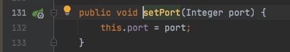
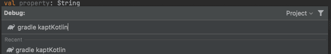
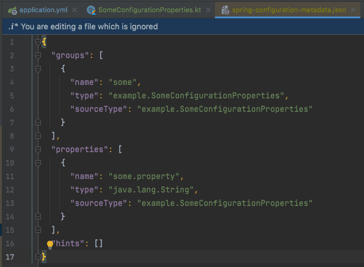
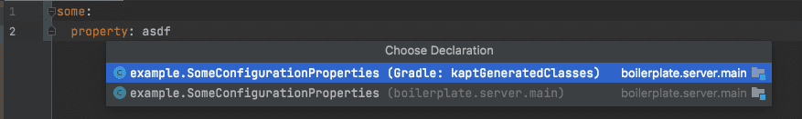

## Configuration Metadata
[https://docs.spring.io/spring-boot/docs/current/reference/html/configuration-metadata.html](https://docs.spring.io/spring-boot/docs/current/reference/html/configuration-metadata.html)
> Spring Boot jars include metadata files that provide details of all supported configuration properties.
> The files are designed to let IDE developers offer contextual help and “code completion” as users are working with `application.properties` or `application.yml` files.

Configuration Metadata는 IDE에서 yml 혹은 properties에서 사용하는 Configuration의 자동완성을 도와주는 메타데이터이다. (소스코드에는 영향을 1도 안 미친다.)



)

## 커스텀 Configuration Metadata 정의


## 자동으로 Configuration Metadata 생성하기 (spring-boot-configuration-processor)
[https://docs.spring.io/spring-boot/docs/current/reference/html/configuration-metadata.html#configuration-metadata.annotation-processor](https://docs.spring.io/spring-boot/docs/current/reference/html/configuration-metadata.html#configuration-metadata.annotation-processor)

> You can easily generate your own configuration metadata file from items annotated with `@ConfigurationProperties` by using the `spring-boot-configuration-processor` jar.
> The jar includes a Java annotation processor which is invoked as your project is compiled.

@ConfigurationProperties 어노테이션이 붙은 클래스에 대한 Configuration Metadata File은 spring-boot-configuration-processor를 통해 생성할 수 있다고 한다.

build.gradle.kts에 [kapt](https://kotlinlang.org/docs/kapt.html) 플러그인을 활성화시켜준다. (코틀린 컴파일러로 컴파일하기 때문에 자바로 작성한 어노테이션을 해석하지 못하기 때문)
```kotlin
kotlin("kapt") version "1.6.0"
```

build.gradle.kts에 아래 디펜던시들을 추가해준다. (멀티 모듈인 경우 모든 모듈에 일일이 추가하는 게 귀찮으니 루트의 build.gradle.kts에 추가해주는 것이 좋다.)
```kotlin
annotationProcessor("org.springframework.boot:spring-boot-configuration-processor")
kapt("org.springframework.boot:spring-boot-configuration-processor")
```







다만 몇 가지 한계점이 있는데 아래와 같다.

1. @ConfigurationProperties에 대해서만 동작하기 때문에 @Value와 같이 단순하게 사용한 경우에는 해당 configuration에 대해서 metadata가 생성되지 않는다.
2. properties나 yml에 정의만 해놓고 @ConfigurationProperties 클래스를 생성하지 않은 경우에는 해당 configuration에 대해서 metadata가 생성되지 않는다.
3. properties나 yml의 위치하는 모듈과 @ConfigurationProperties 클래스가 위치하는 모듈이 다른 경우에는 해당 configuration에 대해서 metadata가 생성되지 않는다. 소스코드가 돌아가는데는 전혀 문제가 없지만 올바른 설계인지 고민을 한 번 해보는 것이 좋다.
