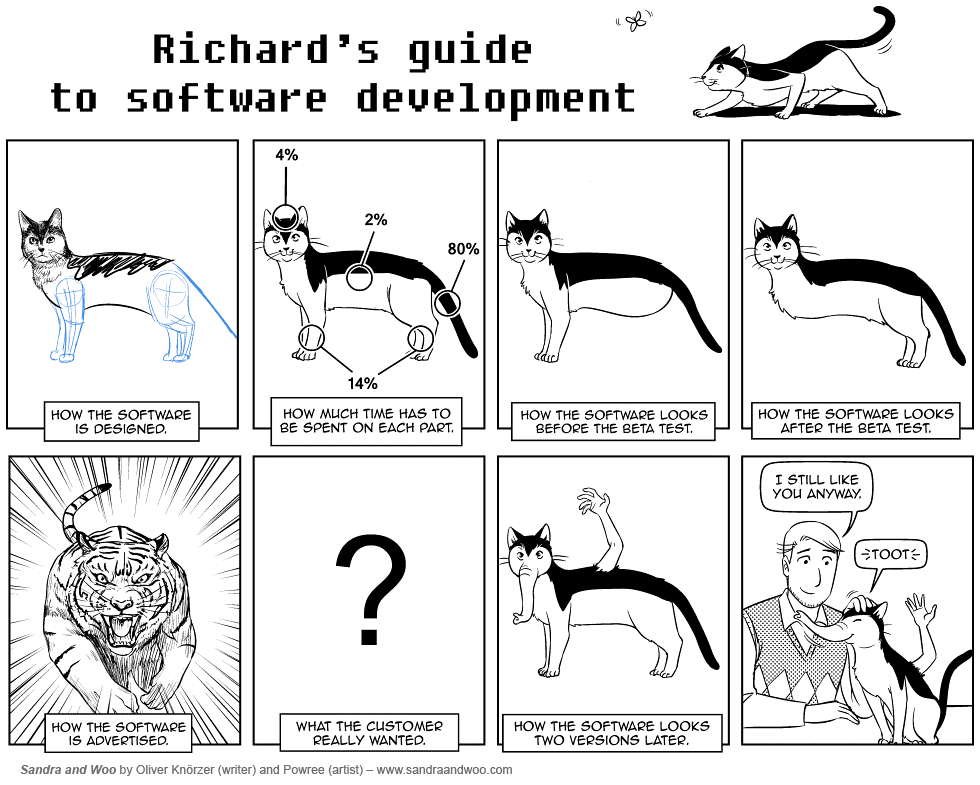
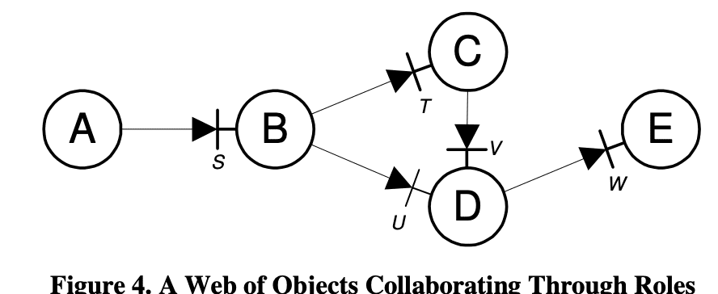

1~2년 전 쯤 존경하는 개발자 분과 함께 [A Brief History of Mock Objects](http://www.mockobjects.com/2009/09/brief-history-of-mock-objects.html)라는 아티클을 함께 본 적이 있다.  
개인적으로 이렇게 특정 개념의 근본이 된다던지, 해당 분야의 대가들이 쓴 아티클들을 함께 보는 것으로 인해 굉장히 많은 인사이트들이 생겼던 것 같다.
객체의 테스트 때문에 추가했던 getter로부터의 해방을 위해 고민하던 것으로 시작한 게 Mock의 탄생이라는 사실을 알게 되었을 때는 정말 위대한 탄생이라고 생각했다.  

그리고 문득 시간이 지나 해당 아티클을 다시 보고 싶어졌다. (물론 해당 아티클은 [테스트 주도 개발로 배우는 객체 지향 설계와 실천](https://www.yes24.com/Product/Goods/9008455) 책의 후기에 한글로 적혀있다.)
아티클을 보던 중에 후반 부분에 Mock과 관련해서 [Mock Roles, not Objects](http://jmock.org/oopsla2004.pdf)라는 논문까지 썼다는 걸 보고 해당 논문까지 봐야 Mock에 대해 정확한 이해를 할 수 있을 것 같아 해당 논문을 보게 되었다.
그리고 목의 역사와 마찬가지로 해당 논문도 너무나 감명이 깊어 한 번 느낀점이나 내용을 정리해보고 싶었다.

## Writing tests is a design activity
먼저 TDD(Test Driven Development)에는 크게 두 가지 관점이 존재할 것 같다.  

첫 번째로 "검증"이다.  
코드들이 의도대로 동작하는지, 버그는 없는지 검증하는 것이다.  
이를 통해 프로덕션에 코드를 내보내도 된다는 자신감이 올라가고, 리팩토링을 하거나 신규 기능을 추가하더라도 코드의 동작은 변하지 않았음에 확신을 가질 수 있다.  

두 번째로 "설계"이다.
나의 코드를 검증하려고 테스트를 짜려고 하는데 테스트를 짜기가 힘들다면 "Code Smell"이 난다고 할 수 있다. (코드에 뭔가 구린 내가 나는 것이다.)  
이를 통해 적절한 책임을 가진 객체로 쪼갬으로 인해 더 나은 설계로 유도해낼 수 있을 것이다.

나는 첫 번째 목적인 검증에 좀 더 집중했다.  
더 나은 설계도 물론 중요하지만 일단 버그가 없는 게 "1순위"라고 생각했기 때문이다.  
하지만 그러다보니 TDD를 하려고 할 때, 즉 신규 기능을 구현할 때 테스트를 먼저 짜려고 할 때 어디서부터 코드를 짜야할지, 뭘 테스트해야할지 막막했다.  
아직 검증할 게 없는데 뭘 검증한단 말인가?  
그래서 번번이 테스트부터 짜보겠다는 실패로 돌아가고, 코드를 짠 후에 내가 코드를 제대로 짰는지 검증하는 목적으로 테스트를 나중에 작성했다.  

나의 이런 TDD는 접근 방법부터 잘못됐던 것 같다.  
Test "Driven" Development면 테스트가 (나의 어플리케이션 코드를) 주도해야하는데 전혀 주도하고 있지 못했다.  
자꾸 나의 어플리케이션 코드를 테스트에 끼워맞출 생각(어떻게 이 부분을 검증할까)만 하고 있다보니 단순히 "테스트만 먼저 짜면 TDD다"라고 생각했던 것 같다.
물론 "검증" 또한 포기할 수 없는 부분이다.  
하지만 여기에 너무 매몰되다보니 결국 테스트가 나의 코드를 주도하게 하지 못하게 됐던 것 같다.  

그러다보니 이렇게 논문까지 쓰고 TDD의 대가라고 부를 법한 사람들은 무슨 생각을 가지고 실제로 TDD를 어떻게 수행하는지 너무나 궁금했다.
논문을 보니 내가 생각했던 관점과 완전 다른 관점을 가지고 있었다. 

> Writing tests is a design activity,
> ...
> This changes design from a process of **_invention_**,
> where the developer thinks hard about what a unit of code should do and then implements it,
> to a process of **_discovery_**, 
> where the developer adds small increments of functionality and then extracts structure from the working code.
> ...
> Using TDD has many benefits but the most relevant is that 
> it directs the programmer to think about the design of code from its intended use,
> rather than from its implementation.

테스트를 작성하는 것은 Design Activity(설계 행위)이며, 
Design Activity는 design(코드의 설계)을 발명(invention)의 과정(어떤 코드가 무엇을 해야하고 어떻게 구현해야할지)에서 발견(discovery)의 과정(조그만 기능을 추가하고 동작하는 코드로부터 구조를 추출하는)으로 바꾼다고 설명하고 있다.  
번역이 매끄럽지는 않지만 대충 어떤 뉘앙스인지 생각해보면 발명이라는 건 어떤 걸 만들어야겠다는 명확한 목표를 가지고 있는 것이고, 발견이라는 것은 명확한 목표를 가지고 있기 보다는 추상적인 무언가를 떠오르고 탐색하던 과정 중에 튀어나오는 것이 아닐까 싶다.  
따라서 전자의 관점으로 설계를 하게 되면 어떤 일을 어떻게 해야하는 객체들이 명확하게 정의돼있다보니 설계가 매우 딱딱하게 강결합이 될 것이다.  
이는 코드의 구조를 바꾸기 어렵다는 것을 뜻하며 구체적인 타입으로 확정짓는 것을 뜻하는 것 같다.
하지만 후자의 관점으로 설계를 하게 되면 무엇을 만들긴 해야하는데 아직 어떻게 해야하는지 명확하게 정의된 게 없다보니 두루뭉실하게 "이런 객체가 필요하지 않을까?"라는 작은 발견의 과정(작은 기능의 추가)을 반복해서 수행해나가다보니 설계가 유연하게 약결합 될 것이다.  
이는 코드의 구조를 바꾸기 쉽다는 것을 뜻하며 추상적인 타입(인터페이스)를 사용한다는 것을 뜻하는 것 같다.  

그리고 TDD에는 많은 이점들이 존재하지만 가장 중요한 건 개발자의 사고를 (구체적인) 구현이 아니라 코드의 설계에 대해 생각하도록 "지시"한다는 것이라고 한다.
이러한 지시를 통해 내 코드가 테스트에 의해 "주도"되는 것이 아닐까 싶다.  
즉, 테스트가 내 코드를 주도하려면(테스트에 의한 개발이 되려면) 이러한 지시를 따라야하고, 이는 검증이 아닌 "설계"를 테스트의 주된 목적이라고 생각해야 달성 가능한 목표같다.

## Need-Driven Development
그럼 TDD가 Design Activity라는 것은 알았는데 어떻게 더 나은 설계를 만들 것인가...?  
나는 그 답은 Need-Driven Development(Top-Down Development)를 통해 달성할 수 있다고 믿는다.  

> A core principle of Lean Development is that value should be pulled into existence from demand,
> rather than pushed from implementation: 
> “The effect of ‘pull’ is that production is not based on forecast; 
> commitment is delayed until demand is present to indicate what the customer really wants.”

영어를 잘 하지 못해 뉘앙스를 정확히 이해한 건지는 모르겠지만, Lean Development(개발 프로세스에서 비효율 적인 부분을 제거한 방법론 정도로 알고 있다.)의 핵심 원칙은 존재하는 요구사항(existence from demand)에서 가치를 뽑아와야한다(be pulled)는 것 같다.
예측에 의해 뭔가를 만들어내기 보다는 "고객이 정말로 원하는 것"이 실제로 나타낼 때까지 commitment(뭔가를 확정짓는...?)를 계속 뒤로 미루라는 것 같다.  
고객도 자신이 무엇을 원하는지 정확히 모르기 때문에 요구사항이 명확해질 때까지 계속 요구사항을 명쾌하게 만들어나가는 과정이 필요한 것 같다.

"혹시 이런 기능도 필요하지 않을까?"라고 생각하다 보면 위와 같은 형태의 소프트웨어가 나오게 될 가능성이 높을 것이다.

결국 "정말 필요한 기능"만 개발하라는 것인데 어떻게 해야하는 것일까...??
> By testing an object in isolation,
> the programmer is forced to consider an object’s interactions with its collaborators in the abstract,
> possibly before those collaborators exist. 
> TDD with Mock Objects guides interface design by the services that an object requires,
> not just those it provides.
> This process results in a system of narrow interfaces each of which defines a role in an interaction between objects,
> rather than wide interfaces that describe all the features provided by a class. 
> We call this approach Need-Driven Development.

단위 테스트에서 개발자는 객체와 협력객체 사이의 상호작용을 신경쓰도록 강요된다.  
그것또한 추상적인 레벨에서 이루어지는데 왜냐하면 협력 객체들은 아직 존재도 하기 전이기 때문이다.  
왜냐하면 TDD에 의해 테스트를 먼저 작성하고, Need-Driven Development에 의해 불필요한 객체는 아직 생성도 하기 전이기 때문이다.  
이 시점에서 협력 객체는 커녕 아직 테스트하고자 하는 객체도 만들어지기 이전이다.  
Mock Object로 TDD를 하는 건 단순히 객체가 제공하는 것 뿐만이 아니라 해당 객체가 필요로 하는 요구사항에 의해 인터페이스 설계를 가이드 한다.  
이런 과정을 통해 narrow 인터페이스를 가진 시스템이 나오게 된다.  
여기서 narrow한 인터페이스란 건 객체 사이의 상호작용에서 특정 역할만 수행한다는 것을 의미한다는 것 같다.  
반면에 wide한 인터페이스는 여기저기서 사용할 수 있는 걸 뜻하며 하는 일이 굉장히 많은 객체를 뜻하는 것 같다.  
이런 접근법을 Need-Driven Devlopment라고 부른다는데 좀 더 자세한 예시는 아래 나오게 된다.

> To fulfil the needs of A, we discover that it needs a service S. 
> While testing A, we mock the responsibilities of S without defining a concrete implementation.

A의 요구사항을 만족시키기 위해 S라는 서비스가 필요하다는 걸 발견(discovery)하게 된다.  
이 때 S의 구체적인 구현을 정의하는 것이 아니라 해당 책임을 모킹한다.

> Once we have implemented A to satisfy its requirements we can switch focus and implement an object that performs the role of S
> ...
> This process will then discover services required by B, 
> which we again mock out until we have finished our implementation of B

A의 요구사항 구현이 모두 끝났으면 이제 S의 "역할"을 수행하는 객체를 구현하는 것에 집중할 수 있다.  
이제 B(S의 역할을 수행하는)가 필요로하는 서비스를 발견하는 절차들이 진행된다.  
그리고 B의 구현이 끝날 때까지 그런 서비스들은 모킹하게 된다.

> Our experience is that systems we produce this way tend towards very flat class hierarchies. 
> This avoids well-known problems, such as the Fragile Base Class, 
> which make systems harder to understand and modify.

이런 식으로 필요한 객체와 역할들을 발견(탐색)해 나가는 과정에서 매우 flat한 클래스 계층이 나온다고 한다.  
이는 깨지기 쉬운(Fragile) Base Class 문제를 피할 수도 있다.  
많은 클래스들이 해당 클래스에 의존하는 구조가 아니라 인접한 객체끼리만 관계를 맺고 있기 때문이 아닐까 싶다.  
또한 상속이 아닌 인터페이스를 사용하고 있기 때문에 인터페이스가 바뀌지 않는 한 부모 객체에 영향을 받지 않는 것도 한 몫 하는 것 같다. (자바8의 인터페이스는 부모 인터페이스에 기본 구현체(default method)가 존재할 수 있긴 하지만...)  

> This process is similar to traditional Top-Down Development,
> in which the programmer starts at the highest level of abstraction and proceeds, layer by layer, to fill in the detail. 
> The intention is that each layer of code is written in a coherent terminology, 
> defined in terms of the next level of abstraction

Need-Driven Development는 전통적인 Top-Down Development와도 유사한데
Top-Down Development에서는 가장 높은 레벨의 추상화에서 시작해서 구체적인 내용을 구현하기 위해 계층 별로 접근하게 된다.
각 계층의 코드는 다음 단계의 추상화에 정의된 "일관된 용어"로 작성된다.
핵심은 "일관된 용어로 정의된다"는 것에 있는 것 같다.  
이는 일관된 추상화 수준을 뜻하는 게 아닐까?

> Programming from the Bottom-Up has different risks. 
> All the authors have had the experience of developing a supporting class in isolation, 
> as part of a larger task, 
> only to find that the result was not right because we had misunderstood something.

반면 Bottom-up으로 프로그래밍 하는 건 다른 리스크를 가지고 있다. (논문에서 Top-Down은 각 레이어에서 중복을 야기한다는 리스크를 명시하고 있다.)  
독립된 환경에서 개발해봤는데 뭔가 잘못 이해하고 개발한 게 있어서 결과가 올바르지 않은 걸 발견했다는 것이다.  
아마 이게 필요하지 않을까? 나는 이거까지 책임져야하지 않을까? 하고 예측을 기반으로 각자 개발을 하다보니 나중에 객체 간의 협력을 해야할 때 뭔가 미묘하게 안 맞는 부분이 계속 생겼던 게 아닐까 싶다.

[Need-Driven Development](https://www.nomachetejuggling.com/2012/08/10/need-driven-development/)이라는 아티클을 보면 Need-Driven Development(Top-Down)과 Bottom-up의 차이가 좀 더 명확히 느껴질 것이다.

## 결론
TDD는 단순히 테스트를 "먼저" 작성하는 게 아니라 테스트가 내 코드를 "주도"하게 만들어야하는 것 같다.  
그럼 좀 더 테스트가 막강한 권력을 가지고 테스트가 내 코드를 어떠한 길로 인도(guide)해야하는 것 같다.  
좀 더 강하게는 강제(force)하거나 지시(direct)를 내려야하는 것 같다.  
나는 멍청하고 테스트가 내 코드가 어떻게 구현해야하는지 명령을 내리는 것이다.

그런 관점에서 보면 단순 "검증"만으로는 뭔가 부족했던 것 같다.  
그걸 모르고 계속 TDD 거리니 매번 실패 했던 게 아닐까 싶다.

해당 논문을 읽고 나니 "Design Activity"가 무엇인지, 요구사항이 왜 중요한 것인지 좀 더 알게 된 거 같다.
