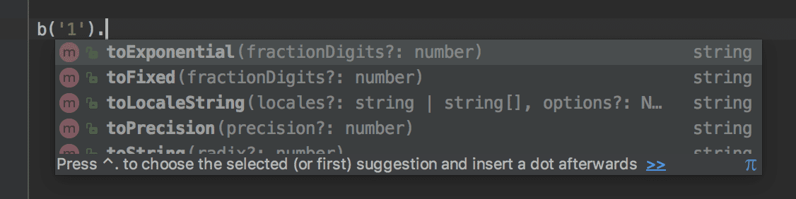
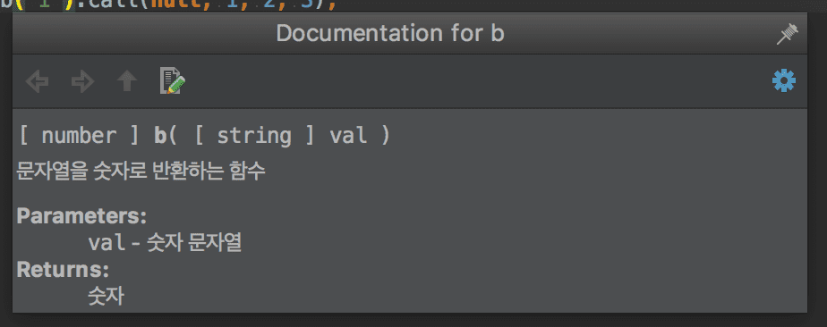
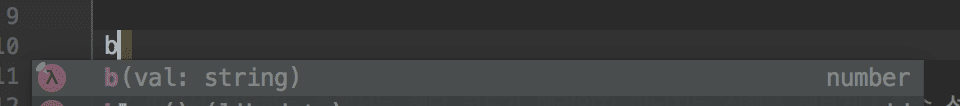
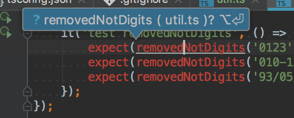
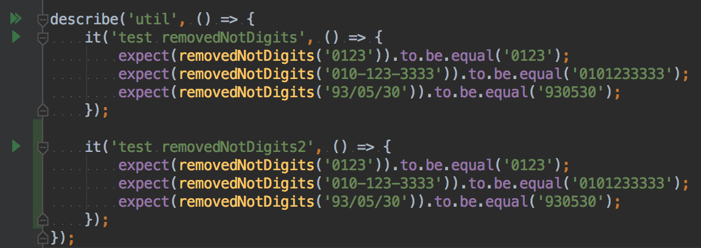

  

이 글은 [rollup.js를 통해 모듈 번들링하기](/2017/12/10/bundle-with-rollup), [travis-ci와 coveralls를 이용하여 좀 더 안전하게 협업하기](/2017/12/10/travis-ci-coveralls)을 읽기 전에 읽어야할 포스트이며    
여러 주제를 다루다보니 깊게 다루지는 않고 각각이 무엇을 하는 것인지만 간단하게 설명과 예제를 곁들여 진행하고 있습니다.  
또한 예제 진행은 [IntelliJ](https://www.jetbrains.com/idea/)를 통해 진행했습니다.  
[WebStorm](https://www.jetbrains.com/webstorm/)으로 진행해도 상관 없고, [VS Code](https://code.visualstudio.com/)와 진행하면 더 짱짱맨일지도 모르겠습니다.  

각 단계 별 깃헙 저장소 브랜치를 제공하고 있고, 이 포스트의 최종 결과물은 [nyc 브랜치](https://github.com/perfectacle/front-test-setting/tree/nyc)에서 확인 가능합니다.

## [Typescript](https://www.typescriptlang.org/)?
[ts 브랜치](https://github.com/perfectacle/front-test-setting/tree/ts)에 예제 파일이 올라가있습니다.  

기존 자바스크립트는 동적 타입이다.  
```javascript
// 변수 a에는 어떠한 값이든 들어갈 수 있다.
let a = 1;
a = '1';
a = {};

// 함수의 매개변수에 뭐가 들어가야할지, 리턴 타입은 무엇인지 함수 선언부를 가지 않는 이상은 알아차리기 힘들다.
const b = val => +val;

// 따라서 사용하는 측에서는 해당 코드가 에러인지 아닌지는 실행을 해보거나 함수 선언부를 보지 않는 이상은 힘들다.
b('1').call(null, 1, 2, 3); // Uncaught TypeError: b(...).call is not a function
```

하지만 정적 타입인 타입스크립트에서는 위의 코드를 아래와 같이 런타임 전인 컴파일 에러로 체크해주기 때문에  
아예 실행 조차 되지 않는 다는 것을 알려주기 때문에 좀 더 안전하게 코드를 작성할 수 있다.  


### Why Typescript?
기존에 자바스크립트와 같이 동적 타입이 가지는 문제점을 위에서 지적하긴 했지만 그래도 왜 써야하는지 납득이 잘 가지 않는 경우를 대비해 간단하게 나마 비교를 해보았다.
  
이는 위에서 설명한 바와 같이 직접 함수 선언부를 찾아가야한다는 단점이 있다.  

  
타입 추론은 맥 OS 기준 커맨드+P 키를 누르면 볼 수 있다.

  
이 메소드가 반환하는 게 무슨 타입인지 모르기 때문에 또 직접 함수 선언부를 봐야한다.  

물론 아예 방법이 없는 것은 아니고 [jsdoc](http://usejsdoc.org/)을 이용하면 된다.  
```javascript
/**
 * 문자열을 숫자로 반환하는 함수
 * @param val{string} 숫자 문자열
 * @return {number} 숫자
 */
const b = val => [val];
```

위처럼 return 타입에 number를 명시해놓고 배열을 리턴하게 짠 코드를 막지는 못한다.  

  

  

  

  
맥 OS 기준 컨트롤+J 키를 누르면 doc을 볼 수 있다.  

  
위 사진이 전적으로 왜 타입스크립트를 써야하는지 설명하고 있다.  
내가 아무리 함수마다 일일이 jsdoc 다느라 뻘짓을 했어도 사용자 측에서 다 무시하고 마이웨이로 코딩하면 런타임 에러로 뻗는다.  
아예 저런 코드는 실행 자체를 하게 하면 안 되는데 나 조차도 저렇게 코딩을 할지도 모르는 상황이고,  
오픈소스나 실무에서 협업을 하다보면 저런 현상은 빈번하게 겪게 된다.  
내가 일일이 다 확인하고 코드리뷰 할 수도 없는 노릇이고 일을 좀 더 효율적으로 하기 위해서 이런 노력을 줄여야한다.  

그럼 타입스크립트는 어떤지 비교해보자.

  

  

  

  
어쨋든 ts를 다이렉트로 실행하지 못하기 때문에 js 파일로 컴파일 해야하는데 저런 코드는 컴파일 오류로 아예 js 파일로 컴파일 자체가 되질 않는다.  
따라서 아예 실행 조차 불가능한 코드가 되어버린다.  

여기까지 봤을 때 js는 jsdoc을 일일이 달아줘야하고, 사용자의 인지적인 노력이 필요한데 ts는 그런 귀찮음이 전혀 사라지게 되는 것이다.  
물론 이 외에도 ts가 지원하는 기능들은 무궁무진하다. (ES2015+의 슈퍼셋 격이니...)

### Install
그럼 직접 설치해보고 사용해볼 시간이다.  
```bash
npm init --y
npm i -S typescript
```
위와 package.json을 만들고 타입스크립트를 설정하면 인텔리제이가 알아서 타입스크립트 신택스를 지원해준다.  


ts 컴파일러도 [자세한 설정](https://www.typescriptlang.org/docs/handbook/tsconfig-json.html)이 가능한데 글의 범주를 넘어서므로 tsconfig.json을 프로젝트 루트 디렉토리에 아래와 같이 만들었다.  
```json
{
  "compilerOptions": {
    "outDir": "./dist/",
    "sourceMap": true,
    "strictNullChecks": true,
    "module": "umd",
    "moduleResolution": "node",
    "target": "es5",
    "allowJs": false
  },
  "include": [
    "./src/"
  ]
}
```

## TSLint
[tslint 브랜치](https://github.com/perfectacle/front-test-setting/tree/tslint)에 예제 파일이 올라가있습니다.

협업을 하게 되다보면 서로 코딩 스타일이 다르다.  
누가 맞고, 틀렸다는 게 아니라 서로 협업을 하는 입장에서는 코딩 컨벤션을 만들고 준수해야 가독성이나 남이 짠 코드에 대한 이해도도 분명히 높아지게 된다.  
누구는 문자열을 쓰는데 싱글 쿼테이션 쓰고, 누구는 더블 쿼테이션 쓰고, 누구는 들여쓰기를 탭으로 하고, 누구는 스페이스바 2칸으로 하고 그러다보면  
서로 협업한 코드는 엉망진창이 되고, 파일 별로도 중구난방인 코드가 될 것이다.

### Install
그럼 직접 설치해보고 사용해볼 시간이다.  
```bash
npm i -S tslint
```

tslint도 자세한 설정이 가능하고, 아래는 간단한 설정을 만들어 본 것이다.  
```json
{
  "defaultSeverity": "error",
  "extends": [
    "tslint:recommended"
  ],
  "jsRules": {},
  "rules": {
    "quotemark": [true, "single"],
    "indent": [true, "spaces", 2],
    "curly": [true, "ignore-same-line"],
    "whitespace": [true, "check-operator"],
    "no-trailing-whitespace": [true, "ignore-blank-lines"],
    "max-line-length": [true, 150],
    "trailing-comma": [true, {"multiline": "never", "singleline": "never"}],
    "ordered-imports": false,
    "no-unused-expression": false,
    "no-unused-variable": true,
    "no-console": false
  }
}
```

  


## Test Code
[mocha-chai 브랜치](https://github.com/perfectacle/front-test-setting/tree/mocha-chai)에 예제 파일이 올라가있습니다.

테스트 코드를 왜 짜야하는지는 구글링을 하면 쉽게 찾을 수 있는데 간단하게 내가 생각한 내용을 정리해봤다.  

* 코드에 대한 신뢰도가 높아진다.  
내가 기존 코드를 수정해도 미리 작성해놓은 테스트 코드가 잘 작동한다면 안심하고 코드를 짤 수 있다.  
나 혼자 짜면 못 느낄텐데 협업을 하게 되다보면 내 코드 남이 깔아뭉개 놔서 테스트가 실패하는 경우가 빈번해서 사전에 오류를 잡을 수 있는데  
테스트 코드가 없다면 기존에 내가 짜놓은 로직이 제대로 잘 작동한다는 보장이 없어지게 된다.  
* 테스트 해야할 포인트가 줄어든다.  
테스트를 돌려보고 어떤 테스트가 실패했는지 해당 테스트 코드의 구현부만 다시 손보면 된다.  
테스트 코드가 없다면 어디서부터 손을 봐야할지 난감한 상황이 많을텐데 이를 방지해준다.  

물론 이 외에도 수두룩 빽빽한데 나는 아직 테스트 코드 짜는데 늅늅이니 이정도로... ㅠㅠ

테스트 코드를 짜는데도 테스트를 먼저 작성하고 코드를 후에 구현하는 TDD나  
ajax를 타야하는 테스트, DB를 거쳐야하는 테스트를 위한 Mocking이나  
UI 단을 위한 E2E 테스트 등등 많은데 우선 여기서는 간단하게 함수 단위의 유닛 테스트만 만들어보겠다.

### [Mocha](https://mochajs.org/)  
mocha는 자바스크립트 코드를 테스트 해주는 도구이다.  
유사 도구로 [Jasmine](https://jasmine.github.io/)도 있다.  
바로 설치를 해보자.  
```bash
npm i -S mocha @types/mocha
```
@types/mocha는 mocha에 대한 타입 정의를 해놓은 것이다.  
ts 코드 내에서 모카를 쓰려면 모카에 대한 타입 정의가 있어야 오류 없이 사용 가능하다.  
그리고 mocha를 쓰기 전에 Chai에 대해서도 알아보고 같이 쓰자.

### [Chai](http://chaijs.com/)
mocha를 바로 사용해도 되지만, mocha를 다양한 [Assertion 라이브러리](https://mochajs.org/#assertions)들과 사용하면 좀 더 테스트 코드의 가독성이 올라간다.  
물론 우리나라 문법이나 정서(?)하고는 맞지 않아 보이기도 하지만 영미권 문법으로 이해하기가 한층 수월해져서 많이 쓰이는 것 같다.  
그 중에 Chai라는 Assertion 라이브러리는 여러 스타일(should, expect, assert)의 Assertion을 지원해주는 라이브러리이다.  
바로 설치해서 간단한 사용 방법을 알아보자.  

```bash
npm i -S chai @types/chai
```

그리고 프로젝트에 src 디렉토리를 만들고 그 안에 util.ts를 만들어서 아래와 같이 코딩해주자.  
mocha의 디폴트 테스트 디렉토리가 test이고, spec은 자바스크립트 테스트 코드 파일 이름의 컨벤션 같다.  
```bash
mkdir src
touch src/util.ts
```

```typescript
// 숫자를 제외한 문자들을 지워주는 함수이다.
export const removedNotDigits = (numberContainsNotDigits: string): string => {
    return numberContainsNotDigits.replace(/[^\d]/g, '');
};
```

그리고 test 디렉토리를 만들고, util.spec.ts 라는 util 파일의 테스트 코드를 만들어주자.  
```bash
mkdir test
touch test/util.spec.ts
```

```typescript
describe('util', () => {
    it('test removedNotDigits', () => {
        expect(removedNotDigits('0123')).to.be.equal('0123');
        expect(removedNotDigits('010-123-3333')).to.be.equal('0101233333');
        expect(removedNotDigits('93/05/30')).to.be.equal('930530');
    });
});
```

그럼 막 빨간줄이 쫙쫙 갈 것이다.  
여기서 갓텔리제이의 진가를 발휘할 시간이다.  

  

  
그럼 util.ts의 removedNotDigits 함수가 제대로 임포트 된다.  

  

그리고 test 디렉토리 안에 모카 설정 파일인 mocha.opts 파일을 만들어서 아래와 같이 테스트 코드의 디렉토리를 설정해주자.  
```bash
touch test/mocha.opts
```

```opts
--recursive
test/**/*.spec.ts
```

그리고 package.json에서 test 스크립트를 다음과 같이 바꿔주면 된다.  
```json
{
  "scripts": {
    "test": "mocha"
  }
}
```

이제 터미널에서 다음 명령어를 실행하면 테스트 코드를 실행할 수 있다!  
```bash
npm test
```

그럼 아래와 같은 오류를 마주하게 될 것이다.  
```bash
(function (exports, require, module, __filename, __dirname) { import {removedNotDigits} from '../src/util';
...
```

### ts-node
[ts-node 브랜치](https://github.com/perfectacle/front-test-setting/tree/ts-node)에 예제 파일이 올라가있습니다.

Node.js는 javascript 런타임이지, Typescript 런타임이 아니다.  
따라서 Typescript 런타임인 ts-node를 설치해야한다.  

```bash
npm i -S ts-node
```

그리고 mocha.opts 파일에서 아래 한 줄을 추가해줘야한다.  
`--require ts-node/register`  

  
  

## Test Coverage
[nyc 브랜치](https://github.com/perfectacle/front-test-setting/tree/nyc)에 예제 파일이 올라가있습니다.

테스트 커버리지란 내 테스트 코드로 내가 만든 소스들을 얼마나 커버하고 있는지 를 나타내는 지표이다.  
테스트 커버리지가 100%면 모든 코드에 대한 테스트 코드가 작성해도 됐다고 보면 무방하다.  
100%가 되면 좋겠지만 나도 아직 테스트 코드 늅늅이라 어느 정도가 적당한 커버리지인지는 모르겠다.  

### [Istanbul](https://istanbul.js.org/)
Istanbul은 자바스크립트의 테스트 커버리지 도구이다.  
하지만 여기서는 Istanbul을 사용하지 않을 것이다.

### [NYC](https://github.com/istanbuljs/nyc)  
NYC는 Istanbul의 CLI이다.  
New York City의 줄임말이라는데 참 지명을 좋아한다.  
나중에 Seoul.js도 나왔으면 ㅎㅎㅎ...

여튼 NYC x Mocha를 하면 테스트 커버리지를 자동으로 측정할 수 있다.  
바로 설치해보자.

```bash
npm i -S nyc
```

그리고 .nycrc 파일을 만들어서 간단하게 세팅해보자.  
```bash
touch .nycrc
```

```json
{
    "require": [
        "ts-node/register"
    ],
    "include": [
        "src/**/*.ts"
    ],
    "extension": [
        ".ts"
    ],
    "exclude": [
        "**/*.d.ts"
    ],
    "reporter": [
        "text-summary",
        "html"
    ],
    "all": true
}
```

그리고 mocha.opts에서는 아래 설정을 제거해주자.
```
--require ts-node/register
```

그리고 package.json의 test 스크립트를 다음과 같이 수정해주자.  
```json
{
  "scripts": {
    "test": "nyc mocha"
  }
}
```

  

  

  

## 마치며...
저도 수박 겉핥기로 예제를 따라하며 정리해본 내용이고, 정리해야할 내용이 방대해서 좀 깊이없이 다뤄서 이 부분은 직접 찾아보셔야할 겁니다.  
이 글의 목적은 그런 것에 대한 디테일 한 설명이 아니라 이런 것도 있다~ 정도의 소개 정도니 자세한 것은 직접 찾아보시길 바랍니다.  
그리고 지금까지 진행항 내용만으로는 우리가 만든 ts 파일을 외부 사람들이 직접 사용하지 못하니
다음 시리즈인 [rollup.js를 통해 모듈 번들링하기](/2017/12/10/bundle-with-rollup)를 통해 실제 사람들이 쓸 수 있는 js 파일 형태로 만들어보도록 하겠습니다.
