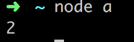
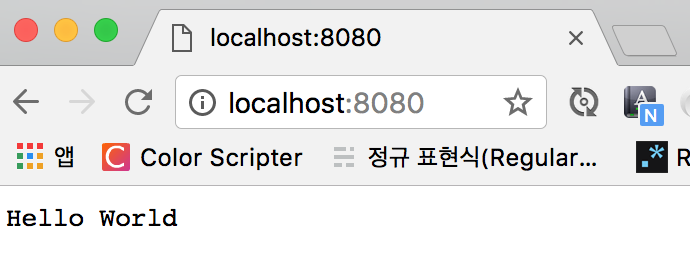
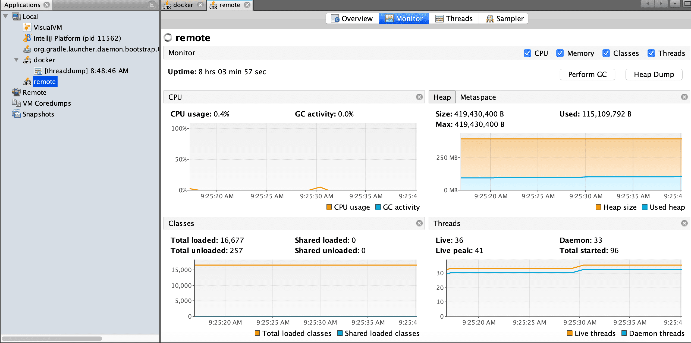
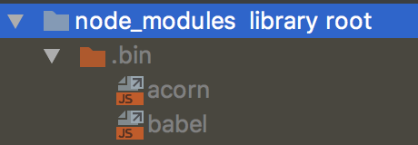
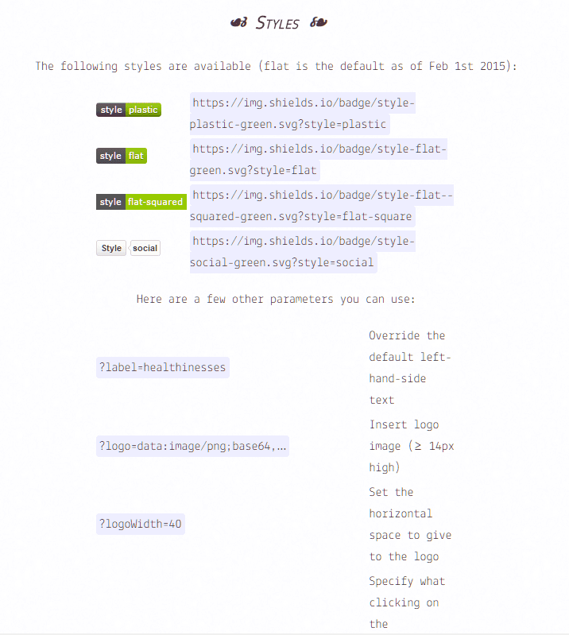
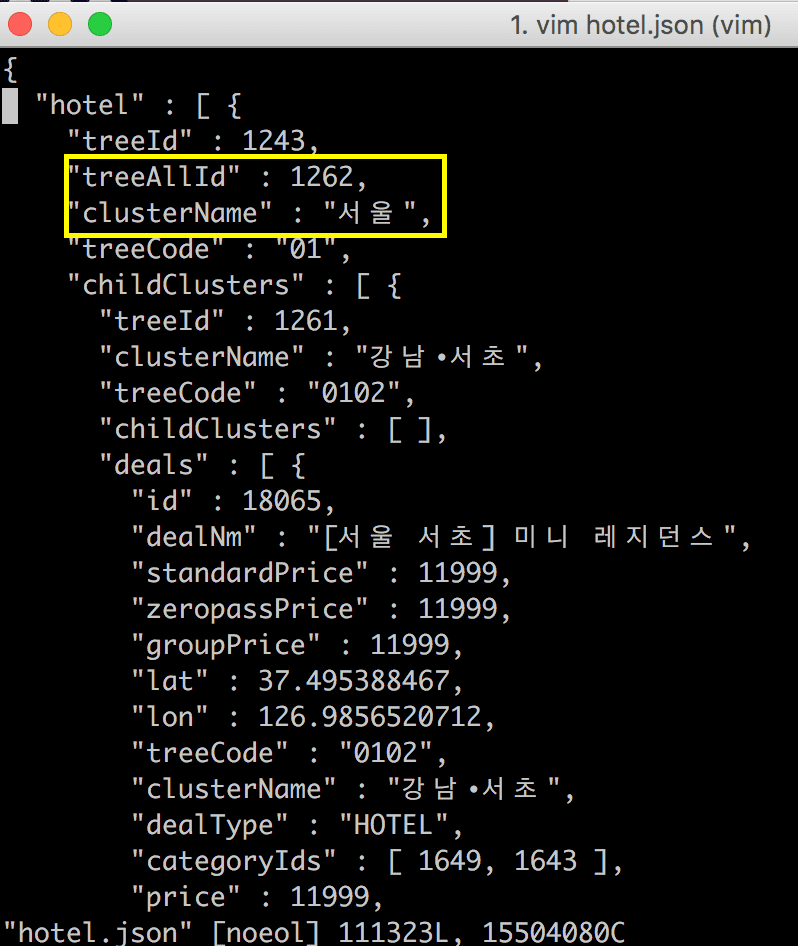
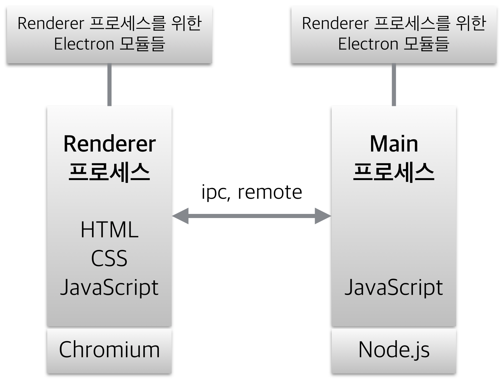

이 글을 쓰게 된 계기는 다음과 같다.  
> Q: Node.js는 서버인가요?  
A: 네, 백엔드 개발자들이 Node.js를 씁니다.  

'백엔드 개발자**도** 쓸 뿐, 프론트 엔드 개발자도 쓸 수 있다'가 내가 내린 결론이고,  
오늘은 그에 대해 하나 하나 검증해보는 시간을 가져보고, 다른 사람들에게 잘못된 지식이 전파되는 걸 막고자 한다.  
혹시 내가 내린 결론이 잘못된 부분은 무한 태클을 환영한다.  

# Node.js란...?
  
Node.js는 Chrome V8 Javascript 엔진으로 빌드된 Javascript **런타임**이다.  
V8 자바스크립트 엔진은 여기서 중요한 포인트가 아니므로 직접 찾아보길 바란다.    

[런타임에 대해 정리한 다른 블로그의 포스트](http://asfirstalways.tistory.com/99)를 빌려보자면 다음과 같다.
> 런타임이란 프로그래밍 언어가 구동되는 환경

예전에는 자바스크립트 런타임이 **브라우저** 밖에 존재하질 않았다.  
하지만 그러한 한계를 극복하고 Node.js가 나왔다.  

## Javascript 실행 환경?  
첫 번째로 Node.js는 REPL(Read, Eval, Print, Loop)을 통해서 런타임을 제공한다.  
1. Read: 유저의 입력 값을 받아서 메모리에 저장  
2. Eval: 입력 값의 평가, 실행  
3. Print: Eval로 인해 반환된 값을 출력  
4. Loop: 1~3을 반복.  

이러한 REPL은 [Babel REPL](https://babeljs.io/repl/)과 같이 웹에서 제공해주기도 하고,  
Node.js에서 제공하는 REPL은 윈도우의 CMD, 맥의 터미널 등등에서 제공을 해준다.  
  

두 번째로 따로 자바스크립트 파일을 Node.js에서 제공하는 자바스크립트 런타임을 통해 실행이 가능하다.    
위와 같이 REPL에서 개발을 하면 간단한 테스트 정도면 몰라도 어플리케이션을 개발하는 데 적합하지 않다.  
따라서 repl 보다는 따로 스크립트 파일을 만들어서 그 스크립트 파일을 node.js, V8이 해석 후 실행하는 형태로 작업을 많이 하게 된다.  
아래 소스 코드를 node.js에서 돌리는 것은 위의 REPL에서 실행한 것과 동일하다.
```javascript
// a.js
const a = 2;
a;
a + 4;
console.log(a);
```



## 그럼 왜 Node.js는 백엔드 영역이라는 오해가 생겼을까?
Node.js를 통해서 서버**도** 만들 수 있기 때문이다.  

```javascript
// server.js
const http = require('http');
http.createServer((req, res) => {
    res.writeHead(200, {'Content-Type': 'text/plain'});
    res.end("Hello World\n");
}).listen(8080);
```
  
  

## 그럼 프론트 엔드 개발자는 언제 Node.js를 쓰는가?  
매우 빈번하게 쓰이는데 그 중에서 대표적으로 ES2015+ 문법을 ES5 문법으로 트랜스파일 해주는 [Babel](/2016/11/11/Babel-ES6-with-IE8/)을 예로 들어보겠다.  
먼저 babel의 기본적인 요소들을 설치하겠다.  
```bash
npm i -S babel-cli babel-preset-env
```
babel-cli, CLI이기 때문에 터미널 위에서 돌아간다는 점을 염두해두자.  

그리고 간단한 바벨 설정 파일(.babelrc)을 만들어주자.
```json
{
  "presets": ["env"]
}
```


그 다음에 package.json의 npm script 부분을 다음과 같이 추가해주면 된다.  
```json
{
  "scripts": {
    "babel": "babel"
  }
}
```

그리고 ES2015+의 간단한 파일을 하나 만들어보겠다.  
```javascript
// a.js
const a = 1;
```

터미널에서 babel-cli를 통해 해당 파일을 ES5로 트랜스파일 된 결과를 보자.  
  

이게 뭐가 Node.js를 통해 실행한 내용인지 확인해보자.  
기본적으로 npm script는 node_modules 디렉토리 안의 .bin 디렉토리에 있는 디렉토리를 인식한다.  
  

그리고 그 내용은 다음과 같다.  
```javascript
#!/usr/bin/env node

require("../lib/babel");
```
`#!/usr/bin/env node` 요 구문으로 인해 node.js에서 cli를 만들 수 있게 해주는 것이라고 생각하면 된다.  
그럼 직접 `../lib/babel`을 찾아가보자.  

  
Node.js에서 기본적으로 디렉토리 뒤에 따로 파일이 명시되지 않으면 index.js 파일을 찾아가는 규칙이 있다.  
index.js 파일의 상단 부분을 보면 다음과 같다.  

```javascript
#!/usr/bin/env node
"use strict";

var _keys = require("babel-runtime/core-js/object/keys");

var _keys2 = _interopRequireDefault(_keys);

function _interopRequireDefault(obj) { return obj && obj.__esModule ? obj : { default: obj }; }

var fs = require("fs");
var commander = require("commander");
var kebabCase = require("lodash/kebabCase");
var options = require("babel-core").options;
var util = require("babel-core").util;
var uniq = require("lodash/uniq");
var glob = require("glob");

// 이하 생략
```
소스 코드 첫 라인에 `#!/usr/bin/env node`을 보면 CLI임을 짐작할 수 있다.  
그럼 다음과 같이도 실행을 해볼 수도 있다는 말이 된다.  

  

하지만 우리가 접근한 파일은 우리가 흔히 보고 있는 js 파일이다.  
Node.js는 자바스크립트를 실행해줄 수 있는 환경인 런타임을 제공해주기 때문에 다음과 같이도 할 수 있다.  
  

즉, 바벨을 쓴다면, 프론트 엔드 개발자도 Node.js를 쓴다는 결론을 내릴 수가 있다.  
바벨 뿐만 아니라 웹팩, 걸프, CRA, Vue-CLI 등등 npm으로 설치하는 모든 CLI는 Node.js를 이용한다고 보면 된다.  
그리고 npm(Node Package Manger)을 쓴다는 것 자체가 Node.js를 이용한다고 보면 된다.  

## 웹을 벗어난 Node.js
  
Node.js는 확장성 있는 **네트워크 애플리케이션**을 위해 설계했다고 나온다.  
네트워크 어플리케이션, 즉 서버, 서버를 위해서 설계된 플랫폼이다.  
따라서 Node.js로 실제 구현하는 내용도 서버가 많다는 것에는 동의한다.  
또한 많은 프론트 엔드 개발자들이 주로 노드를 이용하는 사례인  
npm으로 의존성 모듈 관리, 바벨, 웹팩과 같은 CLI를 Node.js 위에서 구동하는 경우  
이 경우에 
> 나 노드 할 줄 안다

라고 누군가에게 어필하기에는 다소 무리가 있을 수가 있다.  
왜냐면 노드로 서버를 구축하는 사례가 너무 많고, 이미 그런 오해가 정석처럼 받아들여지는 상황이라  
필드에 나가서 노드 할 줄 안다고 했을 때  
* 나 노드로 서버 만들 줄 안다.  
* 나 노드로 의존성 모듈 관리하고 CLI를 Node.js 위에서 돌릴 줄 알아.  
둘 중에 누구의 말로 받아들이는 경우가 더 많을까...  
이런 고민을 하다보니 그럼 웹이 아닌 경우에는 무엇이 있을까 고민하게 됐다.  

### 데스크탑 어플리케이션을 제작해주는 일렉트론(Electron)
  
맥, 윈도우 등등의 크로스 플랫폼 데스크탑 어플리케이션을 HTML, CSS, JS를 통해 만들 수 있다.  
자세히 몰라서 아래의 사진으로 대체하겠다.  
  
슬랙과 atom, vs code가 일렉트론으로 만들어졌다 하니 믿을만 하다고 할 수 있을 것 같다.  

## 결론
Node.js를 할 줄 안다고 하면 **Node.js로 서버를 구성할 줄 안다**라고 인식되는 것은 어느 정도 이해할 수 있다.  
하지만 Node.js 그 자체를 백엔드 자체만의 기술, 웹 서버 자체만으로 받아들이고  
프론트 엔드 개발자들은 Node.js를 쓸 줄 모른다는 그런 잘못된 지식으로 남들에게 더 이상 인식되지 않는 환경이 조성되길 바란다.  
명심하자.  
**Node.js는 백엔드, 웹 서버가 아니라 자바스크립트 실행 환경에 불과하다**

## 참조 링크
* [런타임이란?](http://asfirstalways.tistory.com/99)  
* [REPL 터미널](https://velopert.com/235)  
* [Electron으로 웹 앱 만들듯 데스크톱 앱 만들기](http://blog.dramancompany.com/2015/12/electron%EC%9C%BC%EB%A1%9C-%EC%9B%B9-%EC%95%B1-%EB%A7%8C%EB%93%A4%EB%93%AF-%EB%8D%B0%EC%8A%A4%ED%81%AC%ED%86%B1-%EC%95%B1-%EB%A7%8C%EB%93%A4%EA%B8%B0/)