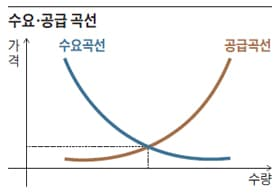
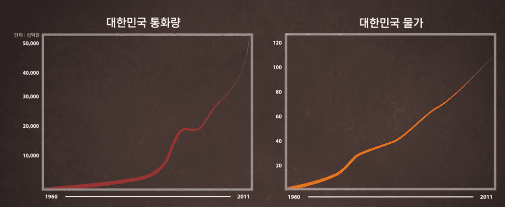

[EBS 다큐프라임 자본주의 제1부 돈은 빚이다](https://youtu.be/0LYMTsj_eqc)를 보고 나면 더 많은 인사이트를 얻을 수 있다.

## 물가는 왜 상승하는가? (feat. 인플레이션)

수요가 늘어나거나 공급이 줄어들면 가격이 올라간다.(공급 부족)  
예를 들면 참외 농사가 흉년이 일어나서 참외를 먹고 싶은 사람은 전과 같이 10명으로 고정적인데 참외의 갯수가 5개로 확 줄어들은 상황이거나,
어느날 참외가 암을 치료해준다는 소문이 돌아 참외는 100개가 있는데 참외를 사려는 사람이 1000명으로 늘어난 상황이다.

수요가 줄어들거나 공급이 늘어나면 가격은 줄어든다.(공급 과잉)  
예를 들면 참외 농사가 풍년이 나서 참외를 먹고 싶은 사람은 전과 같이 10명으로 고정적인데 참외의 갯수가 1000개로 확 늘어난 상황이거나,
어느날 참외를 먹으면 암에 걸린다는 소문이 돌아 참외는 100개가 있는데 참외를 사려는 사람이 1명으로 줄어들은 상황이다.

이렇게 특정 물건에 대해서 수요와 공급의 원칙에 의해 물가가 상승/하락하곤 한다.  
하지만 이건 특정 물건에만 국한되는 게 아니라 돈에도 적용되는 원칙이다.

돈의 공급이 늘어나는 방법에는 두 가지 방법이 있다.

1. 중앙은행에서는 화폐를 발행할 수 있다.  
돈을 찍어내는데 당연히 공급이 늘어날 것이다.
2. 일반 시중에 있는 은행들(중앙은행도 마찬가지)은 빚을 생성(대출로 인해)해서 그 이자로 인해 이익을 창출한다.  
은행은 대출해 줄 수록 이자를 많이 받을 수 있고, 그러면 그럴 수록 통화량은 증가한다.  
즉, 새로운 빚이 생성됨과 동시에 새로운 돈이 생성되는 것이다.

위와 같은 방법으로 인해 돈이 많아졌으니 돈에 대한 공급이 과잉 현상이 발생한다.  
즉, 돈의 가치가 하락한다.

돈의 가치가 하락했는데 참외의 수요/공급 상황은 동일하다고 해보자.  
그럼 더 많은 돈을 지불해야 참외 한 개를 살 수 있게 된다.  
이렇게 통화량의 증가로 인해 화폐가치가 하락하고, 물가가 오르는 경제 현상을 `인플레이션(통화팽창)`이라고 한다.

  
우리나라 경제를 보면 꾸준하게 통화량도 증가했고, 그와 비슷한 추세로 물가도 같이 상승했음을 알 수 있다.

## 중앙은행
중앙은행(우리나라의 중앙은행은 한국은행이다.)은 아래 권한들을 통해 통화량을 조절한다.

### 이자율 통제
이자율을 통제(올리고 내림)함으로써 어떻게 통화량을 조절할 수 있다는 걸까?

우선 경기가 안 좋다고 쳐보자.  
그럼 사람들의 지갑은 무거워 질 것이고, 더더욱 경기는 안 좋아질 것이다.  
이 때 사람들이 소비를 하게 끔 만드는 방법은 무엇일까?  
바로 통화량을 늘려 사람들이 돈을 더 많이 가지게 끔 하면 돈을 많이 쓰게 될 것이다.  
그러면 통화량을 늘려야하는데 이자율만 내려도 통화량은 자연스레 늘어난다.  
이자율이 내려가면 사람들은 싼 이자에 돈을 빌릴 수 있으니 더 대출을 많이 하게 된다.  
그럼 대출을 함으로써 새로운 돈이 생성되는 것이다. (통화량 증가)

반대로 경기가 좋다고 쳐보자.  
경기가 좋으니 사람들의 지갑은 빵빵할 것이고, 이자율이 조금 높아져도 지갑이 빵빵하니 어느정도 납득할 것이다.  
하지만 대부분의 사람들이 이자율이 높아지면 내야할 이자가 많기 때문에 전보다는 돈을 많이 빌리지 않게 된다.  
또한 이자율이 비싸졌으니 비싼 이자를 감당하기 힘들어서 하루 빨리 빚을 갚으려고 할 것이다.  
이럼으로써 빚은 적게 생성되거나 줄어들게 되다보니 통화량은 줄게 돼있다.

### 화폐 발행
말 그대로 돈을 찍어내는 것이다.  
이자율 통제는 통화량을 늘릴 수도, 줄일 수도 있지만 화폐 발행은 통화량을 줄일 순 없다.

또한 양적 완화(quntitative easing)라는 단어도 있는데 이 단어의 뜻은 `중앙은행이 화폐를 찍어 통화량을 늘림으로써 경기방어와 신용경색(금융기관에서 돈이 제대로 공급되지 않아 기업들이 어려움을 겪는 현상)을 해소하는 정책`이라고 한다.  
양적 완화는 이자율을 낮췄음에도 불구하고 경기가 회복되지 않는 등 효과가 없을 때 시행한다.

## 중앙은행은 왜 화폐를 발행할까?
우선 `경기가 안 좋아서 시중에 돈을 많이 풀려고`라고 생각할 수 있다.  
하지만 이것보다 더 근본적인 무서운 이유가 존재한다.  
그것은 `대출에는 이자 시스템이 존재하는데, 대출받은 돈 자체가 이자를 발생시키지 않기 때문`이다.

1. 중앙은행에서 여태까지 화폐를 100원만 발행했다고 쳐보자.  
(통화량 100원)
2. 100원을 A라는 사람에게 이자 10원과 함께 빌려줬다. (여기서 지급 준비율은 무시한다.)  
(통화량: 100원, A의 자본: 100원)
3. A는 이자까지 갚기 위해 B라는 사람으로부터 보트를 10원에 산다.  
(통화량: 100원, A의 자본: 90원, B의 자본: 10원)  
4. A가 보트를 타고 잡은 물고기를 B가 10원에 산다.  
(통화량: 100원, A의 자본: 100원, B의 자본: 0원)

위와 같은 상황에서 A는 아무리 열심히 일을 해도 이자 10원을 갚을 수 없다.  
애초에 그 10원이란 돈은 존재하지 않기 때문이다.

1. 따라서 중앙은행에서 `이자 10원을 갚게 끔 해주기 위해 화폐를 발행`한다.  
(통화량 110원, A의 자본: 100원, B의 자본: 0원)  
2. 발행한 10원을 B에게 이자 1원과 함께 빌려준다.  
(통화량 110원, A의 자본: 100원, B의 자본: 10원)  
3. 다시 A가 보트를 타고 잡은 물고기를 B가 10원에 산다.  
(통화량 110원, A의 자본: 110원, B의 자본: 0원)

이렇게 `이자를 갚게 하기 위해 화폐를 발행`하고, 기존에 대출받은 사람이 아닌 다른 사람에게 대출해주고, `그 사람의 대출금을 내가 빼앗아와야` 이자까지 갚을 수 있다.  
즉, 다른 사람의 대출금을 뺏어야하는 무서운 시스템이다.  
또한 경기를 회복시키기 위해 화폐를 발행하는 것이 아닌 이자를 갚게 하기 위해서, 누군가 대출을 받게 하기 위해서 화폐를 발행하는 것 또한 정말 무섭다.

위와 같은 상황에서 B가 이자 11원까지 갚기 위해서는 중앙은행에서 또 화폐를 발행하고, B가 아닌 다른 누군가가 그 돈을 대출하고, 그 대출금을 뺏어와야 이자까지 갚을 수 있다.

결국 계속해서 누군가의 대출금을 뺏어와야 하는 시스템이고, 누군가의 대출금을 뺏어오지 못하는 가난하고 힘없는 자부터 파산을 하게 되는 아주 잔인한 시스템이다. 마치 폭탄 돌리기 같다...

## 통화량이 줄어드는 경우도 있을까? (feat. 디플레이션)
대부분의 경우에는 통화량이 계속해서 증가한다.  
그러다가 폭탄 돌리기를 하다 시한폭탄이 터지듯, 누군가 빚을 갚지 못해 파산하는 경우에는 통화량이 줄어든다.

1. A가 은행에 100원을 예금한다.  
(통화량: 100원, 은행 자본: 100원)  
2. 은행에서 지급 준비율 10%에 의해 10원만 남겨두고 90원을 B에게 대출해준다.  
(통화량: 190원, 은행 자본: 10원)  
3. B가 빚을 갚지 못해 파산한다.  
(통화량: 100원, 은행 자본: 10원)

이렇게 누군가 빚을 갚지 못해 파산하는 경우에 통화량이 줄어들고 그에 따라 은행도 타격을 받고, 기존 예금주도 타격을 입는다.  
이럴 때 `디플레이션(통화량의 축소로 물가가 하락하고, 경제활동이 침체되는 현상)`이 발생한다.  
통화량이 축소됐으므로 수중에 갖고 있는 돈이 적다는 뜻이니 당연히 경제 활동은 침체되는 것이다.  
기업이 위축되고, 생산과 투자를 줄이고 정리해고 하게 된다.  
그럼 일자리가 줄어들고 돈을 벌기 힘들어진다.

하지만 무서운 점은 인플레이션 후에 디플레이션이 오는 건 `숙명`이라고 한다.
왜냐하면 경제 호황이 진정한 돈(생산을 통해서 번 돈 등등)이 아닌 빚으로 빌린 돈이기 때문이다.
그럼 그 빚이 계속해서 쌓이다가 누군가는 갚지 못하고, 그로 인해 통화량이 줄어들기 때문에 빚을 갚지 못하고, 계속해서 파산에 파산을 꼬리 물듯이 지속되면서 디플레이션이 오는 것이다.

이런 디플레이션이 오는 이유 중 하나는 갚을 능력이 되지 않는 사람에게까지 대출해주는 것이다.
당장 눈앞의 이익에 눈이 멀어 은행에서 나쁜 짓을 한 것이다.
그럼 그 사람들이 줄줄이 빚을 갚지 못해 파산할 것이다.
모기지 사태에서 이런 일이 벌어졌다는데 정확하게는 공부해봐야겠다.

물가가 감소되는 사례를 직접 경험하지 못해서(일본은 실제로 디플레이션이 일어난 적이 있다고 한다.) 맨날 물가는 오르기만 한다(인플레이션)고 불평불만 했는데, 오히려 내리는 것(디플레이션)보다 훨씬 나은 것 같다.
